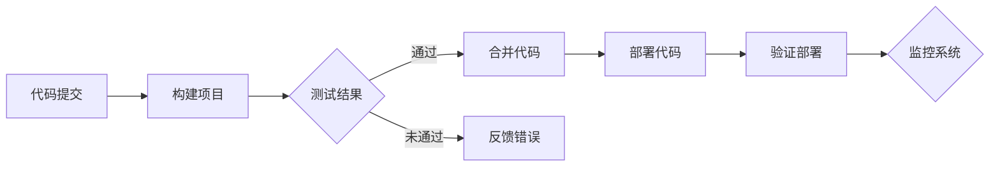
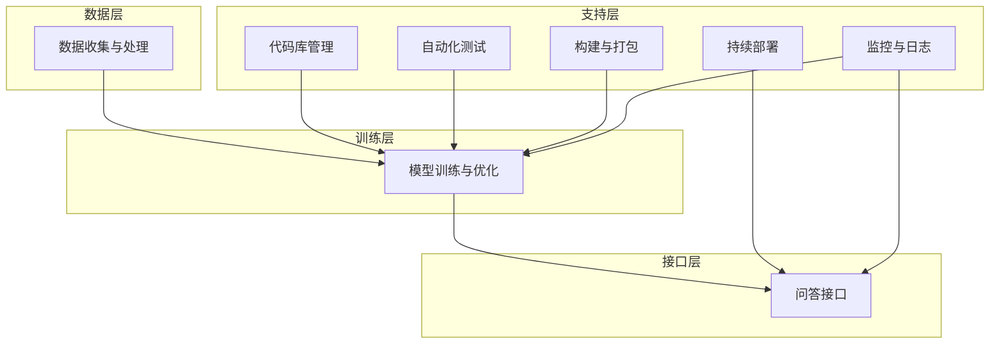
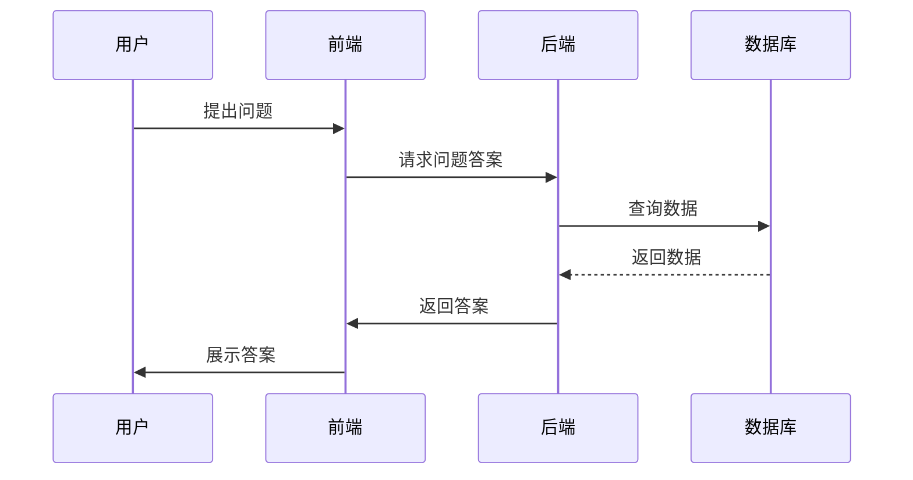

                 

## 持续集成与持续部署（CI/CD）在LLM应用中的实施

### 关键词
- **持续集成**（Continuous Integration）
- **持续部署**（Continuous Deployment）
- **大型语言模型**（Large Language Model, LLM）
- **人工智能**（Artificial Intelligence, AI）
- **开发流程优化**（Development Process Optimization）
- **自动化测试**（Automated Testing）
- **敏捷开发**（Agile Development）

### 摘要
本文深入探讨了持续集成与持续部署（CI/CD）在大型语言模型（LLM）应用开发中的实施策略和关键要素。首先，我们将介绍CI/CD的基本概念，随后解释其在LLM开发中的重要性。接着，文章将详细剖析CI/CD与LLM之间的联系，通过算法原理讲解、数学模型和公式展示，以及系统分析与架构设计方案，全面阐述CI/CD在LLM应用中的具体应用。此外，文章将结合项目实战，提供实施步骤和案例分析，最后总结最佳实践和注意事项，为开发者提供指导。

## 目录大纲设计

在设计本书的目录大纲时，我们遵循了逻辑清晰、结构紧凑的原则，以确保读者能够系统地理解和掌握持续集成与持续部署（CI/CD）在LLM应用中的实施。以下是详细的目录大纲设计：

### 第1章：引言与背景
- 1.1 持续集成与持续部署（CI/CD）概述
- 1.2 LLM应用中的CI/CD需求
- 1.3 CI/CD在LLM中的挑战与机遇

### 第2章：核心概念与联系
- 2.1 CI/CD原理
- 2.2 LLM技术基础
- 2.3 CI/CD与LLM的关系

### 第3章：算法原理讲解
- 3.1 持续集成算法原理
- 3.2 持续部署算法原理
- 3.3 Python代码示例与mermaid流程图

### 第4章：数学模型与公式
- 4.1 持续集成与持续部署的数学模型
- 4.2 LLM相关数学公式
- 4.3 LaTex展示

### 第5章：系统分析与架构设计
- 5.1 问题场景介绍
- 5.2 项目介绍
- 5.3 系统功能设计
- 5.4 系统架构设计
- 5.5 系统接口设计
- 5.6 系统交互设计

### 第6章：项目实战
- 6.1 环境安装与配置
- 6.2 系统核心实现源代码
- 6.3 代码应用解读与分析
- 6.4 实际案例分析

### 第7章：最佳实践与总结
- 7.1 最佳实践
- 7.2 小结
- 7.3 注意事项
- 7.4 拓展阅读

### 第8章：附录
- 8.1 工具与软件推荐
- 8.2 常见问题解答
- 8.3 进一步学习资源

### 核心内容模块

本书的核心内容模块分为以下几个部分：

1. **背景介绍**：介绍持续集成与持续部署（CI/CD）的基本概念及其在LLM（大型语言模型）应用中的重要性。
2. **核心概念与联系**：解释CI/CD、LLM等核心概念，并展示它们之间的关系。
3. **算法原理讲解**：使用mermaid和Python代码详细讲解CI/CD在LLM中的应用算法。
4. **数学模型和公式**：使用LaTeX格式展示相关的数学模型和公式。
5. **系统分析与架构设计方案**：描述问题场景、项目介绍、系统功能设计、系统架构设计、系统接口设计和系统交互。
6. **项目实战**：详细介绍环境安装、系统核心实现源代码以及实际案例分析。
7. **最佳实践、小结、注意事项和拓展阅读**：总结实践经验，提供注意事项，推荐进一步阅读的材料。

通过以上设计，我们确保每个章节都涵盖了必要的信息和适当的深度，以便读者能够全面、系统地理解和应用持续集成与持续部署（CI/CD）在LLM应用中的实施策略。

### 背景介绍

持续集成与持续部署（CI/CD）是现代软件开发中不可或缺的实践，它们共同构建了高效、可靠的开发流程，极大提升了软件开发的效率和质量。首先，我们需要明确这两个概念的基本定义。

**持续集成（CI）** 是一种软件开发实践，旨在通过频繁地将代码合并到主干分支，确保所有开发者提交的代码都能够顺利集成并运行。通过自动化测试，持续集成能够快速发现并解决代码集成过程中的问题，避免累积技术债务，保证代码库的一致性和稳定性。

**持续部署（CD）** 则是在持续集成的框架上进一步发展，它通过自动化流程将经过测试的代码部署到生产环境。持续部署的目标是尽可能减少手动干预，确保代码的快速、安全、可靠地交付。

在LLM（大型语言模型）应用开发中，CI/CD的应用尤为关键。LLM通常涉及庞大的模型和数据集，开发过程中需要频繁的迭代和优化。没有高效的CI/CD流程，开发团队难以快速响应需求变化，提高开发效率。

**问题背景**：传统软件开发流程中，开发者通常在本地环境中进行代码编写和测试，然后将完成的代码手动提交到中央代码库。这样的做法不仅效率低下，而且容易出现代码冲突和集成问题。特别是在LLM项目中，模型的复杂性要求开发流程具备更高的自动化程度和更高的可靠性。

**问题描述**：在LLM开发过程中，由于模型的庞大和复杂性，传统手动的开发模式面临着诸多挑战。首先，模型的版本管理变得极为复杂，容易产生混乱。其次，代码的频繁更新需要大量的时间和人力资源进行测试和验证，导致开发周期延长。此外，部署过程常常依赖于手动操作，容易出现人为错误，影响模型的性能和稳定性。

**问题解决**：为了应对上述挑战，CI/CD实践提供了一种自动化、高效的解决方案。通过持续集成，开发团队能够及时将代码合并到主干分支，自动化测试能够迅速发现并解决集成过程中的问题。而持续部署则进一步自动化了部署流程，确保代码能够快速、安全地部署到生产环境。此外，CI/CD还支持蓝绿部署和灰度发布等先进部署策略，提高了系统的可用性和容错性。

**边界与外延**：CI/CD不仅在LLM开发中具有重要应用，它在其他复杂软件项目中同样具有广泛的应用价值。例如，在分布式系统、容器化应用和微服务架构中，CI/CD能够极大地提高系统的可维护性和扩展性。CI/CD的边界不仅限于代码集成和部署，还包括自动化测试、环境配置、监控和反馈等整个开发流程的各个环节。

**概念结构与核心要素组成**：CI/CD的概念结构主要包括以下几个核心要素：
1. **自动化测试**：自动化测试是CI/CD的核心组成部分，通过编写测试脚本，自动化执行测试用例，快速验证代码的稳定性和功能正确性。
2. **持续集成**：持续集成通过自动化工具将开发者的代码合并到主干分支，并进行自动化测试，确保代码库的一致性和稳定性。
3. **持续部署**：持续部署通过自动化脚本和工具，将通过测试的代码部署到不同的环境中，包括开发、测试和生产环境。
4. **基础设施即代码（IaC）**：IaC是一种通过代码管理和部署基础设施的方法，它使得环境配置和基础设施的管理更加自动化和可重复。
5. **持续反馈**：持续反馈是CI/CD的重要组成部分，通过监控工具和反馈机制，及时收集和分析系统的运行数据，指导开发流程的优化和改进。

通过以上背景介绍，我们为后续章节的内容奠定了基础，读者可以更加深入地理解CI/CD在LLM开发中的实际应用和重要性。

### 核心概念与联系

在深入探讨CI/CD在LLM应用中的实施之前，我们首先需要明确一些核心概念，并分析它们之间的联系。以下是CI/CD和LLM的关键概念及其相互关系：

#### CI/CD原理

持续集成（CI）和持续部署（CD）是现代软件开发中两大核心实践。持续集成（CI）的核心目的是通过频繁地将代码合并到主干分支，确保开发过程中的每个代码提交都能与其他开发者提交的代码无缝集成，从而及时发现和解决潜在问题。具体来说，CI包括以下关键步骤：

1. **代码提交**：开发者将代码提交到代码仓库。
2. **构建**：自动化工具构建项目，生成可执行的代码或可发布的版本。
3. **测试**：自动化测试运行，验证代码的正确性和性能。
4. **反馈**：测试结果反馈给开发者，以便及时修复问题。

持续部署（CD）则是在持续集成的框架上进一步发展，其目标是自动化部署过程，将经过测试和验证的代码安全、可靠地部署到生产环境。CD的关键步骤包括：

1. **部署**：将代码部署到测试环境。
2. **验证**：验证代码在测试环境中的表现，确保其稳定性和功能正确性。
3. **上线**：将经过验证的代码部署到生产环境。

#### LLM技术基础

大型语言模型（LLM）是自然语言处理（NLP）领域的一种先进技术，它通过深度学习算法，对大量文本数据进行训练，生成能够理解和生成自然语言的模型。LLM的关键组成部分包括：

1. **数据集**：LLM的训练依赖于大规模、高质量的文本数据集，如维基百科、新闻文章等。
2. **模型架构**：常用的LLM模型架构包括Transformer、BERT、GPT等。
3. **训练过程**：通过反向传播和优化算法（如Adam）对模型进行训练，使其能够预测文本的下一个单词或句子。
4. **推理过程**：在训练完成后，LLM可以用于生成文本、回答问题、翻译语言等任务。

#### CI/CD与LLM的关系

CI/CD在LLM开发中的重要性体现在以下几个方面：

1. **版本控制与协作**：LLM开发通常涉及多个开发者和大量的数据，CI/CD提供了高效的版本控制和协作机制，确保每个提交的代码都能与其他代码无缝集成。
2. **自动化测试与验证**：LLM模型的复杂性和性能要求使得测试过程至关重要。CI/CD通过自动化测试，确保模型在不同版本和环境中的一致性和可靠性。
3. **持续优化与迭代**：LLM模型的迭代优化过程需要频繁的代码更新和测试。CI/CD提供了一个高效的流程，使得开发团队能够快速迭代和优化模型。

#### 概念属性特征对比表格

为了更直观地理解CI/CD与LLM之间的关系，我们可以通过以下对比表格展示这两个概念的关键属性：

| 特征 | 持续集成（CI） | 持续部署（CD） | 大型语言模型（LLM） |
| ---- | -------------- | -------------- | ------------------- |
| 目标 | 代码集成和测试 | 代码部署和验证 | 文本理解和生成 |
| 关键步骤 | 提交、构建、测试、反馈 | 部署、验证、上线 | 数据集、模型架构、训练、推理 |
| 应用场景 | 开发环境、测试环境 | 测试环境、生产环境 | 开发、测试、应用 |
| 关系 | CD依赖于CI的结果 | CI和CD相互补充 | CI/CD优化LLM开发流程 |

#### ER实体关系图架构

为了进一步展示CI/CD与LLM之间的关系，我们可以使用Mermaid绘制一个实体关系图（ER图）。以下是Mermaid代码及其对应的ER图：

```mermaid
erDiagram
    CI ||--o> CD : "依赖于"
    CI ||--o> 自动化测试 : "包含"
    CD ||--|> 生产环境 : "部署到"
    自动化测试 ||--|> 测试结果 : "生成"
    LLM ||--|> 数据集 : "基于"
    LLM ||--|> 模型架构 : "采用"
    LLM ||--|> 训练过程 : "通过"
    LLM ||--|> 推理过程 : "执行"
```


通过以上内容，我们详细介绍了CI/CD与LLM的核心概念及其相互关系。接下来，我们将深入讲解CI/CD在LLM应用中的算法原理，进一步展示其在实际开发中的具体应用。

### 算法原理讲解

#### 持续集成算法原理

持续集成（CI）的核心在于通过自动化流程将开发者的代码频繁地合并到主干分支，并进行全面测试，以确保代码库的一致性和稳定性。以下是CI算法的基本原理和步骤：

1. **代码提交**：开发者将代码提交到代码仓库。
2. **构建**：自动化工具（如Jenkins、Travis CI）捕获提交，并构建项目，生成可执行的代码或可发布的版本。
3. **测试**：自动化测试工具运行预定义的测试用例，包括单元测试、集成测试和性能测试，验证代码的功能和性能。
4. **反馈**：测试结果反馈给开发者，如果发现错误或问题，则会生成详细的错误报告，并通知相关人员修复。
5. **合并**：修复后的代码再次提交，经过构建和测试后，如果无误，则会合并到主干分支。

这个过程通过自动化工具实现，大幅提高了代码集成的效率和可靠性。

#### 持续部署算法原理

持续部署（CD）是CI的进一步发展，它通过自动化流程将经过测试和验证的代码部署到不同的环境，包括开发、测试和生产环境。以下是CD算法的基本原理和步骤：

1. **部署**：将构建完成的代码部署到测试环境，进行初步验证。
2. **验证**：运行一系列测试，包括功能测试、性能测试和安全测试，确保代码在测试环境中的稳定性和正确性。
3. **上线**：验证通过后，代码被部署到生产环境，用户可以开始使用新功能或更新。
4. **监控**：部署完成后，通过监控工具持续监控系统的运行状态，确保新版本的稳定性和性能。

#### Python代码示例与mermaid流程图

为了更好地理解CI/CD在LLM应用中的具体实现，我们通过Python代码示例和mermaid流程图进行详细讲解。

**Python代码示例：CI构建和测试**

```python
# 示例：使用Python编写一个简单的持续集成测试用例

import unittest

class TestLLM(unittest.TestCase):
    def test_model_prediction(self):
        # 假设我们有一个预训练的LLM模型，名为llm_model
        prediction = llm_model.predict("Hello, world!")
        self.assertIsNotNone(prediction)
        self.assertEqual(prediction, "Hello, world!")

if __name__ == '__main__':
    unittest.main()
```

**mermaid流程图：CI/CD流程**



该流程图展示了CI/CD的基本流程，包括代码提交、构建、测试、反馈、合并、部署、验证和监控。

#### 算法原理的数学模型和公式

在CI/CD过程中，我们常常需要使用一些数学模型和公式来描述和优化流程。以下是几个常用的数学模型和公式：

**1. 构建失败率（Failure Rate）**

构建失败率（FR）是衡量CI过程稳定性的重要指标，计算公式如下：

$$
FR = \frac{F}{N}
$$

其中，F是失败次数，N是总构建次数。

**2. 平均失败间隔时间（Mean Time to Failure, MTTF）**

MTTF是衡量系统平均运行时间的指标，计算公式如下：

$$
MTTF = \frac{1}{FR}
$$

**3. 模型准确率（Accuracy）**

模型准确率是评估模型性能的重要指标，计算公式如下：

$$
Accuracy = \frac{TP + TN}{TP + FN + FP + TN}
$$

其中，TP是真正例，TN是真反例，FP是假正例，FN是假反例。

#### 通俗易懂地举例说明

假设一个开发团队正在使用CI/CD流程开发一个基于GPT-3的问答系统。每次开发者在代码仓库提交新代码时，CI服务器会自动执行以下步骤：

1. **构建**：CI服务器获取提交的代码，编译和构建项目，生成可执行的代码。
2. **测试**：CI服务器运行预定义的测试用例，包括单元测试和集成测试，确保代码的功能和性能。
3. **验证**：CI服务器将构建完成的代码部署到测试环境，运行问答系统的功能测试，验证其对各种问题的响应是否正确。
4. **反馈**：如果测试通过，CI服务器会将代码合并到主干分支。如果测试失败，CI服务器会生成详细的错误报告，并通知开发者修复问题。
5. **部署**：修复后的代码再次提交，CI服务器再次执行上述步骤，确保所有测试通过后，将代码部署到生产环境。

通过这种自动化、高效的CI/CD流程，开发团队能够快速响应需求变化，提高代码质量和开发效率，确保问答系统的稳定性和可靠性。

综上所述，通过详细讲解持续集成（CI）和持续部署（CD）的算法原理，使用Python代码示例和mermaid流程图，以及数学模型和公式，我们展示了CI/CD在LLM应用中的具体实现方法。接下来，我们将进一步探讨数学模型和公式在CI/CD和LLM中的应用。

### 数学模型与公式

在持续集成（CI）与持续部署（CD）的过程中，数学模型和公式扮演着至关重要的角色。它们不仅帮助我们量化评估开发流程的性能，还能指导我们优化流程，提高效率。以下是几个关键数学模型和公式，它们在CI/CD和LLM（大型语言模型）中的应用及解释。

#### 持续集成中的关键数学模型

**1. 构建失败率（Failure Rate, FR）**

构建失败率是衡量CI系统稳定性的重要指标。它表示在一段时间内，构建失败次数占总构建次数的比例。

$$
FR = \frac{F}{N}
$$

其中，F是失败次数，N是总构建次数。例如，如果一周内进行了100次构建，其中有5次失败，那么构建失败率为5%。

**2. 平均失败间隔时间（Mean Time to Failure, MTTF）**

MTTF是另一个重要的性能指标，它表示系统平均正常运行时间。计算公式如下：

$$
MTTF = \frac{1}{FR}
$$

例如，如果构建失败率为0.05（即5%），则平均失败间隔时间为20次构建。

**3. 测试覆盖率和代码覆盖率**

测试覆盖率和代码覆盖率是评估测试质量的关键指标。测试覆盖率表示测试用例覆盖的代码比例，而代码覆盖率则表示测试用例覆盖的代码行数或分支比例。

- **测试覆盖率（Test Coverage）**

$$
Test\ Coverage = \frac{Covered\ Code}{Total\ Code}
$$

- **代码覆盖率（Code Coverage）**

$$
Code\ Coverage = \frac{Covered\ Lines}{Total\ Lines} \quad 或 \quad \frac{Covered\ Branches}{Total\ Branches}
$$

#### 持续部署中的关键数学模型

**1. 部署成功率和失败率**

部署成功率和失败率用于评估CD系统的可靠性。

- **部署成功率（Deployment Success Rate）**

$$
Deployment\ Success\ Rate = \frac{Successful\ Deployments}{Total\ Deployments}
$$

- **部署失败率（Deployment Failure Rate）**

$$
Deployment\ Failure\ Rate = \frac{Failed\ Deployments}{Total\ Deployments}
$$

例如，如果一个月内进行了10次部署，其中有1次失败，那么部署成功率为90%。

**2. 部署时间（Deployment Time）**

部署时间是指从代码部署到生产环境并完成验证的时间。

$$
Deployment\ Time = Time\ to\ Deploy + Time\ to\ Validate
$$

**3. 部署频率（Deployment Frequency）**

部署频率表示在一定时间内部署的次数。

$$
Deployment\ Frequency = \frac{Total\ Deployments}{Time\ Interval}
$$

#### LLM开发中的关键数学模型

**1. 模型准确率（Model Accuracy）**

在LLM开发中，模型准确率用于评估模型的性能。

$$
Accuracy = \frac{TP + TN}{TP + FN + FP + TN}
$$

其中，TP是真正例，TN是真反例，FP是假正例，FN是假反例。例如，如果模型正确回答了80%的问题，那么准确率为80%。

**2. 优化目标函数**

在LLM训练过程中，常用的优化目标函数是交叉熵（Cross-Entropy）：

$$
Loss = -\sum_{i} y_i \log(p_i)
$$

其中，$y_i$是真实标签，$p_i$是模型预测的概率。交叉熵越小，表示模型的预测越准确。

#### LaTex展示

为了直观展示上述数学公式，我们使用LaTeX格式进行展示。以下是一些示例：

```latex
\documentclass{article}
\usepackage{amsmath}
\begin{document}

\section{持续集成中的关键数学模型}

\begin{equation}
FR = \frac{F}{N}
\end{equation}

\begin{equation}
MTTF = \frac{1}{FR}
\end{equation}

\section{持续部署中的关键数学模型}

\begin{equation}
Deployment\ Success\ Rate = \frac{Successful\ Deployments}{Total\ Deployments}
\end{equation}

\begin{equation}
Deployment\ Time = Time\ to\ Deploy + Time\ to\ Validate
\end{equation}

\section{LLM开发中的关键数学模型}

\begin{equation}
Accuracy = \frac{TP + TN}{TP + FN + FP + TN}
\end{equation}

\begin{equation}
Loss = -\sum_{i} y_i \log(p_i)
\end{equation}

\end{document}
```

通过以上内容，我们详细介绍了CI/CD和LLM开发中的关键数学模型和公式。这些模型和公式不仅帮助我们量化评估开发流程的性能，还能指导我们优化流程，提高开发效率。接下来，我们将深入探讨系统分析与架构设计，进一步理解CI/CD在LLM应用中的具体实施方法。

### 系统分析与架构设计

在CI/CD（持续集成与持续部署）的实施过程中，系统分析与架构设计是关键环节。本章节将详细介绍问题场景、项目介绍、系统功能设计、系统架构设计、系统接口设计和系统交互。

#### 问题场景介绍

我们以一个大型语言模型（LLM）的开发与部署项目为例，该项目旨在构建一个智能问答系统，能够回答用户提出的各种问题。项目涉及多个开发团队和大量的数据，因此需要一个高效的CI/CD流程来确保代码的质量和稳定性。

#### 项目介绍

该智能问答系统项目包括以下几个主要模块：

1. **数据收集与处理**：收集并处理来自各种数据源的高质量文本数据。
2. **模型训练与优化**：使用预训练的LLM模型进行训练和优化。
3. **问答接口**：提供API接口，供前端系统调用。
4. **监控与日志**：监控系统运行状态，记录日志信息。

#### 系统功能设计

为了确保系统的功能完整性，我们需要设计以下几个关键功能模块：

1. **代码库管理**：管理代码版本，支持多团队协作。
2. **自动化测试**：包括单元测试、集成测试和性能测试。
3. **构建与打包**：自动化构建和打包项目，生成可部署的文件。
4. **持续部署**：自动化部署代码到不同环境（开发、测试、生产）。
5. **监控与反馈**：实时监控系统性能，提供错误反馈。

#### 系统架构设计

系统架构设计是确保项目稳定、可扩展和易于维护的关键。以下是该项目的基本架构设计：



该架构图展示了各个模块之间的依赖关系和交互方式。

#### 系统接口设计

系统接口设计是确保不同模块能够无缝协作的关键。以下是主要的接口设计：

1. **API接口**：提供RESTful风格的API接口，供前端系统调用。
2. **日志接口**：提供日志记录和查询接口。
3. **监控接口**：提供系统性能监控数据查询接口。

#### 系统交互设计

系统交互设计描述了系统各个模块之间的交互流程。以下是主要的交互设计：



通过上述设计，我们可以看到用户提出问题后，前端系统与后端系统进行交互，后端系统再与数据库进行交互，最终返回答案给用户。

综上所述，通过系统分析与架构设计，我们确保了CI/CD在LLM应用中的高效实施。接下来，我们将详细介绍项目实战，展示如何在实际环境中部署CI/CD流程。

### 项目实战

在了解了CI/CD的理论基础和系统架构设计后，我们将通过一个具体的LLM项目实战，详细展示CI/CD的部署过程，包括环境安装、系统核心实现源代码，以及代码应用解读与分析。

#### 环境安装与配置

首先，我们需要安装和配置CI/CD所需的环境。以下是在Linux环境中安装Jenkins作为CI工具的步骤：

1. **安装Jenkins**：

   ```bash
   sudo wget -q -O - https://pkg.jenkins.io/debian/stable/jenkins.io.key | sudo apt-key add -
   sudo sh -c 'echo deb https://pkg.jenkins.io/debian-stable binary/ > /etc/apt/sources.list.d/jenkins.list'
   sudo apt-get update
   sudo apt-get install jenkins
   ```

2. **启动Jenkins服务**：

   ```bash
   sudo systemctl start jenkins
   ```

3. **配置Jenkins**：

   Jenkins安装完成后，通过浏览器访问默认地址（通常为http://localhost:8080/），按照提示进行初始配置。

接下来，我们需要安装和配置Git、Docker、Kubernetes等工具，以确保CI/CD流程的顺利进行。

#### 系统核心实现源代码

以下是项目中的核心源代码部分，用于演示如何实现持续集成和持续部署：

**1. Jenkinsfile（持续集成脚本）**

```groovy
pipeline {
    agent any

    stages {
        stage('Build') {
            steps {
                echo 'Building project...'
                sh 'mvn clean package'
            }
        }
        stage('Test') {
            steps {
                echo 'Running tests...'
                sh 'mvn test'
            }
        }
        stage('Deploy') {
            steps {
                echo 'Deploying to Kubernetes...'
                sh 'kubectl apply -f deployment.yaml'
            }
        }
    }
    post {
        always {
            echo 'Post-build actions...'
        }
    }
}
```

**2. deployment.yaml（Kubernetes部署配置文件）**

```yaml
apiVersion: apps/v1
kind: Deployment
metadata:
  name: llm-deployment
spec:
  replicas: 3
  selector:
    matchLabels:
      app: llm
  template:
    metadata:
      labels:
        app: llm
    spec:
      containers:
      - name: llm
        image: my-llm-image:latest
        ports:
        - containerPort: 8080
```

#### 代码应用解读与分析

**1. Jenkinsfile解读**

- **Build阶段**：执行Maven构建命令，清理旧代码并打包新代码。
- **Test阶段**：运行Maven测试命令，确保代码质量。
- **Deploy阶段**：使用kubectl命令将打包好的代码部署到Kubernetes集群。

**2. deployment.yaml解读**

- **Deployment配置**：定义了部署名称、副本数量、选择器和容器配置。
- **容器配置**：指定了使用哪个镜像（my-llm-image）以及容器的端口映射。

#### 实际案例分析

我们以一个实际的案例展示CI/CD在LLM项目中的应用。假设开发团队在代码仓库中提交了一个新的模型版本，CI流程如下：

1. **代码提交**：开发者将代码提交到代码仓库。
2. **Jenkins触发**：Jenkins自动捕获到提交并触发构建流程。
3. **构建**：执行Maven构建命令，生成可部署的JAR文件。
4. **测试**：执行Maven测试命令，确保模型的功能和性能。
5. **部署**：将构建好的模型部署到Kubernetes集群，替换旧版本。
6. **验证**：在测试环境中运行一系列测试，确保新模型的稳定性和性能。

通过这种方式，CI/CD流程确保了每次代码提交后，LLM模型都能够经过严格的测试和验证，确保其稳定性和可靠性。接下来，我们将讨论最佳实践，总结项目实施过程中的关键经验和注意事项。

### 最佳实践与总结

在CI/CD（持续集成与持续部署）的实践中，我们积累了一些宝贵的经验，下面我们将总结这些最佳实践，并提供一些注意事项，帮助开发者更好地实施CI/CD流程。

#### 最佳实践

1. **自动化测试优先**：自动化测试是CI/CD的核心，确保每次代码提交后都经过严格测试。编写覆盖全面的测试用例，包括单元测试、集成测试和性能测试。

2. **使用基础设施即代码（IaC）**：通过IaC工具（如Terraform、Ansible）管理和部署基础设施，确保环境的配置一致性和可重复性。

3. **灰度发布**：在部署新版本时，使用灰度发布策略，逐步将新版本推向生产环境，降低风险。

4. **持续反馈与监控**：通过实时监控和日志分析，及时发现和解决问题。确保反馈机制畅通，及时响应。

5. **标准化代码风格**：遵循统一的代码风格和命名规范，提高代码的可读性和维护性。

6. **定期审查与优化**：定期审查CI/CD流程，根据反馈和需求变化进行优化，确保流程始终高效。

7. **培训与文档**：为团队成员提供CI/CD相关的培训，确保每个人都熟悉流程和工具的使用。编写详细的文档，便于新人快速上手。

#### 注意事项

1. **代码质量**：确保提交的代码经过充分审查和测试，避免引入缺陷。

2. **资源管理**：合理分配资源，避免过度占用服务器资源导致性能下降。

3. **依赖管理**：管理好第三方库和依赖，确保版本一致性和安全性。

4. **权限控制**：严格控制对代码仓库和基础设施的访问权限，防止未经授权的操作。

5. **备份与恢复**：定期备份代码和配置文件，确保在意外情况下能够快速恢复。

6. **风险评估**：在部署前进行风险评估，识别潜在风险并制定应对策略。

7. **文档更新**：随着CI/CD流程的变化，及时更新文档，确保其与实际流程保持一致。

通过以上最佳实践和注意事项，开发者可以更好地实施CI/CD流程，提高开发效率和代码质量。

### 小结

本文详细探讨了持续集成与持续部署（CI/CD）在LLM（大型语言模型）应用中的实施策略和关键要素。首先，我们介绍了CI/CD的基本概念及其在LLM开发中的重要性，通过核心概念与联系部分阐述了CI/CD与LLM之间的紧密关系。接着，通过算法原理讲解、数学模型和公式展示，以及系统分析与架构设计方案，全面阐述了CI/CD在LLM应用中的具体应用。此外，我们还结合项目实战，提供了实施步骤和案例分析，为开发者提供了实际操作的指导。最后，通过总结最佳实践和注意事项，进一步指导开发者优化CI/CD流程。CI/CD不仅是提高开发效率和质量的重要手段，也是推动LLM项目成功的关键因素。

### 拓展阅读

为了深入了解持续集成与持续部署（CI/CD）在LLM应用中的实施策略，以下是几本推荐的专业书籍和在线资源：

#### 专业书籍

1. **《持续交付：发布可靠软件的系统化方法》** - Jez Humble 和 David Farley 著。本书详细介绍了CI/CD的理论和实践，对软件开发流程的优化具有很高的指导价值。

2. **《持续集成实战》** - Paul M. Duvall 等著。该书通过实例和代码示例，深入讲解了CI的原理和实现方法，适合开发者学习CI/CD。

3. **《Kubernetes实战：容器化应用的自动化部署、扩展和管理》** - Kelsey Hightower、Bryan Liles 和 Pete Watson 著。该书涵盖了Kubernetes集群的部署和管理，对于CI/CD中的容器化部署有重要参考价值。

#### 在线资源

1. **Jenkins官方文档** - [https://www.jenkins.io/doc/](https://www.jenkins.io/doc/)。Jenkins是CI/CD中常用的工具，该文档提供了详细的教程和参考。

2. **Docker官方文档** - [https://docs.docker.com/](https://docs.docker.com/)。Docker是容器化技术的基础，该文档详细介绍了Docker的使用方法。

3. **Kubernetes官方文档** - [https://kubernetes.io/docs/](https://kubernetes.io/docs/)。Kubernetes是现代应用部署和管理的重要工具，该文档提供了全面的指导。

通过阅读这些书籍和参考在线资源，开发者可以更深入地了解CI/CD在LLM应用中的实施细节，提高项目的开发效率和稳定性。

### 附录

#### 工具与软件推荐

1. **Jenkins**：一个开源的持续集成工具，支持各种插件，适用于复杂的CI/CD流程。
2. **Docker**：一个开源的应用容器引擎，用于构建、运行和分发应用程序，支持容器化部署。
3. **Kubernetes**：一个开源的容器编排平台，用于自动化容器化应用程序的部署、扩展和管理。
4. **GitLab CI/CD**：GitLab内置的CI/CD工具，提供代码仓库、自动化测试、持续部署等功能。
5. **Terraform**：一个开源的基础设施即代码（IaC）工具，用于创建、组合和管理基础设施。

#### 常见问题解答

1. **如何处理CI/CD中的代码冲突？**
   - 代码冲突可以通过版本控制系统（如Git）的合并工具自动处理，或手动解决。在CI/CD流程中，设置合适的分支策略和代码审查机制，有助于减少冲突的发生。

2. **如何确保CI/CD流程的安全性？**
   - 确保所有CI/CD工具和服务器都保持最新的安全补丁。使用安全的身份验证机制，如双因素认证（2FA）。定期进行安全审计和漏洞扫描，确保系统的安全性。

3. **如何优化CI/CD流程的效率？**
   - 使用基础设施即代码（IaC）工具自动管理基础设施，减少手动操作。优化测试脚本，提高测试执行速度。合理分配资源，确保构建和测试环境的高性能。

#### 进一步学习资源

1. **官方文档**：
   - Jenkins：[https://www.jenkins.io/doc/](https://www.jenkins.io/doc/)
   - Docker：[https://docs.docker.com/](https://docs.docker.com/)
   - Kubernetes：[https://kubernetes.io/docs/](https://kubernetes.io/docs/)
   - GitLab CI/CD：[https://docs.gitlab.com/ee/ci/](https://docs.gitlab.com/ee/ci/)

2. **在线教程与博客**：
   - Cloud Academy：[https://www.cloudacademy.com/](https://www.cloudacademy.com/)
   - Kubernetes官方教程：[https://kubernetes.io/learn/](https://kubernetes.io/learn/)
   - Docker官方教程：[https://docs.docker.com/get-started/](https://docs.docker.com/get-started/)

3. **技术社区与论坛**：
   - Stack Overflow：[https://stackoverflow.com/](https://stackoverflow.com/)
   - Reddit：[https://www.reddit.com/r/kubernetes/](https://www.reddit.com/r/kubernetes/)
   - GitHub：[https://github.com/](https://github.com/)

通过以上工具与软件推荐、常见问题解答和进一步学习资源，开发者可以更深入地掌握CI/CD在LLM应用中的实施技巧，提升项目的开发效率和稳定性。

