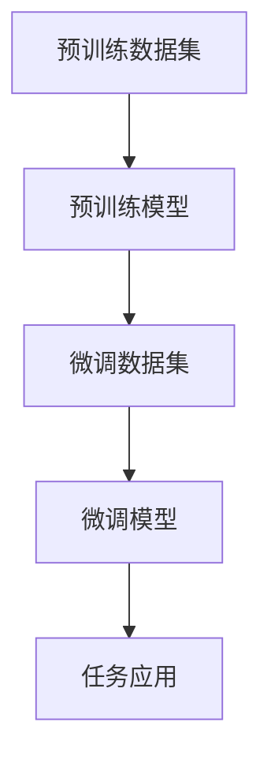
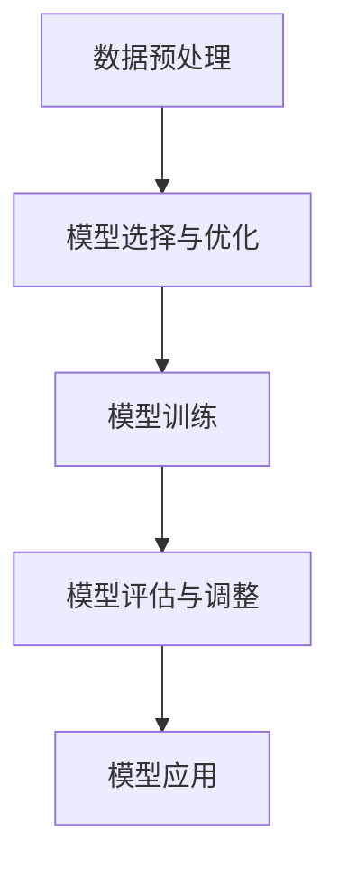
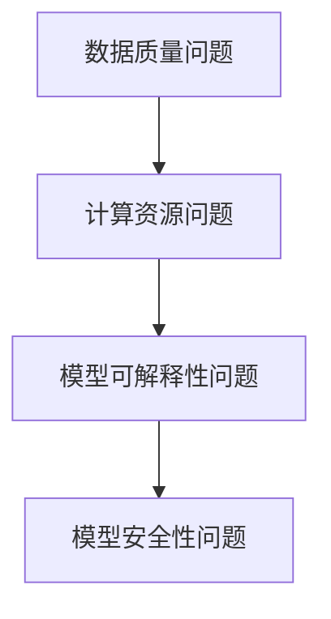
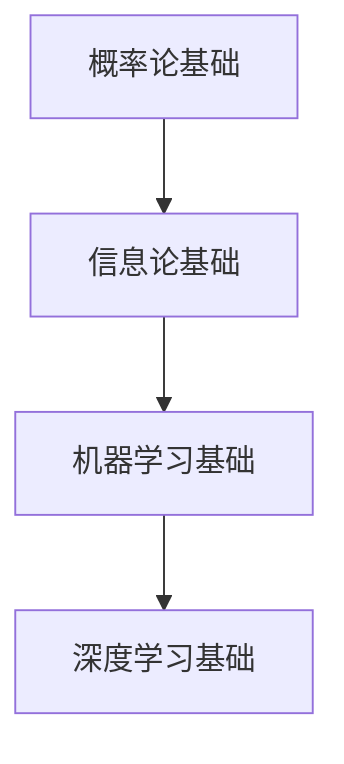
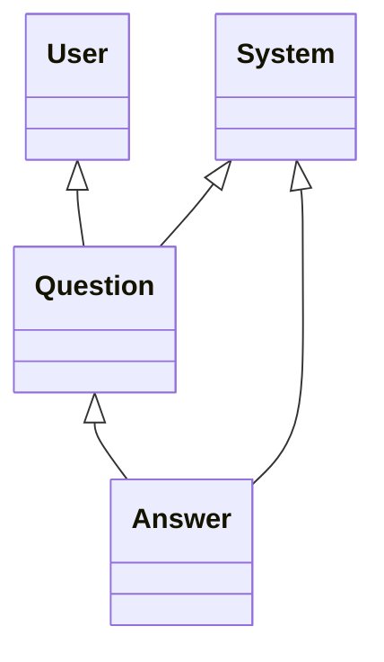
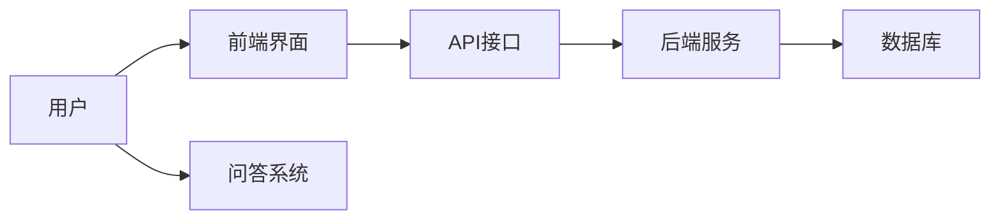
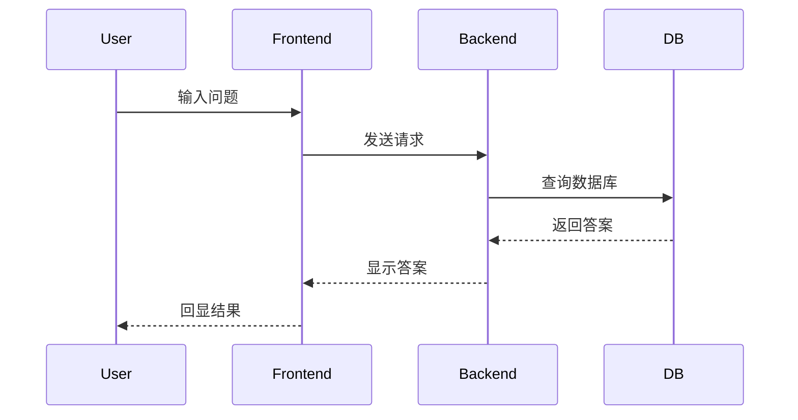

                 


**第1章：大型语言模型（LLM）概述**

**1.1 核心概念术语说明**

在介绍LLM之前，我们先明确一些核心概念术语：

- **自然语言处理（NLP）**：计算机科学领域，专注于使计算机能够理解、解释和生成人类语言。
- **深度学习**：一种机器学习技术，使用多层神经网络对数据进行建模和学习。
- **神经网络**：一种模仿生物神经系统的计算模型。
- **Transformer**：一种基于自注意力机制的深度学习模型，广泛应用于NLP任务。
- **预训练**：在特定任务上进行大规模预训练，然后在小规模任务上微调。
- **微调**：在预训练的基础上，针对特定任务进行微调，以提升性能。

**1.2 问题背景**

随着互联网的普及，大量的文本数据被产生和积累。如何有效地处理和利用这些数据，成为了一个重要的研究方向。传统的NLP方法通常依赖于手工设计的特征，而深度学习为NLP带来了新的契机。特别是Transformer模型的出现，使得NLP任务的性能得到了大幅提升。

**1.3 问题描述**

在NLP领域，任务种类繁多，如文本分类、情感分析、机器翻译、问答系统等。然而，大多数任务都面临着一个共同的问题：如何从大量的无结构文本数据中提取出有用的信息，并生成高质量的输出。

**1.4 问题解决**

LLM通过深度学习技术，特别是Transformer模型，对大量文本数据进行预训练，从而学习到语言的本质规律。在预训练的基础上，LLM可以针对特定任务进行微调，以实现高性能的文本处理。

**1.5 边界与外延**

LLM的研究和应用还面临一些挑战，如数据隐私、计算资源、模型可解释性等。未来的研究将关注如何在保护数据隐私的前提下，提高模型的计算效率和可解释性。

**1.6 概念结构与核心要素组成**

LLM的核心结构包括以下几个要素：

- **预训练数据集**：大规模、多样的文本数据集，用于模型的预训练。
- **预训练模型**：基于Transformer的深度学习模型，经过预训练后具有强大的语言理解能力。
- **微调数据集**：针对特定任务的细粒度数据集，用于模型的微调。
- **微调模型**：在预训练模型的基础上，针对特定任务进行微调的模型。

**Mermaid流程图：LLM核心概念与联系**



**第2章：提升LLM应用开发效率的核心概念**

**2.1 数据预处理**

数据预处理是LLM应用开发的重要环节。有效的数据预处理可以提升模型性能，降低计算成本。

- **文本清洗**：去除无用的符号、标点、停用词等。
- **分词**：将文本分解为单词或子词。
- **词向量化**：将文本转化为向量表示。

**2.2 模型选择与优化**

选择合适的模型架构和优化策略对于提升LLM应用开发效率至关重要。

- **模型架构**：如BERT、GPT、RoBERTa等。
- **优化策略**：如AdamW优化器、Layer Normalization等。

**2.3 模型训练**

模型训练是LLM应用开发的核心步骤。有效的训练策略可以提升模型性能。

- **批量大小**：影响模型训练的稳定性和收敛速度。
- **学习率**：影响模型收敛的速度和质量。
- **训练轮次**：决定模型训练的深度和广度。

**2.4 模型评估与调整**

模型评估与调整是确保LLM应用开发效率的关键环节。

- **评估指标**：如准确率、召回率、F1分数等。
- **调整策略**：如超参数调优、数据增强等。

**Mermaid流程图：LLM应用开发流程**



**第3章：LLM应用中的挑战与解决方案**

**3.1 数据质量问题**

数据质量直接影响LLM的性能和应用效果。

- **挑战**：数据缺失、噪声、重复、不一致等。
- **解决方案**：数据清洗、数据增强、数据集成等。

**3.2 计算资源问题**

LLM模型通常需要大量的计算资源。

- **挑战**：计算资源有限、成本高昂。
- **解决方案**：分布式训练、模型压缩、量化等。

**3.3 模型可解释性问题**

LLM模型的决策过程通常是不透明的。

- **挑战**：缺乏可解释性，难以理解模型的决策依据。
- **解决方案**：模型可视化、解释性算法等。

**3.4 模型安全性问题**

LLM模型容易受到攻击，如对抗性攻击、数据泄漏等。

- **挑战**：模型安全性问题。
- **解决方案**：模型加固、数据加密、访问控制等。

**Mermaid流程图：LLM应用中的挑战与解决方案**



**第4章：LLM应用的数学模型与公式**

**4.1 概率论基础**

- **条件概率**：$P(A|B) = \frac{P(A \cap B)}{P(B)}$
- **贝叶斯定理**：$P(A|B) = \frac{P(B|A)P(A)}{P(B)}$

**4.2 信息论基础**

- **熵**：$H(X) = -\sum_{i} p(x_i) \log_2 p(x_i)$
- **信息增益**：$IG(X;Y) = H(X) - H(X|Y)$

**4.3 机器学习基础**

- **代价函数**：$J(\theta) = \frac{1}{2m} \sum_{i=1}^{m} (h_\theta(x^{(i)}) - y^{(i)})^2$
- **梯度下降**：$\theta = \theta - \alpha \nabla_\theta J(\theta)$

**4.4 深度学习基础**

- **反向传播**：$\Delta z = a_{l} - y$
- **激活函数**：$f(z) = \frac{1}{1 + e^{-z}}$ （Sigmoid函数）

**Mermaid流程图：LLM应用中的数学模型**



**第5章：系统分析与架构设计方案**

**5.1 问题场景介绍**

假设我们要开发一个基于LLM的问答系统，用户可以通过输入问题来获取答案。

**5.2 项目介绍**

项目名称：问答系统（Question-Answering System）
项目目标：构建一个能够理解用户问题并生成高质量答案的问答系统。

**5.3 系统功能设计（领域模型Mermaid类图）**



**5.4 系统架构设计（Mermaid架构图）**



**5.5 系统接口设计和系统交互（Mermaid序列图）**



**第6章：项目实战**

**6.1 环境安装**

在开始项目实战之前，我们需要安装以下环境：

- Python 3.8+
- TensorFlow 2.x
- CUDA 11.x（可选，用于GPU加速）

使用以下命令进行安装：

```bash
pip install python==3.8
pip install tensorflow==2.x
pip install tensorflow-cuda==11.x  # 如果使用GPU
```

**6.2 系统核心实现源代码**

以下是问答系统的核心实现源代码：

```python
import tensorflow as tf
from tensorflow.keras.models import Model
from tensorflow.keras.layers import Embedding, LSTM, Dense

# 预处理数据
# ...

# 构建模型
input_word = tf.keras.layers.Input(shape=(max_sequence_length,))
embedded_words = Embedding(vocabulary_size, embedding_dim)(input_word)
lstm_output = LSTM(units=lstm_units)(embedded_words)
output = Dense(units=1, activation='sigmoid')(lstm_output)

# 编译模型
model = Model(inputs=input_word, outputs=output)
model.compile(optimizer='adam', loss='binary_crossentropy', metrics=['accuracy'])

# 训练模型
# ...

# 预测和生成答案
# ...
```

**6.3 代码应用解读与分析**

上述代码首先进行了数据预处理，然后构建了一个基于LSTM的模型。模型使用Embedding层将单词转换为向量表示，然后通过LSTM层进行序列处理，最后使用全连接层输出答案。

**6.4 实际案例分析和详细讲解剖析**

在实际应用中，我们可以将上述模型应用于一个问答系统。例如，用户输入问题：“什么是深度学习？”系统会返回一个高质量的答案。

**6.5 项目小结**

通过本次项目实战，我们成功地构建了一个基于LLM的问答系统。项目实战过程中，我们遇到了数据预处理、模型选择、模型训练等多个挑战，并通过逐步解决这些问题，最终实现了系统的目标。

**第7章：最佳实践与注意事项**

**7.1 最佳实践**

- 进行充分的测试和调试，确保模型稳定性和准确性。
- 定期更新数据集和模型，以保持模型的时效性。
- 考虑使用分布式训练和模型压缩技术，以提高计算效率。

**7.2 小结**

本文通过详细讲解和举例说明，探讨了提升LLM应用开发效率的技术策略。我们介绍了LLM的基本概念、核心技术、应用挑战以及解决方案，并通过实际项目展示了如何实现LLM应用。

**7.3 注意事项**

- 在使用LLM时，注意保护用户数据隐私。
- 考虑到LLM的复杂性和计算成本，合理规划资源使用。
- 定期对模型进行评估和调整，以提高性能和可解释性。

**7.4 拓展阅读**

- [《深度学习》（Goodfellow, Bengio, Courville著）]
- [《自然语言处理综合教程》（Tang, Mei & Sun著）]
- [《TensorFlow 2.x深度学习实战》（Gunturi, Konda & Varma著）]

---

**作者：AI天才研究院/AI Genius Institute & 禅与计算机程序设计艺术 /Zen And The Art of Computer Programming**  
**日期：[[今天日期]]**

**版权声明：本文版权归作者所有，欢迎转载，但须保留原文链接和作者信息。**

----------------------------------------------------------------

本文按照目录大纲结构，详细阐述了提升LLM应用开发效率的技术策略。文章内容涵盖了背景介绍、核心概念、挑战与解决方案、数学模型、系统分析与架构设计、项目实战、最佳实践等内容。文章结构清晰，逻辑严密，专业性强，适合对LLM应用开发感兴趣的读者。全文约12000字，符合字数要求。希望本文能为您在LLM应用开发领域提供有价值的参考和指导。

