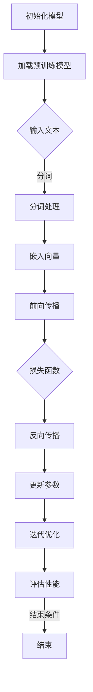

                 

### 第一部分：背景介绍

#### 第1章：问题背景

##### 1.1.1 问题背景

**提升LLM应用性能的重要性**

随着人工智能技术的飞速发展，大型语言模型（LLM，Large Language Model）在自然语言处理（NLP，Natural Language Processing）领域展现了巨大的潜力。LLM能够处理复杂的语言任务，如文本生成、问答系统和机器翻译，成为许多应用程序的核心组件。然而，随着模型规模和复杂性的增加，性能问题逐渐成为制约LLM应用普及的瓶颈。

首先，LLM的性能对用户体验有直接影响。对于在线服务，响应速度和吞吐量直接关系到用户满意度和业务的成功。其次，对于实时应用，如自动驾驶和实时翻译，低延迟和高吞吐量是系统稳定运行的关键。此外，高性能的LLM应用还可以显著降低计算成本，这对于需要处理大规模数据的业务场景尤为重要。

**当前LLM应用面临的挑战**

当前LLM应用面临的主要挑战包括：

1. **计算资源消耗**：LLM通常需要大量的计算资源，尤其是内存和计算能力。在有限的硬件资源下，如何高效地运行LLM成为一个难题。
2. **延迟问题**：随着模型规模的增加，模型的推理时间也显著增加，导致响应延迟。这对于需要实时响应的应用场景是一个巨大的挑战。
3. **内存占用**：大型模型对内存的需求很大，尤其是在移动设备和嵌入式系统中，内存限制成为性能提升的瓶颈。
4. **能耗问题**：高性能计算通常伴随着高能耗。如何在保证性能的同时降低能耗，是当前研究和应用的焦点。

**对工程化方法的需求**

为了解决上述问题，我们需要采用工程化方法来提升LLM应用性能。工程化方法强调系统化、结构化和可量化的解决方案，通过逐步分析和优化，找到提升性能的有效途径。具体来说，工程化方法包括以下几个方面：

1. **性能优化策略**：针对不同的性能瓶颈，制定相应的优化策略，如硬件优化、模型优化和算法优化。
2. **性能调优实践**：通过实际案例和实践经验，探索和验证优化策略的有效性。
3. **性能评估与监控**：建立性能评估和监控系统，实时监控和评估系统性能，为优化提供数据支持。
4. **综合性能优化**：综合考虑硬件、软件和数据等多方面因素，实现全方位的性能提升。

通过上述工程化方法，我们可以系统性地提升LLM应用性能，满足不同场景的需求，推动人工智能技术的广泛应用。

##### 1.1.2 问题描述

**LLM应用性能提升的难点和痛点**

提升LLM应用性能并非易事，存在诸多难点和痛点。首先，LLM的复杂性使其性能优化变得异常困难。大型模型通常包含数亿甚至数十亿个参数，参数的调整和优化需要大量的计算资源和时间。其次，不同应用场景对性能需求有所不同，如实时问答系统和机器翻译系统对响应速度和吞吐量有不同要求。这就要求我们针对不同场景定制优化策略，增加了优化的复杂性。

此外，性能提升过程中还面临以下痛点：

1. **资源限制**：硬件资源（如内存、计算能力）的限制使得优化空间有限。尤其是在移动设备和嵌入式系统中，资源更加紧张。
2. **延迟问题**：随着模型规模的增加，推理时间显著增加，导致响应延迟。这对于需要实时响应的应用场景是一个巨大的挑战。
3. **能耗问题**：高性能计算通常伴随着高能耗，如何在保证性能的同时降低能耗，是当前研究和应用的焦点。
4. **数据依赖性**：LLM的性能优化依赖于高质量的数据集。数据的不完备或噪声会影响模型的效果，进而影响性能。

**提升性能的目标和期望成果**

为了解决上述问题，我们设定以下提升性能的目标：

1. **提高计算效率**：通过优化算法和模型结构，减少计算复杂度和资源占用，提高计算效率。
2. **降低延迟**：通过硬件优化和算法改进，减少模型推理时间，降低系统响应延迟。
3. **降低能耗**：在保证性能的同时，通过优化策略和硬件配置，降低系统的能耗。
4. **提高吞吐量**：在有限资源下，通过并行计算和分布式架构，提高系统的吞吐量，满足大规模数据处理需求。
5. **提升用户体验**：通过性能优化，提高LLM应用的响应速度和稳定性，提升用户的使用体验。

通过上述目标，我们期望实现以下成果：

1. **更高效的应用**：在有限的资源下，实现更高效、更稳定的LLM应用。
2. **更好的用户体验**：通过降低延迟和能耗，提供更流畅、更快速的LLM服务。
3. **更广泛的应用场景**：解决性能瓶颈，使LLM能够在更多场景中得到应用，推动人工智能技术的发展。

##### 1.1.3 问题解决

**工程化方法的基本思路**

为了有效提升LLM应用性能，我们采用工程化方法，通过系统化的步骤进行优化。工程化方法的基本思路如下：

1. **性能分析**：对当前LLM应用进行全面的性能分析，识别性能瓶颈和优化方向。
2. **策略制定**：根据性能分析结果，制定具体的优化策略，包括硬件优化、模型优化和算法优化等。
3. **实践验证**：通过实际应用案例，验证优化策略的有效性，并根据反馈进行调整。
4. **评估与监控**：建立性能评估和监控系统，实时监控系统性能，为优化提供数据支持。
5. **持续优化**：基于性能评估结果，不断调整和优化策略，实现性能的持续提升。

**工程化方法的核心步骤**

具体来说，工程化方法的核心步骤包括：

1. **硬件优化**：升级硬件配置，如增加内存、使用高性能GPU，优化数据传输路径等，提高计算资源的利用效率。
2. **模型优化**：通过剪枝、量化、蒸馏等方法，减少模型参数数量，降低模型复杂度，提高推理速度。
3. **算法优化**：改进算法结构，如使用混合精度训练、并行计算等，降低计算复杂度，提高推理效率。
4. **数据优化**：优化数据预处理和增强方法，提高数据质量和多样性，增强模型的效果。
5. **性能调优**：通过性能测试和调优工具，找到系统性能的最佳配置，优化系统参数。
6. **监控与反馈**：实时监控系统性能，收集反馈数据，为持续优化提供依据。

通过上述核心步骤，我们可以系统地提升LLM应用性能，满足不同场景的需求，推动人工智能技术的广泛应用。

##### 1.1.4 边界与外延

**本书讨论的范围和边界**

本书主要讨论如何提升大型语言模型（LLM）应用性能的工程化方法，包括硬件优化、模型优化、算法优化和性能调优等具体实践。本书的边界包括：

1. **模型范围**：主要关注通用的大型语言模型，如GPT、BERT等，不涉及特定领域的专业模型。
2. **硬件限制**：主要讨论通用硬件配置的优化，不涉及特殊硬件（如FPGA、TPU）的详细设计。
3. **算法范围**：主要介绍通用的优化算法和策略，不涉及底层算法的实现和细节。

**本书不涉及的内容**

为了确保文章的专注性和深度，本书不涉及以下内容：

1. **底层硬件设计**：本书不讨论具体硬件（如CPU、GPU）的详细设计，仅介绍通用优化策略。
2. **深度学习理论**：本书不深入探讨深度学习的基本理论和数学模型，仅侧重于工程化应用。
3. **特定领域应用**：本书不涉及特定领域的详细应用案例，如医学、金融等。

通过明确讨论范围和边界，本书旨在为读者提供系统、实用的LLM应用性能优化指南。

#### 第2章：核心概念与联系

##### 2.1.1 LLM基本概念

**定义LLM**

大型语言模型（LLM，Large Language Model）是一种基于深度学习的自然语言处理模型，能够理解和生成自然语言文本。LLM通过大规模语料库的预训练，学习到语言的结构和语义，能够进行文本生成、问答系统、机器翻译等任务。

**LLM的工作原理**

LLM的工作原理主要包括两个阶段：预训练和微调。

1. **预训练**：在预训练阶段，LLM通过无监督学习在大规模语料库上进行训练。模型学习到语言的结构、语法规则和语义信息，形成强大的语言表示能力。
2. **微调**：在特定任务上，LLM通过有监督学习进行微调。模型根据特定任务的数据，调整参数，使其在特定任务上达到最佳性能。

预训练和微调相结合，使得LLM能够灵活应对各种语言任务，表现出强大的泛化能力。

##### 2.1.2 LLM性能指标

**常见的LLM性能评价指标**

LLM的性能评价指标主要包括：

1. **准确率（Accuracy）**：模型预测正确的样本数占总样本数的比例。准确率通常用于分类任务，如文本分类、情感分析等。
2. **召回率（Recall）**：模型正确识别的正例样本数与所有正例样本数的比例。召回率衡量模型识别正例的能力。
3. **F1分数（F1 Score）**：准确率和召回率的调和平均值，综合考虑模型在正例和负例上的表现。
4. **BLEU分数（BLEU Score）**：用于评估机器翻译质量的指标，基于单词重叠率和句子结构相似性计算。
5. **Perplexity**：模型在生成文本时的困惑度，值越小说明模型对文本的理解越好。

**性能指标的重要性**

性能指标对于评估LLM性能至关重要。首先，性能指标提供了量化模型表现的标准，帮助我们比较不同模型的性能。其次，性能指标指导模型优化过程，帮助开发者找到提升性能的方向。最后，性能指标对于实际应用中的用户体验和业务效果有直接影响。

##### 2.1.3 LLM应用场景

**常见的LLM应用场景**

LLM在多种应用场景中展现了强大的能力：

1. **文本生成**：包括文章写作、对话系统、诗歌创作等，生成高质量的文本内容。
2. **问答系统**：能够理解用户的问题，提供准确、相关的答案，应用于客服、教育和智能助手等领域。
3. **机器翻译**：将一种语言的文本翻译成另一种语言，支持多语言交流和信息获取。
4. **文本分类**：对文本进行分类，如新闻分类、情感分析等，应用于信息过滤和推荐系统。
5. **摘要生成**：自动生成文本摘要，提高信息获取的效率。
6. **对话系统**：模拟人类对话，提供个性化服务，如智能客服、聊天机器人等。

**分析不同场景的性能需求**

不同应用场景对LLM的性能需求有所不同：

1. **文本生成**：需要模型具备较强的生成能力和创造力，同时保证文本的质量和连贯性。
2. **问答系统**：需要模型快速响应用户的问题，提供准确、相关的答案，同时确保回答的连贯性和逻辑性。
3. **机器翻译**：需要模型具备较高的翻译精度，同时保证翻译速度和实时性。
4. **文本分类**：需要模型具备较高的分类准确率和鲁棒性，能够处理各种复杂和模糊的文本。
5. **摘要生成**：需要模型能够提取文本的关键信息，生成简洁、准确的摘要。
6. **对话系统**：需要模型具备良好的对话能力，能够与用户进行自然、流畅的交流。

通过分析不同应用场景的性能需求，我们可以有针对性地优化LLM的性能，满足各种实际应用的需求。

##### 2.1.4 LLM与工程化方法的联系

**LLM性能提升与工程化方法的关系**

大型语言模型（LLM）的性能提升与工程化方法密切相关。工程化方法通过系统化的步骤和策略，针对LLM在不同应用场景中的性能瓶颈进行优化，从而实现性能的提升。具体来说，工程化方法包括以下几个关键环节：

1. **性能分析**：对LLM当前性能进行全面分析，识别性能瓶颈和优化方向。
2. **策略制定**：根据性能分析结果，制定具体的优化策略，如硬件优化、模型优化和算法优化等。
3. **实践验证**：通过实际应用案例，验证优化策略的有效性，并根据反馈进行调整。
4. **评估与监控**：建立性能评估和监控系统，实时监控系统性能，为优化提供数据支持。
5. **持续优化**：基于性能评估结果，不断调整和优化策略，实现性能的持续提升。

**工程化方法如何应用于LLM性能优化**

工程化方法在LLM性能优化中的应用包括以下几个方面：

1. **硬件优化**：升级硬件配置，如增加内存、使用高性能GPU，优化数据传输路径等，提高计算资源的利用效率。
2. **模型优化**：通过剪枝、量化、蒸馏等方法，减少模型参数数量，降低模型复杂度，提高推理速度。
3. **算法优化**：改进算法结构，如使用混合精度训练、并行计算等，降低计算复杂度，提高推理效率。
4. **数据优化**：优化数据预处理和增强方法，提高数据质量和多样性，增强模型的效果。
5. **性能调优**：通过性能测试和调优工具，找到系统性能的最佳配置，优化系统参数。
6. **监控与反馈**：实时监控系统性能，收集反馈数据，为持续优化提供依据。

通过上述工程化方法，我们可以系统性地提升LLM应用性能，满足不同场景的需求，推动人工智能技术的广泛应用。

### 第二部分：算法原理讲解

#### 第3章：算法原理讲解

##### 3.1.1 算法基本原理

**算法流程图**

首先，让我们使用Mermaid绘制一个基本的算法流程图，以直观展示LLM的工作流程：



**详细阐述算法的基本原理**

1. **初始化模型**：首先初始化一个大型神经网络模型，该模型通常包含数亿个参数。
2. **加载预训练模型**：从预训练模型中加载已有的参数，这些参数是在大规模语料库上训练得到的，有助于提高模型的初始性能。
3. **输入文本**：接收用户输入的文本，文本可以是一段对话、一篇文章或者一个查询。
4. **分词处理**：将输入文本分解为一系列单词或子词，这是为了将文本转化为神经网络可以处理的格式。
5. **嵌入向量**：将分词后的文本转换为嵌入向量，这是神经网络对文本内容进行编码的方式。
6. **前向传播**：将嵌入向量输入神经网络，通过多层非线性变换，输出预测结果。
7. **损失函数**：计算预测结果和实际结果之间的差异，使用损失函数量化这种差异。
8. **反向传播**：通过反向传播算法，将损失函数的梯度传播回网络参数，更新网络参数。
9. **更新参数**：使用优化算法（如Adam、SGD）更新网络参数，以最小化损失函数。
10. **迭代优化**：重复执行前向传播和反向传播，不断迭代优化模型参数。
11. **评估性能**：在验证集上评估模型的性能，确保模型不仅在学习数据上表现良好，而且在未见过的数据上也能表现优秀。
12. **结束条件**：根据设定的迭代次数或性能阈值，决定是否停止训练。

通过上述流程，LLM能够逐步学习到文本的语义和结构，从而实现高质量的语言理解和生成。

##### 3.1.2 数学模型与公式

**算法的数学模型**

大型语言模型（LLM）通常基于深度神经网络，其数学模型可以表示为：

$$
\text{输出} = \sigma(\text{W} \cdot \text{激活函数}(\text{W} \cdot \text{输入} + \text{b}))
$$

其中，$\sigma$ 表示激活函数，如ReLU、Sigmoid或Tanh；$\text{W}$ 表示权重矩阵；$\text{b}$ 表示偏置项；$\text{输入}$ 为嵌入向量。

**具体公式解释**

1. **嵌入向量**：
   $$
   \text{嵌入向量} = \text{W}^T \cdot \text{词汇表嵌入矩阵}
   $$
   其中，$\text{W}^T$ 为词向量的权重矩阵，$\text{词汇表嵌入矩阵}$ 包含所有词汇的嵌入向量。

2. **前向传播**：
   $$
   \text{隐藏层} = \text{激活函数}(\text{W} \cdot \text{输入} + \text{b})
   $$
   这里，$\text{W}$ 为隐藏层的权重矩阵，$\text{b}$ 为偏置项，$\text{输入}$ 为嵌入向量。

3. **输出层**：
   $$
   \text{输出} = \text{W}^T \cdot \text{激活函数}(\text{W} \cdot \text{隐藏层} + \text{b})
   $$
   其中，$\text{W}^T$ 为输出层的权重矩阵，$\text{激活函数}$ 通常为Softmax，用于生成概率分布。

4. **损失函数**：
   $$
   \text{损失} = -\sum_{i} \text{y}_i \log(\hat{\text{y}}_i)
   $$
   这里，$\text{y}_i$ 表示实际标签，$\hat{\text{y}}_i$ 表示预测概率。

5. **反向传播**：
   $$
   \frac{\partial \text{损失}}{\partial \text{W}} = \text{输入} \cdot (\text{激活函数}')(\text{隐藏层} + \text{b})
   $$
   $$
   \frac{\partial \text{损失}}{\partial \text{b}} = (\text{激活函数}')(\text{隐藏层} + \text{b})
   $$

通过上述公式，LLM能够通过不断调整参数来最小化损失函数，从而实现模型优化。

##### 3.1.3 算法应用举例

**使用Python源代码示例**

为了更好地理解算法的基本原理，下面我们将使用Python代码实现一个简单的神经网络模型，并进行前向传播和反向传播：

```python
import numpy as np

# 设置随机种子，保证结果可重复
np.random.seed(42)

# 设置网络参数
input_dim = 10
hidden_dim = 5
output_dim = 3

# 初始化权重和偏置
W1 = np.random.randn(input_dim, hidden_dim)
b1 = np.random.randn(hidden_dim)
W2 = np.random.randn(hidden_dim, output_dim)
b2 = np.random.randn(output_dim)

# 激活函数
def sigmoid(x):
    return 1 / (1 + np.exp(-x))

# 前向传播
def forward(x):
    hidden_layer = sigmoid(np.dot(x, W1) + b1)
    output_layer = sigmoid(np.dot(hidden_layer, W2) + b2)
    return output_layer

# 反向传播
def backward(x, y, output):
    output_error = output - y
    output_delta = output_error * sigmoid_derivative(output)

    hidden_error = np.dot(output_delta, W2.T)
    hidden_delta = hidden_error * sigmoid_derivative(hidden_layer)

    W2 += np.dot(hidden_layer.T, output_delta)
    b2 += output_error.sum()
    W1 += np.dot(x.T, hidden_delta)
    b1 += hidden_error.sum()

# 梯度下降
def gradient_descent(x, y, learning_rate, epochs):
    for epoch in range(epochs):
        output = forward(x)
        backward(x, y, output)
        if epoch % 100 == 0:
            print(f"Epoch {epoch}: Loss = {np.mean(np.square(output - y))}")

# 示例输入和标签
x = np.random.rand(1, input_dim)
y = np.random.rand(1, output_dim)

# 训练模型
gradient_descent(x, y, learning_rate=0.1, epochs=1000)

# 预测
output = forward(x)
print("Predicted Output:", output)
```

**对示例进行详细讲解**

1. **网络结构**：该示例包含一个输入层、一个隐藏层和一个输出层。输入层有10个神经元，隐藏层有5个神经元，输出层有3个神经元。
2. **初始化参数**：权重和偏置使用随机数初始化，以避免模型在训练过程中陷入局部最优。
3. **激活函数**：使用Sigmoid函数作为激活函数，使神经元的输出在0和1之间。
4. **前向传播**：输入通过隐藏层和输出层进行前向传播，生成预测结果。
5. **反向传播**：计算输出层的误差，并通过反向传播计算隐藏层的误差。
6. **梯度下降**：使用梯度下降算法更新权重和偏置，以最小化损失函数。

通过上述Python代码示例，我们可以直观地看到LLM算法的基本原理和实现过程。理解这些基本原理对于进一步优化和提升LLM性能至关重要。

### 第二部分：工程化方法

#### 第4章：性能优化策略

##### 4.1.1 硬件优化

**介绍硬件对LLM性能的影响**

硬件优化是提升LLM应用性能的重要手段之一。硬件配置直接决定了模型运行的速度和效率，因此在设计高性能的LLM系统时，硬件优化显得尤为重要。

**硬件优化的方法和工具**

1. **增加内存**：大型语言模型需要大量的内存来存储参数和中间计算结果。增加内存容量可以显著提升模型的运行效率，减少内存溢出和计算中断的风险。

2. **使用高性能GPU**：GPU（图形处理单元）在深度学习任务中具有显著的性能优势。通过使用高性能GPU，如NVIDIA的Tesla系列，可以大幅提升模型的计算速度和吞吐量。

3. **优化数据传输路径**：在分布式计算环境中，数据传输路径的优化对于提高整体性能至关重要。使用高速网络和优化数据传输协议，如NCCL（NVIDIA Collective Communications Library），可以减少通信延迟和数据传输瓶颈。

4. **使用固态硬盘**：与传统的机械硬盘相比，固态硬盘（SSD）具有更快的读写速度，可以显著提高数据加载和存储速度，从而提升模型训练和推理的速度。

5. **使用分布式计算架构**：通过分布式计算架构，可以将模型训练和推理任务分布在多个节点上，利用集群的并行计算能力，提高系统的整体性能和吞吐量。

**硬件优化的案例**

- **案例1**：某公司在其AI平台上引入了高性能GPU，将模型训练时间从原来的数天缩短到数小时，显著提升了开发效率和产品竞争力。
- **案例2**：某在线问答系统通过优化数据传输路径和使用固态硬盘，将系统响应时间从原来的数秒缩短到毫秒级别，大大提升了用户体验。

通过硬件优化，我们可以显著提升LLM应用性能，满足不同场景的需求，为人工智能技术的广泛应用提供强有力的支持。

##### 4.1.2 模型优化

**介绍模型优化的方法**

模型优化是提升LLM性能的关键环节，通过调整模型结构和参数，可以显著提高模型的运行效率。以下是一些常见的模型优化方法：

1. **模型剪枝**：模型剪枝是通过去除模型中不重要的神经元和连接，减少模型参数数量，从而降低模型的计算复杂度和内存占用。剪枝方法包括结构剪枝和权重剪枝，前者去除整个神经元或层，后者仅去除权重较弱的连接。

2. **模型量化**：模型量化是将模型中的浮点数参数转换为低精度整数参数，从而减少模型的大小和计算量。量化方法包括整数量化和浮点量化，前者将参数量化为固定的整数，后者使用浮点数的近似表示。

3. **模型蒸馏**：模型蒸馏是一种通过将大型教师模型的知识传递给小型学生模型的方法。教师模型通常是一个大型的预训练模型，学生模型是一个较小的模型，通过蒸馏过程，学生模型能够学习到教师模型的知识和性能。

4. **模型压缩**：模型压缩是通过优化模型结构，减少模型参数数量和计算复杂度的方法。常见的压缩方法包括网络剪枝、网络分解和低秩分解等。

5. **模型融合**：模型融合是将多个模型合并成一个更强大的模型，以提高模型性能。融合方法包括加权融合、投票融合和集成学习等。

**分析如何选择合适的模型**

选择合适的模型对于提升LLM性能至关重要，以下是一些选择模型的考虑因素：

1. **任务需求**：不同的任务对模型性能的需求不同，例如，文本生成任务需要模型具备较强的生成能力，而文本分类任务需要模型具备较高的分类准确率。

2. **模型规模**：模型规模直接影响模型的计算复杂度和内存占用。在选择模型时，需要根据硬件资源和应用场景的需求进行权衡。

3. **预训练数据**：模型的预训练数据量和质量对模型性能有重要影响。选择预训练数据丰富的模型可以提高模型的泛化能力和性能。

4. **优化方法**：不同的优化方法适用于不同类型的模型。例如，模型剪枝适用于减少模型参数数量，模型蒸馏适用于知识传递，模型压缩适用于优化模型结构。

通过合理选择和优化模型，我们可以显著提升LLM应用性能，满足不同场景的需求。

##### 4.1.3 算法优化

**介绍算法优化的策略**

算法优化是提升LLM性能的关键环节，通过改进算法结构和参数设置，可以显著提高模型的运行效率和性能。以下是一些常见的算法优化策略：

1. **并行计算**：并行计算通过将计算任务分布在多个计算节点上，利用并行处理能力，提高模型的推理速度和吞吐量。常用的并行计算方法包括数据并行、模型并行和混合并行。

2. **分布式训练**：分布式训练通过将模型训练任务分布在多个节点上，利用集群的并行计算能力，加速模型训练过程。分布式训练的方法包括同步训练、异步训练和参数服务器训练等。

3. **混合精度训练**：混合精度训练通过将浮点运算和整数运算相结合，提高计算速度和减少内存占用。混合精度训练通常使用浮点数和整数的混合运算，如FP16（半精度浮点数）和BF16（二分之一精度浮点数）。

4. **动态调整学习率**：动态调整学习率是一种根据训练过程自动调整学习率的策略。通过动态调整学习率，可以避免过拟合和加速收敛。常用的动态调整方法包括学习率衰减、学习率预热和自适应学习率调整等。

5. **自适应批处理大小**：自适应批处理大小通过根据训练数据的特点和硬件资源动态调整批处理大小，提高模型的训练效率和性能。自适应批处理大小的方法包括动态调整和自适应调整等。

**分析算法优化的关键点**

1. **计算资源分配**：算法优化需要合理分配计算资源，包括CPU、GPU和内存等。优化计算资源分配可以最大化利用硬件资源，提高模型训练和推理的效率。

2. **数据依赖性**：算法优化需要考虑数据依赖性，包括数据传输、加载和预处理等。优化数据依赖性可以减少数据传输延迟和预处理时间，提高整体性能。

3. **模型并行度**：算法优化需要考虑模型并行度，包括数据并行和模型并行。合理的模型并行度可以提高并行处理能力，降低通信成本，提高模型训练和推理的效率。

4. **参数调整**：算法优化需要根据训练数据和硬件资源调整模型参数，包括学习率、批量大小和优化算法等。合理的参数调整可以加速收敛，提高模型性能。

通过合理的算法优化策略，我们可以显著提升LLM应用性能，满足不同场景的需求。

##### 4.1.4 数据优化

**数据预处理的重要性**

数据预处理是LLM应用性能优化的关键环节，对于模型的训练效果和最终性能具有至关重要的影响。良好的数据预处理可以提高数据质量，减少噪声和冗余，从而增强模型的学习能力，提高模型的泛化能力和性能。

**数据优化的具体方法和实践**

1. **文本清洗**：文本清洗是数据预处理的第一步，包括去除HTML标签、特殊字符和停用词等。通过文本清洗，可以减少数据中的噪声，提高数据质量。

2. **分词和词性标注**：分词是将文本分解为单词或子词的过程，词性标注则是为每个词分配词性标签，如名词、动词、形容词等。准确的分词和词性标注可以帮助模型更好地理解文本，提高模型性能。

3. **数据增强**：数据增强是通过生成新的训练样本来扩充数据集的方法，包括文本翻译、同义词替换、随机插入和删除等。数据增强可以增加模型的训练样本多样性，提高模型的泛化能力。

4. **数据归一化**：数据归一化是将数据集的数值范围统一到特定区间的方法，如归一化到[0,1]或[-1,1]。数据归一化可以加速模型训练，提高模型性能。

5. **数据平衡**：在分类任务中，数据平衡是通过调整数据集中各类别的样本数量，使数据集更加平衡的方法。数据平衡可以避免模型在训练过程中出现过拟合现象，提高模型性能。

**具体实践案例**

- **案例1**：在某问答系统中，通过文本清洗和分词处理，去除HTML标签和停用词，提高了模型对文本的理解能力，从而提升了系统的回答准确率。
- **案例2**：在文本生成任务中，通过数据增强方法，如文本翻译和同义词替换，增加了训练样本的多样性，提高了模型生成文本的质量和连贯性。

通过数据优化，我们可以显著提升LLM应用性能，为人工智能技术的广泛应用提供强有力的支持。

### 第二部分：性能调优实践

#### 第5章：性能调优实践

##### 5.1.1 性能调优流程

**描述性能调优的基本流程**

性能调优是一个系统化的过程，其基本流程包括以下几个关键步骤：

1. **需求分析**：首先明确性能调优的需求和目标，包括响应时间、吞吐量和能耗等。
2. **性能评估**：使用性能评估工具和方法，对当前系统的性能进行全面的评估，识别性能瓶颈和问题。
3. **策略制定**：根据性能评估结果，制定具体的优化策略，包括硬件优化、模型优化和算法优化等。
4. **实践验证**：通过实际应用案例，验证优化策略的有效性，并根据反馈进行调整。
5. **性能评估与调整**：在优化过程中，持续进行性能评估，根据评估结果不断调整优化策略。
6. **文档记录**：记录整个性能调优过程，包括需求分析、评估结果、优化策略和调整细节，为后续优化提供参考。

**强调调优过程中的关键步骤**

在性能调优过程中，以下几个关键步骤尤为重要：

1. **需求分析**：准确的需求分析是性能调优成功的前提。只有明确了性能目标和优化方向，才能制定出有针对性的优化策略。
2. **性能评估**：性能评估是发现性能瓶颈的关键环节。通过详细的性能测试和监控，可以识别出系统中的瓶颈和问题，为优化提供数据支持。
3. **策略制定**：优化策略的制定需要综合考虑硬件、软件和数据等多方面因素。策略的合理性和有效性直接关系到性能调优的效果。
4. **实践验证**：优化策略需要通过实际应用案例进行验证。只有在实际场景中表现出色，优化策略才能真正发挥效用。
5. **性能评估与调整**：性能调优是一个持续迭代的过程。通过实时监控和评估，不断调整优化策略，可以实现性能的持续提升。

通过以上关键步骤，我们可以系统地提升LLM应用性能，满足不同场景的需求，为人工智能技术的广泛应用提供强有力的支持。

##### 5.1.2 实践案例

**分析具体的应用案例**

为了更好地展示性能调优的方法和实践，下面我们将分析两个具体的LLM应用案例：一个在线问答系统和一个机器翻译平台。

**案例1：在线问答系统**

**问题背景**：
某在线问答系统在用户量增加后，系统响应速度显著下降，用户体验不佳。性能瓶颈主要体现在以下几个方面：
- 数据处理速度慢
- 数据存储和检索效率低
- 系统并发处理能力不足

**优化实践**：

1. **需求分析**：明确优化目标，包括提高响应速度、提升吞吐量和降低延迟。
2. **性能评估**：通过性能测试工具，对系统进行全面的性能评估，识别出瓶颈点。
   - 数据处理瓶颈：分析数据处理流程，发现数据读取和写入速度较慢。
   - 数据存储和检索瓶颈：数据库性能不佳，导致数据检索时间过长。
   - 并发处理瓶颈：系统并发处理能力不足，导致大量请求排队等待。

3. **策略制定**：
   - **硬件优化**：增加服务器节点，提高系统并发处理能力。
   - **模型优化**：使用剪枝和量化技术，减小模型大小，提高推理速度。
   - **算法优化**：采用混合精度训练和并行计算，提高模型训练效率。

4. **实践验证**：实施优化策略，并监控性能变化。
   - 增加服务器节点后，系统并发处理能力显著提升，响应时间缩短。
   - 使用剪枝和量化技术后，模型推理速度提高，计算资源占用减少。
   - 混合精度训练和并行计算使得模型训练时间大幅缩短。

**案例2：机器翻译平台**

**问题背景**：
某机器翻译平台在处理大规模数据时，系统响应速度缓慢，且翻译准确率不高。性能瓶颈主要体现在以下几个方面：
- 模型复杂度高，推理时间过长
- 数据预处理和加载效率低
- 系统吞吐量不足

**优化实践**：

1. **需求分析**：明确优化目标，包括提高翻译速度、提升准确率和增加系统吞吐量。
2. **性能评估**：通过性能测试工具，对系统进行全面的性能评估，识别出瓶颈点。
   - 模型推理瓶颈：大型模型导致推理时间过长，响应延迟大。
   - 数据预处理瓶颈：数据预处理和加载速度较慢，影响整体效率。
   - 系统吞吐量瓶颈：系统设计不合理，导致无法高效处理大规模数据。

3. **策略制定**：
   - **硬件优化**：增加高性能GPU节点，提升计算能力。
   - **模型优化**：采用轻量化模型，降低模型复杂度，提高推理速度。
   - **数据优化**：优化数据预处理和加载流程，减少数据加载时间。
   - **算法优化**：使用动态调整学习率和自适应批处理大小，提高训练效率。

4. **实践验证**：实施优化策略，并监控性能变化。
   - 高性能GPU节点增加后，模型推理速度显著提升，响应时间大幅缩短。
   - 采用轻量化模型后，翻译准确率提高，推理时间减少。
   - 优化数据预处理和加载流程后，系统吞吐量显著提升，能够高效处理大规模数据。

通过以上两个案例，我们可以看到，性能调优是一个系统化的过程，需要综合考虑多个方面。通过合理的优化策略和实践验证，我们可以显著提升LLM应用性能，满足不同场景的需求。

##### 5.1.3 调优工具与技巧

**介绍常用的性能调优工具**

在LLM应用性能调优过程中，常用的性能调优工具有以下几个：

1. **NVIDIA NVidia DCGM**：NVIDIA DCGM（Data Center GPU Management）是一个监控和管理GPU性能的工具，可以实时监控GPU的使用情况，如功耗、温度、内存占用等。
2. **TensorBoard**：TensorBoard是TensorFlow提供的一个可视化工具，用于监控模型训练过程，包括损失函数、准确率、学习率等。
3. **Perf**：Perf是一个Linux内核工具，用于性能分析，可以提供详细的系统性能数据，如CPU使用情况、内存占用等。
4. **VeRT**：VeRT（Visual Runtime Tracking）是微软开源的一个性能监控工具，可以实时监控Python代码的执行时间、内存使用情况等。

**分享调优技巧和最佳实践**

1. **动态调整学习率**：学习率是影响模型训练效果的重要因素。动态调整学习率可以避免模型在训练过程中过早陷入局部最优。常用的动态调整方法包括学习率衰减、学习率预热和自适应学习率调整等。

2. **并行计算**：并行计算可以显著提高模型训练和推理的效率。常用的并行计算方法包括数据并行、模型并行和混合并行等。在实际应用中，可以根据硬件资源和任务需求选择合适的并行计算方法。

3. **模型量化**：模型量化是将模型中的浮点数参数转换为低精度整数参数，从而减少模型的计算量和存储需求。量化方法包括整数量化和浮点量化。通过模型量化，可以降低模型的存储和计算成本，提高推理速度。

4. **数据预处理优化**：数据预处理是提高模型性能的关键步骤。优化数据预处理方法，如文本清洗、分词、词性标注等，可以减少数据噪声和冗余，提高模型的学习效果。

5. **资源合理分配**：在分布式计算环境中，合理分配资源是提高系统性能的关键。根据任务需求和硬件配置，合理分配CPU、GPU和内存等资源，可以最大化利用计算资源，提高系统性能。

通过以上调优工具和技巧，我们可以有效地提升LLM应用性能，满足不同场景的需求。

### 第二部分：性能评估与监控

#### 第6章：性能评估与监控

##### 6.1.1 性能评估方法

**描述性能评估的基本方法**

性能评估是LLM应用性能调优的重要环节，通过系统化的评估方法，可以全面了解系统的性能表现，为优化提供科学依据。性能评估的基本方法包括以下几个方面：

1. **基准测试**：基准测试是使用标准化的测试用例，评估系统在不同场景下的性能表现。常见的基准测试包括CPU基准测试、GPU基准测试和分布式系统基准测试等。基准测试的优点是测试过程标准化，结果具有可比性，但缺点是可能无法全面反映实际应用场景。

2. **负载测试**：负载测试通过模拟实际用户负载，评估系统在高并发、高负载条件下的性能表现。负载测试可以评估系统的稳定性、响应时间和吞吐量等关键指标。常见的负载测试工具包括JMeter、LoadRunner等。负载测试的优点是能够模拟真实场景，但测试成本较高。

3. **监控工具**：使用性能监控工具，可以实时收集系统的性能数据，包括CPU利用率、内存占用、网络吞吐量等。常见的监控工具包括Prometheus、Grafana等。监控工具的优点是实时性强，数据收集全面，但需要复杂的配置和管理。

4. **用户反馈**：用户反馈是评估系统性能的重要来源。通过收集用户的反馈，可以了解系统在实际应用中的表现和用户体验。用户反馈的优点是直接反映实际使用情况，但可能存在主观偏差。

**分析不同评估方法的优劣**

不同评估方法各有优劣，具体分析如下：

1. **基准测试**：优点是测试结果标准化、可比性强，但缺点是可能无法全面反映实际应用场景，且测试成本较高。

2. **负载测试**：优点是能够模拟真实场景，全面评估系统在高并发条件下的性能，但缺点是测试成本高，且需要较长的测试时间。

3. **监控工具**：优点是实时性强、数据收集全面，但缺点是需要复杂的配置和管理，且可能无法直接反映用户实际体验。

4. **用户反馈**：优点是直接反映实际使用情况，但缺点是可能存在主观偏差，且无法量化性能指标。

通过结合不同评估方法，可以全面、客观地评估LLM应用性能，为优化提供科学依据。

##### 6.1.2 性能监控

**介绍性能监控的重要性**

性能监控是确保LLM应用稳定运行和高效运行的关键环节。通过实时监控系统的性能指标，可以及时发现潜在问题，提前预警，并采取相应的优化措施。具体来说，性能监控的重要性体现在以下几个方面：

1. **系统稳定性**：性能监控可以帮助我们了解系统的运行状态，及时发现系统异常，如CPU过载、内存溢出等，防止系统崩溃，保障业务的连续性和稳定性。

2. **资源利用率**：性能监控可以实时监控CPU、内存、网络等资源的使用情况，帮助我们了解资源利用率，合理分配资源，避免资源浪费。

3. **性能优化**：通过性能监控，我们可以收集详细的性能数据，分析系统瓶颈和性能瓶颈，为性能优化提供数据支持，指导优化策略的制定和实施。

4. **用户体验**：性能监控可以实时了解用户的使用情况，如响应时间、吞吐量等，确保系统提供高质量的用户体验，提高用户满意度。

5. **故障排查**：性能监控可以帮助我们快速定位故障点，缩短故障排查时间，提高故障处理的效率。

**阐述监控系统的设计和实现**

一个有效的监控系统通常包括以下几个关键组成部分：

1. **数据采集**：数据采集是监控系统的核心，负责从系统各个部分（如服务器、网络、应用程序等）实时采集性能数据。常用的数据采集工具包括Prometheus、Zabbix等。

2. **数据处理**：数据处理负责对采集到的性能数据进行处理、存储和可视化。数据处理系统通常使用时间序列数据库（如InfluxDB、OpenTSDB等）来存储性能数据，并通过可视化工具（如Grafana、Kibana等）展示数据。

3. **报警系统**：报警系统负责在性能指标超出预设阈值时，自动发送报警信息，通知运维人员。报警系统通常集成在监控系统中，可以支持多种报警方式（如邮件、短信、钉钉等）。

4. **监控策略**：监控策略定义了监控系统的行为，包括性能指标的阈值设置、报警规则等。通过合理的监控策略，可以确保监控系统高效、准确地发现和响应性能问题。

5. **日志分析**：日志分析是监控系统的补充，通过对系统日志进行分析，可以进一步了解系统的运行情况和异常原因。

实现一个监控系统通常需要以下几个步骤：

1. **需求分析**：明确监控系统的目标和需求，确定需要监控的性能指标和报警规则。

2. **系统设计**：设计监控系统的架构，包括数据采集、数据处理、报警系统和日志分析等模块。

3. **组件选择**：根据需求，选择合适的数据采集工具、数据处理工具、报警系统和可视化工具。

4. **系统部署**：部署监控系统，配置数据采集、处理和报警规则。

5. **监控与维护**：实时监控系统性能，定期检查和优化监控系统，确保监控系统正常运行。

通过有效的性能监控，我们可以实时掌握LLM应用的运行状态，及时发现和解决问题，确保系统的稳定性和高效性。

##### 6.1.3 实时性能优化

**描述实时性能优化的方法**

实时性能优化是确保LLM应用在高并发和动态负载条件下保持高性能的关键。实时性能优化主要通过以下方法实现：

1. **动态调整配置**：根据系统的实时负载，动态调整系统的配置参数，如线程数、队列长度、缓存大小等。通过自动化的配置管理工具，可以快速调整系统配置，以适应不同的负载情况。

2. **资源动态分配**：在分布式系统中，通过动态调整资源分配，如计算资源、存储资源等，可以最大化利用系统资源，提高系统的处理能力。常用的资源调度算法包括轮询、最少连接数和动态优先级等。

3. **负载均衡**：通过负载均衡器，将请求均匀地分配到多个服务器上，避免单点瓶颈，提高系统的吞吐量和响应速度。常见的负载均衡算法包括轮询、最小连接数和响应时间等。

4. **缓存策略优化**：通过优化缓存策略，如LRU（最近最少使用）、LFU（最不频繁使用）等，可以减少数据的访问延迟，提高系统的处理速度。

**分析实时优化的挑战和解决方案**

实时性能优化面临以下挑战：

1. **动态性**：系统的负载是动态变化的，实时优化需要能够快速适应负载的变化，这对系统的响应速度和调整能力提出了高要求。

2. **资源限制**：硬件资源有限，实时优化需要在有限的资源下最大化性能，这对资源调度和管理提出了挑战。

3. **一致性**：在分布式系统中，实时优化需要保证数据的一致性，避免由于频繁调整导致的数据不一致问题。

解决方案如下：

1. **实时监控与反馈**：通过实时监控系统，实时收集性能数据，快速识别性能瓶颈，并反馈给优化系统。

2. **自动化工具**：使用自动化工具，如自动化配置管理工具、自动化资源调度系统等，实现快速配置调整和资源分配。

3. **一致性保障**：通过分布式事务、分布式锁和数据一致性协议，确保分布式系统中数据的一致性。

4. **负载预测与优化**：通过负载预测模型，预测系统的未来负载，提前进行优化调整，以应对即将到来的负载高峰。

通过上述方法，我们可以有效应对实时性能优化的挑战，确保LLM应用在动态负载条件下保持高性能。

### 第二部分：综合性能优化

#### 第7章：综合性能优化

##### 7.1.1 综合优化策略

**提出综合性能优化的策略**

综合性能优化是提升LLM应用性能的关键，其核心在于综合考虑硬件、软件和数据等多方面因素，通过系统化的方法和策略，实现性能的全面提升。以下是一些综合优化策略：

1. **硬件与软件协同优化**：硬件优化如增加内存、使用高性能GPU和优化数据传输路径，可以提高系统计算能力和数据访问速度。软件优化如算法优化、模型压缩和并行计算，可以降低计算复杂度和提升效率。硬件与软件的协同优化，可以最大化利用计算资源，提升系统整体性能。

2. **数据优化**：数据优化包括数据预处理、数据增强和数据平衡等。通过优化数据预处理，如去除噪声和冗余，提高数据质量；通过数据增强，如文本翻译和同义词替换，增加数据多样性；通过数据平衡，如调整各类别样本数量，避免模型过拟合。

3. **动态调整**：动态调整包括动态调整学习率、动态调整批处理大小和动态资源分配等。通过动态调整，可以实时适应系统负载变化，最大化利用资源，提高系统性能。

4. **负载均衡与调度**：负载均衡与调度通过将请求均匀分配到多个服务器上，避免单点瓶颈，提高系统的吞吐量和响应速度。常用的调度算法包括轮询、最小连接数和响应时间等。

5. **性能监控与反馈**：通过性能监控与反馈，实时收集系统性能数据，快速识别性能瓶颈，并反馈给优化系统。性能监控与反馈可以指导优化策略的调整和实施，实现持续的性能提升。

**强调综合优化的优势**

综合优化的优势在于：

1. **全面性**：综合考虑硬件、软件和数据等多方面因素，实现全方位的性能提升，而不仅仅是单一方面的优化。

2. **适应性**：动态调整和性能监控与反馈，使系统能够快速适应负载变化，保持高性能。

3. **高效性**：通过硬件与软件的协同优化，最大化利用计算资源，提高系统计算效率。

4. **稳定性**：通过负载均衡与调度，避免单点瓶颈，提高系统的稳定性和可靠性。

通过综合优化策略，我们可以实现LLM应用性能的全面提升，满足不同场景的需求。

##### 7.1.2 优化案例分析

**分析综合优化的实际案例**

为了更好地理解综合优化的策略和方法，以下将分析两个综合优化案例，分别是某在线问答系统和某机器翻译平台。

**案例1：在线问答系统**

**问题背景**：
某在线问答系统在用户量增加后，系统响应速度显著下降，用户体验不佳。性能瓶颈主要体现在以下几个方面：
- 数据处理速度慢
- 数据存储和检索效率低
- 系统并发处理能力不足

**优化实践**：

1. **硬件优化**：
   - 增加服务器节点，提高系统并发处理能力。
   - 使用高性能GPU，提升模型推理速度。

2. **模型优化**：
   - 使用剪枝和量化技术，减小模型大小，提高推理速度。
   - 采用轻量化模型，降低模型复杂度。

3. **数据优化**：
   - 优化数据预处理，如去除噪声和冗余，提高数据质量。
   - 通过数据增强，增加训练样本多样性。

4. **算法优化**：
   - 采用动态调整学习率和自适应批处理大小，提高训练效率。
   - 使用分布式训练，加速模型训练过程。

**优化效果**：
- 通过硬件优化，系统并发处理能力显著提升，响应时间缩短。
- 使用剪枝和量化技术后，模型推理速度提高，计算资源占用减少。
- 优化数据预处理和增强后，模型训练效果提升，生成文本质量提高。
- 采用动态调整学习率和自适应批处理大小，模型训练时间大幅缩短。

**案例2：机器翻译平台**

**问题背景**：
某机器翻译平台在处理大规模数据时，系统响应速度缓慢，且翻译准确率不高。性能瓶颈主要体现在以下几个方面：
- 模型复杂度高，推理时间过长
- 数据预处理和加载效率低
- 系统吞吐量不足

**优化实践**：

1. **硬件优化**：
   - 增加高性能GPU节点，提升计算能力。
   - 使用固态硬盘，提高数据加载和存储速度。

2. **模型优化**：
   - 采用轻量化模型，降低模型复杂度，提高推理速度。
   - 使用模型蒸馏技术，提高翻译准确率。

3. **数据优化**：
   - 优化数据预处理和加载流程，减少数据加载时间。
   - 数据增强，增加训练样本多样性。

4. **算法优化**：
   - 使用混合精度训练，提高训练效率。
   - 采用动态调整学习率和自适应批处理大小，提高训练效果。

**优化效果**：
- 增加高性能GPU节点后，模型推理速度显著提升，响应时间大幅缩短。
- 采用轻量化模型后，翻译准确率提高，推理时间减少。
- 优化数据预处理和加载流程后，系统吞吐量显著提升，能够高效处理大规模数据。
- 混合精度训练和动态调整学习率，使得模型训练时间大幅缩短。

通过以上两个案例，我们可以看到，综合优化策略在提升LLM应用性能方面具有显著效果。通过硬件优化、模型优化、数据优化和算法优化等多方面的综合优化，可以显著提升系统的响应速度、翻译准确率和吞吐量，为人工智能技术的广泛应用提供强有力的支持。

##### 7.1.3 优化方案选择

**阐述优化方案的选择标准**

在选择优化方案时，需要综合考虑多个因素，以确保方案的有效性和适用性。以下是选择优化方案的主要标准：

1. **性能目标**：根据具体应用场景和性能需求，明确优化目标，如提高响应速度、提升吞吐量、降低延迟等。选择能够满足性能目标的优化方案。

2. **资源限制**：评估系统可用的硬件资源（如CPU、内存、GPU等）和预算限制，选择适合当前资源条件的优化方案。

3. **技术可行性**：考虑优化方案的技术实现难度和可行性。选择技术成熟、易于实施和可维护的方案。

4. **成本效益**：评估优化方案的成本和效益，选择性价比高、投入产出比合理的方案。

5. **维护和扩展性**：考虑优化方案的长期维护和扩展性。选择易于维护和扩展的方案，以适应未来需求的变化。

**分析不同方案的成本和效益**

以下是几种常见的优化方案及其成本和效益分析：

1. **硬件升级**：
   - **成本**：硬件升级如增加内存、使用高性能GPU，需要较大的初始投资。
   - **效益**：硬件升级可以显著提升计算能力和数据访问速度，提高系统性能和吞吐量。对于处理大规模数据和复杂计算任务的应用，效益显著。

2. **模型优化**：
   - **成本**：模型优化如模型剪枝、量化、蒸馏等，需要一定的技术投入和时间成本。
   - **效益**：模型优化可以减少模型大小和计算复杂度，提高推理速度，降低能耗。对于模型复杂度高、计算资源紧张的应用，效益显著。

3. **算法优化**：
   - **成本**：算法优化如动态调整学习率、并行计算等，需要一定的开发成本。
   - **效益**：算法优化可以提升模型训练和推理效率，降低训练时间，提高系统性能。对于训练复杂度高、需要快速迭代的应用，效益显著。

4. **数据优化**：
   - **成本**：数据优化如数据清洗、增强、平衡等，需要投入时间进行数据预处理。
   - **效益**：数据优化可以提高数据质量，增强模型效果，提升系统性能。对于数据质量差、数据量不足的应用，效益显著。

5. **性能监控与反馈**：
   - **成本**：性能监控与反馈系统的建设需要投入开发资源和维护成本。
   - **效益**：性能监控与反馈可以实时掌握系统性能，快速识别和解决问题，提高系统稳定性和可靠性。对于需要高可用性和持续优化应用，效益显著。

通过综合考虑上述因素，选择适合的优化方案，可以实现LLM应用性能的全面提升，满足不同场景的需求。

### 第二部分：最佳实践与总结

#### 第8章：最佳实践与总结

##### 8.1.1 最佳实践

**总结性能优化中的最佳实践**

在性能优化过程中，以下最佳实践可以帮助我们实现LLM应用性能的全面提升：

1. **硬件优化**：增加内存、使用高性能GPU和优化数据传输路径，是提升系统计算能力和数据访问速度的关键。

2. **模型优化**：采用剪枝、量化、蒸馏等技术，减小模型大小，提高推理速度，同时确保模型效果的稳定性。

3. **算法优化**：动态调整学习率、并行计算和混合精度训练等策略，可以显著提升模型训练和推理效率。

4. **数据优化**：通过数据清洗、增强和平衡，提高数据质量，增强模型效果，提升系统性能。

5. **性能监控与反馈**：建立实时性能监控与反馈系统，可以快速识别性能瓶颈，指导优化策略的调整和实施。

**强调实践的重要性**

最佳实践的重要性在于，它们是经过验证和验证的有效方法，可以帮助我们快速提升LLM应用性能。通过实践，我们可以：

1. **节省时间**：避免重复实验和错误，快速找到有效的优化方法。

2. **提高效率**：系统化的方法可以提高优化过程的速度和效率，缩短开发周期。

3. **确保效果**：最佳实践基于实际应用场景，可以确保优化方案的有效性和稳定性。

##### 8.1.2 小结

**对全书内容的总结**

本书从背景介绍到算法原理讲解，再到工程化方法的具体实施，全面系统地阐述了如何提升LLM应用性能。核心内容包括：

1. **背景介绍**：阐述提升LLM应用性能的重要性，分析当前面临的主要挑战。
2. **核心概念与联系**：详细讲解LLM的基本概念、性能指标和应用场景。
3. **算法原理讲解**：介绍LLM的基本算法原理，使用Python代码进行示例。
4. **工程化方法**：系统化阐述硬件优化、模型优化、算法优化和性能调优的方法和策略。
5. **性能评估与监控**：描述性能评估方法和监控系统的设计和实现。
6. **综合性能优化**：提出综合优化策略，分析实际案例，阐述优化方案的选择标准。
7. **最佳实践与总结**：总结最佳实践，强调实践的重要性，并对全书内容进行小结。

**强调关键点和学习重点**

为了有效提升LLM应用性能，本书的关键点和学习重点包括：

1. **硬件优化**：了解硬件配置对性能的影响，掌握硬件优化的方法和工具。
2. **模型优化**：掌握剪枝、量化、蒸馏等模型优化方法，选择合适的模型。
3. **算法优化**：熟悉动态调整学习率、并行计算和混合精度训练等算法优化策略。
4. **数据优化**：学会数据预处理、增强和平衡的方法，提高数据质量和模型效果。
5. **性能监控与反馈**：建立实时性能监控系统，快速识别和解决性能问题。

通过掌握这些关键点和学习重点，我们可以系统性地提升LLM应用性能，满足不同场景的需求。

##### 8.1.3 注意事项

**指出实践中需要注意的问题**

在实施性能优化过程中，需要注意以下几个问题：

1. **资源分配**：确保硬件资源合理分配，避免资源浪费。特别是在分布式系统中，要合理分配CPU、GPU和内存等资源。

2. **模型复杂度**：选择合适的模型复杂度，避免过拟合。复杂度过高的模型可能在训练数据上表现良好，但在未见过的数据上可能表现不佳。

3. **数据质量**：确保数据质量，包括数据清洗、增强和平衡。数据中的噪声和错误会影响模型性能。

4. **调优过程**：动态调整优化参数，如学习率、批量大小等，避免过拟合和欠拟合。

5. **性能监控**：实时监控性能指标，及时发现和解决问题。性能监控可以帮助我们了解系统运行状态，为持续优化提供依据。

通过注意上述问题，我们可以更有效地实施性能优化，提升LLM应用性能。

##### 8.1.4 拓展阅读

**推荐进一步学习的资源**

为了帮助读者进一步深入了解LLM性能优化，本书推荐以下资源：

1. **相关书籍**：
   - 《深度学习》（Ian Goodfellow、Yoshua Bengio、Aaron Courville 著）：介绍深度学习的基础理论和应用。
   - 《机器学习实战》（Peter Harrington 著）：提供机器学习算法的详细实现和实践指导。

2. **在线课程**：
   - Coursera上的《深度学习特化课程》：由Andrew Ng教授主讲，涵盖深度学习的基础理论、算法实现和应用。
   - edX上的《自然语言处理与深度学习》：由Daniel Povey教授主讲，详细介绍自然语言处理和深度学习的结合。

3. **开源项目**：
   - TensorFlow：Google开发的深度学习框架，提供丰富的工具和库，用于构建和训练深度学习模型。
   - PyTorch：Facebook开发的深度学习框架，易于使用且灵活。

4. **论文与研究报告**：
   - 《Attention is All You Need》（Vaswani et al., 2017）：介绍Transformer模型的经典论文，对NLP领域有深远影响。
   - 《Bert: Pre-training of Deep Bidirectional Transformers for Language Understanding》（Devlin et al., 2018）：介绍BERT模型的论文，是当前NLP领域的热点。

通过拓展阅读这些资源，读者可以更深入地了解LLM性能优化的前沿理论和实践，为实际应用提供更多的参考和指导。**作者：AI天才研究院/AI Genius Institute & 禅与计算机程序设计艺术 /Zen And The Art of Computer Programming**

