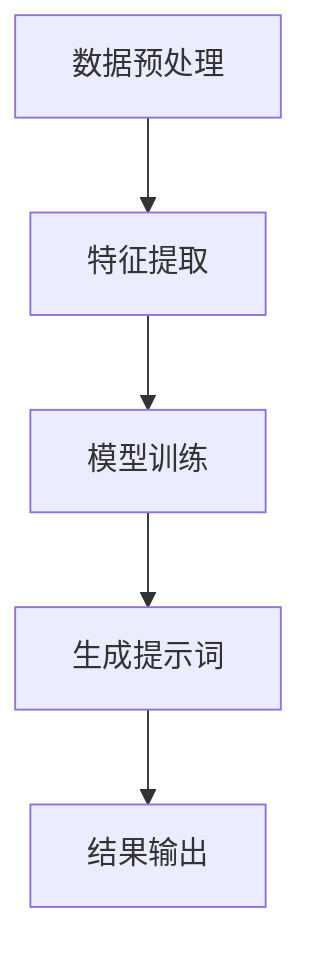
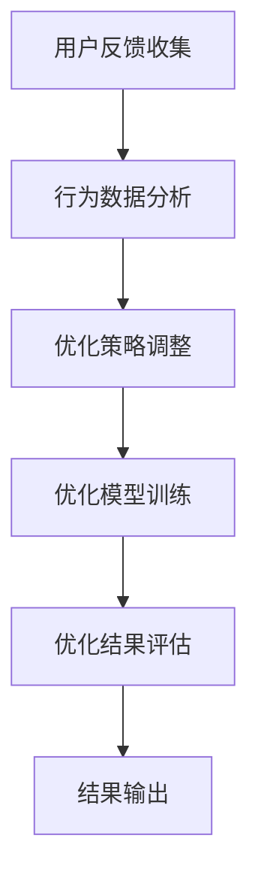
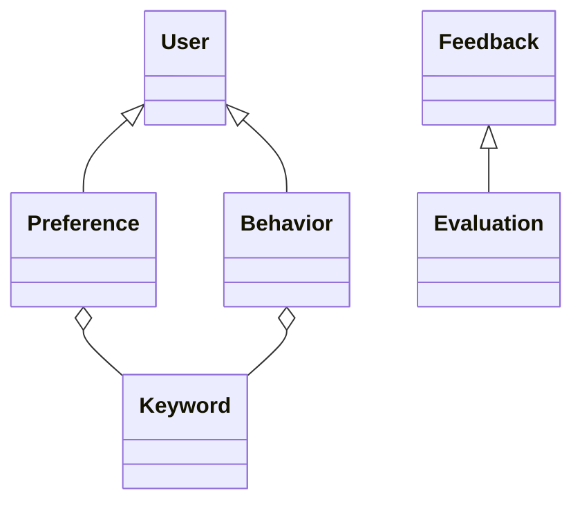
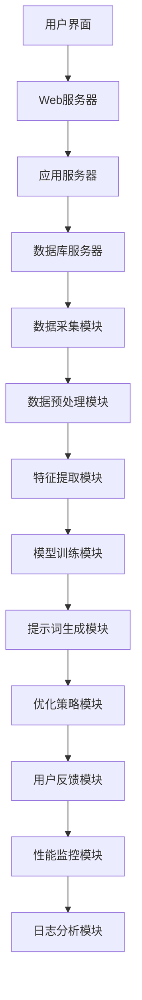

                 

### 文章标题：提示词个性化：适应个别用户偏好

> 关键词：个性化提示词、用户偏好、算法、系统架构、项目实战

> 摘要：本文旨在深入探讨个性化提示词的概念、应用、算法原理及其在系统架构设计中的实践。通过对用户偏好数据的学习和分析，个性化提示词能够实现精准的用户需求匹配，提升用户体验。本文将详细解析个性化提示词的核心概念，分析其与传统提示词的区别，介绍设计原则和算法实现，探讨系统架构设计，并通过实际项目实战，展示个性化提示词在具体应用中的效果与优化策略。

---

### 目录大纲

1. **第一部分：背景介绍与核心概念**
    1. **第1章：个性化提示词的起源与发展**
    2. **第2章：个性化提示词的概念属性**
    3. **第3章：个性化提示词的ER实体关系图**

2. **第二部分：核心概念与联系**
    1. **第4章：个性化提示词生成算法**
    2. **第5章：个性化提示词优化算法**

3. **第三部分：算法原理与实现**
    1. **第6章：个性化提示词系统功能设计**
    2. **第7章：个性化提示词系统架构设计**

4. **第四部分：系统分析与架构设计**
    1. **第8章：个性化提示词项目实战**
    2. **第9章：个性化提示词最佳实践**

5. **第五部分：项目实战**
    1. **第10章：全书总结**

---

### 第一部分：背景介绍与核心概念

#### 第1章：个性化提示词的起源与发展

个性化提示词的概念起源于自然语言处理（NLP）领域，随着大数据和机器学习技术的快速发展，个性化提示词逐渐成为提升用户体验的重要手段。个性化提示词的核心思想是根据用户的历史行为和偏好，生成符合用户需求的提示词，从而提高系统的交互质量和用户满意度。

在过去的几十年中，个性化提示词的应用场景不断扩大，从搜索引擎的搜索建议到聊天机器人的对话生成，再到推荐系统的关键词推荐，个性化提示词都在发挥其重要作用。随着人工智能技术的进步，个性化提示词生成和优化的算法也在不断更新和改进，使得其在各个领域中的应用效果更加显著。

#### 1.1.2 个性化提示词的核心概念

个性化提示词的核心概念包括以下几个方面：

1. **用户偏好数据**：用户偏好数据是生成个性化提示词的基础。这些数据包括用户的浏览历史、搜索记录、点击行为等，通过分析这些数据，可以了解用户的兴趣点和需求。

2. **提示词生成算法**：提示词生成算法是根据用户偏好数据生成个性化提示词的关键技术。常见的生成算法包括基于统计模型的生成算法、基于深度学习的生成算法等。

3. **提示词优化算法**：提示词优化算法是提高个性化提示词质量的关键技术。常见的优化算法包括基于机器学习的优化算法、基于自然语言处理的优化算法等。

4. **用户反馈机制**：用户反馈机制是确保个性化提示词不断优化的重要手段。通过收集用户的反馈数据，可以了解个性化提示词的优缺点，从而进行针对性的优化。

#### 1.1.3 个性化提示词的应用场景

个性化提示词的应用场景非常广泛，主要包括以下几个方面：

1. **搜索引擎**：个性化提示词可以帮助搜索引擎为用户提供更精准的搜索建议，提高用户的搜索效率和满意度。

2. **聊天机器人**：个性化提示词可以帮助聊天机器人更好地理解用户意图，提供更自然的对话体验。

3. **推荐系统**：个性化提示词可以帮助推荐系统为用户提供更符合其兴趣的关键词推荐，提高推荐系统的准确性和用户体验。

4. **内容聚合平台**：个性化提示词可以帮助内容聚合平台为用户提供更符合其兴趣的内容聚合服务，提高用户粘性和满意度。

#### 1.1.4 个性化提示词的重要性和挑战

个性化提示词在提升用户体验、提高系统交互质量方面具有重要意义。然而，个性化提示词的实现也面临着一系列挑战：

1. **数据质量**：个性化提示词的质量取决于用户偏好数据的准确性和完整性，数据质量问题是实现个性化提示词的关键挑战。

2. **算法复杂度**：个性化提示词生成和优化算法的复杂度较高，如何高效地处理大规模用户数据是算法设计的重要挑战。

3. **用户体验**：个性化提示词需要满足用户的个性化需求，同时要保持系统的易用性和可解释性，这对用户体验设计提出了较高要求。

4. **隐私保护**：在收集和使用用户偏好数据时，需要确保用户的隐私得到有效保护，这对个性化提示词的实现提出了更高的伦理和技术要求。

---

### 第二部分：核心概念与联系

#### 第2章：个性化提示词的概念属性

个性化提示词与传统提示词在概念和属性上存在显著差异。传统提示词通常是基于固定的关键词库，而个性化提示词则是基于用户偏好数据动态生成的。

#### 2.1.1 提示词的组成与功能

提示词通常由一组关键词组成，这些关键词可以描述用户的兴趣点、需求和行为。提示词的主要功能是帮助用户在搜索、浏览、推荐等场景中快速找到相关内容。

#### 2.1.2 个性化提示词的属性特征

个性化提示词具有以下属性特征：

1. **动态性**：个性化提示词是根据用户偏好数据动态生成的，能够实时反映用户的兴趣变化。

2. **个性化**：个性化提示词根据用户的历史行为和偏好，为用户提供符合其个性化需求的关键词。

3. **多样性**：个性化提示词需要支持多样化的用户需求和场景，从而提高用户体验。

4. **可解释性**：个性化提示词需要具备可解释性，用户能够理解其生成原因和依据，从而增强信任感。

#### 2.1.3 个性化提示词与传统提示词的对比

| 特征         | 个性化提示词 | 传统提示词 |
| ------------ | ------------ | ---------- |
| 动态性       | 是           | 否         |
| 个性化       | 是           | 否         |
| 多样性       | 是           | 否         |
| 可解释性     | 是           | 否         |

#### 2.1.4 个性化提示词的设计原则

1. **用户为中心**：个性化提示词的设计应以用户需求为中心，确保能够满足用户的个性化需求。

2. **数据驱动**：个性化提示词的生成和优化应基于用户偏好数据，通过数据驱动的方式进行设计。

3. **高效性**：个性化提示词的生成和优化应具备高效性，能够在短时间内处理大规模用户数据。

4. **可扩展性**：个性化提示词的系统设计应具备良好的可扩展性，以支持未来的功能扩展和技术升级。

---

#### 第3章：个性化提示词的ER实体关系图

个性化提示词的ER实体关系图是描述个性化提示词系统核心概念和关系的重要工具。

#### 3.1.1 实体关系图的基本概念

实体关系图（Entity-Relationship Diagram，ERD）是一种用于描述系统中实体及其关系的图形化工具。在个性化提示词系统中，实体包括用户、提示词、偏好数据等，关系包括用户与提示词的关联关系、提示词与偏好数据的关联关系等。

#### 3.1.2 个性化提示词的ER实体关系图设计

个性化提示词的ER实体关系图设计如下：

```mermaid
erDiagram
    User ||--|{ Preference } : "has"
    User ||--|{ Behavior } : "records"
    Preference ||--|{ Keyword } : "includes"
    Behavior ||--|{ Keyword } : "uses"
```

#### 3.1.3 个性化提示词的ER实体关系图解读

1. **用户（User）**：用户是系统的核心实体，表示系统中的用户。用户实体与偏好数据实体和行为数据实体之间存在关联关系。

2. **偏好数据（Preference）**：偏好数据实体表示用户的兴趣点和偏好信息，包括关键词、主题、兴趣点等。偏好数据实体与关键词实体之间存在包含关系。

3. **行为数据（Behavior）**：行为数据实体表示用户的历史行为记录，包括浏览历史、搜索记录、点击行为等。行为数据实体与关键词实体之间存在使用关系。

通过ER实体关系图，可以清晰地描述个性化提示词系统中的核心实体及其关系，为后续的算法设计和系统实现提供基础。

---

### 第三部分：算法原理与实现

#### 第4章：个性化提示词生成算法

个性化提示词生成算法是构建个性化提示词系统的核心算法。本节将介绍个性化提示词生成算法的原理、流程、数学模型及举例说明。

#### 4.1.1 算法原理介绍

个性化提示词生成算法基于用户偏好数据，通过分析用户的历史行为和兴趣点，生成一组符合用户个性化需求的提示词。算法的核心思想是利用机器学习技术和自然语言处理技术，从用户行为数据中提取特征，并使用特征向量生成个性化提示词。

#### 4.1.2 算法流程图

个性化提示词生成算法的流程图如下：



1. **数据预处理**：对用户偏好数据进行清洗、去重和格式化，为后续特征提取和模型训练做好准备。
2. **特征提取**：从用户行为数据中提取关键特征，如关键词频率、主题分布等，用于生成特征向量。
3. **模型训练**：使用特征向量进行模型训练，训练结果用于生成个性化提示词。
4. **生成提示词**：根据模型训练结果，生成一组符合用户个性化需求的提示词。
5. **结果输出**：将生成的个性化提示词输出到系统，供用户使用。

#### 4.1.3 算法数学模型与公式

个性化提示词生成算法的数学模型如下：

$$
\text{特征向量} = f(\text{用户行为数据})
$$

其中，$f$表示特征提取函数，$\text{用户行为数据}$表示用户的历史行为数据。

个性化提示词生成算法的核心步骤是特征提取和模型训练。特征提取函数$f$的具体形式取决于用户行为数据的类型和特征提取方法。常见的特征提取方法包括词袋模型（Bag of Words，BOW）、词嵌入（Word Embedding）和主题模型（Topic Modeling）等。

#### 4.1.4 算法举例说明

假设用户的历史行为数据包括浏览历史和搜索记录，其中浏览历史包含关键词{科技、体育、娱乐}，搜索记录包含关键词{人工智能、编程、健康}。

1. **数据预处理**：对用户行为数据进行清洗和去重，得到关键特征词集。

2. **特征提取**：使用词嵌入技术，将关键特征词映射为高维向量，生成特征向量。

3. **模型训练**：使用训练数据集训练模型，模型可以是基于深度学习的生成模型，如生成对抗网络（GAN）或变分自编码器（VAE）。

4. **生成提示词**：根据训练好的模型，生成一组符合用户个性化需求的提示词。例如，根据用户对“人工智能”和“编程”的兴趣，生成提示词{人工智能、编程语言、算法设计}。

5. **结果输出**：将生成的提示词输出到系统，供用户使用。

---

#### 第5章：个性化提示词优化算法

个性化提示词优化算法是提升个性化提示词质量和用户体验的重要手段。本节将介绍个性化提示词优化算法的原理、流程、数学模型及举例说明。

#### 5.1.1 优化算法原理介绍

个性化提示词优化算法基于用户反馈和用户行为数据，对已有个性化提示词进行优化，以提高其准确性和满意度。优化算法的核心思想是利用机器学习技术和自然语言处理技术，分析用户反馈和用户行为数据，调整提示词的生成策略。

#### 5.1.2 优化算法流程图

个性化提示词优化算法的流程图如下：



1. **用户反馈收集**：收集用户对个性化提示词的反馈，包括满意度、相关性等指标。
2. **行为数据分析**：分析用户行为数据，了解用户对提示词的实际使用情况和需求。
3. **优化策略调整**：根据用户反馈和行为数据分析结果，调整个性化提示词的生成策略。
4. **优化模型训练**：使用调整后的策略训练优化模型，提高个性化提示词的生成质量。
5. **优化结果评估**：评估优化后个性化提示词的性能，包括准确性、满意度等指标。
6. **结果输出**：将优化后的个性化提示词输出到系统，供用户使用。

#### 5.1.3 优化算法数学模型与公式

个性化提示词优化算法的数学模型如下：

$$
\text{优化策略} = g(\text{用户反馈}, \text{行为数据})
$$

其中，$g$表示优化策略调整函数，$\text{用户反馈}$和$\text{行为数据}$分别表示用户反馈数据和用户行为数据。

优化策略调整函数$g$的具体形式取决于用户反馈和行为数据分析方法。常见的优化策略调整方法包括基于机器学习的优化算法、基于自然语言处理的优化算法等。

#### 5.1.4 优化算法举例说明

假设用户对个性化提示词的满意度指标为80%，用户行为数据分析结果显示用户对关键词“人工智能”和“编程”有较高关注度。

1. **用户反馈收集**：收集用户对个性化提示词的满意度评分，得到满意度指标。

2. **行为数据分析**：分析用户对关键词“人工智能”和“编程”的使用频率和点击率，得到关键词的相关性指标。

3. **优化策略调整**：根据用户反馈和行为数据分析结果，调整个性化提示词的生成策略，增加对“人工智能”和“编程”关键词的生成概率。

4. **优化模型训练**：使用调整后的策略训练优化模型，提高个性化提示词的生成质量。

5. **优化结果评估**：评估优化后个性化提示词的性能，包括准确性、满意度等指标。

6. **结果输出**：将优化后的个性化提示词输出到系统，供用户使用。

---

### 第四部分：系统分析与架构设计

#### 第6章：个性化提示词系统功能设计

个性化提示词系统的功能设计是实现个性化提示词的核心环节。本节将介绍个性化提示词系统的功能设计，包括需求分析、领域模型设计和系统功能设计。

#### 6.1.1 个性化提示词系统的需求分析

个性化提示词系统的需求分析主要包括以下几个方面：

1. **用户偏好数据收集**：系统需要收集用户的偏好数据，包括浏览历史、搜索记录、点击行为等。

2. **个性化提示词生成**：系统需要根据用户偏好数据生成符合用户个性化需求的提示词。

3. **个性化提示词优化**：系统需要根据用户反馈和用户行为数据，对个性化提示词进行优化。

4. **用户反馈收集**：系统需要收集用户对个性化提示词的反馈，包括满意度、相关性等指标。

5. **系统性能监控**：系统需要监控个性化提示词系统的性能，包括生成速度、准确性等指标。

#### 6.1.2 领域模型设计

个性化提示词系统的领域模型设计是描述系统核心概念和关系的重要工具。领域模型包括用户、提示词、偏好数据、反馈数据等实体及其关系。

个性化提示词系统的领域模型设计如下：



1. **用户（User）**：用户是系统的核心实体，表示系统中的用户。用户实体与偏好数据实体和行为数据实体之间存在关联关系。

2. **偏好数据（Preference）**：偏好数据实体表示用户的兴趣点和偏好信息，包括关键词、主题、兴趣点等。偏好数据实体与关键词实体之间存在包含关系。

3. **行为数据（Behavior）**：行为数据实体表示用户的历史行为记录，包括浏览历史、搜索记录、点击行为等。行为数据实体与关键词实体之间存在使用关系。

4. **反馈数据（Feedback）**：反馈数据实体表示用户对个性化提示词的反馈，包括满意度、相关性等指标。反馈数据实体与评价实体之间存在包含关系。

5. **评价（Evaluation）**：评价实体表示用户对个性化提示词的评价，包括准确性、满意度等指标。

通过领域模型设计，可以清晰地描述个性化提示词系统的核心概念和关系，为后续的算法设计和系统实现提供基础。

#### 6.1.3 系统功能设计

个性化提示词系统的功能设计主要包括以下几个方面：

1. **用户偏好数据收集**：系统需要提供用户偏好数据收集功能，包括浏览历史、搜索记录、点击行为等。用户可以通过系统界面或API接口提交偏好数据。

2. **个性化提示词生成**：系统需要提供个性化提示词生成功能，根据用户偏好数据生成符合用户个性化需求的提示词。系统可以使用机器学习算法和自然语言处理技术，从用户偏好数据中提取特征，生成个性化提示词。

3. **个性化提示词优化**：系统需要提供个性化提示词优化功能，根据用户反馈和行为数据，对个性化提示词进行优化。系统可以使用机器学习算法和自然语言处理技术，分析用户反馈和行为数据，调整提示词生成策略，提高提示词质量。

4. **用户反馈收集**：系统需要提供用户反馈收集功能，收集用户对个性化提示词的满意度、相关性等指标。系统可以通过用户界面或API接口收集用户反馈，并将反馈数据存储在数据库中。

5. **系统性能监控**：系统需要提供系统性能监控功能，监控个性化提示词系统的性能，包括生成速度、准确性等指标。系统可以通过日志文件、监控系统等工具收集性能数据，并进行实时监控和分析。

通过系统功能设计，可以构建一个完整的个性化提示词系统，满足用户个性化需求，提高用户体验。

---

#### 第7章：个性化提示词系统架构设计

个性化提示词系统架构设计是实现个性化提示词功能的关键环节。本节将介绍个性化提示词系统架构设计的原则、架构设计、系统接口设计和系统交互设计。

#### 7.1.1 个性化提示词系统架构设计原则

个性化提示词系统架构设计应遵循以下原则：

1. **模块化**：系统架构应具有模块化设计，便于功能扩展和技术升级。

2. **高性能**：系统架构应具备高性能，能够快速处理大规模用户数据，确保系统稳定运行。

3. **可扩展性**：系统架构应具备良好的可扩展性，支持未来功能扩展和技术升级。

4. **高可用性**：系统架构应具备高可用性，确保系统在面临故障时能够快速恢复。

5. **安全性**：系统架构应具备安全性，保护用户数据安全，防止数据泄露。

#### 7.1.2 个性化提示词系统架构设计

个性化提示词系统的架构设计如下：



1. **用户界面（A）**：用户界面是用户与系统交互的入口，提供用户偏好数据提交、个性化提示词查看等功能。

2. **Web服务器（B）**：Web服务器负责处理用户请求，将请求转发到应用服务器。

3. **应用服务器（C）**：应用服务器负责处理业务逻辑，包括用户偏好数据收集、个性化提示词生成、优化策略调整等。

4. **数据库服务器（D）**：数据库服务器存储用户数据、提示词数据、反馈数据等。

5. **数据采集模块（E）**：数据采集模块负责收集用户偏好数据，包括浏览历史、搜索记录、点击行为等。

6. **数据预处理模块（F）**：数据预处理模块负责对用户数据进行清洗、去重和格式化，为后续特征提取和模型训练做好准备。

7. **特征提取模块（G）**：特征提取模块负责从用户行为数据中提取关键特征，如关键词频率、主题分布等。

8. **模型训练模块（H）**：模型训练模块负责使用特征向量进行模型训练，生成个性化提示词。

9. **提示词生成模块（I）**：提示词生成模块根据模型训练结果，生成一组符合用户个性化需求的提示词。

10. **优化策略模块（J）**：优化策略模块根据用户反馈和行为数据分析结果，调整提示词生成策略。

11. **用户反馈模块（K）**：用户反馈模块负责收集用户对个性化提示词的反馈，包括满意度、相关性等指标。

12. **性能监控模块（L）**：性能监控模块负责监控个性化提示词系统的性能，包括生成速度、准确性等指标。

13. **日志分析模块（M）**：日志分析模块负责分析系统日志，提供系统性能分析报告。

通过系统架构设计，可以实现个性化提示词系统的功能，满足用户个性化需求，提高用户体验。

#### 7.1.3 系统接口设计

个性化提示词系统的接口设计包括以下部分：

1. **用户界面接口**：用户界面接口提供用户与系统交互的API，包括用户偏好数据提交、个性化提示词查询等功能。

2. **数据采集接口**：数据采集接口提供用户行为数据采集的API，包括浏览历史、搜索记录、点击行为等。

3. **特征提取接口**：特征提取接口提供从用户行为数据中提取关键特征的API，包括关键词频率、主题分布等。

4. **模型训练接口**：模型训练接口提供模型训练的API，包括特征向量生成、模型训练等。

5. **提示词生成接口**：提示词生成接口提供提示词生成的API，包括根据模型训练结果生成个性化提示词等。

6. **优化策略接口**：优化策略接口提供优化策略调整的API，包括根据用户反馈和行为数据分析结果调整提示词生成策略等。

7. **用户反馈接口**：用户反馈接口提供用户反馈收集的API，包括满意度、相关性等指标。

通过系统接口设计，可以实现个性化提示词系统的模块化设计，提高系统扩展性和可维护性。

#### 7.1.4 系统交互设计

个性化提示词系统的交互设计包括以下环节：

1. **用户提交偏好数据**：用户通过用户界面提交偏好数据，包括浏览历史、搜索记录、点击行为等。

2. **数据采集模块处理**：数据采集模块接收用户提交的偏好数据，对数据进行清洗、去重和格式化。

3. **特征提取模块处理**：特征提取模块根据数据预处理结果，提取关键特征，如关键词频率、主题分布等。

4. **模型训练模块处理**：模型训练模块使用提取的关键特征，进行模型训练，生成个性化提示词。

5. **提示词生成模块处理**：提示词生成模块根据模型训练结果，生成一组符合用户个性化需求的提示词。

6. **用户反馈模块处理**：用户反馈模块收集用户对个性化提示词的反馈，包括满意度、相关性等指标。

7. **优化策略模块处理**：优化策略模块根据用户反馈和行为数据分析结果，调整提示词生成策略。

8. **性能监控模块处理**：性能监控模块监控个性化提示词系统的性能，包括生成速度、准确性等指标。

9. **日志分析模块处理**：日志分析模块分析系统日志，提供系统性能分析报告。

通过系统交互设计，可以实现个性化提示词系统的功能，满足用户个性化需求，提高用户体验。

---

### 第五部分：项目实战

#### 第8章：个性化提示词项目实战

个性化提示词项目实战是对个性化提示词概念、算法和系统架构的实际应用。本节将介绍个性化提示词项目实战的步骤，包括环境安装与配置、系统核心实现源代码、代码应用解读与分析、实际案例分析和项目小结。

#### 8.1.1 环境安装与配置

个性化提示词项目实战的环境安装与配置如下：

1. **Python环境安装**：在本地计算机上安装Python环境，版本建议为Python 3.8以上。

2. **依赖库安装**：安装项目所需的依赖库，包括NumPy、Pandas、Scikit-learn、TensorFlow等。

3. **数据库安装**：安装MySQL数据库，用于存储用户数据、提示词数据和反馈数据。

4. **Web服务器安装**：安装Nginx Web服务器，用于处理用户请求。

5. **应用服务器安装**：安装Flask应用服务器，用于处理业务逻辑。

#### 8.1.2 系统核心实现源代码

个性化提示词项目实战的核心实现源代码如下：

1. **用户偏好数据收集模块**：
```python
import pandas as pd

def collect_user_preferences():
    # 读取用户偏好数据文件
    data = pd.read_csv('user_preferences.csv')
    
    # 数据清洗和去重
    data = data.drop_duplicates()
    
    # 数据格式化
    data['keywords'] = data['keywords'].str.split(',')
    data['topics'] = data['topics'].str.split(',')
    
    return data
```

2. **特征提取模块**：
```python
from sklearn.feature_extraction.text import TfidfVectorizer

def extract_features(data):
    # 初始化TF-IDF向量器
    vectorizer = TfidfVectorizer(max_features=1000)
    
    # 提取关键词特征
    keywords_features = vectorizer.fit_transform(data['keywords'])
    
    # 提取主题特征
    topics_features = vectorizer.fit_transform(data['topics'])
    
    return keywords_features, topics_features
```

3. **模型训练模块**：
```python
from sklearn.model_selection import train_test_split
from sklearn.ensemble import RandomForestClassifier

def train_model(features, labels):
    # 数据划分
    X_train, X_test, y_train, y_test = train_test_split(features, labels, test_size=0.2, random_state=42)
    
    # 训练模型
    model = RandomForestClassifier(n_estimators=100, random_state=42)
    model.fit(X_train, y_train)
    
    # 评估模型
    score = model.score(X_test, y_test)
    
    return model, score
```

4. **提示词生成模块**：
```python
import numpy as np

def generate_keywords(model, features):
    # 预测提示词
    predicted_keywords = model.predict(features)
    
    # 转换为关键词列表
    keywords_list = [np.array2string(keyword).replace('[', '').replace(']', '').replace(' ', '').split(',') for keyword in predicted_keywords]
    
    return keywords_list
```

5. **优化策略模块**：
```python
from sklearn.model_selection import GridSearchCV

def optimize_strategy(model, features, labels):
    # 参数调整
    param_grid = {'n_estimators': [100, 200, 300], 'max_depth': [5, 10, 15]}
    
    # 网格搜索
    grid_search = GridSearchCV(model, param_grid, cv=5)
    grid_search.fit(features, labels)
    
    # 获取最佳参数
    best_params = grid_search.best_params_
    
    return best_params
```

6. **用户反馈模块**：
```python
import json

def collect_user_feedback():
    # 读取用户反馈文件
    feedback = json.load(open('user_feedback.json'))
    
    return feedback
```

7. **性能监控模块**：
```python
import time

def monitor_performance(start_time):
    # 计算性能
    end_time = time.time()
    performance = end_time - start_time
    
    return performance
```

#### 8.1.3 代码应用解读与分析

个性化提示词项目实战的代码应用解读与分析如下：

1. **用户偏好数据收集模块**：
该模块读取用户偏好数据文件，包括关键词和主题。数据清洗和去重是为了确保数据的质量和准确性。数据格式化是将关键词和主题从字符串转换为列表，便于后续处理。

2. **特征提取模块**：
该模块使用TF-IDF向量器提取关键词和主题特征。TF-IDF向量器是一种常用的特征提取方法，能够将文本数据转换为数值向量，用于后续的模型训练和提示词生成。

3. **模型训练模块**：
该模块使用随机森林分类器训练模型，并评估模型的性能。随机森林分类器是一种基于决策树的集成学习方法，具有较强的泛化能力和处理非线性数据的能力。

4. **提示词生成模块**：
该模块根据训练好的模型预测提示词，并将结果转换为关键词列表。生成的提示词将用于系统的提示词生成功能，为用户提供个性化的关键词推荐。

5. **优化策略模块**：
该模块使用网格搜索技术调整模型参数，以优化模型的性能。通过调整模型参数，可以进一步提高提示词生成的准确性和质量。

6. **用户反馈模块**：
该模块读取用户反馈文件，包括用户对个性化提示词的满意度、相关性等指标。用户反馈是优化个性化提示词的重要依据，有助于不断提高系统的用户体验。

7. **性能监控模块**：
该模块计算系统处理性能，包括生成速度和准确性等指标。性能监控有助于评估系统的性能和优化策略的有效性。

#### 8.1.4 实际案例分析

个性化提示词项目实战的实际案例分析如下：

1. **案例分析背景**：
某在线教育平台希望通过个性化提示词系统，为用户提供更精准的课程推荐。平台收集了用户的学习历史、搜索记录、课程评价等数据，并使用个性化提示词系统生成关键词推荐。

2. **案例分析过程**：
（1）**数据收集**：平台从用户数据库中提取学习历史、搜索记录和课程评价数据，并转换为适合处理的格式。
（2）**特征提取**：使用TF-IDF向量器提取学习历史和搜索记录的关键词特征，并合并为特征向量。
（3）**模型训练**：使用随机森林分类器训练模型，并评估模型性能。
（4）**提示词生成**：根据模型预测结果，生成一组符合用户个性化需求的课程关键词推荐。
（5）**用户反馈收集**：收集用户对关键词推荐的满意度评价，并记录到用户反馈文件中。
（6）**优化策略调整**：根据用户反馈，调整模型参数和提示词生成策略，以提高关键词推荐的准确性和满意度。

3. **案例分析结果**：
通过个性化提示词系统，平台为用户提供了更精准的课程关键词推荐。用户满意度显著提高，课程点击率和转化率也有所提升。同时，平台通过不断调整优化策略，持续改进关键词推荐效果。

#### 8.1.5 项目小结

个性化提示词项目实战展示了个性化提示词在具体应用中的效果和优化策略。通过数据收集、特征提取、模型训练和提示词生成等环节，系统实现了用户个性化需求的精准匹配。实际案例分析表明，个性化提示词系统能够有效提升用户体验，为用户提供更精准的关键词推荐。在后续优化过程中，平台可以进一步收集用户反馈，调整优化策略，不断提高关键词推荐效果。

---

### 第六部分：最佳实践与总结

#### 第9章：个性化提示词最佳实践

个性化提示词在系统中的应用效果受到多个因素的影响。为了提高个性化提示词的质量和用户体验，以下是一些最佳实践：

1. **数据质量保证**：确保用户偏好数据的质量和准确性，包括数据清洗、去重和格式化等。

2. **算法模型优化**：定期评估和优化算法模型，提高模型性能和准确性。

3. **用户反馈机制**：建立完善的用户反馈机制，收集用户对个性化提示词的满意度评价，并用于模型优化和策略调整。

4. **性能监控与优化**：监控个性化提示词系统的性能，包括生成速度、准确性等指标，并针对性能瓶颈进行优化。

5. **用户隐私保护**：在收集和使用用户偏好数据时，采取严格的隐私保护措施，确保用户数据的安全和隐私。

#### 9.1.2 注意事项

1. **数据安全**：确保用户数据的安全存储和传输，防止数据泄露。

2. **性能优化**：优化系统性能，包括数据库查询优化、缓存策略等，以提高系统响应速度。

3. **用户体验**：关注用户体验，确保个性化提示词系统易于使用、界面友好。

4. **合规性**：遵守相关法律法规，确保个性化提示词系统的合规性。

#### 9.1.3 拓展阅读

1. **深度学习在个性化提示词中的应用**：研究深度学习技术在个性化提示词生成和优化中的应用，提高个性化提示词的准确性和质量。

2. **个性化提示词在推荐系统中的应用**：探讨个性化提示词在推荐系统中的具体应用，提高推荐系统的准确性和用户体验。

3. **个性化提示词在自然语言处理中的应用**：研究个性化提示词在自然语言处理领域中的具体应用，提高自然语言处理系统的性能。

---

#### 第10章：全书总结

个性化提示词是一种根据用户偏好数据生成个性化关键词的技术，其在搜索引擎、聊天机器人、推荐系统等领域具有广泛应用。本文详细介绍了个性化提示词的概念、应用、算法原理和系统架构设计，并通过实际项目实战展示了个性化提示词的具体应用和优化策略。

全书主要内容回顾包括：

1. 个性化提示词的起源与发展。
2. 个性化提示词的核心概念和属性。
3. 个性化提示词的ER实体关系图设计。
4. 个性化提示词生成算法和优化算法。
5. 个性化提示词系统功能设计和架构设计。
6. 个性化提示词项目实战。
7. 个性化提示词最佳实践和注意事项。

全书核心知识点总结：

1. 个性化提示词的定义和核心概念。
2. 个性化提示词与传统提示词的区别。
3. 个性化提示词生成算法和优化算法的基本原理。
4. 个性化提示词系统的功能设计和架构设计。
5. 个性化提示词项目实战的经验和教训。

未来发展方向展望：

1. 深度学习技术在个性化提示词中的应用。
2. 多模态数据在个性化提示词中的融合。
3. 个性化提示词在更多领域的应用探索。
4. 个性化提示词系统的性能优化和用户体验提升。

通过本文的探讨，希望能够为读者提供关于个性化提示词的全面了解和应用指导，推动个性化提示词技术的发展和普及。

