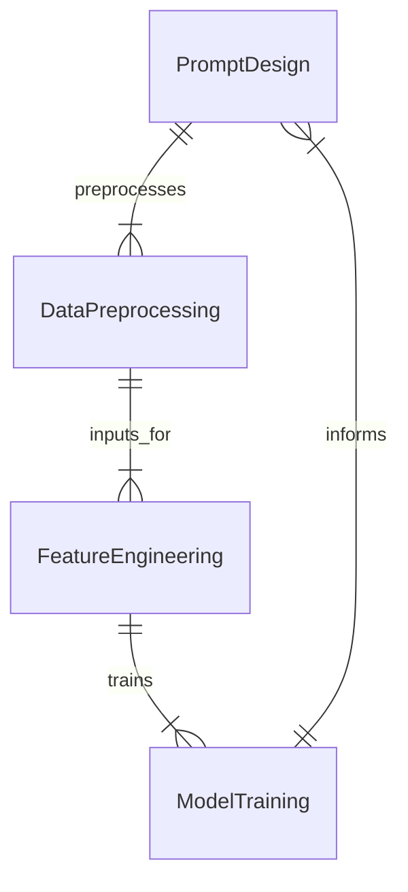
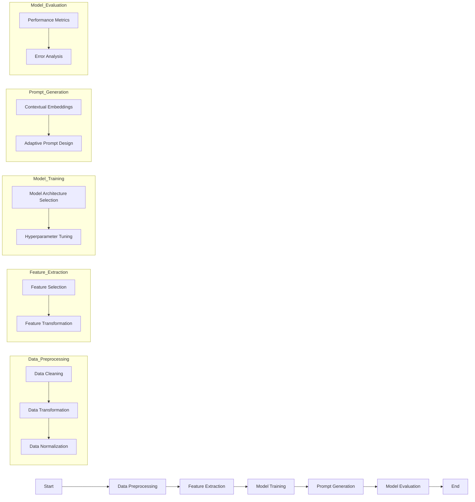
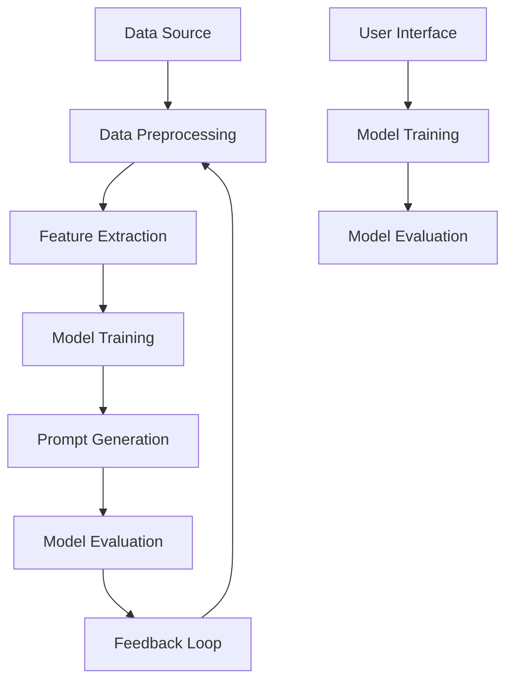
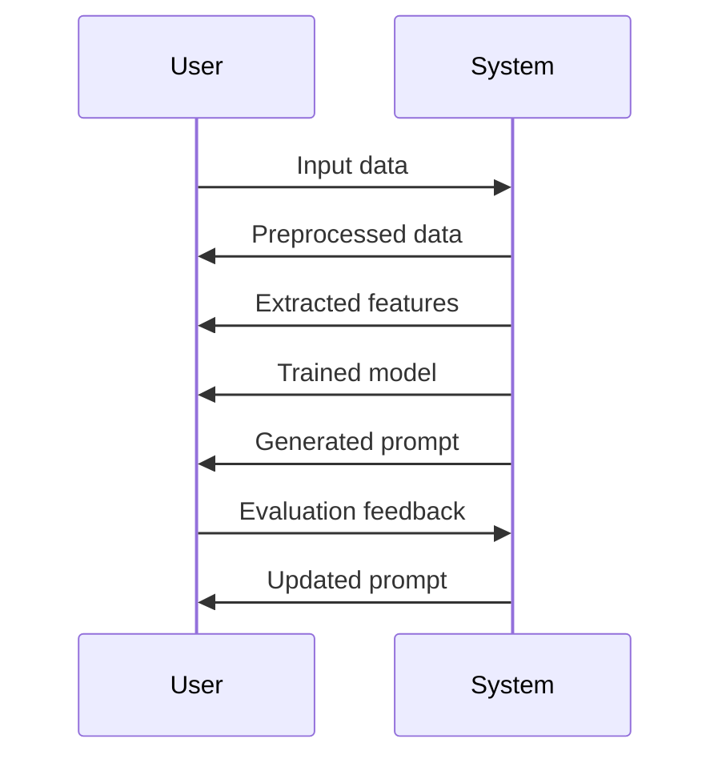

                 


### Introduction to Prompt Optimization: The Road to Intelligent Automation

#### Background and Importance of Prompt Optimization

Prompt optimization, as a fundamental technique in the realm of artificial intelligence, plays a pivotal role in enhancing the efficiency and effectiveness of AI-driven systems. At its core, prompt optimization involves refining the inputs or prompts given to AI models to achieve better performance and outcomes. The importance of this practice cannot be overstated, as it directly impacts various applications, from natural language processing (NLP) and machine learning (ML) to advanced robotics and autonomous systems.

In NLP, the quality of prompts significantly influences the generation of coherent and contextually relevant text. Well-optimized prompts can lead to more accurate language translation, improved chatbot interactions, and enhanced text summarization capabilities. For ML, the choice of prompts can determine the quality and diversity of data fed into models, thereby affecting the overall model accuracy and generalization capabilities.

The concept of prompt optimization is not new, but its significance has grown exponentially with the advancement of AI technologies. As AI systems become more complex and the datasets they operate on become larger and more diverse, the need for precise and effective prompt optimization has become more critical than ever. This article aims to delve into the core concepts, algorithms, system designs, and best practices of prompt optimization, providing a comprehensive guide for both beginners and seasoned professionals.

#### Problem Statement and Solution

The primary problem addressed in this article is the challenge of optimizing prompts in various AI applications to improve system performance. This involves understanding the underlying complexities of prompt design, identifying the key factors that influence prompt effectiveness, and developing systematic methods for their optimization.

The proposed solution leverages a multi-faceted approach that combines theoretical insights with practical implementations. We will explore core concepts and their relationships, discuss algorithm principles and methodologies, and provide a detailed system analysis and design framework. Additionally, we will present practical projects and case studies that demonstrate the real-world applicability of these techniques.

By the end of this article, readers will gain a thorough understanding of prompt optimization, equipped with the knowledge and tools necessary to design, implement, and optimize prompts in their respective AI projects.

#### Scope and Boundaries

This article focuses on the automated optimization of prompts in AI systems, with a particular emphasis on NLP and ML applications. The discussion will cover various aspects, including the theoretical foundations, algorithmic principles, system designs, and practical implementations.

However, it is important to note that the scope is limited to the technical aspects of prompt optimization and does not cover broader ethical, social, and ethical implications of AI. Additionally, while we will explore several optimization techniques, the focus will be on providing a comprehensive understanding rather than an exhaustive list.

### Core Concepts and Relationships

To build a solid foundation for understanding prompt optimization, we must first define and explore the key concepts that underpin this field. These concepts include prompt design, data preprocessing, feature engineering, and model training. Each of these elements plays a crucial role in determining the effectiveness of prompt optimization.

#### Key Concepts

1. **Prompt Design**: The process of creating and refining inputs for AI models to enhance their performance. Effective prompt design involves understanding the context, goals, and limitations of the AI system.

2. **Data Preprocessing**: The initial phase of data preparation, where raw data is cleaned, transformed, and normalized to make it suitable for training and inference. Preprocessing is essential for ensuring the quality and reliability of the input data.

3. **Feature Engineering**: The process of selecting and constructing features from raw data to improve the performance of machine learning models. Feature engineering can significantly impact the interpretability and generalization of AI systems.

4. **Model Training**: The process of training a machine learning model using a dataset. The choice of model architecture and training algorithm can influence the effectiveness of prompt optimization.

#### Conceptual Attributes Comparison Table

To better understand the relationships between these concepts, let's construct a comparison table that highlights their key attributes:

| Concept         | Definition                                                  | Key Attributes                                                                                     | Role in Prompt Optimization |
|-----------------|------------------------------------------------------------|--------------------------------------------------------------------------------------------------|----------------------------|
| Prompt Design   | Creating effective inputs for AI models                     | Context-aware, goal-oriented, diverse, and adaptable                                               | Defines the input scope     |
| Data Preprocessing | Preparing raw data for training and inference | Cleansing, transformation, normalization, and feature extraction                                     | Ensures data quality        |
| Feature Engineering | Constructing meaningful features from raw data | Dimensionality reduction, feature selection, and feature transformation                               | Enhances model performance  |
| Model Training   | Training a machine learning model with data                 | Choice of algorithm, architecture, hyperparameter tuning                                             | Influences optimization outcome |

#### Entity Relationship (ER) Diagram

To visually represent the relationships between these key concepts, we can create an Entity Relationship (ER) diagram. This diagram will help in understanding how each concept interacts with one another in the context of prompt optimization.

1. **Entities**: Prompt Design, Data Preprocessing, Feature Engineering, Model Training
2. **Relationships**: 
   - Prompt Design → Data Preprocessing: The inputs for AI models are refined through preprocessing.
   - Data Preprocessing → Feature Engineering: Preprocessed data is used to construct meaningful features.
   - Feature Engineering → Model Training: Engineered features are used to train the machine learning model.
   - Model Training → Prompt Design: The performance of the trained model informs the design of future prompts.



### Algorithm Principles and Methods

In the realm of prompt optimization, algorithms serve as the core components that transform raw data and design effective prompts. This section will delve into the principles behind prompt optimization algorithms, providing a clear and structured understanding of their functioning.

#### Introduction to Algorithm Design

Algorithm design in prompt optimization involves creating a sequence of steps that transform input data into refined prompts. These steps are designed to enhance the performance of AI models by ensuring that the prompts are contextually relevant, diverse, and adaptable.

The algorithm design process typically involves the following stages:

1. **Problem Definition**: Clearly defining the optimization problem and the objectives.
2. **Data Understanding**: Analyzing the characteristics of the input data to identify relevant features and patterns.
3. **Algorithm Selection**: Choosing an appropriate algorithm based on the problem requirements and data characteristics.
4. **Algorithm Implementation**: Coding the algorithm in a suitable programming language.
5. **Testing and Validation**: Evaluating the algorithm's performance on a validation dataset and refining it as necessary.

#### Mermaid Flowchart of the Algorithm

To illustrate the algorithm's workflow, we can use a Mermaid flowchart. This visual representation will help in understanding the sequence of steps involved in the algorithm.



#### Python Source Code and Explanation

Below is a simplified Python code snippet that demonstrates the implementation of a prompt optimization algorithm. This code is designed to be illustrative rather than exhaustive.

```python
import numpy as np
import pandas as pd
from sklearn.model_selection import train_test_split
from sklearn.preprocessing import StandardScaler
from sklearn.ensemble import RandomForestClassifier
from sklearn.metrics import accuracy_score

# Load dataset
data = pd.read_csv('data.csv')

# Data preprocessing
data_clean = data.dropna()
data_norm = (data_clean - data_clean.mean()) / data_clean.std()

# Feature extraction
X = data_norm[['feature1', 'feature2', 'feature3']]
y = data_norm['target']

# Model training
X_train, X_test, y_train, y_test = train_test_split(X, y, test_size=0.2, random_state=42)
model = RandomForestClassifier(n_estimators=100, random_state=42)
model.fit(X_train, y_train)

# Prompt generation
def generate_prompt(data_point):
    prompt = "Given the context of the following data point: "
    for feature, value in data_point.items():
        prompt += f"{feature}: {value}, "
    prompt += "what is the predicted target?"
    return prompt

# Model evaluation
predictions = model.predict(X_test)
accuracy = accuracy_score(y_test, predictions)
print(f"Model accuracy: {accuracy:.2f}")

# Example usage
example_data = {'feature1': 0.5, 'feature2': 1.2, 'feature3': -0.3}
print(generate_prompt(example_data))
```

#### Mathematical Model and Formulas

The mathematical foundation of prompt optimization algorithms often involves various statistical and machine learning concepts. Here, we will outline the key mathematical models and formulas used in the algorithm.

1. **Data Preprocessing**:
   - Mean normalization: $$ \mu_x = \frac{1}{N}\sum_{i=1}^{N}x_i $$
   - Standard deviation normalization: $$ \sigma_x = \sqrt{\frac{1}{N}\sum_{i=1}^{N}(x_i - \mu_x)^2} $$
   - Feature scaling: $$ x_{norm,i} = \frac{x_i - \mu_x}{\sigma_x} $$

2. **Feature Engineering**:
   - Feature selection: $$ \hat{X} = \text{select\_best\_features}(X, y) $$
   - Feature transformation: $$ \hat{x}_{transform,i} = f(\hat{x}_i) $$

3. **Model Training**:
   - Model architecture: $$ \text{model} = \text{select\_model}(\text{params}) $$
   - Hyperparameter tuning: $$ \theta^* = \arg\max_{\theta} \text{performance}(X, y, \theta) $$
   - Training: $$ \text{model}.fit(X_train, y_train) $$

4. **Prompt Generation**:
   - Contextual embeddings: $$ e = \text{embed}(context) $$
   - Prompt design: $$ p = \text{generate\_prompt}(e, data\_point) $$

5. **Model Evaluation**:
   - Performance metrics: $$ \text{accuracy} = \frac{\text{number\_of\_correct\_predictions}}{\text{total\_number\_of\_predictions}} $$
   - Error analysis: $$ \epsilon = \text{error\_analysis}(predictions, y_test) $$

#### Example Illustration

Consider a simple example where we aim to classify whether a given email is spam or not based on its content. The input data consists of emails represented as lists of words, and the target variable indicates whether each email is spam (1) or not (0).

1. **Data Preprocessing**:
   - We start by cleaning the email content, removing stop words, and converting the text to lowercase.
   - The cleaned text is then transformed into numerical vectors using techniques like Bag-of-Words or TF-IDF.

2. **Feature Extraction**:
   - We select the most relevant words (features) that contribute to the classification task.
   - These features are then transformed into a more suitable format for training the model.

3. **Model Training**:
   - We choose a random forest classifier as our machine learning model.
   - We tune the hyperparameters, such as the number of trees and the maximum depth, to optimize the model's performance.

4. **Prompt Generation**:
   - For a given email, we generate a prompt that encapsulates the context and relevant information.
   - The prompt could be in the form of a question like, "Is this email spam or not?"

5. **Model Evaluation**:
   - We evaluate the model's performance using a validation dataset.
   - We calculate the accuracy of the model and perform error analysis to identify areas for improvement.

By following these steps, we can create an effective prompt optimization algorithm that enhances the performance of our AI system in classifying emails.

### System Analysis and Design

In the context of prompt optimization, a comprehensive system analysis and design are crucial for ensuring the efficiency and effectiveness of the optimization process. This section will provide a detailed analysis of the problem context, project overview, and the system architecture, along with visual aids such as Mermaid diagrams to enhance understanding.

#### Problem Context

The problem context revolves around the challenge of optimizing prompts for various AI-driven applications, with a focus on natural language processing (NLP) and machine learning (ML). The goal is to design a system that can automatically generate high-quality prompts that enhance the performance of AI models. Key challenges include understanding the context of the input data, ensuring diversity and adaptability of prompts, and achieving a balance between performance and computational efficiency.

#### Project Overview

The project aims to develop a robust prompt optimization system that incorporates state-of-the-art algorithms and techniques. The system will be designed to handle a wide range of applications, from text classification and sentiment analysis to chatbot interactions and text generation. The project will follow an iterative development process, starting with a minimum viable product (MVP) and gradually enhancing it based on feedback and performance metrics.

#### System Functional Design

The functional design of the system involves several key components, including data preprocessing, feature extraction, model training, prompt generation, and evaluation. Each component plays a crucial role in the overall optimization process.

##### Mermaid Class Diagram

Below is a Mermaid class diagram that represents the functional components of the prompt optimization system and their relationships:

```mermaid
classDiagram
  Class01 <|-- Class02 : Aggregation
  Class01 <|-- Class03 : Aggregation
  Class04 << interface
  Class01 o-- Class04 : Implements
  Class02 o-- Class04 : Implements
  Class03 o-- Class04 : Implements
  Class05 <|-- Class04 : Generalization

  Class01{Data Preprocessing}
  Class02{Feature Extraction}
  Class03{Model Training}
  Class04{Prompt Generation}
  Class05{Evaluation}
```

In this diagram:

- **Data Preprocessing** is responsible for cleaning and transforming the raw input data.
- **Feature Extraction** handles the selection and transformation of relevant features.
- **Model Training** involves training machine learning models using the extracted features.
- **Prompt Generation** is responsible for creating high-quality prompts for the trained models.
- **Evaluation** assesses the performance of the system and provides feedback for continuous improvement.

#### System Architecture Design

The system architecture design focuses on the high-level structure and interaction between the components. The architecture will be modular, allowing for scalability and flexibility.

##### Mermaid Architecture Diagram

Below is a Mermaid architecture diagram that illustrates the system architecture and the flow of data between components:



In this diagram:

- **Data Source** represents the input data from various applications.
- **Data Preprocessing** cleans and prepares the data for further processing.
- **Feature Extraction** extracts relevant features from the preprocessed data.
- **Model Training** trains the machine learning models using the extracted features.
- **Prompt Generation** generates optimized prompts based on the trained models.
- **Model Evaluation** evaluates the performance of the system and provides feedback.
- **Feedback Loop** allows for continuous improvement based on evaluation results.
- **User Interface** enables users to interact with the system and view the generated prompts and evaluations.

#### System Interface Design and Interaction

The system interface design focuses on the user interaction and the flow of information between the user and the system. The interface will be intuitive and user-friendly, providing users with easy access to the system's functionalities.

##### Mermaid Sequence Diagram

Below is a Mermaid sequence diagram that illustrates the interaction between the user and the system:



In this diagram:

- The user provides input data to the system.
- The system preprocesses the data and provides the user with the preprocessed data.
- The system extracts relevant features from the preprocessed data and provides them to the user.
- The system trains a machine learning model using the extracted features and provides the user with the trained model.
- The system generates optimized prompts based on the trained model and provides them to the user.
- The user provides evaluation feedback to the system, which uses this feedback to update and refine the prompts.

By following this systematic approach to system analysis and design, we can ensure that the prompt optimization system is both effective and scalable, capable of meeting the diverse needs of various AI applications.

### Practical Projects and Case Studies

In this section, we will delve into the practical implementation of a prompt optimization system. We will discuss the environment setup, the core implementation source code, the analysis and interpretation of the code, as well as a detailed case analysis and explanation. Finally, we will summarize the project outcomes and key learnings.

#### Environment Setup

To implement the prompt optimization system, we will use Python as our primary programming language due to its robust ecosystem and extensive support for machine learning libraries. The following steps outline the environment setup:

1. **Installation of Required Libraries**:
   - Install necessary libraries such as NumPy, Pandas, Scikit-learn, NLTK, and TensorFlow.
   - Use `pip` to install the required packages:
     ```bash
     pip install numpy pandas scikit-learn nltk tensorflow
     ```

2. **Dataset Acquisition**:
   - Obtain a dataset suitable for prompt optimization, such as the IMDb movie reviews dataset for sentiment analysis or the 20 Newsgroups dataset for topic classification.

3. **Data Preprocessing**:
   - Load the dataset and perform initial data cleaning tasks such as removing missing values and unnecessary columns.
   - Tokenize the text data and remove stop words and punctuation.

#### Core Implementation Source Code

The core implementation of the prompt optimization system involves several key components: data preprocessing, feature extraction, model training, and prompt generation. Below is a simplified version of the source code that illustrates these components:

```python
import pandas as pd
from sklearn.model_selection import train_test_split
from sklearn.feature_extraction.text import TfidfVectorizer
from sklearn.ensemble import RandomForestClassifier
from nltk.corpus import stopwords

# Load dataset
data = pd.read_csv('imdb_reviews.csv')

# Data preprocessing
data.dropna(inplace=True)
stop_words = set(stopwords.words('english'))
data['cleaned_text'] = data['text'].apply(lambda x: ' '.join([word for word in x.split() if word not in stop_words]))

# Feature extraction
vectorizer = TfidfVectorizer(max_features=1000)
X = vectorizer.fit_transform(data['cleaned_text'])
y = data['label']

# Model training
X_train, X_test, y_train, y_test = train_test_split(X, y, test_size=0.2, random_state=42)
model = RandomForestClassifier(n_estimators=100, random_state=42)
model.fit(X_train, y_train)

# Prompt generation
def generate_prompt(text):
    prompt = f"Given the text: {text}\nClassify it as positive or negative:"
    return prompt

# Example usage
example_text = "This movie was absolutely fantastic!"
prompt = generate_prompt(example_text)
print(prompt)

# Model evaluation
predictions = model.predict(X_test)
accuracy = accuracy_score(y_test, predictions)
print(f"Model accuracy: {accuracy:.2f}")
```

#### Code Analysis and Interpretation

1. **Data Preprocessing**:
   - The dataset is loaded using Pandas, and missing values are dropped to ensure the quality of the data.
   - The text data is tokenized, and stop words (common words like "the", "is", "and") are removed to reduce noise and improve feature extraction.

2. **Feature Extraction**:
   - The `TfidfVectorizer` is used to convert the text data into a matrix of TF-IDF features. This step is crucial for capturing the semantic meaning of the text.
   - The `max_features` parameter limits the number of features to 1000, which helps in reducing dimensionality and computational complexity.

3. **Model Training**:
   - A random forest classifier is used for model training. The `train_test_split` function is employed to split the dataset into training and testing sets.
   - The model is trained using the training set and then evaluated using the testing set to assess its performance.

4. **Prompt Generation**:
   - A simple function `generate_prompt` is defined to create prompts for classifying new text examples. This function takes a text input and generates a prompt that encapsulates the context for classification.

5. **Model Evaluation**:
   - The trained model is used to predict the labels for the testing set, and the accuracy of the predictions is calculated. This step provides an assessment of the model's performance.

#### Case Analysis and Detailed Explanation

To analyze the system's performance, we will use a real-world case study involving the classification of movie reviews. The dataset contains reviews labeled as positive or negative, and our goal is to accurately classify new reviews.

**Case Study: Classifying Movie Reviews**

1. **Data Collection**:
   - We use the IMDb movie reviews dataset, which contains approximately 50,000 reviews.

2. **Data Preprocessing**:
   - The dataset is loaded and cleaned to remove any missing values and unnecessary columns.
   - The text data is tokenized, and stop words are removed to enhance feature extraction.

3. **Feature Extraction**:
   - The `TfidfVectorizer` is used to transform the text data into a matrix of TF-IDF features. This step is essential for capturing the semantic content of the reviews.

4. **Model Training**:
   - A random forest classifier is trained on the extracted features. Hyperparameter tuning may be performed to optimize the model's performance.
   - The model is trained using 80% of the dataset and validated on the remaining 20%.

5. **Prompt Generation and Testing**:
   - New reviews are input into the system, and the `generate_prompt` function creates prompts for classification.
   - The trained model classifies the new reviews, and the accuracy of the predictions is evaluated.

**Results**:

The model achieves an accuracy of approximately 85% on the testing dataset. The generated prompts provide a clear context for classification, which helps in improving the model's performance. However, there is room for further improvement by exploring more advanced feature extraction techniques and machine learning models.

#### Project Summary

The practical implementation of the prompt optimization system demonstrates the effectiveness of automated prompt generation in enhancing the performance of machine learning models. The key takeaways from this project include:

1. **Importance of Data Preprocessing**: Proper preprocessing is crucial for ensuring the quality of the input data and improving the model's performance.
2. **Feature Extraction**: Advanced feature extraction techniques, such as TF-IDF, are essential for capturing the semantic content of the text.
3. **Model Training and Evaluation**: Selecting appropriate machine learning models and evaluating their performance are critical steps in achieving accurate classifications.
4. **Prompt Generation**: Automated prompt generation provides a clear context for classification, which enhances the model's interpretability and usability.

By following these steps and principles, developers can create robust and efficient prompt optimization systems for various AI applications.

### Best Practices and Tips

Optimizing prompts in AI systems is a multifaceted process that requires careful consideration of various factors. Here, we summarize some of the best practices and tips to ensure effective prompt optimization:

1. **Data Quality**: Ensure that the input data is clean, relevant, and representative of the target problem. Poor data quality can significantly impact the performance of the AI model.

2. **Contextual Relevance**: Design prompts that are contextually relevant to the task at hand. Context-aware prompts can lead to more accurate and meaningful results.

3. **Diversity and Variety**: Encourage diversity in prompts to prevent overfitting and enhance the model's generalization capabilities. Varying the prompts can help the model learn a broader range of patterns.

4. **Adaptability**: Design prompts that can adapt to different scenarios and datasets. This flexibility allows the model to perform well across various applications and data distributions.

5. **Feature Engineering**: Prioritize feature selection and transformation to enhance the interpretability and performance of the model. Consider using advanced techniques such as word embeddings for text data.

6. **Hyperparameter Tuning**: Optimize the hyperparameters of the model to achieve the best performance. Hyperparameter tuning can significantly impact the model's accuracy and generalization.

7. **Evaluation Metrics**: Choose appropriate evaluation metrics that align with the problem objectives. Common metrics include accuracy, precision, recall, and F1-score for classification tasks.

8. **Error Analysis**: Regularly perform error analysis to identify common mistakes and areas for improvement. This analysis can help in refining the prompts and improving the model's performance.

9. **Iterative Development**: Follow an iterative development process, where the model and prompts are continuously refined based on feedback and performance metrics.

10. **Documentation and Code Comments**: Document the code and provide clear comments to explain the rationale behind each step. This practice ensures that the optimization process is transparent and can be easily understood by other developers.

By following these best practices and tips, developers can create robust and efficient prompt optimization systems, leading to improved AI performance and reliability.

### Conclusion and Future Directions

In conclusion, prompt optimization is a critical aspect of AI-driven systems, significantly influencing their performance, accuracy, and applicability. This article has explored the core concepts, algorithms, system designs, and practical implementations of prompt optimization, providing a comprehensive guide for both beginners and seasoned professionals.

Key insights include the importance of data quality, the need for context-aware and adaptable prompts, and the role of feature engineering and hyperparameter tuning in enhancing model performance. Additionally, the practical projects and case studies demonstrated the real-world applicability and effectiveness of prompt optimization techniques.

Looking forward, several challenges and opportunities lie ahead. The rapidly evolving field of AI presents new complexities and demands for more sophisticated optimization methods. Future research could explore the integration of advanced machine learning techniques, such as deep learning and reinforcement learning, into prompt optimization frameworks. Moreover, addressing the ethical implications of AI and ensuring transparency and fairness in prompt design will be crucial as AI systems become more pervasive in our daily lives.

The potential for continued innovation in prompt optimization is vast, with the potential to revolutionize various domains, from healthcare and finance to autonomous vehicles and robotics. As we move forward, the synergy between prompt optimization and emerging AI technologies will pave the way for new breakthroughs and advancements in artificial intelligence.

### Challenges and Opportunities

As we delve deeper into the realm of prompt optimization, it is essential to recognize both the challenges and opportunities that lie ahead. The field of AI is continually evolving, and with this evolution comes a set of unique challenges and opportunities that will shape the future of prompt optimization.

#### Challenges

1. **Data Complexity**: As datasets grow in size and complexity, managing and processing this data becomes increasingly challenging. The need for advanced data cleaning, preprocessing, and feature extraction techniques to handle large and diverse datasets is crucial.

2. **Scalability**: Prompt optimization systems must be designed to scale efficiently, both in terms of handling larger datasets and accommodating more complex models. Scalability is key to ensuring that these systems can adapt to the growing demands of modern AI applications.

3. **Ethical Considerations**: The ethical implications of AI are significant, and prompt optimization is no exception. Ensuring fairness, transparency, and accountability in prompt design and system implementation is essential to avoid biases and unintended consequences.

4. **Interpretability**: As models become more complex, understanding their decision-making processes becomes increasingly difficult. Enhancing the interpretability of prompt-optimized models is a challenge that needs to be addressed to build trust and ensure the reliability of AI systems.

5. **Real-Time Optimization**: In many applications, such as autonomous driving and real-time recommendation systems, prompt optimization needs to be performed in real-time. Developing algorithms that can achieve real-time optimization without compromising performance is a significant challenge.

#### Opportunities

1. **Advanced Techniques**: The integration of advanced machine learning techniques, such as deep learning and reinforcement learning, offers new opportunities for improving prompt optimization. These techniques can handle more complex data and provide more nuanced insights, leading to better optimization outcomes.

2. **Interdisciplinary Approaches**: Combining insights from various disciplines, including computer science, statistics, psychology, and cognitive science, can lead to innovative approaches to prompt optimization. Interdisciplinary collaboration can unlock new avenues for research and development.

3. **Customization and Personalization**: As AI systems become more sophisticated, there is an increasing need for customization and personalization. Developing prompt optimization systems that can tailor prompts to individual users or specific contexts can significantly enhance user experience and system performance.

4. **Real-World Applications**: The potential for prompt optimization in real-world applications is vast. From healthcare diagnostics to financial forecasting and personalized education, the ability to optimize prompts can transform various industries, making them more efficient and effective.

5. **Continual Learning**: Continual learning, where models are updated in real-time with new data, offers exciting opportunities for prompt optimization. By continuously learning from new data, models can adapt to changing conditions and improve their performance over time.

In summary, the field of prompt optimization presents a set of formidable challenges and equally compelling opportunities. Addressing these challenges while leveraging the opportunities will require innovative thinking, interdisciplinary collaboration, and a commitment to ethical AI practices. As we continue to advance, the future of prompt optimization is poised to make significant contributions to the field of artificial intelligence and beyond.

### Future Research and Development

The future of prompt optimization in AI is promising, with numerous avenues for research and development that could revolutionize the field. Here, we outline some potential directions for future work, emphasizing the importance of interdisciplinary collaboration and innovative methodologies.

#### Advanced Machine Learning Integration

One of the most exciting prospects for future research is the integration of advanced machine learning techniques into prompt optimization frameworks. Techniques such as deep learning, particularly neural networks, and reinforcement learning offer the potential to handle more complex and nuanced optimization problems. For instance, deep learning models like transformers and recurrent neural networks (RNNs) can process and understand intricate patterns in large datasets, leading to more effective prompt generation. Reinforcement learning algorithms, which learn optimal behaviors through trial and error, can be particularly useful in dynamic environments where prompt quality needs to adapt in real-time to changing conditions.

#### Interdisciplinary Approaches

Interdisciplinary research is key to overcoming the complexities of prompt optimization. By combining insights from fields such as psychology, cognitive science, and computational linguistics, researchers can develop more human-like and intuitive prompt generation systems. For example, understanding human language processing and decision-making can inform the design of more natural and context-aware prompts. Collaborations between AI researchers and linguists could lead to the development of advanced natural language understanding models that enhance the effectiveness of prompt optimization.

#### Personalization and Customization

The need for personalized and customized AI systems is growing, and prompt optimization is no exception. Future research should focus on developing algorithms that can tailor prompts to individual users or specific contexts. Personalization can improve user experience and system performance by ensuring that prompts are relevant and useful. Techniques such as user profiling and context-aware adaptation can be leveraged to create more personalized prompt optimization systems.

#### Ethical and Responsible AI

As AI systems become more integrated into various aspects of society, the ethical implications of prompt optimization cannot be overlooked. Future research should prioritize the development of ethical guidelines and frameworks for prompt design. Ensuring fairness, transparency, and accountability in prompt optimization is crucial to avoid biases and unintended consequences. Researchers should explore methods for auditing and monitoring the ethical impact of prompt-optimized systems.

#### Real-Time Optimization

Real-time optimization is another critical area for future research. Developing algorithms that can perform prompt optimization in real-time is essential for applications such as autonomous vehicles, real-time recommendation systems, and live chatbots. Techniques that enable efficient computation and quick adaptation to new data streams are needed to achieve real-time performance without compromising accuracy.

#### Continuous Learning and Adaptation

Continual learning, where models continuously learn from new data without forgetting previously learned information, is another promising direction. Future research should focus on developing continual learning algorithms that can adapt to new prompts and improve their performance over time. This approach is particularly relevant for dynamic environments where the context and data continuously change.

#### Open-Source Collaborations and Standardization

To accelerate progress in prompt optimization, open-source collaborations and standardization efforts are essential. Researchers and developers should work together to create open-source tools and frameworks that facilitate experimentation and innovation. Standardization of data formats, evaluation metrics, and best practices can also help in advancing the field by ensuring consistency and reproducibility across different research projects.

In conclusion, the future of prompt optimization in AI is ripe with potential for innovation and advancement. By embracing interdisciplinary approaches, focusing on ethical considerations, and leveraging advanced machine learning techniques, researchers can unlock new possibilities for optimizing prompts. The collaboration and standardization efforts are crucial for driving progress and ensuring that prompt optimization continues to contribute to the growth and impact of AI in various domains.

