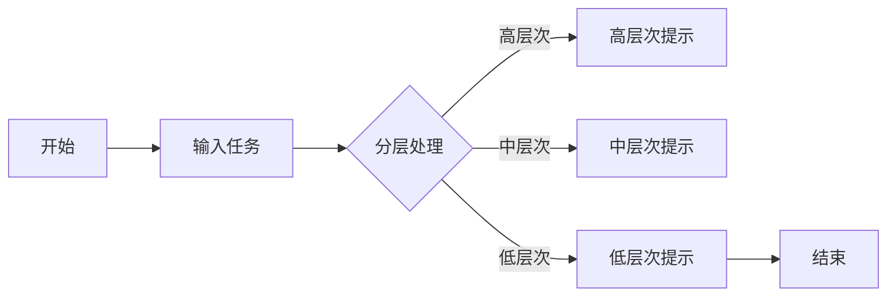
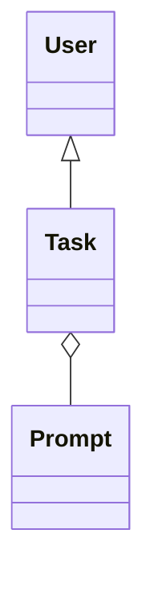
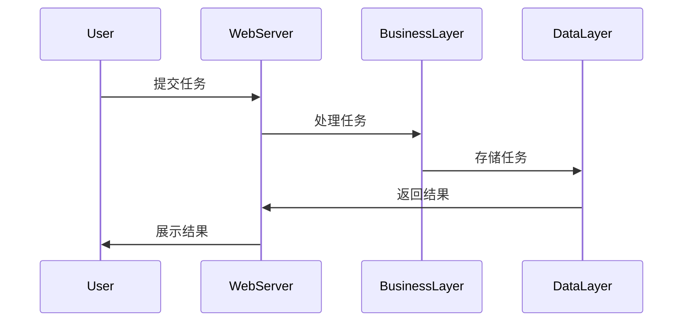
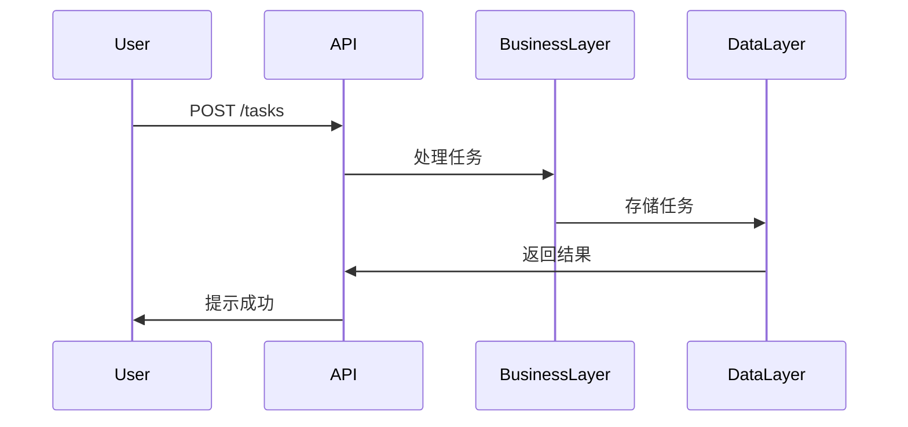

                 

### 文章标题：提示词分层：处理不同抽象级别的任务

#### 关键词：提示词分层、抽象级别、任务处理、算法原理、系统架构设计、实战案例

#### 摘要：
本文将探讨如何通过提示词分层技术，有效地处理不同抽象级别的任务。我们将从理论基础、核心概念、算法原理、系统架构设计到实际案例，逐步深入解析这一技术的应用，旨在为读者提供清晰、系统的理解和实战指导。

---

# 第一部分：理论基础

## 第1章 提示词分层概述

### 1.1 问题背景与定义

在信息化时代，任务处理变得日益复杂，不同类型的任务往往具有不同的抽象级别。提示词分层技术旨在通过将任务分解为不同抽象级别的提示词，实现高效的任务处理。这一技术不仅能够提高任务的执行效率，还能增强系统的灵活性和可扩展性。

### 1.2 提示词分层的意义

提示词分层技术具有以下几个方面的意义：

1. **提高任务执行效率**：通过将任务分解为不同抽象级别的提示词，能够针对每个层次的提示词进行优化，从而提高整体任务的执行效率。
2. **增强系统灵活性**：分层结构使得系统能够更好地适应不同的任务需求，提高系统的灵活性和可扩展性。
3. **便于任务管理**：分层结构有助于任务的管理和监控，使任务执行过程更加透明和可控。

### 1.3 提示词分层的现状与发展趋势

目前，提示词分层技术已广泛应用于多个领域，如自然语言处理、人工智能、软件工程等。随着技术的不断进步，提示词分层技术在未来有望得到更广泛的应用和发展。

## 第2章 核心概念与联系

### 2.1 核心概念原理

提示词分层技术的核心概念主要包括提示词层次结构、概念属性特征对比和ER实体关系图架构。

#### 2.1.1 提示词层次结构

提示词层次结构是提示词分层技术的核心。根据抽象程度的不同，提示词可分为三个层次：

1. **高层次**：概括性、抽象性，如“目标”、“策略”等。
2. **中层次**：实用性、具体性，如“方法”、“手段”等。
3. **低层次**：实际性、操作性，如“操作”、“执行”等。

#### 2.1.2 概念属性特征对比

| 层次 | 描述 | 属性特征 |
| --- | --- | --- |
| 高层次 | 概括性、抽象性 | 概念、目标、策略 |
| 中层次 | 实用性、具体性 | 方法、手段、过程 |
| 低层次 | 实际性、操作性 | 操作、执行、细节 |

#### 2.1.3 ER实体关系图架构

```mermaid
erDiagram
  A[用户] ||--|{ B[任务] }| 完成任务
  B ||--|{ C[提示词] }| 提供提示
```

## 第3章 算法原理讲解

### 3.1 提示词分层算法概述

提示词分层算法通过以下步骤实现：

1. **输入任务**：接收待处理的任务描述。
2. **分层处理**：根据任务描述，将任务分解为不同抽象级别的提示词。
3. **生成输出**：针对不同层次的提示词，生成相应的任务执行方案。

#### 3.1.1 算法流程



#### 3.1.2 算法mermaid流程图


### 3.2 算法数学模型与公式

提示词分层算法的数学模型如下：

$$
P(c|t) = \frac{P(t|c) \cdot P(c)}{P(t)}
$$

其中：

- $P(c|t)$：给定提示词$t$时，处于层次$c$的概率。
- $P(t|c)$：在层次$c$中生成提示词$t$的概率。
- $P(c)$：层次$c$出现的概率。
- $P(t)$：提示词$t$出现的概率。

### 3.3 算法举例说明

#### 3.3.1 案例一：任务分配

**任务描述**：将一个项目拆分为高层次、中层次和低层次的任务。

**输入**：项目描述

**输出**：高层次任务、中层次任务、低层次任务

**实现**：利用提示词分层算法，对项目描述进行分析，提取出不同层次的提示词。

**结果**：项目被成功拆分为高层次任务（项目规划、目标设定）、中层次任务（需求分析、设计实现）和低层次任务（代码编写、测试调试）。

---

# 第二部分：系统分析与架构设计

## 第4章 系统分析与架构设计

### 4.1 问题场景介绍

在项目管理中，如何有效地分配任务、监控进度和评估结果是一个重要问题。提示词分层技术能够帮助项目管理者更好地处理这些问题。

### 4.2 项目介绍

本项目旨在开发一个基于提示词分层技术的任务管理系统，以实现对项目任务的高效管理和监控。

### 4.3 系统功能设计

系统功能设计主要包括任务分配、任务监控和任务评估。

#### 4.3.1 任务分配

任务分配功能将根据项目需求，将任务拆分为不同抽象级别的提示词，并分配给相应的团队成员。

#### 4.3.2 任务监控

任务监控功能将实时跟踪任务的执行进度，并提供预警和异常处理机制。

#### 4.3.3 任务评估

任务评估功能将根据任务完成情况，对团队成员的表现进行评估，并生成相应的报告。

### 4.4 系统架构设计

系统架构设计主要包括领域模型、架构设计、接口设计和系统交互。

#### 4.4.1 领域模型

领域模型主要描述了系统中各个实体的关系和属性。



#### 4.4.2 架构设计

架构设计主要包括三层架构：表示层、业务逻辑层和数据层。



#### 4.4.3 接口设计

接口设计主要包括RESTful API设计，用于实现系统的功能调用。



#### 4.4.4 系统交互

系统交互主要描述了用户与系统之间的交互流程。


---

# 第三部分：项目实战

## 第5章 项目实战

### 5.1 环境安装

在本节中，我们将介绍如何搭建项目环境，包括所需软件和硬件的安装与配置。

### 5.2 系统核心实现源代码

在本节中，我们将展示系统的核心实现源代码，并对其关键部分进行解读。

### 5.3 代码应用解读与分析

在本节中，我们将深入分析系统代码，探讨其设计思路和实现方法。

### 5.4 实际案例分析与详细讲解剖析

在本节中，我们将结合实际案例，详细讲解如何使用提示词分层技术处理项目任务。

### 5.5 项目小结

在本节中，我们将总结项目的主要成果和经验，并指出项目中的不足之处。

---

# 第四部分：最佳实践与拓展

## 第6章 最佳实践与拓展

### 6.1 最佳实践 tips

在本节中，我们将分享一些最佳实践，帮助读者更好地应用提示词分层技术。

### 6.2 小结

在本节中，我们将回顾文章的主要内容，并强调关键概念。

### 6.3 注意事项

在本节中，我们将提醒读者在使用提示词分层技术时需要注意的事项。

### 6.4 拓展阅读

在本节中，我们将推荐一些相关的拓展阅读，供读者进一步学习。

---

# 作者信息

作者：AI天才研究院/AI Genius Institute & 禅与计算机程序设计艺术 /Zen And The Art of Computer Programming

---

# 结语

本文通过逐步分析提示词分层技术的理论基础、核心概念、算法原理、系统架构设计和实际案例，为读者提供了全面、系统的理解。希望本文能对读者在处理不同抽象级别的任务时有所帮助，并激发读者对这一技术的深入研究和应用。让我们继续探索技术领域的奥秘，共同推动人工智能和计算机科学的发展。

[回到文章顶部](#文章标题：提示词分层：处理不同抽象级别的任务)

