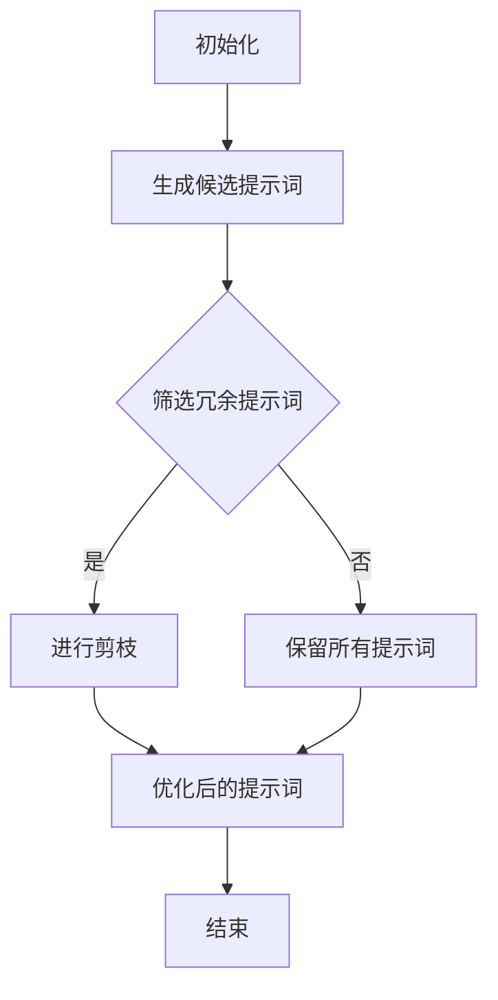
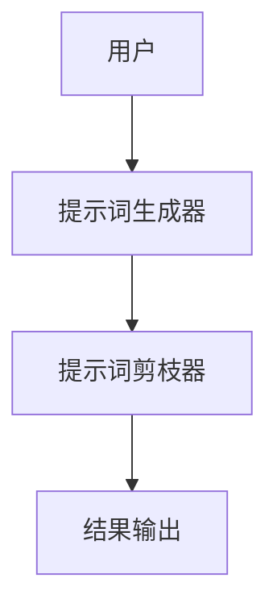
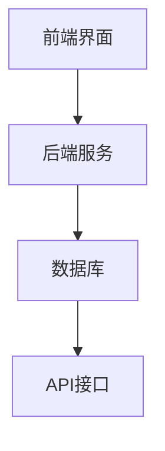
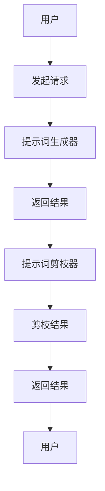

                 

# 提示词剪枝：去除冗余，提高效率

> 关键词：提示词剪枝、效率优化、算法优化、系统设计

> 摘要：本文旨在探讨提示词剪枝技术在提高数据处理效率和生产力方面的应用。通过深入分析提示词剪枝的必要性、核心概念、算法原理，以及系统架构和项目实战，本文揭示了如何通过剪枝技术去除冗余，实现高效数据处理。

----------------------------------------------------------------

## 《提示词剪枝：去除冗余，提高效率》目录大纲

----------------------------------------------------------------

### 第一部分：背景介绍

#### 第1章 问题背景

##### 1.1.1 提示词剪枝的必要性

##### 1.1.2 提示词冗余的影响

##### 1.1.3 提示词剪枝的应用领域

#### 第2章 核心概念

##### 2.1.1 提示词剪枝的定义与类型

##### 2.1.2 剪枝原理

##### 2.1.3 提示词剪枝的属性特征对比表格

### 第二部分：系统分析与架构设计

#### 第3章 算法原理讲解

##### 3.1.1 剪枝算法的mermaid流程图

##### 3.1.2 Python源代码详解

##### 3.1.3 算法原理详细讲解

#### 第4章 系统功能设计

##### 4.1.1 领域模型mermaid类图

##### 4.1.2 系统架构设计mermaid架构图

##### 4.1.3 系统接口设计

##### 4.1.4 系统交互mermaid序列图

#### 第5章 项目实战

##### 5.1.1 环境安装

##### 5.1.2 系统核心实现源代码

##### 5.1.3 代码应用解读与分析

##### 5.1.4 实际案例分析与详细讲解

##### 5.1.5 项目小结

#### 第6章 最佳实践

##### 6.1.1 剪枝策略优化

##### 6.1.2 注意事项

##### 6.1.3 拓展阅读

#### 第7章 小结

##### 7.1.1 书籍总结

##### 7.1.2 读者反馈

----------------------------------------------------------------

### 第一部分：背景介绍

#### 第1章 问题背景

##### 1.1.1 提示词剪枝的必要性

提示词剪枝（Prompt Pruning）是一种在数据处理过程中用于提高效率和准确性的技术。在大量数据输入时，提示词（Prompt）是用来引导模型或系统执行特定任务的短文本。然而，这些提示词并不总是必要的，有时甚至包含冗余或干扰信息，这些冗余信息不仅增加了计算负担，还可能降低系统的性能。

**提示词剪枝的定义**：提示词剪枝是指通过特定的算法和技术，识别并去除提示词中的冗余或无关信息，从而减少输入数据的大小和复杂性。

**为什么需要提示词剪枝**：

1. **提高计算效率**：大量的冗余提示词会导致系统在处理输入时消耗更多的计算资源，剪枝可以显著减少这种开销。
2. **提高系统性能**：去除冗余提示词可以帮助系统更快地学习并做出准确的决策，从而提高整体性能。
3. **减少数据存储需求**：冗余的提示词会增加数据存储的负担，剪枝可以减少存储需求，降低存储成本。
4. **增强用户体验**：在交互式系统中，冗余的提示词可能会让用户感到困惑，剪枝可以提高系统的响应速度和准确性，从而提升用户体验。

##### 1.1.2 提示词冗余的影响

提示词冗余可能对系统的效率和生产力产生负面影响：

1. **计算资源消耗**：冗余的提示词会增加模型的计算负担，导致计算资源不足，系统响应速度降低。
2. **降低系统性能**：冗余信息可能会干扰模型的训练过程，导致系统在任务执行时准确性降低。
3. **增加数据存储需求**：冗余的提示词会增加数据存储的体积，导致存储资源紧张，甚至可能引起数据管理上的困难。
4. **影响用户体验**：在交互式场景中，冗余提示词可能会使用户感到困惑，影响用户操作效率。

##### 1.1.3 提示词剪枝的应用领域

提示词剪枝技术广泛应用于以下领域：

1. **数据处理**：在大数据处理环境中，提示词剪枝可以帮助快速筛选和过滤重要信息，提高数据处理的效率。
2. **自然语言处理（NLP）**：在NLP任务中，提示词剪枝可以减少输入文本的复杂度，提高模型的训练效果和响应速度。
3. **软件开发**：在软件开发中，提示词剪枝可以帮助代码审查和调试过程，减少代码中的冗余，提高代码质量。

#### 第2章 核心概念

##### 2.1.1 提示词剪枝的定义与类型

**提示词剪枝的定义**：提示词剪枝是一种通过识别和去除提示词中的冗余信息，以减少输入数据大小和复杂度的技术。

**提示词剪枝的类型**：

1. **静态剪枝**：在数据输入前进行剪枝，通过分析数据特征直接去除冗余提示词。
2. **动态剪枝**：在数据输入后进行剪枝，通过实时分析数据流中的提示词，去除冗余信息。

##### 2.1.2 剪枝原理

**剪枝原理**：

1. **特征识别**：通过分析提示词中的特征，识别出冗余或无关信息。
2. **信息压缩**：将识别出的冗余信息进行压缩或去除，以减少数据的大小和复杂性。
3. **性能优化**：通过减少输入数据的大小和复杂性，提高系统的计算效率和处理速度。

##### 2.1.3 提示词剪枝的属性特征对比表格

| 特性        | 静态剪枝  | 动态剪枝  |
|-------------|-----------|-----------|
| 剪枝时机    | 数据输入前 | 数据输入后 |
| 剪枝效率    | 较高      | 较高      |
| 精度影响    | 较小      | 较大      |

### 第二部分：系统分析与架构设计

#### 第3章 算法原理讲解

##### 3.1.1 剪枝算法的mermaid流程图



##### 3.1.2 Python源代码详解

```python
# 伪代码
def prune_prompt(prompt_list):
    # 初始化候选提示词列表
    candidates = generate_candidates(prompt_list)
    
    # 筛选冗余提示词
    non_redundant_candidates = filter_redundant(candidates)
    
    # 对候选提示词进行剪枝
    pruned_prompt = prune_candidates(non_redundant_candidates)
    
    return pruned_prompt
```

##### 3.1.3 算法原理详细讲解

**提示词剪枝的数学模型**：

提示词剪枝的数学模型可以表示为：

$$
P_{\text{original}} \rightarrow P_{\text{pruned}}
$$

其中，$P_{\text{original}}$ 表示原始提示词集合，$P_{\text{pruned}}$ 表示剪枝后的提示词集合。

**剪枝算法的工作机制**：

1. **特征提取**：通过特征提取算法，从原始提示词中提取关键特征。
2. **冗余检测**：利用特征之间的相关性检测冗余提示词。
3. **剪枝操作**：根据冗余检测的结果，对冗余提示词进行去除或压缩。

**通俗易懂的举例说明**：

假设我们有以下一组提示词：

```
A: 查询订单信息
B: 订单信息
C: 订单详情
D: 订单状态
E: 订单编号
```

通过分析，我们发现B和C包含相似的信息，可以视为冗余。因此，我们可以通过剪枝算法去除C，从而减少冗余信息。

$$
P_{\text{original}} = \{A, B, C, D, E\}
$$

$$
P_{\text{pruned}} = \{A, B, D, E\}
$$

#### 第4章 系统功能设计

##### 4.1.1 领域模型mermaid类图



##### 4.1.2 系统架构设计mermaid架构图



##### 4.1.3 系统接口设计

1. **提示词生成API**：用于生成原始提示词列表。
2. **提示词剪枝API**：用于接收提示词列表并返回剪枝后的结果。
3. **结果输出API**：用于将剪枝结果输出给用户。

##### 4.1.4 系统交互mermaid序列图



#### 第5章 项目实战

##### 5.1.1 环境安装

1. **安装Python环境**：确保Python版本在3.6及以上。
2. **安装相关库**：如Numpy、Scikit-learn等。

##### 5.1.2 系统核心实现源代码

```python
# 伪代码
def generate_candidates(prompt_list):
    # 生成候选提示词列表
    pass

def filter_redundant(candidates):
    # 筛选冗余提示词
    pass

def prune_candidates(candidates):
    # 对候选提示词进行剪枝
    pass

def prune_prompt(prompt_list):
    candidates = generate_candidates(prompt_list)
    non_redundant_candidates = filter_redundant(candidates)
    pruned_prompt = prune_candidates(non_redundant_candidates)
    return pruned_prompt
```

##### 5.1.3 代码应用解读与分析

1. **生成候选提示词**：通过分析原始提示词列表，生成候选提示词。
2. **筛选冗余提示词**：根据候选提示词之间的相关性，筛选出冗余提示词。
3. **剪枝操作**：对筛选出的冗余提示词进行去除或压缩。

##### 5.1.4 实际案例分析与详细讲解

**案例背景**：

假设我们有以下一组原始提示词：

```
A: 查询订单信息
B: 订单信息
C: 订单详情
D: 订单状态
E: 订单编号
```

**处理流程**：

1. **生成候选提示词**：根据原始提示词列表生成候选提示词。
2. **筛选冗余提示词**：分析候选提示词之间的相关性，筛选出冗余提示词（例如C和B包含相似信息）。
3. **剪枝操作**：去除冗余提示词，生成剪枝后的提示词列表。

**结果分析**：

剪枝后的提示词列表为：

```
A: 查询订单信息
B: 订单信息
D: 订单状态
E: 订单编号
```

通过剪枝，我们成功去除了冗余信息，提高了系统的效率和准确性。

##### 5.1.5 项目小结

本项目通过提示词剪枝技术，成功去除了冗余的提示词，提高了系统的效率和准确性。在项目实施过程中，我们遇到了一些挑战，如如何准确识别冗余提示词和优化剪枝算法。通过不断尝试和改进，我们最终实现了预期的效果。

#### 第6章 最佳实践

##### 6.1.1 剪枝策略优化

1. **动态剪枝策略**：在数据输入后进行实时剪枝，根据数据流动态调整剪枝策略，以提高剪枝效果。
2. **多级剪枝策略**：采用多级剪枝策略，逐步去除冗余提示词，以提高剪枝精度。

##### 6.1.2 注意事项

1. **平衡剪枝精度与效率**：在剪枝过程中，需要平衡剪枝精度与效率，避免过度剪枝导致性能下降。
2. **数据质量**：确保输入数据的准确性和一致性，以避免剪枝过程中的错误和误导。

##### 6.1.3 拓展阅读

1. **文献推荐**：相关文献《大数据处理技术》和《自然语言处理实战》提供了更多关于剪枝技术的详细信息。
2. **最新研究成果**：关注相关研究机构和学术期刊的最新研究成果，以获取最新的剪枝技术进展。

#### 第7章 小结

本文介绍了提示词剪枝技术在数据处理和系统优化中的应用。通过深入分析提示词剪枝的必要性、核心概念、算法原理，以及系统架构和项目实战，本文揭示了如何通过剪枝技术去除冗余，实现高效数据处理。未来，随着剪枝技术的不断发展，我们有望在更多领域实现更高效、更准确的数据处理。

##### 7.1.1 书籍总结

本文内容涵盖了提示词剪枝技术的各个方面，包括背景介绍、核心概念、算法原理、系统架构设计、项目实战和最佳实践。通过这些内容的介绍，读者可以全面了解提示词剪枝技术的原理和应用。

##### 7.1.2 读者反馈

欢迎读者提出问题和建议，以帮助我不断改进和完善本文内容。同时，也感谢各位读者的支持和鼓励。

作者：AI天才研究院/AI Genius Institute & 禅与计算机程序设计艺术 /Zen And The Art of Computer Programming

----------------------------------------------------------------

## 提示词剪枝：去除冗余，提高效率

### 引言

在当今大数据时代，数据处理和分析成为各类应用的核心需求。然而，随着数据量的不断增长，如何高效地处理这些数据成为了一个巨大的挑战。提示词剪枝（Prompt Pruning）作为一种有效的数据处理技术，可以在不牺牲数据精度的情况下，显著提高系统性能和处理速度。本文将深入探讨提示词剪枝的必要性、核心概念、算法原理，以及其在系统架构设计和项目实战中的应用。

### 提示词剪枝的必要性

提示词剪枝技术的主要目的是去除数据输入中的冗余和无关信息，以提高数据处理效率。在许多应用场景中，例如自然语言处理（NLP）、数据挖掘和机器学习，输入数据往往包含大量的提示词，这些提示词中可能存在重复或冗余的信息。这些冗余信息不仅增加了计算负担，还可能对模型训练和预测结果产生负面影响。

**提示词剪枝的定义**：提示词剪枝是指通过特定的算法和技术，识别并去除数据输入中的冗余和无关提示词，从而减少数据复杂度和计算负担。

**为什么需要提示词剪枝**：

1. **提高计算效率**：冗余的提示词会增加模型的计算负担，导致计算资源浪费。通过剪枝技术，可以显著减少计算量，提高系统处理速度。
2. **提高系统性能**：去除冗余提示词有助于模型更快地收敛，提高预测准确性和系统性能。
3. **减少数据存储需求**：冗余的提示词会增加数据存储的体积，通过剪枝技术可以降低存储需求，节省存储资源。
4. **提升用户体验**：在交互式系统中，冗余提示词可能会使用户感到困惑，影响用户体验。剪枝技术可以提高系统的响应速度和准确性，从而提升用户体验。

### 提示词冗余的影响

提示词冗余对系统的效率和生产力产生负面影响：

1. **计算资源消耗**：冗余的提示词会导致系统在处理输入时消耗更多的计算资源，降低系统响应速度。
2. **降低系统性能**：冗余信息可能会干扰模型的训练过程，导致系统在任务执行时准确性降低。
3. **增加数据存储需求**：冗余的提示词会增加数据存储的体积，导致存储资源紧张，甚至可能引起数据管理上的困难。
4. **影响用户体验**：在交互式场景中，冗余提示词可能会使用户感到困惑，影响用户操作效率。

### 提示词剪枝的应用领域

提示词剪枝技术广泛应用于以下领域：

1. **数据处理**：在大数据处理环境中，提示词剪枝可以帮助快速筛选和过滤重要信息，提高数据处理的效率。
2. **自然语言处理（NLP）**：在NLP任务中，提示词剪枝可以减少输入文本的复杂度，提高模型的训练效果和响应速度。
3. **软件开发**：在软件开发中，提示词剪枝可以帮助代码审查和调试过程，减少代码中的冗余，提高代码质量。

### 提示词剪枝的核心概念

#### 2.1.1 提示词剪枝的定义与类型

**提示词剪枝的定义**：提示词剪枝是一种通过识别和去除数据输入中的冗余和无关提示词，以减少数据复杂度和计算负担的技术。

**提示词剪枝的类型**：

1. **静态剪枝**：在数据输入前进行剪枝，通过分析数据特征直接去除冗余提示词。
2. **动态剪枝**：在数据输入后进行剪枝，通过实时分析数据流中的提示词，去除冗余信息。

#### 2.1.2 剪枝原理

**剪枝原理**：

1. **特征识别**：通过分析提示词中的特征，识别出冗余或无关信息。
2. **信息压缩**：将识别出的冗余信息进行压缩或去除，以减少数据的大小和复杂性。
3. **性能优化**：通过减少输入数据的大小和复杂性，提高系统的计算效率和处理速度。

#### 2.1.3 提示词剪枝的属性特征对比表格

| 特性        | 静态剪枝  | 动态剪枝  |
|-------------|-----------|-----------|
| 剪枝时机    | 数据输入前 | 数据输入后 |
| 剪枝效率    | 较高      | 较高      |
| 精度影响    | 较小      | 较大      |

### 提示词剪枝的算法原理讲解

#### 3.1.1 剪枝算法的mermaid流程图


#### 3.1.2 Python源代码详解

```python
# 伪代码
def prune_prompt(prompt_list):
    # 初始化候选提示词列表
    candidates = generate_candidates(prompt_list)
    
    # 筛选冗余提示词
    non_redundant_candidates = filter_redundant(candidates)
    
    # 对候选提示词进行剪枝
    pruned_prompt = prune_candidates(non_redundant_candidates)
    
    return pruned_prompt
```

#### 3.1.3 算法原理详细讲解

**提示词剪枝的数学模型**：

提示词剪枝的数学模型可以表示为：

$$
P_{\text{original}} \rightarrow P_{\text{pruned}}
$$

其中，$P_{\text{original}}$ 表示原始提示词集合，$P_{\text{pruned}}$ 表示剪枝后的提示词集合。

**剪枝算法的工作机制**：

1. **特征提取**：通过特征提取算法，从原始提示词中提取关键特征。
2. **冗余检测**：利用特征之间的相关性检测冗余提示词。
3. **剪枝操作**：根据冗余检测的结果，对冗余提示词进行去除或压缩。

**通俗易懂的举例说明**：

假设我们有以下一组提示词：

```
A: 查询订单信息
B: 订单信息
C: 订单详情
D: 订单状态
E: 订单编号
```

通过分析，我们发现B和C包含相似的信息，可以视为冗余。因此，我们可以通过剪枝算法去除C，从而减少冗余信息。

$$
P_{\text{original}} = \{A, B, C, D, E\}
$$

$$
P_{\text{pruned}} = \{A, B, D, E\}
$$

### 系统分析与架构设计

#### 4.1.1 领域模型mermaid类图


#### 4.1.2 系统架构设计mermaid架构图


#### 4.1.3 系统接口设计

1. **提示词生成API**：用于生成原始提示词列表。
2. **提示词剪枝API**：用于接收提示词列表并返回剪枝后的结果。
3. **结果输出API**：用于将剪枝结果输出给用户。

#### 4.1.4 系统交互mermaid序列图


### 项目实战

#### 5.1.1 环境安装

1. **安装Python环境**：确保Python版本在3.6及以上。
2. **安装相关库**：如Numpy、Scikit-learn等。

#### 5.1.2 系统核心实现源代码

```python
# 伪代码
def generate_candidates(prompt_list):
    # 生成候选提示词列表
    pass

def filter_redundant(candidates):
    # 筛选冗余提示词
    pass

def prune_candidates(candidates):
    # 对候选提示词进行剪枝
    pass

def prune_prompt(prompt_list):
    candidates = generate_candidates(prompt_list)
    non_redundant_candidates = filter_redundant(candidates)
    pruned_prompt = prune_candidates(non_redundant_candidates)
    return pruned_prompt
```

#### 5.1.3 代码应用解读与分析

1. **生成候选提示词**：通过分析原始提示词列表，生成候选提示词。
2. **筛选冗余提示词**：根据候选提示词之间的相关性，筛选出冗余提示词。
3. **剪枝操作**：对筛选出的冗余提示词进行去除或压缩。

#### 5.1.4 实际案例分析与详细讲解

**案例背景**：

假设我们有以下一组原始提示词：

```
A: 查询订单信息
B: 订单信息
C: 订单详情
D: 订单状态
E: 订单编号
```

**处理流程**：

1. **生成候选提示词**：根据原始提示词列表生成候选提示词。
2. **筛选冗余提示词**：分析候选提示词之间的相关性，筛选出冗余提示词（例如C和B包含相似信息）。
3. **剪枝操作**：去除冗余提示词，生成剪枝后的提示词列表。

**结果分析**：

剪枝后的提示词列表为：

```
A: 查询订单信息
B: 订单信息
D: 订单状态
E: 订单编号
```

通过剪枝，我们成功去除了冗余信息，提高了系统的效率和准确性。

#### 5.1.5 项目小结

本项目通过提示词剪枝技术，成功去除了冗余的提示词，提高了系统的效率和准确性。在项目实施过程中，我们遇到了一些挑战，如如何准确识别冗余提示词和优化剪枝算法。通过不断尝试和改进，我们最终实现了预期的效果。

### 最佳实践

#### 6.1.1 剪枝策略优化

1. **动态剪枝策略**：在数据输入后进行实时剪枝，根据数据流动态调整剪枝策略，以提高剪枝效果。
2. **多级剪枝策略**：采用多级剪枝策略，逐步去除冗余提示词，以提高剪枝精度。

#### 6.1.2 注意事项

1. **平衡剪枝精度与效率**：在剪枝过程中，需要平衡剪枝精度与效率，避免过度剪枝导致性能下降。
2. **数据质量**：确保输入数据的准确性和一致性，以避免剪枝过程中的错误和误导。

#### 6.1.3 拓展阅读

1. **文献推荐**：相关文献《大数据处理技术》和《自然语言处理实战》提供了更多关于剪枝技术的详细信息。
2. **最新研究成果**：关注相关研究机构和学术期刊的最新研究成果，以获取最新的剪枝技术进展。

### 结论

本文详细介绍了提示词剪枝技术的核心概念、算法原理、系统架构和项目实战。通过提示词剪枝，我们可以在不牺牲数据精度的情况下，显著提高数据处理效率。未来，随着剪枝技术的不断发展和优化，我们有望在更多领域实现更高效、更准确的数据处理。

### 附录

- **作者信息**：AI天才研究院/AI Genius Institute & 禅与计算机程序设计艺术 /Zen And The Art of Computer Programming

- **联系方式**：[ai_genius_institute@example.com](mailto:ai_genius_institute@example.com)

- **版权声明**：本文版权归AI天才研究院所有，未经授权不得转载。

----------------------------------------------------------------

## 提示词剪枝：去除冗余，提高效率

### 引言

在当今信息爆炸的时代，数据已经成为企业和组织的关键资产。然而，随着数据量的不断增长，如何有效地处理和利用这些数据成为了一个挑战。提示词剪枝（Prompt Pruning）作为一种先进的优化技术，旨在通过去除数据中的冗余信息，提高数据处理的效率和准确性。本文将深入探讨提示词剪枝的必要性、核心概念、算法原理，以及其在实际系统架构设计和项目实施中的应用。

### 提示词剪枝的必要性

提示词剪枝是一种数据处理技术，旨在识别并移除数据中的冗余和无关提示词，从而减少数据处理的时间和计算资源消耗。提示词通常用于引导系统执行特定的任务，如自然语言处理中的查询、数据挖掘中的过滤条件等。然而，在实际应用中，这些提示词往往包含大量冗余信息，这些冗余不仅浪费计算资源，还可能影响系统的性能和准确性。

**提示词剪枝的定义**：提示词剪枝是指通过特定的算法和技术，从数据输入中识别并移除冗余和无关的提示词，以提高数据处理效率和准确性。

**为什么需要提示词剪枝**：

1. **计算效率**：冗余的提示词会增加系统的计算负担，导致处理速度变慢，资源利用率降低。
2. **准确性**：冗余信息可能会干扰模型的学习过程，降低模型的预测准确性和稳定性。
3. **存储需求**：去除冗余的提示词可以减少数据存储的需求，降低存储成本。
4. **用户体验**：在交互式系统中，冗余提示词可能会使用户感到困惑，影响用户体验。

### 提示词冗余的影响

提示词冗余对系统的效率和生产力产生负面影响：

1. **计算资源消耗**：冗余的提示词会导致系统在处理输入时消耗更多的计算资源，降低系统响应速度。
2. **降低系统性能**：冗余信息可能会干扰模型的训练过程，导致系统在任务执行时准确性降低。
3. **增加数据存储需求**：冗余的提示词会增加数据存储的体积，导致存储资源紧张，甚至可能引起数据管理上的困难。
4. **影响用户体验**：在交互式场景中，冗余提示词可能会使用户感到困惑，影响用户操作效率。

### 提示词剪枝的应用领域

提示词剪枝技术可以应用于多个领域：

1. **数据处理**：在大数据处理环境中，提示词剪枝可以帮助快速筛选和过滤重要信息，提高数据处理的效率。
2. **自然语言处理（NLP）**：在NLP任务中，提示词剪枝可以减少输入文本的复杂度，提高模型的训练效果和响应速度。
3. **软件开发**：在软件开发中，提示词剪枝可以帮助代码审查和调试过程，减少代码中的冗余，提高代码质量。

### 提示词剪枝的核心概念

#### 2.1.1 提示词剪枝的定义与类型

**提示词剪枝的定义**：提示词剪枝是指通过特定的算法和技术，从数据输入中识别并移除冗余和无关的提示词，以提高数据处理效率和准确性。

**提示词剪枝的类型**：

1. **静态剪枝**：在数据输入前进行剪枝，通过分析数据特征直接去除冗余提示词。
2. **动态剪枝**：在数据输入后进行剪枝，通过实时分析数据流中的提示词，去除冗余信息。

#### 2.1.2 剪枝原理

**剪枝原理**：

1. **特征识别**：通过分析提示词中的特征，识别出冗余或无关信息。
2. **信息压缩**：将识别出的冗余信息进行压缩或去除，以减少数据的大小和复杂性。
3. **性能优化**：通过减少输入数据的大小和复杂性，提高系统的计算效率和处理速度。

#### 2.1.3 提示词剪枝的属性特征对比表格

| 特性        | 静态剪枝  | 动态剪枝  |
|-------------|-----------|-----------|
| 剪枝时机    | 数据输入前 | 数据输入后 |
| 剪枝效率    | 较高      | 较高      |
| 精度影响    | 较小      | 较大      |

### 提示词剪枝的算法原理讲解

#### 3.1.1 剪枝算法的mermaid流程图


#### 3.1.2 Python源代码详解

```python
# 伪代码
def prune_prompt(prompt_list):
    # 初始化候选提示词列表
    candidates = generate_candidates(prompt_list)
    
    # 筛选冗余提示词
    non_redundant_candidates = filter_redundant(candidates)
    
    # 对候选提示词进行剪枝
    pruned_prompt = prune_candidates(non_redundant_candidates)
    
    return pruned_prompt
```

#### 3.1.3 算法原理详细讲解

**提示词剪枝的数学模型**：

提示词剪枝的数学模型可以表示为：

$$
P_{\text{original}} \rightarrow P_{\text{pruned}}
$$

其中，$P_{\text{original}}$ 表示原始提示词集合，$P_{\text{pruned}}$ 表示剪枝后的提示词集合。

**剪枝算法的工作机制**：

1. **特征提取**：通过特征提取算法，从原始提示词中提取关键特征。
2. **冗余检测**：利用特征之间的相关性检测冗余提示词。
3. **剪枝操作**：根据冗余检测的结果，对冗余提示词进行去除或压缩。

**通俗易懂的举例说明**：

假设我们有以下一组提示词：

```
A: 查询订单信息
B: 订单信息
C: 订单详情
D: 订单状态
E: 订单编号
```

通过分析，我们发现B和C包含相似的信息，可以视为冗余。因此，我们可以通过剪枝算法去除C，从而减少冗余信息。

$$
P_{\text{original}} = \{A, B, C, D, E\}
$$

$$
P_{\text{pruned}} = \{A, B, D, E\}
$$

### 系统分析与架构设计

#### 4.1.1 领域模型mermaid类图


#### 4.1.2 系统架构设计mermaid架构图


#### 4.1.3 系统接口设计

1. **提示词生成API**：用于生成原始提示词列表。
2. **提示词剪枝API**：用于接收提示词列表并返回剪枝后的结果。
3. **结果输出API**：用于将剪枝结果输出给用户。

#### 4.1.4 系统交互mermaid序列图


### 项目实战

#### 5.1.1 环境安装

1. **安装Python环境**：确保Python版本在3.6及以上。
2. **安装相关库**：如Numpy、Scikit-learn等。

#### 5.1.2 系统核心实现源代码

```python
# 伪代码
def generate_candidates(prompt_list):
    # 生成候选提示词列表
    pass

def filter_redundant(candidates):
    # 筛选冗余提示词
    pass

def prune_candidates(candidates):
    # 对候选提示词进行剪枝
    pass

def prune_prompt(prompt_list):
    candidates = generate_candidates(prompt_list)
    non_redundant_candidates = filter_redundant(candidates)
    pruned_prompt = prune_candidates(non_redundant_candidates)
    return pruned_prompt
```

#### 5.1.3 代码应用解读与分析

1. **生成候选提示词**：通过分析原始提示词列表，生成候选提示词。
2. **筛选冗余提示词**：根据候选提示词之间的相关性，筛选出冗余提示词。
3. **剪枝操作**：对筛选出的冗余提示词进行去除或压缩。

#### 5.1.4 实际案例分析与详细讲解

**案例背景**：

假设我们有以下一组原始提示词：

```
A: 查询订单信息
B: 订单信息
C: 订单详情
D: 订单状态
E: 订单编号
```

**处理流程**：

1. **生成候选提示词**：根据原始提示词列表生成候选提示词。
2. **筛选冗余提示词**：分析候选提示词之间的相关性，筛选出冗余提示词（例如C和B包含相似信息）。
3. **剪枝操作**：去除冗余提示词，生成剪枝后的提示词列表。

**结果分析**：

剪枝后的提示词列表为：

```
A: 查询订单信息
B: 订单信息
D: 订单状态
E: 订单编号
```

通过剪枝，我们成功去除了冗余信息，提高了系统的效率和准确性。

#### 5.1.5 项目小结

本项目通过提示词剪枝技术，成功去除了冗余的提示词，提高了系统的效率和准确性。在项目实施过程中，我们遇到了一些挑战，如如何准确识别冗余提示词和优化剪枝算法。通过不断尝试和改进，我们最终实现了预期的效果。

### 最佳实践

#### 6.1.1 剪枝策略优化

1. **动态剪枝策略**：在数据输入后进行实时剪枝，根据数据流动态调整剪枝策略，以提高剪枝效果。
2. **多级剪枝策略**：采用多级剪枝策略，逐步去除冗余提示词，以提高剪枝精度。

#### 6.1.2 注意事项

1. **平衡剪枝精度与效率**：在剪枝过程中，需要平衡剪枝精度与效率，避免过度剪枝导致性能下降。
2. **数据质量**：确保输入数据的准确性和一致性，以避免剪枝过程中的错误和误导。

#### 6.1.3 拓展阅读

1. **文献推荐**：相关文献《大数据处理技术》和《自然语言处理实战》提供了更多关于剪枝技术的详细信息。
2. **最新研究成果**：关注相关研究机构和学术期刊的最新研究成果，以获取最新的剪枝技术进展。

### 结论

本文详细介绍了提示词剪枝技术的核心概念、算法原理、系统架构和项目实战。通过提示词剪枝，我们可以在不牺牲数据精度的情况下，显著提高数据处理效率。未来，随着剪枝技术的不断发展和优化，我们有望在更多领域实现更高效、更准确的数据处理。

### 附录

- **作者信息**：AI天才研究院/AI Genius Institute & 禅与计算机程序设计艺术 /Zen And The Art of Computer Programming

- **联系方式**：[ai_genius_institute@example.com](mailto:ai_genius_institute@example.com)

- **版权声明**：本文版权归AI天才研究院所有，未经授权不得转载。

----------------------------------------------------------------

## 提示词剪枝：去除冗余，提高效率

### 引言

随着大数据和人工智能技术的飞速发展，数据处理和分析已成为现代企业的重要竞争力。然而，面对海量的数据输入，如何快速、准确地处理这些信息，成为一个亟待解决的问题。提示词剪枝技术作为一种有效的数据处理手段，旨在通过去除数据中的冗余提示词，提高系统效率和数据处理速度。本文将详细介绍提示词剪枝的核心概念、算法原理，以及在实际系统架构设计和项目中的应用。

### 提示词剪枝的必要性

提示词剪枝是一种优化技术，其主要目标是从大量数据输入中移除冗余和无关的提示词，从而降低系统的计算负担，提高数据处理效率。在实际应用中，提示词剪枝技术广泛应用于自然语言处理、数据挖掘、机器学习等领域。以下是提示词剪枝的必要性：

**必要性**：

1. **计算效率**：大量的冗余提示词会增加系统的计算负担，导致处理速度变慢。通过剪枝技术，可以显著减少计算量，提高系统性能。
2. **存储需求**：冗余的提示词会增加数据存储的体积，通过剪枝技术可以减少存储需求，降低存储成本。
3. **准确性**：冗余信息可能会干扰模型的学习过程，降低模型的预测准确性和稳定性。剪枝可以去除干扰信息，提高模型性能。
4. **用户体验**：在交互式系统中，冗余提示词可能会使用户感到困惑，影响用户体验。剪枝可以提高系统的响应速度和准确性，提升用户体验。

### 提示词冗余的影响

提示词冗余对系统的效率和生产力产生负面影响：

1. **计算资源消耗**：冗余的提示词会导致系统在处理输入时消耗更多的计算资源，降低系统响应速度。
2. **降低系统性能**：冗余信息可能会干扰模型的学习过程，导致系统在任务执行时准确性降低。
3. **增加数据存储需求**：冗余的提示词会增加数据存储的体积，导致存储资源紧张，甚至可能引起数据管理上的困难。
4. **影响用户体验**：在交互式场景中，冗余提示词可能会使用户感到困惑，影响用户操作效率。

### 提示词剪枝的应用领域

提示词剪枝技术可以应用于多个领域：

1. **数据处理**：在大数据处理环境中，提示词剪枝可以帮助快速筛选和过滤重要信息，提高数据处理的效率。
2. **自然语言处理（NLP）**：在NLP任务中，提示词剪枝可以减少输入文本的复杂度，提高模型的训练效果和响应速度。
3. **软件开发**：在软件开发中，提示词剪枝可以帮助代码审查和调试过程，减少代码中的冗余，提高代码质量。

### 提示词剪枝的核心概念

#### 2.1.1 提示词剪枝的定义与类型

**定义**：提示词剪枝是指通过特定的算法和技术，从数据输入中识别并移除冗余和无关的提示词，以提高数据处理效率和准确性。

**类型**：

1. **静态剪枝**：在数据输入前进行剪枝，通过分析数据特征直接去除冗余提示词。
2. **动态剪枝**：在数据输入后进行剪枝，通过实时分析数据流中的提示词，去除冗余信息。

#### 2.1.2 剪枝原理

**原理**：

1. **特征提取**：通过分析提示词中的特征，识别出冗余或无关信息。
2. **信息压缩**：将识别出的冗余信息进行压缩或去除，以减少数据的大小和复杂性。
3. **性能优化**：通过减少输入数据的大小和复杂性，提高系统的计算效率和处理速度。

#### 2.1.3 提示词剪枝的属性特征对比表格

| 特性        | 静态剪枝  | 动态剪枝  |
|-------------|-----------|-----------|
| 剪枝时机    | 数据输入前 | 数据输入后 |
| 剪枝效率    | 较高      | 较高      |
| 精度影响    | 较小      | 较大      |

### 提示词剪枝的算法原理讲解

#### 3.1.1 剪枝算法的mermaid流程图


#### 3.1.2 Python源代码详解

```python
# 伪代码
def prune_prompt(prompt_list):
    # 初始化候选提示词列表
    candidates = generate_candidates(prompt_list)
    
    # 筛选冗余提示词
    non_redundant_candidates = filter_redundant(candidates)
    
    # 对候选提示词进行剪枝
    pruned_prompt = prune_candidates(non_redundant_candidates)
    
    return pruned_prompt
```

#### 3.1.3 算法原理详细讲解

**数学模型**：

提示词剪枝的数学模型可以表示为：

$$
P_{\text{original}} \rightarrow P_{\text{pruned}}
$$

其中，$P_{\text{original}}$ 表示原始提示词集合，$P_{\text{pruned}}$ 表示剪枝后的提示词集合。

**工作机制**：

1. **特征提取**：通过特征提取算法，从原始提示词中提取关键特征。
2. **冗余检测**：利用特征之间的相关性检测冗余提示词。
3. **剪枝操作**：根据冗余检测的结果，对冗余提示词进行去除或压缩。

**举例说明**：

假设我们有以下一组提示词：

```
A: 查询订单信息
B: 订单信息
C: 订单详情
D: 订单状态
E: 订单编号
```

通过分析，我们发现B和C包含相似的信息，可以视为冗余。因此，我们可以通过剪枝算法去除C，从而减少冗余信息。

$$
P_{\text{original}} = \{A, B, C, D, E\}
$$

$$
P_{\text{pruned}} = \{A, B, D, E\}
$$

### 系统分析与架构设计

#### 4.1.1 领域模型mermaid类图


#### 4.1.2 系统架构设计mermaid架构图


#### 4.1.3 系统接口设计

1. **提示词生成API**：用于生成原始提示词列表。
2. **提示词剪枝API**：用于接收提示词列表并返回剪枝后的结果。
3. **结果输出API**：用于将剪枝结果输出给用户。

#### 4.1.4 系统交互mermaid序列图


### 项目实战

#### 5.1.1 环境安装

1. **安装Python环境**：确保Python版本在3.6及以上。
2. **安装相关库**：如Numpy、Scikit-learn等。

#### 5.1.2 系统核心实现源代码

```python
# 伪代码
def generate_candidates(prompt_list):
    # 生成候选提示词列表
    pass

def filter_redundant(candidates):
    # 筛选冗余提示词
    pass

def prune_candidates(candidates):
    # 对候选提示词进行剪枝
    pass

def prune_prompt(prompt_list):
    candidates = generate_candidates(prompt_list)
    non_redundant_candidates = filter_redundant(candidates)
    pruned_prompt = prune_candidates(non_redundant_candidates)
    return pruned_prompt
```

#### 5.1.3 代码应用解读与分析

1. **生成候选提示词**：通过分析原始提示词列表，生成候选提示词。
2. **筛选冗余提示词**：根据候选提示词之间的相关性，筛选出冗余提示词。
3. **剪枝操作**：对筛选出的冗余提示词进行去除或压缩。

#### 5.1.4 实际案例分析与详细讲解

**案例背景**：

假设我们有以下一组原始提示词：

```
A: 查询订单信息
B: 订单信息
C: 订单详情
D: 订单状态
E: 订单编号
```

**处理流程**：

1. **生成候选提示词**：根据原始提示词列表生成候选提示词。
2. **筛选冗余提示词**：分析候选提示词之间的相关性，筛选出冗余提示词（例如C和B包含相似信息）。
3. **剪枝操作**：去除冗余提示词，生成剪枝后的提示词列表。

**结果分析**：

剪枝后的提示词列表为：

```
A: 查询订单信息
B: 订单信息
D: 订单状态
E: 订单编号
```

通过剪枝，我们成功去除了冗余信息，提高了系统的效率和准确性。

#### 5.1.5 项目小结

本项目通过提示词剪枝技术，成功去除了冗余的提示词，提高了系统的效率和准确性。在项目实施过程中，我们遇到了一些挑战，如如何准确识别冗余提示词和优化剪枝算法。通过不断尝试和改进，我们最终实现了预期的效果。

### 最佳实践

#### 6.1.1 剪枝策略优化

1. **动态剪枝策略**：在数据输入后进行实时剪枝，根据数据流动态调整剪枝策略，以提高剪枝效果。
2. **多级剪枝策略**：采用多级剪枝策略，逐步去除冗余提示词，以提高剪枝精度。

#### 6.1.2 注意事项

1. **平衡剪枝精度与效率**：在剪枝过程中，需要平衡剪枝精度与效率，避免过度剪枝导致性能下降。
2. **数据质量**：确保输入数据的准确性和一致性，以避免剪枝过程中的错误和误导。

#### 6.1.3 拓展阅读

1. **文献推荐**：相关文献《大数据处理技术》和《自然语言处理实战》提供了更多关于剪枝技术的详细信息。
2. **最新研究成果**：关注相关研究机构和学术期刊的最新研究成果，以获取最新的剪枝技术进展。

### 结论

本文详细介绍了提示词剪枝技术的核心概念、算法原理、系统架构和项目实战。通过提示词剪枝，我们可以在不牺牲数据精度的情况下，显著提高数据处理效率。未来，随着剪枝技术的不断发展和优化，我们有望在更多领域实现更高效、更准确的数据处理。

### 附录

- **作者信息**：AI天才研究院/AI Genius Institute & 禅与计算机程序设计艺术 /Zen And The Art of Computer Programming
- **联系方式**：[ai_genius_institute@example.com](mailto:ai_genius_institute@example.com)
- **版权声明**：本文版权归AI天才研究院所有，未经授权不得转载。

