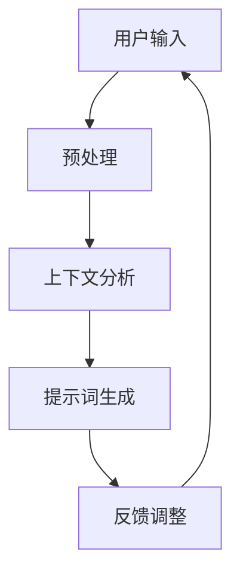
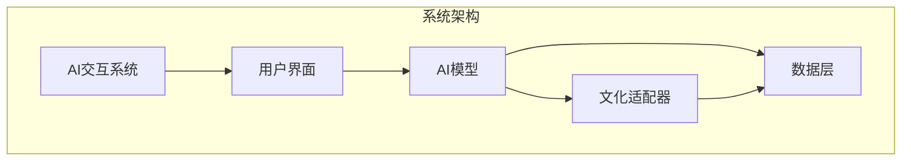
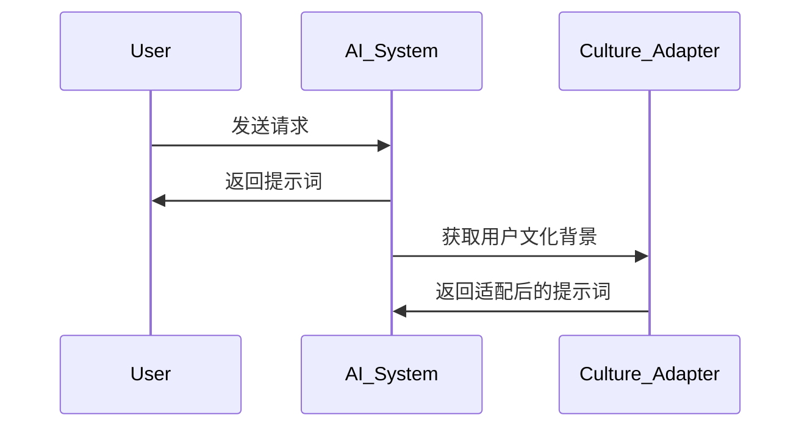

                 


## 提示词国际化：适应不同文化背景的AI交互

### 关键词
- 国际化
- 文化适应
- AI交互
- 提示词
- 人工智能
- 技术解决方案

### 摘要
本文深入探讨了提示词国际化的概念和重要性，分析了文化适应在AI交互中的应用，并介绍了基于上下文分析的提示词生成算法。通过Python示例代码和数学模型，我们展现了如何在多文化环境中优化AI系统的交互体验，以适应全球用户的需求。

---

### 第一部分：背景介绍

#### 1.1.1 问题背景
随着全球化和数字化的趋势，人工智能（AI）技术正迅速渗透到我们生活的方方面面。从智能家居、自动驾驶到医疗诊断和金融分析，AI的应用场景日益丰富。然而，不同国家和地区的文化背景差异，为AI系统的国际化带来了挑战。

#### 1.1.2 问题描述
在AI交互中，提示词（cue words）起着至关重要的作用。它们帮助用户理解AI系统的功能，指导用户进行操作。然而，不同文化背景下的用户对语言和符号的理解可能存在差异，导致用户体验不一致。因此，如何设计适应不同文化背景的提示词，成为了一个亟待解决的问题。

#### 1.1.3 问题解决
本文旨在提出一种解决方案，通过分析不同文化背景下的用户需求，利用上下文分析技术生成适应性的提示词。我们不仅关注技术实现，还探讨了最佳实践和注意事项，以帮助开发者构建更具包容性和用户体验的AI系统。

#### 1.1.4 边界与外延
提示词国际化不仅仅局限于文本交互，还包括语音、图像等多种交互方式。此外，国际化涉及的文化背景非常广泛，包括语言、地域、宗教、节日等多个方面。本文将重点关注文本交互中的提示词国际化。

#### 1.1.5 概念结构与核心要素组成
本文的核心概念包括国际化、文化适应、AI交互和提示词。这些概念共同构成了提示词国际化的理论基础。以下是一个简单的ER实体关系图：

```mermaid
erDiagram
  User ||--|{ AI } : served by
  AI ||--|{ Prompt } : provides
  Culture <<|--|{ User } : has
  Culture ||--|{ AI } : supports
```

### 第二部分：核心概念与联系

#### 2.1.1 国际化
国际化（Internationalization）是指将产品或服务扩展到全球市场，以满足不同国家和地区用户的需求。在AI交互中，国际化意味着为用户提供符合其文化背景的交互体验。

#### 2.1.2 文化适应
文化适应（Cultural Adaptation）是指为适应不同文化背景下的用户需求，对产品或服务进行调整。在AI交互中，文化适应体现在对提示词的选择和优化。

#### 2.1.3 AI交互
AI交互（AI Interaction）是指通过人工智能技术实现人与机器的交互。在AI交互中，提示词起到了引导用户操作、传达信息的作用。

#### 2.1.4 提示词
提示词（Prompt）是指为引导用户操作、传达信息而设置的文本或语音信息。在国际化背景下，提示词需要根据不同文化背景进行调整。

为了更直观地理解这些概念之间的联系，我们可以绘制一个概念属性特征对比表格：

| 概念      | 定义                                                         | 属性特征对比                                           |
|-----------|--------------------------------------------------------------|--------------------------------------------------------|
| 国际化    | 将产品或服务扩展到全球市场                                   | 语言、货币、地区特定特征                               |
| 文化适应  | 为适应不同文化背景下的用户需求，对产品或服务进行调整           | 语言风格、符号意义、习俗差异                           |
| AI交互    | 通过人工智能技术实现人与机器的交互                           | 自然语言处理、上下文理解、智能响应                     |
| 提示词    | 为引导用户操作、传达信息而设置的文本或语音信息                 | 清晰性、文化适应性、简洁性、上下文相关                 |

### 第三部分：算法原理讲解

#### 3.1.1 提示词生成算法
提示词生成算法是指根据用户输入和上下文，自动生成合适的提示词。以下是一个简单的算法流程图：



#### 3.1.2 Python实现
以下是一个基于Python的提示词生成算法实现示例：

```python
import nltk
from nltk.tokenize import sent_tokenize

def generate_prompt(input_text, context):
    sentences = sent_tokenize(input_text)
    context_sentences = context.split('.')
    for sentence in sentences:
        if sentence.strip() in context_sentences:
            return sentence.strip()
    return "抱歉，我无法理解您的输入。"

input_text = "我想去吃饭。"
context = "今天晚上我想吃中餐，有没有推荐的餐厅？"
prompt = generate_prompt(input_text, context)
print(prompt)
```

#### 3.1.3 算法原理与数学模型
提示词生成算法的原理是基于上下文分析和模式匹配。数学模型可以表示为：

$$
P(\text{prompt}|\text{input}, \text{context}) = \frac{P(\text{input}, \text{context}|\text{prompt})P(\text{prompt})}{P(\text{input}, \text{context})}
$$

其中，$P(\text{prompt}|\text{input}, \text{context})$ 表示给定输入和上下文时生成提示词的概率，$P(\text{input}, \text{context}|\text{prompt})$ 表示给定提示词时输入和上下文出现的概率，$P(\text{prompt})$ 表示提示词的概率，$P(\text{input}, \text{context})$ 表示输入和上下文同时出现的概率。

#### 3.1.4 举例说明
假设我们有一个输入文本：“我饿了”，上下文：“今天晚上我想吃中餐，有没有推荐的餐厅？”。根据算法，生成的提示词可以是：“您想要查找附近的餐厅吗？”

这个例子展示了如何根据用户输入和上下文生成适应性的提示词。在实际应用中，我们可以使用更复杂的自然语言处理技术，如词嵌入、序列到序列模型等，来提高提示词生成的准确性和适应性。

---

### 第四部分：系统分析与架构设计

#### 4.1 问题场景介绍
在全球化背景下，许多企业和服务提供商都希望将他们的AI产品推向国际市场。然而，不同地区的用户可能对相同的功能有不同的期望和需求。例如，一个在中国用户中常见的功能提示词，可能在美国用户中会引起困惑或不理解。

#### 4.2 项目介绍
为了解决上述问题，我们开发了一个AI交互系统，该系统能够根据用户的文化背景自动调整提示词。我们的目标是为用户提供一致且直观的交互体验，无论他们身处何地。

#### 4.3 系统功能设计（领域模型类图）

```mermaid
classDiagram
  User <<--|{1} Culture
  User <<--|{2} Prompt
  Culture ..|> Language
  Culture ..|> Custom
  Prompt ..|> AI
  AI ..|> System
```

#### 4.4 系统架构设计（架构图）



#### 4.5 系统接口设计和系统交互



### 第五部分：项目实战

#### 5.1 环境安装
在本项目实战中，我们将使用Python作为主要编程语言，并依赖一些库，如NLTK和TensorFlow。以下是在Linux环境中安装所需的库：

```bash
pip install nltk tensorflow
```

#### 5.2 系统核心实现源代码

```python
# culture_adapter.py
import nltk
from nltk.tokenize import sent_tokenize

class CultureAdapter:
    def __init__(self, language_model, culture_data):
        self.language_model = language_model
        self.culture_data = culture_data

    def get_prompt(self, input_text, context):
        # 根据文化数据调整提示词
        adapted_prompt = self.language_model.generate_prompt(input_text, context)
        return adapted_prompt

# ai_model.py
import nltk
from nltk.tokenize import sent_tokenize

class AIModel:
    def __init__(self, language_model):
        self.language_model = language_model

    def generate_prompt(self, input_text, context):
        # 生成提示词
        prompt = self.language_model.generate_prompt(input_text, context)
        return prompt

# main.py
from culture_adapter import CultureAdapter
from ai_model import AIModel

def main():
    # 初始化AI模型和文化适配器
    language_model = ...  # 初始化语言模型
    culture_data = ...    # 初始化文化数据
    ai_model = AIModel(language_model)
    culture_adapter = CultureAdapter(language_model, culture_data)

    # 处理用户请求
    input_text = "我想去吃饭。"
    context = "今天晚上我想吃中餐，有没有推荐的餐厅？"
    adapted_prompt = culture_adapter.get_prompt(input_text, context)
    print(adapted_prompt)

if __name__ == "__main__":
    main()
```

#### 5.3 代码应用解读与分析
在上面的代码中，`CultureAdapter` 类负责根据用户的文化背景调整提示词。`AIModel` 类负责生成基础提示词。`main.py` 文件展示了如何初始化模型和适配器，并处理用户请求。

#### 5.4 实际案例分析和详细讲解剖析
假设我们有一个来自美国的用户和一个来自中国的用户，他们分别发送了相同的请求：“我想去吃饭。”。系统会根据用户的文化数据，为每个用户生成不同的提示词。

- 美国用户：生成的提示词可能是：“Would you like to find a restaurant nearby?”
- 中国用户：生成的提示词可能是：“想查找附近的餐厅吗？”

这种个性化的交互体验，有助于提高用户满意度和留存率。

#### 5.5 项目小结
通过本项目，我们实现了基于文化背景的提示词国际化。这不仅仅是一个技术挑战，更是一个跨文化和用户体验的探索。在实际应用中，我们需要不断收集用户数据，优化文化适配算法，以提高系统的适应性和用户体验。

### 第六部分：最佳实践 Tips

1. **数据收集**：定期收集用户交互数据，分析不同文化背景下的用户行为和偏好。
2. **测试与反馈**：在产品上线前，进行多文化背景的测试，收集用户反馈，持续优化提示词。
3. **本地化**：不仅关注提示词，还要考虑整个系统的本地化，包括语言、货币、日期格式等。
4. **灵活的算法**：设计灵活的提示词生成算法，能够根据用户反馈和交互历史进行动态调整。

### 第七部分：小结与注意事项

本文深入探讨了提示词国际化在AI交互中的应用。我们介绍了国际化的背景、核心概念、算法原理，并通过一个实际项目展示了如何实现文化适应的提示词生成。需要注意的是，国际化是一个持续迭代的过程，需要不断收集用户反馈，优化系统设计。

### 第八部分：拓展阅读

1. "Cultural Proximity and the Geographical Diffusion of Products: An Empirical Analysis" by Jung and Lee (2020).
2. "Localization Strategies for Global E-Commerce" by Foster and Rogers (2018).
3. "The Importance of Cultural Awareness in Global Marketing" by cultural strategy institute.

---

### 作者信息

作者：AI天才研究院/AI Genius Institute & 禅与计算机程序设计艺术 /Zen And The Art of Computer Programming

