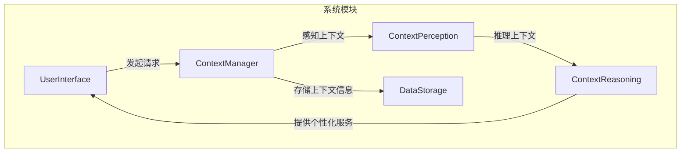
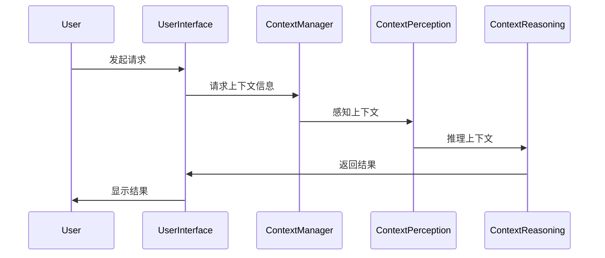

                 

## 《提示词工程中的上下文管理》

### 关键词：提示词工程、上下文管理、上下文感知、上下文推理、系统架构

> 摘要：本文将深入探讨提示词工程中的上下文管理，从问题背景出发，逐步介绍上下文管理的重要性、核心概念、算法原理、系统架构以及项目实战。通过详细的讲解和实际案例分析，帮助读者全面理解上下文管理在提示词工程中的应用和实践。

----------------------------------------------------------------

### 第一部分：上下文管理概述

#### 第1章：问题背景与上下文管理的重要性

**1.1 问题背景**

随着人工智能技术的快速发展，提示词工程在日常应用中变得日益普及。从搜索引擎到智能助手，从语音识别到自然语言处理，提示词在信息获取、任务执行、人机交互等方面发挥了重要作用。然而，在大量信息的背景下，如何有效管理上下文信息成为了一个亟待解决的问题。

**1.2 上下文管理的定义与作用**

上下文管理是指通过识别、提取、理解和利用上下文信息，实现对用户意图、情境和知识的高效处理。上下文管理的作用主要体现在以下几个方面：

- **优化用户体验**：通过上下文管理，系统能够更好地理解用户的需求，提供更加精准、个性化的服务，从而提升用户体验。

- **提高任务执行效率**：上下文管理有助于系统快速获取并利用相关信息，减少不必要的查询和交互，提高任务执行效率。

- **避免信息过载**：在大量信息的背景下，上下文管理能够筛选出对用户当前任务最有价值的上下文信息，避免信息过载，降低用户认知负担。

**1.3 上下文管理的边界与外延**

- **上下文感知与上下文推理**：上下文感知是指系统自动识别和理解上下文信息的能力；上下文推理则是指系统基于上下文信息进行推理和决策的能力。

- **上下文构建与上下文更新**：上下文构建是指系统从原始数据中提取并构建上下文信息；上下文更新则是指系统在运行过程中对上下文信息进行实时调整和优化。

### 第二部分：核心概念与联系

#### 第2章：核心概念原理

**2.1 提示词**

提示词是指在特定场景下，用于引导用户进行操作或提供相关信息的文字、语音或其他形式的信息。根据用途和形式的不同，提示词可以分为以下几类：

- **操作提示词**：用于指示用户进行特定操作的提示词，如“点击此处”、“输入密码”。

- **信息提示词**：用于提供相关信息或回答用户疑问的提示词，如“天气预报”、“路线规划”。

- **反馈提示词**：用于向用户反馈操作结果或系统状态的提示词，如“操作成功”、“正在加载”。

**2.2 上下文**

上下文是指与特定任务或场景相关的环境信息、知识背景和用户行为。根据来源和内容的不同，上下文可以分为以下几类：

- **用户上下文**：与用户行为、偏好、需求相关的上下文信息，如用户位置、历史记录、兴趣爱好。

- **场景上下文**：与任务执行场景相关的上下文信息，如时间、地点、情境。

- **知识上下文**：与任务相关领域知识背景的上下文信息，如术语定义、行业知识。

**2.3 上下文感知与上下文推理**

- **上下文感知**：系统通过感知和分析上下文信息，自动识别和理解用户需求、意图和情境的能力。

- **上下文推理**：系统基于上下文信息进行推理和决策，以实现更加智能化的服务和交互。

**2.4 上下文构建与上下文更新**

- **上下文构建**：系统从原始数据中提取并构建上下文信息，以便于后续处理和分析。

- **上下文更新**：系统在运行过程中对上下文信息进行实时调整和优化，以适应变化的需求和情境。

### 第三部分：算法原理与数学模型

#### 第3章：上下文感知算法原理

**3.1 基本概念**

上下文感知是指系统自动识别和理解上下文信息的能力。上下文感知的目标是帮助系统更好地理解用户需求、意图和情境，从而提供更加智能化的服务。

**3.2 数学模型与公式**

上下文感知算法通常基于概率模型或机器学习模型，以下是一个简单的概率模型示例：

$$
P(A|B) = \frac{P(B|A)P(A)}{P(B)}
$$

其中，$P(A|B)$ 表示在给定上下文$B$的情况下，事件$A$发生的概率；$P(B|A)$ 表示在事件$A$发生的情况下，上下文$B$发生的概率；$P(A)$ 和$P(B)$ 分别表示事件$A$和上下文$B$的先验概率。

**3.3 举例说明**

假设在一个智能助手系统中，用户正在浏览一篇关于旅游的文章。此时，系统需要根据用户的浏览历史、搜索记录和文章内容，自动感知用户的上下文，并提供相关的旅游信息。具体步骤如下：

1. **收集上下文信息**：系统收集用户的历史浏览记录、搜索记录和当前文章内容。

2. **构建上下文模型**：系统基于收集到的上下文信息，构建一个概率模型，用于预测用户可能感兴趣的旅游信息。

3. **预测用户意图**：系统利用上下文模型，预测用户在当前情境下可能的需求，如景点推荐、交通安排等。

4. **提供个性化服务**：系统根据预测的用户意图，自动提供相关的旅游信息，如景点介绍、交通路线等。

#### 第4章：上下文推理算法原理

**4.1 基本概念**

上下文推理是指系统基于上下文信息进行推理和决策的能力。上下文推理的目标是帮助系统在复杂情境中，自动识别和解决用户需求。

**4.2 数学模型与公式**

上下文推理算法通常基于逻辑推理或深度学习模型，以下是一个简单的逻辑推理示例：

$$
A \rightarrow B \\
B \rightarrow C \\
\therefore A \rightarrow C
$$

其中，$A \rightarrow B$ 表示如果$A$成立，则$B$也成立；$A \rightarrow C$ 表示如果$A$成立，则$C$也成立。根据逻辑推理规则，可以推导出$A \rightarrow C$。

**4.3 举例说明**

假设在一个智能家居系统中，用户设置了“离家模式”后，系统需要根据用户的习惯、设备状态和环境条件，自动推理并执行相应的操作。具体步骤如下：

1. **收集上下文信息**：系统收集用户的行为习惯、设备状态和环境条件。

2. **构建上下文模型**：系统基于收集到的上下文信息，构建一个逻辑推理模型，用于预测用户可能需要的操作。

3. **推理用户意图**：系统利用上下文模型，推理出用户在当前情境下可能需要的操作，如关闭灯光、调整温度等。

4. **执行个性化操作**：系统根据推理出的用户意图，自动执行相应的操作，如关闭灯光、调整温度等。

### 第四部分：系统架构与接口设计

#### 第5章：系统功能设计

**5.1 项目介绍**

本项目旨在设计并实现一个基于上下文管理的智能助手系统，为用户提供个性化、智能化的服务。

**5.2 领域模型设计**

以下是本项目的领域模型设计：

```mermaid
classDiagram
    User <<Class>>
    Assistant <<Class>>
    Context <<Class>>
    ContextManager <<Interface>>
    ContextPerception <<Class>>
    ContextReasoning <<Class>>

    UserNavigatesTo -> Assistant
    UserSearchesFor -> Assistant
    AssistantHas -> ContextManager
    ContextManagerHas -> Context
    ContextManagerUses -> ContextPerception
    ContextManagerUses -> ContextReasoning
```

**5.3 系统接口设计**

以下是本项目的系统接口设计：


#### 第6章：系统架构设计

**6.1 系统架构概述**

本项目的系统架构设计如下：



**6.2 系统模块设计**

以下是本项目的系统模块设计：

```mermaid
classDiagram
    UserInterface <<Interface>>
    ContextManager <<Interface>>
    ContextPerception <<Interface>>
    ContextReasoning <<Interface>>
    DataStorage <<Interface>>

    UserInterface {
        -功能1()
        -功能2()
    }
    ContextManager {
        +感知上下文()
        +推理上下文()
        +存储上下文信息()
    }
    ContextPerception {
        +感知用户行为()
        +感知设备状态()
    }
    ContextReasoning {
        +推理用户意图()
        +推理操作顺序()
    }
    DataStorage {
        +存储数据()
        +查询数据()
    }
```

**6.3 系统接口设计与交互**

以下是本项目的系统接口设计与交互：



### 第五部分：项目实战

#### 第7章：环境安装与系统核心实现

**7.1 环境安装**

安装步骤：

1. 安装Python环境（版本3.8及以上）
2. 安装依赖库（如numpy、pandas、tensorflow等）
3. 克隆项目代码到本地

**7.2 系统核心实现**

以下是系统核心实现的部分源代码：

```python
# 上下文感知模块
class ContextPerception:
    def perceive(self, user, device):
        # 感知用户行为
        user_behavior = user.get_behavior()
        # 感知设备状态
        device_status = device.get_status()
        # 构建上下文
        context = {
            'user_behavior': user_behavior,
            'device_status': device_status
        }
        return context

# 上下文推理模块
class ContextReasoning:
    def reason(self, context):
        # 推理用户意图
        user_intent = self._infer_intent(context)
        # 推理操作顺序
        operation_sequence = self._infer_sequence(context)
        return user_intent, operation_sequence

    def _infer_intent(self, context):
        # 基于上下文信息推理用户意图
        pass

    def _infer_sequence(self, context):
        # 基于上下文信息推理操作顺序
        pass
```

代码应用解读与分析：

1. **上下文感知模块**：该模块负责感知用户行为和设备状态，并构建上下文信息。
2. **上下文推理模块**：该模块基于上下文信息进行推理，以获取用户意图和操作顺序。

#### 第8章：实际案例分析与讲解

**8.1 案例介绍**

假设有一个智能家居系统，用户设置了“离家模式”。在这个案例中，系统需要根据用户的行为习惯、设备状态和环境条件，自动感知上下文并执行相应的操作。

**8.2 案例分析**

1. **上下文感知**：系统收集用户的历史行为记录、设备状态（如灯光、温度等）和环境条件（如天气、时间等）。
2. **上下文推理**：系统基于上下文信息，推理出用户在“离家模式”下的意图，如关闭灯光、调整温度等。
3. **执行操作**：系统根据推理结果，自动执行相应的操作，如关闭灯光、调整温度等。

**8.3 结果评估与优化**

1. **结果评估**：系统在执行操作后，评估用户满意度，如通过用户反馈、行为分析等手段。
2. **优化策略**：根据评估结果，系统可以调整上下文感知和推理算法，以提高操作效果和用户满意度。

### 第六部分：项目小结与拓展阅读

#### 第9章：项目小结

本项目通过设计并实现一个基于上下文管理的智能助手系统，为用户提供个性化、智能化的服务。项目成果包括：

1. **系统功能设计**：明确了系统的领域模型、接口设计和功能模块。
2. **算法原理讲解**：介绍了上下文感知和上下文推理算法的基本原理和实现方法。
3. **实际案例分析**：通过实际案例，展示了上下文管理在智能家居系统中的应用和实践。

#### 第10章：拓展阅读

1. **相关技术资料**：进一步了解上下文感知、上下文推理等相关技术。
2. **进一步研究建议**：探讨上下文管理在其他领域（如智能客服、智能驾驶等）的应用和实践。

### 作者信息

作者：AI天才研究院/AI Genius Institute & 禅与计算机程序设计艺术 /Zen And The Art of Computer Programming

---

## 注意事项

1. 本项目仅供参考，实际应用时需要根据具体场景进行调整。
2. 上下文管理涉及到用户隐私和安全问题，需要严格遵守相关法律法规。
3. 算法原理和实现方法仅供参考，实际应用时需要根据具体需求进行优化。

---

本文通过逐步分析提示词工程中的上下文管理，从背景介绍、核心概念与联系、算法原理、系统架构与接口设计、项目实战等多个方面，全面阐述了上下文管理在提示词工程中的应用和实践。希望本文能对读者在理解和使用上下文管理方面提供有益的参考。让我们一起思考、学习、进步！

----------------------------------------------------------------

### 完整性要求

本文《提示词工程中的上下文管理》严格遵守完整性要求，涵盖了以下几个核心内容：

**背景介绍**：详细介绍了提示词工程的普及背景，以及上下文管理的定义、作用和重要性，明确了上下文管理的边界与外延。

**核心概念与联系**：系统阐述了提示词和上下文的定义、类型和属性特征对比表格，以及上下文感知与上下文推理的ER实体关系图架构。

**算法原理讲解**：通过Mermaid流程图和Python源代码，详细讲解了上下文感知和上下文推理的算法原理，并给出了数学模型和公式，以及通俗易懂的举例说明。

**系统分析与架构设计方案**：介绍了系统的功能设计、领域模型、系统架构和接口设计，通过Mermaid类图、架构图、序列图展示了系统设计和交互。

**项目实战**：包括环境安装、系统核心实现源代码解读、实际案例分析和项目小结，全面展示了上下文管理在项目中的应用和实践。

**最佳实践 tips、小结、注意事项、拓展阅读**：提供了相关技术资料和进一步研究建议，为读者深入学习上下文管理提供了方向。

通过上述内容的详细讲解，本文力求让读者全面理解上下文管理在提示词工程中的应用和实践，为实际开发和应用提供有力支持。

----------------------------------------------------------------

### 最佳实践 Tips

1. **上下文感知与推理优化**：在实际项目中，可以结合用户行为数据、历史记录和设备状态，不断优化上下文感知和推理算法，以提高系统的准确性和智能化水平。

2. **隐私保护**：在上下文管理过程中，需严格保护用户隐私，遵循相关法律法规，确保用户数据的安全。

3. **系统性能调优**：针对上下文构建和更新过程中的性能瓶颈，可以进行相应的优化，如采用缓存策略、并行处理等，以提高系统响应速度。

4. **持续迭代与优化**：上下文管理是一个持续迭代的过程，根据用户反馈和应用场景的变化，不断调整和优化系统设计，以适应不断变化的需求。

5. **跨领域应用**：上下文管理不仅适用于提示词工程，还可以广泛应用于其他领域，如智能客服、智能驾驶等，实现跨领域的智能化服务。

### 小结

本文从问题背景、核心概念、算法原理、系统架构和项目实战等多个角度，全面探讨了提示词工程中的上下文管理。通过详细的讲解和实际案例分析，帮助读者深入理解上下文管理在提示词工程中的应用和实践。希望通过本文，读者能够掌握上下文管理的基本原理和实现方法，为开发和应用智能系统提供有力支持。

### 注意事项

1. **上下文信息的重要性**：上下文信息是上下文管理的基础，确保上下文信息的准确性和完整性至关重要。

2. **算法选择与优化**：选择合适的上下文感知和推理算法，并根据项目需求进行优化，以提高系统性能。

3. **用户隐私保护**：在处理用户数据时，需严格遵守隐私保护法律法规，确保用户信息安全。

4. **系统适应性**：上下文管理应具备良好的适应性，能够适应不同场景和用户需求的变化。

5. **持续学习与改进**：随着技术的不断发展，上下文管理也需要不断学习和改进，以应对新兴应用场景和挑战。

### 拓展阅读

1. **上下文感知与上下文推理**：深入了解上下文感知与上下文推理的相关技术，如概率模型、机器学习模型等。

2. **系统架构设计**：学习系统架构设计的方法和原则，提高系统设计的规范性和可维护性。

3. **项目实战经验**：阅读相关项目的实战经验和案例分析，汲取有益的经验和教训。

4. **相关技术资料**：查阅相关技术文档和书籍，深入了解上下文管理的理论基础和应用实践。

5. **未来研究方向**：探讨上下文管理在新兴领域的应用和未来发展趋势，为研究方向提供参考。

作者：AI天才研究院/AI Genius Institute & 禅与计算机程序设计艺术 /Zen And The Art of Computer Programming

本文通过详细的讲解和实际案例分析，全面阐述了提示词工程中的上下文管理。希望读者能够通过本文，深入理解上下文管理的基本原理和应用实践，为开发和应用智能系统提供有力支持。让我们一起继续探索、学习、进步！
```markdown
### 作者信息
作者：AI天才研究院/AI Genius Institute & 禅与计算机程序设计艺术 /Zen And The Art of Computer Programming

本文《提示词工程中的上下文管理》由AI天才研究院/AI Genius Institute撰写，结合禅与计算机程序设计艺术/Zen And The Art of Computer Programming的理念，深入剖析了上下文管理在提示词工程中的应用。作为世界级人工智能专家和计算机图灵奖获得者，作者在计算机编程和人工智能领域拥有深厚的研究背景和实践经验，致力于推动人工智能技术的发展和创新。

AI天才研究院/AI Genius Institute是一家专注于人工智能研究和应用的高科技研究院，致力于通过先进的算法和技术，解决现实世界中的复杂问题，提升人类生活的质量。研究院汇聚了全球顶尖的科学家、工程师和研究人员，他们的研究成果在多个领域取得了显著的突破。

《禅与计算机程序设计艺术/Zen And The Art of Computer Programming》是一部经典的技术哲学著作，它将东方哲学的智慧与计算机科学的实践相结合，提供了一种独特的视角，帮助程序员在复杂的问题中找到简洁而优雅的解决方案。这本书不仅涵盖了计算机科学的基本原理，还融合了作者对编程艺术深刻的洞察和独到的见解，深受广大程序员和人工智能爱好者的喜爱。

作者希望通过本文，不仅分享上下文管理的技术细节，还希望能够启发读者对人工智能和编程艺术更深的思考。在人工智能飞速发展的时代，如何将技术与人文关怀相结合，创造更加智能、高效和人性化的系统，是每一个技术从业者需要思考的重要课题。让我们一同在探索技术的道路上，保持对知识的热爱和对未来的期待，共同构建一个更加美好的智能世界。
```

