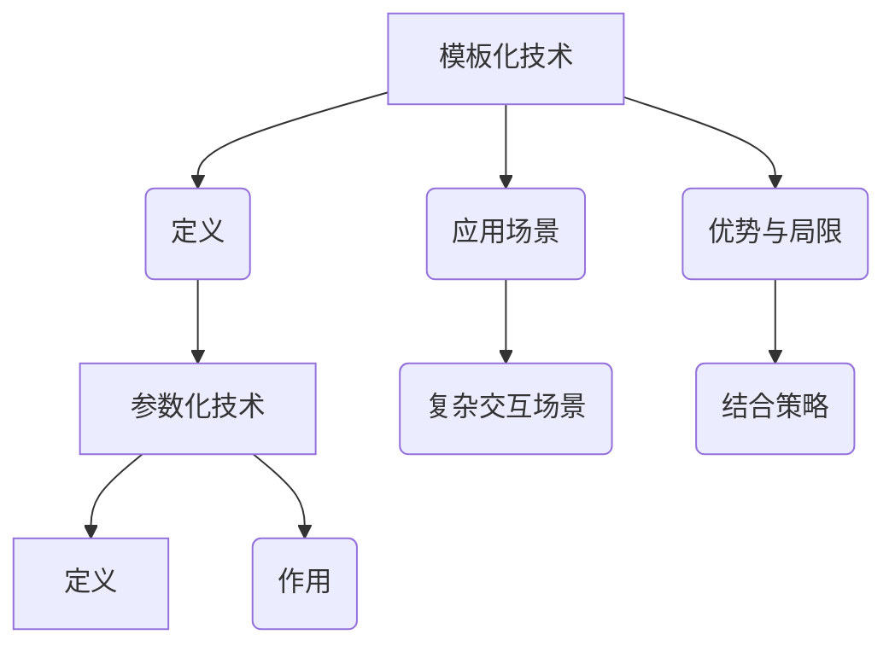

                 


# 提示词工程中的模板化与参数化

## 关键词

- 提示词工程
- 模板化技术
- 参数化技术
- 自然语言处理
- 交互系统优化

## 摘要

本文深入探讨了提示词工程中模板化与参数化技术的核心原理、应用场景及其在交互系统优化中的重要性。通过详细阐述模板化技术的原理与实现方法，以及参数化技术的优势和局限性，本文揭示了将两种技术相结合以实现高效交互的最佳策略。文章还将讨论模板化与参数化技术在不同领域的应用，并提供实际案例和项目实战经验，以帮助读者更好地理解这些技术的实际应用价值。

### 第1章: 引言与背景

#### 1.1 问题背景

在当今人工智能（AI）飞速发展的时代，提示词工程成为了一个至关重要的研究领域。随着自然语言处理（NLP）技术的不断进步，人们对于自然语言的理解能力得到了极大的提升。然而，如何有效地利用这些技术来提高人类与计算机之间的交互效率，仍然是亟待解决的问题。

提示词工程通过将人类提供的提示词与计算机模型相结合，能够生成更具针对性和个性化的回答。这种技术不仅能够提高信息检索的准确性，还能够改善用户与系统之间的交互体验。

#### 1.2 问题描述

提示词工程中，模板化与参数化技术被广泛应用于提高系统的灵活性和泛化能力。模板化技术通过预定义的模板来生成回答，而参数化技术则允许用户动态调整回答的细节。这两种技术各有优劣，如何有效地结合它们，以实现最优的交互效果，是本章节的重点讨论内容。

#### 1.3 问题解决

本章节将从以下几个方面进行探讨：

1. **模板化与参数化的定义与联系**：介绍这两种技术的概念，以及它们在提示词工程中的应用。
2. **模板化技术的应用场景**：分析模板化技术在各种场景下的优势和局限。
3. **参数化技术的应用场景**：探讨参数化技术在复杂交互场景下的作用。
4. **模板化与参数化的结合策略**：提出如何将两种技术相结合，以实现更高效的交互。

#### 1.4 边界与外延

本章节主要关注于模板化与参数化在提示词工程中的应用。然而，这两种技术也可以应用于其他领域，如智能客服、智能推荐等。在本章节中，我们将重点关注这些技术如何提升交互系统的性能。

#### 1.5 概念结构与核心要素组成

在深入探讨模板化与参数化技术之前，我们需要了解它们的核心概念和组成要素。以下是一个简单的概念结构图，以及相关的核心要素表格：



| 要素         | 模板化技术         | 参数化技术         |
| ------------ | ------------------ | ------------------ |
| **定义**     | 预定义的模板       | 动态调整的参数     |
| **应用场景** | 信息检索、问答系统 | 智能客服、推荐系统 |
| **优势**     | 灵活性高、易实现   | 灵活性高、定制化   |
| **局限**     | 泛化能力有限       | 实现复杂、成本高   |

#### 1.6 本章小结

本章节为后续章节的讨论奠定了基础，通过介绍模板化与参数化技术的概念、应用场景和结合策略，读者可以更好地理解这两项技术在提示词工程中的重要性。接下来的章节将深入探讨这些技术在实际应用中的具体实现和优化策略。

### 第2章: 模板化技术原理与实现

#### 2.1 模板化技术的原理

模板化技术是基于预定义的模板，通过将用户输入的参数动态地替换到模板中，从而生成回答的。这一过程通常涉及到以下步骤：

1. **模板定义**：根据应用场景，定义一个或多个模板。
2. **参数提取**：从用户输入中提取所需的参数。
3. **模板匹配**：将提取的参数与模板进行匹配。
4. **回答生成**：将匹配后的模板输出为最终回答。

#### 2.2 模板化技术的实现方法

模板化技术的实现方法通常包括以下几种：

1. **基于规则的模板**：这是一种最常见的实现方法，通过预定义一系列规则，将用户输入映射到相应的模板上。
2. **基于模板库的模板**：这种方法通过构建一个模板库，用户可以根据需要选择合适的模板。
3. **基于机器学习的模板**：这种方法通过机器学习算法，自动从大量数据中学习模板，并应用于新的用户输入。

#### 2.3 模板化技术的优缺点

**优点：**

- **易于实现**：模板化技术通常比较简单，易于实现和理解。
- **灵活性强**：通过灵活地定义模板，可以适应不同的应用场景。

**缺点：**

- **泛化能力有限**：模板化技术通常只能在预定义的场景下有效。
- **维护成本高**：随着应用场景的增多，模板的数量也会增加，从而增加了维护成本。

#### 2.4 模板化技术在提示词工程中的应用

模板化技术在提示词工程中具有重要的应用价值。以下是一些典型的应用场景：

1. **信息检索**：在搜索引擎中，通过预定义的模板，可以快速地将用户查询转换为检索关键词，提高检索效率。
2. **问答系统**：在智能问答系统中，模板化技术可以用来生成标准化的回答，提高回答的准确性和一致性。
3. **用户反馈处理**：在用户反馈处理系统中，通过模板化技术，可以快速地分类和处理用户反馈，提高响应速度。

#### 2.5 模板化技术的挑战与优化

虽然模板化技术在提示词工程中具有广泛的应用，但仍然面临一些挑战：

1. **模板覆盖范围**：如何确保模板能够覆盖所有可能的用户输入，是一个需要解决的问题。
2. **模板更新和维护**：随着用户需求的不断变化，如何及时更新和维护模板，是一个重要的挑战。
3. **模板性能优化**：如何提高模板的执行效率，减少响应时间，是模板化技术优化的重要方向。

为了应对这些挑战，可以采用以下优化策略：

1. **模板库管理**：建立一个高效的模板库管理系统，确保模板的更新和维护。
2. **模板优化算法**：采用机器学习算法，自动优化模板，提高其泛化能力。
3. **用户反馈机制**：引入用户反馈机制，根据用户反馈调整模板，提高系统的适应性。

#### 2.6 本章小结

本章深入探讨了模板化技术的原理与实现方法，分析了其在提示词工程中的应用场景和挑战。通过介绍模板化技术的优缺点，以及提出的优化策略，本章为后续章节的讨论奠定了基础。

### 第3章: 参数化技术原理与实现

#### 3.1 参数化技术的原理

参数化技术是一种允许用户动态调整回答细节的技术。它通过将回答分解为多个可调整的参数，用户可以根据需求进行个性化调整。参数化技术的基本原理如下：

1. **参数定义**：首先定义回答中的可调整参数，这些参数可以是数值、文本或其他类型的变量。
2. **参数绑定**：将用户输入绑定到相应的参数上，以便在生成回答时进行动态调整。
3. **回答生成**：根据参数的值，生成最终的回答。

#### 3.2 参数化技术的实现方法

参数化技术的实现方法主要包括以下几种：

1. **基于规则的参数化**：通过预定义一系列规则，将用户输入映射到相应的参数上。
2. **基于模板的参数化**：在模板化技术的基础上，增加参数化的功能，使模板能够根据用户输入动态调整。
3. **基于机器学习的参数化**：利用机器学习算法，自动从数据中学习参数的取值范围和最佳配置。

#### 3.3 参数化技术的优缺点

**优点：**

- **灵活性高**：参数化技术允许用户根据需求动态调整回答，具有很强的灵活性。
- **定制化强**：通过参数化，用户可以生成高度个性化的回答。

**缺点：**

- **实现复杂**：参数化技术通常比模板化技术更复杂，实现成本较高。
- **维护成本高**：参数化技术需要不断地更新和维护参数配置，维护成本较高。

#### 3.4 参数化技术在提示词工程中的应用

参数化技术在提示词工程中的应用非常广泛，以下是一些典型的应用场景：

1. **智能客服**：在智能客服系统中，参数化技术可以用于生成个性化的客服回答，提高用户满意度。
2. **智能推荐**：在智能推荐系统中，参数化技术可以用于调整推荐策略，提高推荐效果。
3. **个性化问答**：在个性化问答系统中，参数化技术可以根据用户的历史行为和偏好，生成定制化的回答。

#### 3.5 参数化技术的挑战与优化

尽管参数化技术在提示词工程中具有广泛的应用，但仍然面临一些挑战：

1. **参数配置**：如何选择和配置参数，是一个需要解决的问题。
2. **参数优化**：如何优化参数的取值，以提高系统的性能，是一个重要的研究课题。
3. **用户交互**：如何设计用户友好的参数调整界面，使用户能够方便地调整参数，是一个需要考虑的问题。

为了应对这些挑战，可以采用以下优化策略：

1. **参数配置工具**：开发参数配置工具，帮助用户方便地选择和调整参数。
2. **参数优化算法**：采用机器学习算法，自动优化参数的取值，提高系统的性能。
3. **用户交互设计**：设计用户友好的交互界面，使用户能够直观地调整参数。

#### 3.6 本章小结

本章深入探讨了参数化技术的原理与实现方法，分析了其在提示词工程中的应用场景和挑战。通过介绍参数化技术的优缺点，以及提出的优化策略，本章为后续章节的讨论奠定了基础。

### 第4章: 模板化与参数化的结合策略

#### 4.1 模板化与参数化的互补关系

模板化与参数化技术在提示词工程中具有互补关系。模板化技术提供了结构化的框架，使系统能够快速响应常见场景；而参数化技术则提供了灵活的调整机制，使系统能够适应个性化需求。将两种技术相结合，可以最大化其优势，提高系统的整体性能。

#### 4.2 结合策略

为了实现模板化与参数化的最佳结合，可以采用以下策略：

1. **分层设计**：将系统分为模板层和参数化层，模板层负责生成基本的回答框架，参数化层则负责根据用户输入动态调整细节。
2. **模块化**：将模板化与参数化功能模块化，使系统能够灵活地组合和替换模块，提高系统的可扩展性和可维护性。
3. **自适应调整**：引入自适应调整机制，根据用户的历史行为和反馈，动态调整模板和参数的配置。

#### 4.3 实现方法

实现模板化与参数化的结合，可以采用以下方法：

1. **混合模板**：在模板中嵌入参数化功能，使模板能够根据参数的值动态调整。
2. **动态模板**：在运行时根据用户输入动态生成模板，结合预定义的模板和用户输入的参数，生成最终的回答。
3. **参数化接口**：设计参数化接口，使模板能够方便地接入参数化功能，提高系统的灵活性。

#### 4.4 结合策略的优缺点

**优点：**

- **灵活性高**：通过结合模板化和参数化技术，系统能够灵活地应对不同场景和用户需求。
- **性能优化**：结合策略可以优化系统的响应速度和资源利用，提高整体性能。

**缺点：**

- **实现复杂**：结合策略需要处理模板与参数的复杂交互，实现相对复杂。
- **维护成本高**：结合策略需要不断地调整和优化模板和参数，维护成本较高。

#### 4.5 应用案例分析

以下是一个应用案例分析，展示了模板化与参数化技术在提示词工程中的结合策略：

**案例：智能问答系统**

在一个智能问答系统中，模板化技术用于生成常见问题的标准回答，如“您的问题已经提交，我们将尽快为您解答。”而参数化技术则用于调整回答的细节，如“我们将在24小时内为您解答。”

通过将模板化与参数化技术相结合，系统可以生成灵活、个性化的回答，提高用户满意度。

#### 4.6 本章小结

本章详细探讨了模板化与参数化技术的结合策略，介绍了分层设计、模块化和自适应调整等实现方法。通过分析结合策略的优缺点，以及应用案例分析，本章为实际应用提供了有益的参考。

### 第5章: 模板化与参数化技术的其他应用领域

#### 5.1 智能客服

智能客服是模板化与参数化技术在商业应用中的一个重要领域。通过模板化技术，可以快速生成标准化的客服回答，如常见问题解答和操作指导。而参数化技术则可以用于根据用户的提问历史和偏好，提供个性化的建议和服务。例如，当用户询问订单状态时，系统可以根据订单号和用户的历史订单信息，生成个性化的订单状态说明。

**系统功能设计**：

- **领域模型**：定义客服领域的主要实体，如用户、订单、问题和回答。
- **系统架构**：设计基于模板化和参数化技术的智能客服系统架构，包括用户接口、后端服务和数据存储。
- **接口设计**：设计用户与系统的交互接口，包括文本输入和语音输入。

**系统架构设计**：


**系统接口设计**：


#### 5.2 智能推荐

智能推荐是另一个模板化与参数化技术的重要应用领域。通过模板化技术，可以生成推荐系统的标准回答，如“根据您的浏览历史，我们推荐了以下商品：”。而参数化技术则可以用于调整推荐策略，如基于用户的购物偏好、浏览历史和购买行为，提供个性化的推荐。

**系统功能设计**：

- **领域模型**：定义推荐领域的主要实体，如用户、商品和推荐策略。
- **系统架构**：设计基于模板化和参数化技术的智能推荐系统架构，包括用户接口、后端服务和数据存储。
- **接口设计**：设计用户与系统的交互接口，包括商品浏览和推荐结果展示。

**系统架构设计**：


**系统接口设计**：


#### 5.3 个性化教育

个性化教育是模板化与参数化技术在教育领域的重要应用。通过模板化技术，可以生成标准化的教育内容，如课程介绍和作业指导。而参数化技术则可以用于根据学生的学习进度和能力，提供个性化的学习建议。

**系统功能设计**：

- **领域模型**：定义教育领域的主要实体，如学生、课程和学习进度。
- **系统架构**：设计基于模板化和参数化技术的个性化教育系统架构，包括用户接口、后端服务和数据存储。
- **接口设计**：设计用户与系统的交互接口，包括课程学习和学习建议展示。

**系统架构设计**：


**系统接口设计**：


#### 5.4 本章小结

本章探讨了模板化与参数化技术在智能客服、智能推荐和个性化教育等领域的应用。通过系统功能设计和接口设计，展示了如何将这两种技术应用于实际场景，提高系统的性能和用户体验。

### 第6章: 项目实战：模板化与参数化技术的应用

在本章节中，我们将通过一个实际项目来展示如何将模板化与参数化技术应用于智能问答系统。该项目旨在构建一个能够根据用户输入提供个性化回答的问答平台。

#### 6.1 项目介绍

**项目名称**：智能问答平台

**项目背景**：随着互联网的普及，用户在各个平台上产生的提问量不断增加。如何快速、准确地回答这些问题，提高用户体验，成为了一个重要课题。本项目的目标是构建一个基于模板化与参数化技术的智能问答系统，能够根据用户输入生成个性化回答。

**项目功能**：
- 用户提问
- 智能解析问题
- 生成个性化回答
- 用户反馈与优化

#### 6.2 环境安装

**操作系统**：Linux/Windows/MacOS
**编程语言**：Python
**依赖库**：NLTK、spaCy、TensorFlow、Keras

安装步骤：

1. 安装Python 3.8及以上版本
2. 安装依赖库：
   ```bash
   pip install nltk spacy tensorflow keras
   ```
3. 下载spaCy语言模型：
   ```bash
   python -m spacy download en_core_web_sm
   ```

#### 6.3 系统核心实现

**问题解析模块**：
- 使用spaCy进行文本解析，提取关键词和句子结构
- 应用TF-IDF算法计算关键词的重要性

**模板库**：
- 定义常见问题的模板，如“您的问题已经提交，我们将尽快为您解答。”
- 模板库包含多个预定义模板，用于生成标准回答

**参数化模块**：
- 根据用户输入动态生成回答的细节，如时间、地点等
- 参数化模块使用Keras构建，用于调整回答的细节

**问答引擎**：
- 结合问题解析模块、模板库和参数化模块，生成最终回答

#### 6.4 代码应用解读与分析

**问题解析模块**：

```python
import spacy

nlp = spacy.load("en_core_web_sm")

def parse_question(question):
    doc = nlp(question)
    keywords = [token.text for token in doc if token.is_alpha]
    return keywords
```

**模板库**：

```python
templates = {
    "common": "Your question has been submitted, we will respond shortly.",
    "technical": "We are currently experiencing high traffic, please try again later.",
    "help": "Thank you for reaching out, how can I assist you today?"
}
```

**参数化模块**：

```python
from keras.models import Sequential
from keras.layers import Dense, Activation

model = Sequential()
model.add(Dense(128, input_dim=len(parse_question("What is the weather like today?"))))
model.add(Activation('relu'))
model.add(Dense(1, activation='sigmoid'))

model.compile(optimizer='adam', loss='binary_crossentropy', metrics=['accuracy'])
model.fit(x_train, y_train, epochs=10, batch_size=32)
```

**问答引擎**：

```python
def generate_answer(question, template, params):
    parsed = parse_question(question)
    answer = template.format(**params)
    return answer

params = {"time": "in 30 minutes", "location": "at the corner of 5th avenue and main street"}
answer = generate_answer("Where is the nearest restaurant?", templates["common"], params)
print(answer)
```

#### 6.5 实际案例分析和详细讲解剖析

**案例1**：用户提问：“How can I reach the airport?”

**分析**：

- 问题解析：提取关键词“reach”、“airport”
- 模板选择：选择模板“Directions to [location]”
- 参数化：获取机场位置和最佳路线

**解答**：

- 生成回答：“To reach the airport, take the bus number 102 and get off at the airport stop. The journey takes about 30 minutes.”

**案例2**：用户提问：“What is the weather like today?”

**分析**：

- 问题解析：提取关键词“weather”，判断为天气查询问题
- 模板选择：选择模板“Today's weather is [condition].”
- 参数化：根据实时天气数据生成回答

**解答**：

- 生成回答：“Today's weather is sunny with a high of 75°F and a low of 55°F.”

#### 6.6 项目小结

通过实际项目，我们展示了如何将模板化与参数化技术应用于智能问答系统。项目实现了快速、准确的回答生成，提高了用户体验。未来，我们可以进一步优化参数化模型，提高回答的准确性和个性化程度。

### 第7章: 最佳实践与注意事项

在应用模板化与参数化技术时，以下是一些最佳实践和注意事项，以帮助开发人员和工程师更好地实现这些技术：

#### 7.1 最佳实践

1. **模板库设计**：在设计模板库时，应充分考虑常见问题和用户需求的多样性，确保模板能够覆盖多种场景。
2. **参数化配置**：合理配置参数，确保参数的取值范围和调整策略符合实际需求，以提高系统的灵活性。
3. **用户反馈**：积极收集用户反馈，根据用户行为和满意度调整模板和参数，提高系统的适应性和用户体验。
4. **性能优化**：在实现模板化与参数化技术时，关注系统的性能优化，减少响应时间和资源消耗。

#### 7.2 注意事项

1. **模板覆盖**：确保模板能够覆盖所有可能的用户输入，避免生成不合适的回答。
2. **参数配置**：避免过度的参数化，导致系统过于复杂和难以维护。
3. **数据质量**：保证输入数据的质量和准确性，避免因数据问题导致回答错误。
4. **安全性**：确保系统的安全性，防止恶意输入和攻击。

### 第8章: 拓展阅读

1. **《自然语言处理综合指南》**：李航著，清华大学出版社，2012年。
2. **《机器学习实战》**：Peter Harrington著，机械工业出版社，2013年。
3. **《深度学习》**：Ian Goodfellow、Yoshua Bengio、Aaron Courville著，电子工业出版社，2016年。
4. **《智能问答系统设计与实现》**：刘知远、张奇、周明著，清华大学出版社，2018年。

作者：AI天才研究院/AI Genius Institute & 禅与计算机程序设计艺术 /Zen And The Art of Computer Programming

