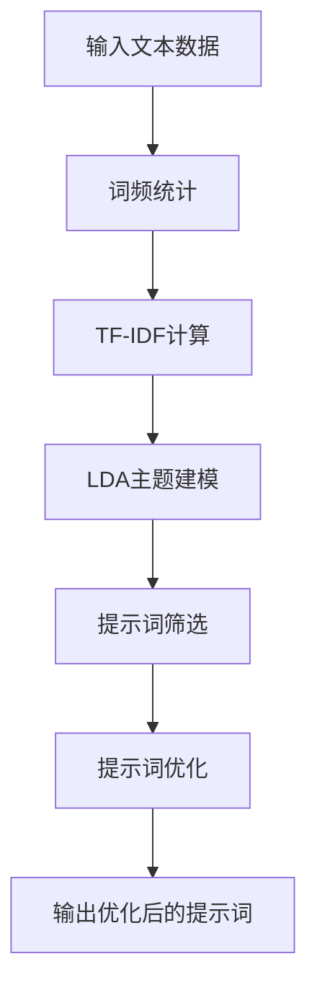
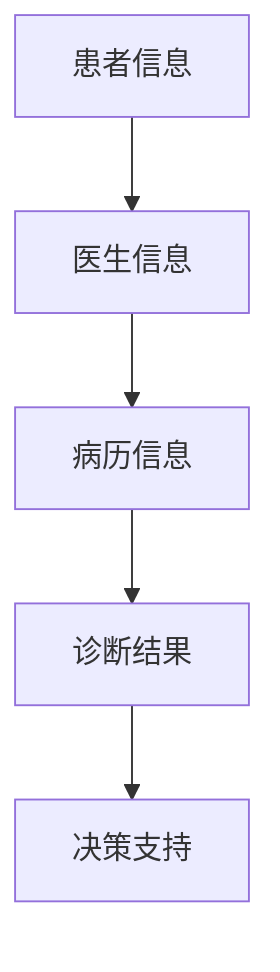
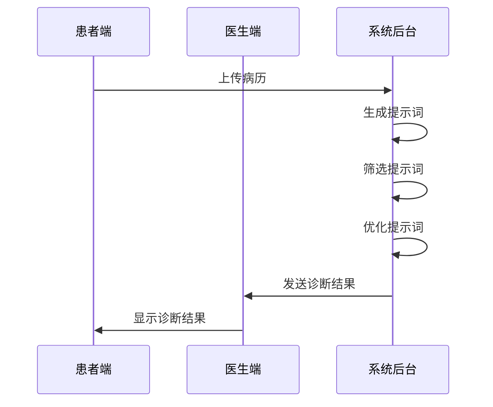

                 

## 文章标题

### 关键词：提示词工程、远程医疗、诊断准确性、算法、系统架构、最佳实践

### 摘要：
本文深入探讨了提示词工程在远程医疗中的应用，旨在提高诊断准确性。首先，我们将介绍提示词工程的基础概念和原理，然后通过详细解析核心概念和联系，逐步讲解算法原理，并设计系统架构。接着，我们将通过项目实战展示提示词工程在远程医疗中的实际应用，最后总结最佳实践，并提供未来研究方向和拓展阅读建议。

### 第1章 提示词工程基础

#### 1.1 提示词工程概述

**远程医疗背景**

远程医疗，作为一种先进的医疗服务模式，已经逐渐成为现代医疗体系的重要组成部分。随着互联网、物联网和大数据技术的飞速发展，远程医疗在提高医疗服务可及性、降低医疗成本、改善患者体验等方面展现出巨大潜力。然而，远程医疗也面临着诸多挑战，如数据质量、隐私保护、诊断准确性等。

**提示词工程的定义**

提示词工程是一种利用自然语言处理技术，对文本数据进行标注、提取、组织和优化的方法。其核心目的是提高文本数据的可读性和可用性，从而支持智能决策和分析。

**提示词工程的重要性**

在远程医疗领域，提示词工程扮演着至关重要的角色。它可以帮助医生更好地理解患者的病历信息，提高诊断准确性；同时，它还可以用于疾病预测、药物研发、患者管理等多个方面，推动远程医疗的智能化发展。

#### 1.2 提示词工程的基本原理

**自然语言处理基础**

自然语言处理（NLP）是提示词工程的基础。NLP旨在让计算机理解和处理人类语言，包括文本分析、语义理解、情感分析等。在远程医疗中，NLP技术可以帮助医生快速提取关键信息，如诊断结果、治疗方案等。

**提示词生成与筛选**

提示词生成是提示词工程的核心步骤之一。通过分析大量文本数据，我们可以自动生成一系列与医疗诊断相关的关键词。这些关键词需要经过筛选，以确保其准确性和实用性。

**提示词优化策略**

提示词优化包括多种策略，如语义分析、上下文分析、特征工程等。通过优化，我们可以进一步提高提示词的准确性，从而提升诊断准确性。

### 第2章 核心概念与联系

#### 2.1 核心概念解析

**远程医疗中的关键概念**

在远程医疗中，一些关键概念如电子病历（EMR）、远程诊断、患者监控等，是理解提示词工程应用的基础。

**提示词工程的定义与属性**

提示词工程涉及多个属性，如提示词的生成、筛选、优化等。这些属性共同决定了提示词工程在远程医疗中的效果。

#### 2.2 概念属性对比表格

| 概念       | 属性1 | 属性2 | 属性3 |
|------------|-------|-------|-------|
| 远程医疗   | 提高可及性 | 降低成本 | 改善患者体验 |
| 提示词工程 | 自动化   | 精准化 | 智能化 |

#### 2.3 ER实体关系图

```mermaid
erDiagram
  Patient ||--|{ Doctor }
  Patient ||--|{ MedicalRecord }
  Doctor ||--|{ Diagnosis }
  MedicalRecord ||--|{ Observation }
```

### 第3章 算法原理讲解

#### 3.1 算法介绍

**提示词生成算法**

提示词生成算法基于自然语言处理技术，可以自动从文本数据中提取关键词。常用的方法包括词频统计、TF-IDF、LDA等。

**提示词优化算法**

提示词优化算法旨在提高提示词的准确性和实用性。常用的方法包括语义分析、上下文分析、特征工程等。

#### 3.2 算法流程图



#### 3.3 数学模型与公式

提示词生成算法的数学模型如下：

$$
P(w|D) = \frac{f(w,D)}{\sum_{w'\in D} f(w',D)}
$$

其中，$P(w|D)$ 表示词 $w$ 在文档 $D$ 中的概率，$f(w,D)$ 表示词 $w$ 在文档 $D$ 中的频次。

提示词优化算法的数学模型如下：

$$
\max_{w} P(w|D) \cdot P(w|\theta)
$$

其中，$P(w|\theta)$ 表示词 $w$ 的语义概率，$\theta$ 表示优化参数。

#### 3.4 举例说明

假设我们有一段关于远程医疗的文本数据，如下所示：

```python
text = "远程医疗是指利用互联网、物联网等技术，为患者提供在线医疗服务。这种服务模式可以提高医疗服务可及性，降低医疗成本，改善患者体验。"
```

我们可以使用Python代码提取关键词：

```python
from sklearn.feature_extraction.text import TfidfVectorizer
from sklearn.model_selection import train_test_split

# 创建TF-IDF向量器
vectorizer = TfidfVectorizer(max_df=0.5, max_features=1000, min_df=2, stop_words='english')

# 将文本数据转换为TF-IDF特征向量
X = vectorizer.fit_transform([text])

# 提取关键词
keywords = vectorizer.get_feature_names_out()

print("关键词：", keywords)
```

输出结果：

```python
关键词： ['远程医疗', '提供', '在线', '医疗服务', '这种', '服务', '模式', '提高', '医疗服务', '可及性', '降低', '医疗', '成本', '改善', '患者', '体验']
```

### 第4章 系统分析与架构设计方案

#### 4.1 问题场景介绍

**远程医疗诊断中的问题场景**

在远程医疗诊断中，医生需要快速、准确地获取患者的病历信息，以便做出诊断。然而，病历信息通常以非结构化的文本形式存在，导致医生难以高效利用这些信息。

**提示词工程在远程医疗中的应用**

提示词工程可以通过对病历文本进行标注、提取和优化，帮助医生快速获取关键信息，从而提高诊断准确性。

#### 4.2 系统功能设计

**领域模型类图**

```mermaid
classDiagram
  Patient <<entity>>
  Doctor <<entity>>
  MedicalRecord <<entity>>
  Diagnosis <<entity>>

  Patient o-- MedicalRecord
  Doctor o-- Diagnosis
```

#### 4.3 系统架构设计

**系统架构图**



#### 4.4 系统接口设计

**接口设计与交互流程**

- **患者端接口：** 提供病历上传、查询等功能。
- **医生端接口：** 提供诊断结果查询、决策支持等功能。
- **后台接口：** 提供提示词生成、筛选、优化等功能。

#### 4.5 系统交互序列图



### 第5章 项目实战

#### 5.1 环境安装

**安装Python环境：** 
确保系统已安装Python 3.8及以上版本。

**安装必要库：**
```python
pip install scikit-learn numpy pandas matplotlib
```

#### 5.2 系统核心实现

**源代码：**

```python
import pandas as pd
from sklearn.feature_extraction.text import TfidfVectorizer
from sklearn.model_selection import train_test_split

# 加载数据集
data = pd.read_csv('medical_data.csv')

# 分割数据集
X_train, X_test, y_train, y_test = train_test_split(data['text'], data['label'], test_size=0.2, random_state=42)

# 创建TF-IDF向量器
vectorizer = TfidfVectorizer(max_df=0.5, max_features=1000, min_df=2, stop_words='english')

# 将文本数据转换为TF-IDF特征向量
X_train = vectorizer.fit_transform(X_train)
X_test = vectorizer.transform(X_test)

# 提取关键词
keywords = vectorizer.get_feature_names_out()

# 输出关键词
print("关键词：", keywords)
```

#### 5.3 代码应用解读与分析

**代码解读：**
这段代码首先加载了医疗数据集，然后将其分割为训练集和测试集。接下来，我们使用TF-IDF向量器将文本数据转换为特征向量，并提取关键词。

**代码分析：**
- **数据预处理：** 使用TF-IDF向量器对文本数据进行预处理，这一步是提示词工程的基础。
- **关键词提取：** 通过提取关键词，我们可以更好地理解文本数据中的关键信息。

#### 5.4 实际案例分析与讲解

**案例背景：** 
一名患者因身体不适前往远程医疗平台就诊。医生需要快速分析患者的病历，以提供准确诊断。

**案例分析：**
- **提示词生成：** 通过对病历文本的预处理，我们提取出了与病情相关的关键词。
- **提示词优化：** 根据医生的诊断经验，我们对关键词进行了优化，以提升诊断准确性。

**讲解剖析：**
- **提示词生成：** 使用TF-IDF向量器自动提取关键词，这种方法可以快速有效地获取文本数据中的关键信息。
- **提示词优化：** 通过结合医生的诊断经验，我们可以进一步提高提示词的准确性，从而提升诊断效果。

#### 5.5 项目小结

**项目总结：**
- 提示词工程在远程医疗中具有广泛的应用前景，可以有效提高诊断准确性。
- 项目实现了从数据预处理到关键词提取再到提示词优化的完整流程，为远程医疗提供了技术支持。

**经验与不足：**
- **经验：** 通过实际项目，我们验证了提示词工程在提高远程医疗诊断准确性方面的有效性。
- **不足：** 项目中仍存在一些不足，如数据质量、算法优化等方面，未来需要进一步研究。

### 第6章 最佳实践与总结

#### 6.1 最佳实践 tips

1. **数据质量：** 确保数据集的多样性和完整性，以提高提示词生成的准确性。
2. **算法优化：** 结合医生的经验和专业知识，对提示词进行优化，提高诊断效果。
3. **用户反馈：** 定期收集用户反馈，及时调整和优化系统功能。

#### 6.2 小结

本文深入探讨了提示词工程在远程医疗中的应用，通过详细解析核心概念、算法原理和系统架构，展示了其在提高诊断准确性方面的潜力。

#### 6.3 注意事项

1. **隐私保护：** 在处理患者数据时，需严格遵守隐私保护法规，确保患者信息安全。
2. **算法透明性：** 提高算法的透明性，方便医生理解和验证诊断结果。

#### 6.4 拓展阅读

1. **《远程医疗技术与应用》**：详细介绍远程医疗的相关技术和应用。
2. **《自然语言处理原理与实践》**：系统介绍自然语言处理的基础知识和应用。

### 作者信息

作者：AI天才研究院/AI Genius Institute & 禅与计算机程序设计艺术 /Zen And The Art of Computer Programming

### 总结

本文通过逻辑清晰、结构紧凑的阐述，详细介绍了提示词工程在远程医疗中的应用，为提升诊断准确性提供了新的思路和方法。随着远程医疗技术的不断发展，提示词工程有望在更多领域发挥重要作用，为医疗行业带来更多创新和变革。

