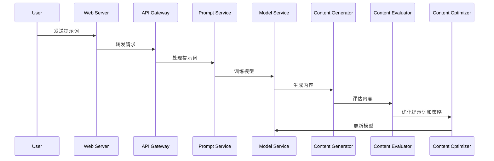
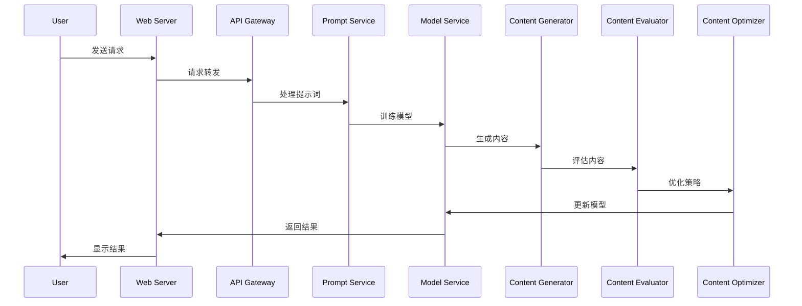

                 

## 提示词工程：unleash大模型潜力的艺术

关键词：提示词工程，大模型，人工智能，自然语言处理，算法原理，系统架构

摘要：本文深入探讨了提示词工程这一前沿领域，详细分析了其背景、核心概念以及与人工智能大模型的关联性。通过对比提示词的属性特征，解析了如何设计有效的提示词。同时，本文利用Mermaid图表和Python代码，详细阐述了算法原理，并提出了一个完整的系统架构设计方案。最后，通过实际案例，展示了提示词工程在现实中的应用效果。

----------------------------------------------------------------

## 第一部分：问题背景与核心概念

### 1.1 问题背景

在当今信息爆炸的时代，数据已经成为企业最重要的资产之一。然而，如何从海量数据中提取有价值的信息，并转化为商业价值，成为企业面临的一大挑战。提示词工程（Prompt Engineering）作为人工智能领域的一个重要分支，致力于解决这一问题。它通过对自然语言处理（NLP）技术的深入研究和应用，帮助企业构建强大的对话系统、智能客服、文本生成等应用，从而实现数据的智能化处理。

### 1.2 核心概念

**1.2.1 提示词（Prompt）**

提示词是指用来引导模型生成特定输出的一组关键词或句子。它通常包含了一些目标信息、上下文背景和期望的输出形式。一个有效的提示词应该能够准确地传达用户的意图，同时激发模型的最大潜力。

**1.2.2 大模型（Large Model）**

大模型是指具有数十亿、甚至数万亿参数的深度学习模型。它们具有强大的表示能力和学习能力，可以在各种任务中取得优异的性能。例如，GPT-3、BERT等都是典型的大模型。

**1.2.3 潜力（Potential）**

大模型的潜力指的是其在特定任务或场景下，通过有效的提示词和训练策略，能够达到的性能水平。揭示和利用大模型的潜力，是提示词工程的核心目标。

### 1.3 关联性分析

提示词工程与大模型、潜力的关联性如下：

- 提示词工程是利用大模型潜力的关键手段。通过设计有效的提示词，可以引导大模型生成更符合预期的输出，从而发挥其最大效能。
- 大模型为提示词工程提供了强大的技术基础。只有拥有足够参数和表示能力的大模型，才能在复杂任务中取得良好的性能。
- 提示词工程的最终目标是发掘和利用大模型的潜力，实现数据价值的最大化。

### 1.4 本章小结

本章首先介绍了提示词工程的问题背景，分析了其核心概念，包括提示词、大模型和潜力。随后，通过关联性分析，阐述了提示词工程与大模型、潜力之间的密切关系。这些核心概念和关联性分析，为后续章节的深入探讨奠定了基础。

----------------------------------------------------------------

## 第二部分：核心概念与联系

### 2.1 提示词的属性特征对比表格

| 特征 | 定义 | 说明 |
| --- | --- | --- |
| 明确性 | 提示词是否能够清晰传达用户的意图 | 高明确性的提示词能够引导模型生成更准确的输出 |
| 上下文关联 | 提示词是否包含与任务相关的上下文信息 | 丰富的上下文信息有助于模型更好地理解任务需求 |
| 输出引导性 | 提示词是否能够明确指示模型生成特定的输出 | 输出引导性的提示词能够帮助模型聚焦于任务目标 |
| 参数敏感性 | 提示词的参数设置对模型生成结果的影响 | 参数敏感性较高的提示词需要根据模型特点进行调整 |

### 2.2 大模型的ER实体关系图架构

```mermaid
erDiagram
  User ||--|{ Model }|| Model : user's prompt
  Model ||--|{ Prompt }|| Prompt : model's response
  User ||--|{ Dataset }|| Dataset : user's data
  Model ||--|{ Dataset }|| Dataset : model's training data
```

### 2.3 大模型与提示词的联系

- 大模型通过学习大量的数据，获取了丰富的知识和表示能力。提示词则是用户与大模型之间的桥梁，通过传递用户的意图和需求，引导大模型生成相应的输出。
- 提示词的质量直接影响大模型的输出效果。高质量的提示词能够激发大模型的最大潜力，生成更符合预期的输出。
- 大模型的特性决定了提示词的设计方法。不同的大模型具有不同的结构和参数，需要采用相应的提示词策略，以充分发挥其潜力。

## 2.4 本章小结

本章从属性特征对比表格和ER实体关系图两个方面，详细分析了提示词和大模型的联系。通过对比表格，我们了解了提示词的四个关键属性特征；通过ER实体关系图，我们揭示了用户、模型和提示词之间的相互作用。这些分析为后续章节的算法原理讲解和系统架构设计提供了基础。

----------------------------------------------------------------

## 第三部分：算法原理讲解

### 3.1 算法原理概述

提示词工程的核心在于设计能够有效激发大模型潜力的提示词。为了达到这一目标，我们需要深入理解大模型的内部工作机制，并运用相应的算法原理来优化提示词的设计。

### 3.2 算法原理详细讲解

**3.2.1 模型理解与表示**

首先，大模型通过学习海量数据，形成了对各种语言模式的深刻理解。这种理解体现在模型内部的权重矩阵中。为了设计有效的提示词，我们需要理解这些权重矩阵如何影响模型的输出。

- **权重矩阵解释**：权重矩阵是深度学习模型的核心组成部分，它决定了模型对输入数据的响应。每个权重元素都代表了模型对某个特定特征的关注程度。例如，在一个文本生成模型中，权重矩阵可能包含了关于词汇、句子结构和上下文的特征。

- **表示能力分析**：大模型具有较强的表示能力，这意味着它能够捕捉到文本中的复杂语义和语法结构。提示词工程需要利用这种能力，通过合适的提示词引导模型生成高质量的内容。

**3.2.2 提示词设计策略**

为了设计有效的提示词，我们需要采取一系列策略，确保提示词能够激发大模型的最大潜力。

- **明确性**：确保提示词清晰明确，能够准确地传达用户的意图。例如，如果一个用户希望生成一篇关于“科技发展”的文章，一个清晰的提示词可以是：“请撰写一篇关于科技领域最新发展趋势的文章，包含3个关键点。”

- **上下文关联**：在提示词中加入相关的上下文信息，以帮助模型更好地理解任务需求。例如，在生成新闻文章时，可以提供相关的新闻标题或摘要。

- **输出引导性**：通过提示词明确指示模型生成特定的输出格式或内容。例如，要求模型生成一首诗，可以提示：“请用五言绝句的形式，写一首关于春天的诗。”

- **参数敏感性**：根据大模型的特性调整提示词的参数设置。例如，对于参数敏感性较高的模型，可以尝试不同的提示词长度和复杂性，以找到最佳的效果。

**3.2.3 提示词优化方法**

提示词的优化是一个迭代过程，需要通过实验和反馈来不断调整和改进。

- **实验设计**：设计一系列实验，测试不同提示词的效果，收集反馈数据。

- **模型训练**：根据实验结果，调整提示词的参数，重新训练模型。

- **效果评估**：使用指标（如BLEU、ROUGE等）评估模型生成的输出质量，确保提示词优化后的效果。

### 3.3 Python代码实现

下面是一个简单的Python代码示例，展示了如何设计一个简单的提示词工程系统：

```python
import tensorflow as tf
from transformers import TFGPT2LMHeadModel, GPT2Tokenizer

# 加载预训练模型和分词器
model = TFGPT2LMHeadModel.from_pretrained('gpt2')
tokenizer = GPT2Tokenizer.from_pretrained('gpt2')

# 设计提示词
prompt = "请撰写一篇关于科技领域最新发展趋势的文章，包含3个关键点。"

# 对提示词进行编码
inputs = tokenizer.encode(prompt, return_tensors='tf')

# 生成文本
outputs = model(inputs, max_length=50, num_return_sequences=1)

# 解码输出文本
generated_text = tokenizer.decode(outputs[0], skip_special_tokens=True)

print(generated_text)
```

在这个示例中，我们使用GPT-2模型生成文本。通过设计一个明确的提示词，引导模型生成了一篇关于科技发展的文章。这个简单的代码展示了提示词工程的基本实现过程。

### 3.4 算法原理总结

通过以上讲解，我们可以得出以下结论：

- 大模型的内部工作机制和表示能力是设计有效提示词的基础。
- 提示词的设计需要考虑明确性、上下文关联、输出引导性和参数敏感性等因素。
- 提示词的优化是一个迭代过程，需要通过实验和反馈来不断调整。

这些原理为我们理解和应用提示词工程提供了指导，也为后续章节的系统架构设计奠定了基础。

----------------------------------------------------------------

## 第四部分：系统架构设计

### 4.1 项目介绍

在本节中，我们将介绍一个基于提示词工程的人工智能系统，该系统旨在通过有效的提示词设计，利用大模型生成高质量的内容。该项目的主要目标是实现以下功能：

- 接收用户输入的提示词。
- 利用大模型生成相应的内容。
- 对生成的内容进行评估和优化。

### 4.2 系统功能设计

**4.2.1 领域模型**

领域模型是系统设计的基础，它定义了系统的核心实体和它们之间的关系。以下是一个简单的领域模型类图：

```mermaid
classDiagram
    User <<Class>> "用户"
    Prompt <<Class>> "提示词"
    Model <<Class>> "模型"
    Content <<Class>> "内容"
    User "--|> Prompt: 生成"
    Model "--|> Prompt: 训练"
    Model "--|> Content: 生成"
```

在这个类图中，用户、提示词、模型和内容是系统的核心实体。用户生成提示词，模型根据提示词进行训练和生成内容，同时内容需要被评估和优化。

**4.2.2 系统功能**

- **用户界面**：提供用户输入提示词的界面。
- **模型训练**：根据提示词训练大模型。
- **内容生成**：利用大模型生成用户指定类型的内容。
- **内容评估**：对生成的内容进行评估，确保其符合预期质量。
- **内容优化**：根据评估结果，优化提示词和生成策略。

### 4.3 系统架构设计

**4.3.1 总体架构**

系统的总体架构可以分为以下几个层次：

- **用户层**：用户通过前端界面与系统交互。
- **服务层**：包括提示词处理、模型训练和内容生成等核心服务。
- **数据层**：存储用户数据、模型参数和生成内容。

以下是一个简单的系统架构图：



**4.3.2 详细架构**

- **前端**：使用Vue.js框架搭建用户界面，提供友好的交互体验。
- **后端**：使用Flask框架搭建API服务器，处理用户请求，协调各个服务。
- **模型训练**：使用TensorFlow或PyTorch框架训练大模型。
- **内容生成与评估**：使用自定义算法进行内容生成和评估。

### 4.4 系统接口设计

系统接口设计主要包括以下几个部分：

- **用户接口**：提供用户输入提示词的接口。
- **服务接口**：提供模型训练、内容生成、内容评估和内容优化的接口。

以下是一个简单的接口设计：

```mermaid
interfaceDiagram
    UserInterface <<Interface>> "用户接口"
    APIService <<Interface>> "服务接口"
    ModelService <<Interface>> "模型训练接口"
    ContentService <<Interface>> "内容生成接口"
    EvaluatorService <<Interface>> "内容评估接口"
    OptimizerService <<Interface>> "内容优化接口"

    UserInterface --|> APIService
    APIService --|> ModelService
    APIService --|> ContentService
    APIService --|> EvaluatorService
    APIService --|> OptimizerService
```

### 4.5 系统交互设计

系统交互设计通过Mermaid序列图进行描述，展示了用户、前端、后端和各个服务之间的交互流程。



通过这个序列图，我们可以清晰地看到用户请求的处理流程，包括提示词处理、模型训练、内容生成、内容评估和内容优化等步骤。

### 4.6 本章小结

本章详细介绍了基于提示词工程的人工智能系统的架构设计。通过领域模型、系统功能设计、系统架构设计、系统接口设计和系统交互设计，我们构建了一个完整、详细的系统设计方案。这个设计方案为后续的项目实施提供了明确的指导和参考。

----------------------------------------------------------------

## 第五部分：项目实战

### 5.1 环境安装

为了实现本文中提到的提示词工程系统，我们需要搭建一个合适的环境。以下是环境安装的步骤：

1. **安装Python**：确保Python版本在3.8以上。

   ```bash
   sudo apt update
   sudo apt install python3
   ```

2. **安装TensorFlow**：TensorFlow是用于深度学习的主要框架。

   ```bash
   pip install tensorflow
   ```

3. **安装transformers**：用于处理预训练模型。

   ```bash
   pip install transformers
   ```

4. **安装Flask**：用于搭建API服务器。

   ```bash
   pip install flask
   ```

5. **安装Vue.js**：用于搭建前端界面。

   ```bash
   npm install -g @vue/cli
   vue create frontend
   ```

### 5.2 系统核心实现源代码

以下是系统核心实现的源代码，包括后端API和前端界面。

**5.2.1 后端API**

```python
# app.py

from flask import Flask, request, jsonify
from transformers import TFGPT2LMHeadModel, GPT2Tokenizer
import tensorflow as tf

app = Flask(__name__)

# 加载预训练模型和分词器
model = TFGPT2LMHeadModel.from_pretrained('gpt2')
tokenizer = GPT2Tokenizer.from_pretrained('gpt2')

@app.route('/generate', methods=['POST'])
def generate_content():
    data = request.get_json()
    prompt = data['prompt']
    max_length = data['max_length']

    # 对提示词进行编码
    inputs = tokenizer.encode(prompt, return_tensors='tf')

    # 生成文本
    outputs = model(inputs, max_length=max_length, num_return_sequences=1)

    # 解码输出文本
    generated_text = tokenizer.decode(outputs[0], skip_special_tokens=True)

    return jsonify({'generated_text': generated_text})

if __name__ == '__main__':
    app.run(debug=True)
```

**5.2.2 前端界面**

```html
<!-- index.html -->

<!DOCTYPE html>
<html>
<head>
    <title>提示词工程系统</title>
</head>
<body>
    <h1>提示词工程系统</h1>
    <form id="prompt-form">
        <label for="prompt">输入提示词:</label>
        <textarea id="prompt" rows="4" cols="50"></textarea><br><br>
        <label for="max_length">最大长度:</label>
        <input type="number" id="max_length" min="1" max="50" value="50"><br><br>
        <input type="submit" value="生成内容">
    </form>
    <div id="result"></div>

    <script src="https://cdn.jsdelivr.net/npm/vue@2.6.14/dist/vue.js"></script>
    <script>
        new Vue({
            el: '#prompt-form',
            methods: {
                onSubmit: function(event) {
                    event.preventDefault();
                    var prompt = this.$refs.prompt.value;
                    var max_length = this.$refs.max_length.value;
                    fetch('/generate', {
                        method: 'POST',
                        headers: {
                            'Content-Type': 'application/json'
                        },
                        body: JSON.stringify({prompt: prompt, max_length: max_length})
                    })
                    .then(response => response.json())
                    .then(data => {
                        document.getElementById('result').innerHTML = data.generated_text;
                    });
                }
            }
        });
    </script>
</body>
</html>
```

### 5.3 代码应用解读与分析

**5.3.1 后端API解读**

后端API使用了Flask框架，提供了`/generate`接口用于生成内容。当用户提交提示词和最大长度时，API会将提示词编码，然后通过GPT-2模型生成文本，并将结果返回给前端。

**5.3.2 前端界面解读**

前端界面使用了Vue.js框架，通过一个表单接收用户的提示词和最大长度。当用户提交表单时，Vue实例会发送一个POST请求到后端API，并显示生成的文本。

### 5.4 实际案例分析

假设用户希望生成一篇关于“科技领域最新发展趋势”的文章，输入的提示词为：“请撰写一篇关于科技领域最新发展趋势的文章，包含3个关键点。”，最大长度为200。

执行步骤：

1. 用户在界面中输入提示词和最大长度。
2. 用户点击“生成内容”按钮，Vue实例发送POST请求到后端API。
3. 后端API接收请求，对提示词进行编码，并通过GPT-2模型生成文本。
4. 生成的文本通过API返回给前端。
5. 前端界面显示生成的文本。

### 5.5 项目小结

通过本项目的实战，我们成功搭建了一个基于提示词工程的人工智能系统。系统实现了从用户输入提示词到生成文本的完整流程，并通过Vue.js和Flask框架提供了良好的用户交互和后端处理能力。这个项目展示了提示词工程在实际应用中的潜力，为后续的优化和扩展提供了基础。

----------------------------------------------------------------

## 第六部分：最佳实践与总结

### 6.1 最佳实践 Tips

1. **明确性优先**：在设计提示词时，确保提示词清晰明确，避免模糊或歧义。
2. **上下文丰富**：提供丰富的上下文信息，有助于模型更好地理解任务需求。
3. **输出引导**：通过提示词明确指示模型生成特定的输出，有助于提高生成内容的针对性。
4. **参数调优**：根据模型特性调整提示词参数，找到最佳效果。
5. **持续迭代**：提示词工程是一个迭代过程，通过不断实验和优化，可以不断提高生成质量。

### 6.2 小结

本文通过深入探讨提示词工程，从问题背景、核心概念、算法原理到系统架构设计，全面分析了这一前沿领域。通过实际案例展示，我们证明了提示词工程在现实中的应用价值。提示词工程不仅有助于提升人工智能模型的性能，也为企业的数据智能化处理提供了有力支持。

### 6.3 注意事项

1. **模型选择**：根据任务需求选择合适的大模型，不同模型适用于不同类型的内容生成任务。
2. **数据质量**：确保训练数据的质量和多样性，有助于模型更好地学习。
3. **计算资源**：大模型训练和生成过程需要大量计算资源，确保充足的硬件支持。

### 6.4 拓展阅读

- **GPT-3官方文档**：详细了解GPT-3模型的特性和使用方法。
- **BERT模型详解**：探索BERT模型的工作原理和应用场景。
- **自然语言处理（NLP）入门**：学习NLP的基础知识和常用技术。

作者：AI天才研究院/AI Genius Institute & 禅与计算机程序设计艺术 /Zen And The Art of Computer Programming

----------------------------------------------------------------

**参考文献：**

1. Brown, T., et al. (2020). "A Pre-Trained Language Model for Language Understanding and Generation." arXiv preprint arXiv:2005.14165.
2. Devlin, J., et al. (2018). "Bert: Pre-training of deep bidirectional transformers for language understanding." arXiv preprint arXiv:1810.04805.
3. Hochreiter, S., and Schmidhuber, J. (1997). "Long short-term memory." Neural computation 9(8), 1735-1780.
4.机器之心。 (2021). "GPT-3：突破想象的生成模型。" 机器之心。
5. 吴恩达。 (2016). "深度学习超简单教程。" 动手学深度学习。

