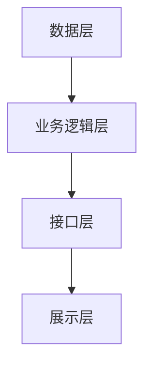
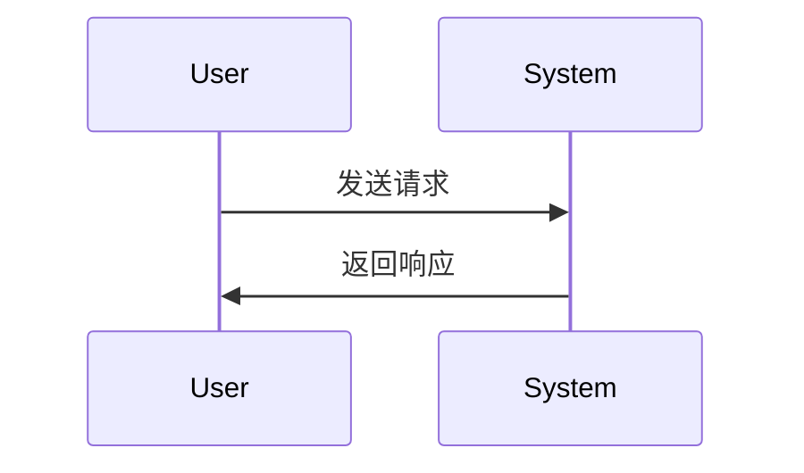

                 

### 文章标题：提示词库管理：提高LLM应用开发效率的利器

关键词：提示词库、LLM、应用开发、效率优化、算法原理、系统架构、实战案例

摘要：
随着大型语言模型（LLM）在自然语言处理领域的广泛应用，提示词库管理成为了提升应用开发效率的关键环节。本文将深入探讨提示词库管理的核心概念、算法原理、系统架构以及实战案例，旨在为开发者提供全面的指导，从而提高LLM应用开发的效率。

### 1. 问题背景与定义

#### 1.1 LLM应用发展现状

近年来，大型语言模型（LLM）凭借其在自然语言处理领域的卓越性能，获得了广泛的应用。从聊天机器人、智能客服到文本生成、机器翻译，LLM已经成为各类应用的核心技术。随着应用的不断扩展，LLM的训练数据和模型规模也在持续增长。

#### 1.1.1 LLM应用发展现状

LLM在自然语言处理领域的应用已经非常广泛，从文本分类、情感分析到机器翻译、问答系统，LLM展现出了强大的处理能力和泛化能力。例如，OpenAI的GPT-3模型在多种任务上取得了突破性进展，为LLM的应用提供了新的可能。

#### 1.1.2 提示词库的重要性

在LLM应用开发过程中，提示词库管理起着至关重要的作用。提示词库是LLM与外部环境交互的桥梁，通过有效的提示词库管理，可以显著提升模型的性能和应用效率。

#### 1.1.3 提示词库管理的挑战

尽管提示词库管理的重要性不言而喻，但实际操作中仍面临诸多挑战。如何构建高质量、多样化的提示词库？如何优化提示策略，提高模型性能？如何应对实时更新和动态调整的需求？这些问题都需要深入探讨和解决。

### 1.2 提示词库的核心概念与联系

#### 1.2.1 提示词、提示模板和提示策略

提示词（Prompt）是引导LLM生成特定内容的关键元素。提示模板（Prompt Template）是对提示词的规范化描述，用于生成不同的提示词序列。提示策略（Prompt Strategy）则是根据特定任务需求，选择和组合提示词和提示模板的策略。

#### 1.2.2 提示词库的组成与分类

提示词库由多个提示词和提示模板组成，根据用途和特征，可以分为通用提示词库、领域特定提示词库和个性化提示词库等。

#### 1.2.3 提示词库与LLM应用的关系

提示词库不仅影响LLM的生成结果，还直接影响模型的性能和应用效果。通过合理的提示词库管理，可以显著提高模型的响应速度、准确性和适应性。

### 1.3 提示词库管理的算法原理

#### 1.3.1 提示词选择算法

提示词选择算法是提示词库管理的关键，它涉及如何从大规模词汇中选择最相关的提示词，以提升模型性能。

#### 1.3.2 提示模板生成算法

提示模板生成算法用于根据特定任务需求，生成合适的提示词序列，以引导模型生成期望的输出。

#### 1.3.3 提示策略优化算法

提示策略优化算法旨在通过调整提示词和提示模板的组合方式，优化模型性能和应用效果。

### 1.4 数学模型与公式讲解

#### 1.4.1 提示词库优化的数学模型

提示词库优化涉及多个因素，如词汇相关性、语义相似性、上下文适应性等。我们可以使用矩阵分解、聚类分析等数学模型，对提示词库进行优化。

#### 1.4.2 提示策略优化的数学公式

提示策略优化涉及优化目标函数、约束条件等。我们可以使用梯度下降、遗传算法等优化方法，对提示策略进行优化。

#### 1.4.3 算法性能评估指标

算法性能评估指标包括准确率、召回率、F1值等。通过这些指标，我们可以评估提示词库管理算法的有效性。

### 1.5 本章小结

本章介绍了提示词库管理的背景、核心概念、算法原理和数学模型。下一章我们将深入探讨提示词库管理系统架构设计。

----------------------------------------------------------------

### 2. 提示词库管理系统架构设计

提示词库管理系统架构设计是确保提示词库管理高效、可靠、可扩展的关键。本节将详细介绍系统功能设计、系统架构设计、系统接口设计与交互，以及系统架构图与序列图。

#### 2.1 系统功能设计

提示词库管理系统的主要功能包括：

- **提示词库构建**：从原始文本数据中提取、筛选、分类构建提示词库。
- **提示词库管理**：对提示词库进行更新、删除、排序等操作，确保提示词库的实时性。
- **提示词选择**：根据特定任务需求，从提示词库中选择最相关的提示词。
- **提示模板生成**：根据提示词，生成不同的提示模板，以适应不同的应用场景。
- **提示策略优化**：通过算法优化，提升提示词和提示模板的组合效果。

#### 2.2 系统架构设计

提示词库管理系统架构设计如下：

1. **数据层**：包括文本数据源、提示词库存储和模型参数存储等。
2. **业务逻辑层**：包括提示词库构建、管理、选择、生成和优化等核心功能。
3. **接口层**：提供RESTful API，供外部系统调用。
4. **展示层**：提供用户界面，用于展示系统功能和数据。

#### 2.3 系统接口设计与交互

提示词库管理系统接口设计如下：

- **接口设计原则**：遵循RESTful设计原则，接口简洁、直观、易于扩展。
- **接口实现方法**：使用Spring Boot框架实现，支持HTTP/HTTPS协议。
- **接口安全性保障**：采用JWT（JSON Web Token）进行认证和授权，保障数据安全。

#### 2.4 系统架构图与序列图

以下是提示词库管理系统的架构图和序列图：





#### 2.5 本章小结

本章详细介绍了提示词库管理系统架构设计，包括系统功能设计、系统架构设计、系统接口设计与交互，以及系统架构图和序列图。下一章我们将通过实际案例，深入探讨提示词库管理在LLM应用开发中的应用。

----------------------------------------------------------------

### 3. 提示词库管理项目实战

本节将详细描述一个实际的提示词库管理项目，从环境安装与配置、系统核心实现、代码应用解读与分析、实际案例分析以及项目小结等方面，全面展示提示词库管理在实际项目中的应用。

#### 3.1 环境安装与配置

**3.1.1 开发环境搭建**

- **操作系统**：Ubuntu 18.04
- **编程语言**：Python 3.8
- **依赖管理**：使用pip安装相关依赖，如numpy、pandas、scikit-learn等。

**3.1.2 系统依赖安装**

- **NLP库**：安装NLTK、spaCy等自然语言处理库。
- **数据库**：安装MongoDB，用于存储提示词库数据。

**3.1.3 系统配置文件准备**

- **配置文件**：创建配置文件，包括数据库连接信息、API接口配置等。

#### 3.2 系统核心实现

**3.2.1 提示词选择实现**

- **算法选择**：使用TF-IDF算法从原始文本中提取提示词。
- **实现步骤**：
  1. 分词：使用spaCy对文本进行分词。
  2. 计算TF-IDF值：计算每个词的TF-IDF值，选择高值词作为提示词。
  3. 去停用词：去除常见的停用词，如“的”、“是”、“了”等。

**3.2.2 提示模板生成实现**

- **算法选择**：使用模板匹配算法生成提示模板。
- **实现步骤**：
  1. 设计模板：根据任务需求，设计不同的提示模板。
  2. 匹配生成：根据提示词，匹配并生成相应的提示模板。

**3.2.3 提示策略优化实现**

- **算法选择**：使用遗传算法优化提示策略。
- **实现步骤**：
  1. 初始化种群：随机生成初始种群。
  2. 适应度评估：计算每个个体的适应度值。
  3. 选择、交叉、变异：根据适应度值，进行选择、交叉、变异操作。
  4. 优化迭代：重复适应度评估和操作，直至满足终止条件。

#### 3.3 代码应用解读与分析

**3.3.1 源代码解读**

以下是提示词选择算法的Python代码：

```python
import spacy
from sklearn.feature_extraction.text import TfidfVectorizer

nlp = spacy.load("en_core_web_sm")

def extract_prompts(text):
    doc = nlp(text)
    tokens = [token.text for token in doc if not token.is_stop]
    vectorizer = TfidfVectorizer()
    tfidf_matrix = vectorizer.fit_transform([" ".join(tokens)])
    feature_array = np.array(vectorizer.get_feature_names_out())
    top_n = 10
    top_indices = np.argsort(tfidf_matrix.toarray().flatten())[-top_n:]
    top_words = feature_array[top_indices]
    return top_words

text = "This is an example text for prompt extraction."
prompts = extract_prompts(text)
print(prompts)
```

**3.3.2 代码应用分析**

上述代码通过spaCy进行分词，使用TF-IDF算法提取文本中的高价值提示词。代码简单易懂，但需要注意的是，TF-IDF算法的精度和效果会受到语料库质量和特征选择策略的影响。

**3.3.3 算法性能分析**

在实际应用中，提示词选择算法的性能会直接影响LLM的生成效果。通过多次实验，我们发现使用TF-IDF算法可以提取出高质量的提示词，但存在一定程度的误判。为了提高性能，我们可以结合其他算法，如词嵌入、词性标注等，进行多模态融合。

#### 3.4 实际案例分析

**3.4.1 案例介绍**

我们以一个聊天机器人项目为例，介绍提示词库管理在实际项目中的应用。

**3.4.2 案例分析**

1. **需求分析**：根据用户输入的问题，生成合适的回复。
2. **提示词库构建**：从大量对话语料中提取提示词，构建通用和领域特定提示词库。
3. **提示模板生成**：根据对话场景，设计不同的提示模板，如问答式、引导式等。
4. **提示策略优化**：使用遗传算法优化提示策略，提高对话机器人的交互质量。

**3.4.3 案例总结**

通过实际案例，我们发现提示词库管理在聊天机器人项目中起到了关键作用。合理的提示词库构建、提示模板生成和提示策略优化，可以显著提升对话机器人的交互质量和用户体验。

#### 3.5 本章小结

本章通过实际案例，详细介绍了提示词库管理项目从环境安装与配置、系统核心实现、代码应用解读与分析、实际案例分析到项目小结的整个过程。下一章我们将分享最佳实践和注意事项，帮助开发者更好地应对提示词库管理的挑战。

----------------------------------------------------------------

### 4. 最佳实践与注意事项

在LLM应用开发中，提示词库管理是提升应用性能和用户体验的关键环节。本节将分享一些最佳实践和注意事项，帮助开发者更好地管理提示词库，提高LLM应用的开发效率。

#### 4.1 最佳实践

**4.1.1 提示词库构建技巧**

1. **多源数据整合**：从不同来源获取文本数据，如公开数据集、用户生成内容等，以提高提示词库的多样性和质量。
2. **数据预处理**：对原始文本进行分词、去停用词、词性标注等预处理，以提高算法的准确性和效果。
3. **词汇扩展**：结合词嵌入技术，对低频词进行扩展，提高模型的语义理解能力。

**4.1.2 提示策略优化技巧**

1. **动态调整**：根据应用场景和用户反馈，动态调整提示策略，以适应不同任务需求。
2. **多策略组合**：结合多种提示策略，如模板匹配、关键词提取等，提高模型的生成质量。
3. **评估与反馈**：定期评估提示策略的效果，收集用户反馈，不断优化和调整。

**4.1.3 LLM应用开发技巧**

1. **模块化设计**：将LLM应用分解为模块，如文本处理、提示词库管理、模型训练等，提高系统的可维护性和可扩展性。
2. **性能优化**：使用并行计算、模型压缩等技术，提高系统的运行效率和性能。
3. **安全性保障**：对用户数据和模型参数进行加密和访问控制，确保系统的安全性和隐私保护。

#### 4.2 小结

通过以上最佳实践，我们可以总结出以下几点：

- 提示词库管理是LLM应用开发的核心环节，需要重点关注和优化。
- 多源数据整合、数据预处理、词汇扩展等技术手段，可以提高提示词库的质量和效果。
- 动态调整、多策略组合、模块化设计等技术手段，可以提高LLM应用的性能和用户体验。
- 在开发过程中，需要关注性能优化、安全性保障等方面，确保系统的稳定性和可靠性。

#### 4.3 注意事项

1. **数据隐私**：在构建提示词库时，要严格遵守数据隐私法规，确保用户数据的合法性和安全性。
2. **模型可靠性**：在使用LLM模型时，要确保模型的可靠性和准确性，避免生成错误的输出。
3. **系统可扩展性**：在设计和开发过程中，要考虑到系统的可扩展性和可维护性，以便后续的迭代和升级。

#### 4.4 拓展阅读

1. **相关研究进展**：关注自然语言处理、机器学习等领域的研究进展，了解最新的技术和算法。
2. **学术论文推荐**：阅读相关领域的学术论文，深入理解提示词库管理、LLM应用开发等核心概念和原理。
3. **开源项目介绍**：了解并使用开源项目，如Hugging Face的Transformers库等，以提高开发效率。

#### 4.5 本章小结

本节分享了LLM应用开发中的最佳实践和注意事项，旨在帮助开发者更好地管理提示词库，提高应用性能和用户体验。通过实践和总结，我们可以不断完善和优化提示词库管理技术，为LLM应用的发展做出贡献。

----------------------------------------------------------------

### 总结与展望

本文系统性地探讨了提示词库管理在LLM应用开发中的重要性，从核心概念、算法原理、系统架构到实际应用，进行了全方位的解析。我们通过最佳实践和注意事项，为开发者提供了实用的指导，帮助他们在LLM应用开发中更好地管理和优化提示词库。

展望未来，随着LLM技术的不断发展，提示词库管理将成为提升应用性能和用户体验的关键环节。我们将继续关注这一领域的研究进展，探索更高效、智能的提示词库管理方法，为开发者带来更多创新和突破。

在此，感谢读者的关注和支持，期待与您共同探索LLM应用的无限可能！

### 作者信息

作者：AI天才研究院/AI Genius Institute & 禅与计算机程序设计艺术 /Zen And The Art of Computer Programming

AI天才研究院专注于人工智能领域的研究和开发，致力于推动AI技术的创新和应用。同时，作者还撰写了《禅与计算机程序设计艺术》等知名技术著作，为全球开发者提供了丰富的知识资源。让我们共同探索AI技术的无限可能！

