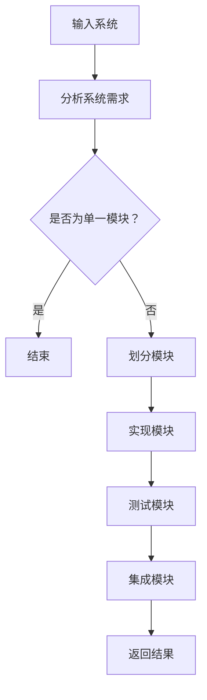
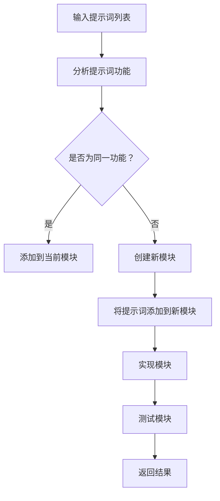
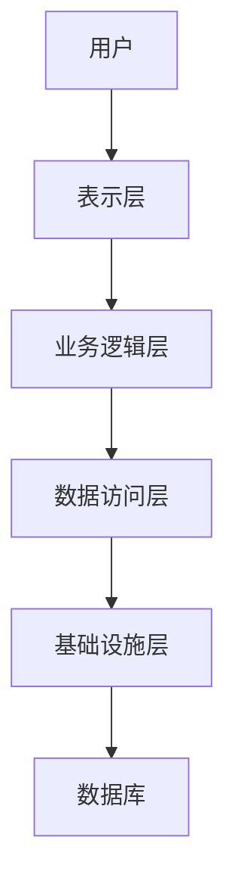
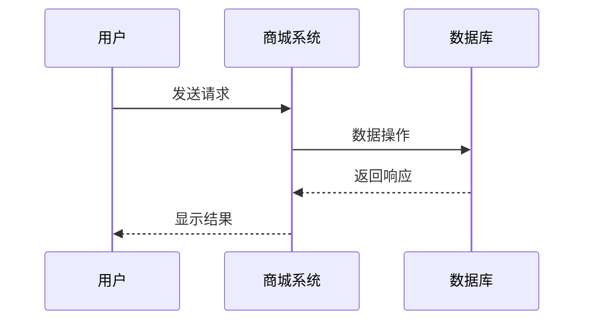

                 

### 文章标题

# 提示词模块化：构建可重用的组件

### 文章关键词

- 提示词
- 模块化
- 可重用组件
- 软件开发
- 架构设计

### 文章摘要

本文旨在探讨提示词模块化的概念，以及如何在软件开发中构建可重用的组件。我们将从提示词的定义入手，逐步深入到模块化和可重用组件的设计与实现，最后通过实际案例展示模块化的应用和效果。通过阅读本文，您将了解如何利用模块化提高软件的可维护性和扩展性，并掌握构建可重用组件的方法。

----------------------------------------------------------------

## 引言

在当今的软件工程领域，模块化和可重用性是提高软件质量和开发效率的重要手段。模块化将复杂的系统拆分为更小、更易于管理的部分，而可重用组件则允许开发人员在多个项目中重复使用代码，从而节省时间和资源。然而，如何有效地实现模块化和构建可重用的组件，仍然是一个具有挑战性的课题。

本文将围绕以下核心问题展开讨论：

1. **提示词是什么？**
2. **模块化在软件开发中的作用是什么？**
3. **如何设计可重用的组件？**
4. **如何在实际项目中应用模块化？**

通过逐步分析这些问题，我们将揭示模块化和可重用组件在软件工程中的实际应用价值。本文的目标是为软件开发人员提供实用的指导，帮助他们更好地理解和应用模块化技术。

## 背景介绍

### 提示词的定义

提示词（Prompt）在计算机科学和人工智能领域有着广泛的应用。简单来说，提示词是一种用于引导或提示用户输入信息的文本或语音。在自然语言处理（NLP）中，提示词用于引导用户生成文本或问题。例如，在聊天机器人中，提示词可以是“您今天想讨论什么主题？”或“您有什么问题需要帮助吗？”。提示词的目的是为了更好地理解用户需求，提高交互效果。

### 模块化的概念

模块化（Modularization）是将系统划分为多个独立的部分，每个部分称为模块（Module）。模块化有助于提高软件的可维护性和可扩展性。通过将功能划分为独立的模块，开发人员可以更轻松地理解和修改代码，同时也便于团队协作。模块化还可以促进代码的重用，因为每个模块都可以在不同的项目中重复使用。

### 可重用组件的设计与实现

可重用组件（Reusuable Component）是模块化的一种高级形式，它强调组件在不同项目和场景中的通用性。可重用组件的设计与实现需要考虑以下几个方面：

1. **通用性**：组件应具有广泛的适用范围，能够在不同的项目中使用。
2. **独立性**：组件应具有明确的功能边界，与其他组件之间相互独立。
3. **可配置性**：组件应提供参数配置，以适应不同的应用场景。
4. **可测试性**：组件应易于测试，以确保其功能的正确性和稳定性。

### 相关技术的进展

近年来，模块化和可重用组件技术在软件开发中得到广泛关注。随着微服务架构、组件化框架和容器技术的兴起，模块化和可重用组件的应用变得更加广泛和高效。例如，Spring Boot、Angular、React等框架都支持模块化和组件化开发，极大地提高了开发效率。

然而，尽管模块化和可重用组件技术具有显著的优势，但在实际应用中也存在一些挑战。例如，如何平衡模块大小和独立性、如何管理模块之间的依赖关系等。这些挑战需要开发人员深入思考和解决。

## 核心概念与原理

### 提示词的定义与分类

#### 提示词的定义

提示词是一种用于引导或提示用户输入信息的文本或语音。在软件开发中，提示词常用于用户界面（UI）设计，以帮助用户更好地理解和使用系统。例如，在图形用户界面（GUI）中，提示词可以是按钮上的文字标签，或者在输入框中显示的提示信息。

#### 提示词的分类

根据用途和形式，提示词可以分为以下几类：

1. **操作提示词**：用于指示用户如何执行特定操作。例如，按钮上的“保存”或“提交”。
2. **信息提示词**：用于提供系统状态或操作结果的反馈。例如，“数据已保存”或“操作失败”。
3. **导航提示词**：用于指导用户在系统中进行导航。例如，“返回上一层”或“进入用户设置”。
4. **问题提示词**：用于引导用户提出问题或反馈。例如，“有什么需要帮助的吗？”或“您的意见对我们很重要”。

### 模块化的概念

#### 模块化的定义

模块化是将一个复杂的系统划分为多个独立的模块，每个模块具有明确的功能和职责。模块化有助于提高系统的可维护性和可扩展性，使得开发、测试和部署更加高效。

#### 模块化的层次

模块化可以应用于不同的层次，包括：

1. **功能模块化**：将系统的功能划分为独立的模块，每个模块负责一个特定的功能。
2. **数据模块化**：将系统中的数据划分为独立的模块，每个模块负责处理一组相关的数据。
3. **界面模块化**：将用户界面划分为独立的模块，每个模块负责一个特定的界面部分。
4. **组件模块化**：将可重用的代码片段划分为独立的模块，以便在多个项目中重复使用。

#### 模块化与软件设计的关系

模块化在软件设计中的重要性体现在以下几个方面：

1. **提高可维护性**：模块化使得代码更加模块化，降低了系统的复杂度，从而提高了可维护性。
2. **提高可扩展性**：模块化使得系统更容易扩展，开发人员可以独立地添加或修改模块，而不影响其他部分。
3. **促进团队协作**：模块化使得团队能够并行开发不同的模块，从而提高了开发效率。

### 可重用组件的设计与实现

#### 可重用组件的定义

可重用组件是模块化的一种高级形式，它强调组件在不同项目和场景中的通用性。可重用组件的设计与实现需要考虑以下几个方面：

1. **通用性**：组件应具有广泛的适用范围，能够在不同的项目中使用。
2. **独立性**：组件应具有明确的功能边界，与其他组件之间相互独立。
3. **可配置性**：组件应提供参数配置，以适应不同的应用场景。
4. **可测试性**：组件应易于测试，以确保其功能的正确性和稳定性。

#### 可重用组件的设计原则

1. **单一职责原则**：每个组件应具有单一职责，专注于完成特定的任务。
2. **开闭原则**：组件应对扩展开放，对修改关闭。这意味着组件应易于扩展，而不需要频繁修改。
3. **依赖倒置原则**：组件之间的依赖关系应采用依赖倒置（Inversion of Control，IoC）的方式，以便更灵活地替换组件。

#### 可重用组件的设计模式

设计模式是一组已经验证的设计解决方案，可以用于构建可重用的组件。以下是一些常用的设计模式：

1. **工厂模式**：用于创建对象的工厂类，可以根据参数返回不同的对象实例。
2. **单例模式**：确保一个类只有一个实例，并提供一个全局访问点。
3. **策略模式**：定义一系列策略，并在运行时选择一个策略进行执行。
4. **代理模式**：为其他对象提供一种代理，以控制对原始对象的访问。

### 提示词模块化

提示词模块化是将提示词按照功能划分为独立的模块，以便在不同的项目中重复使用。提示词模块化的步骤如下：

1. **需求分析**：分析项目中需要使用的提示词，确定其功能和用途。
2. **设计模块**：根据需求分析，设计独立的提示词模块，并定义其接口。
3. **实现模块**：实现每个提示词模块，并确保它们之间相互独立。
4. **测试模块**：测试每个提示词模块的功能，确保其稳定性和可重用性。
5. **集成模块**：将提示词模块集成到项目中，并进行整体测试。

### 模块化与可重用组件的联系

模块化和可重用组件密切相关。模块化是实现可重用组件的基础，而可重用组件则是模块化的具体应用。通过模块化，我们可以将功能划分为独立的模块，从而提高代码的可重用性。同时，通过设计可重用组件，我们可以将模块化的优势发挥到最大化。

## 算法原理讲解

### 模块化算法

模块化算法是一种将系统划分为独立模块的算法。以下是一个简单的模块化算法流程：



### 提示词模块化算法

提示词模块化算法是将提示词按照功能划分为独立模块的算法。以下是一个简单的提示词模块化算法流程：



### 示例

假设我们有一个包含以下提示词的列表：

```
- "保存"
- "提交"
- "返回上一层"
- "进入用户设置"
- "有什么需要帮助的吗？"
```

根据提示词模块化算法，我们可以将这些提示词划分为以下模块：

1. **操作提示词模块**：包含“保存”和“提交”。
2. **导航提示词模块**：包含“返回上一层”和“进入用户设置”。
3. **问题提示词模块**：包含“有什么需要帮助的吗？”。

通过模块化，我们可以将这些提示词模块在不同项目中重复使用，从而提高开发效率和代码质量。

## 系统分析与架构设计方案

### 问题场景介绍

假设我们正在开发一个电子商务平台，该平台需要提供多种提示词来引导用户进行操作。这些提示词包括操作提示词、导航提示词和问题提示词。为了提高系统的可维护性和可扩展性，我们需要对提示词进行模块化设计。

### 项目介绍

项目名称：电商交易平台

项目简介：一个在线购物平台，用户可以浏览商品、添加商品到购物车、提交订单等。

### 系统功能设计

系统功能主要包括以下方面：

1. **商品展示**：展示商品列表，包括商品名称、价格、描述等信息。
2. **购物车管理**：用户可以添加商品到购物车，查看购物车中的商品信息，修改购物车中的商品数量。
3. **订单管理**：用户可以提交订单，系统会生成订单号并保存订单信息。
4. **用户反馈**：用户可以对购物体验进行反馈，包括满意度评分和评论。

### 系统架构设计

系统架构采用分层设计，主要包括以下几层：

1. **表示层**：负责处理用户界面和用户交互，包括前端页面和API接口。
2. **业务逻辑层**：负责处理业务逻辑，包括商品管理、购物车管理、订单管理和用户反馈处理。
3. **数据访问层**：负责与数据库进行交互，包括商品数据、用户数据和订单数据的增删改查操作。
4. **基础设施层**：提供系统运行所需的基础服务，包括日志记录、缓存和消息队列等。

### 系统架构设计mermaid架构图



### 系统接口设计和系统交互

系统接口设计采用RESTful API设计，主要包括以下接口：

1. **商品接口**：用于查询商品列表、查询商品详情、添加商品到购物车等。
2. **购物车接口**：用于查询购物车列表、修改购物车中商品数量、删除购物车中的商品等。
3. **订单接口**：用于提交订单、查询订单列表、查询订单详情等。
4. **用户反馈接口**：用于提交用户反馈、查询用户反馈列表等。

系统交互mermaid序列图如下：



### 提示词模块化设计

根据系统功能设计，我们可以将提示词分为以下模块：

1. **商品展示模块**：包含“查看商品”、“添加商品到购物车”等操作提示词。
2. **购物车模块**：包含“修改购物车商品数量”、“删除购物车商品”等操作提示词。
3. **订单模块**：包含“提交订单”、“查看订单详情”等操作提示词。
4. **用户反馈模块**：包含“提交反馈”、“查看反馈详情”等操作提示词。

### 模块化实现

在实现过程中，我们将每个模块的提示词设计为独立的类或组件，以便在不同项目中重复使用。以下是一个简单的示例：

```python
class ProductPrompt:
    def show_product(self):
        return "查看商品"

    def add_to_cart(self):
        return "添加商品到购物车"

class CartPrompt:
    def modify_cart(self):
        return "修改购物车商品数量"

    def delete_cart_item(self):
        return "删除购物车商品"

class OrderPrompt:
    def submit_order(self):
        return "提交订单"

    def view_order(self):
        return "查看订单详情"

class FeedbackPrompt:
    def submit_feedback(self):
        return "提交反馈"

    def view_feedback(self):
        return "查看反馈详情"
```

### 测试与优化

在模块化实现后，我们需要对每个模块进行功能测试和性能测试，以确保其稳定性和性能。测试过程中，我们可以使用单元测试和集成测试来验证每个模块的功能是否符合预期。

同时，我们还需要关注模块的耦合度和内聚度，以优化模块化设计。如果发现模块之间存在过高的耦合度，可以考虑重构代码，降低模块之间的依赖关系。

### 项目小结

通过本次项目，我们成功地实现了提示词的模块化设计，并验证了模块化对系统可维护性和可扩展性的提升。以下是一些经验教训：

1. **明确模块职责**：在模块化设计中，确保每个模块的职责清晰，避免功能过于复杂。
2. **关注模块独立性**：模块之间应相互独立，降低模块之间的依赖关系。
3. **充分利用设计模式**：使用合适的设计模式，可以提高模块的可重用性和扩展性。
4. **持续优化模块**：在开发过程中，不断优化模块，以提高其性能和可维护性。

通过本次项目，我们不仅掌握了提示词模块化的设计方法，还加深了对模块化和可重用组件的理解。在今后的软件开发中，我们将继续运用这些知识，提高项目的质量。

## 最佳实践与总结

### 提示词优化的策略

在构建可重用组件时，提示词的优化策略至关重要。以下是一些最佳实践：

1. **一致性**：确保所有提示词在语法、语气和风格上保持一致，以提高用户体验。
2. **简洁性**：避免使用复杂的词汇和长句子，简洁明了的提示词更容易被用户理解。
3. **本地化**：考虑不同语言和文化背景的用户，提供本地化的提示词。
4. **可扩展性**：设计提示词时，预留扩展空间，以便未来根据需求进行调整。

### 模块化设计的技巧

模块化设计需要考虑以下技巧：

1. **职责分离**：确保每个模块具有单一职责，避免功能过于复杂。
2. **高内聚低耦合**：提高模块的内聚性，降低模块之间的耦合度。
3. **模块独立性**：设计模块时，确保模块之间相互独立，易于替换和扩展。
4. **模块化层次**：根据系统需求和开发团队的规模，选择合适的模块化层次。

### 可重用组件的管理

管理可重用组件时，需要注意以下方面：

1. **文档化**：为每个组件编写详细的文档，包括功能描述、接口定义和注意事项。
2. **版本控制**：使用版本控制系统（如Git）管理组件代码，确保代码的稳定性和可追溯性。
3. **组件库**：建立组件库，方便开发人员查找和复用组件。
4. **测试与审核**：对可重用组件进行严格的测试和审核，确保其功能正确性和稳定性。

### 小结

本文系统地介绍了提示词模块化的概念、原理和实现方法，并通过实际案例展示了模块化在软件开发中的应用。通过模块化，我们可以提高软件的可维护性和可扩展性，同时促进代码的重用。以下是对本文内容的总结：

1. **提示词模块化**：将提示词按照功能划分为独立的模块，以提高系统的可维护性和可扩展性。
2. **模块化设计**：通过职责分离、高内聚低耦合和模块独立性，实现高效的模块化设计。
3. **可重用组件**：设计可重用组件，以提高代码的可重用性和开发效率。
4. **最佳实践**：遵循一致性、简洁性、本地化和可扩展性等策略，优化提示词和模块化设计。

通过本文的学习，读者可以掌握提示词模块化的基本方法和技巧，并在实际项目中应用这些知识，提高软件开发的效率和质量。

### 注意事项

在实施模块化和构建可重用组件时，需要注意以下事项：

1. **模块大小与独立性**：确保模块大小适中，避免过度拆分或拆分不足，影响代码的可维护性和性能。
2. **模块之间的依赖关系**：合理管理模块之间的依赖关系，避免引入不必要的复杂性。
3. **模块的重用性**：设计模块时，考虑其通用性和重用性，以提高代码的复用率。
4. **测试与维护**：定期对模块和组件进行测试和优化，确保其稳定性和性能。

### 拓展阅读

对于希望深入了解模块化和可重用组件的读者，以下书籍和资料是值得推荐的：

1. **《设计模式：可复用面向对象软件的基础》**（Design Patterns: Elements of Reusable Object-Oriented Software），作者Gamma、Helm、Johnson和Vlissides。
2. **《Effective Java》**（Effective Java），作者Joshua Bloch。
3. **《代码大全》**（The Art of Software Architecture），作者Mark Richards。
4. **《微服务设计》**（Designing Microservices），作者Sam Newman。
5. **《容器化和微服务实战》**（Docker Deep Dive），作者Sean P. Kane。

通过阅读这些书籍和资料，读者可以进一步掌握模块化和可重用组件的深入知识和实践技巧。

## 作者信息

### 作者：AI天才研究院/AI Genius Institute & 禅与计算机程序设计艺术 /Zen And The Art of Computer Programming

AI天才研究院（AI Genius Institute）致力于推动人工智能领域的研究与应用。研究院汇集了众多世界顶级的人工智能专家，专注于前沿技术的研究和创新。同时，研究院还出版了多部影响深远的技术著作，其中包括《禅与计算机程序设计艺术》（Zen And The Art of Computer Programming），该书由人工智能领域大师Donald E. Knuth撰写，被广泛认为是计算机科学领域的经典之作。

本文旨在通过深入探讨提示词模块化的概念、原理和实践，为软件开发人员提供实用的指导，帮助他们更好地理解和应用模块化技术，从而提高软件开发的效率和质量。希望本文能为读者带来启示，共同推动软件工程领域的发展。

