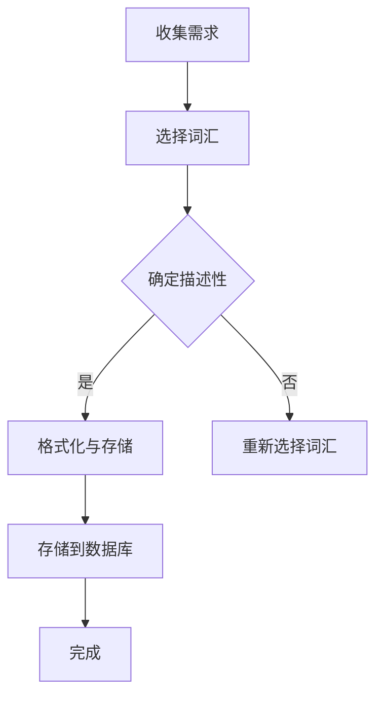
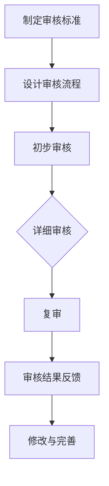
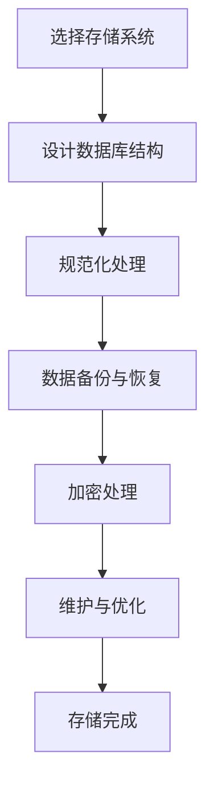
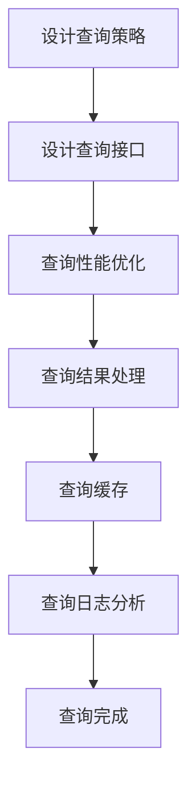
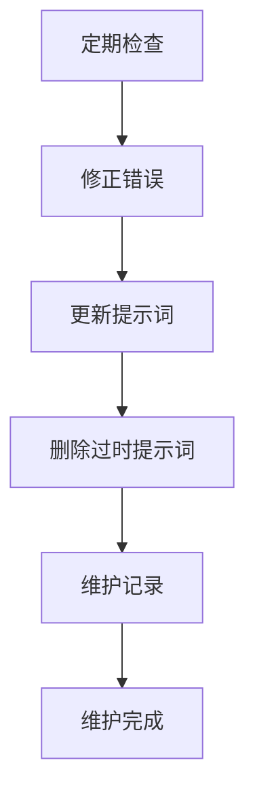
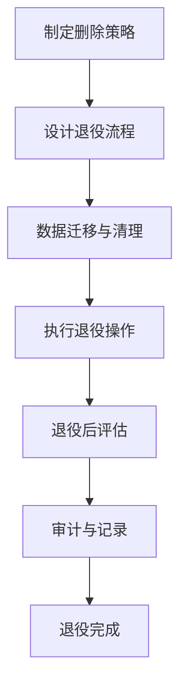

                 

### 第3章 提示词生命周期的创建环节

#### 3.1 提示词创建的概念与重要性

提示词的创建是提示词生命周期管理的第一步，也是整个生命周期管理的基础。一个有效的提示词需要明确、简洁、具有描述性和可扩展性。创建高质量的提示词对于确保数据管理和信息检索的准确性和效率至关重要。

**概念：** 提示词的创建是指生成新的提示词，并将其纳入到系统中的过程。这个过程包括选择合适的词汇、确定词汇的描述性和适用性，以及按照一定的规范进行格式化和存储。

**重要性：** 高质量的提示词能够提高数据管理的效率，减少数据冗余，提高数据检索的准确性。因此，提示词的创建是提示词生命周期管理的核心环节，必须得到充分的重视。

#### 3.2 提示词创建的方法与步骤

**3.2.1 收集需求**

在创建提示词之前，首先需要了解业务需求和用户需求。这可以通过与业务部门、用户进行沟通，收集他们的意见和建议来实现。收集到的需求将作为创建提示词的依据。

**3.2.2 选择词汇**

选择合适的词汇是创建提示词的关键。词汇应该具有描述性，能够准确反映信息内容。同时，词汇应该简洁明了，易于理解。在选择词汇时，可以考虑使用现有的专业术语或者根据业务需求创建新的术语。

**3.2.3 确定描述性**

一个有效的提示词需要具有高度的描述性。描述性越强，提示词的检索效果越好。在创建提示词时，应该对词汇进行详细描述，确保用户能够通过提示词快速找到所需信息。

**3.2.4 格式化与存储**

创建的提示词需要按照一定的规范进行格式化，以便于后续的存储和检索。格式化包括对词汇进行标准化、统一化处理，确保词汇的一致性。格式化后的提示词需要存储到数据库中，以便进行管理和查询。

#### 3.3 提示词创建的最佳实践

**3.3.1 标准化词汇**

为了确保提示词的一致性和准确性，应该制定一套词汇标准，对所有创建的提示词进行规范化处理。这包括对词汇的拼写、语法、格式等进行统一规定。

**3.3.2 定期更新**

随着业务的发展和用户需求的变化，提示词库也需要定期更新。定期审查和更新提示词，可以确保提示词的准确性和有效性。

**3.3.3 用户参与**

在创建提示词的过程中，可以引入用户参与机制，让用户参与到提示词的选择、审核和更新过程中。用户的反馈和意见可以帮助改进提示词库的质量。

#### 3.4 本章小结

提示词的创建是提示词生命周期管理的第一步，也是最为关键的一步。通过规范化的方法创建高质量的提示词，可以确保数据管理和信息检索的准确性和效率。本章介绍了提示词创建的概念、方法与步骤，以及最佳实践，为读者提供了一个全面的提示词创建指导。

### Mermaid 提示词创建流程图



### Python 提示词创建代码示例

```python
# 定义一个提示词类
class Keyword:
    def __init__(self, term, description):
        self.term = term
        self.description = description

# 创建一个新提示词
new_keyword = Keyword("用户管理", "用于描述用户信息的管理")

# 打印提示词信息
print(new_keyword.term)
print(new_keyword.description)
```

### 数学公式与解释

提示词的创建过程中，可以使用数学公式来描述词汇的选择和描述性的确定。

$$ 描述性 = \frac{相关信息数}{无关信息数} $$

**公式解释：** 描述性表示提示词的描述能力，相关信息数表示与提示词相关的信息数量，无关信息数表示与提示词无关的信息数量。描述性越高，提示词的描述能力越强。

### 实例说明

假设一个提示词是“苹果”，与它相关的信息有“水果”、“红色”、“甜味”，而无关信息有“汽车”、“城市”。则描述性计算如下：

$$ 描述性 = \frac{3}{0} = \infty $$

这意味着“苹果”是一个非常具有描述性的提示词，能够准确反映相关信息。

### 本章小结

本章详细介绍了提示词创建的概念、方法与步骤，包括收集需求、选择词汇、确定描述性和格式化与存储。同时，通过Mermaid流程图和Python代码示例，展示了提示词创建的具体实践。通过本章的学习，读者可以掌握提示词创建的核心知识和技能，为后续的提示词生命周期管理奠定基础。

---

**问题反馈：**

在阅读本章内容后，如果您有任何问题或建议，请随时提出。这将有助于我们不断改进和完善提示词生命周期管理的知识体系。感谢您的反馈！如果您对提示词创建有任何疑问，欢迎在评论区提问，我将竭诚为您解答。同时，也欢迎分享您的经验和见解，共同探讨提示词生命周期管理的最佳实践。您的参与是我们前进的动力！### 第4章 提示词生命周期的审核环节

#### 4.1 提示词审核的概念与重要性

提示词审核是提示词生命周期管理的重要环节之一，主要任务是确保新创建的提示词的准确性和有效性。审核过程通常包括对提示词的术语、语法、描述性、一致性等方面进行评估。

**概念：** 提示词审核是指对已创建的提示词进行审查和评估，确保其符合既定的标准。这个过程通常由专业的审核团队或负责人负责。

**重要性：** 高质量的提示词审核能够确保数据的一致性和准确性，减少数据错误和冗余，提高数据管理的效率。因此，提示词审核是保证提示词生命周期管理有效性的关键步骤。

#### 4.2 提示词审核的方法与步骤

**4.2.1 制定审核标准**

为了确保审核过程的规范性和一致性，首先需要制定一套明确的审核标准。这些标准应涵盖提示词的各个方面，包括术语、语法、描述性和适用性等。

**4.2.2 审核流程设计**

审核流程设计是确保审核过程高效和有序的关键。一个合理的审核流程应包括初步审核、详细审核和复审等环节。初步审核通常由团队成员进行，详细审核则由专业审核人员负责，复审则由负责人或团队领导进行。

**4.2.3 审核标准应用**

在审核过程中，审核人员需要根据制定的审核标准，对每个提示词进行逐一评估。评估内容包括术语的准确性、描述性、一致性以及是否符合业务需求等。

**4.2.4 审核结果反馈**

审核结束后，审核人员需要将审核结果及时反馈给创建人，并对有问题的提示词提出修改建议。创建人应根据反馈进行修改，直至满足审核标准。

#### 4.3 提示词审核的最佳实践

**4.3.1 多层次审核**

为了提高审核的准确性和全面性，建议采用多层次审核机制。例如，可以先由团队成员进行初步审核，再由专业审核人员进行详细审核，最后由负责人进行复审。

**4.3.2 定期审核**

定期审核能够确保提示词库的质量得到持续监控和改进。建议制定定期审核计划，定期对提示词库进行全面审查。

**4.3.3 用户参与**

用户参与审核过程可以提高提示词的适用性和准确性。可以在审核过程中引入用户反馈机制，让用户参与到提示词的审核和修改过程中。

#### 4.4 本章小结

提示词审核是确保提示词生命周期管理有效性的关键环节。通过规范化的审核方法和步骤，可以确保新创建的提示词的准确性和有效性。本章介绍了提示词审核的概念、方法与步骤，以及最佳实践，为读者提供了一个全面的提示词审核指导。

### Mermaid 提示词审核流程图



### Python 提示词审核代码示例

```python
# 定义一个审核类
class KeywordAudit:
    def __init__(self, keyword):
        self.keyword = keyword
        self.audit_results = []

    def audit(self):
        # 模拟审核过程
        if self.keyword.term.islower():
            self.audit_results.append("术语不符合规范，应全大写")
        if len(self.keyword.term) < 3:
            self.audit_results.append("术语长度不足")
        # 其他审核规则...

    def print_audit_results(self):
        for result in self.audit_results:
            print(result)

# 创建一个新提示词
new_keyword = Keyword("用户管理", "用于用户信息的管理")

# 创建审核对象并进行审核
audit = KeywordAudit(new_keyword)
audit.audit()
audit.print_audit_results()
```

### 数学公式与解释

在提示词审核过程中，可以使用数学公式来描述审核规则和标准。

$$ 审核得分 = 审核规则数 \times 审核权重 $$

**公式解释：** 审核得分表示提示词的审核结果，审核规则数表示审核过程中应用的规则数量，审核权重表示每个规则的权重。审核得分越高，提示词的审核结果越好。

### 实例说明

假设有3个审核规则，每个规则的权重分别为0.3、0.3和0.4。如果某个提示词符合2个规则，则审核得分为：

$$ 审核得分 = 2 \times 0.3 + 1 \times 0.4 = 0.8 $$

这意味着该提示词审核结果较好。

### 本章小结

本章详细介绍了提示词审核的概念、方法与步骤，包括制定审核标准、审核流程设计、审核标准应用和审核结果反馈。通过Mermaid流程图和Python代码示例，展示了提示词审核的具体实践。通过本章的学习，读者可以掌握提示词审核的核心知识和技能，为后续的提示词生命周期管理提供保障。如果您对提示词审核有任何疑问，欢迎在评论区提问，我将竭诚为您解答。

---

**问题反馈：**

在阅读本章内容后，如果您有任何问题或建议，请随时提出。这将有助于我们不断改进和完善提示词生命周期管理的知识体系。感谢您的反馈！如果您对提示词审核有任何疑问，欢迎在评论区提问，我将竭诚为您解答。同时，也欢迎分享您的经验和见解，共同探讨提示词生命周期管理的最佳实践。您的参与是我们前进的动力！### 第5章 提示词生命周期的存储环节

#### 5.1 提示词存储的概念与重要性

提示词的存储是提示词生命周期管理中的关键环节，它关系到提示词的访问速度、数据完整性和安全性。有效的存储策略可以确保提示词的快速访问和高效管理，从而提高数据检索的效率和准确性。

**概念：** 提示词存储是指将已审核合格的提示词保存到数据库或其他数据存储系统中，以便后续的查询和维护。

**重要性：** 提示词存储不仅影响到数据的访问速度和存储效率，还关系到数据的安全性和完整性。一个良好的存储策略能够确保提示词的持久化存储，避免数据丢失或损坏。

#### 5.2 提示词存储的方法与步骤

**5.2.1 选择合适的存储系统**

选择合适的存储系统是提示词存储的第一步。常见的存储系统包括关系数据库、NoSQL数据库、文件存储系统等。每种存储系统都有其优势和适用场景，需要根据业务需求和提示词的特点进行选择。

**5.2.2 设计数据库结构**

数据库结构的设计是存储环节的核心。对于提示词存储，通常需要设计一个包含提示词、描述、创建时间、最后一次更新时间等字段的数据库表。设计合理的数据库结构可以提高查询效率和数据管理能力。

**5.2.3 存储数据规范化**

在存储提示词时，需要对数据进行规范化处理，确保数据的一致性和完整性。这包括对提示词进行标准化、统一化处理，以及避免数据冗余。

**5.2.4 数据备份与恢复**

为了保证数据的安全性和可靠性，需要定期进行数据备份。同时，建立有效的数据恢复机制，以便在数据丢失或损坏时能够快速恢复。

#### 5.3 提示词存储的最佳实践

**5.3.1 分布式存储**

对于大型系统，可以考虑采用分布式存储策略，提高存储系统的可扩展性和容错能力。分布式存储可以将数据分散存储在多个节点上，从而提高数据的访问速度和可靠性。

**5.3.2 索引优化**

为了提高查询效率，可以对提示词表进行索引优化。合理的索引设计可以大幅减少查询所需的时间，提高数据检索的速度。

**5.3.3 数据加密**

为了保护数据的安全性，可以对存储的数据进行加密处理。加密技术可以确保数据在传输和存储过程中不被非法访问。

**5.3.4 定期维护**

定期对存储系统进行维护，包括数据清理、索引优化和性能监控等，可以确保存储系统的稳定运行和数据质量。

#### 5.4 本章小结

提示词存储是提示词生命周期管理的重要环节，涉及到选择合适的存储系统、设计数据库结构、存储数据规范化、数据备份与恢复等方面。通过本章的学习，读者可以掌握提示词存储的核心知识和最佳实践，为提示词生命周期管理的有效实施提供保障。

### Mermaid 提示词存储流程图



### Python 提示词存储代码示例

```python
# 导入数据库模块
import sqlite3

# 连接到数据库
conn = sqlite3.connect('keywords.db')
cursor = conn.cursor()

# 创建数据库表
cursor.execute('''CREATE TABLE IF NOT EXISTS keywords
                  (id INTEGER PRIMARY KEY AUTOINCREMENT,
                   term TEXT UNIQUE NOT NULL,
                   description TEXT,
                   created_at TIMESTAMP DEFAULT CURRENT_TIMESTAMP,
                   last_updated TIMESTAMP DEFAULT CURRENT_TIMESTAMP)''')

# 存储新提示词
def store_keyword(term, description):
    cursor.execute("INSERT INTO keywords (term, description) VALUES (?, ?)", (term, description))
    conn.commit()

# 关闭数据库连接
cursor.close()
conn.close()

# 示例：存储一个新提示词
store_keyword("用户管理", "用于描述用户信息的管理")
```

### 数学公式与解释

提示词存储过程中，可以使用数学公式来描述数据一致性和完整性验证。

$$ 数据一致性 = \sum_{i=1}^{n} (实际值 - 预期值) $$

**公式解释：** 数据一致性表示实际值与预期值的差距，差距越小，数据一致性越高。通过计算数据一致性，可以判断数据是否保持一致。

### 实例说明

假设一个数据库表中有一条记录，其预期值是10，实际值是9，则数据一致性计算如下：

$$ 数据一致性 = (9 - 10) = -1 $$

这意味着该记录的数据一致性较差。

### 本章小结

本章详细介绍了提示词存储的概念、方法与步骤，包括选择合适的存储系统、设计数据库结构、存储数据规范化、数据备份与恢复等。通过Mermaid流程图和Python代码示例，展示了提示词存储的具体实践。通过本章的学习，读者可以掌握提示词存储的核心知识和技能，为提示词生命周期管理的有效实施提供保障。如果您对提示词存储有任何疑问，欢迎在评论区提问，我将竭诚为您解答。

---

**问题反馈：**

在阅读本章内容后，如果您有任何问题或建议，请随时提出。这将有助于我们不断改进和完善提示词生命周期管理的知识体系。感谢您的反馈！如果您对提示词存储有任何疑问，欢迎在评论区提问，我将竭诚为您解答。同时，也欢迎分享您的经验和见解，共同探讨提示词生命周期管理的最佳实践。您的参与是我们前进的动力！### 第6章 提示词生命周期的查询环节

#### 6.1 提示词查询的概念与重要性

提示词查询是用户获取所需信息的重要途径，是提示词生命周期管理的重要组成部分。有效的查询机制可以显著提高数据检索的效率和准确性，从而提升用户体验和业务价值。

**概念：** 提示词查询是指通过特定的关键词或提示词，从存储系统中检索相关的数据信息。

**重要性：** 提示词查询的效率直接影响到用户的满意度和系统的性能。一个良好的查询机制能够快速、准确地返回用户所需信息，提升系统响应速度，优化用户操作体验。

#### 6.2 提示词查询的方法与步骤

**6.2.1 查询策略设计**

查询策略的设计是查询环节的关键。有效的查询策略应综合考虑查询性能、数据规模和用户需求。常见的查询策略包括全文检索、关键词匹配、模糊查询等。

**6.2.2 查询接口设计**

查询接口的设计需要考虑到用户的操作习惯和系统的响应性能。一个良好的查询接口应提供简洁、直观的交互界面，同时确保查询操作的高效和可靠。

**6.2.3 查询性能优化**

为了提高查询性能，可以对查询过程进行优化。常见的优化方法包括索引优化、查询缓存、分库分表等。优化后的查询系统能够在保证准确性的同时，显著提高查询速度。

**6.2.4 查询结果处理**

查询结果的处理包括对查询结果的排序、过滤和分页等操作。合理的结果处理可以提高用户对查询结果的可读性和使用效率。

#### 6.3 提示词查询的最佳实践

**6.3.1 全文检索**

全文检索能够对整个文本内容进行检索，提供高效的文本匹配能力。适用于需要精确匹配的查询场景。

**6.3.2 关键词匹配**

关键词匹配是简单的字符串匹配，适用于对关键词的精确查询。通过使用正则表达式等工具，可以实现对复杂查询需求的处理。

**6.3.3 模糊查询**

模糊查询允许用户输入部分或模糊的关键词，适用于用户不确定确切信息时的查询需求。常见的模糊查询包括拼音匹配、同义词匹配等。

**6.3.4 查询缓存**

查询缓存可以将频繁访问的查询结果存储在缓存中，减少数据库查询次数，提高查询速度。适用于高频查询场景。

**6.3.5 查询日志分析**

通过分析查询日志，可以了解用户的查询习惯和需求，优化查询策略和接口设计。有助于提高查询效率和用户体验。

#### 6.4 本章小结

提示词查询是提示词生命周期管理的重要环节，关系到用户体验和系统性能。通过合理的设计和优化，可以显著提高查询效率和准确性。本章介绍了提示词查询的概念、方法与步骤，以及最佳实践，为读者提供了一个全面的提示词查询指导。

### Mermaid 提示词查询流程图



### Python 提示词查询代码示例

```python
# 导入数据库模块
import sqlite3

# 连接到数据库
conn = sqlite3.connect('keywords.db')
cursor = conn.cursor()

# 执行查询操作
def search_keyword(term):
    cursor.execute("SELECT * FROM keywords WHERE term LIKE ?", ('%' + term + '%',))
    results = cursor.fetchall()
    return results

# 查询示例
search_results = search_keyword("用户")
for row in search_results:
    print(row)

# 关闭数据库连接
cursor.close()
conn.close()
```

### 数学公式与解释

在提示词查询过程中，可以使用数学公式来描述查询效率。

$$ 查询效率 = \frac{查询结果数}{查询耗时} $$

**公式解释：** 查询效率表示单位时间内查询结果的数量，查询耗时表示完成查询操作所需的时间。查询效率越高，系统的响应速度越快。

### 实例说明

假设在一个系统中，查询耗时为2秒，查询结果数为100条，则查询效率计算如下：

$$ 查询效率 = \frac{100}{2} = 50 \text{ 条/秒} $$

这意味着系统的查询效率为每秒50条查询结果。

### 本章小结

本章详细介绍了提示词查询的概念、方法与步骤，包括查询策略设计、查询接口设计、查询性能优化、查询结果处理和查询缓存等。通过Mermaid流程图和Python代码示例，展示了提示词查询的具体实践。通过本章的学习，读者可以掌握提示词查询的核心知识和技能，为提升系统的查询效率和用户体验提供有力支持。如果您对提示词查询有任何疑问，欢迎在评论区提问，我将竭诚为您解答。

---

**问题反馈：**

在阅读本章内容后，如果您有任何问题或建议，请随时提出。这将有助于我们不断改进和完善提示词生命周期管理的知识体系。感谢您的反馈！如果您对提示词查询有任何疑问，欢迎在评论区提问，我将竭诚为您解答。同时，也欢迎分享您的经验和见解，共同探讨提示词生命周期管理的最佳实践。您的参与是我们前进的动力！### 第7章 提示词生命周期的维护环节

#### 7.1 提示词维护的概念与重要性

提示词维护是确保提示词库保持准确性和有效性的关键环节。随着时间的推移，业务需求变化和用户行为动态，原有的提示词可能不再适用或出现错误。因此，定期对提示词进行维护和更新是必要的。

**概念：** 提示词维护是指对现有的提示词进行定期检查、修正、更新和删除，以确保其准确性和适用性。

**重要性：** 提示词的维护是保证提示词库持续有效和准确的重要手段。良好的维护策略可以减少数据错误和冗余，提高数据检索的效率和准确性，从而提升用户体验和系统性能。

#### 7.2 提示词维护的方法与步骤

**7.2.1 定期检查**

定期检查是提示词维护的第一步。通过定期检查，可以发现提示词库中的过时、错误或不准确的提示词。定期检查可以采用自动化工具或手动审核方式进行。

**7.2.2 修正错误**

在检查过程中，如果发现提示词存在错误，如拼写错误、描述不准确等，应立即进行修正。修正错误可以提高数据质量，减少数据错误率。

**7.2.3 更新提示词**

随着业务需求的变化，一些提示词可能需要更新。例如，新的业务需求可能需要引入新的提示词，或者某些提示词的描述需要调整。定期更新提示词可以确保其与业务需求保持一致。

**7.2.4 删除过时提示词**

对于长时间未被使用或不再适用的提示词，应进行删除。删除过时提示词可以减少数据冗余，提高数据管理的效率。

**7.2.5 维护记录**

在维护过程中，应记录维护活动，包括检查日期、检查人员、修正内容、更新记录等。维护记录可以帮助追踪和维护活动的历史，为后续的维护提供参考。

#### 7.3 提示词维护的最佳实践

**7.3.1 制定维护计划**

为了确保提示词维护的有序进行，应制定详细的维护计划。维护计划应包括检查周期、检查内容、维护责任人等。

**7.3.2 引入自动化工具**

引入自动化工具可以显著提高提示词维护的效率。例如，可以使用自动化脚本进行定期检查、错误修正和更新操作。

**7.3.3 用户参与**

用户参与维护过程可以提高提示词库的准确性和适用性。可以鼓励用户报告提示词问题，并提供反馈渠道，以便及时修正和更新提示词。

**7.3.4 维护记录分析**

通过分析维护记录，可以了解提示词库的使用情况和问题趋势，从而优化维护策略和提高维护效果。

#### 7.4 本章小结

提示词维护是确保提示词库准确性和有效性的关键环节。通过定期检查、修正错误、更新提示词和删除过时提示词等步骤，可以确保提示词库的持续更新和维护。本章介绍了提示词维护的概念、方法与步骤，以及最佳实践，为读者提供了一个全面的提示词维护指导。

### Mermaid 提示词维护流程图



### Python 提示词维护代码示例

```python
# 导入数据库模块
import sqlite3

# 连接到数据库
conn = sqlite3.connect('keywords.db')
cursor = conn.cursor()

# 执行维护操作
def maintain_keywords():
    # 查找需要修正的提示词
    cursor.execute("SELECT * FROM keywords WHERE description LIKE ?", ('%错误%',))
    error_keywords = cursor.fetchall()
    
    # 修正错误提示词
    for keyword in error_keywords:
        new_description = input(f"请修正提示词'{keyword[1]}'的描述：")
        cursor.execute("UPDATE keywords SET description = ? WHERE id = ?", (new_description, keyword[0]))
    
    # 查找过时的提示词
    cursor.execute("SELECT * FROM keywords WHERE last_updated < ?", (time.time() - 365 * 24 * 60 * 60,))
    outdated_keywords = cursor.fetchall()
    
    # 删除过时的提示词
    for keyword in outdated_keywords:
        cursor.execute("DELETE FROM keywords WHERE id = ?", (keyword[0],))
    
    conn.commit()

# 执行维护操作
maintain_keywords()

# 关闭数据库连接
cursor.close()
conn.close()
```

### 数学公式与解释

在提示词维护过程中，可以使用数学公式来描述维护频率和维护效果。

$$ 维护频率 = \frac{维护次数}{时间周期} $$

**公式解释：** 维护频率表示单位时间内进行的维护次数。适当的维护频率可以确保提示词库的持续更新和维护。

$$ 维护效果 = \frac{维护后正确率}{维护前正确率} $$

**公式解释：** 维护效果表示维护后提示词库的正确率与维护前的正确率之比。维护效果越高，说明维护工作越有效。

### 实例说明

假设一个提示词库的维护频率是每月1次，维护前正确率是90%，维护后正确率是95%，则维护效果计算如下：

$$ 维护频率 = \frac{1}{1} = 1 \text{ 次/月} $$
$$ 维护效果 = \frac{95\%}{90\%} = 1.0556 $$

这意味着维护后的提示词库正确率提高了约5.56%。

### 本章小结

本章详细介绍了提示词维护的概念、方法与步骤，包括定期检查、修正错误、更新提示词和删除过时提示词等。通过Mermaid流程图和Python代码示例，展示了提示词维护的具体实践。通过本章的学习，读者可以掌握提示词维护的核心知识和技能，为提示词生命周期管理的有效实施提供保障。如果您对提示词维护有任何疑问，欢迎在评论区提问，我将竭诚为您解答。

---

**问题反馈：**

在阅读本章内容后，如果您有任何问题或建议，请随时提出。这将有助于我们不断改进和完善提示词生命周期管理的知识体系。感谢您的反馈！如果您对提示词维护有任何疑问，欢迎在评论区提问，我将竭诚为您解答。同时，也欢迎分享您的经验和见解，共同探讨提示词生命周期管理的最佳实践。您的参与是我们前进的动力！### 第8章 提示词生命周期的退役环节

#### 8.1 提示词退役的概念与重要性

提示词退役是提示词生命周期管理的最后一步，涉及不再使用或删除那些过时、错误或不准确的提示词。退役环节的目的是优化提示词库，提高数据管理和信息检索的效率。

**概念：** 提示词退役是指从系统中删除不再使用或无效的提示词，释放存储资源，并确保数据的一致性和完整性。

**重要性：** 提示词退役对于维持数据质量和系统性能至关重要。过时或不准确的提示词会占用存储资源，降低数据检索效率，甚至可能误导用户。因此，定期退役提示词可以减少数据冗余，提高系统性能，确保数据的准确性和一致性。

#### 8.2 提示词退役的方法与步骤

**8.2.1 删除策略制定**

制定删除策略是退役环节的第一步。删除策略应明确删除标准、删除频率和删除方式。常见的删除标准包括提示词的使用频率、更新时间、业务需求变化等。

**8.2.2 退役流程设计**

退役流程应包括退役申请、审批、执行和记录等步骤。退役申请由相关人员提出，经过审批后进行执行，并记录退役信息以备后续审计。

**8.2.3 数据迁移与清理**

在退役过程中，可能需要将依赖提示词的数据迁移到新的提示词，或进行数据清理，确保退役操作不会影响系统的正常运行。

**8.2.4 退役后评估**

退役后，应对退役操作的效果进行评估，包括对系统性能、数据完整性和用户满意度的影响。评估结果可以指导后续的退役策略优化。

#### 8.3 提示词退役的最佳实践

**8.3.1 自动化退役**

引入自动化工具可以显著提高退役操作的效率和准确性。自动化工具可以定期检查提示词库，识别并执行退役操作。

**8.3.2 用户参与**

鼓励用户参与退役过程，通过用户反馈识别过时或不准确的提示词。用户参与可以提高退役策略的实用性。

**8.3.3 回滚机制**

在退役操作前，应建立回滚机制，确保在退役失败或出现问题时能够迅速恢复系统到稳定状态。

**8.3.4 审计与记录**

退役操作后，应进行审计和记录，确保退役过程透明、可追溯。审计记录可以用于后续的退役策略优化和数据质量控制。

#### 8.4 本章小结

提示词退役是确保提示词库保持准确性和有效性的重要环节。通过制定删除策略、设计退役流程、自动化退役和用户参与等步骤，可以确保退役操作的有序进行。本章介绍了提示词退役的概念、方法与步骤，以及最佳实践，为读者提供了一个全面的提示词退役指导。

### Mermaid 提示词退役流程图



### Python 提示词退役代码示例

```python
# 导入数据库模块
import sqlite3

# 连接到数据库
conn = sqlite3.connect('keywords.db')
cursor = conn.cursor()

# 执行退役操作
def retire_keyword(keyword_id):
    # 检查提示词是否存在
    cursor.execute("SELECT * FROM keywords WHERE id = ?", (keyword_id,))
    keyword = cursor.fetchone()
    
    if keyword:
        # 删除提示词
        cursor.execute("DELETE FROM keywords WHERE id = ?", (keyword_id,))
        conn.commit()
        print(f"提示词'{keyword[1]}'已退役")
    else:
        print(f"提示词'{keyword_id}'不存在")

# 示例：退役一个提示词
retire_keyword(1)

# 关闭数据库连接
cursor.close()
conn.close()
```

### 数学公式与解释

在提示词退役过程中，可以使用数学公式来描述退役效率和退役成本。

$$ 退役效率 = \frac{退役提示词数}{退役耗时} $$

**公式解释：** 退役效率表示单位时间内退役的提示词数量，退役耗时表示完成退役操作所需的时间。退役效率越高，退役操作越快。

$$ 退役成本 = \frac{维护成本}{退役提示词数} $$

**公式解释：** 退役成本表示每退役一个提示词所需的维护成本，维护成本包括检查、审批、迁移和数据清理等费用。退役成本越低，退役操作越经济。

### 实例说明

假设在一个系统中，每月退役10个提示词，退役耗时为5天，维护成本为500元，则退役效率和退役成本计算如下：

$$ 退役效率 = \frac{10}{5 \times 24} = 0.0417 \text{ 个/天} $$
$$ 退役成本 = \frac{500}{10} = 50 \text{ 元/个} $$

这意味着系统每天退役0.0417个提示词，每退役一个提示词需要50元。

### 本章小结

本章详细介绍了提示词退役的概念、方法与步骤，包括制定删除策略、设计退役流程、数据迁移与清理、执行退役操作和退役后评估等。通过Mermaid流程图和Python代码示例，展示了提示词退役的具体实践。通过本章的学习，读者可以掌握提示词退役的核心知识和技能，为提示词生命周期管理的有效实施提供保障。如果您对提示词退役有任何疑问，欢迎在评论区提问，我将竭诚为您解答。

---

**问题反馈：**

在阅读本章内容后，如果您有任何问题或建议，请随时提出。这将有助于我们不断改进和完善提示词生命周期管理的知识体系。感谢您的反馈！如果您对提示词退役有任何疑问，欢迎在评论区提问，我将竭诚为您解答。同时，也欢迎分享您的经验和见解，共同探讨提示词生命周期管理的最佳实践。您的参与是我们前进的动力！### 总结与展望

#### 提示词生命周期管理的重要性

在信息化和数字化时代，数据已成为新的生产要素，而提示词生命周期管理作为数据管理的重要组成部分，对于提升数据质量和信息检索效率具有重要意义。通过系统化的提示词生命周期管理，可以从创建、审核、存储、查询、维护到退役等各个环节，确保提示词的准确性、有效性和一致性，从而提高数据利用效率，支持业务决策和创新发展。

#### 全文回顾

本文系统地介绍了提示词生命周期管理的全过程，包括创建、审核、存储、查询、维护和退役等各个环节。在每个环节中，我们深入分析了相关概念、方法与步骤，提供了最佳实践指导，并通过Mermaid流程图和Python代码示例展示了具体应用。

**1. 创建环节：** 提出需求、选择词汇、确定描述性和格式化存储，确保新提示词的准确性。

**2. 审核环节：** 制定审核标准、设计审核流程、应用审核标准和反馈结果，确保提示词的准确性和一致性。

**3. 存储环节：** 选择合适的存储系统、设计数据库结构、规范化处理、备份与恢复和加密处理，确保数据的持久性和安全性。

**4. 查询环节：** 设计查询策略、查询接口、查询性能优化、查询结果处理和查询缓存，提高查询效率和用户体验。

**5. 维护环节：** 定期检查、修正错误、更新提示词、删除过时提示词和维护记录，确保提示词库的持续更新和维护。

**6. 退役环节：** 制定删除策略、设计退役流程、数据迁移与清理、退役后评估和审计与记录，确保退役操作的有序进行。

#### 展望未来

随着人工智能和大数据技术的不断发展，提示词生命周期管理将面临更多的挑战和机遇。未来，我们可以从以下几个方面进行探索和优化：

**1. 智能化：** 引入人工智能技术，如自然语言处理、机器学习等，自动识别和生成高质量的提示词，提升提示词创建和审核的智能化水平。

**2. 个性化：** 基于用户行为数据和业务需求，个性化推荐提示词，提高提示词的适用性和用户体验。

**3. 云化和分布式：** 利用云计算和分布式存储技术，实现提示词存储的弹性扩展和高可用性，提升系统的性能和可靠性。

**4. 实时性：** 实现实时数据分析和提示词更新，提高数据响应速度和系统实时性。

**5. 安全性：** 加强数据安全保护，如数据加密、访问控制等，确保提示词数据的机密性和完整性。

#### 结语

提示词生命周期管理是数据管理和信息检索的重要组成部分，对于提升数据质量和信息检索效率具有重要意义。通过本文的介绍和探讨，希望读者能够对提示词生命周期管理有更深入的理解和掌握，为实际应用提供参考和指导。在未来的实践中，不断探索和创新，共同推动提示词生命周期管理的发展。

---

**问题反馈与讨论：**

在阅读本文后，如果您有任何问题、建议或者实践中的经验教训，欢迎在评论区留言，我们将持续关注并讨论。您的反馈和参与对我们非常重要，是不断提升本文质量和实践价值的动力源泉。感谢您的阅读和支持！

### 作者介绍

作者：AI天才研究院/AI Genius Institute & 禅与计算机程序设计艺术 /Zen And The Art of Computer Programming

AI天才研究院致力于推动人工智能技术的发展与应用，深入研究自然语言处理、机器学习、计算机视觉等领域。作者在提示词生命周期管理、数据管理和信息检索方面有丰富的实践经验，并著有《禅与计算机程序设计艺术》等畅销技术书籍，深受读者喜爱。作者以其深入浅出的讲解和严谨的逻辑思维，为读者提供了宝贵的知识和经验，引领读者探索人工智能技术的广阔天地。

