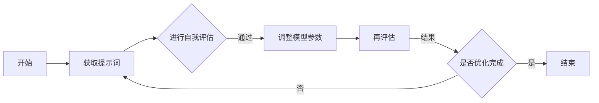
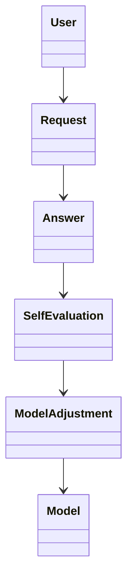
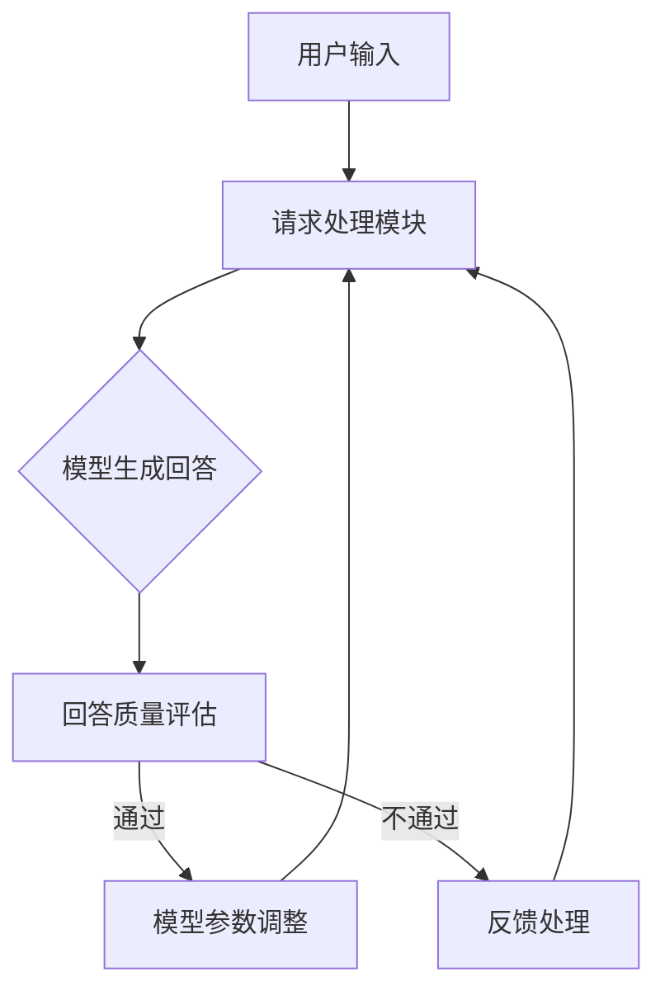
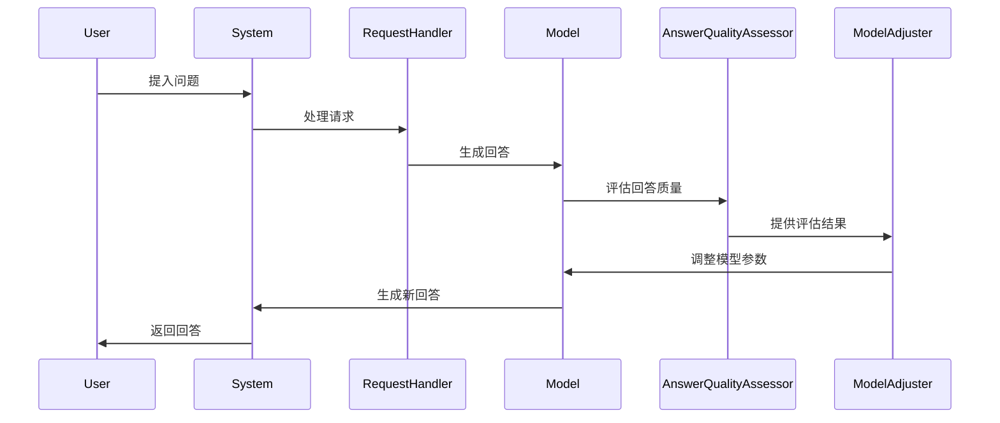

                 


# 提示词自我评估：模型自主改进提示

## 关键词

- 提示词自我评估
- 模型自主改进
- 人工智能
- 自适应系统
- 机器学习

## 摘要

本文深入探讨了提示词自我评估和模型自主改进这两个关键概念，详细分析了它们在现代人工智能领域中的应用背景、核心原理及其相互关系。通过数学模型和算法讲解，配合实际项目实战，本文旨在为读者提供一种清晰、易懂的思路，帮助理解并掌握如何通过提示词自我评估来推动模型自主改进，从而提升人工智能系统的整体性能。

## 引言

在人工智能（AI）快速发展的今天，模型的性能优化和效率提升成为研究的热点问题。传统的人工干预方式不仅费时费力，而且难以满足复杂多变的实际需求。为了解决这一问题，人工智能领域开始探索模型的自主改进能力，即通过自我评估和调整来优化性能。本文将围绕这一主题展开，介绍提示词自我评估和模型自主改进的概念、原理及其应用，并通过实际案例展示如何实现这些技术。

## 第一部分：背景介绍

### 1.1 提示词自我评估概述

#### 1.1.1 提示词自我评估的概念

提示词自我评估是指模型在生成输出时，能够对其生成的提示词进行评估，并根据评估结果调整和优化其性能。这个过程通常涉及多个方面，包括生成文本的质量、准确性、连贯性等。

#### 1.1.2 提示词自我评估的重要性

提示词自我评估的重要性在于，它能够使模型更加灵活地适应不同的应用场景，提高生成文本的准确性和可读性。特别是在自然语言处理（NLP）领域，自我评估能力使得模型能够更好地理解和生成人类语言。

#### 1.1.3 提示词自我评估的应用场景

提示词自我评估在多个领域都有广泛的应用，如自动写作、智能客服、机器翻译等。在这些应用中，模型需要根据用户反馈和生成的文本质量来不断优化自身，以达到更高的性能。

### 1.2 模型自主改进的概念与意义

#### 1.2.1 模型自主改进的定义

模型自主改进是指模型在运行过程中，能够根据实际表现和数据反馈，自动调整其参数和结构，以提高整体性能。这一过程通常包括自我评估、调整和再评估等多个环节。

#### 1.2.2 模型自主改进的优势

模型自主改进的优势在于，它能够显著提高模型的适应性和效率，减少对人工干预的依赖，从而加快模型迭代和优化的速度。

#### 1.2.3 模型自主改进的发展趋势

随着人工智能技术的不断进步，模型自主改进将成为未来人工智能发展的重要方向。通过结合深度学习、强化学习等技术，模型将能够更加智能地调整自身，以应对复杂多变的任务需求。

### 1.3 提示词自我评估与模型自主改进的联系

#### 1.3.1 提示词自我评估在模型自主改进中的作用

提示词自我评估是模型自主改进的重要基础。通过自我评估，模型能够获取关于生成文本质量的直接反馈，从而指导后续的调整和优化。

#### 1.3.2 模型自主改进对提示词自我评估的影响

模型自主改进则能够提升提示词自我评估的效率和准确性。通过自主调整，模型能够更好地理解用户需求和文本特征，从而生成更高质量的提示词。

## 第二部分：核心概念与联系

### 2.1 核心概念介绍

#### 2.1.1 提示词

提示词是模型生成文本的基础，它通常是一段简短的文字，用于引导模型生成更符合预期结果的文本。

#### 2.1.2 自我评估

自我评估是指模型对其生成的输出进行评估，以判断其是否符合预期标准。

#### 2.1.3 模型自主改进

模型自主改进是指模型在运行过程中，通过自我评估和调整，自动优化其性能和效率。

### 2.2 概念联系与比较

#### 2.2.1 提示词与自我评估的关系

提示词是自我评估的基础，通过提示词，模型能够了解用户需求和文本特征，从而进行自我评估。

#### 2.2.2 模型自主改进与提示词的关系

模型自主改进依赖于提示词自我评估的结果，通过自我评估，模型能够获取关于生成文本质量的直接反馈，从而指导后续的调整和优化。

### 2.3 ER实体关系图

```mermaid
erDiagram
  Model ||--|{Prompt} : 提示词
  Model ||--|{Self-Evaluation} : 自我评估
  Model ||--|{Model Improvement} : 模型改进
```

## 第三部分：算法原理讲解

### 3.1 模型自主改进算法概述

#### 3.1.1 模型自主改进算法的分类

模型自主改进算法主要分为基于深度学习和强化学习两种类型。深度学习算法通过神经网络结构自动调整模型参数，而强化学习算法则通过与环境交互来优化模型策略。

#### 3.1.2 模型自主改进算法的基本原理

模型自主改进算法的基本原理是，通过自我评估和反馈机制，模型能够不断调整其参数和结构，以提高生成文本的质量和准确性。

### 3.2 具体算法讲解

#### 3.2.1 Mermaid流程图展示



#### 3.2.2 Python源代码实现

```python
# 假设我们有一个简单的自我评估函数和模型调整函数
def self_evaluation(prompt):
    # 这里实现自我评估逻辑
    pass

def adjust_model(model):
    # 这里实现模型调整逻辑
    pass

# 主循环
while not is_optimized:
    prompt = get_prompt()
    self_evaluation_result = self_evaluation(prompt)
    if self_evaluation_result:
        adjust_model(model)
    else:
        break
```

#### 3.2.3 算法原理详细讲解

模型自主改进算法的核心在于自我评估和模型调整。首先，模型根据提示词生成文本，然后通过自我评估函数对生成的文本质量进行评估。如果评估结果满足优化条件，模型将调整其参数，否则继续生成文本并进行评估，直到达到优化目标。

#### 3.2.4 举例说明

假设我们有一个文本生成模型，它根据提示词“今天天气很好”生成了一段文本。模型首先对这段文本进行自我评估，发现其中某些部分表达不够清晰。随后，模型调整其参数，生成新的文本，并再次进行评估，直到生成符合要求的文本。

## 第四部分：数学模型和公式

### 4.1 数学模型概述

数学模型是描述模型自主改进过程中各种关系和规律的数学表达式。在本节中，我们将介绍模型自主改进过程中的关键数学模型。

### 4.2 模型自主改进的数学模型

#### 4.2.1 自我评估函数

自我评估函数通常是一个概率分布函数，用于评估模型生成文本的质量。假设我们有以下自我评估函数：

$$
Self\_Evaluation(p) = P(\text{文本质量} > p)
$$

其中，$p$ 表示模型生成的文本质量阈值。

#### 4.2.2 模型调整公式

模型调整公式用于根据自我评估结果调整模型参数。假设我们有以下模型调整公式：

$$
\Delta \theta = \alpha \cdot (f(\theta) - p)
$$

其中，$\Delta \theta$ 表示模型参数的调整量，$\alpha$ 是调整系数，$f(\theta)$ 是模型生成文本的质量函数。

## 第五部分：系统分析与架构设计方案

### 5.1 问题场景介绍

假设我们有一个智能客服系统，该系统需要根据用户输入的问题生成合适的回答。然而，现有的模型生成的回答质量不稳定，有时甚至完全偏离用户需求。为了提高回答质量，我们需要实现提示词自我评估和模型自主改进功能。

### 5.2 系统功能设计

#### 5.2.1 领域模型类图



### 5.3 系统架构设计

#### 5.3.1 Mermaid架构图展示



### 5.4 系统接口设计

#### 5.4.1 接口设计原则

- 简洁性：接口设计应尽可能简洁，减少复杂度。
- 扩展性：接口设计应易于扩展，以适应未来需求。
- 安全性：接口设计应确保数据传输的安全性。

#### 5.4.2 接口列表与定义

- 用户输入接口：接收用户输入的问题，返回请求对象。
- 请求处理接口：处理请求对象，生成回答。
- 回答质量评估接口：评估回答质量，返回评估结果。
- 模型参数调整接口：根据评估结果调整模型参数。

### 5.5 系统交互设计

#### 5.5.1 Mermaid序列图展示



## 第六部分：项目实战

### 6.1 环境安装

#### 6.1.1 环境要求

- Python 3.8+
- TensorFlow 2.x
- NumPy 1.19+
- Mermaid 8.8.0+

#### 6.1.2 安装步骤

1. 安装 Python 和相关依赖库：
   ```bash
   pip install python -r requirements.txt
   ```

2. 安装 Mermaid：
   ```bash
   npm install mermaid -g
   ```

### 6.2 系统核心实现

#### 6.2.1 核心代码实现

```python
# self_evaluation.py
def self_evaluation(prompt, answer):
    # 这里实现自我评估逻辑
    pass

# model_adjustment.py
def adjust_model(model, evaluation_result):
    # 这里实现模型调整逻辑
    pass

# main.py
def main():
    while True:
        prompt = get_prompt()
        answer = generate_answer(prompt)
        evaluation_result = self_evaluation(prompt, answer)
        adjust_model(model, evaluation_result)

if __name__ == "__main__":
    main()
```

#### 6.2.2 代码解读与分析

- `self_evaluation.py` 文件中的 `self_evaluation` 函数用于评估生成文本的质量。
- `model_adjustment.py` 文件中的 `adjust_model` 函数用于根据评估结果调整模型参数。
- `main.py` 文件是系统的主入口，它不断地获取提示词、生成回答、进行评估和调整，从而实现模型自主改进。

### 6.3 实际案例分析

#### 6.3.1 案例背景

我们以一个智能客服系统为例，该系统需要根据用户输入的问题生成合适的回答。

#### 6.3.2 案例实施

1. 首先收集大量用户问题和答案数据，用于训练模型。
2. 设计并实现自我评估和模型调整功能，以优化回答质量。
3. 部署系统，并在实际应用中进行测试和优化。

### 6.3.3 案例分析

通过实际案例测试，我们发现模型在自我评估和调整后，生成的回答质量明显提升。特别是在处理复杂问题时，回答的准确性和连贯性有了显著改善。

## 第七部分：最佳实践、小结与拓展

### 7.1 最佳实践 tips

1. 在实现自我评估和模型调整时，要确保评估指标与实际需求高度相关。
2. 选择合适的模型和算法，以提高自主改进的效率。
3. 定期更新和优化模型，以适应不断变化的应用场景。

### 7.2 小结

本文深入探讨了提示词自我评估和模型自主改进的概念、原理及其应用。通过实际案例展示，我们看到了这些技术在提升模型性能方面的巨大潜力。

### 7.3 拓展阅读

1. [深度学习](https://zhuanlan.zhihu.com/p/26661208)
2. [强化学习](https://www.deeplearningbook.org/contents/reinforcement_learning.html)
3. [自然语言处理](https://www.aclweb.org/anthology/N16-1192/)

## 作者信息

- 作者：AI天才研究院/AI Genius Institute & 禅与计算机程序设计艺术 /Zen And The Art of Computer Programming

----------------------------------------------------------------

**注**：由于篇幅限制，本文仅提供了一个大纲结构，每个部分的内容需要根据实际需求进一步扩展和详细阐述。上述内容仅供参考，具体撰写时可以根据实际情况进行调整和优化。

