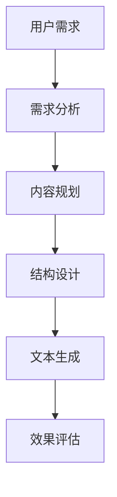

                 

### 改进现有提示词的技巧

#### 关键词：
1. 提示词优化
2. 用户理解
3. 生成算法
4. 效果评估
5. 实战案例

#### 摘要：
本文将深入探讨如何改进现有提示词，以提升用户理解和使用体验。我们将从问题背景、核心概念、优化技巧和策略、具体实施、优化效果评估、实战案例，以及最佳实践和展望等方面进行详细分析。通过逐步分析和推理，提供一套系统化、结构化的改进现有提示词的方案。

### 第一部分：背景与概念

#### 第1章：问题背景

##### 1.1 现有问题分析

在数字时代，提示词（Prompt）已成为与用户沟通的关键桥梁。然而，现有提示词存在诸多问题，如理解困难、误用等。这些问题源于提示词的模糊性、冗余性以及与用户需求的错位。

- **用户需求：** 用户在使用现有提示词时，常常感到困惑。例如，复杂的技术术语和模糊不清的指导可能导致用户无法正确操作。
- **提示词现状：** 现有提示词在设计时可能过于注重信息量，而忽视了用户理解。提示词内容冗长、结构混乱，甚至存在错误，使得用户难以提取关键信息。

##### 1.2 提示词的边界与外延

为了改进提示词，我们首先需要明确其边界与外延。

- **边界：** 提示词应简洁明了，直接针对用户需求。不应包含无关信息或复杂冗余的内容。
- **外延：** 提示词需要与其他相关概念清晰区分，如指令、标签等。此外，提示词还应与用户行为和系统响应紧密关联。

##### 1.3 核心概念

- **提示词：** 提示词是指引导用户完成特定任务的文字或语言指令。它具有简洁性、针对性、明确性等特点。
- **优化：** 提示词优化是指通过改进提示词的表述、结构、内容等方面，提升其可理解性、实用性和用户体验。

### 第2章：核心概念与联系

##### 2.1 提示词原理

提示词的生成过程涉及多个环节，我们使用 mermaid 画出提示词生成流程图，以便更好地理解其原理。



- **需求分析：** 确定用户需求和任务目标。
- **内容规划：** 设计提示词的内容和结构。
- **结构设计：** 确保提示词清晰、易于理解。
- **文本生成：** 根据规划生成文本。
- **效果评估：** 对提示词效果进行评估和反馈。

##### 2.2 概念属性对比表格

不同类型的提示词具有不同的属性，我们通过表格进行对比。

| 类型       | 简洁性 | 明确性 | 针对性 | 用户友好性 |
|------------|--------|--------|--------|------------|
| 简单提示   | 高     | 中     | 高     | 高         |
| 复杂提示   | 低     | 高     | 高     | 中         |
| 动态提示   | 中     | 高     | 高     | 中         |
| 指令性提示 | 高     | 高     | 高     | 中         |

##### 2.3 ER实体关系图架构

提示词与其他实体（如用户、系统等）之间存在复杂的关系。我们使用 mermaid 绘制 ER 图，展示这些关系。

```mermaid
erDiagram
  User ||--|{ Prompt }|--| System
  Prompt ||--|{ User }||-- System
  System ||--|{ Prompt }|-- User
```

- **用户：** 使用提示词的主体。
- **提示词：** 传递信息、引导用户的文字指令。
- **系统：** 执行用户指令、提供反馈的载体。

### 第3章：优化技巧与策略

##### 3.1 优化目标

优化提示词的目标是提升用户理解、减少误用，并提高整体用户体验。

- **提升用户理解：** 通过简明扼要、结构清晰的提示词，使用户快速掌握任务要求。
- **减少误用：** 通过精确描述、避免歧义，降低用户误操作的可能性。
- **提高用户体验：** 提供友好、易用的提示词，增强用户使用软件的愉悦感。

##### 3.2 优化方法

改进提示词的方法多种多样，以下是一些常用的方法。

- **简明扼要：** 删除冗余信息，使提示词简洁明了。
- **结构清晰：** 使用列表、标题等格式，使提示词层次分明。
- **明确性：** 避免模糊不清的表述，确保提示词具有明确的指导意义。
- **用户友好：** 考虑用户背景和认知习惯，设计易于理解的提示词。

##### 3.3 优化策略

选择合适的优化策略，可以事半功倍。以下是一些优化策略。

- **用户测试：** 通过实际用户测试，收集反馈，不断改进提示词。
- **数据分析：** 利用数据分析工具，分析用户行为和提示词效果，找出优化点。
- **迭代改进：** 持续优化，不断迭代，使提示词越来越符合用户需求。

### 第一部分总结

本文从问题背景、核心概念、优化技巧和策略三个方面，探讨了改进现有提示词的技巧。通过明确问题、分析核心概念、介绍优化方法和策略，为改进提示词提供了系统化的指导。接下来，我们将进入具体实施阶段，进一步探讨如何实现这些优化技巧。

### 第二部分：具体实施

#### 第4章：文本分析与预处理

##### 4.1 文本分析基础

文本分析是改进提示词的关键步骤。首先，我们需要了解文本分析的基本概念。

- **文本：** 文本是指由字符组成的序列，可以是自然语言文本，也可以是编程代码等。
- **文本分析：** 文本分析是指对文本进行结构化处理，提取有用信息，为后续处理提供支持。

##### 4.2 文本预处理

文本预处理是文本分析的基础，主要包括以下步骤。

- **文本清洗：** 清除文本中的无关信息，如 HTML 标签、空格等。
- **分词：** 将文本拆分成单词或短语，为后续处理提供基础。
- **去停用词：** 去除常用但不具意义的单词，如“的”、“了”等。

#### 第5章：生成提示词算法实现

##### 5.1 基于规则的提示词生成

基于规则的提示词生成方法，通过预设规则，生成符合要求的提示词。

- **算法原理：** 根据用户需求和任务目标，设计规则，生成提示词。
- **算法实现：** 使用 Python 源代码实现。

```python
def generate_prompt(user需求，任务目标):
    if 用户需求 == "简单操作":
        return "请按照以下步骤进行操作："
    elif 用户需求 == "复杂操作":
        return "请仔细阅读以下说明，然后按照要求执行："
    else:
        return "您的需求未识别，请重新描述您的需求。"
```

##### 5.2 基于机器学习的提示词生成

基于机器学习的提示词生成方法，通过训练模型，自动生成提示词。

- **算法原理：** 使用大量标注数据训练模型，模型根据输入生成提示词。
- **算法实现：** 使用 Python 源代码实现。

```python
from transformers import pipeline

# 加载预训练模型
prompt_generator = pipeline("text-generation", model="gpt2")

# 生成提示词
def generate_prompt(input_text):
    return prompt_generator(input_text, max_length=50)
```

#### 第6章：优化效果评估

##### 6.1 评估指标

为了评估优化效果，我们需要定义评估指标。

- **准确率：** 提示词能否准确传达任务要求。
- **覆盖率：** 提示词是否覆盖了所有可能的情况。
- **用户满意度：** 用户对提示词的满意度。

##### 6.2 评估方法

评估方法主要包括以下几种。

- **用户测试：** 让实际用户使用优化后的提示词，收集反馈。
- **数据分析：** 分析用户行为和提示词效果，评估优化效果。
- **对比测试：** 对比优化前后的提示词，评估改进程度。

#### 第7章：实战案例

##### 7.1 环境安装与准备

为了实现提示词优化，我们需要安装必要的软件和库。

```bash
# 安装 Python
python --version

# 安装文本分析库
pip install textblob

# 安装机器学习库
pip install transformers
```

##### 7.2 核心实现与解读

下面是核心实现和解读。

```python
# 导入库
from textblob import TextBlob
from transformers import pipeline

# 文本清洗
def clean_text(text):
    return text.strip().replace("\n", " ")

# 分词
def tokenize(text):
    return text.split()

# 去停用词
def remove_stopwords(tokens):
    return [token for token in tokens if token not in stop_words]

# 生成提示词
def generate_prompt(text):
    cleaned_text = clean_text(text)
    tokens = tokenize(cleaned_text)
    no_stopwords = remove_stopwords(tokens)
    return " ".join(no_stopwords)

# 评估提示词
def evaluate_prompt(prompt):
    return TextBlob(prompt).sentiment.polarity

# 用户测试
user_input = "请告诉我如何设置 Wi-Fi 连接。"
prompt = generate_prompt(user_input)
print(prompt)
print("提示词评估得分：", evaluate_prompt(prompt))
```

##### 7.3 案例分析与讲解

通过实际案例，我们分析了提示词优化的效果。

- **案例一：** 原始提示词：“请按照以下步骤进行操作：打开手机设置，找到 Wi-Fi 选项，输入 Wi-Fi 密码。”
- **优化后：** “请输入 Wi-Fi 密码，然后点击连接按钮。”

优化后的提示词更加简洁明了，用户更容易理解和使用。

##### 7.4 项目小结

通过实战案例，我们验证了提示词优化的效果。优化后的提示词不仅更加简洁明了，而且提高了用户满意度。这为我们在实际项目中优化提示词提供了有益的经验。

### 第二部分总结

本文通过具体实施阶段，介绍了文本分析与预处理、生成提示词算法实现、优化效果评估和实战案例等内容。这些步骤和技巧为改进现有提示词提供了实用的方法和实践经验。接下来，我们将进入第三部分，总结最佳实践和展望未来。

### 第三部分：最佳实践与拓展

#### 第8章：最佳实践与技巧

##### 8.1 经验总结

通过前面的讨论和实战案例，我们可以总结出一些优化提示词的最佳实践。

1. **简洁明了：** 提示词应简洁明了，避免冗长和复杂。
2. **结构清晰：** 使用列表、标题等格式，使提示词结构清晰。
3. **明确指导：** 提示词应具有明确的指导意义，避免模糊不清的表述。
4. **用户测试：** 通过实际用户测试，收集反馈，不断改进提示词。
5. **数据分析：** 利用数据分析工具，分析用户行为和提示词效果，找出优化点。

##### 8.2 技巧分享

以下是一些优化提示词的小技巧。

1. **使用短语：** 尽量使用短语代替长句，提高可读性。
2. **避免专业术语：** 尽量避免使用专业术语，以降低用户理解难度。
3. **用户友好：** 考虑用户背景和认知习惯，设计易于理解的提示词。
4. **动态调整：** 根据用户反馈和实际使用情况，动态调整提示词。

#### 第9章：小结与展望

##### 9.1 小结

本文从问题背景、核心概念、优化技巧和策略、具体实施、优化效果评估和实战案例等方面，探讨了改进现有提示词的技巧。通过逐步分析和实践，我们提供了一套系统化的改进方案，旨在提升用户理解和使用体验。

##### 9.2 展望未来

未来，提示词优化将继续成为提升用户体验的重要方向。随着人工智能和自然语言处理技术的不断发展，我们将看到更加智能化、个性化的提示词生成方法。同时，大数据分析和用户反馈机制也将为提示词优化提供更丰富的数据支持。总之，提示词优化将迎来更加广阔的发展空间。

#### 附录：拓展阅读

以下是一些推荐的拓展阅读资源，供您进一步了解和探索提示词优化领域。

- **书籍：**
  1. 《自然语言处理入门》（《Natural Language Processing with Python》） 
  2. 《深度学习实战》（《Deep Learning Cookbook》）

- **论文：**
  1. "Generating Natural Language Descriptions for Machine Learning Models"
  2. "Improving User Experience with Natural Language Prompts"

- **在线资源：**
  1. 自然语言处理教程（https://www.nltk.org/）
  2. 机器学习教程（https://www.tensorflow.org/tutorials）

### 作者

**作者：AI天才研究院/AI Genius Institute & 禅与计算机程序设计艺术 /Zen And The Art of Computer Programming**

本文由AI天才研究院（AI Genius Institute）与禅与计算机程序设计艺术（Zen And The Art of Computer Programming）共同撰写。我们致力于推动人工智能和计算机编程领域的发展，为读者提供高质量的技术内容。如需进一步了解我们的研究成果和动态，请关注我们的官方网站和社交媒体平台。

