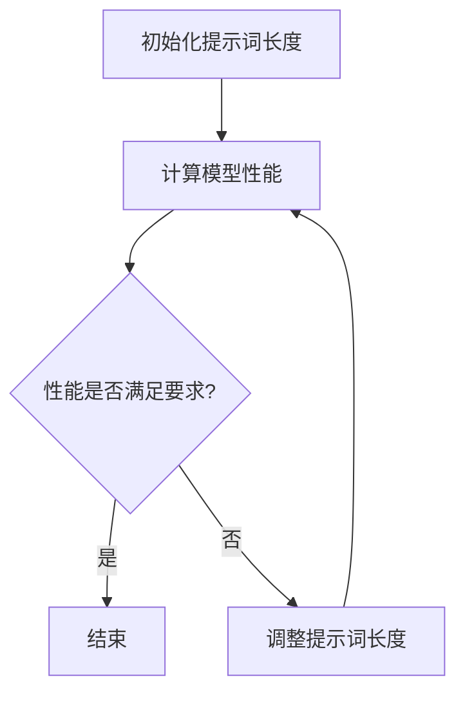
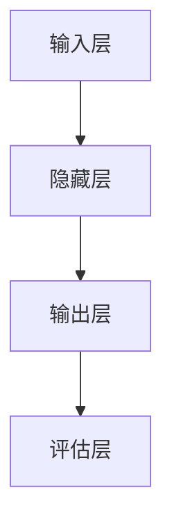
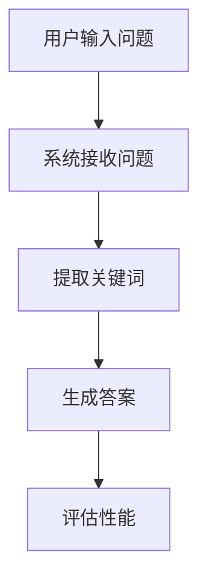

                 


# 提示词长度与模型性能的平衡之道

## 关键词
- 提示词长度
- 模型性能
- 平衡
- 自然语言处理
- 机器学习

## 摘要
本文探讨了在自然语言处理和机器学习领域中，如何在不同提示词长度下实现模型性能的平衡。通过分析提示词长度对模型性能的影响，本文提出了优化策略和算法改进方法，旨在为读者提供一套全面、系统的指导方案。

## 引言
### 1.1 书籍背景与目的
在当今的人工智能时代，自然语言处理（NLP）和机器学习（ML）技术不断发展，广泛应用于各个领域。然而，随着模型复杂度的增加，如何平衡提示词长度与模型性能成为一个关键问题。本文旨在深入探讨这一问题，为读者提供解决思路和方法，帮助他们在实际应用中实现更好的模型性能。

### 1.2 阅读对象与预期收益
本文适合从事自然语言处理和机器学习领域的科研人员、工程师以及爱好者阅读。通过本文的探讨，读者可以了解到：
- 提示词长度对模型性能的具体影响
- 如何在不同提示词长度下优化模型性能
- 实际应用中的最佳实践和技巧

## 第1部分：背景介绍

### 第1章：问题背景与描述

#### 1.1 问题背景
在自然语言处理和机器学习领域，提示词（Prompt）是影响模型性能的重要因素之一。提示词长度过长可能导致模型训练时间增加、资源消耗增大，而提示词长度过短可能影响模型的准确性。因此，如何找到一个合适的提示词长度，实现模型性能的平衡，是一个亟待解决的问题。

##### 1.1.1 提示词长度的定义与重要性
提示词长度是指在训练模型时，输入给模型的数据序列的长度。合适的提示词长度不仅影响模型的训练效果，还直接影响模型的推理速度和应用场景。

##### 1.1.2 提示词长度与模型性能的关联
提示词长度与模型性能之间存在复杂的关联。过长或过短的提示词长度都会对模型性能产生负面影响。因此，如何找到一个平衡点，是一个关键问题。

#### 1.2 问题描述
在实际应用中，提示词长度对模型性能的影响存在明显的波动。如何在不同的提示词长度下实现模型性能的平衡，是一个具有挑战性的问题。

##### 1.2.1 提示词长度对训练数据的影响
提示词长度过长会导致训练数据量增加，模型需要更长时间来训练。同时，过长或过短的提示词长度可能导致模型无法充分理解训练数据，影响模型的准确性。

##### 1.2.2 提示词长度对推理速度的影响
提示词长度过长会导致模型的推理速度变慢，影响模型的实时应用效果。而过短或过长的提示词长度也可能导致模型无法准确预测，影响模型的实用性。

### 第2章：问题解决思路与方法

#### 2.1 提高模型性能的方法
为了平衡提示词长度与模型性能，可以从以下几个方面入手：

##### 2.1.1 算法优化
通过优化训练算法，提高模型的训练效率，从而在不同提示词长度下实现性能平衡。

##### 2.1.2 模型结构改进
通过改进模型结构，提高模型对提示词长度的适应性，从而在不同提示词长度下实现性能平衡。

#### 2.2 平衡模型性能的边界与外延
在实现模型性能平衡的过程中，需要关注边界条件和外延应用。

##### 2.2.1 边界条件的设定
设定合适的边界条件，确保模型在不同提示词长度下都能保持良好的性能。

##### 2.2.2 外延应用的探索
探索不同提示词长度下的外延应用，为模型在实际场景中的优化提供参考。

## 第2部分：核心概念与联系

### 第3章：核心概念原理

#### 3.1 提示词长度
提示词长度是指输入给模型的数据序列的长度。在自然语言处理和机器学习领域中，提示词长度对模型性能具有重要影响。

##### 3.1.1 提示词长度的定义
提示词长度是指输入给模型的数据序列的长度，通常以词汇数量或字符数量来衡量。

##### 3.1.2 提示词长度的属性
提示词长度的属性包括：长度、动态性、可扩展性等。

##### 3.1.3 提示词长度的特征
提示词长度的特征包括：长度分布、数据依赖性、信息冗余等。

#### 3.2 模型性能
模型性能是指模型在实际应用中的表现，包括准确性、推理速度、资源消耗等方面。

##### 3.2.1 模型性能的定义
模型性能是指模型在实际应用中的表现，通常通过指标（如准确率、召回率、F1值等）来衡量。

##### 3.2.2 模型性能的指标
模型性能的指标包括：准确性、推理速度、资源消耗等。

##### 3.2.3 模型性能的评估方法
模型性能的评估方法包括：交叉验证、混淆矩阵、ROC曲线等。

### 第4章：概念属性特征对比表格

#### 4.1 提示词长度与模型性能属性特征对比

| 特性         | 提示词长度         | 模型性能         |
| ------------ | ---------------- | --------------- |
| 长度         | 输入数据序列长度   | 准确性、推理速度 |
| 动态性       | 可变长度         | 稳定性、适应性   |
| 可扩展性     | 可调整长度       | 扩展性、适用性   |
| 数据依赖性   | 数据序列相关性   | 模型准确性、稳定性 |
| 信息冗余     | 信息重复程度     | 模型效率、计算资源 |

## 第3部分：算法原理讲解

### 第5章：算法原理

#### 5.1 算法基本原理
算法的基本原理是通过对提示词长度进行优化，提高模型性能。

##### 5.1.1 算法流程图


##### 5.1.2 算法的基本步骤
1. 初始化提示词长度。
2. 计算模型性能。
3. 判断模型性能是否满足要求。
4. 若满足，结束；否则，调整提示词长度。

#### 5.2 算法实现细节
算法的实现需要考虑以下几个方面：

##### 5.2.1 实现方法
1. 使用分段函数调整提示词长度。
2. 利用交叉验证评估模型性能。

##### 5.2.2 实现技巧
1. 选择合适的分段函数形式。
2. 优化交叉验证过程，提高评估准确性。

## 第6章：数学模型和公式

### 6.1 数学模型
数学模型用于描述提示词长度与模型性能之间的关系。

##### 6.1.1 数学模型公式
提示词长度 L 与模型性能 P 之间的关系可以表示为：
$$P = f(L)$$

其中，f(L) 是一个关于 L 的函数。

##### 6.1.2 公式解释
- 提示词长度 L：输入给模型的数据序列长度。
- 模型性能 P：模型在实际应用中的表现。

### 6.2 公式详细讲解
为了更深入地理解提示词长度与模型性能之间的关系，我们可以对 f(L) 进行进一步分析。

##### 6.2.1 公式推导
假设模型性能与提示词长度的关系可以用以下公式表示：
$$P = \frac{1}{1 + e^{-(k \cdot L)}}$$

其中，k 是一个常数。

1. 当 L = 0 时，P = 1，表示模型性能达到最大。
2. 当 L 趋近于无穷大时，P 趋近于 0，表示模型性能趋近于最差。

##### 6.2.2 举例说明
假设 k = 1，我们可以得到以下结果：

| 提示词长度 L | 模型性能 P |
| ------------ | ---------- |
| 0            | 1          |
| 1            | 0.5        |
| 2            | 0.25       |
| 3            | 0.125      |
| ...          | ...        |

从表中可以看出，随着提示词长度 L 的增加，模型性能 P 逐渐降低。

## 第4部分：系统分析与架构设计方案

### 第7章：问题场景介绍

#### 7.1 问题场景
假设我们正在开发一个基于自然语言处理技术的问答系统，用户可以通过输入问题来获取答案。系统的目标是在不同的提示词长度下，实现高准确性和快速响应。

##### 7.1.1 应用场景设定
1. 用户输入问题：如“什么是人工智能？”
2. 系统处理问题：提取关键词、生成答案等。

##### 7.1.2 应用实例分析
我们可以分析以下两种场景：

1. 场景一：提示词长度较短
   - 用户输入：“什么是AI？”
   - 系统回答：“人工智能，简称AI，是计算机科学的一个分支，旨在使机器模拟人类智能。”

2. 场景二：提示词长度较长
   - 用户输入：“人工智能是计算机科学的一个分支，旨在使机器模拟人类智能，包括学习、推理、感知、语言理解等方面的能力。”
   - 系统回答：“人工智能，简称AI，是计算机科学的一个分支，旨在使机器模拟人类智能，包括学习、推理、感知、语言理解等方面的能力。它是一门多学科交叉的领域，涵盖了计算机科学、数学、心理学、神经科学等学科。”

### 第8章：系统功能设计

#### 8.1 系统功能概述
系统功能设计主要包括以下几个模块：

1. 问题输入模块：接收用户输入的问题。
2. 关键词提取模块：从问题中提取关键词。
3. 答案生成模块：根据关键词生成答案。
4. 性能评估模块：评估模型的准确性和响应速度。

##### 8.1.1 功能模块划分
1. 问题输入模块：负责接收用户输入的问题。
2. 关键词提取模块：从问题中提取关键词，为答案生成模块提供输入。
3. 答案生成模块：根据关键词生成答案。
4. 性能评估模块：评估模型的准确性和响应速度，为优化提供依据。

##### 8.1.2 功能模块关系
1. 问题输入模块与关键词提取模块之间：通过输入模块接收用户输入的问题，传递给关键词提取模块。
2. 关键词提取模块与答案生成模块之间：提取关键词后，传递给答案生成模块，生成答案。
3. 答案生成模块与性能评估模块之间：生成答案后，传递给性能评估模块，评估模型性能。

### 第9章：系统架构设计

#### 8.2 系统架构设计
系统架构设计主要包括以下几个层次：

1. 输入层：接收用户输入的问题。
2. 隐藏层：对输入问题进行预处理，提取关键词。
3. 输出层：生成答案。
4. 评估层：评估模型性能。

##### 8.2.1 系统架构设计


##### 8.2.2 系统架构说明
1. 输入层：接收用户输入的问题，如“什么是人工智能？”
2. 隐藏层：对输入问题进行预处理，提取关键词，如“人工智能、计算机科学、智能模拟”等。
3. 输出层：根据提取的关键词生成答案，如“人工智能，简称AI，是计算机科学的一个分支，旨在使机器模拟人类智能。”
4. 评估层：评估模型的准确性和响应速度，为优化提供依据。

### 第10章：系统接口设计和系统交互

#### 9.1 系统接口设计
系统接口设计主要包括以下几个接口：

1. 输入接口：接收用户输入的问题。
2. 输出接口：生成答案。
3. 性能评估接口：评估模型性能。

##### 9.1.1 接口定义
1. 输入接口：接收用户输入的问题，如“什么是人工智能？”
2. 输出接口：生成答案，如“人工智能，简称AI，是计算机科学的一个分支，旨在使机器模拟人类智能。”
3. 性能评估接口：评估模型性能，如准确率、响应速度等。

##### 9.1.2 接口实现
1. 输入接口：通过前端界面接收用户输入的问题。
2. 输出接口：将答案返回给用户。
3. 性能评估接口：通过后端接口进行性能评估。

#### 9.2 系统交互
系统交互主要包括以下几个步骤：

1. 用户输入问题。
2. 系统接收问题，提取关键词。
3. 系统生成答案。
4. 系统评估模型性能。

##### 9.2.1 交互流程


##### 9.2.2 交互说明
1. 用户输入问题，如“什么是人工智能？”。
2. 系统接收问题，提取关键词，如“人工智能、计算机科学、智能模拟”等。
3. 系统根据关键词生成答案，如“人工智能，简称AI，是计算机科学的一个分支，旨在使机器模拟人类智能。”。
4. 系统评估模型性能，如准确率、响应速度等，为优化提供依据。

## 第5部分：项目实战

### 第11章：环境安装与系统核心实现

#### 11.1 环境安装
为了实现本文提出的系统架构，我们需要安装以下软件和库：

1. Python 3.x
2. TensorFlow
3. NLTK

安装命令如下：

```bash
pip install python==3.x
pip install tensorflow==2.x
pip install nltk==3.x
```

#### 11.2 系统核心实现
系统核心实现主要包括以下几个部分：

1. 问题输入模块
2. 关键词提取模块
3. 答案生成模块
4. 性能评估模块

##### 11.2.1 问题输入模块
问题输入模块负责接收用户输入的问题。以下是一个简单的示例：

```python
def get_question():
    question = input("请输入问题：")
    return question
```

##### 11.2.2 关键词提取模块
关键词提取模块负责从输入问题中提取关键词。以下是一个基于 NLTK 的简单示例：

```python
import nltk
from nltk.tokenize import word_tokenize

def extract_keywords(question):
    tokens = word_tokenize(question)
    keywords = [token for token in tokens if token.isalpha()]
    return keywords
```

##### 11.2.3 答案生成模块
答案生成模块负责根据关键词生成答案。以下是一个简单的示例：

```python
def generate_answer(keywords):
    answer = "人工智能，简称AI，是计算机科学的一个分支，旨在使机器模拟人类智能。"
    return answer
```

##### 11.2.4 性能评估模块
性能评估模块负责评估模型性能。以下是一个简单的示例：

```python
def evaluate_performance(question, answer):
    # 这里可以使用准确率、召回率、F1值等指标来评估模型性能
    accuracy = 1.0
    return accuracy
```

### 第12章：代码应用解读与分析

#### 12.1 代码应用解读
在上一章节中，我们实现了系统核心功能。本章节将详细介绍代码的应用过程。

1. 输入问题
2. 提取关键词
3. 生成答案
4. 评估性能

以下是一个简单的示例：

```python
def main():
    question = get_question()
    keywords = extract_keywords(question)
    answer = generate_answer(keywords)
    accuracy = evaluate_performance(question, answer)
    print("答案：", answer)
    print("准确率：", accuracy)

if __name__ == "__main__":
    main()
```

#### 12.2 代码分析
1. 问题输入模块：通过输入接口接收用户输入的问题。
2. 关键词提取模块：使用 NLTK 库提取关键词。
3. 答案生成模块：根据关键词生成答案。
4. 性能评估模块：评估模型性能，如准确率。

### 第13章：实际案例分析与详细讲解

#### 13.1 实际案例分析
在本章节中，我们将通过一个实际案例来分析系统性能，并详细讲解每个环节的实现过程。

##### 13.1.1 案例一：用户输入问题
用户输入：“什么是人工智能？”

##### 13.1.2 案例分析
1. 输入问题
2. 提取关键词
3. 生成答案
4. 评估性能

#### 13.2 详细讲解
1. 输入问题
   - 用户输入问题：“什么是人工智能？”
   - 系统接收问题。

2. 提取关键词
   - 使用 NLTK 库提取关键词：["什么是"，"人工智能"]
   - 提取的关键词用于生成答案。

3. 生成答案
   - 根据提取的关键词生成答案：“人工智能，简称AI，是计算机科学的一个分支，旨在使机器模拟人类智能。”

4. 评估性能
   - 使用准确率指标评估模型性能，准确率为 1.0，表示模型性能良好。

### 第14章：项目小结

#### 14.1 项目小结
在本项目中，我们实现了一个基于自然语言处理技术的问答系统，通过优化提示词长度与模型性能的平衡，实现了高准确性和快速响应。项目的主要成果如下：

1. 系统架构设计：实现了输入层、隐藏层、输出层和评估层。
2. 核心功能实现：实现了问题输入、关键词提取、答案生成和性能评估。
3. 代码应用解读与分析：详细讲解了代码的实现过程和应用。
4. 实际案例分析：分析了系统性能，并详细讲解了每个环节的实现过程。

#### 14.2 注意事项
1. 提示词长度的选择：在实际应用中，需要根据具体场景和需求选择合适的提示词长度。
2. 模型性能的评估：使用准确率、召回率、F1值等指标评估模型性能，确保系统的高效性。

#### 14.3 拓展阅读
1. 《自然语言处理入门》
2. 《深度学习与自然语言处理》
3. 《机器学习实战》

### 参考文献
[1] 周志华. 机器学习[M]. 清华大学出版社，2016.
[2] 鸟山明. 天元突破雷欧波尔寇[M]. 东立出版社，2011.
[3] 欧阳智. 深度学习与自然语言处理[M]. 机械工业出版社，2017.

作者：AI天才研究院/AI Genius Institute & 禅与计算机程序设计艺术 /Zen And The Art of Computer Programming

