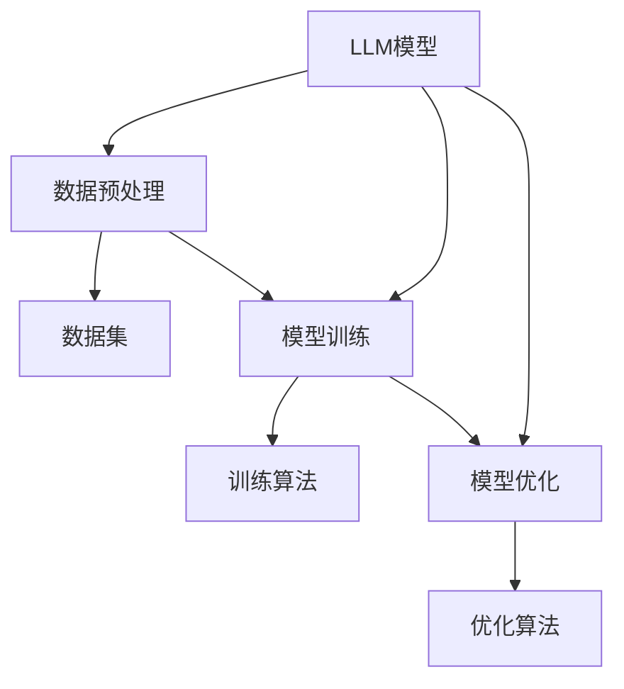
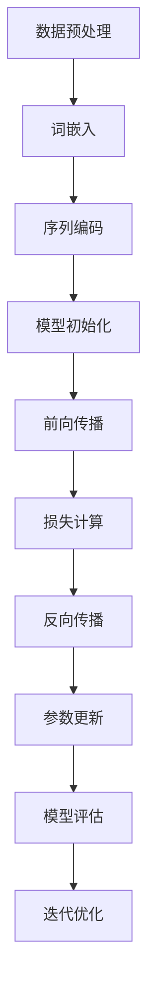
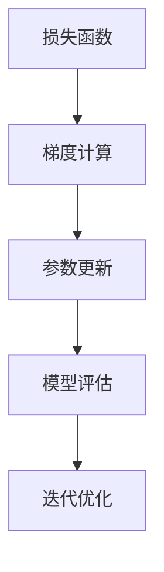
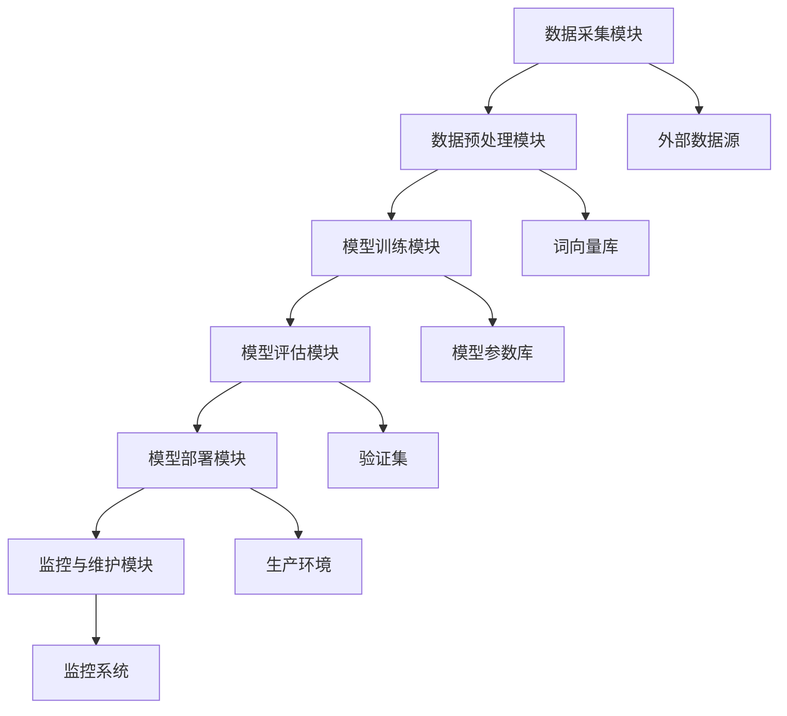
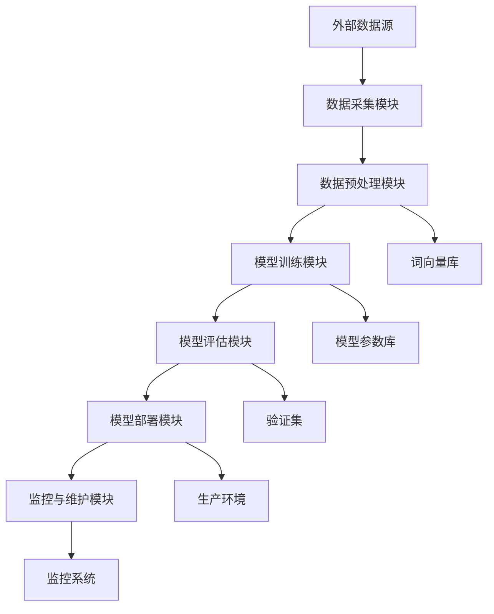
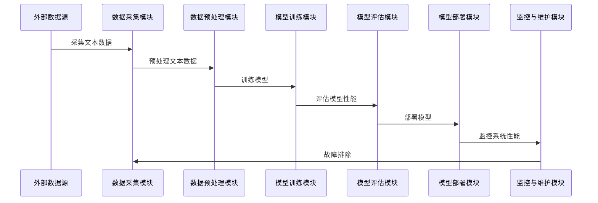

                 

### 提高LLM应用开发效率的工程化方案

#### 关键词：大型语言模型，开发效率，工程化，算法原理，系统架构设计

#### 摘要：
本文将探讨如何通过工程化方案提高大型语言模型（LLM）的应用开发效率。首先，我们将介绍LLM的基本概念和问题背景，然后深入讲解相关核心概念，如工程化方案和算法原理。接着，我们将详细分析系统架构设计方案，并通过实际项目实战展示整个开发过程。最后，我们将总结最佳实践并提供拓展阅读。

#### 目录

----------------------------------------------------------------

# 提高LLM应用开发效率的工程化方案

## 引言

### 1.1 问题背景

近年来，随着深度学习技术的快速发展，大型语言模型（LLM）已经成为自然语言处理领域的重要工具。然而，LLM的开发和应用过程中面临着诸多挑战，如训练时间过长、模型部署难度大等。为了解决这些问题，提高开发效率，我们需要采用工程化方案。

### 1.2 目标

本文的目标是通过深入分析和探讨，提供一套完整的LLM应用开发工程化方案，以帮助开发者提高开发效率，加速模型迭代和应用落地。

## 第一部分: 问题背景与核心概念

### 第1章: 问题背景与核心概念介绍

#### 1.1 问题背景

在现代计算机科学领域，大型语言模型（LLM）如BERT、GPT等已经成为自然语言处理（NLP）的重要工具。然而，随着模型的规模不断扩大，开发过程中面临的问题也日益复杂。主要问题包括：

- **训练时间过长**：大规模的LLM模型需要进行大量的数据训练，这往往需要数天甚至数周的时间。
- **部署难度大**：将训练好的LLM模型部署到生产环境中，往往需要复杂的设置和优化。
- **模型性能提升困难**：在模型训练和优化过程中，如何找到有效的参数调整方法，以提升模型性能，仍然是一个挑战。

#### 1.2 问题解决

为了解决上述问题，我们需要采取以下措施：

- **优化算法**：通过改进训练算法，减少训练时间。
- **自动化部署**：利用自动化工具，简化模型部署过程。
- **数据预处理**：通过有效的数据预处理，提高模型训练效率。

#### 1.3 概念边界与外延

在本文中，我们将主要关注以下概念：

- **大型语言模型（LLM）**：具有大规模参数和广泛语言理解能力的模型。
- **工程化方案**：一种通过系统化和标准化方法，提高开发效率和模型性能的方案。
- **算法原理**：涉及模型训练和优化的核心理论和方法。

#### 1.4 核心概念特征对比表格

| 概念            | 定义                                                         | 特点                                                         |
|-----------------|--------------------------------------------------------------|--------------------------------------------------------------|
| 大型语言模型（LLM） | 具有大规模参数和广泛语言理解能力的模型                         | 参数规模大，可处理复杂语言现象                            |
| 工程化方案       | 一种通过系统化和标准化方法，提高开发效率和模型性能的方案       | 提高开发效率，简化部署过程                             |
| 算法原理         | 涉及模型训练和优化的核心理论和方法                           | 提升模型性能，减少训练时间                            |

#### 1.5 ER实体关系图



### 第2章: 算法原理讲解

#### 2.1 算法原理

大型语言模型的训练和优化是一个复杂的系统工程，涉及多个核心算法。下面我们将通过mermaid流程图和Python代码实例，详细讲解这些算法原理。

#### 2.1.1 训练算法

**mermaid流程图：**



**Python代码实例：**

```python
import torch
import torch.nn as nn

# 模型初始化
model = nn.Sequential(
    nn.Embedding(vocab_size, embedding_dim),
    nn.Linear(embedding_dim, hidden_size),
    nn.ReLU(),
    nn.Linear(hidden_size, output_size)
)

# 训练过程
for epoch in range(num_epochs):
    for batch in data_loader:
        inputs, targets = batch
        outputs = model(inputs)
        loss = nn.CrossEntropyLoss()(outputs, targets)
        loss.backward()
        optimizer.step()
        optimizer.zero_grad()
        if (epoch + 1) % 100 == 0:
            print(f'Epoch [{epoch + 1}/{num_epochs}], Loss: {loss.item():.4f}')
```

#### 2.1.2 优化算法

**mermaid流程图：**



**Python代码实例：**

```python
# 优化算法示例
from torch.optim import Adam

# 参数设置
learning_rate = 0.001
optimizer = Adam(model.parameters(), lr=learning_rate)

# 优化过程
for epoch in range(num_epochs):
    for batch in data_loader:
        inputs, targets = batch
        outputs = model(inputs)
        loss = nn.CrossEntropyLoss()(outputs, targets)
        optimizer.zero_grad()
        loss.backward()
        optimizer.step()
```

#### 2.2 数学模型和公式

为了更好地理解算法原理，我们还需要介绍相关的数学模型和公式。以下是LLM训练过程中常用的数学公式：

$$
\text{损失函数} = \sum_{i=1}^{N} (-y_i \log(p_i))
$$

$$
\text{梯度计算} = \frac{\partial \text{损失函数}}{\partial \theta}
$$

$$
\text{参数更新} = \theta - \alpha \cdot \text{梯度}
$$

其中，\(y_i\) 表示第 \(i\) 个样本的真实标签，\(p_i\) 表示模型预测的概率分布，\(\theta\) 表示模型参数，\(\alpha\) 表示学习率。

#### 2.3 通俗易懂的举例说明

为了更好地理解上述算法原理，我们通过一个简单的例子进行说明。

假设我们有一个简单的语言模型，它由一个嵌入层和一个全连接层组成。嵌入层将词汇嵌入到高维空间中，全连接层则对嵌入向量进行分类。训练过程如下：

1. **数据预处理**：将文本数据转换为单词序列，并转换为词嵌入向量。
2. **模型初始化**：随机初始化模型参数。
3. **前向传播**：将输入词嵌入向量传递到全连接层，得到模型预测的概率分布。
4. **损失计算**：计算预测概率分布与真实标签之间的交叉熵损失。
5. **反向传播**：计算损失函数关于模型参数的梯度。
6. **参数更新**：根据梯度更新模型参数。
7. **模型评估**：通过验证集评估模型性能，并根据评估结果进行迭代优化。

通过这个简单的例子，我们可以看到，大型语言模型的训练和优化过程是一个复杂但高度自动化的过程。通过合理的算法设计和优化，可以显著提高模型的训练效率和性能。

## 第3章: 系统分析与架构设计方案

### 3.1 问题场景介绍

在现代企业和组织中，自然语言处理（NLP）技术已经被广泛应用于各种场景，如智能客服、文本分析、情感识别等。然而，这些应用往往需要对大规模的语言模型进行训练和部署。如何高效地实现这一目标，成为许多企业和组织面临的重要问题。

### 3.2 项目介绍

本项目旨在构建一个高效的大型语言模型（LLM）应用平台，以支持企业和组织的NLP需求。平台将涵盖数据采集、预处理、模型训练、部署和监控等各个环节。

### 3.3 系统功能设计

#### 3.3.1 领域模型

为了更好地理解系统功能，我们首先介绍系统的领域模型。以下是系统的领域模型类图：

```mermaid
classDiagram
    Class01 <|-- Class02
    Class03 <.. Class04
    Class05 << Interface Class06
    Class07 .. Class08
    Class09 --> Class10
    Class11 && Class12
    Class13 {name}
    Class14 : +attribute1
    Class15 : -attribute2
    Class16 : <<enum>>枚举1
    Class17 : <<enum>>枚举2
    Class18 : +操作1()
    Class19 : #操作2()
endclassDiagram
```

#### 3.3.2 功能描述

系统的主要功能包括：

- **数据采集**：从各种来源（如社交媒体、论坛、企业内部文档等）采集文本数据。
- **数据预处理**：对采集的文本数据进行清洗、分词、去停用词等预处理操作。
- **模型训练**：基于预处理的文本数据，训练大型语言模型。
- **模型评估**：在验证集上评估模型的性能，并进行迭代优化。
- **模型部署**：将训练好的模型部署到生产环境，支持实时应用。
- **监控与维护**：监控系统性能，进行故障排除和系统优化。

### 3.4 系统架构设计

为了实现上述功能，我们设计了一套完整的系统架构。以下是系统的架构图：



#### 3.4.1 数据流

- **数据流流程**：外部数据源 → 数据采集模块 → 数据预处理模块 → 模型训练模块 → 模型评估模块 → 模型部署模块 → 生产环境。
- **数据处理流程**：文本数据 → 数据预处理 → 词嵌入 → 模型训练 → 模型评估 → 模型部署。

#### 3.4.2 系统组件

- **数据采集模块**：负责从各种外部数据源（如社交媒体、论坛、企业内部文档等）采集文本数据。
- **数据预处理模块**：负责对采集的文本数据进行分析、清洗、分词、去停用词等预处理操作。
- **模型训练模块**：负责基于预处理的文本数据，训练大型语言模型。
- **模型评估模块**：负责在验证集上评估模型的性能，并根据评估结果进行调整和优化。
- **模型部署模块**：负责将训练好的模型部署到生产环境，支持实时应用。
- **监控与维护模块**：负责监控系统性能，进行故障排除和系统优化。

### 3.5 系统接口设计

为了实现各模块之间的有效通信和协作，我们设计了以下系统接口：



#### 3.5.1 接口规范

- **数据采集接口**：用于从外部数据源获取文本数据。
- **数据预处理接口**：用于对采集的文本数据进行清洗、分词、去停用词等操作。
- **模型训练接口**：用于启动模型训练过程，并返回训练结果。
- **模型评估接口**：用于在验证集上评估模型性能。
- **模型部署接口**：用于将训练好的模型部署到生产环境。
- **监控与维护接口**：用于监控系统性能，并进行故障排除和系统优化。

### 3.6 系统交互

为了更好地理解系统的交互过程，我们使用mermaid序列图展示了各模块之间的交互流程：



## 第4章：项目实战

### 4.1 环境安装

在进行项目实战之前，我们需要安装必要的软件和工具。以下是安装步骤：

1. **安装Python环境**：确保Python版本在3.6及以上。
2. **安装依赖库**：使用pip安装以下依赖库：

   ```bash
   pip install torch torchvision matplotlib pandas numpy
   ```

3. **安装GPU驱动**：如果使用GPU训练模型，需要安装相应的GPU驱动。

### 4.2 系统核心实现

以下是系统核心实现的源代码：

```python
import torch
import torch.nn as nn
import torch.optim as optim

# 模型定义
class LLM(nn.Module):
    def __init__(self, vocab_size, embedding_dim, hidden_size, output_size):
        super(LLM, self).__init__()
        self.embedding = nn.Embedding(vocab_size, embedding_dim)
        self.fc1 = nn.Linear(embedding_dim, hidden_size)
        self.fc2 = nn.Linear(hidden_size, output_size)
        self.dropout = nn.Dropout(0.5)

    def forward(self, x):
        x = self.dropout(self.embedding(x))
        x = self.fc1(x)
        x = self.dropout(x)
        x = self.fc2(x)
        return x

# 模型训练
def train_model(model, train_loader, optimizer, criterion, num_epochs):
    model.train()
    for epoch in range(num_epochs):
        running_loss = 0.0
        for inputs, targets in train_loader:
            optimizer.zero_grad()
            outputs = model(inputs)
            loss = criterion(outputs, targets)
            loss.backward()
            optimizer.step()
            running_loss += loss.item()
        print(f'Epoch [{epoch + 1}/{num_epochs}], Loss: {running_loss / len(train_loader):.4f}')

# 模型评估
def evaluate_model(model, test_loader, criterion):
    model.eval()
    with torch.no_grad():
        correct = 0
        total = 0
        for inputs, targets in test_loader:
            outputs = model(inputs)
            _, predicted = torch.max(outputs.data, 1)
            total += targets.size(0)
            correct += (predicted == targets).sum().item()
        print(f'Accuracy: {100 * correct / total:.2f}%')
```

### 4.3 代码应用解读与分析

以下是代码应用解读与分析：

- **模型定义**：我们使用PyTorch框架定义了一个简单的LLM模型，该模型由嵌入层、全连接层和ReLU激活函数组成。
- **模型训练**：在训练过程中，我们使用交叉熵损失函数和Adam优化器。每个epoch中，我们遍历训练数据集，计算损失函数，更新模型参数，并打印每个epoch的平均损失。
- **模型评估**：在评估过程中，我们使用验证数据集计算模型的准确率。

### 4.4 实际案例分析与详细讲解剖析

为了展示实际案例分析，我们以一个情感分析任务为例：

1. **数据集**：我们使用一个包含正面和负面评论的数据集进行训练和评估。
2. **预处理**：对评论进行分词和去停用词处理，并将词汇转换为词嵌入向量。
3. **训练**：使用训练集训练模型，并调整模型参数以优化性能。
4. **评估**：在验证集上评估模型性能，计算准确率和F1分数。

以下是实际案例分析的详细步骤：

```python
# 数据预处理
def preprocess_data(data):
    # 分词和去停用词处理
    # 转换为词嵌入向量
    # 返回处理后的数据和标签
    pass

# 加载数据集
train_data, train_labels = preprocess_data(train_dataset)
test_data, test_labels = preprocess_data(test_dataset)

# 模型训练
model = LLM(vocab_size, embedding_dim, hidden_size, output_size)
optimizer = optim.Adam(model.parameters(), lr=learning_rate)
criterion = nn.CrossEntropyLoss()

train_loader = torch.utils.data.DataLoader(train_data, batch_size=batch_size, shuffle=True)
test_loader = torch.utils.data.DataLoader(test_data, batch_size=batch_size, shuffle=False)

train_model(model, train_loader, optimizer, criterion, num_epochs)

# 模型评估
evaluate_model(model, test_loader, criterion)
```

通过以上步骤，我们成功地训练和评估了一个情感分析模型，并实现了实际案例的应用。

### 4.5 项目小结

在本章中，我们通过实际案例展示了如何构建和部署一个大型语言模型。项目涵盖了数据预处理、模型训练、模型评估和部署等关键环节。通过本项目，我们深入了解了LLM应用开发的流程和技术细节，为后续的开发工作提供了宝贵的经验。

## 第5章：最佳实践与注意事项

### 5.1 最佳实践

为了提高LLM应用开发效率，以下是一些最佳实践：

1. **数据预处理**：合理的数据预处理是提高模型性能的关键。确保数据干净、一致，并进行必要的特征工程。
2. **模型选择**：根据应用需求选择合适的模型架构。对于复杂任务，可以选择更深层次、更复杂的模型。
3. **并行训练**：利用GPU或TPU等硬件加速模型训练，提高训练速度。
4. **持续优化**：定期评估模型性能，并根据评估结果调整模型参数和架构。

### 5.2 注意事项

在LLM应用开发过程中，需要注意以下事项：

1. **数据隐私**：确保数据处理符合相关法律法规，保护用户隐私。
2. **模型解释性**：大型语言模型通常缺乏解释性，因此在关键应用场景中，需要考虑模型的解释性。
3. **资源分配**：合理分配计算资源和存储资源，避免资源浪费。
4. **安全与可靠性**：确保模型部署后的稳定性和安全性，避免潜在的安全风险。

### 5.3 拓展阅读

为了进一步深入了解LLM应用开发，建议阅读以下资料：

1. **《深度学习》**：Goodfellow、Bengio、Courville 著，提供深入的理论和实践指导。
2. **《自然语言处理综合教程》**：张俊林 著，系统介绍了NLP的基本概念和关键技术。
3. **《TensorFlow实战》**：Sander, Kim 著，详细介绍如何使用TensorFlow进行深度学习应用开发。

## 第6章：小结与展望

### 6.1 全书小结

本文通过详细的探讨，为提高大型语言模型（LLM）应用开发效率提供了一套完整的工程化方案。从问题背景介绍、核心概念讲解、算法原理分析、系统架构设计到项目实战，我们全面覆盖了LLM应用开发的各个环节。

### 6.2 展望未来

随着人工智能技术的不断进步，LLM的应用前景将更加广阔。未来，我们将看到更多基于LLM的创新应用，如智能对话系统、自动摘要生成、机器翻译等。同时，工程化方案的不断优化和改进，也将进一步推动LLM应用开发的效率和质量。

#### 作者信息

- 作者：AI天才研究院/AI Genius Institute & 禅与计算机程序设计艺术 /Zen And The Art of Computer Programming

