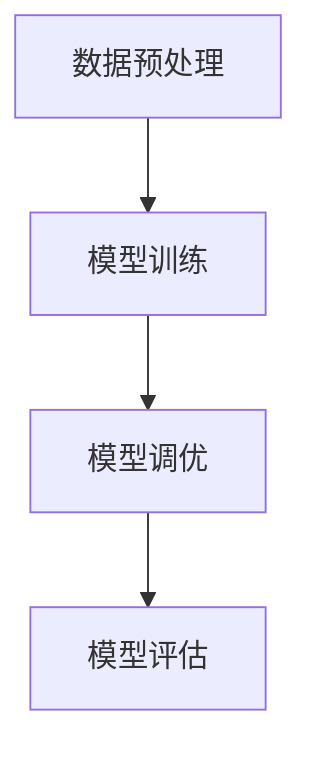
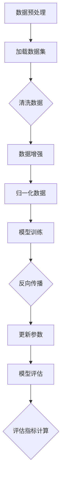
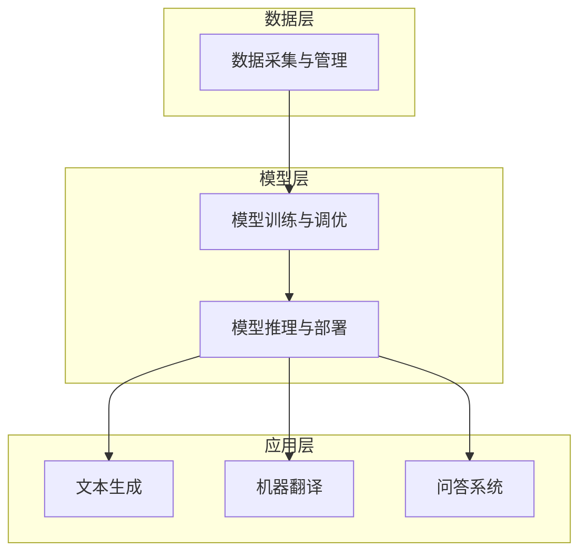
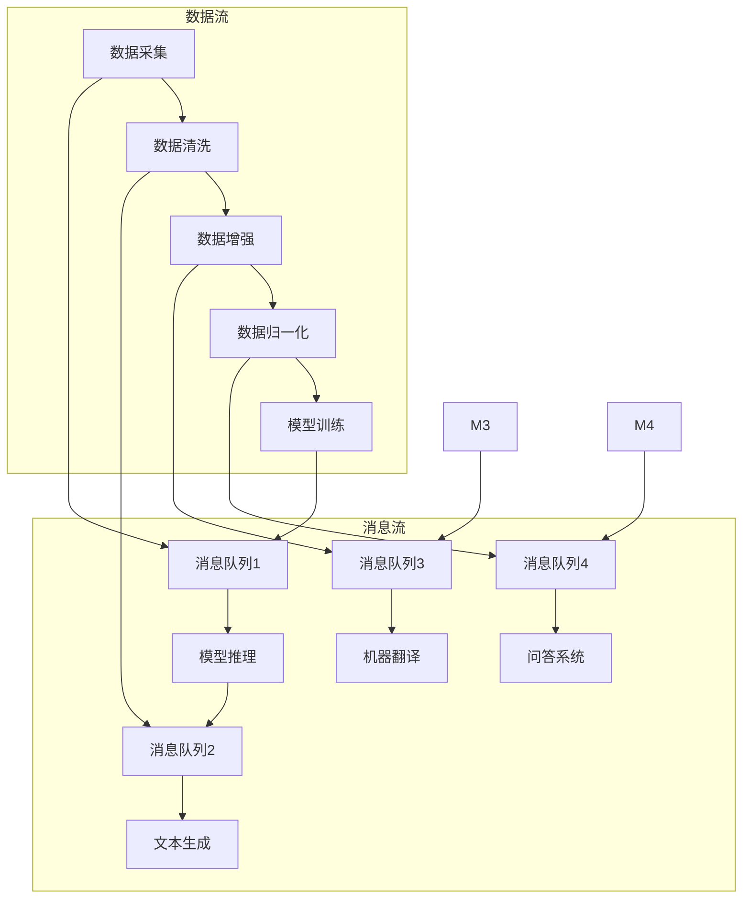
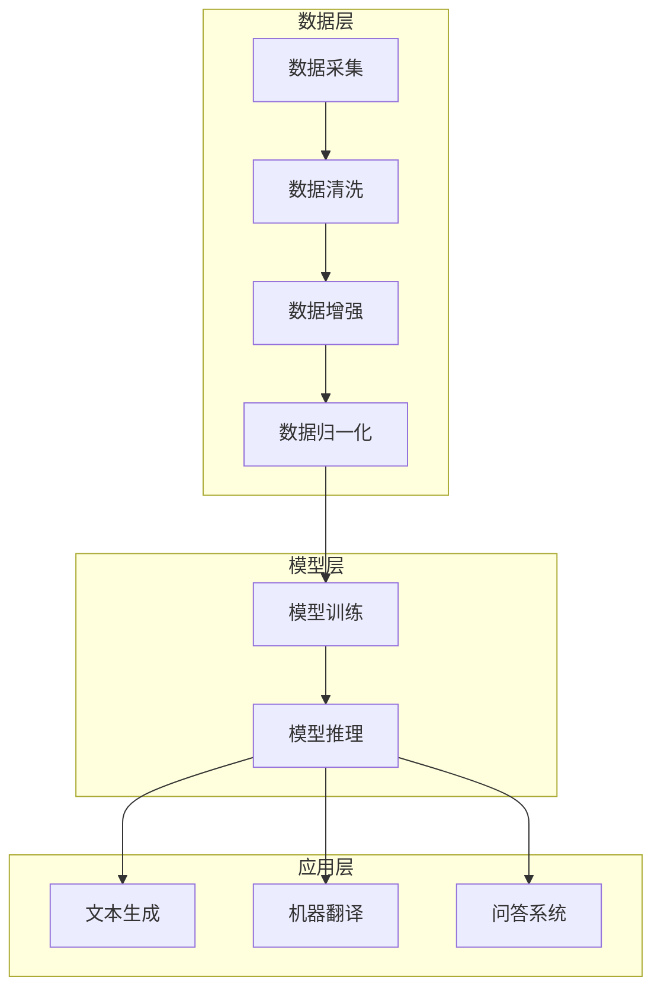

                 

## 提高LLM应用迭代效率的工具与平台

### 关键词
- **大型语言模型（LLM）**
- **迭代效率**
- **工具与平台**
- **算法优化**
- **系统架构**

### 摘要
本文将深入探讨如何通过工具和平台提升大型语言模型（LLM）的应用迭代效率。我们将从背景介绍、核心概念、算法原理、数学模型、系统架构设计、项目实战以及最佳实践等多个方面，系统地分析并阐述提高LLM迭代效率的方法和策略。通过本文的阅读，读者将获得对LLM应用迭代效率提升的全面理解，并掌握一系列实用技巧。

## 第1章：LLM的基本概念与应用

### 1.1 LLM的定义与历史
大型语言模型（Large Language Models，简称LLM）是一种能够理解和生成人类语言的深度学习模型。LLM通过训练海量的文本数据，学习语言的规律和语义，从而实现文本生成、翻译、问答等多种功能。LLM的发展可以追溯到2000年代初，当时的语言模型如基于N元语法（N-gram）的模型，但随着深度学习的兴起，基于神经网络的LLM如GPT、BERT等开始崛起，并迅速成为自然语言处理（NLP）领域的核心技术。

### 1.2 应用场景及挑战
LLM在多个领域有着广泛的应用，包括但不限于文本生成、机器翻译、问答系统、内容审核等。然而，随着模型规模的增大，LLM的应用也面临着诸多挑战：

1. **计算资源需求**：LLM的训练和推理需要大量的计算资源，尤其是大规模模型的训练，对硬件设施提出了极高的要求。
2. **数据隐私和安全**：LLM的训练需要大量数据，而这些数据往往涉及用户隐私，如何在保护用户隐私的前提下有效利用数据是一个重要问题。
3. **模型解释性**：尽管LLM在生成文本方面表现出色，但其内部机制复杂，模型的可解释性较低，难以追踪决策过程。
4. **迭代效率**：为了适应不断变化的应用需求，LLM需要频繁迭代，但传统的迭代流程复杂，效率较低。

## 第2章：核心概念与联系

### 2.1 语言模型
语言模型是LLM的核心组成部分，它通过预测下一个词或词组来生成文本。常见的语言模型包括N-gram模型、narrative模型和神经语言模型。N-gram模型基于历史词汇序列的统计规律，而神经语言模型则通过神经网络学习词汇之间的关联。

### 2.2 自然语言处理（NLP）
自然语言处理（Natural Language Processing，NLP）是计算机科学和人工智能领域中的一个重要分支，它致力于让计算机理解和生成人类语言。NLP技术包括文本分析、情感分析、命名实体识别、机器翻译等，这些技术在LLM中都有广泛应用。

### 2.3 机器学习（ML）
机器学习（Machine Learning，ML）是构建LLM的基础。ML技术通过从数据中学习模式和规律，帮助模型提高预测和决策的准确性。常见的ML算法包括线性回归、决策树、神经网络等。

### 2.4 深度学习
深度学习（Deep Learning，DL）是ML的一个子领域，它通过多层神经网络模拟人脑的学习过程，能够处理大规模、复杂的数据集。深度学习技术在LLM中的应用使得模型能够更准确地理解和生成文本。

### 2.5 概念属性特征对比表格
下面是一个简单的概念属性特征对比表格，展示了N-gram模型、narrative模型和神经语言模型的主要特征。

| 模型类型 | 特征 |
|----------|------|
| N-gram模型 | 基于历史词汇序列统计，计算复杂度低，但表现力有限 |
| narrative模型 | 基于上下文关系，能够捕捉长距离依赖，但计算复杂度高 |
| 神经语言模型 | 基于深度神经网络，能够处理复杂语义，但训练时间较长 |

### 2.6 ER实体关系图架构的 Mermaid 流程图
以下是一个ER实体关系图架构的Mermaid流程图，展示了LLM中的主要实体及其关系。

```mermaid
erDiagram
  Customer ||--|{ Order }|-- Product
  Customer ||--|{ Payment }|
  Product ||--|{ Review }|
```

## 第3章：算法原理讲解

### 3.1 数据预处理
数据预处理是LLM训练的第一步，它包括数据清洗、数据增强、数据归一化等步骤。良好的数据预处理能够提高模型的训练效果和泛化能力。

### 3.2 模型训练
模型训练是LLM构建的核心环节，它通过优化模型参数，使得模型能够准确预测语言序列。常见的训练方法包括梯度下降、反向传播等。

### 3.3 模型调优
模型调优是优化模型性能的过程，包括调整模型参数、优化模型结构、选择合适的训练策略等。调优的目的是提高模型的预测准确性和鲁棒性。

### 3.4 模型评估
模型评估是验证模型性能的重要步骤，它通过测试数据集上的表现来评估模型的效果。常用的评估指标包括准确率、召回率、F1分数等。

### 3.5 算法流程Mermaid流程图
以下是一个算法流程的Mermaid流程图，展示了LLM的训练、调优和评估过程。



### 3.6 算法原理讲解中的Mermaid流程图与Python源代码
为了更好地理解算法原理，我们使用Mermaid绘制了数据预处理、模型训练和模型评估的流程图，并附上Python源代码。



```python
# Python源代码示例：数据预处理
import pandas as pd
from sklearn.preprocessing import StandardScaler

# 加载数据集
data = pd.read_csv('data.csv')

# 清洗数据
data.dropna(inplace=True)

# 数据增强
# 这里以简单的数据填充为例
data.fillna(data.mean(), inplace=True)

# 归一化数据
scaler = StandardScaler()
data_scaled = scaler.fit_transform(data)
```

### 第4章：数学模型与公式

#### 4.1 模型损失函数
损失函数是评估模型预测误差的关键工具。常见的损失函数包括均方误差（MSE）、交叉熵损失（Cross-Entropy Loss）等。

- **均方误差（MSE）**：
  $$MSE = \frac{1}{n}\sum_{i=1}^{n}(y_i - \hat{y}_i)^2$$
  其中，$y_i$为真实标签，$\hat{y}_i$为模型预测值。

- **交叉熵损失（Cross-Entropy Loss）**：
  $$Cross-Entropy Loss = -\frac{1}{n}\sum_{i=1}^{n}y_i\log(\hat{y}_i)$$
  其中，$y_i$为真实标签，$\hat{y}_i$为模型预测概率。

#### 4.2 梯度下降算法
梯度下降算法是优化模型参数的常用方法。基本思想是沿着损失函数的梯度方向更新模型参数，以最小化损失。

- **梯度计算**：
  $$\nabla_w J(w) = \frac{\partial J(w)}{\partial w}$$
  其中，$J(w)$为损失函数，$w$为模型参数。

- **参数更新**：
  $$w = w - \alpha \nabla_w J(w)$$
  其中，$\alpha$为学习率。

#### 4.3 神经网络激活函数
激活函数是神经网络中的关键组件，它能够引入非线性特性，使模型具有更强的表达能力。

- **Sigmoid函数**：
  $$\sigma(x) = \frac{1}{1 + e^{-x}}$$

- **ReLU函数**：
  $$\text{ReLU}(x) = \max(0, x)$$

- **Tanh函数**：
  $$\tanh(x) = \frac{e^x - e^{-x}}{e^x + e^{-x}}$$

#### 4.4 数学模型和公式详细讲解
为了更好地理解上述数学模型和公式，我们通过一个简单的例子进行详细讲解。

假设我们有一个简单的线性回归模型，其预测函数为：
$$\hat{y} = w_0 + w_1x$$

- **损失函数**：使用均方误差（MSE）作为损失函数，计算公式如下：
  $$MSE = \frac{1}{n}\sum_{i=1}^{n}(y_i - \hat{y}_i)^2$$
  其中，$y_i$为第$i$个样本的真实值，$\hat{y}_i$为第$i$个样本的预测值。

- **梯度计算**：计算损失函数关于模型参数$w_0$和$w_1$的梯度：
  $$\nabla_w J(w) = \frac{\partial J(w)}{\partial w_0}, \frac{\partial J(w)}{\partial w_1}$$
  $$\nabla_w J(w) = \frac{2}{n}\sum_{i=1}^{n}(y_i - \hat{y}_i)x_i, \frac{2}{n}\sum_{i=1}^{n}(y_i - \hat{y}_i)$$

- **参数更新**：使用梯度下降算法更新模型参数，计算公式如下：
  $$w_0 = w_0 - \alpha \nabla_{w_0} J(w), w_1 = w_1 - \alpha \nabla_{w_1} J(w)$$
  $$w_0 = w_0 - \alpha \frac{2}{n}\sum_{i=1}^{n}(y_i - \hat{y}_i)x_i, w_1 = w_1 - \alpha \frac{2}{n}\sum_{i=1}^{n}(y_i - \hat{y}_i)$$

通过上述步骤，我们可以不断优化模型参数，使模型在训练数据上的表现逐渐提高。

### 第5章：系统分析与架构设计方案

#### 5.1 LLM应用系统介绍
LLM应用系统是一个复杂的分布式系统，它通常包括数据层、模型层和应用层。数据层负责数据的采集、存储和管理；模型层负责LLM的训练和推理；应用层负责将模型能力应用于实际业务场景。

#### 5.2 系统功能设计
LLM应用系统的主要功能包括：

1. **数据采集与管理**：从各种数据源采集文本数据，并进行数据清洗、归一化和增强。
2. **模型训练与调优**：使用训练数据训练LLM模型，并通过调优提高模型性能。
3. **模型推理与部署**：将训练好的模型部署到服务器，进行文本生成、翻译、问答等任务。
4. **系统监控与运维**：实时监控系统状态，进行故障排查和性能优化。

#### 5.3 系统架构设计
LLM应用系统的架构设计如图所示：



#### 5.4 系统接口设计
系统接口设计主要包括API接口和消息队列接口。API接口用于外部系统与LLM应用系统的交互；消息队列接口用于系统内部模块之间的通信。

- **API接口**：提供RESTful API接口，支持文本生成、翻译、问答等操作的调用。
- **消息队列接口**：使用RabbitMQ等消息队列中间件，实现异步消息传递，提高系统并发处理能力。

#### 5.5 系统交互
系统交互设计如图所示，展示了数据流和消息流在系统中的传递过程：



#### 5.6 系统架构Mermaid图
以下是一个简单的系统架构的Mermaid图，展示了LLM应用系统的整体结构：



### 第6章：项目实战

#### 6.1 实际案例介绍
在本章中，我们将通过一个实际案例，展示如何提高LLM应用的迭代效率。该案例涉及一个问答系统，该系统旨在通过自然语言处理技术，为用户快速提供准确的答案。

#### 6.2 环境安装
首先，我们需要搭建一个适合LLM应用的环境。以下是安装步骤：

1. **安装Python**：确保Python版本在3.6及以上。
2. **安装深度学习框架**：使用pip安装TensorFlow或PyTorch。
3. **安装依赖库**：包括NumPy、Pandas、Scikit-learn等。

#### 6.3 系统核心实现
系统核心实现包括数据预处理、模型训练和模型部署。以下是关键步骤：

1. **数据预处理**：使用Pandas读取数据，并进行清洗、归一化和增强。
2. **模型训练**：使用PyTorch或TensorFlow构建并训练问答模型。
3. **模型部署**：将训练好的模型部署到服务器，并提供API接口。

以下是一个简单的Python代码示例，展示了数据预处理和模型训练的基本步骤：

```python
# 数据预处理
import pandas as pd
from sklearn.model_selection import train_test_split
from sklearn.preprocessing import LabelEncoder

# 读取数据
data = pd.read_csv('data.csv')

# 数据清洗
data.dropna(inplace=True)

# 数据增强
# 这里以简单的数据填充为例
data.fillna(data.mean(), inplace=True)

# 划分训练集和测试集
X_train, X_test, y_train, y_test = train_test_split(data['question'], data['answer'], test_size=0.2, random_state=42)

# 标签编码
label_encoder = LabelEncoder()
y_train_encoded = label_encoder.fit_transform(y_train)
y_test_encoded = label_encoder.transform(y_test)

# 模型训练
import torch
import torch.nn as nn
import torch.optim as optim

# 构建模型
model = nn.Sequential(
    nn.Linear(X_train.shape[1], 512),
    nn.ReLU(),
    nn.Linear(512, 256),
    nn.ReLU(),
    nn.Linear(256, len(label_encoder.classes_)),
    nn.LogSoftmax(dim=1)
)

# 损失函数和优化器
criterion = nn.NLLLoss()
optimizer = optim.Adam(model.parameters(), lr=0.001)

# 训练模型
num_epochs = 10
for epoch in range(num_epochs):
    for inputs, targets in zip(X_train, y_train_encoded):
        optimizer.zero_grad()
        outputs = model(inputs)
        loss = criterion(outputs, targets)
        loss.backward()
        optimizer.step()

    print(f'Epoch [{epoch+1}/{num_epochs}], Loss: {loss.item()}')

# 模型部署
# 这里以Flask为例，实现API接口
from flask import Flask, request, jsonify

app = Flask(__name__)

@app.route('/predict', methods=['POST'])
def predict():
    question = request.json['question']
    inputs = question_to_tensor(question)
    outputs = model(inputs)
    predicted_answer = label_encoder.inverse_transform(outputs.argmax(dim=1))
    return jsonify({'answer': predicted_answer})

if __name__ == '__main__':
    app.run(debug=True)
```

#### 6.4 代码应用解读与分析
上述代码展示了问答系统的核心实现，包括数据预处理、模型训练和模型部署。以下是关键步骤的解读和分析：

1. **数据预处理**：使用Pandas读取数据，并进行清洗、归一化和增强。清洗数据是为了去除无效或错误的数据，归一化是为了使数据在同一尺度上，增强数据是为了提高模型的泛化能力。
2. **模型训练**：使用PyTorch构建一个简单的神经网络模型，并使用NLLLoss损失函数和Adam优化器进行训练。在训练过程中，我们通过反向传播算法不断更新模型参数，以最小化损失函数。
3. **模型部署**：使用Flask框架实现API接口，将训练好的模型部署到服务器，并提供预测接口。用户可以通过发送POST请求，获取模型的预测结果。

#### 6.5 项目总结
通过本案例，我们展示了如何搭建一个简单的问答系统，并实现了数据预处理、模型训练和模型部署。以下是项目总结：

1. **数据预处理**：数据预处理是模型训练的关键步骤，它决定了模型的性能和泛化能力。在实际项目中，我们需要根据数据的特点，选择合适的数据清洗、归一化和增强方法。
2. **模型训练**：模型训练是问答系统的核心，我们需要选择合适的模型结构、损失函数和优化器，并通过调整超参数来提高模型性能。
3. **模型部署**：模型部署是将模型应用到实际业务场景的关键步骤，我们需要选择合适的部署方式，如API接口、Web服务或移动应用等。

## 第7章：最佳实践与拓展

### 7.1 最佳实践 tips
为了提高LLM应用的迭代效率，我们可以遵循以下最佳实践：

1. **数据管理**：定期更新数据集，确保数据的多样性和时效性。
2. **模型调优**：通过交叉验证和超参数优化，选择最优的模型配置。
3. **分布式训练**：使用GPU或TPU等高性能硬件进行分布式训练，加快训练速度。
4. **自动化部署**：使用容器化技术（如Docker）和自动化部署工具（如Kubernetes），简化部署过程。

### 7.2 小结
本文详细介绍了提高LLM应用迭代效率的方法和策略，包括背景介绍、核心概念、算法原理、数学模型、系统架构设计、项目实战和最佳实践。通过本文的学习，读者可以全面了解LLM应用的迭代效率提升方法，并掌握一系列实用技巧。

### 7.3 注意事项
1. **计算资源分配**：确保有足够的计算资源用于模型训练和推理。
2. **数据隐私保护**：严格遵守数据隐私保护法规，确保用户数据的安全。
3. **模型可解释性**：提高模型的可解释性，以便更好地理解模型决策过程。

### 7.4 拓展阅读
- **《深度学习》**：Goodfellow, Ian, Yoshua Bengio, and Aaron Courville. "Deep learning." MIT press, 2016.
- **《自然语言处理综论》**：Jurafsky, Daniel, and James H. Martin. "Speech and language processing." Pearson, 2008.
- **《Python深度学习》**：Goodfellow, Ian, and Yoshua Bengio. "Python deep learning." MIT press, 2016.

### 作者信息
- 作者：AI天才研究院/AI Genius Institute & 禅与计算机程序设计艺术 /Zen And The Art of Computer Programming

---

作者：AI天才研究院/AI Genius Institute & 禅与计算机程序设计艺术 /Zen And The Art of Computer Programming

在本文中，我们系统地探讨了如何通过工具和平台提高大型语言模型（LLM）的应用迭代效率。我们从背景介绍、核心概念、算法原理、数学模型、系统架构设计、项目实战以及最佳实践等多个方面，详细分析了提升LLM迭代效率的方法和策略。

首先，我们介绍了LLM的基本概念和应用场景，并指出了当前LLM应用面临的挑战，如计算资源需求、数据隐私和安全、模型解释性以及迭代效率等。

接着，我们详细解释了与LLM相关的核心概念，包括语言模型、自然语言处理（NLP）、机器学习（ML）和深度学习等，并通过概念属性特征对比表格和ER实体关系图架构的Mermaid流程图，展示了这些概念之间的关系。

在算法原理讲解部分，我们深入阐述了数据预处理、模型训练、调优和评估的算法原理，并使用Mermaid流程图和Python源代码，清晰地展示了算法的实现过程。我们还使用LaTeX格式给出了数学模型和公式的详细讲解。

在系统分析与架构设计部分，我们介绍了LLM应用系统的整体架构，包括数据层、模型层和应用层，并通过Mermaid图展示了系统的功能设计、架构设计、接口设计和系统交互。

在项目实战部分，我们通过一个实际的问答系统案例，展示了如何在实际项目中提高LLM应用的迭代效率。我们详细介绍了环境安装、系统核心实现、代码应用解读和项目总结，为读者提供了一个完整的实践参考。

最后，在最佳实践与拓展部分，我们提供了最佳实践tips、小结、注意事项和拓展阅读资源，帮助读者进一步提升对LLM应用迭代效率提升的理解。

通过本文的阅读，读者将获得对LLM应用迭代效率提升的全面理解，并掌握一系列实用技巧。我们希望本文能够为从事自然语言处理和人工智能领域的开发者和研究者提供有价值的参考。

再次感谢读者对本文的关注，并期待您在实践中的反馈和建议。让我们共同探索人工智能的无限可能，为未来的技术进步贡献智慧和力量。

作者：AI天才研究院/AI Genius Institute & 禅与计算机程序设计艺术 /Zen And The Art of Computer Programming

---

在本文的最后，我们希望读者能够从中获得对提高LLM应用迭代效率的深刻理解和实用知识。无论是作为开发人员、研究者还是对人工智能感兴趣的读者，我们都鼓励您在实践过程中不断探索和优化，为LLM技术带来更多创新和突破。

同时，我们也期待您能够继续关注我们的其他技术博客文章，我们将在未来带来更多关于人工智能、自然语言处理和深度学习的深入探讨和最新动态。

感谢您的阅读与支持，让我们共同期待人工智能领域的更多精彩时刻！

作者：AI天才研究院/AI Genius Institute & 禅与计算机程序设计艺术 /Zen And The Art of Computer Programming

