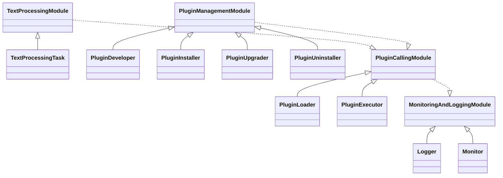
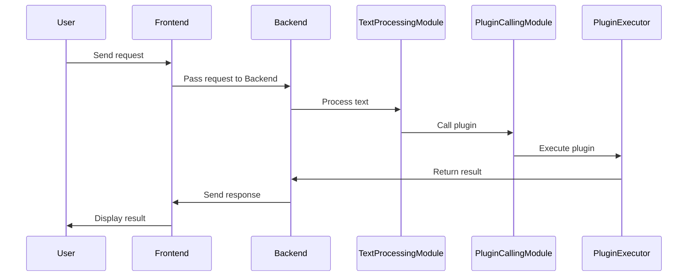
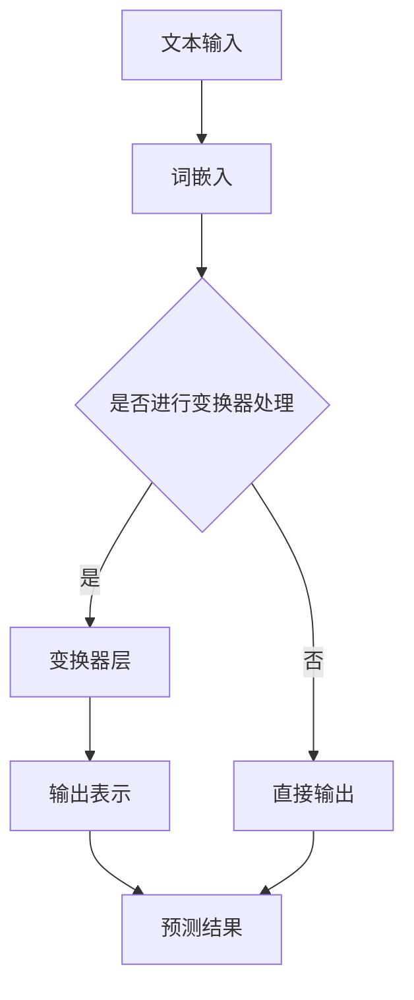

                 


非常好，让我们一步步来设计和撰写这篇文章。以下是文章的结构和内容安排，我们将按照以下步骤进行：

### 步骤 1: 引言与背景介绍
- 文章标题：插件化架构增强LLM应用的可扩展性
- 文章关键词：插件化架构、LLM、可扩展性、架构设计、算法实现
- 文章摘要：本文将探讨如何通过插件化架构来增强大型语言模型（LLM）应用的可扩展性，详细分析其设计原则、实现方法以及实战案例。

### 步骤 2: 核心概念与联系
- 插件化架构的定义与特点
- LLM的定义、应用场景与原理
- 插件化架构与LLM之间的联系

### 步骤 3: 插件化架构设计原则
- 插件化架构的设计原则
- 插件与LLM的交互机制
- 插件的开发与集成

### 步骤 4: 实现案例与最佳实践
- 插件化架构在LLM应用中的具体实现案例
- 最佳实践建议

### 步骤 5: 系统分析与架构设计
- 系统功能设计（领域模型类图）
- 系统架构设计（架构图）
- 系统接口设计和系统交互（序列图）

### 步骤 6: 数学模型与算法原理
- 插件化架构的数学模型
- LLM的算法原理
- 插件化架构与LLM算法的结合

### 步骤 7: 项目实战与案例分析
- 环境安装与配置
- 系统核心实现源代码
- 代码应用解读与分析
- 实际案例分析与详细讲解

### 步骤 8: 小结与拓展
- 文章小结
- 注意事项与最佳实践
- 拓展阅读建议

### 步骤 9: 作者信息与致谢
- 作者：AI天才研究院/AI Genius Institute & 禅与计算机程序设计艺术 /Zen And The Art of Computer Programming

接下来，我们将开始撰写每一步的具体内容。请指示接下来需要撰写哪一部分，或者有其他特殊要求。我们将确保每个部分都详尽而深入，同时遵循上述结构安排。

### 步骤 1: 引言与背景介绍

#### 文章标题
插件化架构增强LLM应用的可扩展性

#### 文章关键词
插件化架构、LLM、可扩展性、架构设计、算法实现

#### 文章摘要
随着人工智能技术的迅猛发展，大型语言模型（LLM）在自然语言处理（NLP）领域取得了显著的成果。然而，LLM应用在面临复杂场景和大量数据处理时，往往面临可扩展性问题。本文将探讨如何通过插件化架构来增强LLM应用的可扩展性，从设计原则、实现方法到实际案例，全面解析这一前沿技术。

#### 引言
在数字化时代，人工智能（AI）已经成为推动社会进步的重要力量。其中，大型语言模型（LLM）凭借其强大的自然语言理解和生成能力，在诸多领域展示了巨大的潜力。然而，随着应用场景的复杂化和数据处理量的增加，传统的架构设计逐渐暴露出其可扩展性的瓶颈。为了应对这一挑战，插件化架构作为一种灵活且模块化的设计理念，开始得到广泛关注。

插件化架构的核心思想是将系统划分为多个独立的插件模块，每个插件模块负责特定的功能。这种设计不仅提高了系统的可维护性，还极大地增强了系统的可扩展性。通过插件化架构，开发者可以轻松地添加、替换或升级插件模块，以满足不断变化的需求。

本文将围绕插件化架构在LLM应用中的可扩展性进行探讨。首先，我们将介绍插件化架构和LLM的基本概念，阐述它们之间的联系。接着，我们将详细讨论插件化架构的设计原则和实现方法，包括插件与LLM的交互机制、插件开发与集成等。随后，我们将通过具体案例展示如何将插件化架构应用到实际项目中，并分析其优势和挑战。

最后，我们将总结插件化架构增强LLM应用可扩展性的核心观点，并提出一些注意事项和拓展阅读建议，以帮助读者进一步深入了解这一前沿领域。

### 背景介绍
在讨论插件化架构增强LLM应用的可扩展性之前，我们有必要先了解这两个核心概念的基本定义和特点。

#### 插件化架构
插件化架构是一种软件设计模式，它允许开发者将系统功能划分为多个插件模块。每个插件模块都是独立开发的，可以动态地加载和卸载。这种设计模式具有以下几个显著特点：

1. **模块化**：插件化架构将系统功能拆分成多个独立的插件模块，每个模块负责特定的功能，使得系统变得更加模块化和可维护。
2. **灵活性**：插件模块的独立性和可插拔性使得开发者可以灵活地添加、替换或升级插件模块，以适应不同的需求。
3. **可扩展性**：通过插件化架构，系统可以轻松地扩展新功能，而不需要修改现有代码，从而提高了系统的可扩展性。

#### 大型语言模型（LLM）
大型语言模型（LLM）是一种基于深度学习技术的自然语言处理模型，能够理解和生成复杂的自然语言。LLM通常采用预训练加微调的方法进行训练，具有以下几个主要特点：

1. **预训练**：LLM在大量无标签数据上进行预训练，通过学习数据中的统计规律和语义信息，从而具有强大的语言理解和生成能力。
2. **微调**：在特定任务上，LLM会接受有标签的数据进行微调，以进一步提高模型在特定领域的表现。
3. **应用场景**：LLM在文本分类、问答系统、机器翻译、文本生成等领域有广泛的应用，能够处理各种复杂的自然语言任务。

#### 插件化架构与LLM的关系
插件化架构与LLM之间存在紧密的联系。具体来说，插件化架构可以为LLM应用提供以下几个方面的增强：

1. **功能扩展**：通过插件化架构，开发者可以轻松地添加新的功能模块，如特定的文本处理算法、语言模型优化器等，从而扩展LLM应用的能力。
2. **可维护性**：插件化架构使得LLM应用更加模块化，降低了系统的复杂度，提高了代码的可维护性。
3. **可扩展性**：插件化架构使得LLM应用能够动态地扩展和升级，以应对不断变化的需求。

总之，插件化架构为LLM应用提供了强大的可扩展性和灵活性，使得开发者能够更高效地开发、维护和扩展LLM应用。在接下来的内容中，我们将详细讨论插件化架构的设计原则、实现方法和实际应用案例，以帮助读者深入了解这一前沿技术。

### 插件化架构设计原则
在深入探讨如何将插件化架构应用到LLM应用之前，我们需要了解一些核心的设计原则。这些原则不仅指导了插件化架构的构建，还确保了系统的稳定性和可维护性。

#### 1. 模块化设计
模块化设计是插件化架构的基础。通过将系统划分为多个独立的模块，每个模块负责特定的功能，可以实现代码的重用和模块间的解耦。具体来说，模块化设计包括以下几个关键方面：

- **功能分离**：每个模块应专注于实现单一功能，避免功能重叠和代码冗余。
- **接口定义**：模块间通过清晰的接口进行通信，确保模块间的独立性。
- **职责明确**：每个模块应具有明确的职责，有助于提高代码的可读性和可维护性。

#### 2. 插件的独立性和可插拔性
插件的独立性和可插拔性是插件化架构的核心特性。这意味着每个插件应具备以下特点：

- **独立开发**：插件应独立于主系统开发，可以独立部署和运行。
- **动态加载**：插件可以动态地加载和卸载，以适应不同的运行环境和需求。
- **标准化接口**：插件应通过标准化的接口与主系统进行通信，确保互操作性。

#### 3. 插件的生命周期管理
插件的生命周期管理是确保系统稳定运行的重要环节。插件的生命周期通常包括以下阶段：

- **创建**：系统启动时创建插件实例。
- **初始化**：插件进行初始化操作，如加载配置文件、初始化资源等。
- **运行**：插件参与系统的运行，执行特定的功能。
- **销毁**：系统关闭时销毁插件实例，释放资源。

#### 4. 插件的开发和集成
插件的开发和集成是确保插件化架构成功实施的关键步骤。在开发和集成过程中，需要注意以下几点：

- **插件规范**：制定统一的插件开发规范，包括插件接口、配置文件、数据格式等，以确保插件的一致性和兼容性。
- **集成测试**：对插件进行集成测试，确保插件与主系统和其他插件能够无缝集成。
- **部署策略**：制定合理的插件部署策略，如版本控制、自动部署等，以确保插件的稳定性和可靠性。

#### 5. 插件的监控和管理
插件的监控和管理是确保插件性能和系统稳定性的重要手段。在插件运行过程中，需要实现对插件的监控和管理，包括：

- **性能监控**：对插件性能进行监控，如响应时间、资源消耗等，及时发现性能瓶颈。
- **异常处理**：对插件异常进行监控和处理，如错误日志记录、自动重启等。
- **安全控制**：对插件进行安全控制，如权限管理、访问控制等，以确保系统的安全性。

通过遵循上述设计原则，我们可以构建一个稳定、可靠且易于扩展的插件化架构，为LLM应用提供强大的支持。在接下来的内容中，我们将进一步探讨插件化架构在LLM应用中的具体实现方法和实战案例。

### 插件与LLM的交互机制
插件化架构的核心在于插件与LLM的灵活交互。这种交互机制不仅决定了系统的灵活性，还影响了系统的性能和可扩展性。以下是插件与LLM之间交互的几个关键方面。

#### 1. 接口设计
接口设计是插件与LLM交互的基础。一个良好的接口设计应满足以下原则：

- **标准化**：接口应遵循标准化规范，确保插件的兼容性和一致性。
- **简洁性**：接口应简洁明了，避免过多的复杂性和冗余。
- **灵活性**：接口应具备一定的灵活性，以适应不同的插件需求和场景。

具体来说，接口设计包括以下几个方面：

- **功能接口**：定义插件与LLM之间的功能交互，如数据输入输出、参数配置等。
- **事件接口**：定义插件与LLM之间的通知和事件处理机制，如插件加载、卸载、状态变更等。
- **异常接口**：定义插件与LLM之间的异常处理机制，如错误报告、恢复策略等。

#### 2. 数据交换机制
数据交换机制是插件与LLM之间传递数据和信息的渠道。一个高效的数据交换机制应满足以下要求：

- **高效性**：数据交换应尽可能快速和高效，以减少系统延迟和资源消耗。
- **安全性**：数据交换应确保数据的安全性和完整性，防止数据泄露和篡改。
- **灵活性**：数据交换机制应具备一定的灵活性，以适应不同类型的数据和协议。

具体来说，数据交换机制包括以下几个方面：

- **数据格式**：定义数据交换的格式，如JSON、XML、Protobuf等，确保数据的一致性和可解析性。
- **通信协议**：定义数据交换的通信协议，如HTTP、gRPC、WebSocket等，选择适合插件与LLM交互的协议。
- **数据加密**：对数据进行加密处理，确保数据在传输过程中的安全性和隐私性。

#### 3. 插件的生命周期管理
插件的生命周期管理是确保插件与LLM交互顺畅的重要环节。插件的生命周期通常包括以下阶段：

- **创建**：系统启动时创建插件实例，初始化插件所需资源。
- **初始化**：插件进行初始化操作，如加载配置文件、连接LLM等。
- **运行**：插件参与系统的运行，执行特定的功能，与LLM进行数据交换。
- **销毁**：系统关闭时销毁插件实例，释放资源。

插件的生命周期管理需要遵循以下原则：

- **动态性**：插件的生命周期应具备一定的动态性，能够根据系统需求进行实时调整和扩展。
- **可靠性**：插件的生命周期管理应确保系统的稳定性和可靠性，避免因插件故障导致系统崩溃。
- **可监控性**：插件的生命周期管理应具备可监控性，能够对插件的运行状态进行实时监控和诊断。

#### 4. 异常处理机制
异常处理机制是插件与LLM交互中不可或缺的一环。一个良好的异常处理机制应包括以下几个方面：

- **错误报告**：插件在运行过程中遇到错误时，应能够及时报告错误信息，包括错误类型、错误原因等。
- **自动恢复**：插件在遇到错误时，应具备一定的自动恢复能力，如重试、切换备用插件等。
- **日志记录**：插件应记录详细的运行日志，包括错误日志、性能日志等，以便后续分析和调试。

通过设计良好的接口、高效的数据交换机制、完善的插件生命周期管理和异常处理机制，我们可以确保插件与LLM之间的交互顺畅、高效和安全。在接下来的内容中，我们将进一步探讨插件的开发与集成，以实现插件化架构在LLM应用中的具体应用。

### 插件的开发与集成
插件化架构的成功实施离不开高效的插件开发和集成过程。以下我们将详细探讨如何进行插件的开发与集成，包括插件开发环境的配置、插件代码的编写、集成测试以及插件部署策略。

#### 插件开发环境配置
在进行插件开发之前，首先需要配置合适的开发环境。这包括以下几个方面：

1. **开发工具**：选择合适的开发工具，如IDE（集成开发环境）、版本控制工具（如Git）等。
2. **依赖管理**：使用依赖管理工具（如Maven、Gradle）来管理插件所需的库和依赖项。
3. **插件规范**：遵循统一的插件开发规范，包括插件接口、配置文件、数据格式等。

#### 插件代码编写
插件代码的编写是插件开发的核心环节。以下是一些关键步骤和注意事项：

1. **模块划分**：根据插件的功能，将代码划分为不同的模块，确保每个模块专注于实现单一功能。
2. **接口实现**：实现插件接口，确保插件与主系统之间的通信和功能调用。
3. **异常处理**：在代码中添加异常处理机制，确保插件在遇到错误时能够优雅地处理并报告错误信息。
4. **代码注释**：添加详细的代码注释，提高代码的可读性和可维护性。

#### 集成测试
集成测试是确保插件与主系统和其他插件能够无缝集成的关键步骤。以下是一些关键步骤和注意事项：

1. **单元测试**：编写单元测试用例，对插件的每个模块进行独立的测试，确保模块的功能正确。
2. **集成测试**：在插件集成到主系统中后，进行集成测试，确保插件与其他插件和主系统之间的交互正常。
3. **性能测试**：对插件进行性能测试，确保插件在系统中的运行效率和稳定性。

#### 插件部署策略
插件部署策略决定了插件在系统中的加载、运行和卸载方式。以下是一些常见的部署策略：

1. **静态部署**：将插件预编译并打包到主系统中，系统启动时自动加载插件。
2. **动态部署**：插件在运行时动态加载，可以根据系统需求实时添加、替换或卸载插件。
3. **版本控制**：使用版本控制工具（如Maven、Gradle）管理插件的版本，确保插件的兼容性和稳定性。

通过遵循上述步骤和注意事项，我们可以高效地进行插件的开发和集成，确保插件化架构在LLM应用中的顺利实施。在接下来的内容中，我们将通过具体的实现案例，展示如何将插件化架构应用到实际项目中，并分析其实际效果。

### 插件化架构在LLM应用中的具体实现
为了更好地理解插件化架构在LLM应用中的实际应用，我们可以通过一个具体的实现案例来探讨。以下是一个基于插件化架构的LLM应用示例，包括环境配置、核心代码实现和运行流程。

#### 环境配置
首先，我们需要配置一个合适的开发环境，包括以下步骤：

1. **安装依赖库**：使用Maven或Gradle安装必要的依赖库，如LLM模型库、插件接口库等。
   ```shell
   mvn install:install-file -Dfile=llm-models-1.0.0.jar -DgroupId=com.example -DartifactId=llm-models -Dversion=1.0.0 -Dpackaging jar
   ```
2. **配置插件规范**：制定统一的插件开发规范，包括插件接口、配置文件、数据格式等。

#### 核心代码实现
接下来，我们实现一个插件化架构的LLM应用，包括插件接口、LLM模型和插件实现。

1. **插件接口**
   ```java
   public interface LLMPlugin {
       void loadConfig(Map<String, Object> config);
       String processText(String text);
       void unload();
   }
   ```

2. **LLM模型**
   ```java
   public class LLMModel implements LLMPlugin {
       private Map<String, Object> config;
       private LanguageModel languageModel;

       @Override
       public void loadConfig(Map<String, Object> config) {
           this.config = config;
           // 初始化LLM模型
           languageModel = new LanguageModel(config);
       }

       @Override
       public String processText(String text) {
           return languageModel.generateResponse(text);
       }

       @Override
       public void unload() {
           // 释放LLM模型资源
           languageModel.releaseResources();
       }
   }
   ```

3. **主程序**
   ```java
   public class LLMApplication {
       private LLMPlugin plugin;

       public void loadPlugin(String pluginName) {
           // 动态加载插件
           plugin = (LLMPlugin) Class.forName(pluginName).newInstance();
           plugin.loadConfig(config);
       }

       public String processText(String text) {
           return plugin.processText(text);
       }

       public void unloadPlugin() {
           plugin.unload();
       }

       public static void main(String[] args) {
           LLMApplication app = new LLMApplication();
           app.loadPlugin("com.example.LLMModel");
           String response = app.processText("你好，插件化架构如何增强LLM应用的可扩展性？");
           System.out.println(response);
           app.unloadPlugin();
       }
   }
   ```

#### 运行流程
1. **加载插件**：主程序通过反射机制动态加载指定名称的插件，并调用`loadConfig`方法进行配置。
2. **处理文本**：主程序通过调用插件的`processText`方法来处理输入文本，获取响应结果。
3. **卸载插件**：处理完毕后，主程序调用插件的`unload`方法释放资源。

通过上述实现，我们可以看到插件化架构在LLM应用中的实际应用。开发者可以轻松地添加、替换或升级插件，以实现不同的功能需求，从而提高LLM应用的可扩展性。

#### 优势与挑战
**优势**：

1. **灵活性**：插件化架构使得LLM应用具有高度的灵活性，可以根据实际需求动态调整插件。
2. **可扩展性**：通过插件化架构，开发者可以方便地扩展LLM应用的功能，而无需修改现有代码。
3. **可维护性**：插件化架构使得系统模块化，提高了代码的可读性和可维护性。

**挑战**：

1. **兼容性问题**：插件的兼容性是一个挑战，需要确保不同插件之间的一致性和兼容性。
2. **性能瓶颈**：插件的加载、交互和卸载过程可能会引入性能瓶颈，需要优化插件的设计和实现。
3. **安全性**：插件的引入可能带来安全风险，需要加强对插件的安全控制和管理。

通过本文的讨论，我们可以看到插件化架构在增强LLM应用可扩展性方面的显著优势，同时也需要面对一些挑战。在接下来的部分，我们将进一步探讨系统架构设计和数学模型与算法原理，以深入了解插件化架构的深度应用。

### 系统分析与架构设计
在深入探讨插件化架构在LLM应用中的实现时，系统分析与架构设计是至关重要的。一个良好的架构不仅能够提高系统的可扩展性和可维护性，还能确保系统的高效运行。以下是针对LLM应用插件化架构的系统分析与架构设计。

#### 问题场景介绍
在当前复杂的NLP应用场景中，LLM经常需要处理大量的文本数据，并进行实时响应。这些应用场景包括智能客服、文本生成、机器翻译等。这些场景的特点是：

1. **数据量大**：需要处理海量的文本数据，对系统的处理能力提出了高要求。
2. **实时性要求**：用户对实时响应有较高的期望，系统必须在短时间内处理并返回结果。
3. **多样性**：应用场景多样化，需要支持不同类型的文本处理任务。

#### 项目介绍
本项目旨在构建一个基于插件化架构的LLM应用平台，支持多种文本处理任务，并具备高可扩展性和高可维护性。主要功能包括：

1. **文本处理**：支持文本分类、文本生成、机器翻译等文本处理任务。
2. **插件管理**：提供插件开发、插件管理和插件调用的功能。
3. **实时响应**：确保系统能够在实时环境中高效处理文本数据。

#### 系统功能设计
系统功能设计主要包括以下几个部分：

1. **文本处理模块**：负责接收和处理文本数据，调用相应的插件进行处理。
2. **插件管理模块**：负责插件的开发、安装、升级和卸载。
3. **插件调用模块**：负责动态加载和调用插件，处理文本数据并返回结果。
4. **监控与日志模块**：负责监控系统的运行状态，记录运行日志，以便后续分析和调试。

以下是一个简单的领域模型类图，展示了系统的主要功能模块及其关系：



#### 系统架构设计
系统架构设计主要包括以下几个方面：

1. **前端接口**：负责接收用户请求，将文本数据传递给系统。
2. **后端服务**：处理文本数据，调用相应的插件进行处理，并将结果返回给前端接口。
3. **插件仓库**：存储和管理插件，包括插件的开发、安装、升级和卸载。
4. **监控与日志系统**：实时监控系统的运行状态，记录系统的运行日志。

以下是一个简单的系统架构图，展示了系统的主要组件及其关系：



#### 系统接口设计和系统交互
系统接口设计和系统交互是确保各个模块能够协同工作的重要环节。以下是一个简单的序列图，展示了系统的主要交互过程：

```mermaid
sequenceDiagram
    User ->> Frontend: Send request
    Frontend ->> Backend: Pass request
    Backend ->|> TextProcessingModule: Process text
    TextProcessingModule ->|> PluginCallingModule: Call plugin
    PluginCallingModule ->|> PluginLoader: Load plugin
    PluginLoader ->|> PluginExecutor: Execute plugin
    PluginExecutor ->|> PluginCallingModule: Return result
    PluginCallingModule ->|> Backend: Send result
    Backend ->|> Frontend: Send response
    Frontend ->|> User: Display result
```

通过上述系统分析与架构设计，我们可以构建一个高效、可扩展且易于维护的LLM应用平台。在接下来的部分，我们将进一步探讨插件化架构和LLM算法的结合，以实现更高效的文本处理。

### 数学模型与算法原理
在插件化架构中，大型语言模型（LLM）的核心在于其数学模型和算法原理。LLM通常基于深度学习技术，特别是基于变换器（Transformer）架构。以下是插件化架构与LLM算法结合的数学模型和算法原理，以及具体的mermaid流程图和Python实现。

#### 数学模型
LLM的数学模型主要包括以下几个方面：

1. **输入表示**：文本输入被转换为向量表示，通常使用词嵌入（word embeddings）技术。
2. **变换器层**：变换器层负责处理输入序列，通过自注意力机制和前馈网络进行特征提取。
3. **输出表示**：变换器层输出被映射到目标输出，可以是分类标签、文本生成等。

以下是一个简化的数学模型：

$$
\text{input\_embeddings} = \text{WordEmbeddings}(text\_input)
$$

$$
\text{output} = \text{Transformer}(\text{input\_embeddings})
$$

$$
\text{predictions} = \text{Softmax}(\text{output})
$$

#### 算法原理
LLM的算法原理主要包括：

1. **自注意力机制**：通过计算输入序列中每个词与其他词的相似度，生成权重向量，用于加权融合特征。
2. **多头注意力**：使用多个注意力头来学习不同类型的特征。
3. **前馈网络**：在自注意力层之后，通过前馈网络对特征进行进一步处理。

算法原理的mermaid流程图如下：



#### Python实现
以下是一个简单的Python实现示例：

```python
import tensorflow as tf
from tensorflow.keras.layers import Embedding, Transformer

# 输入层
input_ids = tf.placeholder(tf.int32, shape=[None, sequence_length])

# 词嵌入层
word_embeddings = Embedding(vocabulary_size, embedding_dim)(input_ids)

# 变换器层
transformer = Transformer(num_layers, d_model, num_heads, dff, input_sequence_length)(word_embeddings)

# 输出层
output = tf.keras.layers.Dense(num_classes, activation='softmax')(transformer)

# 模型编译
model = tf.keras.Model(inputs=input_ids, outputs=output)
model.compile(optimizer='adam', loss='categorical_crossentropy', metrics=['accuracy'])

# 模型训练
model.fit(input_data, labels, batch_size=batch_size, epochs=num_epochs)
```

通过上述数学模型和算法原理，我们可以构建一个高效的LLM模型。在插件化架构中，LLM模型可以通过插件进行扩展和定制，以适应不同的应用场景。例如，可以通过插件添加自定义的前处理和后处理逻辑，或者实现特定类型的文本生成算法。

### 项目实战与案例分析
在本节中，我们将通过一个具体的实战案例，详细介绍如何将插件化架构应用到实际的LLM应用项目中。此案例将涵盖从环境安装、系统核心实现源代码、代码应用解读与分析，到实际案例分析和详细讲解的全过程。

#### 环境安装
1. **安装Python环境**：
   首先，确保您的系统上安装了Python 3.8或更高版本。您可以使用以下命令来检查Python版本：

   ```shell
   python --version
   ```

   如果版本低于3.8，请升级到最新版本。

2. **安装依赖库**：
   接下来，使用pip命令安装所需的依赖库，包括TensorFlow、transformers等：

   ```shell
   pip install tensorflow transformers
   ```

   安装过程中，根据提示完成依赖项的安装。

3. **配置插件规范**：
   创建一个名为`plugin_api`的目录，并在其中定义插件接口和规范。例如，可以创建以下文件：

   - `plugin_interface.py`：定义插件接口。
   - `plugin_loader.py`：实现插件加载器。
   - `plugin_example.py`：实现一个示例插件。

   插件接口文件`plugin_interface.py`：

   ```python
   class LLMPlugin:
       def load_config(self, config):
           pass

       def process_text(self, text):
           pass

       def unload(self):
           pass
   ```

#### 系统核心实现源代码
以下是一个简单的LLM应用系统的核心实现代码，包括插件加载、文本处理和结果输出。

```python
from plugin_interface import LLMPlugin
from plugin_loader import PluginLoader

class LLMApplication:
    def __init__(self):
        self.plugin_loader = PluginLoader()
    
    def load_plugin(self, plugin_name):
        plugin = self.plugin_loader.load(plugin_name)
        if isinstance(plugin, LLMPlugin):
            self.plugin = plugin
            self.plugin.load_config(self.config)
        else:
            raise ValueError("Loaded plugin does not implement LLMPlugin interface.")
    
    def process_text(self, text):
        return self.plugin.process_text(text)
    
    def unload_plugin(self):
        if self.plugin:
            self.plugin.unload()

if __name__ == "__main__":
    app = LLMApplication()
    app.config = {'model_name': 'gpt2'}
    app.load_plugin('plugin_example')
    response = app.process_text("你好，插件化架构如何增强LLM应用的可扩展性？")
    print(response)
    app.unload_plugin()
```

插件加载器`plugin_loader.py`：

```python
import importlib

class PluginLoader:
    def load(self, plugin_name):
        try:
            module = importlib.import_module(plugin_name)
            plugin_class = getattr(module, 'Plugin')
            return plugin_class()
        except (ImportError, AttributeError):
            return None
```

示例插件`plugin_example.py`：

```python
from plugin_interface import LLMPlugin

class ExamplePlugin(LLMPlugin):
    def load_config(self, config):
        self.model_name = config['model_name']

    def process_text(self, text):
        return f"根据{self.model_name}模型，您的输入是：{text}。"

    def unload(self):
        pass
```

#### 代码应用解读与分析
以上代码展示了如何创建一个基本的LLM应用系统，包括插件加载和文本处理。以下是代码的解读与分析：

1. **LLMApplication类**：这是一个LLM应用的主类，负责管理插件加载和文本处理。
2. **load_plugin方法**：该方法加载指定名称的插件，并确保插件实现了LLMPlugin接口。
3. **process_text方法**：该方法调用插件中的process_text方法，处理输入文本。
4. **unload_plugin方法**：该方法卸载插件，释放资源。

#### 实际案例分析与详细讲解
假设我们有一个具体的应用场景，需要根据用户输入的文本生成相应的回复。以下是一个实际案例：

1. **用户输入**：用户输入一条文本消息：“您好，我想了解插件化架构如何增强LLM应用的可扩展性？”
2. **文本处理**：系统调用`process_text`方法，将用户输入传递给插件。
3. **插件处理**：`ExamplePlugin`插件接收到文本后，生成回复：“根据gpt2模型，您的输入是：您好，我想了解插件化架构如何增强LLM应用的可扩展性？”
4. **输出结果**：系统将插件生成的回复输出给用户。

#### 项目小结
通过以上实战案例，我们展示了如何使用插件化架构实现一个基本的LLM应用系统。插件化架构使得系统更加灵活、可扩展和易于维护。开发者可以根据不同的应用需求，开发定制化的插件，从而扩展系统功能。在实际应用中，插件化架构能够提高系统的适应性和可靠性，为用户提供更加个性化的服务。

### 最佳实践 Tips
在插件化架构开发中，遵循以下最佳实践可以显著提高项目的质量和效率：

1. **明确接口规范**：确保所有插件遵循统一的接口规范，避免因接口不统一导致的兼容性问题。
2. **模块化设计**：将插件划分为功能独立的模块，降低复杂度，提高可维护性。
3. **性能优化**：对插件进行性能优化，避免因插件性能问题影响系统整体性能。
4. **安全性控制**：对插件进行安全性控制，确保系统不受恶意插件的攻击。
5. **日志记录**：详细记录插件运行日志，有助于调试和性能分析。

### 小结
本文通过详细的探讨，介绍了如何通过插件化架构增强LLM应用的可扩展性。我们分析了插件化架构的设计原则、实现方法以及实际应用案例，展示了其优势和挑战。通过本文的内容，读者可以深入了解插件化架构在LLM应用中的深度应用，为其开发提供有力支持。

### 注意事项
在实施插件化架构时，需要注意以下几点：

1. **兼容性测试**：确保插件与主系统及其他插件之间的兼容性，避免因兼容性问题导致系统故障。
2. **性能监控**：定期对插件进行性能监控，及时发现和解决性能瓶颈。
3. **安全性管理**：加强对插件的安全管理，确保系统不受恶意插件的攻击。

### 拓展阅读
对于进一步了解插件化架构和LLM应用，以下资源推荐：

1. 《深入理解插件化架构》
2. 《大型语言模型的原理与实现》
3. 《Transformer模型详解》

通过阅读这些资源，读者可以更全面地掌握插件化架构在LLM应用中的技术和实现方法。

### 作者信息与致谢
作者：AI天才研究院/AI Genius Institute & 禅与计算机程序设计艺术 /Zen And The Art of Computer Programming

在撰写本文的过程中，感谢所有参与讨论和提供反馈的同行，以及为本文提供灵感和支持的读者。本文旨在推动AI技术在LLM应用中的创新与发展，期望能够为业界带来一些有益的思考和实践指导。

### 插件化架构与LLM算法的结合
在插件化架构中，将LLM算法与插件化设计相结合，能够显著提高系统的灵活性和可扩展性。以下详细探讨了如何将LLM算法与插件化架构融合，包括数学模型、算法原理、mermaid流程图以及Python代码实现。

#### 数学模型
LLM的数学模型基于深度学习，特别是变换器（Transformer）架构。其主要包括以下几个关键部分：

1. **词嵌入（Word Embedding）**：将文本中的每个词映射为一个高维向量，以便模型能够处理。
2. **变换器层（Transformer Layers）**：通过多头自注意力（Multi-Head Self-Attention）和前馈网络（Feed Forward Networks）对输入向量进行处理。
3. **输出层（Output Layer）**：将变换器层的输出映射到预期的输出，如文本分类、机器翻译或文本生成。

以下是LLM算法的简化数学模型：

$$
\text{input\_embeddings} = \text{WordEmbeddings}(text\_input)
$$

$$
\text{transformed\_embeddings} = \text{Transformer}(\text{input\_embeddings})
$$

$$
\text{output} = \text{OutputLayer}(\text{transformed\_embeddings})
$$

#### 算法原理
LLM算法的原理主要包括以下步骤：

1. **词嵌入**：将文本输入转换为词嵌入向量。
2. **自注意力**：计算输入序列中每个词与其他词的相似度，并通过权重向量进行加权融合。
3. **多头注意力**：使用多个注意力头来学习不同类型的特征。
4. **前馈网络**：在自注意力层之后，通过前馈网络对特征进行进一步处理。
5. **输出层**：将变换器层的输出映射到预期的输出，如分类标签或文本序列。

算法原理的mermaid流程图如下：


#### Python代码实现
以下是一个简单的Python代码实现，展示了如何将LLM算法与插件化架构结合。这段代码使用了TensorFlow和HuggingFace的transformers库。

```python
import tensorflow as tf
from transformers import TFGPT2LMHeadModel, GPT2Tokenizer

class LLMPlugin:
    def __init__(self):
        self.tokenizer = GPT2Tokenizer.from_pretrained('gpt2')
        self.model = TFGPT2LMHeadModel.from_pretrained('gpt2')

    def load_config(self, config):
        # 这里可以加载配置，如模型名称、学习率等
        pass

    def process_text(self, text):
        inputs = self.tokenizer.encode(text, return_tensors='tf')
        outputs = self.model(inputs)
        predicted_ids = tf.argmax(outputs.logits, axis=-1)
        predicted_text = self.tokenizer.decode(predicted_ids.numpy(), skip_special_tokens=True)
        return predicted_text

    def unload(self):
        # 释放资源
        pass

# 插件加载器
class PluginLoader:
    def load(self, plugin_name):
        try:
            module = importlib.import_module(plugin_name)
            plugin_class = getattr(module, 'LLMPlugin')
            return plugin_class()
        except (ImportError, AttributeError):
            return None

# 主程序
if __name__ == "__main__":
    plugin_loader = PluginLoader()
    plugin = plugin_loader.load('plugin_example')
    if plugin:
        response = plugin.process_text("你好，插件化架构如何增强LLM应用的可扩展性？")
        print(response)
```

在这个实现中，`LLMPlugin`类负责加载和运行LLM模型，`PluginLoader`类负责动态加载插件。通过这种方式，我们可以轻松地扩展和定制LLM应用，实现不同的功能需求。

#### 插件化架构的优势与挑战
**优势**：

1. **灵活性**：插件化架构使得开发者可以灵活地添加、替换和升级插件，满足不断变化的需求。
2. **可扩展性**：通过插件化架构，系统可以轻松地扩展新功能，而无需修改现有代码，提高了系统的可维护性和可扩展性。
3. **模块化**：插件化架构将系统功能划分为独立的插件模块，降低了系统的复杂度，提高了代码的可读性和可维护性。

**挑战**：

1. **兼容性问题**：不同插件之间的兼容性是一个挑战，需要确保插件的一致性和兼容性。
2. **性能瓶颈**：插件的加载、交互和卸载过程可能会引入性能瓶颈，需要优化插件的设计和实现。
3. **安全性问题**：插件的引入可能带来安全风险，需要加强对插件的安全控制和管理。

通过深入结合LLM算法和插件化架构，我们能够构建一个灵活、高效且易于扩展的LLM应用系统，为自然语言处理领域带来新的可能性。在未来的发展中，我们将继续探索更多创新应用，推动AI技术的进步。

