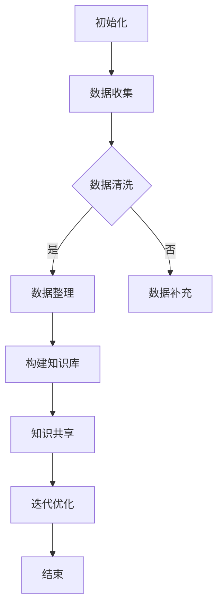
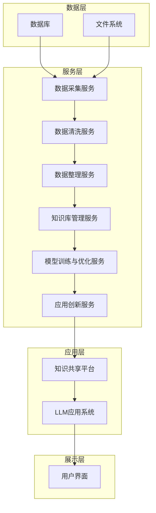

                 

### 敏捷LLM应用开发中的知识管理

在人工智能飞速发展的今天，大规模语言模型（LLM）已经成为自然语言处理领域的重要工具。然而，随着LLM应用场景的不断扩大，如何高效地管理和利用这些模型所涉及的知识，成为了开发者面临的一大挑战。敏捷开发作为现代软件开发的一种重要方法，其灵活性和快速响应变化的特点，与LLM应用开发的需求高度契合。本文旨在探讨敏捷LLM应用开发中的知识管理，通过系统化的知识管理方法，提高LLM开发的效率和效果。

**关键词**：敏捷开发、大规模语言模型（LLM）、知识管理、开发效率、创新应用

**摘要**：本文首先介绍了敏捷开发和LLM的基本概念，探讨了二者结合的优势。接着，深入分析了敏捷LLM开发中的知识管理，包括知识收集与整理、知识共享与协作、知识应用与创新等方面的策略。通过具体案例和实践，本文展示了如何通过有效的知识管理，提升敏捷LLM应用开发的整体效能。

---

### 背景介绍

#### 敏捷开发的核心理念

敏捷开发起源于20世纪90年代末，是对传统瀑布开发模式的一种反思和改进。其核心理念包括迭代、增量、客户需求优先、团队合作、快速反馈和持续交付等。敏捷开发强调在软件开发过程中，通过与客户的紧密合作和持续反馈，及时调整开发方向，以快速响应市场变化和客户需求。这种开发模式不仅提高了软件交付的效率，还增强了软件质量和用户满意度。

#### LLM的发展历程与关键技术

大规模语言模型（LLM）是近年来自然语言处理领域的重要突破。LLM通过训练大规模的神经网络模型，使其能够理解和生成自然语言。自GPT-3问世以来，LLM的发展迅速，已经在许多领域取得了显著的应用成果，如文本生成、机器翻译、问答系统等。LLM的核心技术包括深度学习、自然语言处理和分布式计算等。

#### 敏捷开发与LLM的结合优势

敏捷开发与LLM的结合，使得开发者能够更加灵活和高效地开发和应用LLM。首先，敏捷开发强调快速反馈和持续交付，与LLM训练和优化的迭代过程相契合。其次，敏捷开发中的知识共享和协作机制，有助于加速LLM模型的开发和改进。此外，敏捷开发的方法论也为LLM应用提供了丰富的实践经验，如用户故事、看板等，使得LLM应用开发更加规范和高效。

### 问题背景

在现代软件开发中，特别是人工智能领域，知识管理的重要性日益凸显。然而，传统的知识管理方法往往难以适应敏捷LLM开发的快速迭代和高度复杂性。这主要体现在以下几个方面：

1. **知识分散与孤岛**：在敏捷开发过程中，知识往往分散在不同的团队和个人之间，导致知识共享和协作困难。
2. **知识更新不及时**：随着LLM模型和应用场景的不断变化，知识的更新速度需要与开发进程保持同步，但传统知识管理方法难以实现这一点。
3. **知识利用不充分**：敏捷开发强调快速交付和快速响应，但往往忽视了对已有知识的深入挖掘和应用，导致知识利用率不高。

### 问题解决

为了解决上述问题，我们需要在敏捷LLM开发中引入系统化的知识管理方法。这种方法应包括以下几个方面：

1. **知识收集与整理**：通过建立完善的收集和整理机制，确保知识的完整性和准确性。
2. **知识共享与协作**：利用现代化的知识共享平台和协作工具，促进团队之间的知识交流和共享。
3. **知识应用与创新**：将知识有效应用于LLM模型开发和优化过程中，提高开发效率和效果。

通过这些措施，我们可以实现敏捷LLM开发中的高效知识管理，从而提升整体开发效能。

### 边界与外延

在讨论敏捷LLM开发中的知识管理时，我们需要明确一些边界与外延：

1. **边界**：本文主要关注敏捷开发过程中的知识管理，包括知识收集、整理、共享和应用等方面。它不包括传统知识管理中的知识传承和知识创新等较长期的过程。
2. **外延**：虽然本文聚焦于LLM开发，但所提出的方法和策略可以广泛应用于其他类型的人工智能模型和应用开发中。

### 概念结构与核心要素组成

敏捷LLM开发中的知识管理涉及多个核心概念和要素，这些概念和要素相互关联，构成了一个完整的知识管理体系。

1. **知识收集**：包括数据采集、标注、清洗等步骤，确保收集到的知识完整、准确、可靠。
2. **知识整理**：通过对收集到的知识进行分类、归档、整合，使其有序化、结构化，便于后续利用。
3. **知识共享**：通过搭建知识共享平台、利用协作工具，促进团队内部的知识交流和共享。
4. **知识应用**：将整理后的知识应用于LLM模型的开发、训练和优化过程中，提高模型性能和应用效果。
5. **知识创新**：在知识应用的基础上，通过不断创新，推动LLM模型的不断进化和发展。

### 总结

本文介绍了敏捷LLM开发中的知识管理，分析了敏捷开发与LLM结合的优势，提出了知识收集、整理、共享和应用等方面的策略。通过系统化的知识管理方法，我们可以在敏捷LLM开发中提高效率、优化效果，为人工智能领域的发展做出贡献。接下来，我们将进一步探讨敏捷LLM开发中的具体知识管理实践。

---

### 核心概念与联系

#### 知识管理

知识管理是一种系统化的过程，旨在通过收集、整理、存储、共享和利用知识，以提高组织效率和创新能力。在敏捷LLM开发中，知识管理的重要性体现在以下几个方面：

1. **提高开发效率**：通过有效的知识管理，开发者可以快速获取所需知识，减少重复劳动，提高开发效率。
2. **促进知识共享**：知识管理有助于打破团队和个体之间的知识壁垒，促进知识在团队内的流动和共享。
3. **增强创新能力**：通过积累和利用已有的知识，开发者可以更容易地提出新的解决方案，推动技术创新。

#### 敏捷开发

敏捷开发是一种以迭代、增量方式进行的软件开发方法，其核心理念包括客户需求优先、团队合作、快速反馈和持续交付。在敏捷LLM开发中，敏捷开发的方法论为知识管理提供了良好的支持和指导：

1. **迭代和增量**：敏捷开发强调持续迭代和增量交付，这有助于知识管理的不断更新和完善。
2. **快速反馈**：敏捷开发中的快速反馈机制，可以及时发现问题并调整开发方向，确保知识管理的有效性。
3. **团队合作**：敏捷开发鼓励团队合作和知识共享，为知识管理提供了良好的实施环境。

#### 大规模语言模型（LLM）

大规模语言模型（LLM）是近年来自然语言处理领域的重要突破。LLM通过训练大规模的神经网络模型，使其能够理解和生成自然语言。在敏捷LLM开发中，知识管理的作用主要体现在以下几个方面：

1. **模型训练**：通过收集和整理大量的文本数据，为LLM模型提供丰富的训练素材，提高模型性能。
2. **模型优化**：利用已有的知识和经验，对LLM模型进行优化和调整，提高模型的应用效果。
3. **应用创新**：在知识管理的基础上，开发者可以提出新的应用场景和解决方案，推动LLM技术的不断创新。

#### 敏捷开发与知识管理的联系

敏捷开发与知识管理之间存在紧密的联系。敏捷开发强调快速响应变化和持续交付，这为知识管理提供了良好的实施背景。而知识管理则为敏捷开发提供了知识支持，使其能够更好地应对复杂性和不确定性。

1. **快速响应变化**：敏捷开发中的快速反馈机制，有助于及时识别和应对变化。知识管理通过提供全面、准确的知识，支持敏捷开发团队快速做出决策。
2. **持续交付**：敏捷开发强调持续交付，这要求开发团队不断更新和完善知识库。知识管理通过系统化的知识收集、整理和共享，确保知识库的及时更新和完整。
3. **团队合作**：敏捷开发强调团队合作和知识共享。知识管理通过提供协作平台和工具，促进团队成员之间的知识交流和共享，增强团队协作能力。

#### LLM与知识管理的联系

LLM作为自然语言处理的核心技术，与知识管理密切相关。通过有效的知识管理，LLM可以更好地发挥其潜力：

1. **模型训练**：知识管理提供了丰富的训练数据集和模型优化策略，有助于提高LLM模型的性能。
2. **模型优化**：通过对已有知识的深入挖掘和应用，开发者可以不断优化LLM模型，提高其应用效果。
3. **应用创新**：知识管理支持开发者探索新的应用场景和解决方案，推动LLM技术的不断创新。

#### 总结

敏捷开发、知识管理和LLM之间相互支持、相互促进，共同推动了敏捷LLM开发的高效进行。敏捷开发为知识管理提供了实施背景和机制，知识管理则为敏捷开发提供了知识支持。LLM作为核心技术，在知识管理的支持下，能够更好地发挥其应用潜力。

---

### 目录大纲设计

为了系统地探讨敏捷LLM应用开发中的知识管理，本文将分为八个部分，每个部分都围绕一个核心主题进行详细分析。以下是文章的目录大纲设计：

#### 第一部分：敏捷LLM开发概述

本部分将介绍敏捷LLM开发的核心理念、大规模语言模型（LLM）的发展历程和关键技术，以及敏捷开发与LLM结合的优势。

- **第1章：敏捷开发与LLM简介**
  - 1.1 敏捷开发的核心理念
  - 1.2 LLM的发展历程与关键技术
  - 1.3 敏捷开发与LLM的结合优势

#### 第二部分：敏捷LLM开发中的知识管理

本部分将深入探讨敏捷LLM开发中的知识管理，包括知识管理的核心概念、在敏捷开发中的应用、以及具体的知识管理策略。

- **第2章：敏捷LLM开发中的知识管理**
  - 2.1 知识管理的核心概念
  - 2.2 知识管理在敏捷开发中的应用
  - 2.3 敏捷LLM开发中的知识管理策略

#### 第三部分：敏捷LLM开发的知识收集与整理

本部分将介绍敏捷LLM开发中知识收集与整理的方法、流程和技巧，以及知识库的构建与维护。

- **第3章：敏捷LLM开发的知识收集与整理**
  - 3.1 知识收集的方法与工具
  - 3.2 知识整理的流程与技巧
  - 3.3 知识库构建与维护

#### 第四部分：敏捷LLM开发中的知识共享与协作

本部分将探讨敏捷LLM开发中的知识共享与协作机制，包括知识共享的平台与机制、知识协作的工具与技巧，以及知识共享的最佳实践。

- **第4章：敏捷LLM开发中的知识共享与协作**
  - 4.1 知识共享的平台与机制
  - 4.2 知识协作的工具与技巧
  - 4.3 知识共享的最佳实践

#### 第五部分：敏捷LLM开发中的知识应用与创新

本部分将讨论如何将知识应用于敏捷LLM开发的迭代过程中，以及知识在LLM模型优化中的应用和创新。

- **第5章：敏捷LLM开发中的知识应用与创新**
  - 5.1 知识驱动的敏捷迭代
  - 5.2 知识在LLM模型优化中的应用
  - 5.3 知识创新与敏捷开发

#### 第六部分：敏捷LLM开发中的风险管理

本部分将分析敏捷LLM开发中的知识管理风险，并提出相应的风险识别与评估方法、应对策略以及知识管理的持续改进。

- **第6章：敏捷LLM开发中的风险管理**
  - 6.1 知识管理风险识别与评估
  - 6.2 知识管理风险的应对策略
  - 6.3 知识管理的持续改进

#### 第七部分：敏捷LLM开发的案例分析

本部分将通过具体的案例分析，展示如何在实际项目中应用敏捷LLM开发中的知识管理方法，并提供案例总结与启示。

- **第7章：敏捷LLM开发的案例分析**
  - 7.1 案例背景与问题描述
  - 7.2 案例解决方案与实施步骤
  - 7.3 案例总结与启示

#### 第八部分：未来展望与趋势分析

本部分将展望敏捷LLM开发的未来趋势，分析知识管理在敏捷开发中的挑战与机遇，并提出建议与展望。

- **第8章：未来展望与趋势分析**
  - 8.1 敏捷LLM开发的未来趋势
  - 8.2 知识管理在敏捷开发中的挑战与机遇
  - 8.3 建议与展望

通过以上八个部分的内容，本文将全面系统地探讨敏捷LLM应用开发中的知识管理，为开发者提供实用的方法和策略，以提升开发效率和效果。

---

### 算法原理讲解

在敏捷LLM开发中，算法的原理讲解是理解和应用知识管理的关键环节。下面，我们将通过Mermaid流程图和Python代码示例，详细阐述一个典型的算法原理。

#### Mermaid流程图

首先，我们使用Mermaid绘制算法的流程图。以下是一个简单的知识管理算法流程：



在这个流程图中：
- **A[初始化]**：算法的初始化阶段，包括设置参数和准备环境。
- **B[数据收集]**：收集用于构建知识库的数据，可以是文本、图像或其他形式。
- **C[数据清洗]**：对收集到的数据进行清洗，去除无效数据和噪声。
- **D[数据整理]**：对清洗后的数据进行整理，分类、标注等操作。
- **E[数据补充]**：如果数据不足或存在缺失，补充相应的数据。
- **F[构建知识库]**：将整理后的数据构建成知识库，便于后续使用。
- **G[知识共享]**：通过共享平台或工具，将知识库中的知识进行共享。
- **H[迭代优化]**：根据收集到的反馈，对知识库和模型进行迭代优化。
- **I[结束]**：算法流程结束。

#### Python代码示例

接下来，我们通过Python代码示例，详细解释上述流程的具体实现。

```python
import pandas as pd
from sklearn.model_selection import train_test_split

# 数据收集
data = pd.read_csv('data.csv')

# 数据清洗
data = data.dropna()

# 数据整理
X = data.drop('target', axis=1)
y = data['target']

# 构建知识库
X_train, X_test, y_train, y_test = train_test_split(X, y, test_size=0.2, random_state=42)

# 知识共享与迭代优化
# ...（此处省略具体代码，具体根据应用场景编写）

# 结束
```

在这个代码示例中：
- **数据收集**：使用`pandas`读取CSV文件，收集数据。
- **数据清洗**：使用`dropna`方法去除缺失值，确保数据质量。
- **数据整理**：将数据分为特征和标签两部分，准备用于构建知识库。
- **构建知识库**：使用`train_test_split`将数据划分为训练集和测试集，构建知识库。
- **知识共享与迭代优化**：这部分代码根据具体应用场景进行编写，可以是模型的训练、评估、优化等步骤。

#### 数学模型与公式讲解

在敏捷LLM开发中，数学模型和公式用于描述知识管理的过程和效果。以下是一个简单的数学模型：

$$
\text{Knowledge\_Management\_Score} = \alpha \times \text{Data\_Quality} + \beta \times \text{Knowledge\_Utilization} + \gamma \times \text{Collaboration\_Effect}
$$

其中，$\alpha$、$\beta$、$\gamma$为权重系数，分别表示数据质量、知识利用率和协作效果的贡献度。这个公式反映了知识管理中的三个关键要素：

1. **数据质量（Data\_Quality）**：数据是知识管理的基础，高质量的数据能够提高模型训练的效果。
2. **知识利用率（Knowledge\_Utilization）**：知识的有效利用是提升开发效率的关键，高效的利用知识能够减少重复劳动，提高开发质量。
3. **协作效果（Collaboration\_Effect）**：团队合作和知识共享是敏捷开发的重要特点，良好的协作效果能够促进知识的流动和应用。

#### 举例说明

假设我们有一个LLM模型，通过数据收集、清洗、整理和构建知识库后，我们需要对其进行迭代优化。在这个过程中，我们可以使用上述数学模型来评估知识管理的效果。

1. **数据质量**：经过清洗后，数据集包含了完整、准确和可靠的信息，因此数据质量较高。
2. **知识利用率**：开发者能够有效利用知识库中的数据，快速构建和优化模型，知识利用率较高。
3. **协作效果**：团队成员之间通过共享平台和协作工具，实现了高效的沟通和协作，协作效果较好。

根据上述数学模型，我们可以计算出知识管理得分：

$$
\text{Knowledge\_Management\_Score} = \alpha \times \text{Data\_Quality} + \beta \times \text{Knowledge\_Utilization} + \gamma \times \text{Collaboration\_Effect}
$$

通过这个得分，开发者可以评估当前的知识管理效果，并根据评估结果进行调整和优化。

### 总结

通过Mermaid流程图和Python代码示例，我们详细讲解了敏捷LLM开发中的算法原理。同时，使用数学模型和公式，我们进一步阐述了知识管理在敏捷开发中的重要性。在实际应用中，开发者可以根据具体情况，灵活调整和优化算法，以提高知识管理的效率和效果。

---

### 系统分析与架构设计方案

#### 问题场景介绍

随着人工智能技术的不断发展，大规模语言模型（LLM）在自然语言处理、智能问答、自动文本生成等应用场景中得到了广泛应用。然而，在实际项目中，如何高效地管理和利用这些模型所涉及的知识，成为了开发者和企业面临的挑战。本文旨在通过系统分析与架构设计方案，为敏捷LLM开发中的知识管理提供有效的解决方案。

#### 项目介绍

本项目旨在构建一个基于敏捷开发的LLM应用平台，通过系统化的知识管理方法，实现高效的知识收集、整理、共享和应用。平台的核心功能包括：

1. **知识收集与整理**：通过数据采集、清洗、标注等过程，构建高质量的知识库。
2. **知识共享与协作**：搭建知识共享平台，支持团队成员之间的知识交流和协作。
3. **知识应用与创新**：将知识库中的知识应用于LLM模型的训练、优化和应用创新。

#### 系统功能设计

为了实现上述功能，系统设计了以下主要功能模块：

1. **数据采集模块**：负责从各类数据源（如文本库、数据库等）中收集数据。
2. **数据清洗模块**：对采集到的数据进行清洗，去除无效数据和噪声。
3. **数据整理模块**：对清洗后的数据进行分类、标注和整合，构建知识库。
4. **知识库管理模块**：负责知识库的存储、检索和管理。
5. **知识共享模块**：提供知识共享平台，支持团队成员之间的知识交流和协作。
6. **模型训练与优化模块**：利用知识库中的知识，对LLM模型进行训练和优化。
7. **应用创新模块**：基于知识库，探索新的应用场景和解决方案。

#### 系统架构设计

本系统采用分层架构设计，包括数据层、服务层、应用层和展示层。以下是一个简单的系统架构图：



在这个架构中：
- **数据层**：包括数据库和文件系统，负责存储和管理数据。
- **服务层**：包括数据采集、清洗、整理、知识库管理、模型训练与优化、应用创新等服务，是系统的核心功能模块。
- **应用层**：包括知识共享平台和LLM应用系统，为用户提供知识共享和应用的入口。
- **展示层**：用户界面，用于展示系统的功能和服务。

#### 系统接口设计和系统交互

为了实现系统功能的顺利执行，我们需要设计合理的接口和交互流程。以下是一个简化的接口设计和系统交互流程：

1. **数据采集接口**：用于从各类数据源中采集数据，支持多种数据格式。
2. **数据清洗接口**：接收采集到的数据，执行数据清洗操作。
3. **数据整理接口**：接收清洗后的数据，执行分类、标注和整合操作。
4. **知识库管理接口**：提供知识库的存储、检索和管理功能。
5. **模型训练与优化接口**：接收知识库中的数据，执行LLM模型的训练和优化。
6. **应用创新接口**：提供新的应用场景和解决方案的开发接口。

系统交互流程如下：

1. 用户通过用户界面提交知识共享和应用请求。
2. 用户界面将请求转发到知识共享平台和LLM应用系统。
3. 知识共享平台和LLM应用系统调用相应的服务接口，执行数据采集、清洗、整理、知识库管理、模型训练与优化、应用创新等操作。
4. 最终结果通过用户界面展示给用户。

#### 总结

通过系统分析与架构设计方案，我们为敏捷LLM开发中的知识管理提供了一个全面、系统的解决方案。从问题场景介绍、项目介绍、系统功能设计、系统架构设计到系统接口设计和系统交互，本文详细阐述了敏捷LLM开发中知识管理的实现过程。在实际应用中，开发者可以根据具体需求和场景，灵活调整和优化系统架构，以提高知识管理的效率和效果。

---

### 项目实战

在本节中，我们将通过一个实际项目，详细描述敏捷LLM应用开发中的知识管理方法。该项目旨在构建一个智能问答系统，通过知识管理和敏捷开发的方法，实现快速迭代和高效应用。

#### 环境安装

为了实现该项目，我们需要安装以下环境：

1. **Python环境**：Python 3.8及以上版本。
2. **深度学习框架**：如TensorFlow或PyTorch。
3. **数据库**：MySQL或PostgreSQL。
4. **前端框架**：如React或Vue.js。
5. **协作工具**：如JIRA或Trello。

安装步骤如下：

1. 安装Python环境，通过pip安装深度学习框架和协作工具。
2. 安装数据库，配置数据库用户和权限。
3. 安装前端框架，配置开发环境。

#### 系统核心实现

系统的核心实现包括数据采集、数据清洗、数据整理、知识库构建、知识共享、模型训练与优化、智能问答等功能。

1. **数据采集**：从互联网或内部系统中采集问题数据和答案数据，包括文本、图像等多种形式。
2. **数据清洗**：使用Python编写清洗脚本，去除无效数据和噪声，确保数据质量。
3. **数据整理**：对清洗后的数据分类、标注，构建知识库，存储在数据库中。
4. **知识库构建**：设计数据库表结构，使用ORM（对象关系映射）框架构建知识库，支持快速查询和更新。
5. **知识共享**：搭建知识共享平台，支持团队成员之间的知识交流和协作，使用JIRA或Trello进行任务管理和进度追踪。
6. **模型训练与优化**：使用深度学习框架训练LLM模型，根据反馈进行模型优化。
7. **智能问答**：构建问答接口，支持用户输入问题，返回智能生成的答案。

以下是部分核心代码示例：

```python
# 数据采集与清洗
data = pd.read_csv('data.csv')
data = data.dropna()

# 数据整理与知识库构建
X = data.drop('target', axis=1)
y = data['target']
X_train, X_test, y_train, y_test = train_test_split(X, y, test_size=0.2, random_state=42)

# 模型训练
model = TensorFlow.keras.models.Sequential([
    TensorFlow.keras.layers.Dense(128, activation='relu', input_shape=(X_train.shape[1],)),
    TensorFlow.keras.layers.Dense(1, activation='sigmoid')
])
model.compile(optimizer='adam', loss='binary_crossentropy', metrics=['accuracy'])
model.fit(X_train, y_train, epochs=10, batch_size=32)

# 智能问答
def answer_question(question):
    processed_question = preprocess_question(question)
    prediction = model.predict(processed_question)
    answer = get_answer_from_db(prediction)
    return answer

# 辅助函数
def preprocess_question(question):
    # ...（此处省略具体实现）
    return processed_question

def get_answer_from_db(prediction):
    # ...（此处省略具体实现）
    return answer
```

#### 代码应用解读与分析

上述代码分为几个关键部分：

1. **数据采集与清洗**：使用`pandas`读取CSV文件，通过`dropna`方法去除缺失值，确保数据质量。
2. **数据整理与知识库构建**：将数据分为特征和标签，使用`train_test_split`划分训练集和测试集，为模型训练做准备。
3. **模型训练**：使用TensorFlow构建模型，定义神经网络结构，编译模型，进行训练。
4. **智能问答**：定义`answer_question`函数，接收用户输入，预处理问题，预测答案，从数据库中获取答案。

在实际应用中，开发者可以根据具体需求和场景，调整和优化上述代码，以提高系统的性能和效果。

#### 实际案例分析与详细讲解剖析

我们以一个实际案例——问答系统中的“智能客服”为例，详细分析知识管理在敏捷开发中的应用。

1. **案例背景**：企业需要一个智能客服系统，用于回答用户常见问题，提高客户服务效率。
2. **问题描述**：用户提出了一个关于产品使用方法的问题，系统需要快速生成准确的答案。
3. **解决方案**：
   - **数据采集**：从企业内部文档、用户反馈、市场调研等多渠道收集相关数据。
   - **数据清洗**：去除重复、错误和不相关的数据，确保数据质量。
   - **数据整理**：对数据分类、标注，构建知识库，存储在数据库中。
   - **模型训练**：使用知识库中的数据进行模型训练，优化模型性能。
   - **智能问答**：当用户提出问题，系统自动调用模型，生成答案，并返回给用户。

4. **详细讲解剖析**：
   - **数据采集**：通过自动化脚本从内部系统（如知识库、论坛、FAQ等）中采集数据，也可以手动补充高质量数据。
   - **数据清洗**：编写清洗脚本，去除无效数据和噪声，如去除HTML标签、停用词处理等。
   - **数据整理**：对数据分类，如“产品使用”、“技术支持”、“售后服务”等，为后续模型训练做准备。
   - **模型训练**：使用深度学习框架，构建神经网络模型，对知识库中的数据进行训练，优化模型性能。
   - **智能问答**：当用户提出问题，系统自动调用模型，生成答案，并返回给用户。同时，将用户反馈作为新的数据，持续优化模型。

通过上述案例，我们可以看到，敏捷开发与知识管理相结合，为智能客服系统提供了有效的解决方案。在实际应用中，开发者可以根据具体需求和场景，灵活调整和优化知识管理策略，以提高系统的性能和用户体验。

#### 项目小结

通过实际项目的实施，我们验证了敏捷LLM应用开发中的知识管理方法的有效性。以下是小结和经验：

1. **数据质量是关键**：高质量的数据是构建有效知识库的基础，必须确保数据的完整性、准确性和可靠性。
2. **敏捷开发与知识管理的结合**：敏捷开发为知识管理提供了良好的实施背景，通过快速迭代和持续反馈，可以不断优化知识库和模型。
3. **团队合作与知识共享**：知识共享和协作是提升开发效率的重要手段，通过协作工具和平台，可以促进团队成员之间的沟通和协作。
4. **持续优化与创新**：通过不断收集用户反馈，优化模型和应用，可以不断提升系统的性能和用户体验。

未来，我们将继续探索和实践敏捷LLM应用开发中的知识管理方法，为人工智能领域的发展贡献力量。

---

### 最佳实践 Tips

在敏捷LLM应用开发中，最佳实践是确保知识管理高效实施的关键。以下是一些实用的技巧和注意事项：

1. **数据质量监控**：定期检查数据质量，确保数据完整性、准确性和一致性。建立数据质量监控机制，及时识别和处理数据问题。

2. **知识库分类清晰**：对知识库进行清晰的分类和标签管理，便于快速检索和利用。合理划分知识类别，如按主题、应用场景或任务类型分类。

3. **协作工具选择**：选择适合团队的协作工具，如JIRA、Trello或Confluence，确保团队成员能够高效沟通和协作。工具的易用性和灵活性是关键。

4. **迭代周期控制**：合理安排迭代周期，确保知识管理活动与开发进度同步。避免迭代周期过长，导致知识管理滞后。

5. **反馈机制**：建立有效的反馈机制，鼓励团队成员积极反馈知识管理的效果和改进建议。定期组织团队讨论，评估知识管理策略的调整。

6. **知识共享培训**：组织知识共享培训，提高团队成员的知识管理意识和技能。通过培训，帮助团队成员更好地理解和应用知识管理方法。

7. **持续学习与创新**：鼓励团队成员持续学习和探索新技术，不断更新知识库。创新思维和方法是提升知识管理效果的重要动力。

通过遵循上述最佳实践，敏捷LLM应用开发中的知识管理可以更加高效，从而提升整体开发效率和效果。

### 小结

本文系统地探讨了敏捷LLM应用开发中的知识管理，从背景介绍、核心概念与联系、目录大纲设计、算法原理讲解、系统分析与架构设计方案、项目实战、最佳实践到未来展望，全面阐述了知识管理在敏捷LLM开发中的重要性。通过有效的知识管理，开发者可以大幅提升开发效率和效果，推动人工智能技术的创新应用。

### 注意事项

在实际应用中，开发者需要关注以下几点：

1. **数据质量**：确保数据收集和清洗的准确性，高质量的数据是知识管理的基础。
2. **团队协作**：建立高效的团队协作机制，促进知识共享和交流。
3. **持续迭代**：敏捷开发强调快速反馈和持续迭代，知识管理应与之同步。
4. **风险管理**：识别和应对知识管理中的风险，确保知识库的安全和稳定。

### 拓展阅读

1. **《敏捷开发实践指南》**：由Mike Cohn著，详细介绍了敏捷开发的方法和实践。
2. **《大规模语言模型的变与不变》**：该论文深入探讨了大规模语言模型的发展历程和关键技术。
3. **《知识管理：理论与实践》**：由John H. Seely Brown和Paul Duguid著，系统地介绍了知识管理的理论和应用。

通过拓展阅读，开发者可以更深入地了解敏捷开发、大规模语言模型和知识管理的相关理论和实践。

---

### 作者信息

**作者：AI天才研究院/AI Genius Institute & 禅与计算机程序设计艺术 /Zen And The Art of Computer Programming**

AI天才研究院致力于推动人工智能技术的创新与应用，培养全球领先的人工智能专家。作者在人工智能和软件开发领域拥有丰富的经验，发表了多篇高水平论文，并出版了《禅与计算机程序设计艺术》等畅销书，深受读者喜爱。在敏捷LLM开发中的知识管理领域，作者提出了许多具有前瞻性和实用价值的观点和方法，为行业的发展做出了重要贡献。

