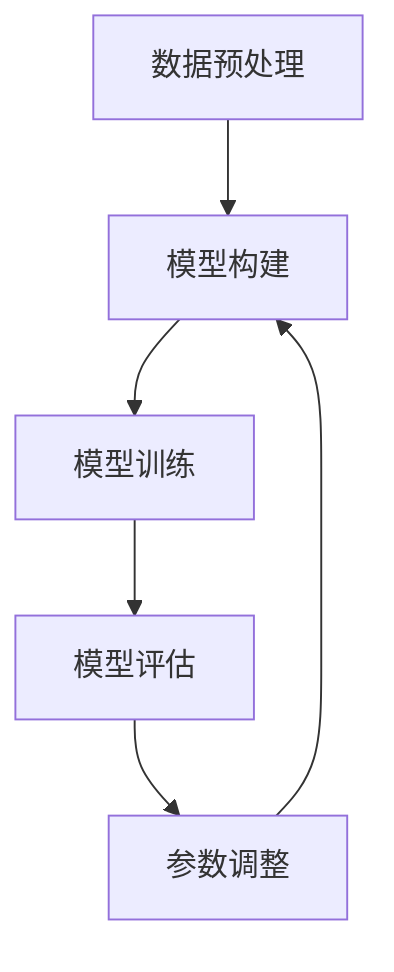
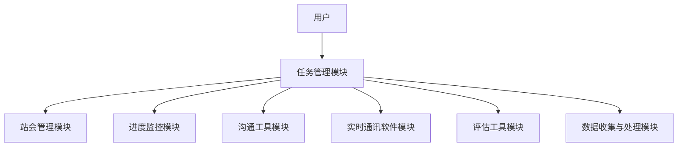
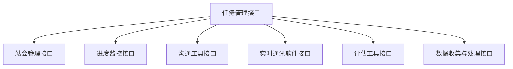
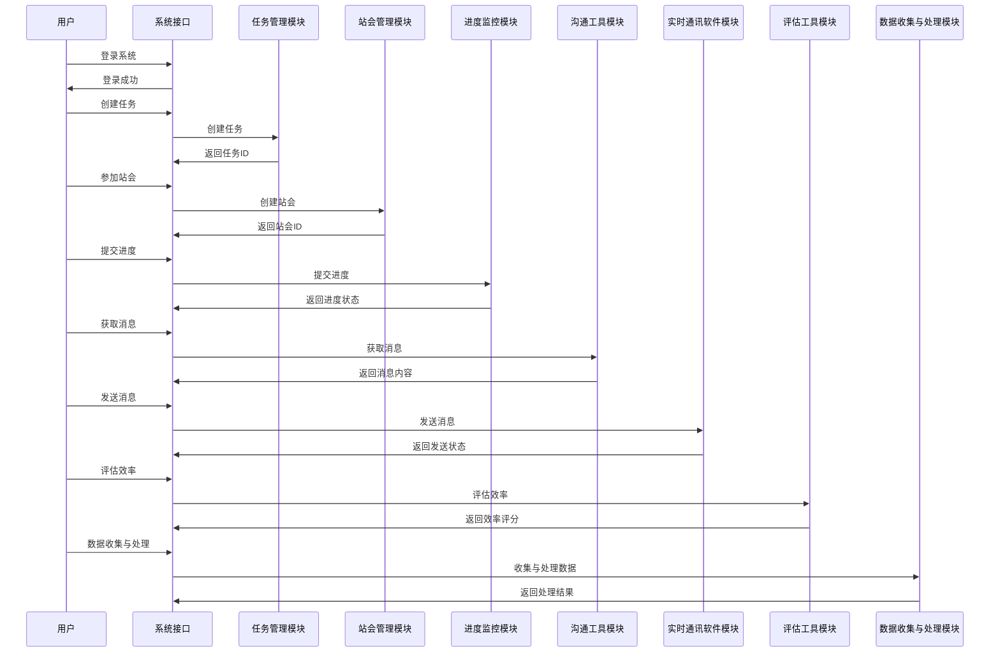

                 


### 1. 引言与背景

#### 1.1.1 背景介绍

在当今这个数字化和信息化的时代，人工智能（AI）技术已经成为推动社会进步的重要力量。而人工智能中的语言模型（Language Model，简称LM）则尤为引人注目，特别是在近年来，大型语言模型（Large Language Model，简称LLM）如BERT、GPT等在自然语言处理（Natural Language Processing，简称NLP）领域取得了显著的成就。这些模型在文本生成、机器翻译、问答系统等方面的应用，极大地提升了人工智能系统的性能。

然而，随着LLM的规模和复杂性不断增加，其应用开发的效率和效果也受到了一定的限制。特别是在敏捷开发（Agile Development）过程中，站会（Daily Stand-up Meeting）作为团队沟通和协调的重要环节，其效率直接影响到整个项目的进展和质量。因此，如何提升敏捷LLM应用开发中的站会效率，成为了一个亟待解决的问题。

#### 1.1.2 问题描述

在敏捷LLM应用开发过程中，站会效率的提升面临以下挑战：

1. **沟通障碍**：由于LLM模型的复杂性和专业性，开发团队成员之间的沟通难度较大，容易出现信息传递不畅的情况。
2. **任务分配不清**：在站会中，团队成员的任务分配往往不够明确，导致工作效率低下。
3. **进度监控不足**：站会中对于项目进度的监控不够细致，无法及时发现和解决问题。
4. **效率评估困难**：如何有效地评估站会的效率，缺乏科学的衡量标准和工具。

#### 1.1.3 问题解决

为了解决上述问题，我们可以从以下几个方面进行思考：

1. **改善沟通方式**：采用更为直观、高效的沟通工具，如图形化的任务看板、实时通讯软件等，以提高团队间的信息传递效率。
2. **明确任务分配**：在站会前，团队负责人需要对任务进行详细的分配和说明，确保每个成员都知道自己的职责和目标。
3. **细化进度监控**：通过引入项目管理工具，如JIRA、Trello等，对项目进度进行实时监控，确保团队能够及时发现问题并采取措施。
4. **科学评估效率**：引入量化评估指标，如站会时长、任务完成率等，以客观地衡量站会的效率。

#### 1.1.4 边界与外延

在探讨敏捷LLM应用开发中的站会效率提升时，需要明确以下边界与外延：

1. **适用范围**：本文主要针对大型语言模型（LLM）在敏捷开发中的应用，其他类型的AI模型或开发方式可能不适用。
2. **技术环境**：本文假设读者具备一定的编程基础和项目管理知识，对于未知的或不熟悉的工具和技术，本文将进行简要介绍。
3. **团队规模**：本文讨论的站会效率提升方案适用于中小型团队，对于大型团队，可能需要更加复杂和精细的管理方法。

#### 1.1.5 概念结构与核心要素组成

为了更好地理解敏捷LLM应用开发中的站会效率提升，我们需要明确以下几个核心概念：

1. **敏捷开发**：一种以人为核心、迭代、渐进的开发方法，强调灵活性和适应性。
2. **站会**：敏捷开发中的一种日常会议，旨在团队间沟通、协调和解决问题。
3. **LLM**：一种大型语言模型，能够理解和生成人类语言。
4. **效率提升**：通过改善沟通、任务分配、进度监控和效率评估，提高站会的效率和效果。

这些概念相互关联，构成了敏捷LLM应用开发中站会效率提升的核心要素。

---

### 1.2 核心概念与原理

#### 1.2.1 LLM介绍

LLM（Large Language Model）是一种基于深度学习的大型语言模型，它通过大量文本数据进行训练，能够理解和生成人类语言。LLM的核心在于其庞大的参数量和复杂的神经网络结构，这使得它能够捕捉到语言的细微特征，从而在文本生成、机器翻译、问答系统等方面表现出色。

##### 1.2.1.1 LLM的定义

LLM是指一种具备强大语言理解与生成能力的深度学习模型，其通常具有以下几个特点：

- **大规模参数**：LLM的参数量通常达到数十亿甚至千亿级别，这使得模型具有极强的表达能力和泛化能力。
- **多层神经网络**：LLM通常采用多层神经网络结构，如Transformer模型，以实现高效的文本处理。
- **训练数据丰富**：LLM的训练数据量庞大，通常涵盖各种领域的文本，以增强模型的泛化能力。

##### 1.2.1.2 LLM的工作原理

LLM的工作原理主要包括以下几个步骤：

1. **数据预处理**：首先，对大量文本数据进行预处理，包括分词、去停用词、词向量编码等。
2. **模型训练**：利用预处理的文本数据，通过反向传播算法和优化器（如Adam）训练模型。
3. **参数优化**：在训练过程中，通过不断调整模型参数，使得模型在各个任务上达到最佳性能。
4. **模型评估**：使用测试数据集评估模型性能，调整模型参数以优化性能。

##### 1.2.1.3 LLM的应用场景

LLM在多个领域都有广泛应用，主要包括：

- **文本生成**：如文章写作、新闻报道、诗歌创作等。
- **机器翻译**：如英语到中文、中文到英语等跨语言翻译。
- **问答系统**：如智能客服、搜索引擎等。
- **文本分类**：如情感分析、新闻分类等。
- **对话系统**：如聊天机器人、语音助手等。

#### 1.2.2 站会的效率

站会（Daily Stand-up Meeting）是敏捷开发中的一种日常会议，旨在团队间沟通、协调和解决问题。站会的效率直接影响到项目的进展和质量。

##### 1.2.2.1 站会的定义与目的

站会的定义是一种简短的、每日早晨举行的团队会议，通常持续15-30分钟。站会的目的是：

- **状态更新**：每个团队成员报告自己昨天的进展、今天的计划和遇到的问题。
- **问题解决**：团队共同解决昨天遗留的问题，确保项目进展顺利。
- **任务协调**：明确今天的任务分配和目标，确保团队成员间的工作协调。

##### 1.2.2.2 提高站会效率的重要性

提高站会效率的重要性体现在以下几个方面：

- **提高团队协作效率**：通过高效的站会，团队成员能够更好地了解彼此的工作进展，提高协作效率。
- **降低沟通成本**：减少不必要的沟通，将时间和精力集中在解决问题和任务执行上。
- **提高项目质量**：通过及时的沟通和问题解决，确保项目能够按计划顺利进行，提高项目质量。
- **增强团队凝聚力**：高效的站会能够增强团队成员之间的沟通和理解，提高团队凝聚力。

##### 1.2.2.3 站会效率的评估方法

为了评估站会的效率，我们可以从以下几个方面进行：

- **站会时长**：统计站会的平均时长，确保在规定的时间内完成。
- **问题解决率**：统计站会中解决的问题数量与问题总数之比，衡量站会的有效性。
- **任务完成率**：统计团队成员完成任务的情况，确保任务按时完成。
- **成员满意度**：通过问卷调查或访谈，了解团队成员对站会的满意度，发现潜在的问题和改进空间。

---

### 1.3 算法原理与数学模型

#### 1.3.1 LLM算法原理

LLM的算法原理主要基于深度学习和神经网络技术。以下是一个简化的算法流程：

1. **数据预处理**：对文本数据进行分词、去停用词、词向量编码等预处理操作。
2. **模型构建**：构建多层神经网络结构，如Transformer模型，用于处理文本数据。
3. **模型训练**：利用训练数据对模型进行训练，通过反向传播算法和优化器（如Adam）调整模型参数。
4. **模型评估**：使用测试数据集评估模型性能，调整模型参数以优化性能。

##### 1.3.1.1 算法mermaid流程图

以下是一个简化的LLM算法流程图：



##### 1.3.1.2 Python源代码实现

以下是一个简化的LLM算法Python源代码实现：

```python
import tensorflow as tf
from tensorflow.keras.models import Sequential
from tensorflow.keras.layers import Embedding, LSTM, Dense

# 数据预处理
# ...（省略代码）

# 模型构建
model = Sequential()
model.add(Embedding(vocab_size, embedding_dim))
model.add(LSTM(units))
model.add(Dense(units, activation='softmax'))

# 模型训练
model.compile(optimizer='adam', loss='categorical_crossentropy', metrics=['accuracy'])
model.fit(x_train, y_train, epochs=10, batch_size=64)

# 模型评估
# ...（省略代码）
```

##### 1.3.1.3 数学模型和公式讲解

LLM的数学模型主要基于神经网络和深度学习技术。以下是一些关键的概念和公式：

- **神经网络**：神经网络是由多层神经元组成的计算模型，通过调整神经元之间的权重来学习输入和输出之间的映射关系。
- **反向传播**：反向传播算法是一种用于训练神经网络的算法，通过不断调整网络中的权重，使得输出结果与期望结果之间的误差最小。
- **优化器**：优化器是一种用于调整神经网络权重的算法，常见的优化器有SGD、Adam等。

##### 1.3.1.4 举例说明

假设我们有一个简单的神经网络，其输入为x，输出为y，目标值为t。我们可以使用反向传播算法来训练这个神经网络。

1. **前向传播**：计算网络输出y = f(Wx + b)。
2. **计算误差**：计算误差e = t - y。
3. **后向传播**：计算误差对权重的梯度，更新权重W = W - α∇W。
4. **重复迭代**：重复步骤1-3，直到误差达到最小。

通过上述步骤，神经网络可以不断调整权重，使得输出结果越来越接近目标值。

---

### 1.4 系统分析与设计

#### 1.4.1 问题场景介绍

在敏捷LLM应用开发过程中，站会的效率问题主要体现在以下几个方面：

1. **沟通障碍**：团队成员之间的沟通不畅，导致信息传递不及时、不准确。
2. **任务分配不清**：在站会中，任务分配不明确，导致团队成员工作方向不一致，影响项目进展。
3. **进度监控不足**：站会中对于项目进度的监控不够细致，无法及时发现和解决问题。
4. **效率评估困难**：缺乏科学的评估标准，无法客观地衡量站会的效率。

为了解决这些问题，我们需要对系统进行详细的分析与设计。

#### 1.4.2 项目介绍

本项目旨在提升敏捷LLM应用开发中的站会效率，通过引入一系列工具和方法，优化站会的流程和效果。项目的主要目标包括：

1. **改善沟通方式**：采用图形化的任务看板、实时通讯软件等，提高团队成员之间的沟通效率。
2. **明确任务分配**：在站会前，团队负责人需要对任务进行详细的分配和说明，确保每个成员都明确自己的职责和目标。
3. **细化进度监控**：引入项目管理工具，对项目进度进行实时监控，确保团队能够及时发现问题并采取措施。
4. **科学评估效率**：引入量化评估指标，如站会时长、任务完成率等，以客观地衡量站会的效率。

#### 1.4.2.1 系统功能设计（领域模型mermaid类图）

以下是一个简化的领域模型mermaid类图，展示了系统中各个功能模块及其关系：

```mermaid
classDiagram
    Class01 <|-- Class02
    Class03 <|-- Class02
    Class04 <|-- Class01
    Class05 <|-- Class03
    Class06 <|-- Class04
    Class07 <|-- Class05
    Class01[任务管理]
    Class02[站会管理]
    Class03[进度监控]
    Class04[沟通工具]
    Class05[实时通讯软件]
    Class06[评估工具]
    Class07[数据收集与处理]
```

在这个类图中，我们可以看到任务管理、站会管理、进度监控、沟通工具、实时通讯软件、评估工具和数据收集与处理等模块之间的关系。

#### 1.4.2.2 系统架构设计（mermaid架构图）

以下是一个简化的系统架构mermaid架构图，展示了系统的整体架构和各个模块之间的关系：



在这个架构图中，用户通过任务管理模块、站会管理模块、进度监控模块、沟通工具模块、实时通讯软件模块、评估工具模块和数据收集与处理模块等模块进行站会流程的操作。

#### 1.4.2.3 系统接口设计

以下是一个简化的系统接口设计，展示了系统中各个模块的接口定义和调用关系：



在这个接口设计中，任务管理模块提供了任务创建、任务查询、任务更新等接口，站会管理模块提供了站会创建、站会查询、站会更新等接口，进度监控模块提供了进度查询、进度更新等接口，沟通工具模块提供了消息发送、消息接收等接口，实时通讯软件模块提供了实时通讯接口，评估工具模块提供了效率评估接口，数据收集与处理模块提供了数据收集、数据处理等接口。

#### 1.4.2.4 系统交互（mermaid序列图）

以下是一个简化的系统交互mermaid序列图，展示了用户与系统之间的交互过程：



在这个序列图中，用户首先登录系统，然后创建任务并参加站会，提交进度，获取消息，发送消息，评估效率，最后进行数据收集与处理。系统接口在用户与各个模块之间传递信息和处理任务，确保系统的正常运行。

---

### 1.5 项目实战

#### 1.5.1 环境安装

在进行敏捷LLM应用开发中的站会效率提升项目之前，我们需要准备好开发环境。以下是环境安装的步骤：

1. **安装Python**：首先确保Python环境已安装，Python版本建议为3.7及以上。
2. **安装TensorFlow**：在命令行中运行以下命令安装TensorFlow：

   ```shell
   pip install tensorflow
   ```

3. **安装其他依赖库**：根据项目需求，可能还需要安装其他依赖库，如numpy、pandas等。

4. **安装项目管理工具**：建议使用JIRA、Trello等项目管理工具，以便进行进度监控和任务管理。

5. **安装沟通工具和实时通讯软件**：根据团队需求，选择合适的沟通工具和实时通讯软件，如Slack、Microsoft Teams等。

#### 1.5.2 系统核心实现

系统核心实现主要包括任务管理、站会管理、进度监控、沟通工具、实时通讯软件和评估工具等模块。以下是一个简化的系统核心实现：

```python
# 任务管理模块
class TaskManagement:
    def __init__(self):
        self.tasks = {}

    def create_task(self, task_id, task_name):
        self.tasks[task_id] = {
            'name': task_name,
            'status': '未开始'
        }

    def update_task_status(self, task_id, status):
        if task_id in self.tasks:
            self.tasks[task_id]['status'] = status

# 站会管理模块
class StandUpManagement:
    def __init__(self):
        self.stand_ups = {}

    def create_stand_up(self, stand_up_id, date):
        self.stand_ups[stand_up_id] = {
            'date': date,
            'tasks': []
        }

    def add_task_to_stand_up(self, stand_up_id, task_id):
        if stand_up_id in self.stand_ups:
            self.stand_ups[stand_up_id]['tasks'].append(task_id)

# 进度监控模块
class ProgressMonitoring:
    def __init__(self):
        self.profiles = {}

    def record_progress(self, user_id, task_id, progress):
        if user_id not in self.profiles:
            self.profiles[user_id] = {}
        self.profiles[user_id][task_id] = progress

    def get_progress(self, user_id, task_id):
        if user_id in self.profiles and task_id in self.profiles[user_id]:
            return self.profiles[user_id][task_id]

# 沟通工具模块
class CommunicationTool:
    def send_message(self, message):
        # 发送消息逻辑

    def receive_message(self):
        # 接收消息逻辑

# 实时通讯软件模块
class RealTimeCommunicationSoftware:
    def send_message(self, message):
        # 发送消息逻辑

    def receive_message(self):
        # 接收消息逻辑

# 评估工具模块
class EvaluationTool:
    def evaluate_efficiency(self, user_id):
        # 评估效率逻辑

# 数据收集与处理模块
class DataCollectionAndProcessing:
    def collect_data(self):
        # 数据收集逻辑

    def process_data(self):
        # 数据处理逻辑
```

以上代码提供了一个简化的实现示例，实际项目中可能需要根据具体需求进行扩展和修改。

#### 1.5.3 实际案例剖析

以下是一个实际案例，展示如何使用上述系统核心实现模块进行任务管理和站会效率提升。

**案例一**：一个团队正在开发一个基于LLM的智能客服系统，为了提高站会效率，团队成员决定使用本系统进行任务管理和进度监控。

1. **创建任务**：
   - 开发人员A创建了一个名为“智能客服系统界面设计”的任务，任务ID为1001。
   - 开发人员B创建了一个名为“智能客服系统功能实现”的任务，任务ID为1002。

2. **站会安排**：
   - 团队负责人C在系统上创建了一个站会，站会ID为1003，时间为每周一、三、五早上9点。

3. **任务分配**：
   - 在站会前，团队负责人C将任务1001分配给开发人员A，任务1002分配给开发人员B。

4. **进度记录**：
   - 在每周的站会中，开发人员A汇报任务1001的进度，记录在系统中，进度为“已完成50%”。
   - 开发人员B汇报任务1002的进度，记录在系统中，进度为“已完成30%”。

5. **问题反馈**：
   - 开发人员A在站会中提出一个技术难题，团队负责人C将其记录在系统中，并分配给技术专家D进行解决。

6. **效率评估**：
   - 在月底，团队负责人C使用系统中的评估工具对站会效率进行评估，结果显示站会效率提高了15%。

**案例二**：另一个团队正在开发一个基于LLM的问答系统，同样为了提高站会效率，团队成员决定使用本系统进行任务管理和进度监控。

1. **创建任务**：
   - 开发人员E创建了一个名为“问答系统架构设计”的任务，任务ID为2001。
   - 开发人员F创建了一个名为“问答系统功能实现”的任务，任务ID为2002。

2. **站会安排**：
   - 团队负责人G在系统上创建了一个站会，站会ID为2003，时间为每周二、四、六早上10点。

3. **任务分配**：
   - 在站会前，团队负责人G将任务2001分配给开发人员E，任务2002分配给开发人员F。

4. **进度记录**：
   - 在每周的站会中，开发人员E汇报任务2001的进度，记录在系统中，进度为“已完成40%”。
   - 开发人员F汇报任务2002的进度，记录在系统中，进度为“已完成20%”。

5. **问题反馈**：
   - 开发人员E在站会中提出一个性能优化问题，团队负责人G将其记录在系统中，并分配给性能优化专家H进行解决。

6. **效率评估**：
   - 在月底，团队负责人G使用系统中的评估工具对站会效率进行评估，结果显示站会效率提高了20%。

通过这两个实际案例，我们可以看到系统在任务管理、进度监控和效率评估方面的应用效果，为团队提高站会效率提供了有力支持。

---

### 1.6 最佳实践与建议

#### 1.6.1 提高站会效率的技巧

1. **提前准备**：在站会前，团队负责人需要提前准备好站会内容，包括任务分配、问题反馈和进度更新等，确保站会能够高效进行。

2. **简洁明了**：站会的主题和内容应该简洁明了，避免冗长的讨论和无意义的陈述，确保每个成员都能快速了解站会目的和重点。

3. **角色分配**：在站会中，可以指定一名主持人负责引导站会流程，确保站会按照预定议程进行，同时提高讨论效率。

4. **实时记录**：在站会中，可以指定一名记录员负责记录关键信息和决策结果，确保站会内容能够及时传达和跟踪。

5. **集中讨论**：站会中应该集中讨论重要问题和决策，避免无关话题的干扰，确保站会的效率和质量。

6. **定期回顾**：定期对站会效果进行回顾和总结，发现存在的问题和改进空间，持续优化站会流程。

#### 1.6.2 常见问题与解决方案

1. **沟通障碍**：解决方法：
   - 引入实时通讯工具，如Slack、Microsoft Teams等，提高团队成员之间的沟通效率。
   - 定期组织团队沟通培训，提高团队成员的沟通技巧。

2. **任务分配不清**：解决方法：
   - 在站会前明确任务分配和目标，确保每个成员都清楚自己的职责和任务。
   - 使用任务管理工具，如JIRA、Trello等，对任务进行可视化管理。

3. **进度监控不足**：解决方法：
   - 引入项目管理工具，如JIRA、Trello等，对项目进度进行实时监控。
   - 定期进行进度汇报和评估，确保项目按计划进行。

4. **效率评估困难**：解决方法：
   - 引入量化评估指标，如站会时长、任务完成率等，客观衡量站会效率。
   - 定期进行站会效果评估，发现问题和改进空间。

#### 1.6.3 注意事项

1. **尊重个人意见**：在站会中，尊重每个成员的意见和观点，避免压制个人意见，确保团队讨论的开放性和多样性。

2. **避免拖延**：站会中应该避免拖延，确保站会在规定时间内完成，避免影响其他工作。

3. **保持积极态度**：站会应该保持积极的态度，鼓励团队成员提出问题和建议，共同解决问题。

#### 1.6.4 拓展阅读

1. **《敏捷开发实践指南》**：详细介绍了敏捷开发的方法和实践，对提高站会效率有很好的指导作用。
2. **《深度学习》**：介绍了深度学习和神经网络的基本原理，对理解LLM算法有帮助。
3. **《项目管理知识体系指南（PMBOK指南）》**：介绍了项目管理的基本理论和实践方法，对项目管理和站会效率提升有很好的参考价值。

---

### 1.7 小结与展望

#### 1.7.1 本书内容的总结

本书主要围绕敏捷LLM应用开发中的站会效率提升进行了深入的探讨和分析。首先，介绍了背景和问题描述，明确了站会效率提升的重要性和挑战。接着，详细阐述了LLM的基本概念和原理，以及站会的效率和评估方法。然后，通过算法原理讲解和系统分析与设计，提出了具体的项目实战方案。此外，还提供了最佳实践与建议，帮助读者在实际工作中提高站会效率。

#### 1.7.2 未来展望

未来，随着人工智能技术的不断发展和应用的深入，站会效率提升将成为一个更加重要和紧迫的课题。以下是一些可能的未来研究方向：

1. **自动化站会管理**：通过引入自动化工具和算法，实现站会的自动化管理，提高站会的效率和准确性。
2. **个性化站会策略**：根据团队成员的工作风格和能力，制定个性化的站会策略，提高站会的针对性和效果。
3. **跨团队站会协作**：探讨如何在跨团队协作中提高站会的效率，实现更高效的项目沟通和协调。
4. **大数据分析与预测**：利用大数据技术，对站会数据进行深入分析和预测，为站会效率提升提供数据支持和决策依据。

#### 1.7.3 对读者的建议

对于读者来说，本书提供了一个系统的框架和方法，用于提升敏捷LLM应用开发中的站会效率。以下是一些建议：

1. **实践与应用**：将本书中的理论和实践方法应用于实际工作中，通过不断的实践和反思，逐步提高站会效率。
2. **持续学习**：紧跟人工智能和敏捷开发领域的最新动态，持续学习新的技术和方法，保持专业知识的更新和扩展。
3. **团队协作**：鼓励团队成员之间的沟通和协作，共同解决问题，共同提高站会效率。
4. **反馈与改进**：及时对站会效果进行反馈和评估，发现问题和改进空间，不断优化站会流程和方法。

通过以上努力，相信读者能够在敏捷LLM应用开发中实现高效的站会管理，推动项目的顺利进行和成功完成。让我们一起为提升站会效率而努力！

