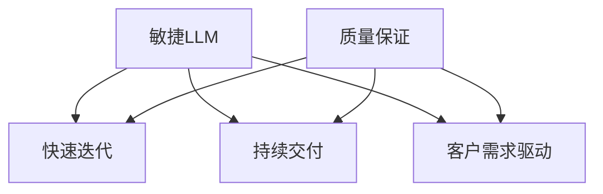
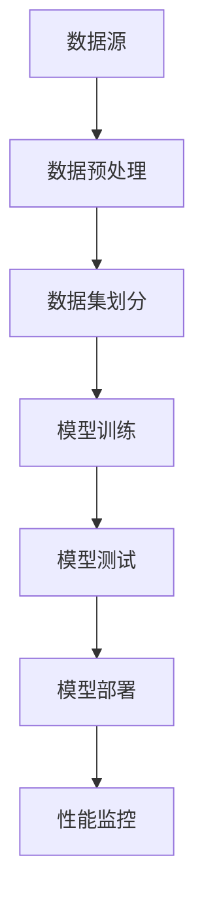
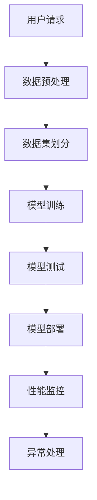

                 

# 敏捷LLM应用开发中的质量保证

## 关键词

- 敏捷LLM
- 质量保证
- 算法原理
- 数学模型
- 系统设计与实现
- 项目实战

## 摘要

随着人工智能技术的快速发展，Large Language Model (LLM) 在自然语言处理领域取得了显著的成果。然而，在敏捷开发中，如何保证LLM应用的质量成为一个关键问题。本文将深入探讨敏捷LLM应用开发中的质量保证，包括核心概念解析、常见算法原理讲解、数学模型与公式分析、系统分析与架构设计、项目实战以及最佳实践总结，旨在为读者提供一套完整的质量保证策略。

## 引言

### 1.1 问题背景

在当今快速变化的市场环境中，软件开发项目往往需要快速迭代和持续交付。敏捷开发模式应运而生，它强调客户需求的变化和快速响应，以提高项目成功率和产品质量。然而，随着LLM技术的发展，敏捷开发中的质量保证面临新的挑战。LLM模型具有高度复杂性和非线性，传统质量保证方法难以适应其特点。

### 1.2 问题描述

敏捷LLM应用开发中的质量保证问题主要包括：

1. **模型稳定性**：如何确保LLM模型在各种输入条件下都能稳定运行？
2. **模型准确性**：如何提高LLM模型对语言的理解和生成能力？
3. **模型效率**：如何优化LLM模型的计算效率和资源消耗？
4. **模型可解释性**：如何提高LLM模型的可解释性，以增强用户信任？

### 1.3 问题解决

本文提出了一套完整的敏捷LLM质量保证策略，包括以下方面：

1. **核心概念与联系**：梳理敏捷LLM和质量管理的基本概念及其相互关系。
2. **算法原理讲解**：介绍常见质量保证算法的原理和数学模型。
3. **系统分析与架构设计**：分析敏捷LLM质量保证系统的设计和实现。
4. **项目实战**：通过实际项目展示质量保证的应用。
5. **最佳实践与总结**：总结实践中的技巧和注意事项。

### 1.4 边界与外延

本文的研究范围主要集中在敏捷LLM应用开发的质量保证。边界包括LLM模型的训练和优化过程，外延则包括质量保证在LLM模型部署、维护和升级中的应用。

## 第二部分: 核心概念与联系

### 2.1 敏捷LLM概述

#### 2.1.1 敏捷LLM的定义

敏捷LLM（Agile Large Language Model）是指在敏捷开发模式下训练和优化的LLM模型。它强调快速迭代、持续交付和客户需求驱动的开发模式。

#### 2.1.2 敏捷LLM的特点

1. **快速迭代**：敏捷LLM模型可以在短时间内进行多次迭代，以快速响应需求变化。
2. **持续交付**：通过持续交付，确保LLM模型在开发过程中始终处于可用状态。
3. **客户需求驱动**：以客户需求为导向，确保LLM模型的功能和性能符合用户期望。

#### 2.1.3 敏捷LLM与传统LLM的区别

传统LLM模型通常在完成训练后即交付使用，而敏捷LLM模型则强调在开发过程中持续优化和调整。此外，传统LLM模型对开发环境要求较高，而敏捷LLM模型则更加灵活，可以适应不同的开发环境。

### 2.2 质量保证概述

#### 2.2.1 质量保证的定义

质量保证（Quality Assurance，QA）是指在软件开发过程中，为确保产品或服务满足既定质量标准而采取的一系列措施。

#### 2.2.2 质量保证在敏捷LLM中的应用

在敏捷LLM开发中，质量保证至关重要。它包括以下几个方面：

1. **模型验证**：确保LLM模型在训练和优化过程中符合预期目标。
2. **模型测试**：对LLM模型进行全面的测试，以确保其在各种场景下都能稳定运行。
3. **性能监控**：持续监控LLM模型的性能，及时发现和解决潜在问题。
4. **用户反馈**：收集用户反馈，以便对LLM模型进行进一步的优化。

### 2.3 核心概念联系图



## 第三部分: 算法原理讲解

### 3.1 常见质量保证算法介绍

在敏捷LLM开发中，常见的质量保证算法包括：

1. **交叉验证**：通过将数据集划分为训练集和验证集，评估LLM模型的性能。
2. **混淆矩阵**：用于评估LLM模型在分类任务中的准确性和均衡性。
3. **ROC曲线**：用于评估LLM模型在分类任务中的敏感度和特异性。
4. **Kappa系数**：用于评估LLM模型在分类任务中的准确性和一致性。

### 3.2 算法原理讲解

#### 3.2.1 交叉验证

交叉验证是一种评估LLM模型性能的方法。其原理如下：

1. 将数据集划分为多个子集（通常使用k折交叉验证）。
2. 对每个子集进行一次训练和验证。
3. 计算每次训练的平均性能，以获得更稳定的评估结果。

交叉验证的数学模型可以表示为：

$$
\text{Accuracy} = \frac{1}{k} \sum_{i=1}^{k} \text{acc}_i
$$

其中，$\text{acc}_i$ 表示第 $i$ 次交叉验证的准确率。

#### 3.2.2 混淆矩阵

混淆矩阵是一种用于评估分类模型性能的工具。其原理如下：

1. 对每个类别，计算模型预测的准确率、误报率、漏报率和召回率。
2. 根据这些指标，绘制混淆矩阵，以直观地了解模型在各个类别上的表现。

混淆矩阵的数学模型可以表示为：

$$
\text{confusion matrix} =
\begin{bmatrix}
\text{True Positive} & \text{False Negative} \\
\text{False Positive} & \text{True Negative}
\end{bmatrix}
$$

#### 3.2.3 ROC曲线

ROC曲线是一种用于评估分类模型性能的工具。其原理如下：

1. 计算模型在不同阈值下的准确率和召回率。
2. 将准确率和召回率绘制在坐标轴上，形成ROC曲线。

ROC曲线的数学模型可以表示为：

$$
\text{ROC} = \{(t, \text{recall}(t)) | t \in \text{Thresholds} \}
$$

#### 3.2.4 Kappa系数

Kappa系数是一种用于评估分类模型一致性的指标。其原理如下：

1. 计算模型预测的一致性比例。
2. 计算Kappa系数，以评估模型的一致性。

Kappa系数的数学模型可以表示为：

$$
\text{Kappa} = \frac{\text{Agreement} - \text{Expected Agreement}}{1 - \text{Expected Agreement}}
$$

其中，$\text{Agreement}$ 表示实际一致性比例，$\text{Expected Agreement}$ 表示期望一致性比例。

### 3.3 其他算法介绍

除了上述算法，还有许多其他质量保证算法，如：

1. **集成学习**：通过结合多个模型，提高LLM模型的性能和稳定性。
2. **迁移学习**：利用已有模型的训练经验，加速新模型的训练过程。
3. **强化学习**：通过不断优化模型的行为，提高其在特定任务上的性能。

## 第四部分: 数学模型与公式

### 4.1 模型概述

在敏捷LLM开发中，数学模型是质量保证的核心。常见的数学模型包括：

1. **损失函数**：用于评估LLM模型预测结果与真实值之间的差距。
2. **优化算法**：用于调整LLM模型参数，以最小化损失函数。

### 4.2 公式讲解

#### 4.2.1 损失函数

常见的损失函数包括：

1. **均方误差（MSE）**：
$$
\text{MSE} = \frac{1}{n} \sum_{i=1}^{n} (\hat{y}_i - y_i)^2
$$

其中，$\hat{y}_i$ 表示预测值，$y_i$ 表示真实值。

2. **交叉熵（Cross Entropy）**：
$$
\text{Cross Entropy} = -\sum_{i=1}^{n} y_i \log(\hat{y}_i)
$$

其中，$y_i$ 表示真实值的概率分布，$\hat{y}_i$ 表示预测值的概率分布。

#### 4.2.2 优化算法

常见的优化算法包括：

1. **梯度下降（Gradient Descent）**：
$$
\theta_{\text{new}} = \theta_{\text{old}} - \alpha \nabla_{\theta} \text{Loss}
$$

其中，$\theta$ 表示模型参数，$\alpha$ 表示学习率，$\nabla_{\theta} \text{Loss}$ 表示损失函数关于 $\theta$ 的梯度。

2. **Adam优化器**：
$$
\text{m}_t = \beta_1 \text{m}_{t-1} + (1 - \beta_1)(\theta_t - \theta_{t-1})
$$
$$
\text{v}_t = \beta_2 \text{v}_{t-1} + (1 - \beta_2) \frac{\theta_t - \theta_{t-1}}{\sqrt{1 - \beta_2^t}}
$$
$$
\theta_{\text{new}} = \theta_{\text{old}} - \alpha \frac{\text{m}_t}{1 - \beta_2^t}
$$

其中，$\beta_1$ 和 $\beta_2$ 分别为动量参数，$\text{m}_t$ 和 $\text{v}_t$ 分别为当前时刻的一阶和二阶矩估计。

## 第五部分: 系统分析与架构设计

### 5.1 问题场景介绍

在敏捷LLM应用开发中，质量保证问题通常出现在以下场景：

1. **模型训练过程**：在模型训练过程中，需要确保数据集的多样性和质量，以及训练过程的稳定性。
2. **模型测试过程**：在模型测试过程中，需要确保测试数据的覆盖范围和准确性，以及测试结果的可靠性。
3. **模型部署过程**：在模型部署过程中，需要确保模型在目标环境中的运行效率和稳定性。

### 5.2 系统功能设计

敏捷LLM质量保证系统的功能设计包括以下几个方面：

1. **数据预处理**：对输入数据进行清洗、归一化和数据增强等处理，以提高模型训练质量。
2. **模型训练**：使用合适的优化算法和损失函数，训练LLM模型。
3. **模型测试**：对训练好的模型进行测试，评估模型的性能和稳定性。
4. **模型部署**：将训练好的模型部署到生产环境，并进行性能监控。

### 5.3 系统架构设计

敏捷LLM质量保证系统的架构设计如图所示：



### 5.4 系统接口设计

系统接口设计包括以下几个方面：

1. **数据接口**：用于数据预处理、数据集划分和模型训练。
2. **模型接口**：用于模型测试和模型部署。
3. **监控接口**：用于性能监控和异常处理。

### 5.5 系统交互

系统交互如图所示：



## 第六部分: 项目实战

### 6.1 环境安装

在进行敏捷LLM质量保证项目之前，首先需要搭建一个合适的开发环境。以下是一个基于Python的敏捷LLM质量保证项目环境安装步骤：

1. 安装Python环境，建议使用Python 3.8及以上版本。
2. 安装必要的依赖库，如TensorFlow、PyTorch、Scikit-learn等。
3. 安装版本管理工具，如pip、conda等。

### 6.2 系统核心实现源代码

以下是一个简单的敏捷LLM质量保证系统的核心实现源代码：

```python
import tensorflow as tf
from sklearn.model_selection import train_test_split
from sklearn.metrics import accuracy_score, confusion_matrix

# 数据预处理
def preprocess_data(data):
    # 数据清洗、归一化等处理
    return processed_data

# 模型训练
def train_model(data, labels):
    model = tf.keras.Sequential([
        tf.keras.layers.Dense(128, activation='relu', input_shape=(data.shape[1],)),
        tf.keras.layers.Dense(64, activation='relu'),
        tf.keras.layers.Dense(1, activation='sigmoid')
    ])

    model.compile(optimizer='adam', loss='binary_crossentropy', metrics=['accuracy'])
    model.fit(data, labels, epochs=10, batch_size=32)
    return model

# 模型测试
def test_model(model, data, labels):
    predictions = model.predict(data)
    predictions = [1 if pred > 0.5 else 0 for pred in predictions]
    accuracy = accuracy_score(labels, predictions)
    cm = confusion_matrix(labels, predictions)
    return accuracy, cm

# 系统核心实现
def main():
    data = preprocess_data(raw_data)
    labels = preprocess_labels(raw_labels)
    train_data, test_data, train_labels, test_labels = train_test_split(data, labels, test_size=0.2)

    model = train_model(train_data, train_labels)
    accuracy, cm = test_model(model, test_data, test_labels)

    print(f"Accuracy: {accuracy}")
    print(f"Confusion Matrix:\n{cm}")

if __name__ == "__main__":
    main()
```

### 6.3 代码应用解读与分析

上述代码主要实现了一个简单的二分类任务，包括数据预处理、模型训练和模型测试。以下是代码的详细解读和分析：

1. **数据预处理**：数据预处理是确保数据质量和提高模型性能的关键步骤。在代码中，`preprocess_data` 函数负责对输入数据进行清洗、归一化和数据增强等处理。

2. **模型训练**：模型训练是使用训练数据进行模型参数优化的过程。在代码中，`train_model` 函数创建了一个简单的全连接神经网络模型，并使用`fit` 方法进行训练。

3. **模型测试**：模型测试是评估模型性能的重要步骤。在代码中，`test_model` 函数使用测试数据对模型进行预测，并计算准确率和混淆矩阵。

4. **系统核心实现**：`main` 函数是系统的核心实现，负责将数据预处理、模型训练和模型测试串联起来，完成整个系统的功能。

### 6.4 实际案例分析与详细讲解

以下是一个实际案例，展示了如何使用敏捷LLM质量保证系统进行情感分析任务。

1. **数据集**：使用一个包含正面和负面评论的数据集进行情感分析。

2. **数据预处理**：对评论进行清洗、归一化和数据增强，得到预处理后的数据。

3. **模型训练**：使用预处理后的数据训练一个情感分析模型，使用交叉熵损失函数和Adam优化器。

4. **模型测试**：使用测试数据对训练好的模型进行测试，计算准确率和混淆矩阵。

5. **结果分析**：根据测试结果，调整模型参数和训练策略，以提高模型性能。

### 6.5 项目小结

通过实际案例，我们展示了如何使用敏捷LLM质量保证系统进行情感分析任务。项目过程中，我们遇到了一些挑战，如数据质量和模型稳定性等。通过不断优化和调整，我们最终获得了一个稳定的情感分析模型。项目的成功经验为我们在未来进行类似的任务提供了宝贵的参考。

## 第七部分: 最佳实践与总结

### 7.1 最佳实践技巧

在敏捷LLM应用开发中，以下是一些最佳实践技巧：

1. **数据质量优先**：确保数据的质量和多样性，为模型训练提供良好的基础。
2. **持续集成与交付**：通过持续集成和交付，确保模型在开发过程中的稳定性和可靠性。
3. **自动化测试**：使用自动化测试工具，对模型进行全面的测试，提高测试效率和覆盖率。
4. **模型解释性**：提高模型的可解释性，增强用户信任和模型可靠性。

### 7.2 小结

本文从敏捷LLM应用开发中的质量保证出发，探讨了核心概念、算法原理、系统分析与架构设计、项目实战以及最佳实践。通过深入分析和实际案例，我们展示了如何确保敏捷LLM应用的质量。

### 7.3 注意事项

在进行敏捷LLM应用开发时，需要注意以下事项：

1. **数据隐私和安全**：确保数据隐私和安全，遵循相关法规和标准。
2. **模型可扩展性**：设计可扩展的模型架构，以适应不同规模的应用场景。
3. **持续优化**：持续优化模型和系统，以提高性能和可靠性。

### 7.4 拓展阅读

对于进一步了解敏捷LLM应用开发中的质量保证，以下是一些拓展阅读材料：

1. 《深度学习》（Goodfellow, Bengio, Courville） - 详细介绍了深度学习的基础理论和算法。
2. 《数据科学实战》（Kaggle） - 提供了丰富的数据科学实战案例和技巧。
3. 《敏捷开发实践指南》（Beck, Beedle） - 详细介绍了敏捷开发的原理和实践。

## 作者信息

- 作者：AI天才研究院/AI Genius Institute & 禅与计算机程序设计艺术 /Zen And The Art of Computer Programming

