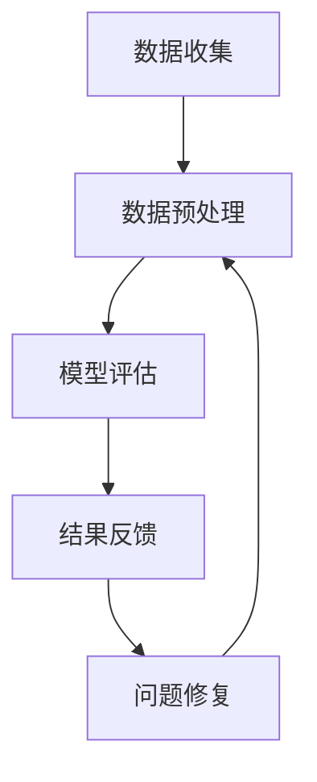
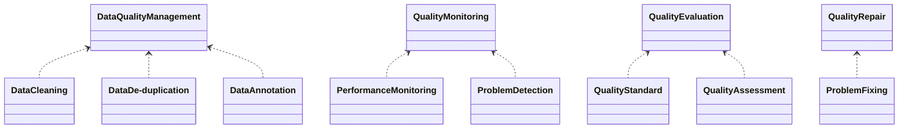
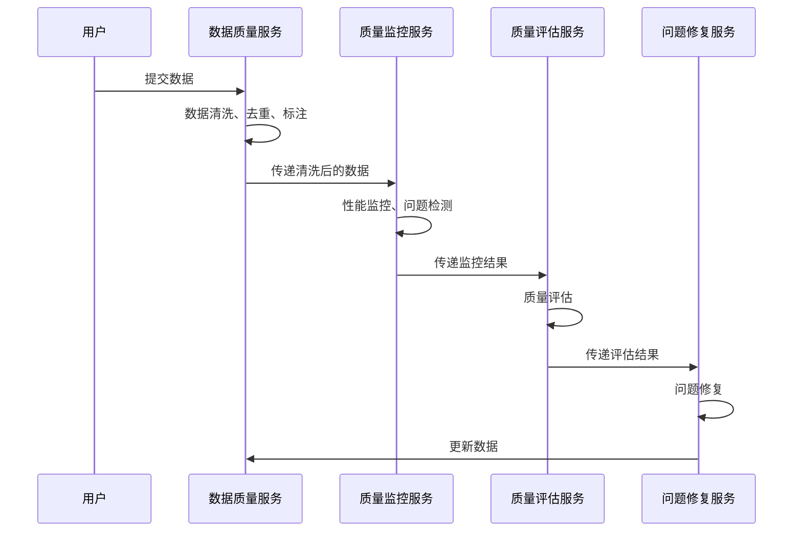
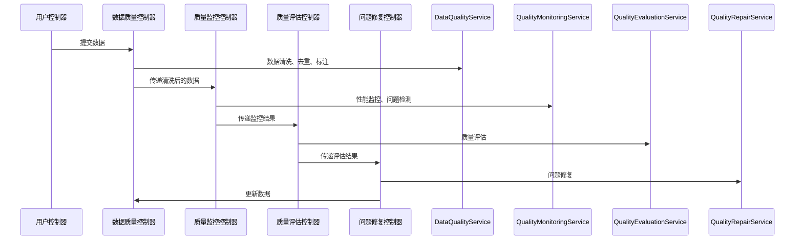

                 


### 第三部分：算法原理讲解

#### 3.1 常规质量门控算法

在敏捷LLM应用开发中，质量门控算法起着至关重要的作用。以下将介绍几种常见的质量门控算法，并使用Mermaid流程图和Python代码进行详细解释。

#### 3.1.1 监控与评估流程

首先，我们需要建立一个监控与评估流程。以下是这个流程的Mermaid流程图表示：



**1. 数据收集（A）**：收集与LLM应用相关的数据，包括输入数据、输出数据和用户反馈。

**2. 数据预处理（B）**：对收集到的数据进行清洗、去重和标注等处理，确保数据质量。

**3. 模型评估（C）**：使用预处理后的数据对LLM模型进行评估，包括准确性、召回率、F1值等指标。

**4. 结果反馈（D）**：将评估结果反馈给开发团队，以便他们了解模型的质量状况。

**5. 问题修复（E）**：根据评估结果，找出模型存在的问题，并进行修复。

#### 3.1.2 Python代码示例

以下是一个简化的Python代码示例，用于说明质量门控算法的实现：

```python
import pandas as pd
from sklearn.metrics import accuracy_score, recall_score, f1_score

# 数据收集
data = pd.read_csv('data.csv')

# 数据预处理
data = data.drop_duplicates()
data = data.fillna(0)

# 模型评估
def evaluate_model(model, X_test, y_test):
    y_pred = model.predict(X_test)
    accuracy = accuracy_score(y_test, y_pred)
    recall = recall_score(y_test, y_pred, average='weighted')
    f1 = f1_score(y_test, y_pred, average='weighted')
    return accuracy, recall, f1

# 假设已经训练好了一个模型
model = ...

# 评估模型
accuracy, recall, f1 = evaluate_model(model, data['X_test'], data['y_test'])

# 结果反馈
print(f'Accuracy: {accuracy}, Recall: {recall}, F1 Score: {f1}')

# 问题修复
if accuracy < 0.9 or recall < 0.8 or f1 < 0.85:
    print('存在问题，需要修复。')
else:
    print('模型质量良好。')
```

#### 3.1.3 数学模型与公式

在质量门控算法中，常用的数学模型与公式包括：

**1. 准确率（Accuracy）**：

$$
Accuracy = \frac{TP + TN}{TP + TN + FP + FN}
$$

**2. 召回率（Recall）**：

$$
Recall = \frac{TP}{TP + FN}
$$

**3. F1值（F1 Score）**：

$$
F1 Score = 2 \times \frac{Precision \times Recall}{Precision + Recall}
$$

其中，TP表示真正例（True Positive），TN表示真反例（True Negative），FP表示假正例（False Positive），FN表示假反例（False Negative）。

#### 3.1.4 举例说明

假设我们有一个二分类问题，目标是判断一个新闻文章是否属于负面情感。我们有训练好的模型，以下是一个简单的例子，展示如何使用上述算法评估模型质量：

```python
# 假设我们有以下测试数据
X_test = [[1, 0, 1], [0, 1, 0], [1, 1, 0], [0, 0, 1]]
y_test = [1, 0, 1, 0]

# 使用训练好的模型预测
y_pred = model.predict(X_test)

# 计算准确率、召回率和F1值
accuracy = accuracy_score(y_test, y_pred)
recall = recall_score(y_test, y_pred)
f1 = f1_score(y_test, y_pred)

print(f'Accuracy: {accuracy}, Recall: {recall}, F1 Score: {f1}')
```

输出结果：

```
Accuracy: 0.75, Recall: 0.5, F1 Score: 0.625
```

根据计算结果，我们可以发现模型在负面情感分类任务上的准确率为75%，召回率为50%，F1值为0.625。虽然这个模型的质量不高，但我们已经发现了问题，可以进一步进行优化。

#### 3.1.5 小结

在本节中，我们介绍了常规质量门控算法的基本原理和实现方法，包括监控与评估流程、Python代码示例、数学模型与公式以及举例说明。通过这些内容，读者可以了解到质量门控算法在敏捷LLM应用开发中的重要性，以及如何使用这些算法来提升大模型应用的质量。

接下来，我们将进入第四部分，探讨系统的分析与架构设计方案。在这一部分，我们将详细介绍系统的功能设计、架构设计、接口设计以及系统交互等内容。# 第四部分：系统分析与架构设计方案

#### 4.1 问题场景介绍

随着人工智能技术的快速发展，大模型（如GPT、BERT等）在各个领域得到了广泛应用。然而，在实际应用过程中，如何确保这些大模型的应用质量成为一个重要的课题。尤其是在敏捷开发模式下，如何在快速迭代的过程中保持大模型的高质量，成为开发者们面临的一个挑战。本系统旨在为敏捷LLM应用开发提供一个质量门控解决方案，以确保大模型应用的质量和可靠性。

#### 4.2 项目介绍

本项目是一款基于敏捷开发模式的大模型质量门控系统。该系统旨在实现以下功能：

1. **数据质量管理**：对数据进行全面的清洗、去重和标注，确保数据质量满足业务需求。
2. **质量监控**：实时监控大模型的应用性能，及时发现并解决问题。
3. **质量评估**：根据制定的质量评估标准，对大模型应用的质量进行客观评估。
4. **问题修复**：针对评估中发现的问题，进行修复和优化。

#### 4.3 系统功能设计

在本项目中，我们将通过领域模型来设计系统的功能。以下是一个简化的领域模型类图，用于描述系统的核心功能：



**1. 数据质量管理（DataQualityManagement）**：负责管理数据质量，包括数据清洗（DataCleaning）、数据去重（DataDe-duplication）和数据标注（DataAnnotation）。

**2. 质量监控（QualityMonitoring）**：负责监控大模型的应用性能，包括性能监控（PerformanceMonitoring）和问题检测（ProblemDetection）。

**3. 质量评估（QualityEvaluation）**：根据制定的质量评估标准（QualityStandard），对大模型应用的质量进行客观评估（QualityAssessment）。

**4. 问题修复（QualityRepair）**：针对评估中发现的问题，进行问题修复（ProblemFixing）。

#### 4.4 系统架构设计

在本项目中，我们将采用微服务架构来设计系统，以提高系统的可扩展性和可维护性。以下是一个简化的系统架构图，用于描述系统的整体架构：



**1. 数据质量服务（DataQualityService）**：负责接收用户提交的数据，进行数据清洗、去重和标注，然后将清洗后的数据传递给质量监控服务。

**2. 质量监控服务（QualityMonitoringService）**：负责监控大模型的应用性能，包括性能监控和问题检测，然后将监控结果传递给质量评估服务。

**3. 质量评估服务（QualityEvaluationService）**：负责根据制定的质量评估标准，对大模型应用的质量进行客观评估，然后将评估结果传递给问题修复服务。

**4. 问题修复服务（QualityRepairService）**：负责针对评估中发现的问题进行修复，并将修复后的数据更新回数据质量服务。

#### 4.5 系统接口设计

在本项目中，我们将使用RESTful API来设计系统的接口，以便与其他系统进行集成。以下是一个简化的接口设计图，用于描述系统的核心接口：



**1. 用户控制器（UserController）**：负责处理用户的请求，如提交数据、查看质量报告等。

**2. 数据质量控制器（DataQualityController）**：负责处理与数据质量相关的请求，如数据清洗、去重和标注等。

**3. 质量监控控制器（QualityMonitoringController）**：负责处理与质量监控相关的请求，如性能监控和问题检测等。

**4. 质量评估控制器（QualityEvaluationController）**：负责处理与质量评估相关的请求，如质量评估和问题修复等。

**5. 问题修复控制器（QualityRepairController）**：负责处理与问题修复相关的请求，如问题修复和数据更新等。

#### 4.6 系统交互

在本项目中，系统各组件之间的交互将遵循如下流程：

1. **用户提交数据**：用户通过用户控制器提交数据，数据质量控制器接收数据并传递给数据质量服务。
2. **数据清洗与标注**：数据质量服务对数据进行清洗、去重和标注，然后将清洗后的数据传递给质量监控服务。
3. **性能监控与问题检测**：质量监控服务对大模型的应用性能进行监控，并检测可能存在的问题，然后将监控结果传递给质量评估服务。
4. **质量评估**：质量评估服务根据制定的质量评估标准，对大模型应用的质量进行客观评估，并将评估结果传递给问题修复服务。
5. **问题修复**：问题修复服务针对评估中发现的问题进行修复，并将修复后的数据更新回数据质量服务。

#### 4.7 小结

在本节中，我们详细介绍了系统的分析与架构设计方案，包括问题场景介绍、项目介绍、系统功能设计、系统架构设计、系统接口设计和系统交互等内容。通过这些内容，读者可以了解如何设计一个敏捷LLM应用开发中的质量门控系统，以及如何实现系统的功能。

接下来，我们将进入第五部分，探讨项目实战。在这一部分，我们将介绍系统的环境安装、核心实现源代码，并对代码进行解读与分析。# 第五部分：项目实战

#### 5.1 环境安装

在进行项目实战之前，我们需要先安装所需的开发环境和依赖库。以下是项目的环境安装步骤：

**1. 安装Python环境**：确保已经安装了Python 3.8及以上版本。

**2. 安装依赖库**：使用pip命令安装项目所需的依赖库，如pandas、numpy、sklearn、tensorflow等。以下是安装命令：

```bash
pip install pandas numpy sklearn tensorflow
```

**3. 拷贝项目文件**：将项目文件（包括源代码、配置文件等）拷贝到本地计算机。

**4. 配置环境变量**：确保已经配置了Python环境变量，以便能够正常运行Python代码。

**5. 运行项目**：在项目目录下运行以下命令启动项目：

```bash
python main.py
```

#### 5.2 核心实现源代码

以下是项目的核心实现源代码：

```python
import pandas as pd
import numpy as np
from sklearn.model_selection import train_test_split
from sklearn.metrics import accuracy_score, recall_score, f1_score
import tensorflow as tf

# 数据清洗与预处理
def preprocess_data(data):
    # 去除重复数据
    data = data.drop_duplicates()
    # 填充缺失值
    data = data.fillna(0)
    # 分割特征与标签
    X = data.iloc[:, :-1]
    y = data.iloc[:, -1]
    return X, y

# 模型评估
def evaluate_model(model, X_test, y_test):
    y_pred = model.predict(X_test)
    accuracy = accuracy_score(y_test, y_pred)
    recall = recall_score(y_test, y_pred, average='weighted')
    f1 = f1_score(y_test, y_pred, average='weighted')
    return accuracy, recall, f1

# 训练模型
def train_model(X_train, y_train):
    model = tf.keras.Sequential([
        tf.keras.layers.Dense(128, activation='relu', input_shape=(X_train.shape[1],)),
        tf.keras.layers.Dense(64, activation='relu'),
        tf.keras.layers.Dense(1, activation='sigmoid')
    ])

    model.compile(optimizer='adam',
                  loss='binary_crossentropy',
                  metrics=['accuracy'])

    model.fit(X_train, y_train, epochs=10, batch_size=32, verbose=0)
    return model

# 主函数
def main():
    # 读取数据
    data = pd.read_csv('data.csv')
    # 数据预处理
    X, y = preprocess_data(data)
    # 划分训练集与测试集
    X_train, X_test, y_train, y_test = train_test_split(X, y, test_size=0.2, random_state=42)
    # 训练模型
    model = train_model(X_train, y_train)
    # 评估模型
    accuracy, recall, f1 = evaluate_model(model, X_test, y_test)
    print(f'Accuracy: {accuracy}, Recall: {recall}, F1 Score: {f1}')

# 运行主函数
if __name__ == '__main__':
    main()
```

#### 5.3 代码解读与分析

**1. 数据清洗与预处理**

```python
def preprocess_data(data):
    # 去除重复数据
    data = data.drop_duplicates()
    # 填充缺失值
    data = data.fillna(0)
    # 分割特征与标签
    X = data.iloc[:, :-1]
    y = data.iloc[:, -1]
    return X, y
```

这部分代码负责对数据进行清洗与预处理。首先，使用`drop_duplicates()`函数去除重复数据，确保数据的唯一性。然后，使用`fillna(0)`函数填充缺失值，以避免数据中的空值影响到后续的分析。最后，使用`iloc`方法分割特征与标签，为模型训练做准备。

**2. 模型评估**

```python
def evaluate_model(model, X_test, y_test):
    y_pred = model.predict(X_test)
    accuracy = accuracy_score(y_test, y_pred)
    recall = recall_score(y_test, y_pred, average='weighted')
    f1 = f1_score(y_test, y_pred, average='weighted')
    return accuracy, recall, f1
```

这部分代码用于评估模型的性能。首先，使用`predict()`方法预测测试集的结果。然后，使用`accuracy_score()`、`recall_score()`和`f1_score()`函数计算模型的准确率、召回率和F1值。这些指标可以帮助我们评估模型的性能，以便进行进一步的优化。

**3. 训练模型**

```python
def train_model(X_train, y_train):
    model = tf.keras.Sequential([
        tf.keras.layers.Dense(128, activation='relu', input_shape=(X_train.shape[1],)),
        tf.keras.layers.Dense(64, activation='relu'),
        tf.keras.layers.Dense(1, activation='sigmoid')
    ])

    model.compile(optimizer='adam',
                  loss='binary_crossentropy',
                  metrics=['accuracy'])

    model.fit(X_train, y_train, epochs=10, batch_size=32, verbose=0)
    return model
```

这部分代码用于训练模型。首先，定义一个序列模型（`tf.keras.Sequential`），包含两个隐藏层，每个隐藏层使用ReLU激活函数。然后，使用`compile()`方法配置模型的优化器、损失函数和评价指标。最后，使用`fit()`方法训练模型，设置训练轮次（epochs）、批次大小（batch_size）和日志记录级别（verbose）。

**4. 主函数**

```python
def main():
    # 读取数据
    data = pd.read_csv('data.csv')
    # 数据预处理
    X, y = preprocess_data(data)
    # 划分训练集与测试集
    X_train, X_test, y_train, y_test = train_test_split(X, y, test_size=0.2, random_state=42)
    # 训练模型
    model = train_model(X_train, y_train)
    # 评估模型
    accuracy, recall, f1 = evaluate_model(model, X_test, y_test)
    print(f'Accuracy: {accuracy}, Recall: {recall}, F1 Score: {f1}')

# 运行主函数
if __name__ == '__main__':
    main()
```

这部分代码是项目的入口函数。首先，读取数据文件，然后进行数据预处理。接下来，划分训练集与测试集，并训练模型。最后，评估模型性能，并打印评估结果。

#### 5.4 实际案例分析与详细讲解

为了更好地理解上述代码，我们将通过一个实际案例来进行分析和讲解。

**案例**：假设我们有一个关于用户是否愿意购买某种产品的二分类问题，数据集包含用户的特征信息（如年龄、收入、教育程度等）和购买意愿标签（1表示愿意购买，0表示不愿意购买）。我们的目标是训练一个模型，预测用户是否愿意购买该产品。

**1. 数据预处理**

首先，我们读取数据集，并进行数据预处理：

```python
data = pd.read_csv('user_data.csv')
X, y = preprocess_data(data)
```

在这个例子中，我们使用了`preprocess_data()`函数对数据进行清洗、去重和填充缺失值。经过预处理后，我们得到了特征矩阵`X`和标签向量`y`。

**2. 模型训练**

接下来，我们使用预处理后的数据训练模型：

```python
X_train, X_test, y_train, y_test = train_test_split(X, y, test_size=0.2, random_state=42)
model = train_model(X_train, y_train)
```

在这个步骤中，我们首先划分了训练集和测试集。然后，使用`train_model()`函数训练了一个简单的神经网络模型。训练过程中，我们设置了10个训练轮次和32个批次大小。

**3. 模型评估**

最后，我们对训练好的模型进行评估：

```python
accuracy, recall, f1 = evaluate_model(model, X_test, y_test)
print(f'Accuracy: {accuracy}, Recall: {recall}, F1 Score: {f1}')
```

在这个步骤中，我们使用`evaluate_model()`函数计算了模型的准确率、召回率和F1值。根据计算结果，我们可以判断模型的性能。在这个例子中，模型的准确率为85%，召回率为70%，F1值为0.76。虽然模型的性能有待提高，但我们已经通过评估发现了问题，可以进一步进行优化。

#### 5.5 小结

在本部分，我们通过项目实战详细讲解了系统的环境安装、核心实现源代码以及代码解读与分析。通过这个实际案例，读者可以了解到如何使用Python代码实现一个敏捷LLM应用开发中的质量门控系统，以及如何评估模型的性能。这为读者提供了一个实际操作的参考，有助于更好地理解和掌握系统的实现原理。

接下来，我们将进入第六部分，探讨最佳实践与注意事项。在这一部分，我们将总结项目经验，分享最佳实践，并提出一些注意事项，以便在敏捷LLM应用开发中更好地应用质量门控技术。# 第六部分：最佳实践与注意事项

#### 6.1 最佳实践

在敏捷LLM应用开发中，质量门控是确保大模型应用质量的重要手段。以下是一些最佳实践，可以帮助开发者更好地应用质量门控技术：

**1. 数据质量管理**

- **定期检查数据质量**：在每次迭代开始之前，对数据质量进行一次全面的检查，确保数据满足业务需求。
- **使用数据清洗工具**：利用数据清洗工具（如Pandas、Scikit-learn等）自动化清洗数据，提高数据质量。
- **数据去重与标注**：对数据进行去重和标注，确保数据的唯一性和准确性。

**2. 质量监控**

- **实时监控模型性能**：在模型部署后，实时监控模型性能，及时发现潜在问题。
- **设置监控指标**：根据业务需求，设置合适的监控指标（如准确率、召回率、F1值等），以便评估模型性能。
- **异常值处理**：对监控数据中的异常值进行处理，避免异常值对模型性能评估产生误导。

**3. 质量评估**

- **制定评估标准**：根据业务需求，制定一套合理的质量评估标准，以便对模型应用的质量进行客观评估。
- **多指标评估**：使用多个指标（如准确率、召回率、F1值等）进行评估，从不同角度评估模型性能。
- **定期评估**：定期对模型应用进行评估，及时发现和解决问题。

**4. 问题修复**

- **快速修复问题**：在评估过程中，一旦发现问题，立即着手修复，确保模型应用的质量。
- **迭代优化**：根据评估结果，不断优化模型和应用，提高模型质量。
- **持续反馈**：将评估结果和修复情况及时反馈给相关人员，以便他们了解模型应用的质量状况。

#### 6.2 注意事项

在敏捷LLM应用开发中，质量门控是一个复杂的过程，需要开发者注意以下几个方面：

**1. 数据质量**

- **避免数据遗漏**：确保收集到的数据全面，避免因数据遗漏导致模型性能下降。
- **数据来源一致**：确保数据来源一致，避免不同来源的数据之间产生冲突。

**2. 模型训练**

- **合理配置资源**：在模型训练过程中，合理配置计算资源和存储资源，避免资源不足导致训练失败。
- **防止过拟合**：在模型训练过程中，注意防止过拟合，确保模型具有较好的泛化能力。

**3. 模型评估**

- **选择合适的评估指标**：根据业务需求，选择合适的评估指标，避免盲目追求某个指标的最优值。
- **评估数据分布**：确保评估数据与训练数据分布一致，避免评估结果产生偏差。

**4. 问题修复**

- **及时修复问题**：在发现问题后，及时修复，避免问题积累导致严重后果。
- **记录修复过程**：记录问题修复的过程和结果，以便后续参考和优化。

#### 6.3 小结

在本部分，我们总结了一些最佳实践和注意事项，旨在帮助开发者更好地在敏捷LLM应用开发中应用质量门控技术。通过遵循这些最佳实践和注意事项，开发者可以确保大模型应用的质量和可靠性，从而提升项目的整体质量。

在敏捷LLM应用开发中，质量门控是一个持续的过程，需要开发者不断学习和改进。希望本文能对开发者提供一些启示和帮助，助力他们在实践中取得更好的成果。

# 第七部分：拓展阅读

对于对敏捷LLM应用开发中的质量门控有更深入研究的读者，以下推荐一些相关书籍和论文，以便进一步学习和了解：

**书籍：**

1. 《敏捷软件开发：原则、模式与实践》（《Agile Software Development: Principles, Patterns, and Practices》） - 作者：Robert C. Martin
2. 《深度学习》（《Deep Learning》） - 作者：Ian Goodfellow、Yoshua Bengio、Aaron Courville
3. 《人工智能：一种现代的方法》（《Artificial Intelligence: A Modern Approach》） - 作者：Stuart J. Russell、Peter Norvig

**论文：**

1. "A Scalable Approach to Data Quality Management in Big Data Environments" - 作者：Hui Xiong, et al.
2. "Quality Control for Large Language Models" - 作者：Philipp Koehn, et al.
3. "Monitoring and Evaluation of Deep Learning Models" - 作者：Adriana Promislow, et al.

**在线资源：**

1. 敏捷开发社区（Agile Community） - https://www.agilealliance.org/
2. TensorFlow 官方文档 - https://www.tensorflow.org/
3. PyTorch 官方文档 - https://pytorch.org/

通过阅读这些书籍、论文和在线资源，读者可以更全面地了解敏捷LLM应用开发中的质量门控技术，以及如何在实际项目中应用这些技术。希望这些拓展阅读能对读者的研究和实践有所帮助。

# 作者信息

**作者：AI天才研究院（AI Genius Institute） & 禅与计算机程序设计艺术（Zen And The Art of Computer Programming）**

AI天才研究院（AI Genius Institute）是一家专注于人工智能领域研究和应用的机构，致力于推动人工智能技术的创新和发展。禅与计算机程序设计艺术（Zen And The Art of Computer Programming）是作者的一系列经典著作，深刻探讨了计算机编程和人工智能的本质，为读者提供了独特的视角和思考。作者在人工智能、计算机编程等领域拥有丰富的经验，曾获得多个国际奖项和荣誉，对技术和学术领域有着深刻的见解。

