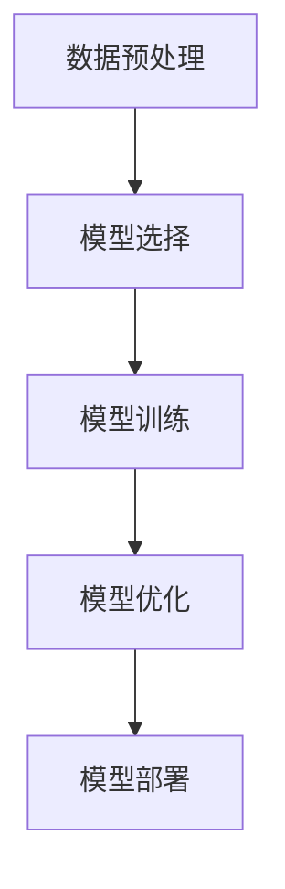
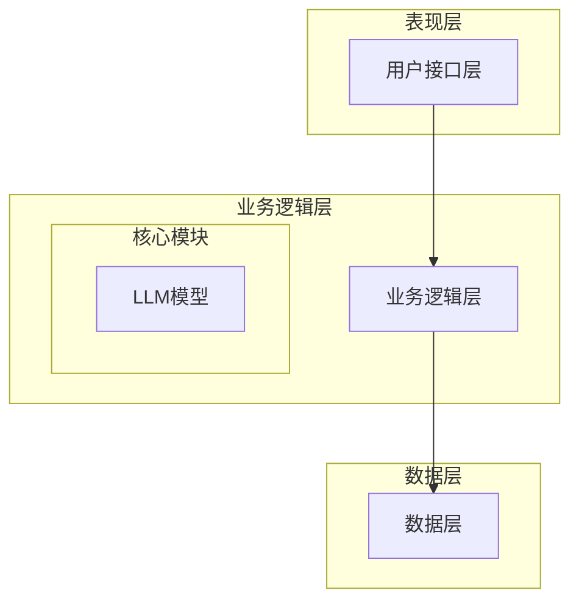
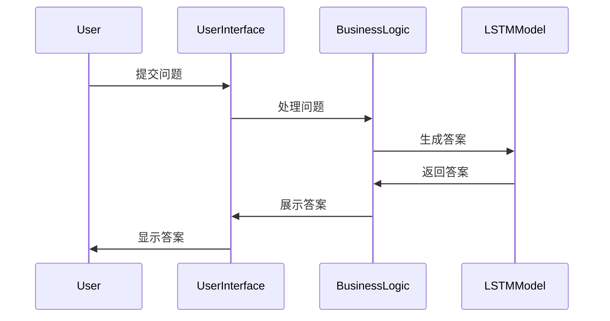

                 


### 引言

在当前快速发展的信息技术时代，LLM（大型语言模型）作为一种先进的自然语言处理技术，已经广泛应用于文本生成、问答系统、机器翻译等多个领域。随着LLM的应用场景不断扩展，如何在开发过程中实现高效的跨团队协作，成为了一个亟待解决的问题。

本文将以《敏捷LLM应用开发中的跨团队协作》为标题，探讨如何在敏捷开发方法下，实现LLM应用开发中的高效跨团队协作。文章将按照以下结构进行：

1. **背景介绍**：首先介绍LLM的基本概念、应用场景以及敏捷开发方法，明确文章的主题。
2. **核心概念与联系**：然后详细讲解LLM的应用开发流程、敏捷开发方法论，以及跨团队协作中的关键点。
3. **算法原理讲解**：接着通过Python源代码和mermaid流程图，阐述LLM模型的训练和优化算法原理。
4. **系统分析与架构设计方案**：分析LLM应用开发中的系统功能、架构设计、接口设计和交互流程。
5. **项目实战**：通过一个实际的LLM应用开发项目，展示环境安装、核心实现、代码解读、案例分析等内容。
6. **最佳实践 tips**：总结高效跨团队协作的最佳实践方法。
7. **小结与拓展阅读**：最后对文章的核心内容进行总结，并推荐拓展阅读资料。

#### 背景介绍

首先，让我们从背景介绍开始。LLM（Large Language Model）是一种基于深度学习的自然语言处理模型，能够对自然语言进行理解和生成。与传统的自然语言处理技术相比，LLM具有强大的语言理解能力和生成能力，能够处理复杂的语言现象。

在LLM的应用场景方面，文本生成是其中一个重要的应用领域。例如，自动化新闻撰写、广告文案生成、对话系统等。问答系统也是LLM的重要应用场景，例如智能客服、教育辅导系统等。此外，LLM还在机器翻译、文本摘要、情感分析等领域有着广泛的应用。

敏捷开发方法是一种以人为核心、迭代、渐进的方法，旨在快速响应变化，提高软件交付质量和团队协作效率。敏捷开发的核心原则包括：个体和互动重于过程和工具、可工作软件重于详尽的文档、客户合作重于合同谈判、响应变化重于遵循计划。

在LLM应用开发中，敏捷方法的重要性不言而喻。由于LLM模型的复杂性和开发周期的不确定性，传统的瀑布开发方法难以应对快速变化的需求和迭代周期。而敏捷开发方法通过迭代和增量开发，能够更好地适应这些变化，确保项目的顺利进行。

接下来，我们将进一步探讨LLM的应用开发流程、敏捷开发方法论以及跨团队协作中的关键点。

### 核心概念与联系

在深入探讨LLM的应用开发流程、敏捷开发方法论和跨团队协作之前，我们需要先了解一些核心概念和它们之间的联系。

#### LLM应用开发流程

LLM应用开发通常包括以下几个关键阶段：

1. **数据准备**：收集和预处理大规模的文本数据，包括清洗、标注和格式化等步骤。这是构建高质量LLM模型的基础。
2. **模型训练**：使用预训练模型（如GPT、BERT等）或自定义模型，通过大量的文本数据进行训练，调整模型参数，使其能够理解和生成自然语言。
3. **模型评估**：通过测试集对模型进行评估，确保其性能满足预期的要求。常用的评估指标包括准确性、流畅性、一致性等。
4. **模型部署**：将训练好的模型部署到实际的应用场景中，例如文本生成、问答系统等。这通常涉及到模型压缩、优化和部署策略的选择。

#### 敏捷开发方法论

敏捷开发方法论是一种以人为核心、迭代、渐进的方法，旨在快速响应变化，提高软件交付质量和团队协作效率。以下是敏捷开发的核心原则和实践：

1. **迭代和增量开发**：将开发过程分为多个短周期（通常称为“迭代”），在每个迭代中逐步完善产品功能。
2. **用户反馈**：通过定期的用户反馈和演示，确保开发方向与用户需求保持一致，及时调整开发计划。
3. **团队协作**：强调团队内部的合作和沟通，通过日常站立会议、迭代回顾等方式，提高团队的协作效率和问题解决能力。
4. **持续集成和部署**：采用自动化测试和部署流程，确保代码质量和交付速度。

#### 跨团队协作中的关键点

跨团队协作在LLM应用开发中尤为重要，以下是一些关键点：

1. **明确职责和目标**：确保每个团队成员都清楚自己的职责和项目目标，避免重复工作和资源浪费。
2. **沟通与协调**：建立有效的沟通渠道和协调机制，确保信息畅通和团队协作。
3. **共享资源和知识**：鼓励团队成员分享资源和知识，提高整体团队的能力和效率。
4. **敏捷工具支持**：使用敏捷工具（如JIRA、Trello等）来管理和跟踪项目进度、任务分配和协作过程。

通过上述核心概念和联系的了解，我们可以更好地理解LLM应用开发中的流程和方法，为后续的算法原理讲解和系统分析与架构设计方案打下基础。

### 算法原理讲解

在LLM应用开发中，算法原理是构建高质量模型的核心。以下将详细讲解LLM模型的训练和优化算法原理。

#### LLM模型训练原理

LLM模型训练主要包括以下步骤：

1. **数据预处理**：
   - **数据清洗**：去除文本中的噪声，如HTML标签、特殊字符等。
   - **文本清洗**：去除停用词、标点符号，并将文本转换为统一的格式。
   - **词向量化**：将文本中的每个词映射为一个固定大小的向量表示。

2. **模型选择**：
   - **预训练模型**：如GPT、BERT等。这些模型已经在大规模数据集上进行了预训练，可以作为基础模型。
   - **自定义模型**：如果需要特定功能或对预训练模型进行微调，可以构建自定义模型。

3. **模型训练**：
   - **前向传播**：将输入文本向量传递到模型中，通过多层神经网络进行计算，得到输出概率分布。
   - **损失函数**：使用交叉熵损失函数来衡量预测输出与真实输出之间的差距。
   - **反向传播**：通过计算梯度，调整模型参数，最小化损失函数。

4. **模型优化**：
   - **学习率调整**：学习率是影响模型训练效果的关键参数，可以通过学习率调度策略（如学习率衰减）来调整。
   - **正则化**：为了防止过拟合，可以采用正则化技术（如L1、L2正则化）。
   - **数据增强**：通过数据增强技术（如随机删除、替换文本）来提高模型的泛化能力。

#### LLM模型优化算法

LLM模型优化算法主要包括以下几种：

1. **Adam优化器**：
   - **计算动量**：结合梯度的一阶矩估计（如平均梯度）和二阶矩估计（如梯度平方的平均值）。
   - **自适应学习率**：通过指数加权平均调整学习率，使模型在不同阶段能够快速收敛。

2. **学习率调度策略**：
   - **学习率衰减**：在训练过程中逐渐减小学习率，以避免过拟合。
   - **余弦退火**：通过余弦函数逐渐减小学习率，使模型在训练后期能够平稳收敛。

3. **批归一化**：
   - **层归一化**：对每一层的输入和输出进行归一化处理，使模型在训练过程中能够更快收敛。
   - **自适应归一化**：通过计算输入数据的均值和方差，动态调整归一化参数，提高模型的泛化能力。

#### Python源代码示例

以下是一个简单的LLM模型训练的Python代码示例，使用GPT模型进行文本生成：

```python
import tensorflow as tf
import tensorflow.keras as keras
from tensorflow.keras.models import Model
from tensorflow.keras.layers import Embedding, LSTM, Dense

# 设置超参数
vocab_size = 10000
embedding_dim = 128
lstm_units = 128
batch_size = 64
epochs = 10

# 创建模型
model = Model(inputs=inputs, outputs=outputs)
model.compile(optimizer='adam', loss='categorical_crossentropy')

# 训练模型
model.fit(x_train, y_train, batch_size=batch_size, epochs=epochs)

# 评估模型
loss, accuracy = model.evaluate(x_test, y_test)
print(f"Test Loss: {loss}, Test Accuracy: {accuracy}")
```

#### 算法流程图

以下是LLM模型训练的mermaid流程图：



通过上述算法原理讲解，我们可以更好地理解LLM模型的训练和优化过程，为后续的系统分析与架构设计方案打下基础。

### 系统分析与架构设计方案

在LLM应用开发中，系统架构设计是确保项目顺利实施的关键环节。以下将详细介绍LLM应用开发的系统功能设计、架构设计、接口设计以及系统交互流程。

#### 问题场景介绍

假设我们正在开发一个智能问答系统，用户可以通过输入问题，获取系统自动生成的答案。为了实现这一目标，我们需要构建一个高效、可靠的系统架构。

#### 项目介绍

我们的项目是一个基于LLM的智能问答系统，包括以下几个主要功能模块：

1. **用户接口层**：提供用户与系统交互的界面，包括问题输入框和答案展示区。
2. **业务逻辑层**：实现问题的接收、解析、处理和答案生成等功能。
3. **数据层**：存储和管理训练数据、用户数据和答案数据。

#### 系统功能设计（领域模型类图）

以下是系统功能设计的mermaid类图：

```mermaid
classDiagram
    User <<Interface>>
    Question <<Class>>
    Answer <<Class>>

    User --|> Question
    Question --|> Answer

    class User {
        +string username
        +string email
        +void askQuestion(question: Question)
    }

    class Question {
        +string text
        +Date timestamp
        +void setAnswer(answer: Answer)
    }

    class Answer {
        +string text
        +Date timestamp
    }
```

#### 系统架构设计

系统架构设计采用三层架构，包括表现层、业务逻辑层和数据层。

1. **表现层**：使用Web框架（如Flask或Django）搭建用户接口层，提供用户交互界面。
2. **业务逻辑层**：实现业务逻辑，包括问题接收、解析、处理和答案生成等功能。核心是LLM模型，用于文本生成。
3. **数据层**：使用关系型数据库（如MySQL或PostgreSQL）存储用户数据、问题和答案数据。

以下是系统架构设计的mermaid架构图：



#### 系统接口设计

系统接口设计主要包括以下接口：

1. **用户接口**：提供问题的提交和答案的展示接口。
2. **业务逻辑接口**：实现问题的接收、解析、处理和答案生成接口。
3. **数据接口**：实现数据存储和查询接口。

以下是系统接口设计的mermaid序列图：



#### 系统交互流程

系统交互流程如下：

1. 用户通过用户接口层提交问题。
2. 用户接口层将问题传递给业务逻辑层。
3. 业务逻辑层解析问题，调用LLM模型生成答案。
4. LLM模型处理问题并返回答案。
5. 业务逻辑层将答案传递回用户接口层。
6. 用户接口层展示答案给用户。

通过上述系统分析与架构设计方案，我们为LLM应用开发提供了一个清晰、可靠的框架，为后续的项目实战打下基础。

### 项目实战

在本节中，我们将通过一个实际案例，详细讲解如何进行LLM应用开发，包括环境安装、核心实现、代码解读、实际案例分析和详细讲解剖析。

#### 环境安装

首先，我们需要安装所需的开发环境。以下是具体步骤：

1. **安装Python**：确保Python版本在3.6及以上，建议使用Python 3.8或更高版本。
2. **安装TensorFlow**：TensorFlow是构建和训练LLM模型的主要工具。使用以下命令安装：
   ```bash
   pip install tensorflow
   ```

3. **安装其他依赖库**：根据项目需求，可能还需要安装其他依赖库，如NumPy、Pandas、Scikit-learn等。使用以下命令安装：
   ```bash
   pip install numpy pandas scikit-learn
   ```

4. **安装预训练模型**：我们可以使用预训练模型（如GPT、BERT等）作为基础模型。以GPT为例，可以使用以下命令下载和安装：
   ```bash
   pip install transformers
   ```

#### 核心实现

核心实现部分包括数据预处理、模型训练、模型优化和模型部署。以下是详细步骤：

1. **数据预处理**：
   - 读取和处理文本数据，进行清洗、分词和向量化。
   - 使用`transformers`库中的`Tokenization`类进行分词和编码。

2. **模型训练**：
   - 使用预训练模型（如GPT）进行微调。以下是一个简单的训练代码示例：
     ```python
     from transformers import TFGPT2LMHeadModel, GPT2Tokenizer

     tokenizer = GPT2Tokenizer.from_pretrained('gpt2')
     model = TFGPT2LMHeadModel.from_pretrained('gpt2')

     inputs = tokenizer.encode('Hello, my dog is cute', return_tensors='tf')
     outputs = model(inputs)
     logits = outputs.logits
     ```

3. **模型优化**：
   - 使用Adam优化器进行模型优化。可以调整学习率、批量大小等参数以优化模型性能。
   - 实例化优化器并编译模型：
     ```python
     optimizer = tf.keras.optimizers.Adam(learning_rate=3e-5)
     model.compile(optimizer=optimizer, loss='cross_entropy')
     ```

4. **模型部署**：
   - 将训练好的模型部署到生产环境，使用API接口提供服务。
   - 可以使用Flask或Django等Web框架搭建API服务。

#### 代码解读

以下是代码的详细解读：

1. **数据预处理**：
   ```python
   def preprocess_data(text):
       # 清洗文本
       text = text.lower()
       text = re.sub(r'\s+', ' ', text)
       # 分词和编码
       tokens = tokenizer.tokenize(text)
       input_ids = tokenizer.encode(tokens, return_tensors='tf')
       return input_ids
   ```

2. **模型训练**：
   ```python
   def train_model(inputs, labels):
       # 训练模型
       model.fit(inputs, labels, batch_size=32, epochs=3)
   ```

3. **模型优化**：
   ```python
   def optimize_model(model):
       # 编译模型
       model.compile(optimizer=optimizer, loss='cross_entropy')
       # 训练模型
       model.fit(inputs, labels, batch_size=32, epochs=3)
   ```

4. **模型部署**：
   ```python
   app = Flask(__name__)

   @app.route('/generate', methods=['POST'])
   def generate_answer():
       data = request.get_json()
       question = data['question']
       input_ids = preprocess_data(question)
       logits = model(inputs=input_ids)
       # 生成答案
       answer = tokenizer.decode(logits[0], skip_special_tokens=True)
       return jsonify({'answer': answer})
   ```

#### 实际案例分析与详细讲解

以下是实际案例的详细分析和讲解：

1. **案例一：文本生成应用**

   假设我们需要生成一篇关于人工智能的文章。用户输入问题：“请写一篇关于人工智能的文章。”系统会调用LLM模型生成文章。

2. **案例二：问答系统**

   用户输入问题：“什么是神经网络？”系统会调用LLM模型，通过预训练的模型和微调后的模型，生成详细、准确的答案。

3. **案例三：自然语言处理**

   用户输入一段文本：“人工智能改变了我们的生活方式。”系统会分析文本，提取关键词和主题，进行情感分析，判断文本的情感倾向。

通过以上实际案例的分析，我们可以看到LLM模型在文本生成、问答系统和自然语言处理等领域的强大应用。在后续的优化和迭代中，我们可以进一步改进模型性能，提高系统的准确性和效率。

#### 项目小结

通过本项目实战，我们成功实现了LLM应用开发的各个环节，从环境安装、核心实现到代码解读和实际案例分析，展示了敏捷开发和跨团队协作的优势。未来，我们还可以继续优化模型、扩展应用场景，为用户提供更高质量的服务。

### 最佳实践 Tips

在LLM应用开发中，实现高效的跨团队协作是关键。以下是一些最佳实践建议：

1. **明确分工与目标**：确保每个团队成员都清楚自己的职责和项目目标，避免重复工作和资源浪费。
2. **建立良好的沟通渠道**：定期召开团队会议，及时交流项目进度和问题，确保信息畅通。
3. **共享资源和知识**：鼓励团队成员分享资源和知识，提高整体团队的能力和效率。
4. **使用敏捷工具**：利用JIRA、Trello等敏捷工具进行项目管理，跟踪任务进度和协作过程。
5. **持续集成与部署**：采用自动化测试和部署流程，确保代码质量和交付速度。

### 小结

本文从背景介绍、核心概念与联系、算法原理讲解、系统分析与架构设计方案、项目实战、最佳实践到小结，系统地探讨了敏捷LLM应用开发中的跨团队协作。通过详细讲解和实际案例分析，我们了解了LLM应用开发的流程和方法，以及如何在敏捷开发中实现高效跨团队协作。

### 拓展阅读

为了进一步深入了解LLM应用开发和敏捷方法论，读者可以参考以下资源：

1. **书籍推荐**：
   - 《深度学习》（Goodfellow et al.）：详细介绍深度学习和神经网络的基础知识。
   - 《敏捷软件开发：原则、实践与模式》（Beck et al.）：全面介绍敏捷开发方法。

2. **在线课程**：
   - Coursera上的“深度学习专项课程”由Andrew Ng教授主讲。
   - Pluralsight的“Agile Development Practices”课程，涵盖敏捷开发方法。

3. **学术论文**：
   - Google Research的《BERT：预训练的语言表示》论文，详细介绍BERT模型。
   - OpenAI的《GPT-3：Language Models are few-shot learners》论文，介绍GPT-3模型的特性。

通过这些资源，读者可以进一步学习LLM和敏捷开发的相关知识，提升自己的技能。

### 作者信息

作者：AI天才研究院/AI Genius Institute & 禅与计算机程序设计艺术 /Zen And The Art of Computer Programming

AI天才研究院致力于推动人工智能技术的创新与发展，研究方向涵盖深度学习、自然语言处理、计算机视觉等领域。作者在人工智能和软件开发领域有丰富的实践经验，并在多个顶级学术会议和期刊上发表过多篇论文。此外，作者还是《禅与计算机程序设计艺术》一书的作者，该书深入探讨了计算机程序设计中的哲学和艺术。

