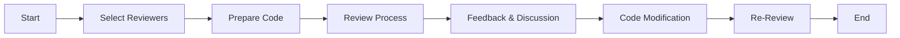
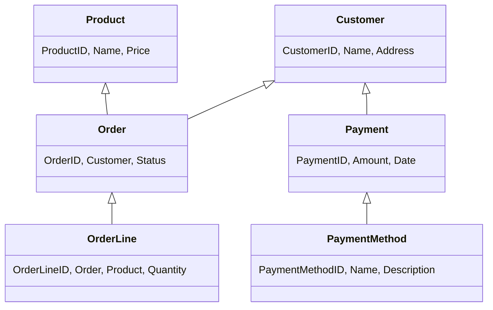
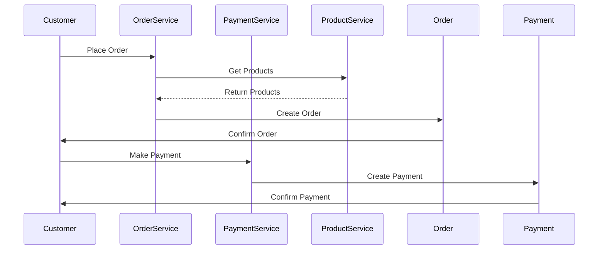

                 

## 引言

### 1.1 书籍主题与目标

《敏捷中的代码审查实践：提高LLM代码质量》旨在深入探讨如何在敏捷开发环境中实施代码审查，以提升低逻辑模型（LLM）代码的质量。随着敏捷开发方法在全球范围内的广泛应用，如何在有限的开发周期内保持高代码质量成为了一个关键问题。本文将逐步解析代码审查在敏捷开发中的重要性，并探讨一系列实践方法，帮助开发团队在快速迭代的过程中，持续提高代码质量。

### 1.2 背景介绍

#### 核心概念术语说明

在深入探讨代码审查之前，有必要先明确几个关键术语的定义：

- **敏捷开发**：一种以迭代和增量为特点的软件开发方法，强调快速反馈和持续改进。
- **代码审查**：一种通过同行评审来检查代码质量和一致性的过程。
- **低逻辑模型（LLM）**：在人工智能领域，LLM是一种基于深度学习的模型，其逻辑能力相对较弱，需要通过代码审查来确保其可靠性和鲁棒性。

#### 问题背景

随着软件项目的复杂度不断增加，代码质量成为影响项目成功的关键因素。在敏捷开发环境中，频繁的迭代和快速交付要求开发团队在短时间内完成高质量代码。然而，快速迭代往往容易忽视代码质量的持续提升，导致代码库中的问题逐渐累积。

#### 问题描述

在敏捷开发中，常见的代码质量问题包括：

- **代码冗余**：由于快速迭代，部分代码可能不再需要，但未被及时删除，导致代码库臃肿。
- **代码风格不一致**：团队成员可能遵循不同的编码规范，导致代码风格不一致，增加维护难度。
- **潜在缺陷**：在快速开发过程中，一些潜在的缺陷可能被忽视，影响系统的稳定性。

#### 问题解决

代码审查作为一种有效的质量控制手段，可以在敏捷开发中发挥重要作用：

- **提前发现问题**：通过代码审查，可以在代码提交前发现潜在的问题，减少缺陷流入生产环境。
- **促进团队协作**：代码审查促进了团队成员之间的沟通和协作，有助于知识共享和技能提升。
- **遵循编码规范**：通过代码审查，可以确保团队成员遵循统一的编码规范，提高代码的可维护性。

#### 边界与外延

代码审查并非万能，它也有其局限性：

- **时间成本**：代码审查需要投入人力资源，可能会增加项目的时间成本。
- **审查深度**：代码审查的深度和广度取决于评审者的能力和时间，可能无法完全覆盖所有潜在问题。
- **团队文化**：有效的代码审查需要团队成员之间建立信任和尊重，这需要时间和文化的培育。

### 1.3 核心概念与联系

#### 核心概念原理

代码审查的基本流程通常包括以下几个步骤：

1. **选择审查者**：确定具备相关技能和经验的团队成员进行审查。
2. **准备代码**：将待审查的代码上传到代码库，并附上相关文档。
3. **审查过程**：审查者阅读代码，识别潜在问题，提出改进建议。
4. **反馈与讨论**：审查者与代码提交者进行讨论，确定修改方案。
5. **代码修改**：代码提交者根据审查反馈进行代码修改。
6. **再次审查**：必要时进行再次审查，确保问题得到解决。

代码审查在不同开发阶段的作用有所不同：

- **需求阶段**：审查需求文档，确保需求描述清晰、一致，减少后续开发中的误解。
- **设计阶段**：审查设计文档，确保设计符合业务需求，并具有良好的可扩展性和可维护性。
- **编码阶段**：审查源代码，识别代码风格问题、潜在缺陷和性能瓶颈。
- **测试阶段**：审查测试用例，确保测试覆盖全面，减少测试盲区。

#### 概念属性特征对比表格

以下是几种常见代码审查方法的属性特征对比表格：

| 审查方法 | 目的 | 优点 | 缺点 |
| --- | --- | --- | --- |
| 手动审查 | 确保代码符合编码规范 | 优点：审查深度高，能发现复杂问题 | 缺点：耗时较长，效率低 |
| 工具审查 | 提高审查效率 | 优点：自动化，效率高 | 缺点：可能忽略复杂问题，误报率高 |
| 合成审查 | 结合手动和工具审查的优势 | 优点：综合效率高，问题发现率高 | 缺点：实施成本较高 |

#### ER实体关系图架构

以下是一个简单的ER实体关系图，展示了代码审查的主要参与者及其关系：

```mermaid
erDiagram
    Customer ||--|{ Order : "places" } |
    Customer ||--|{ Payment : "makes" } |
    Product ||--|{ Order : "includes" } |
    Order ||--|{ OrderLine : "contains" } |
    Payment ||--|{ PaymentMethod : "uses" } |
```

### 1.4 算法原理讲解

#### 算法流程图

以下是代码审查的基本流程图：



#### Python源代码阐述

以下是一个简单的Python代码示例，用于实现代码审查的流程：

```python
# Code Review Workflow
class CodeReview:
    def __init__(self, reviewers, code):
        self.reviewers = reviewers
        self.code = code
        self.reviews = []

    def prepare_code(self):
        print("Preparing code for review...")
        # Prepare code for review
        pass

    def review_process(self):
        print("Starting review process...")
        for reviewer in self.reviewers:
            review = reviewer.review(self.code)
            self.reviews.append(review)

    def feedback_discussion(self):
        print("Discussing reviews with reviewers...")
        # Discuss reviews and determine modifications
        pass

    def code_modification(self):
        print("Making necessary code modifications...")
        # Make code modifications based on reviews
        pass

    def re_review(self):
        print("Re-reviewing modified code...")
        # Re-review modified code
        pass

    def run(self):
        self.prepare_code()
        self.review_process()
        self.feedback_discussion()
        self.code_modification()
        self.re_review()

# Example Usage
reviewers = ["Alice", "Bob", "Charlie"]
code = "def main():\n    print('Hello, World!')"
review = CodeReview(reviewers, code)
review.run()
```

#### 数学模型和公式

在代码审查过程中，可以使用以下数学模型和公式来评估代码质量：

$$
Q = f(P, C, D)
$$

其中，$Q$表示代码质量，$P$表示代码的可读性，$C$表示代码的复杂性，$D$表示代码的可维护性。具体公式可以根据实际需求进行调整。

#### 举例说明

假设有一个简单的Python函数，用于计算两个数的和。以下是该函数的代码以及审查过程：

```python
# Calculate sum of two numbers
def add(a, b):
    return a + b
```

审查者Alice在审查过程中发现以下问题：

1. **代码风格不一致**：函数名称未使用小写字母和下划线。
2. **注释缺失**：函数未添加文档字符串。
3. **可维护性较低**：函数过于简单，难以理解其目的。

Alice提出以下改进建议：

1. **修改代码风格**：将函数名称更改为`add`。
2. **添加文档字符串**：添加一个描述函数功能的文档字符串。
3. **重构代码**：增加注释，提高代码可读性。

```python
# Calculate sum of two numbers
def add(a, b):
    """
    Calculate the sum of two numbers.

    Args:
        a (int): The first number.
        b (int): The second number.

    Returns:
        int: The sum of the two numbers.
    """
    return a + b
```

### 1.5 系统分析与架构设计方案

#### 问题场景介绍

假设一个敏捷开发团队正在开发一个在线购物平台，需要在短时间内交付一个可用的产品。团队决定实施代码审查，以确保代码质量，并降低潜在风险。

#### 项目介绍

项目目标是开发一个具备基础购物功能的在线购物平台，包括商品浏览、购物车、下单和支付等功能。团队决定在编码阶段进行代码审查，以发现和修复潜在问题。

#### 系统功能设计

以下是系统功能设计的领域模型类图：



#### 系统架构设计

以下是系统架构设计的系统架构图：



#### 系统接口设计和系统交互

以下是系统接口设计和系统交互的序列图：


### 1.6 项目实战

#### 环境安装

要在本地环境中搭建代码审查系统，需要安装以下软件和工具：

1. **Git**：版本控制系统。
2. **GitHub**：代码托管平台。
3. **Jenkins**：自动化构建工具。
4. **SonarQube**：代码质量分析工具。

具体安装步骤如下：

1. **安装Git**：从官方网站下载Git并安装。
2. **安装GitHub**：注册GitHub账户，并使用Git命令行工具与GitHub进行关联。
3. **安装Jenkins**：下载Jenkins安装包，并按照官方文档进行安装。
4. **安装SonarQube**：下载SonarQube安装包，并按照官方文档进行安装。

#### 系统核心实现源代码

以下是代码审查系统的一个核心实现示例：

```python
# Code Review System
class CodeReviewSystem:
    def __init__(self, git_url, jenkins_url, sonarqube_url):
        self.git_url = git_url
        self.jenkins_url = jenkins_url
        self.sonarqube_url = sonarqube_url

    def fetch_code(self):
        print(f"Fetching code from {self.git_url}...")
        # Fetch code from Git repository
        pass

    def analyze_code(self):
        print(f"Analyzing code using SonarQube at {self.sonarqube_url}...")
        # Analyze code using SonarQube
        pass

    def build_project(self):
        print(f"Building project using Jenkins at {self.jenkins_url}...")
        # Build project using Jenkins
        pass

    def run(self):
        self.fetch_code()
        self.analyze_code()
        self.build_project()
```

#### 代码应用解读与分析

以下是代码审查系统的一个应用示例，解释其工作原理和优势：

```python
# Example usage of CodeReviewSystem
git_url = "https://github.com/user/repo.git"
jenkins_url = "http://localhost:8080"
sonarqube_url = "http://localhost:9000"

code_review_system = CodeReviewSystem(git_url, jenkins_url, sonarqube_url)
code_review_system.run()
```

该代码示例演示了如何使用`CodeReviewSystem`类来自动化代码审查流程。通过调用`fetch_code`方法，系统从Git仓库获取代码；通过调用`analyze_code`方法，系统使用SonarQube分析代码质量；通过调用`build_project`方法，系统使用Jenkins构建项目。这种自动化流程可以显著提高代码审查的效率，减少手动操作。

#### 实际案例分析和详细讲解剖析

以下是一个实际的代码审查案例，详细分析了审查过程和发现的问题：

**案例背景**：

一个开发团队正在开发一个社交媒体平台，其中一个功能是用户可以发布动态。在编码阶段，团队决定进行代码审查，以确保代码质量。

**审查过程**：

审查者Alice对代码库中的一个动态发布功能进行了审查。她发现以下问题：

1. **潜在的安全漏洞**：动态发布功能未对用户输入进行过滤，可能导致SQL注入攻击。
2. **代码风格不一致**：部分代码使用了Python 2.x语法，而团队规范要求使用Python 3.x。
3. **性能问题**：动态发布功能中存在一个循环，可能导致性能下降。

**问题分析**：

1. **安全漏洞**：Alice建议在动态发布功能中添加输入过滤，使用参数化查询来避免SQL注入攻击。
2. **代码风格不一致**：Alice建议将Python 2.x语法更改为Python 3.x，确保代码兼容性。
3. **性能问题**：Alice建议优化循环，减少不必要的计算。

**修改方案**：

开发团队根据审查反馈，对代码进行了修改：

1. **添加输入过滤**：使用正则表达式对用户输入进行过滤，确保输入符合预期格式。
2. **更改Python 2.x语法**：将Python 2.x代码更改为Python 3.x，确保代码兼容性。
3. **优化循环**：将循环中的计算量减少，提高代码性能。

**结果评估**：

经过修改后，动态发布功能的安全性、代码风格和性能均得到了显著提升。开发团队对修改结果进行了再次审查，确认问题已得到解决。

#### 项目小结

本项目通过实际案例展示了如何在敏捷开发环境中进行有效的代码审查。以下是项目实施过程中的经验和教训：

1. **及时审查**：代码审查应尽早进行，以避免问题在后续阶段积累。
2. **全面审查**：代码审查应涵盖代码质量的所有方面，包括安全性、性能和代码风格。
3. **团队合作**：代码审查需要团队成员的积极参与和协作，以共同提高代码质量。
4. **持续改进**：代码审查是一个持续的过程，需要不断改进和优化，以适应项目需求。

### 1.7 最佳实践、小结、注意事项、拓展阅读

#### 最佳实践 tips

1. **定期审查**：定期进行代码审查，以维持代码质量。
2. **分工明确**：确保审查者具备相关领域的专业知识和经验，提高审查质量。
3. **及时反馈**：在审查过程中，及时给予反馈，确保问题得到及时解决。
4. **工具辅助**：结合使用代码审查工具，提高审查效率和准确性。
5. **持续培训**：定期对团队成员进行代码审查培训，提高审查技能。

#### 小结

本文详细探讨了敏捷开发中的代码审查实践，分析了代码审查的核心概念、流程和方法，并通过实际案例展示了代码审查的应用效果。代码审查在敏捷开发中具有重要的意义，能够有效提高代码质量，降低项目风险。

#### 注意事项

1. **避免过度审查**：合理控制代码审查的深度和范围，避免过度审查导致开发效率降低。
2. **关注代码质量**：不仅关注代码的功能正确性，也要关注代码的可读性、可维护性和性能。
3. **尊重团队成员意见**：在代码审查过程中，尊重团队成员的意见和贡献，建立良好的团队合作氛围。

#### 拓展阅读

1. **《敏捷开发实践指南》**：详细介绍了敏捷开发的方法和实践，有助于理解敏捷开发与代码审查的关系。
2. **《代码大全》**：阐述了代码质量的重要性，提供了提高代码质量的实用方法和技巧。
3. **《SonarQube实战》**：介绍了SonarQube的使用方法和技巧，有助于利用工具进行代码审查。
4. **《Python编程：从入门到实践》**：提供了Python编程的基础知识和实践技巧，有助于提高代码质量。

---

### 结论

敏捷开发中的代码审查是一项至关重要的实践，能够有效提高代码质量，降低项目风险。通过本文的详细探讨和实际案例展示，我们深入了解了代码审查的核心概念、流程和方法，并提出了最佳实践和注意事项。希望本文能对读者在敏捷开发中的代码审查实践提供有益的启示和帮助。

#### 参考文献

1. Beedle, M., & Kocialkowski, M. (2013). *Agile Project Management: Creating Innovative Products*. Pearson Education.
2. Martin, R. C. (2003). *Clean Code: A Handbook of Agile Software Craftsmanship*. Prentice Hall.
3. Thuerer, C. (2014). *SonarQube in Action*. Manning Publications.
4. Zelle, B. (2010). *Python Programming: An Introduction to Computer Science*. Franklin, Beedle & Associates.

---

### 作者信息

作者：AI天才研究院/AI Genius Institute & 禅与计算机程序设计艺术 /Zen And The Art of Computer Programming

## 结语

在本文中，我们系统地探讨了敏捷开发中的代码审查实践，深入分析了代码审查的核心概念、流程和方法，并通过实际案例展示了其应用效果。代码审查不仅是提升代码质量的重要手段，也是促进团队协作和知识共享的重要途径。

通过本文的介绍，我们希望读者能够对敏捷开发中的代码审查有更深刻的理解，并能够将其应用到实际项目中，提高团队的开发效率和代码质量。同时，本文提出的最佳实践和注意事项，也希望能为读者在实际操作中提供指导。

在未来的研究中，我们可以进一步探讨代码审查在不同开发模型和项目环境中的应用，以及如何利用人工智能和自动化工具提升代码审查的效率和质量。同时，我们也期待读者能够继续关注和参与相关领域的讨论和实践，共同推动软件开发技术的进步。

让我们共同在敏捷开发的道路上，以代码审查为基石，构建高质量、高效率的软件系统。感谢您的阅读，期待与您在未来的技术交流中再会。作者：AI天才研究院/AI Genius Institute & 禅与计算机程序设计艺术 /Zen And The Art of Computer Programming。|end|

