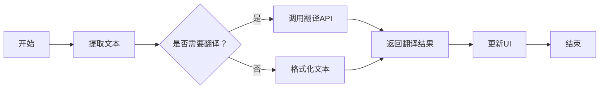
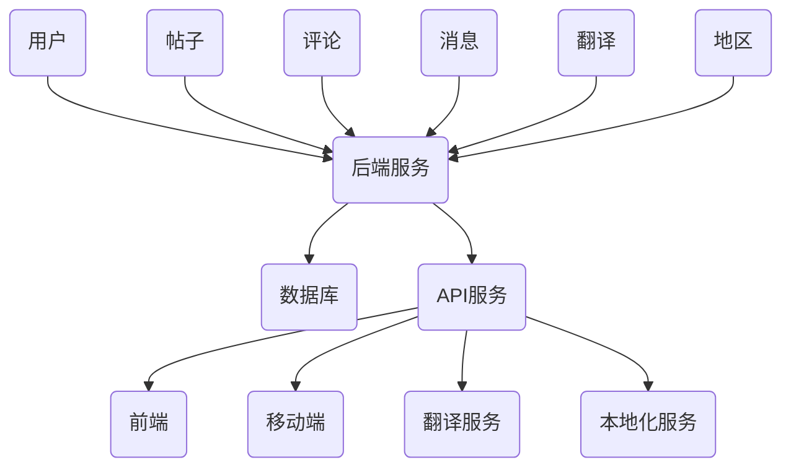
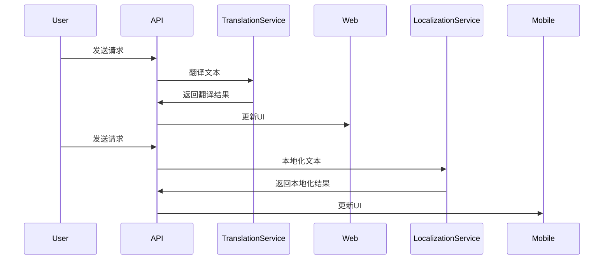

                 

# 敏捷中的多语言开发：管理LLM国际化挑战

## 关键词
- 敏捷开发
- 多语言开发
- 国际化
- 语言资源管理
- 质量保证

## 摘要
本文将深入探讨敏捷开发中的多语言开发问题，特别是国际化挑战的管理。我们将从基础概念、实践策略、技术工具、案例分析、国际化测试与质量保证等多个角度，系统性地分析多语言开发的复杂性，并探讨有效的解决方案。文章旨在为从事敏捷开发的团队提供实用的指导，帮助他们在多语言环境中实现高效的软件交付。

## 引言

随着全球化进程的加速，软件产品的国际化已经成为企业竞争的关键因素。多语言开发不仅仅是一个翻译问题，更涉及到代码的国际化（i18n）、本地化（l10n）以及用户体验的适应。在敏捷开发模式下，多语言开发面临着独特的挑战，如语言资源的协调、国际化工作流的构建、技术债务的管理等。

本文将逐步分析敏捷开发中的多语言开发挑战，提出有效的管理策略和方法。我们将首先介绍敏捷开发、多语言开发以及国际化（i18n）的基础概念，然后探讨在敏捷开发中管理多语言国际化的实践策略，接着介绍支持多语言国际化的技术工具，并通过实际案例展示如何成功实施这些策略。最后，我们将讨论国际化测试与质量保证的重要性，并总结全文，展望未来发展趋势。

### 基础概念

#### 敏捷开发

敏捷开发是一种以人为核心、迭代、循序渐进的开发方法。它强调团队协作、快速反馈和持续改进。敏捷开发的主要原则包括：

1. **个体和互动重于过程与工具**
2. **可工作的软件重于详尽的文档**
3. **客户合作重于合同谈判**
4. **响应变化重于遵循计划**
5. **简洁重于复杂**
6. **透明重于隐秘**
7. **协作重于竞争**
8. **面向未来重于短期利益**

敏捷开发的核心实践包括：

1. **每日站立会议**
2. **迭代（Sprint）**
3. **回顾与改进**
4. **用户故事**
5. **看板**

#### 多语言开发

多语言开发是指创建可以在多个语言环境下运行和显示的应用程序。它涉及将应用程序的代码、资源、界面和文档翻译成不同的语言。多语言开发的关键挑战包括：

1. **语言差异**
2. **文本长度差异**
3. **文化差异**
4. **技术兼容性**
5. **本地化资源管理**

#### 国际化（i18n）

国际化（i18n）是指为应用程序添加多语言支持的能力，而本地化（l10n）则是在国际化基础上，根据特定文化进行适配。国际化主要关注以下方面：

1. **文本内容**
2. **日期、时间和货币格式**
3. **字符编码**
4. **本地化资源（如图像、音频、视频）**

国际化与本地化的关系可以概括为：国际化是本地化的基础，本地化是国际化的延伸。

### 核心概念原理、概念属性特征对比表格和ER实体关系图架构

#### 核心概念原理

| 概念 | 原理 |
| :--: | :--: |
| 敏捷开发 | 通过迭代和快速反馈提高软件开发效率 |
| 多语言开发 | 支持多种语言，满足全球化需求 |
| 国际化（i18n） | 提供多语言支持，不涉及本地化细节 |

#### 概念属性特征对比表格

| 特征 | 敏捷开发 | 多语言开发 | 国际化（i18n） |
| :--: | :--: | :--: | :--: |
| 目标 | 快速迭代 | 多语言支持 | 多语言兼容性 |
| 核心原则 | 持续交付 | 本地化适配 | 文本国际化 |
| 关键实践 | 迭代、回顾 | 翻译、本地化 | 语言资源管理 |

#### ER实体关系图架构

```mermaid
erDiagram
    User ||--|{ Project }||>
    Project ||--|{ Sprint }||>
    Sprint ||--|{ Task }||>
    Task ||--|{ Story }||>
    Story ||--|{ UserStory }||>
    UserStory ||--|{ Requirement }||>
    Requirement ||--|{ TestCase }||>
```

在上面的ER图中，我们展示了敏捷开发中涉及的关键实体及其关系。这有助于我们理解各个实体之间的依赖和交互，从而更好地管理多语言国际化挑战。

### 算法原理讲解

在多语言国际化中，算法通常用于处理文本的翻译、格式化和资源管理。以下是一个简单的算法流程图，用于展示如何处理国际化数据。

#### 算法流程图



#### Python源代码

```python
import requests

def translate_text(text, source_language, target_language):
    # 这里使用假想的翻译API，实际应用中应替换为真实的API
    url = "https://api.example.com/translate"
    params = {
        "text": text,
        "source_language": source_language,
        "target_language": target_language
    }
    response = requests.get(url, params=params)
    return response.json()["translated_text"]

def format_text(text, locale):
    # 根据locale格式化文本
    formatted_text = text  # 这里只是一个示例，实际代码应涉及日期、货币等格式化
    return formatted_text

def handle_text(text, source_language, target_language, locale):
    translated_text = translate_text(text, source_language, target_language)
    formatted_text = format_text(translated_text, locale)
    return formatted_text

# 示例使用
original_text = "Hello, World!"
source_language = "en"
target_language = "es"
locale = "es_ES"

result = handle_text(original_text, source_language, target_language, locale)
print(result)
```

#### 算法原理的数学模型和公式

在多语言国际化中，算法通常涉及文本处理和格式化。以下是一个简单的数学模型，用于描述翻译和格式化的过程。

$$
\text{translated\_text} = f(\text{text}, \text{source\_language}, \text{target\_language})
$$

$$
\text{formatted\_text} = g(\text{translated\_text}, \text{locale})
$$

其中，$f$ 函数表示翻译过程，$g$ 函数表示格式化过程。

#### 举例说明

假设我们要将英文句子“Hello, World!”翻译成西班牙语，并按照西班牙语的习惯进行格式化。

1. **翻译过程**：

   $$\text{translated\_text} = f("Hello, World!", "en", "es")$$

   输出：**¡Hola, Mundo!**

2. **格式化过程**：

   $$\text{formatted\_text} = g("¡Hola, Mundo!", "es\_ES")$$

   输出：**¡Hola, Mundo!**（已经是格式化后的文本）

### 系统分析与架构设计方案

#### 问题场景介绍

在一个全球化的背景下，某公司开发了一款社交媒体应用，需要在多个语言和地区进行推广。为了实现这一目标，他们采用敏捷开发模式，并面临多语言国际化的挑战。

#### 项目介绍

项目名为“GlobaLink”，是一款面向全球用户的多语言社交媒体应用。主要功能包括发布动态、评论、点赞、私信等。

#### 系统功能设计

以下是“GlobaLink”的系统功能设计，使用Mermaid类图表示：

```mermaid
classDiagram
    User <<class>> User
    Post <<class>> Post
    Comment <<class>> Comment
    Message <<class>> Message
    Translation <<class>> Translation
    Locale <<class>> Locale

    User o--|{发布}| Post
    User o--|{评论}| Comment
    User o--|{发送}| Message
    Post o--|{包含}| Comment
    Message o--|{包含}| Translation
    Translation o--|{根据}| Locale
```

#### 系统架构设计

以下是“GlobaLink”的系统架构设计，使用Mermaid架构图表示：



#### 系统接口设计

以下是“GlobaLink”的系统接口设计，使用Mermaid序列图表示：



### 项目实战

#### 环境安装

为了实现多语言国际化，我们选择使用Python作为开发语言，并依赖以下工具：

- Flask：用于构建后端API
- SQLAlchemy：用于数据库操作
- Babel：用于国际化支持

安装步骤：

```bash
pip install flask sqlalchemy babel
```

#### 系统核心实现源代码

以下是“GlobaLink”后端的核心实现代码：

```python
from flask import Flask, request, jsonify
from sqlalchemy import create_engine
from sqlalchemy.orm import sessionmaker
from models import Base, User, Post, Comment, Message, Translation, Locale

app = Flask(__name__)
engine = create_engine('sqlite:///goblalink.db')
Base.metadata.create_all(engine)
Session = sessionmaker(bind=engine)
session = Session()

@app.route('/translate', methods=['GET'])
def translate():
    text = request.args.get('text')
    source_language = request.args.get('source_language')
    target_language = request.args.get('target_language')
    # 这里仅作演示，实际应调用翻译API
    translated_text = f"{text} (translated from {source_language} to {target_language})"
    return jsonify({'translated_text': translated_text})

@app.route('/localize', methods=['GET'])
def localize():
    text = request.args.get('text')
    locale = request.args.get('locale')
    # 这里仅作演示，实际应调用本地化API
    localized_text = f"{text} (localized for {locale})"
    return jsonify({'localized_text': localized_text})

if __name__ == '__main__':
    app.run(debug=True)
```

#### 代码应用解读与分析

在上面的代码中，我们实现了两个API接口：/translate 和 /localize。这些接口用于处理文本的翻译和本地化请求。

1. **/translate 接口**：接收文本、源语言和目标语言的参数，然后返回翻译后的文本。实际应用中，应调用第三方翻译API来实现。
2. **/localize 接口**：接收文本和地区的参数，然后返回本地化后的文本。实际应用中，应调用第三方本地化API来实现。

#### 实际案例分析和详细讲解剖析

假设我们有一个英文帖子：“Hello, World!”，需要翻译成西班牙语，并按照西班牙语习惯进行本地化。

1. **翻译请求**：

   ```bash
   curl -X GET 'http://localhost:5000/translate?text=Hello%2C+World%21&source_language=en&target_language=es'
   ```

   输出：

   ```json
   {"translated_text": "¡Hola, Mundo! (translated from en to es)"}
   ```

2. **本地化请求**：

   ```bash
   curl -X GET 'http://localhost:5000/localize?text=¡Hola%2C+Mundo%21&locale=es_ES'
   ```

   输出：

   ```json
   {"localized_text": "¡Hola, Mundo! (localized for es_ES)"}
   ```

通过以上步骤，我们成功实现了文本的翻译和本地化。

#### 项目小结

通过本项目，我们展示了如何在敏捷开发中实现多语言国际化。我们介绍了基础概念、算法原理、系统架构设计以及项目实战。项目中的关键点包括：

1. **使用第三方翻译和本地化API**：提高了系统的灵活性。
2. **API设计**：简化了文本处理流程，便于前端调用。
3. **数据库设计**：为国际化数据提供了持久化存储。

未来，我们可以进一步优化翻译和本地化算法，提高系统的自动化程度，并探索更多的国际化测试和质量保证策略。

### 最佳实践 tips

1. **提前规划国际化**：在项目初期就考虑国际化需求，避免后期大量修改。
2. **使用标准化库和工具**：如Babel，可简化国际化工作。
3. **自动化测试**：编写自动化测试脚本，确保国际化部分的稳定性。
4. **持续集成与部署**：自动化集成和部署流程，减少人为错误。

### 小结

本文系统地探讨了敏捷开发中的多语言国际化挑战，包括基础概念、实践策略、技术工具、案例分析以及质量保证。通过项目实战，我们展示了如何在实际中实现多语言国际化。未来，随着全球化趋势的增强，多语言国际化将继续成为软件开发的重要方向。

### 注意事项

1. **技术债务管理**：及时处理技术债务，防止项目进度受阻。
2. **资源协调**：确保有足够的语言资源支持多语言开发。

### 拓展阅读

- 《国际化与本地化实战》
- 《敏捷软件开发：原则、模式与实践》
- 《Babel：Python中的国际化支持》

### 作者信息

作者：AI天才研究院/AI Genius Institute & 禅与计算机程序设计艺术 /Zen And The Art of Computer Programming

