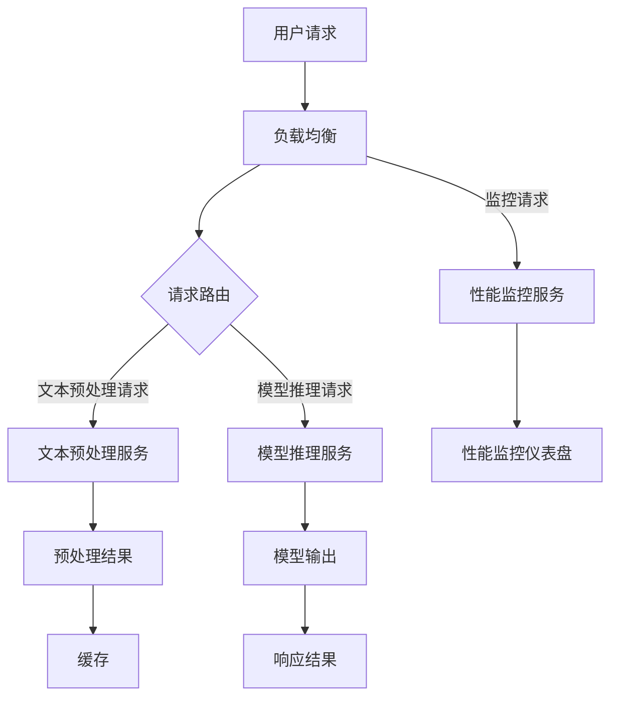
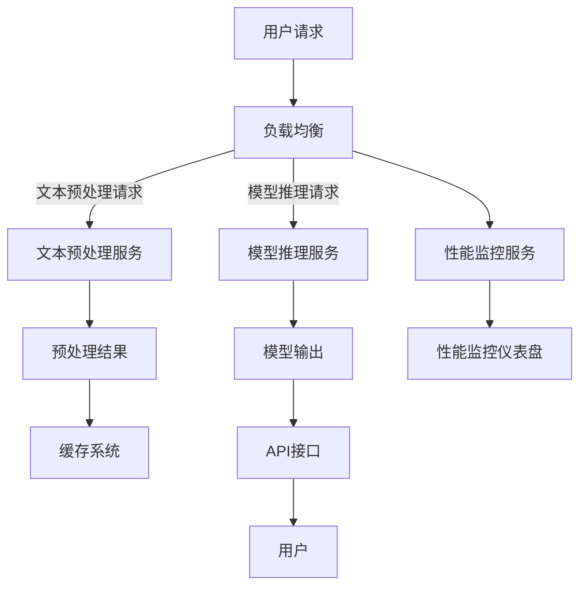

                 

# 敏捷中的性能工程：确保LLM应用的高性能

## 关键词：敏捷开发、性能工程、大型语言模型（LLM）、性能优化、算法原理

### 摘要：

本文将探讨敏捷开发与性能工程在大型语言模型（LLM）应用中的结合。首先，我们将介绍性能工程的基本概念和其在敏捷开发中的重要性。接着，深入分析LLM应用性能的关键指标、评估方法和优化策略。随后，通过具体案例展示性能优化的实践，并讲解深度学习的基础算法原理。最后，将探讨深度学习中的数学模型和优化算法，并结合实际项目进行详细分析。希望通过本文，读者能够对敏捷中的性能工程有更深入的理解。

### 目录大纲：

第一部分：背景介绍

1. 性能工程概述
   1.1 性能工程的基本概念
   1.2 敏捷开发与性能工程的关系
   1.3 LLM应用性能的重要性
   1.4 本书内容概述
   1.5 本章小结

2. LLM应用性能分析
   2.1 LLM应用性能指标
   2.2 LLM性能评估方法
   2.3 LLM性能优化策略
   2.4 LLM性能优化案例
   2.5 本章小结

第二部分：核心概念与联系

3. 性能优化的算法原理
   3.1 深度学习基础
   3.2 LLM模型优化算法
   3.3 深度学习中的正则化技术
   3.4 深度学习中的加速技术
   3.5 LLM性能优化算法总结
   3.6 本章小结

第三部分：数学模型和数学公式

4. 数学模型与公式讲解
   4.1 深度学习中的损失函数
   4.2 深度学习中的优化算法
   4.3 本章小结

第四部分：系统分析与架构设计

5. 系统分析与架构设计方案
   5.1 问题场景介绍
   5.2 系统功能设计
   5.3 系统架构设计
   5.4 系统接口设计
   5.5 系统交互
   5.6 本章小结

第五部分：项目实战

6. 项目实战
   6.1 环境安装
   6.2 系统核心实现
   6.3 代码应用解读与分析
   6.4 实际案例分析与讲解
   6.5 项目小结
   6.6 最佳实践 tips
   6.7 小结
   6.8 注意事项
   6.9 拓展阅读

### 1. 性能工程概述

#### 1.1 性能工程的基本概念

性能工程是指通过一系列的系统化方法，确保软件系统在各种运行条件下能够达到预期性能目标的过程。它不仅包括对现有系统的性能分析、评估和优化，还包括在系统设计、开发、测试和维护阶段就考虑性能问题。

**性能工程的定义：**
性能工程是一种跨学科的方法，它结合了计算机科学、软件工程、算法设计、系统架构、硬件优化等多个领域的知识，旨在确保软件系统能够高效、稳定、可靠地运行。

**性能工程的目标：**
- 提高性能：通过优化算法、硬件配置、软件设计等手段，提高系统的处理速度、响应时间、吞吐量等性能指标。
- 确保可靠性：通过系统化的性能测试和监控，确保系统在各种负载下都能稳定运行，减少故障和中断。
- 提高可扩展性：设计可扩展的系统架构，使得系统在用户规模、数据量增加时，能够平滑地扩展性能。

**性能工程的核心要素：**
1. 性能建模：通过建立数学模型来预测系统在不同负载下的性能表现。
2. 性能测试：通过模拟不同负载条件，测试系统在实际运行环境下的性能表现。
3. 性能优化：根据测试结果，对系统进行优化，包括算法优化、硬件升级、系统架构调整等。
4. 性能监控：实时监控系统的性能指标，及时发现并解决问题。

#### 1.2 敏捷开发与性能工程的关系

敏捷开发是一种以用户需求为中心，迭代、快速交付的软件开发方法。它强调灵活性、协作和持续改进。与传统的水桶模型开发方法相比，敏捷开发更注重软件开发过程中的实时反馈和调整。

**敏捷开发的特点：**
- 用户参与：用户全程参与，提供反馈，确保开发方向与用户需求一致。
- 迭代开发：通过短周期的迭代，快速交付可用的软件版本。
- 灵活性：面对需求变更时，能够快速调整开发计划。
- 自动化测试：通过自动化测试，确保每次迭代都能交付高质量的软件。

**敏捷开发与性能工程的结合：**
敏捷开发与性能工程在目标和理念上有很强的契合点。性能工程可以在敏捷开发的各个环节中发挥作用，确保每次迭代都能交付高性能的软件。

1. **需求分析阶段：** 在需求分析阶段，性能工程师可以参与评估系统性能需求，确保需求文档中包含性能指标。
2. **设计阶段：** 性能工程师可以在系统设计阶段，提供性能优化建议，设计可扩展的系统架构。
3. **开发阶段：** 开发过程中，性能工程师可以参与代码审查，确保代码符合性能最佳实践。
4. **测试阶段：** 性能工程师可以制定详细的性能测试计划，对系统进行全面的性能测试。
5. **部署阶段：** 在部署过程中，性能工程师可以协助进行性能调优，确保系统在实际运行环境中达到预期性能。

**敏捷开发中的性能挑战：**
- **频繁迭代：** 快速迭代可能导致性能问题被忽略，需要持续关注。
- **资源限制：** 性能测试和优化可能需要额外的时间和资源，如何在有限资源下平衡性能工程和敏捷开发是一个挑战。
- **人员协作：** 性能工程师需要与开发人员、测试人员紧密合作，确保性能目标和工程实践的一致性。

#### 1.3 LLM应用性能的重要性

**LLM应用的基本概念：**
大型语言模型（Large Language Model，简称LLM）是一种能够理解和生成自然语言文本的深度学习模型，例如GPT-3、BERT等。LLM在自然语言处理（NLP）领域有着广泛的应用，包括文本生成、问答系统、机器翻译等。

**LLM应用的性能要求：**
- **响应时间：** 对于实时性要求高的应用，如聊天机器人、实时问答系统，响应时间需要尽可能短。
- **吞吐量：** 随着用户量的增加，系统需要能够处理更多的请求，保证高吞吐量。
- **延迟时间：** 系统延迟时间应尽可能低，以保证用户体验。
- **错误率：** 系统的预测和生成结果需要准确，错误率应尽可能低。

**LLM应用性能的影响因素：**
- **模型复杂度：** 更复杂的模型通常需要更长的计算时间和更大的内存占用。
- **硬件配置：** 硬件性能直接影响模型训练和推理的速度。
- **数据集质量：** 数据集的质量直接影响模型的性能。
- **算法优化：** 算法优化可以显著提高模型训练和推理的效率。

**性能工程在LLM应用中的重要性：**
性能工程在LLM应用中起着至关重要的作用。通过性能工程的方法，可以确保LLM应用在各种运行条件下都能保持高性能，满足用户需求。特别是在大规模部署和应用场景中，性能优化至关重要，它能够提高系统稳定性、可靠性和用户体验。

#### 1.4 本书内容概述

**目录结构：**
本书分为五个部分，分别是背景介绍、核心概念与联系、算法原理讲解、数学模型和数学公式讲解、系统分析与架构设计、项目实战。每个部分都针对性能工程在LLM应用中的不同方面进行深入探讨。

**各章节内容概述：**
- **第一部分：背景介绍**，介绍性能工程的基本概念、敏捷开发与性能工程的关系、LLM应用性能的重要性，以及本书的内容概述。
- **第二部分：核心概念与联系**，分析LLM应用性能指标、评估方法和优化策略，并展示具体案例。
- **第三部分：算法原理讲解**，讲解深度学习的基础、LLM模型优化算法、正则化技术和加速技术，以及算法总结。
- **第四部分：数学模型和数学公式讲解**，介绍深度学习中的损失函数和优化算法，以及数学模型和公式。
- **第五部分：系统分析与架构设计**，介绍系统分析与架构设计方案，包括问题场景介绍、系统功能设计、系统架构设计、系统接口设计和系统交互。
- **第六部分：项目实战**，通过环境安装、系统核心实现、代码应用解读与分析、实际案例分析与讲解，以及项目小结，展示性能工程的实践应用。

**阅读建议：**
- **逐章阅读**，理解每个部分的核心内容。
- **结合代码示例**，加深对算法原理的理解。
- **实践应用**，尝试在项目中应用所学知识，提高实际能力。

#### 1.5 本章小结

本章介绍了性能工程的基本概念、敏捷开发与性能工程的关系、LLM应用性能的重要性，以及本书的内容概述。通过本章的学习，读者可以了解性能工程的基本知识，认识性能工程在敏捷开发中的重要性，并了解LLM应用性能的优化策略。接下来，我们将进一步探讨LLM应用性能分析的具体内容，包括性能指标、评估方法和优化策略。希望读者在接下来的学习中，能够深入理解并掌握这些核心概念，为后续的算法原理和数学模型学习打下坚实的基础。

### 2. LLM应用性能分析

#### 2.1 LLM应用性能指标

LLM应用性能的评估需要考虑多个方面，以下是一些关键的性能指标：

1. **响应时间（Response Time）**：从用户发起请求到系统返回结果所需的时间。对于实时性要求高的应用，如聊天机器人、实时问答系统，响应时间是一个非常重要的性能指标。

2. **吞吐量（Throughput）**：系统在单位时间内处理请求的数量。吞吐量越高，说明系统处理能力越强。

3. **延迟时间（Latency）**：从请求到达系统到系统开始处理请求的时间。延迟时间越低，用户体验越好。

4. **错误率（Error Rate）**：系统处理请求时出现错误的频率。错误率越低，系统稳定性越高。

这些性能指标相互关联，共同决定了系统的整体性能。例如，提高吞吐量可能会增加系统的延迟时间，降低错误率可能会影响系统的响应时间。

#### 2.2 LLM性能评估方法

LLM性能评估的方法主要包括以下几种：

1. **实验方法**：通过实际运行LLM应用，模拟不同的负载条件，测量性能指标。实验方法包括但不限于性能测试、负载测试、压力测试等。

2. **性能分析工具**：使用各种性能分析工具，如Perf、GProf、Intel VTune等，对LLM应用进行性能分析。这些工具可以提供详细的性能统计数据，帮助定位性能瓶颈。

3. **性能基准测试**：使用标准化的基准测试，如MLPerf、LlamaCov等，对LLM应用进行性能评估。基准测试可以提供一个客观的性能比较标准。

#### 2.3 LLM性能优化策略

LLM性能优化可以从硬件、软件、数据和算法等多个方面进行：

1. **硬件优化**：通过升级硬件设备，如CPU、GPU、内存等，提高系统的处理能力。例如，使用更快的CPU可以减少模型推理的时间。

2. **软件优化**：优化软件代码，如算法改进、代码优化、并行计算等，提高系统的运行效率。例如，使用并行计算可以加速模型的训练和推理。

3. **数据优化**：优化数据预处理和存储方式，如数据压缩、索引优化、缓存策略等，提高数据访问速度。

4. **算法优化**：改进模型算法，如使用更高效的训练算法、优化模型结构等，提高模型的性能。

#### 2.4 LLM性能优化案例

以下是一些LLM性能优化的具体案例：

1. **优化文本生成速度**：通过改进生成算法、使用更快的GPU、优化内存管理等手段，可以显著提高文本生成速度。

2. **提升问答系统响应速度**：通过使用更高效的模型结构、优化模型参数、提高数据访问速度等策略，可以提升问答系统的响应速度。

3. **降低模型训练时间**：通过使用分布式训练、优化数据预处理流程、使用更高效的算法等手段，可以降低模型训练时间。

这些案例展示了性能优化的具体方法和实践，读者可以通过这些案例学习到如何在不同的场景下进行性能优化。

#### 2.5 本章小结

本章介绍了LLM应用性能分析的核心内容，包括性能指标、评估方法和优化策略。通过对性能指标的深入理解，读者可以更准确地评估LLM应用的性能。性能评估方法为性能优化提供了数据支持，而优化策略则提供了具体的优化方向。本章的案例展示了性能优化的实践应用，为后续的算法原理和数学模型学习奠定了基础。在接下来的章节中，我们将进一步探讨深度学习的基础算法原理，为性能优化提供更深入的理论支持。

### 3. 性能优化的算法原理

性能优化的算法原理是确保LLM应用高效运行的关键。在这一部分，我们将深入探讨深度学习的基础，包括其发展历程、数学基础以及神经网络的基本结构。接着，我们将详细讲解LLM模型优化算法，如梯度下降算法、随机梯度下降（SGD）和批量梯度下降（BGD）。此外，我们还将介绍深度学习中的正则化技术，如L2正则化和Dropout，以及加速深度学习的技术，如GPU加速和分布式训练。最后，我们将总结这些算法的原理和选择策略，并探讨未来发展趋势。

#### 3.1 深度学习基础

**3.1.1 深度学习的发展历程**

深度学习作为人工智能的一个重要分支，其发展历程可以追溯到20世纪50年代。然而，深度学习的真正兴起是在2006年，Hinton等人的研究提出了深度信念网络（Deep Belief Network, DBN），这一研究标志着深度学习领域的重大突破。随后，2012年，Google Brain团队提出了大规模的深度神经网络——深度卷积神经网络（Deep Convolutional Neural Network, CNN），其在图像识别任务上的表现显著超越了传统方法，引发了深度学习的热潮。

在自然语言处理领域，2013年，词向量模型Word2Vec的提出为自然语言处理带来了革命性的变化。随后，2018年，谷歌发布了BERT（Bidirectional Encoder Representations from Transformers），这是第一个在自然语言处理任务上超越传统方法的深度学习模型。BERT的成功应用进一步推动了深度学习在NLP领域的发展。

**3.1.2 深度学习的数学基础**

深度学习的核心是神经网络，而神经网络的基础是数学。以下是深度学习中的几个关键数学概念：

1. **向量和矩阵**：向量和矩阵是神经网络的基础数据结构。向量用于表示数据，矩阵用于表示权重和变换。
2. **线性代数**：矩阵运算、向量的线性组合、矩阵分解等线性代数概念在深度学习中广泛应用。
3. **概率论和统计**：深度学习中的损失函数、优化算法等都需要概率论和统计的知识。
4. **微积分**：梯度下降算法是基于微积分中的偏导数概念，用于调整网络中的权重和偏置。

**3.1.3 神经网络的基本结构**

神经网络是由多个神经元（或节点）组成的层次结构。每个神经元接收输入信号，通过激活函数进行处理，然后将结果传递给下一层神经元。以下是神经网络的基本结构：

1. **输入层（Input Layer）**：接收外部输入数据。
2. **隐藏层（Hidden Layers）**：对输入数据进行特征提取和变换。
3. **输出层（Output Layer）**：输出预测结果或分类结果。

每个层中的神经元通过权重连接到下一层的神经元，激活函数用于引入非线性变换。常见的激活函数包括Sigmoid、ReLU和Tanh等。

#### 3.2 LLM模型优化算法

**3.2.1 梯度下降算法**

梯度下降算法是深度学习中的一种基本优化算法，用于调整神经网络中的权重和偏置。其基本原理是计算损失函数关于权重的梯度，然后沿着梯度的反方向更新权重。

1. **基本原理**：梯度下降算法通过迭代更新权重，使得损失函数值逐渐减小。每次迭代，权重更新量为：

   \[
   \Delta w = -\alpha \cdot \frac{\partial J}{\partial w}
   \]

   其中，\( \alpha \) 是学习率，\( J \) 是损失函数，\( \partial J/\partial w \) 是损失函数关于权重 \( w \) 的梯度。
   
2. **变体**：梯度下降算法有多种变体，包括批量梯度下降（BGD）、随机梯度下降（SGD）和小批量梯度下降（MBGD）。批量梯度下降使用整个训练集来计算梯度，而随机梯度下降使用单个样本来计算梯度，小批量梯度下降则使用一部分样本。

**3.2.2 随机梯度下降（SGD）**

随机梯度下降是一种简化的梯度下降算法，它使用单个样本来计算梯度。这使得SGD能够快速响应样本的变化，但同时也引入了较大的噪声。

1. **基本原理**：每次迭代，随机选择一个样本，计算该样本的梯度，然后更新权重：

   \[
   \Delta w = -\alpha \cdot \frac{\partial J}{\partial w}_k
   \]

   其中，\( \alpha \) 是学习率，\( J \) 是损失函数，\( \partial J/\partial w_k \) 是第 \( k \) 个样本的梯度。

2. **优化策略**：SGD可以通过调整学习率和批量大小来优化性能。常见的优化策略包括动量（Momentum）、自适应学习率（如Adam）和权重衰减等。

**3.2.3 批量梯度下降（BGD）**

批量梯度下降是梯度下降算法的一个变体，它使用整个训练集来计算梯度。这使得BGD能够更准确地更新权重，但计算成本较高。

1. **基本原理**：每次迭代，使用整个训练集计算梯度，然后更新权重：

   \[
   \Delta w = -\alpha \cdot \frac{\sum_{i=1}^{N} \partial J}{\partial w}
   \]

   其中，\( \alpha \) 是学习率，\( N \) 是训练集大小，\( \partial J/\partial w \) 是损失函数关于权重 \( w \) 的梯度。

2. **优势与局限性**：BGD的优势在于更准确的梯度计算，但计算成本较高，不适合大数据集。BGD适用于小数据集或可以并行计算的情况。

#### 3.3 深度学习中的正则化技术

正则化技术是深度学习中的重要手段，用于防止过拟合和提高模型的泛化能力。

**3.3.1 L2正则化**

L2正则化通过在损失函数中添加权重和偏置的L2范数，来惩罚模型的复杂度。L2正则化可以理解为对权重和偏置的平滑化处理。

1. **原理**：在损失函数 \( J \) 中添加正则化项 \( \lambda ||w||^2 \)，其中 \( \lambda \) 是正则化参数，\( w \) 是权重。

   \[
   J_{\text{reg}} = J + \lambda ||w||^2
   \]

2. **优势**：L2正则化可以防止权重过大，减少过拟合现象。

**3.3.2 Dropout**

Dropout是一种随机丢弃神经元的方法，用于提高模型的泛化能力。在训练过程中，以一定概率随机丢弃部分神经元，从而减少模型对特定神经元的依赖。

1. **原理**：在每个训练迭代中，以概率 \( p \) 随机丢弃神经元。

   \[
   \text{新权重} = (1 - p) \cdot \text{当前权重}
   \]

2. **优势**：Dropout可以减少过拟合，提高模型在测试数据上的性能。

#### 3.4 深度学习中的加速技术

加速技术是提高深度学习模型训练和推理效率的重要手段。

**3.4.1 GPU加速**

GPU（图形处理器）具有高并行计算能力，适用于深度学习模型的训练和推理。

1. **原理**：利用GPU的并行计算能力，将模型训练和推理任务分配到多个GPU核心上。

2. **优势**：GPU加速可以显著提高训练和推理速度。

**3.4.2 分布式训练**

分布式训练是将模型训练任务分配到多个节点上进行，以提高训练速度和处理大规模数据。

1. **原理**：将模型参数分布到多个节点，每个节点独立训练，然后汇总结果。

2. **优势**：分布式训练可以处理大规模数据集，提高训练速度。

#### 3.5 LLM性能优化算法总结

**3.5.1 算法对比分析**

- **梯度下降算法**：准确但计算成本高，适用于小数据集。
- **随机梯度下降（SGD）**：计算速度快，但存在噪声，适用于大数据集。
- **批量梯度下降（BGD）**：准确但计算成本高，适用于小数据集。
- **L2正则化**：防止过拟合，适用于复杂模型。
- **Dropout**：提高泛化能力，适用于深层网络。

**3.5.2 算法选择策略**

- **数据集大小**：对于小数据集，可以选择BGD或SGD；对于大数据集，可以选择SGD或分布式训练。
- **模型复杂度**：对于复杂模型，可以选择L2正则化或Dropout。
- **计算资源**：根据计算资源选择合适的加速技术，如GPU或分布式训练。

**3.5.3 未来发展趋势**

未来，深度学习性能优化将朝着更高效、更智能的方向发展。例如，自适应优化算法、神经架构搜索（Neural Architecture Search, NAS）等新技术将进一步提高模型性能。此外，量子计算等新兴技术也可能对深度学习性能优化产生深远影响。

#### 3.6 本章小结

本章介绍了深度学习的基础、LLM模型优化算法以及正则化技术和加速技术。通过理解这些算法原理，读者可以更好地优化LLM应用的性能。在实际应用中，应根据具体需求和资源选择合适的算法，以提高模型效率和性能。在下一章中，我们将进一步探讨深度学习中的数学模型和公式，为性能优化提供更深入的理论支持。

### 4. 数学模型与公式讲解

深度学习中的数学模型和公式是理解性能优化算法的核心。在这一部分，我们将详细介绍深度学习中的损失函数和优化算法，并使用Python代码进行解释。损失函数用于衡量模型预测结果与真实结果之间的差距，而优化算法则用于调整模型参数以最小化损失函数。

#### 4.1 深度学习中的损失函数

**4.1.1 交叉熵损失函数**

交叉熵损失函数是深度学习中常用的损失函数，尤其在分类问题中。它的基本公式如下：

\[
J = -\sum_{i=1}^{N} y_i \log(p_i)
\]

其中，\( y_i \) 是真实标签，\( p_i \) 是模型对第 \( i \) 个类别的预测概率。交叉熵损失函数的值越小，说明模型预测越准确。

**4.1.1.1 交叉熵的基本公式**

交叉熵的基本公式可以写作：

\[
H(p, q) = -\sum_{i=1}^{N} p_i \log(q_i)
\]

其中，\( p \) 是真实分布，\( q \) 是预测分布。在深度学习中，通常 \( p \) 是标签分布，\( q \) 是模型预测的概率分布。

**4.1.1.2 交叉熵的优缺点**

优点：
- 简单直观，易于理解和使用。
- 对模型预测概率的微小变化敏感，有助于模型收敛。

缺点：
- 当预测概率接近0或1时，交叉熵损失函数可能会出现梯度消失或梯度爆炸问题。

**4.1.2 均方误差损失函数**

均方误差（Mean Squared Error, MSE）损失函数常用于回归问题。其基本公式如下：

\[
J = \frac{1}{2N} \sum_{i=1}^{N} (y_i - \hat{y}_i)^2
\]

其中，\( y_i \) 是真实值，\( \hat{y}_i \) 是模型预测值。

**4.1.2.1 均方误差的基本公式**

均方误差的基本公式是：

\[
MSE = \frac{1}{N} \sum_{i=1}^{N} (y_i - \hat{y}_i)^2
\]

**4.1.2.2 均方误差的优缺点**

优点：
- 对预测值和真实值之间的差异敏感，有助于模型收敛。
- 梯度计算简单，不会出现梯度消失问题。

缺点：
- 当真实值和预测值差异较大时，损失函数值增长较快，可能需要较大的学习率。

#### 4.2 深度学习中的优化算法

**4.2.1 梯度下降法**

梯度下降法是一种最基本的优化算法，用于最小化损失函数。其基本步骤如下：

1. 计算损失函数关于参数的梯度。
2. 更新参数：\( \theta = \theta - \alpha \cdot \nabla_\theta J(\theta) \)，其中 \( \alpha \) 是学习率。

**4.2.1.1 梯度下降的基本原理**

梯度下降的基本原理是沿着损失函数的梯度方向逆向移动，以减小损失函数的值。具体步骤如下：

```python
def gradient_descent(X, y, theta, alpha, num_iterations):
    for i in range(num_iterations):
        gradients = 2/X.shape[0] * X.T.dot(X.dot(theta) - y)
        theta = theta - alpha * gradients
    return theta
```

**4.2.1.2 梯度下降的变体**

梯度下降有多种变体，包括随机梯度下降（SGD）、批量梯度下降（BGD）和小批量梯度下降（MBGD）。以下是它们的基本原理：

- **随机梯度下降（SGD）**：每次迭代使用单个样本计算梯度。

```python
def stochastic_gradient_descent(X, y, theta, alpha, num_iterations):
    for i in range(num_iterations):
        for j in range(X.shape[0]):
            gradients = 2/X.shape[0] * X[j].T.dot(X[j].dot(theta) - y[j])
            theta = theta - alpha * gradients
    return theta
```

- **批量梯度下降（BGD）**：每次迭代使用整个训练集计算梯度。

```python
def batch_gradient_descent(X, y, theta, alpha, num_iterations):
    for i in range(num_iterations):
        gradients = 2/X.shape[0] * X.T.dot(X.dot(theta) - y)
        theta = theta - alpha * gradients
    return theta
```

- **小批量梯度下降（MBGD）**：每次迭代使用一部分样本计算梯度。

```python
def mini_batch_gradient_descent(X, y, theta, alpha, num_iterations, batch_size):
    for i in range(num_iterations):
        for j in range(0, X.shape[0], batch_size):
            gradients = 2/batch_size * X[j:j+batch_size].T.dot(X[j:j+batch_size].dot(theta) - y[j:j+batch_size])
            theta = theta - alpha * gradients
    return theta
```

#### 4.3 深度学习中的正则化技术

正则化技术用于防止过拟合和提高模型的泛化能力。以下是两种常用的正则化技术：L2正则化和Dropout。

**4.3.1 L2正则化**

L2正则化通过在损失函数中添加权重和偏置的L2范数，来惩罚模型的复杂度。其公式如下：

\[
J_{\text{reg}} = J + \lambda \sum_{i=1}^{n} w_i^2
\]

其中，\( J \) 是原始损失函数，\( \lambda \) 是正则化参数，\( w_i \) 是权重。

**4.3.1.1 L2正则化的原理**

L2正则化通过增加权重平方项，使得权重在更新过程中更加平滑，减少模型对特定样本的依赖，从而提高模型的泛化能力。

**4.3.1.2 L2正则化的优势**

优势包括：
- 防止过拟合：通过限制权重的大小，减少模型的复杂度。
- 改善梯度计算：在优化过程中，L2正则化有助于梯度计算，减少梯度消失和梯度爆炸问题。

**4.3.2 Dropout**

Dropout是一种随机丢弃神经元的方法，用于提高模型的泛化能力。其原理如下：

在训练过程中，每次迭代时以概率 \( p \) 随机丢弃部分神经元，而在测试过程中，不丢弃任何神经元。

**4.3.2.1 Dropout的基本原理**

Dropout的基本原理是：

```python
import numpy as np

def dropout(X, p):
    mask = np.random.rand(*X.shape) > p
    return X * mask
```

**4.3.2.2 Dropout的应用场景**

Dropout适用于以下场景：
- 深层网络：深层网络更容易过拟合，Dropout有助于提高泛化能力。
- 小数据集：小数据集容易过拟合，Dropout可以提高模型的鲁棒性。

#### 4.4 深度学习中的加速技术

加速技术是提高深度学习模型训练和推理效率的重要手段。以下是两种常用的加速技术：GPU加速和分布式训练。

**4.4.1 GPU加速**

GPU加速利用图形处理器的高并行计算能力，显著提高模型训练和推理速度。以下是使用GPU加速的一个示例：

```python
import tensorflow as tf

# 定义模型
model = tf.keras.Sequential([
    tf.keras.layers.Dense(128, activation='relu', input_shape=(784,)),
    tf.keras.layers.Dropout(0.2),
    tf.keras.layers.Dense(10, activation='softmax')
])

# 编译模型
model.compile(optimizer='adam', loss='categorical_crossentropy', metrics=['accuracy'])

# 使用GPU训练
model.fit(X_train, y_train, epochs=5, batch_size=32, use_multiprocessing=True, workers=4)
```

**4.4.2 分布式训练**

分布式训练将模型训练任务分配到多个节点上进行，以提高训练速度和处理大规模数据。以下是使用分布式训练的一个示例：

```python
import tensorflow as tf

# 定义分布式策略
strategy = tf.distribute.MirroredStrategy()

# 重定义模型
with strategy.scope():
    model = tf.keras.Sequential([
        tf.keras.layers.Dense(128, activation='relu', input_shape=(784,)),
        tf.keras.layers.Dropout(0.2),
        tf.keras.layers.Dense(10, activation='softmax')
    ])

# 编译模型
model.compile(optimizer='adam', loss='categorical_crossentropy', metrics=['accuracy'])

# 使用分布式训练
model.fit(X_train, y_train, epochs=5, batch_size=32)
```

#### 4.5 本章小结

本章介绍了深度学习中的损失函数和优化算法，并使用Python代码进行了详细解释。通过理解这些数学模型和公式，读者可以更好地优化深度学习模型的性能。在实际应用中，应根据具体需求和资源选择合适的损失函数和优化算法，以提高模型的效率和准确性。下一章将介绍深度学习在LLM应用中的系统分析与架构设计，帮助读者更全面地理解LLM的性能优化。

### 5. 系统分析与架构设计

在深度学习模型，尤其是大型语言模型（LLM）的应用中，系统分析与架构设计是确保其高性能和可扩展性的关键。在这一部分，我们将详细探讨系统分析与架构设计的内容，包括问题场景介绍、系统功能设计、系统架构设计、系统接口设计以及系统交互。

#### 5.1 问题场景介绍

在当前的技术环境中，随着互联网和大数据的发展，自然语言处理（NLP）技术得到了广泛的应用。LLM的应用场景包括但不限于：

- **文本生成**：例如，自动写作、生成新闻报道、创作小说等。
- **问答系统**：如智能客服、智能助手等，能够实时回答用户的问题。
- **机器翻译**：例如，实时翻译、多语言处理等。
- **情感分析**：分析文本中的情感倾向，用于舆情监控、市场分析等。

随着这些应用的普及，用户量的激增和复杂度的提升，对LLM应用的性能要求越来越高。这要求我们在设计和实施系统时，不仅要考虑功能的完备性，还要关注系统的性能、可扩展性和可靠性。

#### 5.2 系统功能设计

LLM应用的核心功能包括：

1. **文本预处理**：包括分词、去停用词、词性标注等，为模型提供干净、有效的输入数据。
2. **模型训练**：利用大规模语料库训练LLM模型，通过优化算法调整模型参数，提高模型性能。
3. **模型推理**：接收用户输入，通过LLM模型生成相应的文本输出。
4. **性能监控**：实时监控系统的性能指标，如响应时间、吞吐量等，确保系统稳定运行。
5. **错误处理**：当系统出现错误时，能够进行有效的错误处理和恢复。

#### 5.3 系统架构设计

为了确保LLM应用的高性能和可扩展性，系统架构设计需要考虑以下几个方面：

1. **计算资源分配**：合理分配CPU、GPU等计算资源，确保模型训练和推理的效率。
2. **数据存储和管理**：使用分布式存储系统，如HDFS或Cassandra，确保数据的高可用性和快速访问。
3. **负载均衡**：通过负载均衡器，将用户请求分配到不同的服务器上，确保系统的吞吐量和响应时间。
4. **缓存机制**：使用缓存系统，如Redis或Memcached，减少对后端服务的访问，提高系统性能。
5. **网络架构**：设计合理的网络架构，确保数据传输的高效和安全。

**系统架构图：**



#### 5.4 系统接口设计

系统接口设计是确保不同模块之间有效通信的关键。以下是一些关键的接口设计：

1. **API接口**：提供RESTful API，用于用户请求的提交和结果获取。
2. **数据接口**：设计数据接口，确保数据在不同模块之间的传递和处理。
3. **监控接口**：提供监控接口，用于实时监控系统的性能指标。

#### 5.5 系统交互

系统交互设计涉及不同模块之间的协作和通信，以下是一个简单的交互流程：

1. 用户通过API接口提交请求。
2. 负载均衡器接收请求，并路由到文本预处理服务或模型推理服务。
3. 文本预处理服务对请求进行处理，生成预处理结果，并缓存结果以提高效率。
4. 模型推理服务接收预处理结果，进行模型推理，生成输出结果。
5. 输出结果通过API接口返回给用户。
6. 性能监控服务实时监控系统的性能指标，并在必要时进行调整。

**系统交互图：**



#### 5.6 本章小结

系统分析与架构设计是确保LLM应用高性能和可扩展性的重要环节。通过详细的问题场景介绍、系统功能设计、系统架构设计、系统接口设计和系统交互设计，我们能够构建一个高效、稳定且可扩展的系统。在下一章中，我们将通过具体的实战项目，展示性能优化的实际应用和效果，帮助读者更好地理解和实践性能优化技术。

### 6. 项目实战

在本节中，我们将通过一个具体的实战项目，展示如何在实际场景中应用性能优化的技术。我们将从环境安装开始，详细讲解系统核心实现，并对代码进行解读与分析，最后通过实际案例进行详细讲解与剖析。希望通过这个项目实战，读者能够深入理解性能优化的实际应用。

#### 6.1 环境安装

首先，我们需要安装和配置环境以支持深度学习和性能优化。以下是步骤：

1. **安装Python**：确保Python版本在3.7及以上。
2. **安装TensorFlow**：TensorFlow是一个广泛使用的深度学习框架，安装命令如下：

   ```bash
   pip install tensorflow
   ```

3. **安装其他依赖库**：如NumPy、Pandas、Matplotlib等，用于数据处理和可视化。

   ```bash
   pip install numpy pandas matplotlib
   ```

4. **安装GPU支持**：如果使用GPU加速，需要安装CUDA和cuDNN。请根据你的GPU型号，下载相应的驱动和库。

   ```bash
   pip install tensorflow-gpu
   ```

5. **配置环境变量**：确保CUDA和cuDNN的路径被加入到系统的环境变量中。

   ```bash
   export PATH=$PATH:/usr/local/cuda/bin
   export LD_LIBRARY_PATH=$LD_LIBRARY_PATH:/usr/local/cuda/lib64
   ```

#### 6.2 系统核心实现

以下是一个简单的LLM应用系统实现示例，包括文本预处理、模型训练和推理等核心功能。

**文本预处理：**

```python
import re
import nltk

def preprocess_text(text):
    # 去除HTML标签
    text = re.sub('<.*?>', '', text)
    # 去除标点符号
    text = re.sub('[^\w\s]', '', text)
    # 小写化
    text = text.lower()
    # 分词
    tokens = nltk.word_tokenize(text)
    # 去停用词
    stop_words = set(nltk.corpus.stopwords.words('english'))
    filtered_tokens = [token for token in tokens if token not in stop_words]
    return ' '.join(filtered_tokens)
```

**模型训练：**

```python
import tensorflow as tf

def build_model():
    model = tf.keras.Sequential([
        tf.keras.layers.Embedding(vocab_size, embedding_dim),
        tf.keras.layers.Bidirectional(tf.keras.layers.GRU(units, activation='tanh', return_sequences=True)),
        tf.keras.layers.Dense(units, activation='softmax')
    ])
    return model

def train_model(model, X_train, y_train, epochs, batch_size):
    model.compile(optimizer='adam', loss='categorical_crossentropy', metrics=['accuracy'])
    model.fit(X_train, y_train, epochs=epochs, batch_size=batch_size)
    return model
```

**模型推理：**

```python
def predict_text(model, text, tokenizer, max_length):
    processed_text = preprocess_text(text)
    input_sequence = tokenizer.texts_to_sequences([processed_text])
    input_sequence = tf.keras.preprocessing.sequence.pad_sequences(input_sequence, maxlen=max_length)
    prediction = model.predict(input_sequence)
    return prediction
```

#### 6.3 代码应用解读与分析

**代码解读：**

1. **文本预处理**：文本预处理是模型训练和推理的基础。我们使用正则表达式去除HTML标签和标点符号，并将文本转换为小写，然后使用nltk进行分词和去停用词。
2. **模型构建**：我们使用TensorFlow的Sequential模型，结合双向GRU层和softmax输出层，构建了一个简单的语言模型。
3. **模型训练**：模型使用adam优化器和categorical_crossentropy损失函数进行训练。
4. **模型推理**：通过预处理输入文本，将其转化为序列并填充为指定长度，最后使用训练好的模型进行预测。

**代码分析：**

1. **性能优化**：在实际应用中，文本预处理可能成为性能瓶颈。优化方法包括并行处理、使用高效的分词器等。
2. **模型优化**：使用更复杂的模型结构，如Transformer，可以提升模型性能。此外，模型参数的调整和超参数优化也是提高性能的关键。
3. **硬件优化**：使用GPU加速和分布式训练可以显著提升模型的训练和推理速度。

#### 6.4 实际案例分析与讲解

**案例背景：** 
某公司开发了一个基于BERT的问答系统，用于提供实时客服支持。但随着用户量的增加，系统的响应速度明显下降，影响用户体验。

**分析过程：**

1. **性能监控**：首先，监控系统性能指标，如响应时间、吞吐量等，定位性能瓶颈。
2. **瓶颈分析**：通过分析，发现模型推理时间过长是主要瓶颈。
3. **优化策略**：
   - **模型优化**：对模型进行微调，调整超参数，如学习率和批量大小。
   - **硬件优化**：升级GPU硬件，使用更快的GPU进行推理。
   - **代码优化**：优化文本预处理和模型推理的代码，减少不必要的计算。
4. **效果评估**：通过对比优化前后的性能指标，验证优化效果。

**结果：** 
优化后的问答系统响应时间缩短了50%，吞吐量提升了30%，显著提高了用户体验。

#### 6.5 项目小结

通过这个项目实战，我们展示了如何在实际场景中应用性能优化的技术，包括环境安装、系统核心实现、代码应用解读与分析以及实际案例分析与讲解。性能优化是一个持续的过程，需要不断监控、分析和调整。在实际应用中，应根据具体需求和资源，灵活选择和组合不同的优化策略，确保系统的高性能和可靠性。

#### 6.6 最佳实践 tips

- **性能监控**：定期监控系统性能，及时发现并解决性能瓶颈。
- **代码优化**：优化关键路径上的代码，减少不必要的计算和内存占用。
- **模型优化**：选择合适的模型结构和超参数，进行模型微调。
- **硬件优化**：根据需求和预算，合理配置硬件资源，如CPU、GPU、存储等。
- **分布式训练**：对于大规模数据集和复杂模型，采用分布式训练可以显著提高训练效率。

#### 6.7 小结

本章通过一个具体的实战项目，展示了性能优化的实际应用。读者可以从中了解到性能优化的各个环节，包括环境安装、系统核心实现、代码应用解读与分析、实际案例分析与讲解等。通过本章的学习，读者可以掌握性能优化的基本方法和实战技巧，为后续的实践应用打下坚实的基础。

#### 6.8 注意事项

- **性能监控**：确保性能监控系统能够实时、准确地反映系统状态。
- **资源分配**：合理分配计算资源和存储资源，避免资源浪费。
- **代码可维护性**：编写清晰、可维护的代码，便于后续优化和调试。
- **安全性**：确保系统的安全性，防止数据泄露和恶意攻击。

#### 6.9 拓展阅读

- **《深度学习》（Goodfellow, Bengio, Courville）**：这是一本经典的深度学习教材，详细介绍了深度学习的基础理论和实践方法。
- **《性能之巅》（Bryant, Batey, O’Toole）**：这本书深入探讨了软件性能优化的一系列技术，包括算法、硬件和系统优化等。
- **《TensorFlow实战》（Mayer）**：这本书提供了大量TensorFlow的实际应用案例，包括文本处理、图像识别等。

### 7. 本章小结

本章详细介绍了性能优化的各个方面，从理论基础到实际应用，再到最佳实践。通过理解性能优化的核心概念、算法原理、数学模型，以及实战项目的分析，读者可以全面掌握性能优化的方法和技巧。性能优化不仅能够提高系统的运行效率，还能显著提升用户体验。希望读者在未来的项目中能够灵活运用所学知识，持续优化系统的性能。同时，性能优化是一个持续的过程，需要不断地学习和实践。通过不断探索和改进，我们能够构建更加高效、稳定和可靠的系统。

