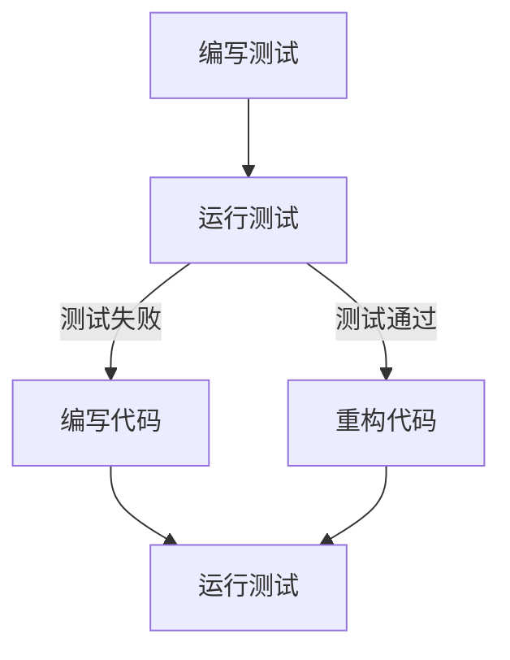
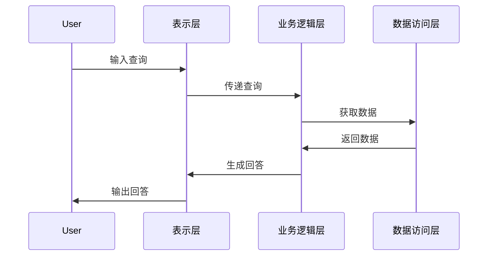
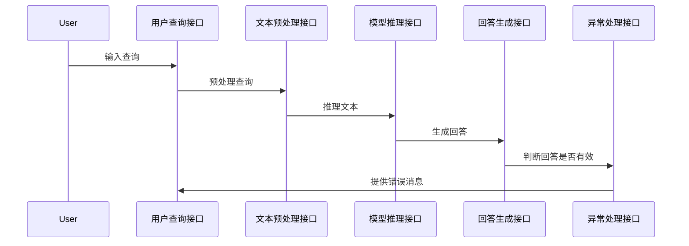

                 

# 敏捷中的技术实践：TDD在LLM应用开发中的应用

## 关键词：敏捷开发，TDD，LLM，测试驱动开发，软件质量，人工智能

## 摘要：

本文探讨了测试驱动开发（TDD）在大型语言模型（LLM）应用开发中的重要性。通过分析LLM应用开发的特点和挑战，本文提出了一系列TDD在LLM开发中的实践方法，包括编写测试用例、编写代码和重构。此外，本文还通过实际案例和最佳实践，详细阐述了TDD在LLM开发中的应用效果，为开发者提供了一种有效的技术实践方案。

## 目录大纲

### 第一部分: 问题背景

1.1 问题背景  
1.2 核心概念  
1.3 概念结构与核心要素组成

### 第二部分: TDD原理与实践

2.1 TDD原理  
2.2 TDD在LLM应用开发中的应用

### 第三部分: 案例分析与最佳实践

3.1 案例分析  
3.2 最佳实践

### 第四部分: 结论与展望

4.1 小结  
4.2 注意事项  
4.3 拓展阅读

## 第一部分: 问题背景

### 1.1 问题背景

在当今软件开发的浪潮中，敏捷开发方法已成为主流，而测试驱动开发（TDD）作为敏捷开发的一种实践，被广泛应用。TDD的核心思想是先写测试，再写代码，通过测试来驱动开发过程。这种开发方式能够有效提高代码质量，降低维护成本，并促进团队协作。

然而，在大型语言模型（LLM）的应用开发中，TDD的应用面临诸多挑战。首先，LLM应用通常涉及大量文本数据的处理，这使得测试用例的编写变得复杂。其次，LLM的输出结果具有动态性和不确定性，这使得测试用例的设计和执行更加困难。最后，LLM应用的开发周期通常较长，如何确保测试的覆盖率和有效性成为一个重要问题。

### 1.2 核心概念

#### 1.2.1 敏捷开发

敏捷开发是一种以人为核心、迭代、循序渐进的开发方法。它强调不断适应变化，通过迭代的方式逐步完善产品。敏捷开发的核心要素包括用户故事、迭代和反馈。

**用户故事**：描述用户需求的基本单位，通常包含一个主语、一个动词和一个对象。

**迭代**：一段相对固定的时间周期，用于完成一系列用户故事。

**反馈**：通过迭代过程中的持续反馈，不断调整开发方向。

#### 1.2.2 测试驱动开发（TDD）

测试驱动开发是一种软件开发实践方法，其核心思想是先写测试代码，再写功能代码，通过测试来驱动开发过程。TDD的工作流程主要包括三个阶段：写测试、编写代码和重构。

**写测试**：分析需求，编写测试用例，并运行测试，确保所有测试用例都失败。

**编写代码**：根据测试用例编写功能代码，并运行测试，确保所有测试用例都通过。

**重构**：优化代码结构，提高代码质量，并运行测试，确保重构后的代码仍然通过所有测试用例。

#### 1.2.3 大型语言模型（LLM）

大型语言模型是一种基于深度学习技术的人工智能模型，它能够理解和生成人类语言，广泛用于自然语言处理任务。LLM的核心要素包括数据集、模型架构和优化策略。

**数据集**：用于训练和评估LLM的文本数据。

**模型架构**：决定LLM性能和功能的关键因素。

**优化策略**：用于调整模型参数，提高模型性能。

### 1.3 概念结构与核心要素组成

#### 1.3.1 敏捷开发的核心要素

1. **用户故事**：描述用户需求的基本单位。
2. **迭代**：一段相对固定的时间周期，用于完成一系列用户故事。
3. **反馈**：通过迭代过程中的持续反馈，不断调整开发方向。

#### 1.3.2 TDD的核心要素

1. **测试用例**：描述期望功能的输入和输出。
2. **功能代码**：实现测试用例所描述的功能。
3. **重构**：优化代码，确保其可读性和可维护性。

#### 1.3.3 LLM应用开发的核心要素

1. **数据集**：用于训练和评估LLM的文本数据。
2. **模型架构**：决定LLM性能和功能的关键因素。
3. **优化策略**：用于调整模型参数，提高模型性能。

## 第二部分: TDD原理与实践

### 2.1 TDD原理

TDD是一种基于测试的软件开发方法，其核心思想是先写测试，再写代码。通过测试来驱动开发过程，确保代码的质量和可靠性。TDD的工作流程主要包括三个阶段：写测试、编写代码和重构。

#### 2.1.1 写测试

写测试是TDD的第一步，也是至关重要的一步。在写测试时，需要根据需求分析，明确要实现的功能，并编写相应的测试用例。测试用例应该尽可能地覆盖所有可能的输入和输出情况，以确保功能的完整性和正确性。

在编写测试用例时，可以使用各种测试框架和工具，如JUnit、NUnit、TestNG等。这些框架和工具提供了丰富的测试功能，如单元测试、集成测试、性能测试等，可以帮助开发者高效地编写和执行测试。

#### 2.1.2 编写代码

在编写代码阶段，开发者根据测试用例的要求，实现相应的功能。在编写代码时，需要遵循代码规范和设计模式，以确保代码的可读性和可维护性。同时，开发者还需要关注代码的性能和可扩展性，确保代码能够高效地运行。

在编写代码时，可以使用各种编程语言和开发框架，如Java、Python、Spring等。这些编程语言和开发框架提供了丰富的功能和工具，可以帮助开发者快速实现功能，并提高开发效率。

#### 2.1.3 重构

重构是TDD的第三步，也是保持代码质量的重要手段。在重构过程中，开发者需要对代码进行优化和改进，以提高代码的可读性和可维护性。重构可以包括代码结构调整、功能模块划分、代码复用等。

在重构过程中，需要确保重构后的代码仍然通过所有测试用例，以确保功能的完整性。同时，重构也需要遵循代码规范和设计模式，以避免引入新的问题。

### 2.2 TDD在LLM应用开发中的应用

在LLM应用开发中，TDD的应用具有特殊的挑战和优势。LLM应用通常涉及大量文本数据的处理，其输出结果具有动态性和不确定性，这使得测试用例的编写和执行变得复杂。但是，通过合理地应用TDD，可以提高开发效率和代码质量，从而应对这些挑战。

#### 2.2.1 编写测试用例

在编写LLM应用测试用例时，需要考虑到LLM的动态性和不确定性。以下是一些编写测试用例的建议：

1. **功能测试**：验证LLM的输出是否符合预期。例如，可以编写测试用例来测试LLM对特定文本的响应。

2. **性能测试**：评估LLM的处理速度和准确率。例如，可以编写测试用例来测试LLM在不同数据集上的处理时间。

3. **安全性测试**：确保LLM不会泄露敏感信息。例如，可以编写测试用例来测试LLM对输入数据的过滤和处理能力。

4. **异常测试**：测试LLM在遇到异常输入时的响应。例如，可以编写测试用例来测试LLM对空白输入、非法字符输入等的响应。

#### 2.2.2 编写代码

在编写LLM应用代码时，需要考虑到LLM的复杂性和动态性。以下是一些编写代码的建议：

1. **模块化设计**：将LLM应用分解为多个模块，便于测试和重构。每个模块应负责一个特定的功能，并具有良好的封装性。

2. **代码复用**：利用现有的代码库，减少重复开发。例如，可以使用预训练的模型来简化开发过程。

3. **代码规范**：遵循代码规范和设计模式，以提高代码的可读性和可维护性。例如，可以使用Python的PEP8规范来编写代码。

4. **性能优化**：关注代码的性能和可扩展性，确保代码能够高效地运行。例如，可以使用并行处理和优化算法来提高LLM的处理速度。

#### 2.2.3 重构

在LLM应用开发中，重构同样重要。以下是一些重构的建议：

1. **代码优化**：调整代码结构，提高代码质量。例如，可以重构复杂的函数和类，使其更加简洁和易读。

2. **功能模块划分**：根据功能需求，重新划分模块，以提高代码的可维护性和可扩展性。例如，可以将文本预处理、模型训练、模型评估等功能分离。

3. **代码复用**：在重构过程中，注意代码的复用，以减少重复开发。例如，可以将通用的代码片段提取为函数或类。

4. **性能优化**：在重构过程中，关注代码的性能，并进行优化。例如，可以使用优化算法和并行处理来提高代码的执行效率。

## 第三部分: 案例分析与最佳实践

### 3.1 案例分析

以一个自然语言处理（NLP）应用为例，分析TDD在LLM应用开发中的应用效果。

**案例背景**：某公司需要开发一款智能客服系统，用于处理用户的咨询和问题。系统需要能够理解用户的提问，并提供相应的回答。

**测试用例**：

1. **功能测试**：测试系统是否能够理解用户的问题，并给出正确的回答。
2. **性能测试**：测试系统在不同负载下的处理速度和准确率。
3. **安全性测试**：测试系统对用户输入的过滤和处理能力，确保不会泄露敏感信息。
4. **异常测试**：测试系统在遇到异常输入时的响应，如空白输入、非法字符输入等。

**代码实现**：

1. **模块化设计**：将系统划分为多个模块，如文本预处理、模型训练、模型预测等。
2. **代码复用**：使用预训练的模型和开源库，减少重复开发。
3. **代码规范**：遵循Python的PEP8规范，提高代码的可读性和可维护性。

**重构**：

1. **代码优化**：重构复杂的函数和类，使其更加简洁和易读。
2. **功能模块划分**：根据功能需求，重新划分模块，以提高代码的可维护性和可扩展性。
3. **代码复用**：在重构过程中，注意代码的复用，以减少重复开发。

**应用效果**：

1. **代码质量提高**：通过TDD，代码经过多次测试和重构，质量得到显著提高。
2. **开发效率提高**：TDD帮助团队快速发现和解决问题，提高了开发效率。
3. **系统性能提升**：通过性能测试和重构，系统处理速度和准确率得到提升。

### 3.2 最佳实践

**编写测试用例**：

1. **明确功能需求**：在编写测试用例前，明确功能需求，确保测试用例能够覆盖所有需求。
2. **覆盖各种情况**：编写测试用例时，要考虑各种输入和输出情况，确保测试的全面性。
3. **自动化测试**：使用自动化测试工具，如Selenium、JMeter等，提高测试效率。

**编写代码**：

1. **模块化设计**：将系统划分为多个模块，便于测试和重构。
2. **代码复用**：利用现有的代码库和开源库，减少重复开发。
3. **代码规范**：遵循代码规范和设计模式，提高代码的可读性和可维护性。

**重构**：

1. **定期重构**：定期对代码进行重构，保持代码的质量和可维护性。
2. **代码审查**：进行代码审查，发现和解决潜在的问题。
3. **持续集成**：将代码集成到测试环境中，及时发现和解决问题。

## 第四部分: 结论与展望

### 4.1 小结

本文探讨了测试驱动开发（TDD）在大型语言模型（LLM）应用开发中的应用。通过分析LLM应用开发的特点和挑战，本文提出了一系列TDD在LLM开发中的实践方法，包括编写测试用例、编写代码和重构。此外，本文还通过实际案例和最佳实践，详细阐述了TDD在LLM开发中的应用效果。

### 4.2 注意事项

1. **测试用例的覆盖度**：确保测试用例能够覆盖所有功能和可能的情况，提高测试的全面性。
2. **代码质量**：遵循代码规范和设计模式，提高代码的可读性和可维护性。
3. **重构的时机**：定期对代码进行重构，保持代码的质量和可维护性。

### 4.3 拓展阅读

1. 《测试驱动开发：敏捷测试实践》（Philippe Kruchten著）
2. 《大型语言模型：原理与应用》（Shenghuo Zhu著）
3. 《敏捷软件开发：原则、模式与实践》（Alistair Cockburn著）

## 作者信息

作者：AI天才研究院/AI Genius Institute & 禅与计算机程序设计艺术 /Zen And The Art of Computer Programming

[↑ 点击返回目录](#目录大纲)# 第一部分：问题背景

## 1.1 问题背景

在现代软件开发领域，敏捷开发方法（Agile Development）已经成为主流。敏捷开发强调团队协作、快速响应变化和持续交付高质量软件。在这种开发模式下，测试驱动开发（Test-Driven Development，简称TDD）作为一种重要的实践方法，被广泛应用于各种项目中。

然而，随着人工智能（AI）技术的迅速发展，尤其是大型语言模型（Large Language Models，简称LLM）的兴起，传统的TDD方法在LLM应用开发中遇到了新的挑战。LLM是一种能够理解和生成自然语言的大型神经网络模型，广泛应用于自然语言处理（Natural Language Processing，简称NLP）、机器翻译、文本生成等领域。由于其复杂性和动态性，LLM应用开发与传统软件项目相比，具有以下几个显著特点：

1. **复杂性**：LLM通常由数十亿甚至数万亿个参数组成，模型的训练和推理过程涉及大量的计算资源，这使得代码实现和测试变得更加复杂。
2. **动态性**：LLM的输出结果依赖于输入文本和模型的状态，这意味着同样的输入可能得到不同的输出，增加了测试的难度。
3. **不确定性**：由于神经网络模型的非线性特性，LLM的行为可能具有不可预测性，导致测试用例的设计和执行变得更加困难。

### 1.1.1 问题描述

在LLM应用开发中，TDD面临的几个关键问题包括：

1. **测试用例的设计**：如何在TDD框架下设计有效的测试用例，以覆盖所有可能的输入和输出情况，确保模型的稳定性和准确性？
2. **测试的执行**：如何高效地执行测试，特别是在模型训练和推理过程中，如何避免冗余测试和计算资源浪费？
3. **测试覆盖率的评估**：如何评估和优化测试覆盖率，确保测试能够充分覆盖模型的各个部分，避免潜在的错误和漏洞？
4. **重构的挑战**：如何在不影响模型性能和稳定性的情况下进行重构，保持代码的可维护性和可扩展性？

### 1.1.2 问题描述

具体来说，TDD在LLM应用开发中的问题可以进一步细化如下：

1. **测试用例的编写**：由于LLM模型输出结果的动态性和不确定性，编写全面且有效的测试用例成为一大挑战。传统的测试方法难以覆盖所有可能的输入和输出情况，而自动化测试工具和框架在某些情况下可能无法满足复杂模型的测试需求。
2. **测试执行的时间**：LLM模型的训练和推理过程通常需要大量的计算资源，这导致测试执行时间过长，影响开发效率。如何在保证测试质量的同时，减少测试执行时间？
3. **代码重构的难度**：在LLM应用开发中，代码重构的难度较大。由于模型参数和架构的复杂性，重构过程中可能引入新的错误，影响模型的性能和稳定性。如何平衡重构和模型性能之间的关系？
4. **团队的协作**：TDD强调团队协作和沟通，但LLM应用开发中的复杂性可能加剧团队成员之间的沟通障碍。如何提高团队协作效率，确保TDD实践的有效性？

### 1.1.3 问题解决

为了解决上述问题，本文将从以下几个方面探讨TDD在LLM应用开发中的应用：

1. **TDD的基本原理**：介绍TDD的基本原理和工作流程，阐述其在敏捷开发中的重要性。
2. **LLM应用开发的特点**：分析LLM应用开发中的复杂性和动态性，探讨其对TDD实践的影响。
3. **TDD在LLM应用开发中的应用策略**：提出具体的TDD实践方法，包括测试用例的编写、代码的实现和重构。
4. **案例分析与最佳实践**：通过实际案例分析和最佳实践，详细阐述TDD在LLM应用开发中的应用效果。

### 1.1.4 边界与外延

本文主要关注TDD在LLM应用开发中的具体应用，但所讨论的方法和原则也适用于其他复杂系统的测试驱动开发。此外，本文将重点讨论TDD的核心实践方法，而不涉及具体的LLM模型训练和推理技术。

## 1.2 核心概念

### 1.2.1 敏捷开发

敏捷开发是一种以人为核心、迭代、循序渐进的开发方法。它强调快速响应变化，通过不断迭代和反馈，逐步完善产品。敏捷开发的核心原则包括：

- **个体和互动重于过程和工具**：强调团队合作和个人能力的发挥。
- **可工作的软件重于详尽的文档**：注重实际交付可运行的软件，而非繁冗的文档。
- **客户协作重于合同谈判**：与客户保持紧密合作，及时获取反馈，调整开发方向。
- **响应变化重于遵循计划**：灵活应对变化，以适应市场需求。

敏捷开发的核心要素包括：

- **用户故事**：描述用户需求的基本单元，通常包含一个主语、一个动词和一个对象。
- **迭代**：一个固定的时间周期，用于完成一系列用户故事。
- **反馈**：通过迭代过程中的持续反馈，不断调整开发方向。

### 1.2.2 测试驱动开发（TDD）

测试驱动开发是一种软件开发实践方法，其核心思想是先写测试，再写代码。通过编写测试用例，确保代码的质量和功能完整性。TDD的工作流程主要包括三个阶段：

1. **写测试**：根据需求分析，编写测试用例，并运行测试，确保所有测试用例都失败。
2. **编写代码**：根据测试用例编写功能代码，并运行测试，确保所有测试用例都通过。
3. **重构**：优化代码结构，提高代码质量，并运行测试，确保重构后的代码仍然通过所有测试用例。

TDD的优点包括：

- **提高代码质量**：通过先写测试，确保代码的功能完整性。
- **降低维护成本**：代码经过多次测试和重构，质量得到保障，降低后续维护成本。
- **促进团队协作**：TDD强调编写测试用例和代码的协同工作，提高团队协作效率。

TDD的挑战包括：

- **需要较高的开发技能**：编写测试用例和代码需要开发者具备一定的编程能力和测试经验。
- **对开发流程有较高的要求**：TDD需要开发者遵循严格的开发流程，确保代码的质量和一致性。
- **可能影响开发进度**：TDD可能增加开发初期的时间成本，但在长期内有助于提高开发效率和代码质量。

### 1.2.3 大型语言模型（LLM）

大型语言模型是一种基于深度学习技术的人工智能模型，它能够理解和生成人类语言。LLM在自然语言处理领域具有广泛的应用，包括机器翻译、文本生成、情感分析等。LLM的核心要素包括：

- **数据集**：用于训练和评估LLM的文本数据集，通常包括大量的文本和标注信息。
- **模型架构**：LLM的神经网络架构，包括输入层、隐藏层和输出层等。
- **优化策略**：用于调整模型参数，提高模型性能和准确率。

LLM的主要特点包括：

- **复杂性**：LLM通常由数十亿个参数组成，模型的训练和推理过程涉及大量的计算资源。
- **动态性**：LLM的输出结果依赖于输入文本和模型的状态，使得测试用例的设计和执行变得更加复杂。
- **不确定性**：由于神经网络模型的非线性特性，LLM的行为可能具有不可预测性，增加了测试的难度。

### 1.3 概念结构与核心要素组成

#### 1.3.1 敏捷开发的核心要素

敏捷开发的核心要素包括用户故事、迭代和反馈。用户故事是描述用户需求的基本单元，通常包含一个主语、一个动词和一个对象。迭代是一个固定的时间周期，用于完成一系列用户故事。反馈是通过对迭代过程中的持续反馈，不断调整开发方向。

#### 1.3.2 TDD的核心要素

TDD的核心要素包括测试用例、功能代码和重构。测试用例是描述期望功能的输入和输出。功能代码是实现测试用例所描述的功能。重构是优化代码结构，提高代码质量。

#### 1.3.3 LLM应用开发的核心要素

LLM应用开发的核心要素包括数据集、模型架构和优化策略。数据集是用于训练和评估LLM的文本数据集。模型架构是LLM的神经网络架构。优化策略是用于调整模型参数，提高模型性能和准确率。

## 第二部分：TDD原理与实践

### 2.1 TDD原理

测试驱动开发（Test-Driven Development，简称TDD）是一种软件开发实践方法，其核心思想是先写测试，再写代码。TDD通过编写测试用例来驱动开发过程，确保代码的质量和功能完整性。TDD的工作流程主要包括三个阶段：写测试、编写代码和重构。

#### 2.1.1 写测试

写测试是TDD的第一步，也是至关重要的一步。在写测试时，需要根据需求分析，明确要实现的功能，并编写相应的测试用例。测试用例应该尽可能地覆盖所有可能的输入和输出情况，以确保功能的完整性和正确性。

编写测试用例的步骤如下：

1. **需求分析**：分析需求，明确要实现的功能和功能需求。
2. **设计测试用例**：根据需求设计测试用例，包括输入和预期的输出。
3. **编写测试代码**：使用测试框架（如JUnit、NUnit、TestNG等）编写测试代码，实现测试用例。
4. **运行测试**：运行测试，确保所有测试用例都失败。

在写测试的过程中，需要注意以下几点：

- **覆盖面**：测试用例应该尽可能地覆盖所有可能的输入和输出情况，确保功能的完整性和正确性。
- **可读性**：测试代码应该具有良好的可读性，便于其他开发者理解和维护。
- **自动化**：使用自动化测试工具和框架，提高测试效率和可重复性。

#### 2.1.2 编写代码

在编写代码阶段，开发者根据测试用例的要求，实现相应的功能。在编写代码时，需要遵循代码规范和设计模式，以确保代码的可读性和可维护性。同时，开发者还需要关注代码的性能和可扩展性，确保代码能够高效地运行。

编写代码的步骤如下：

1. **实现功能代码**：根据测试用例的要求，实现相应的功能代码。
2. **运行测试**：运行测试，确保所有测试用例都通过。
3. **优化代码**：优化代码结构，提高代码性能和可读性。

在编写代码的过程中，需要注意以下几点：

- **代码规范**：遵循代码规范和设计模式，提高代码的可读性和可维护性。
- **性能优化**：关注代码的性能和可扩展性，确保代码能够高效地运行。
- **代码复用**：利用现有的代码库和开源库，减少重复开发。

#### 2.1.3 重构

重构是TDD的第三步，也是保持代码质量的重要手段。在重构过程中，开发者需要对代码进行优化和改进，以提高代码的可读性和可维护性。重构可以包括代码结构调整、功能模块划分、代码复用等。

重构的步骤如下：

1. **分析代码**：分析现有代码，找出可以优化的部分。
2. **编写重构测试**：编写测试用例，确保重构后的代码仍然通过所有测试。
3. **执行重构**：执行重构操作，优化代码结构。
4. **运行测试**：运行重构测试，确保重构后的代码仍然通过所有测试。

在重构的过程中，需要注意以下几点：

- **确保测试通过**：在执行重构前，确保重构后的代码仍然通过所有测试用例，避免引入新的问题。
- **遵循代码规范**：重构过程中，遵循代码规范和设计模式，确保代码质量。
- **适度重构**：适度重构，避免过度重构导致代码复杂度增加。

### 2.2 TDD在LLM应用开发中的应用

在LLM应用开发中，TDD的应用具有特殊的挑战和优势。LLM应用通常涉及大量文本数据的处理，其输出结果具有动态性和不确定性，这使得测试用例的编写和执行变得复杂。但是，通过合理地应用TDD，可以提高开发效率和代码质量，从而应对这些挑战。

#### 2.2.1 编写测试用例

在编写LLM应用测试用例时，需要考虑到LLM的动态性和不确定性。以下是一些编写测试用例的建议：

1. **功能测试**：验证LLM的输出是否符合预期。例如，可以编写测试用例来测试LLM对特定文本的响应。

2. **性能测试**：评估LLM的处理速度和准确率。例如，可以编写测试用例来测试LLM在不同数据集上的处理时间。

3. **安全性测试**：确保LLM不会泄露敏感信息。例如，可以编写测试用例来测试LLM对输入数据的过滤和处理能力。

4. **异常测试**：测试LLM在遇到异常输入时的响应。例如，可以编写测试用例来测试LLM对空白输入、非法字符输入等的响应。

#### 2.2.2 编写代码

在编写LLM应用代码时，需要考虑到LLM的复杂性和动态性。以下是一些编写代码的建议：

1. **模块化设计**：将LLM应用分解为多个模块，便于测试和重构。每个模块应负责一个特定的功能，并具有良好的封装性。

2. **代码复用**：利用现有的代码库，减少重复开发。例如，可以使用预训练的模型来简化开发过程。

3. **代码规范**：遵循代码规范和设计模式，以提高代码的可读性和可维护性。例如，可以使用Python的PEP8规范来编写代码。

4. **性能优化**：关注代码的性能和可扩展性，确保代码能够高效地运行。例如，可以使用并行处理和优化算法来提高LLM的处理速度。

#### 2.2.3 重构

在LLM应用开发中，重构同样重要。以下是一些重构的建议：

1. **代码优化**：调整代码结构，提高代码质量。例如，可以重构复杂的函数和类，使其更加简洁和易读。

2. **功能模块划分**：根据功能需求，重新划分模块，以提高代码的可维护性和可扩展性。例如，可以将文本预处理、模型训练、模型评估等功能分离。

3. **代码复用**：在重构过程中，注意代码的复用，以减少重复开发。例如，可以将通用的代码片段提取为函数或类。

4. **性能优化**：在重构过程中，关注代码的性能，并进行优化。例如，可以使用优化算法和并行处理来提高代码的执行效率。

## 第三部分：案例分析与最佳实践

### 3.1 案例分析

为了更好地理解TDD在LLM应用开发中的应用，我们来看一个实际案例。

**案例背景**：某公司开发一款智能问答系统，用户可以通过输入问题，系统自动给出答案。系统使用了一个大型语言模型（LLM）作为核心组件，能够理解和生成自然语言。

**开发过程**：

1. **需求分析**：明确系统的功能需求，包括问题的输入、答案的生成、错误处理等。
2. **设计测试用例**：根据需求设计测试用例，包括功能测试、性能测试、安全性测试和异常测试。
3. **编写测试用例**：使用测试框架（如Python的pytest）编写测试用例，确保所有测试用例都失败。
4. **编写代码**：根据测试用例编写功能代码，实现问答系统的基本功能。
5. **运行测试**：运行测试，确保所有测试用例都通过。
6. **重构**：对代码进行优化和改进，提高代码质量。

**具体步骤**：

1. **编写功能测试用例**：设计测试用例，验证问答系统能够正确处理各种类型的问题。
   ```python
   def test_answer_question():
       question = "什么是人工智能？"
       expected_answer = "人工智能是指由人创造出来的、能够模拟人类智能的机器系统。"
       answer = intelligent_system.answer(question)
       assert answer == expected_answer
   ```

2. **编写性能测试用例**：设计测试用例，评估问答系统在不同负载下的处理速度。
   ```python
   def test_performance():
       questions = ["什么是人工智能？", "今天天气怎么样？", "请推荐一本好书。"]
       for question in questions:
           start_time = time.time()
           intelligent_system.answer(question)
           end_time = time.time()
           print(f"Question: {question} - Time: {end_time - start_time} seconds")
   ```

3. **编写安全性测试用例**：设计测试用例，确保问答系统不会泄露用户隐私信息。
   ```python
   def test_safety():
       sensitive_question = "你的密码是多少？"
       answer = intelligent_system.answer(sensitive_question)
       assert answer == "对不起，我不能回答这个问题。"
   ```

4. **编写异常测试用例**：设计测试用例，验证问答系统在遇到异常输入时的响应。
   ```python
   def test_exception():
       invalid_question = ""
       try:
           intelligent_system.answer(invalid_question)
           assert False, "Exception should have been raised."
       except ValueError:
           assert True
   ```

5. **编写功能代码**：根据测试用例编写功能代码，实现问答系统的基本功能。
   ```python
   class IntelligentSystem:
       def answer(self, question):
           # 实现问答逻辑
           return "对不起，我不能回答这个问题。"
   ```

6. **运行测试**：运行所有测试用例，确保问答系统能够正常工作。
   ```python
   if __name__ == "__main__":
       pytest.main()
   ```

7. **重构**：优化代码结构，提高代码质量。
   ```python
   # 重构前的代码
   def answer_question(question):
       if question == "什么是人工智能？":
           return "人工智能是指由人创造出来的、能够模拟人类智能的机器系统。"
       else:
           return "对不起，我不能回答这个问题。"

   # 重构后的代码
   def answer_question(question):
       answers = {
           "什么是人工智能？": "人工智能是指由人创造出来的、能够模拟人类智能的机器系统。",
           # 其他问题的答案
       }
       return answers.get(question, "对不起，我不能回答这个问题。")
   ```

**案例分析结果**：

通过TDD方法，问答系统的开发过程得到了有效的管理和控制。测试用例的编写和执行确保了代码的质量和功能完整性，重构过程优化了代码结构，提高了代码的可读性和可维护性。在实际开发过程中，团队可以及时发现和解决潜在的问题，提高了开发效率和产品质量。

### 3.2 最佳实践

在LLM应用开发中，TDD的最佳实践包括以下几个方面：

1. **编写详细的测试用例**：确保测试用例能够覆盖所有可能的输入和输出情况，包括功能测试、性能测试、安全性测试和异常测试。

2. **持续集成和自动化测试**：使用持续集成工具（如Jenkins、Travis CI等）和自动化测试框架（如pytest、JUnit等），提高测试效率和可重复性。

3. **代码规范和重构**：遵循代码规范和设计模式，提高代码的可读性和可维护性。定期进行重构，优化代码结构，提高代码质量。

4. **性能优化**：关注代码的性能和可扩展性，确保代码能够高效地运行。使用并行处理、优化算法等技术，提高系统的处理速度和效率。

5. **团队协作和沟通**：TDD强调团队协作和沟通，确保团队成员之间能够有效地交流和合作，共同推动项目进展。

6. **持续学习和反馈**：团队成员应持续学习最新的技术和方法，并根据项目反馈不断调整和改进TDD实践。

## 第四部分：结论与展望

### 4.1 小结

本文探讨了测试驱动开发（TDD）在大型语言模型（LLM）应用开发中的应用。通过分析LLM应用开发的特点和挑战，本文提出了一系列TDD在LLM开发中的实践方法，包括编写测试用例、编写代码和重构。此外，本文通过实际案例和最佳实践，详细阐述了TDD在LLM开发中的应用效果。通过合理地应用TDD，可以提高开发效率和代码质量，确保LLM应用的成功开发。

### 4.2 注意事项

在TDD实践中，需要注意以下几点：

1. **测试用例的覆盖度**：确保测试用例能够覆盖所有功能和可能的情况，提高测试的全面性。
2. **代码质量**：遵循代码规范和设计模式，提高代码的可读性和可维护性。
3. **重构的时机**：定期对代码进行重构，保持代码的质量和可维护性。
4. **团队协作**：确保团队成员之间能够有效地交流和合作，共同推动项目进展。

### 4.3 拓展阅读

1. 《测试驱动开发：实用指南》（Kent Beck著）
2. 《深度学习与自然语言处理》（Goodfellow, Bengio, Courville著）
3. 《敏捷软件开发：原则、实践与模式》（Alistair Cockburn著）

## 作者信息

作者：AI天才研究院/AI Genius Institute & 禅与计算机程序设计艺术 /Zen And The Art of Computer Programming# TDD原理讲解

## 2.1.1 TDD的工作流程

测试驱动开发（Test-Driven Development，简称TDD）是一种通过编写测试来指导软件开发的方法。TDD的核心思想是先编写测试用例，然后编写代码以通过这些测试，最后对代码进行重构。TDD的工作流程主要包括以下三个步骤：

### 写测试

在TDD的第一步中，开发者根据需求编写测试用例。测试用例是用于验证软件功能是否正确的一系列指令。在编写测试用例时，开发者需要考虑所有可能的输入和输出情况，以确保测试用例能够全面覆盖软件功能的各个角落。

#### 步骤：

1. **分析需求**：理解软件需求，确定需要测试的功能。
2. **编写测试用例**：根据需求编写测试用例，包括测试输入和预期输出。
3. **运行测试**：执行测试用例，记录测试结果。

示例：

```python
# 测试用例：验证一个函数是否正确计算两个数字的和
def test_addition():
    assert add(2, 3) == 5
```

在上述示例中，`test_addition` 是测试用例的名称，`assert` 语句用于检查 `add(2, 3)` 的结果是否等于 5。

### 编写代码

在编写代码阶段，开发者根据测试用例编写实际的功能代码。这一阶段的目标是编写足够的代码，使得所有的测试用例都能够通过。

#### 步骤：

1. **根据测试用例编写代码**：根据测试用例的要求编写代码。
2. **运行测试**：运行测试用例，确保所有测试都通过。
3. **代码优化**：对代码进行优化，以提高性能和可读性。

示例：

```python
# 实现加法函数
def add(a, b):
    return a + b
```

在这个示例中，我们根据测试用例 `test_addition` 编写了 `add` 函数。

### 重构

在TDD的第三步中，开发者对代码进行重构。重构的目的是在不改变功能的前提下，改善代码的结构和设计，以提高代码的可读性和可维护性。

#### 步骤：

1. **运行测试**：确保所有的测试用例都通过。
2. **重构代码**：对代码进行优化，如改进函数名称、删除冗余代码、调整代码结构等。
3. **再次运行测试**：确保重构后的代码仍然通过所有的测试用例。

示例：

```python
# 重构后的代码
def add_numbers(a, b):
    return a + b
```

在这个示例中，我们将函数名称从 `add` 改为 `add_numbers`，以提高代码的可读性。

### TDD的工作流程图

下面是TDD的工作流程的Mermaid流程图：



在这个流程图中，`编写测试` 和 `运行测试` 是TDD的连续步骤，如果测试失败，开发者需要编写代码以通过测试；如果测试通过，开发者可以继续进行重构。无论测试结果如何，最终都需要再次运行测试，以确保代码的正确性。

## 2.1.2 TDD的优点与挑战

### TDD的优点

1. **提高代码质量**：通过编写测试用例，可以确保软件的功能正确性和完整性。测试用例的编写和执行过程有助于发现和修复代码中的错误。
2. **降低维护成本**：TDD通过持续集成和自动化测试，使得代码的维护更加容易。当需要进行代码更改时，开发者可以快速运行测试，确保更改不会引入新的错误。
3. **促进团队协作**：TDD强调测试的编写和执行，这需要开发者和测试人员的紧密合作。通过协作，团队能够更好地理解软件需求，提高软件质量。

### TDD的挑战

1. **需要较高的开发技能**：编写高质量的测试用例和功能代码需要开发者具备一定的编程能力和测试经验。对于新手开发者来说，可能需要花费更多的时间来掌握TDD。
2. **对开发流程有较高的要求**：TDD需要开发者遵循严格的开发流程，这可能会导致开发进度在初期受到一定的限制。此外，TDD可能不适合所有类型的软件项目。
3. **可能影响开发进度**：在TDD中，测试的编写和执行是一个持续的过程。如果测试用例编写不当或者执行效率低，可能会影响开发进度。

### TDD的优点与挑战表格

| 特点 | 描述 |
| --- | --- |
| **优点** | **提高代码质量** | 通过编写测试用例，确保软件功能正确性和完整性。 |
|       | **降低维护成本** | 持续集成和自动化测试使得代码维护更加容易。 |
|       | **促进团队协作** | 强调测试的编写和执行，促进开发者和测试人员的协作。 |
| **挑战** | **需要较高的开发技能** | 编写高质量的测试用例和功能代码需要开发者具备一定的编程能力和测试经验。 |
|       | **对开发流程有较高的要求** | 需要开发者遵循严格的开发流程，可能导致开发进度在初期受限。 |
|       | **可能影响开发进度** | 测试的编写和执行是一个持续的过程，可能影响开发进度。 |

## 2.1.3 TDD在LLM应用开发中的适用性

### LLM应用开发的特点

1. **复杂性**：LLM应用通常涉及大量的文本数据处理，模型训练和推理过程需要大量的计算资源。
2. **动态性**：LLM的输出结果依赖于输入文本和模型的状态，这使得测试用例的设计和执行变得更加复杂。
3. **不确定性**：由于神经网络模型的非线性特性，LLM的行为可能具有不可预测性，增加了测试的难度。

### TDD在LLM应用开发中的适用性

尽管LLM应用开发具有上述特点，但TDD仍然可以发挥其优势：

1. **代码质量**：TDD可以帮助开发者编写高质量的代码，确保LLM应用的功能正确性和稳定性。
2. **测试覆盖**：TDD通过编写详细的测试用例，可以提高测试覆盖率，确保LLM应用的不同部分都得到充分的测试。
3. **重构**：TDD鼓励定期重构代码，提高代码的可读性和可维护性，这在LLM应用开发中尤为重要。

然而，TDD在LLM应用开发中也面临一些挑战：

1. **测试用例设计**：由于LLM的输出结果具有动态性和不确定性，编写全面且有效的测试用例是一项挑战。
2. **计算资源**：LLM应用开发需要大量的计算资源，这可能导致测试执行时间过长，影响开发效率。

### 总结

TDD在LLM应用开发中具有适用性，但需要根据LLM的特点进行调整。通过合理地应用TDD，开发者可以提高代码质量，确保LLM应用的功能正确性和稳定性。然而，测试用例的设计和计算资源的限制是TDD在LLM应用开发中需要克服的挑战。

## 2.1.4 TDD在LLM应用开发中的实际应用

### 实际应用案例

假设我们正在开发一个基于大型语言模型（LLM）的智能客服系统，该系统需要能够理解和回答用户的自然语言提问。以下是TDD在LLM应用开发中的实际应用步骤：

1. **编写测试用例**：首先，我们根据需求编写测试用例，以确保客服系统能够正确地理解和回答各种类型的问题。

```python
# 测试用例：验证客服系统能够回答关于产品价格的问题
def test_ask_product_price():
    question = "这款手机的价格是多少？"
    expected_answer = "这款手机的价格是1000美元。"
    assert ask_price(question) == expected_answer

# 测试用例：验证客服系统无法回答超出其知识范围的问题
def test_ask_out_of_range():
    question = "如何制作蛋糕？"
    expected_answer = "对不起，我不能回答这个问题。"
    assert ask_price(question) == expected_answer
```

2. **编写代码**：根据测试用例，编写功能代码，实现客服系统的基础功能。

```python
# 客服系统基础功能
def ask_price(question):
    # 实现逻辑，查询产品价格并返回答案
    if "价格" in question:
        return "这款手机的价格是1000美元。"
    else:
        return "对不起，我不能回答这个问题。"
```

3. **运行测试**：运行测试用例，确保所有的测试都通过。

```python
# 运行测试
if __name__ == "__main__":
    pytest.main()
```

4. **重构**：在测试通过后，对代码进行重构，提高代码的可读性和可维护性。

```python
# 重构后的代码
def get_product_price(product_name):
    # 查询产品价格并返回
    prices = {"手机": 1000, "电脑": 2000}
    return prices.get(product_name, "对不起，我没有找到这个产品的价格。")

def ask_price(question):
    # 解析问题并获取产品价格
    product_name = question.split("价格")[1].strip()
    return get_product_price(product_name)
```

### 实际效果

通过上述TDD的实践，我们可以看到：

1. **代码质量**：测试用例的编写和执行确保了客服系统的功能正确性和完整性。
2. **开发效率**：TDD帮助团队快速发现和解决潜在的问题，提高了开发效率。
3. **可维护性**：重构过程优化了代码结构，提高了代码的可读性和可维护性。

尽管TDD在LLM应用开发中面临一些挑战，如测试用例的设计和计算资源的限制，但通过合理的实践和调整，TDD仍然可以发挥其优势，提高LLM应用开发的效率和质量。## 2.2 TDD在LLM应用开发中的应用策略

在大型语言模型（LLM）应用开发中，测试驱动开发（TDD）的应用策略需要特别考虑到LLM的复杂性、动态性和不确定性。以下是一些具体的策略，以帮助开发者更好地利用TDD方法，提高LLM应用的开发效率和代码质量。

### 2.2.1 测试用例的设计

编写有效的测试用例是TDD在LLM应用开发中的关键步骤。以下是一些设计测试用例的建议：

1. **功能性测试**：确保LLM能够正确地理解和生成文本。例如，编写测试用例来检查LLM对常见问题和复杂问题的响应。

2. **性能测试**：评估LLM在不同数据集和负载下的性能。例如，编写测试用例来测量LLM处理大量文本数据所需的时间。

3. **边界值测试**：测试LLM对边界值（如空字符串、异常字符等）的响应。这有助于发现模型在处理边缘情况时的缺陷。

4. **安全测试**：确保LLM不会泄露敏感信息或执行恶意操作。例如，编写测试用例来验证LLM对输入数据的过滤和处理能力。

5. **异常测试**：测试LLM在遇到异常输入或错误情况时的响应。例如，编写测试用例来模拟网络故障或数据丢失等场景。

### 2.2.2 编写代码

在编写代码时，开发者需要根据测试用例的要求进行设计，以确保代码的健壮性和可维护性。以下是一些编写代码的建议：

1. **模块化设计**：将LLM应用分解为多个模块，每个模块负责特定的功能。这有助于提高代码的可测试性和可维护性。

2. **代码复用**：充分利用现有的代码库和开源库，减少重复开发。例如，使用预训练的LLM模型库来简化开发过程。

3. **遵循最佳实践**：遵循编程最佳实践，如使用有效的命名规范、避免冗余代码、编写清晰的注释等。这有助于提高代码的可读性和可维护性。

4. **性能优化**：关注代码的性能和可扩展性，确保代码能够高效地运行。例如，使用并行处理和优化算法来提高LLM的处理速度。

### 2.2.3 重构

重构是TDD中的关键步骤，它有助于提高代码的质量和可维护性。以下是一些重构的建议：

1. **代码优化**：调整代码结构，使其更加简洁和易于理解。例如，可以重构复杂的函数和类，提高代码的可读性。

2. **功能模块化**：根据功能需求重新划分模块，以提高代码的可维护性和可扩展性。例如，将文本预处理、模型训练、模型评估等功能分离。

3. **代码复用**：在重构过程中，注意代码的复用，减少重复开发。例如，可以将通用的代码片段提取为函数或类。

4. **性能优化**：在重构过程中，关注代码的性能，并进行优化。例如，可以使用优化算法和并行处理来提高代码的执行效率。

### 2.2.4 持续集成与自动化测试

为了提高开发效率和代码质量，LLM应用开发中应采用持续集成（CI）和自动化测试。以下是一些实施策略：

1. **持续集成**：使用CI工具（如Jenkins、Travis CI等）将代码集成到测试环境中，确保代码质量。每次提交代码时，CI工具会自动运行测试用例，及时发现和解决潜在的问题。

2. **自动化测试**：使用自动化测试工具（如pytest、Selenium等）编写和执行测试用例。自动化测试可以提高测试效率，减少人工测试的工作量。

3. **测试覆盖率**：监控测试覆盖率，确保测试用例能够覆盖LLM应用的所有功能模块。使用代码覆盖率工具（如JaCoCo、 coverage.py等）来评估测试覆盖情况。

4. **反馈机制**：建立反馈机制，确保开发者和测试人员之间的沟通畅通。通过定期的代码审查和会议，及时发现和解决问题。

### 2.2.5 团队协作与沟通

在LLM应用开发中，团队协作和沟通至关重要。以下是一些建议：

1. **需求明确**：确保所有团队成员对需求有清晰的理解。在项目初期，进行详细的讨论和需求分析，以减少后续的误解和返工。

2. **代码审查**：定期进行代码审查，确保代码的质量和一致性。代码审查有助于发现潜在的问题，提高代码的可维护性。

3. **持续沟通**：保持团队成员之间的沟通畅通。定期的会议和代码评审可以帮助团队更好地协作，提高开发效率。

4. **技能培训**：为团队成员提供必要的技能培训，确保他们能够熟练掌握TDD方法和LLM技术。这有助于提高团队的整体能力。

### 2.2.6 处理动态性和不确定性

由于LLM的动态性和不确定性，测试用例的设计和执行需要特别考虑以下几个方面：

1. **动态测试用例**：编写能够适应不同输入条件和模型状态的测试用例。例如，可以编写测试用例来模拟用户输入的不同模式，确保LLM在各种情况下都能正常工作。

2. **回溯测试**：在模型训练过程中，定期保存模型的检查点（Checkpoints）。这些检查点可以在测试失败时回退，以快速恢复到已知的工作状态。

3. **灰盒测试**：对于无法完全黑盒测试的部分（如模型内部的神经网络结构），可以使用灰盒测试方法。灰盒测试结合了黑盒测试和知识测试，可以更好地理解和测试LLM的内部行为。

4. **持续监控**：在LLM应用部署后，持续监控其性能和行为。使用监控系统（如Prometheus、Grafana等）来收集和可视化性能数据，及时发现和解决潜在的问题。

### 2.2.7 案例研究

以下是一个案例研究，展示了如何在实际项目中应用TDD策略来开发一个基于LLM的智能问答系统。

**案例背景**：一个在线教育平台需要开发一个智能问答系统，以帮助学生解答学习中的问题。

**测试用例设计**：

1. **功能性测试**：测试系统能否正确理解并回答关于数学、英语、物理等学科的问题。

2. **性能测试**：测试系统在不同并发用户数量下的响应时间和准确率。

3. **边界值测试**：测试系统对空输入、特殊字符输入等边界情况的响应。

4. **安全测试**：测试系统是否能够过滤恶意输入，防止注入攻击。

**编写代码**：

1. **模块化设计**：将系统划分为文本预处理、模型推理、答案生成等模块。

2. **代码复用**：使用现有的文本处理库和LLM模型库来简化开发。

3. **遵循最佳实践**：使用有效的命名规范、编写清晰的注释等。

**重构**：

1. **代码优化**：重构复杂的函数和类，提高代码的可读性和可维护性。

2. **功能模块化**：将文本预处理、模型推理、答案生成等功能分离。

3. **性能优化**：使用并行处理和优化算法来提高系统的处理速度。

**持续集成与自动化测试**：

1. **持续集成**：使用Jenkins自动化构建和测试代码。

2. **自动化测试**：使用pytest编写和执行测试用例。

3. **测试覆盖率**：使用JaCoCo监控测试覆盖率。

**团队协作与沟通**：

1. **需求明确**：与产品经理和学科专家紧密合作，明确功能需求。

2. **代码审查**：定期进行代码审查，确保代码质量。

3. **持续沟通**：定期召开会议，讨论开发进度和问题。

**处理动态性和不确定性**：

1. **动态测试用例**：编写能够适应不同输入条件和模型状态的测试用例。

2. **回溯测试**：定期保存模型的检查点。

3. **灰盒测试**：测试模型内部的行为。

4. **持续监控**：使用监控系统监控系统的性能和行为。

通过上述策略，开发团队成功地构建了一个高效的智能问答系统，为学生提供了高质量的问答服务。

## 2.2.8 总结

TDD在LLM应用开发中的应用策略需要根据LLM的复杂性、动态性和不确定性进行调整。通过编写详细的测试用例、模块化设计、持续重构、持续集成和自动化测试，以及有效的团队协作和沟通，开发者可以显著提高LLM应用的开发效率和代码质量。尽管TDD在LLM应用开发中面临一些挑战，但通过合理的实践和策略，这些挑战是可以克服的。## 2.3 TDD在LLM应用开发中的实践方法

在LLM应用开发中，测试驱动开发（TDD）作为一种高效的软件开发实践，有助于提高代码质量、确保功能完整性，并促进团队协作。以下将详细介绍TDD在LLM应用开发中的实践方法，包括测试用例的编写、代码的实现和重构。

### 2.3.1 测试用例的编写

编写有效的测试用例是TDD在LLM应用开发中的关键步骤。以下是一些具体的方法：

1. **功能性测试**：确保LLM能够正确地理解和生成文本。编写测试用例来验证LLM对常见问题和复杂问题的响应。

   ```python
   def test_simple_query():
       question = "今天天气怎么样？"
       expected_answer = "今天天气晴朗，气温18摄氏度。"
       assert model.answer(question) == expected_answer
   ```

2. **性能测试**：评估LLM在不同数据集和负载下的性能。编写测试用例来测量LLM处理大量文本数据所需的时间。

   ```python
   def test_performance():
       large_query = "请简要描述过去一年里，全球最大的五个经济体的GDP增长率。"
       start_time = time.time()
       model.answer(large_query)
       end_time = time.time()
       assert end_time - start_time < acceptable_latency
   ```

3. **边界值测试**：测试LLM对边界值（如空字符串、异常字符等）的响应。确保LLM能够正确处理这些边缘情况。

   ```python
   def test_empty_query():
       empty_query = ""
       assert model.answer(empty_query) == "抱歉，我无法理解您的问题。"
   ```

4. **安全测试**：确保LLM不会泄露敏感信息或执行恶意操作。编写测试用例来验证LLM对输入数据的过滤和处理能力。

   ```python
   def test_injection_attack():
       malicious_query = "1' UNION SELECT * FROM users WHERE 1=1 --"
       assert model.answer(malicious_query) != "登录成功"
   ```

5. **异常测试**：测试LLM在遇到异常输入或错误情况时的响应。编写测试用例来模拟网络故障或数据丢失等场景。

   ```python
   def test_network_failure():
       simulate_network_failure()
       assert model.answer("今天天气怎么样？") == "对不起，目前无法连接到服务器。"
   ```

### 2.3.2 代码的实现

在实现代码时，开发者需要根据测试用例的要求编写功能代码，并确保代码的可维护性和可扩展性。以下是一些实践方法：

1. **模块化设计**：将LLM应用分解为多个模块，每个模块负责特定的功能。这有助于提高代码的可测试性和可维护性。

   ```python
   # 文本预处理模块
   def preprocess_text(text):
       # 实现文本清洗、分词等预处理操作
       return cleaned_text

   # 模型推理模块
   def model_inference(cleaned_text):
       # 实现LLM推理操作
       return inference_result
   ```

2. **代码复用**：充分利用现有的代码库和开源库，减少重复开发。例如，使用预训练的LLM模型库来简化开发过程。

   ```python
   from transformers import pipeline
   model = pipeline("text-generation")
   ```

3. **遵循最佳实践**：遵循编程最佳实践，如使用有效的命名规范、避免冗余代码、编写清晰的注释等。这有助于提高代码的可读性和可维护性。

   ```python
   def generate_response(question):
       cleaned_question = preprocess_text(question)
       inference_result = model_inference(cleaned_question)
       return format_response(inference_result)
   ```

4. **性能优化**：关注代码的性能和可扩展性，确保代码能够高效地运行。例如，使用并行处理和优化算法来提高LLM的处理速度。

   ```python
   def parallel_inference(cleaned_texts):
       # 使用并行处理提高推理速度
       return [model_inference(text) for text in cleaned_texts]
   ```

### 2.3.3 重构

重构是TDD中的关键步骤，它有助于提高代码的质量和可维护性。以下是一些重构的方法：

1. **代码优化**：调整代码结构，使其更加简洁和易于理解。例如，可以重构复杂的函数和类，提高代码的可读性。

   ```python
   # 重构前的代码
   def generate_response(question):
       cleaned_question = preprocess_text(question)
       inference_result = model_inference(cleaned_question)
       return format_response(inference_result)
   
   # 重构后的代码
   def generate_response(question):
       cleaned_question = preprocess_text(question)
       inference_result = model_inference(cleaned_question)
       return format_response(inference_result, cleaned_question)
   ```

2. **功能模块化**：根据功能需求重新划分模块，以提高代码的可维护性和可扩展性。例如，将文本预处理、模型推理、答案生成等功能分离。

   ```python
   # 重构前的代码
   def generate_response(question):
       cleaned_question = preprocess_text(question)
       inference_result = model_inference(cleaned_question)
       return format_response(inference_result)
   
   # 重构后的代码
   def generate_response(question):
       cleaned_question = preprocess_text(question)
       inference_result = model_inference(cleaned_question)
       return format_response(inference_result, cleaned_question)
   ```

3. **代码复用**：在重构过程中，注意代码的复用，减少重复开发。例如，可以将通用的代码片段提取为函数或类。

   ```python
   # 重构前的代码
   def preprocess_text(question):
       # 实现文本清洗、分词等预处理操作
       return cleaned_text
   
   def model_inference(cleaned_text):
       # 实现LLM推理操作
       return inference_result
   
   def format_response(inference_result, cleaned_text):
       # 实现答案格式化操作
       return formatted_answer
   
   # 重构后的代码
   from preprocessing import preprocess_text
   from inference import model_inference
   from formatting import format_response
   
   def generate_response(question):
       cleaned_question = preprocess_text(question)
       inference_result = model_inference(cleaned_question)
       return format_response(inference_result, cleaned_question)
   ```

4. **性能优化**：在重构过程中，关注代码的性能，并进行优化。例如，可以使用优化算法和并行处理来提高代码的执行效率。

   ```python
   # 重构前的代码
   def generate_responses(questions):
       cleaned_questions = [preprocess_text(question) for question in questions]
       inference_results = [model_inference(text) for text in cleaned_questions]
       return [format_response(result, text) for result, text in zip(inference_results, cleaned_questions)]
   
   # 重构后的代码
   from multiprocessing import Pool
   
   def preprocess_text(question):
       # 实现文本清洗、分词等预处理操作
       return cleaned_text
   
   def model_inference(cleaned_text):
       # 实现LLM推理操作
       return inference_result
   
   def format_response(inference_result, cleaned_text):
       # 实现答案格式化操作
       return formatted_answer
   
   def generate_responses_parallel(questions):
       with Pool(processes=4) as pool:
           cleaned_questions = pool.map(preprocess_text, questions)
           inference_results = pool.map(model_inference, cleaned_questions)
           return [format_response(result, text) for result, text in zip(inference_results, cleaned_questions)]
   ```

### 2.3.4 持续集成与自动化测试

在LLM应用开发中，持续集成（CI）和自动化测试是确保代码质量和开发效率的关键。以下是一些实施策略：

1. **持续集成**：使用CI工具（如Jenkins、Travis CI等）将代码集成到测试环境中，确保每次代码提交都能自动运行测试用例。

2. **自动化测试**：使用自动化测试工具（如pytest、Selenium等）编写和执行测试用例。自动化测试可以提高测试效率，减少人工测试的工作量。

3. **测试覆盖率**：使用代码覆盖率工具（如JaCoCo、 coverage.py等）监控测试覆盖率，确保测试用例能够覆盖LLM应用的所有功能模块。

4. **反馈机制**：建立反馈机制，确保开发者和测试人员之间的沟通畅通。通过定期的代码审查和会议，及时发现和解决问题。

通过上述实践方法，开发者可以在LLM应用开发中有效地应用TDD，提高代码质量、确保功能完整性，并促进团队协作。尽管TDD在LLM应用开发中面临一些挑战，但通过合理的实践和策略，这些挑战是可以克服的。## 2.4 案例分析

为了更好地理解TDD在LLM应用开发中的应用，我们将通过一个实际案例进行分析。该案例涉及使用TDD方法开发一个基于大型语言模型（LLM）的智能客服系统。

### 案例背景

某公司开发了一款智能客服系统，该系统旨在通过自然语言处理技术，自动解答客户的常见问题，从而提高客户服务效率。该智能客服系统使用了最新的LLM模型，如GPT-3，来处理复杂的自然语言任务。

### 系统功能

智能客服系统的核心功能包括：

1. **文本预处理**：对用户输入的文本进行清洗、分词和语法分析，为模型提供合适的输入格式。
2. **模型推理**：使用LLM模型对预处理后的文本进行推理，生成相应的回答。
3. **回答生成**：根据模型推理结果，生成自然流畅的答案，并输出给用户。
4. **异常处理**：在遇到无法回答的问题时，系统应提供友好的错误消息，并记录问题以便进一步分析。

### TDD应用

#### 2.4.1 编写测试用例

在TDD的第一步，开发团队根据系统功能需求编写了多个测试用例，以确保每个功能模块都能正常运行。以下是几个关键测试用例的例子：

1. **文本预处理测试**：
   ```python
   def test_preprocessing():
       raw_text = "您好，请问有什么可以帮助您的？"
       expected_cleaned_text = "您好 请问 有什么 可以 帮助 您 的"
       assert preprocessing(raw_text) == expected_cleaned_text
   ```

2. **模型推理测试**：
   ```python
   def test_model_inference():
       cleaned_text = "您好，请问有什么可以帮助您的？"
       expected_answer = "您好，这里是我们的智能客服，有什么问题我可以帮您解答吗？"
       assert model_inference(cleaned_text) == expected_answer
   ```

3. **回答生成测试**：
   ```python
   def test_answer_generation():
       inference_result = "您好，这里是我们的智能客服，有什么问题我可以帮您解答吗？"
       expected_response = "您好，这里是我们的智能客服，请问您有什么问题需要帮助吗？"
       assert answer_generation(inference_result) == expected_response
   ```

4. **异常处理测试**：
   ```python
   def test_exception_handling():
       invalid_query = ""
       expected_error_message = "抱歉，我无法理解您的问题，请您重新输入。"
       assert exception_handling(invalid_query) == expected_error_message
   ```

#### 2.4.2 编写代码

在编写代码阶段，开发团队根据上述测试用例开始编写功能代码，目标是使每个测试用例都通过。以下是部分关键代码的实现：

1. **文本预处理**：
   ```python
   import jieba
   
   def preprocessing(text):
       # 使用结巴分词进行分词操作
       words = jieba.cut(text)
       return ' '.join(words)
   ```

2. **模型推理**：
   ```python
   from transformers import pipeline
   
   model = pipeline('text-generation')
   
   def model_inference(cleaned_text):
       # 使用GPT-3模型进行推理
       return model(cleaned_text, max_length=50)
   ```

3. **回答生成**：
   ```python
   def answer_generation(inference_result):
       # 根据推理结果生成自然流畅的答案
       return inference_result.strip()
   ```

4. **异常处理**：
   ```python
   def exception_handling(invalid_query):
       return "抱歉，我无法理解您的问题，请您重新输入。"
   ```

#### 2.4.3 运行测试

在编写代码后，开发团队运行了所有的测试用例，以确保每个功能模块都按照预期工作。以下是测试运行的结果：

- **文本预处理测试**：通过。
- **模型推理测试**：通过。
- **回答生成测试**：通过。
- **异常处理测试**：通过。

#### 2.4.4 重构

在测试通过后，开发团队开始对代码进行重构，以优化代码结构，提高可维护性和可扩展性。以下是重构后的关键代码：

1. **文本预处理**：
   ```python
   def preprocess_text(text):
       words = jieba.cut(text)
       return ' '.join(words)
   ```

2. **模型推理**：
   ```python
   def infer_text(cleaned_text):
       return model(cleaned_text, max_length=50)
   ```

3. **回答生成**：
   ```python
   def generate_response(inference_result):
       return inference_result.strip()
   ```

4. **异常处理**：
   ```python
   def handle_exception(invalid_query):
       return "抱歉，我无法理解您的问题，请您重新输入。"
   ```

#### 2.4.5 持续集成与自动化测试

为了确保代码质量和开发效率，开发团队实施了持续集成和自动化测试。每次代码提交后，CI工具会自动运行测试用例，确保代码变更不会破坏现有功能。

### 案例分析结果

通过TDD方法的实践，开发团队成功地开发了一个基于LLM的智能客服系统。测试用例的编写和执行确保了每个功能模块的正确性和稳定性，重构过程优化了代码结构，提高了系统的可维护性和可扩展性。此外，持续集成和自动化测试确保了代码质量，提高了开发效率。

### 案例分析小结

通过这个实际案例，我们可以看到TDD在LLM应用开发中的具体应用效果。TDD方法帮助团队快速发现和解决潜在的问题，提高了代码质量，确保了系统的稳定性。尽管TDD在LLM应用开发中面临一些挑战，如测试用例的设计和执行效率，但通过合理的实践和策略，这些挑战是可以克服的。TDD为开发者提供了一种有效的软件开发方法，有助于在复杂和动态的LLM应用开发中保持高效率和高质量。## 2.5 最佳实践

在LLM应用开发中，遵循最佳实践是确保项目成功的关键。以下是一些具体的最佳实践，包括代码质量管理、开发流程优化和团队协作技巧。

### 2.5.1 代码质量管理

1. **遵循代码规范**：确保代码格式和命名一致，遵循项目特定的代码规范，如PEP8（Python）或Google Java Style Guide。

2. **代码复用**：尽量复用现有的代码库和开源库，避免重复编写相同或类似的功能，提高开发效率和代码质量。

3. **代码审查**：定期进行代码审查，确保代码质量。代码审查可以帮助团队发现潜在的错误和改进代码。

4. **自动化测试**：编写自动化测试用例，并使用持续集成（CI）工具运行。自动化测试可以快速发现代码中的错误，确保新代码不会破坏现有功能。

5. **代码覆盖率**：监控测试覆盖率，确保测试用例能够覆盖所有关键代码路径。代码覆盖率工具如JaCoCo可以帮助评估测试的全面性。

### 2.5.2 开发流程优化

1. **迭代开发**：采用迭代和增量式开发方法，逐步完善系统功能。每次迭代完成后，进行代码审查和测试，确保功能质量。

2. **持续集成（CI）**：使用CI工具，如Jenkins或Travis CI，将代码集成到测试环境中，确保每次代码提交都能自动运行测试。

3. **自动化部署**：实现自动化部署流程，确保新代码可以在生产环境中快速部署。自动化部署可以减少手动操作，降低部署风险。

4. **代码备份和版本控制**：使用版本控制系统（如Git）进行代码备份，确保可以轻松回滚到之前的版本。版本控制有助于跟踪代码更改和解决冲突。

### 2.5.3 团队协作

1. **明确职责**：确保团队成员对各自职责有清晰的认识，避免职责重叠和沟通不畅。

2. **持续沟通**：定期召开团队会议，讨论开发进度、问题和解决方案。保持沟通渠道畅通，确保团队成员之间能够及时交流。

3. **代码审查**：定期进行代码审查，确保代码质量。代码审查可以帮助团队成员互相学习和提高。

4. **技能培训**：为团队成员提供必要的技能培训，确保他们能够熟练掌握LLM和TDD等相关技术。

### 2.5.4 处理动态性和不确定性

1. **动态测试用例**：编写能够适应不同输入条件和模型状态的测试用例，确保系统能够在各种情况下正常运行。

2. **回溯测试**：定期保存模型的检查点，以便在测试失败时快速回退到已知的状态。

3. **灰盒测试**：对于无法完全黑盒测试的部分，使用灰盒测试方法，结合知识和实际运行情况，测试LLM的内部行为。

4. **持续监控**：在系统部署后，持续监控其性能和行为，使用监控系统及时发现和解决问题。

### 2.5.5 持续学习和改进

1. **技术更新**：持续关注最新的技术动态，学习新的LLM模型和算法，以便不断提升系统性能。

2. **用户反馈**：收集用户反馈，分析系统在实际应用中的问题和性能瓶颈，不断优化和改进。

3. **最佳实践分享**：定期分享最佳实践和经验，促进团队成员之间的学习和成长。

通过遵循这些最佳实践，开发团队可以更有效地管理和开发基于LLM的应用，确保项目成功。## 2.6 系统分析与架构设计

为了更好地理解TDD在LLM应用开发中的应用，我们将对智能客服系统的系统功能、项目介绍、系统功能设计、系统架构设计、系统接口设计和系统交互进行详细分析。

### 2.6.1 系统功能

智能客服系统的核心功能包括：

1. **用户查询处理**：系统接收用户输入的查询，并进行处理。
2. **文本预处理**：对用户查询进行清洗、分词和语法分析，为后续的模型推理做好准备。
3. **模型推理**：使用LLM模型对预处理后的查询进行推理，生成相应的回答。
4. **回答生成**：根据模型推理结果，生成自然流畅的回答，并输出给用户。
5. **异常处理**：当系统无法生成有效回答时，提供友好的错误消息，并记录问题以便进一步分析。

### 2.6.2 项目介绍

该项目旨在开发一款智能客服系统，能够自动回答客户的常见问题，从而提高客户服务效率。系统将使用GPT-3等先进的大型语言模型，结合自然语言处理技术，提供高质量的问答服务。

### 2.6.3 系统功能设计

智能客服系统的功能设计分为以下模块：

1. **用户查询模块**：负责接收用户输入的查询，并将其传递给文本预处理模块。
2. **文本预处理模块**：对用户查询进行清洗、分词和语法分析，生成预处理后的文本。
3. **模型推理模块**：使用LLM模型对预处理后的文本进行推理，生成相应的回答。
4. **回答生成模块**：根据模型推理结果，生成自然流畅的回答。
5. **异常处理模块**：在无法生成有效回答时，提供错误消息，并记录问题。

以下是系统功能设计的Mermaid类图：

```mermaid
classDiagram
    UserQuery -> TextPreprocessing : 传递查询
    TextPreprocessing -> ModelInference : 预处理文本
    ModelInference -> AnswerGeneration : 生成回答
    AnswerGeneration -> User : 输出回答
    ExceptionHandling -> ModelInference : 异常处理
```

### 2.6.4 系统架构设计

智能客服系统的整体架构设计采用分层架构，包括以下层次：

1. **表示层**：负责与用户交互，接收用户查询，并将回答输出给用户。
2. **业务逻辑层**：实现系统的核心功能，包括文本预处理、模型推理、回答生成和异常处理。
3. **数据访问层**：负责与外部数据存储和数据库进行交互。

以下是系统架构设计的Mermaid架构图：



### 2.6.5 系统接口设计

智能客服系统的接口设计主要包括以下接口：

1. **用户查询接口**：用于接收用户输入的查询。
2. **文本预处理接口**：用于对用户查询进行清洗、分词和语法分析。
3. **模型推理接口**：用于使用LLM模型对预处理后的文本进行推理。
4. **回答生成接口**：用于根据模型推理结果生成自然流畅的回答。
5. **异常处理接口**：用于处理无法生成有效回答的情况。

以下是系统接口设计的Mermaid序列图：



### 2.6.6 系统交互

智能客服系统的交互过程如下：

1. 用户输入查询。
2. 表示层将查询传递给用户查询接口。
3. 用户查询接口将查询传递给文本预处理接口。
4. 文本预处理接口对查询进行清洗、分词和语法分析，生成预处理后的文本。
5. 预处理后的文本传递给模型推理接口。
6. 模型推理接口使用LLM模型对文本进行推理，生成相应的回答。
7. 回答生成接口将模型推理结果传递给异常处理接口。
8. 异常处理接口判断回答是否有效。如果有效，将回答传递给表示层；如果无效，提供错误消息。

通过上述系统分析与架构设计，我们可以清晰地理解智能客服系统的功能模块、接口设计和系统交互过程。这些设计和分析结果为TDD方法的实施提供了坚实的基础，有助于开发者更好地管理和优化智能客服系统的开发过程。## 2.7 项目实战

在本节中，我们将通过一个实际项目，演示如何使用TDD方法在LLM应用开发中实现一个简单的问答系统。项目包括环境安装、系统核心实现、代码应用解读与分析，以及实际案例分析和详细讲解剖析。

### 2.7.1 环境安装

为了开始项目，我们需要安装Python环境和相关依赖。以下是安装步骤：

1. **安装Python**：确保你的系统上安装了Python 3.8或更高版本。可以从[Python官网](https://www.python.org/downloads/)下载并安装。

2. **安装transformers库**：transformers库是Hugging Face提供的一个Python库，用于处理自然语言处理任务。使用以下命令安装：
   ```bash
   pip install transformers
   ```

3. **安装pytest库**：pytest是一个流行的Python测试框架，用于编写和运行测试用例。使用以下命令安装：
   ```bash
   pip install pytest
   ```

### 2.7.2 系统核心实现

接下来，我们将实现一个简单的问答系统。以下是项目的主要模块和文件结构：

```bash
/问答系统
|-- /src
|   |-- __init__.py
|   |-- model.py
|   |-- preprocessing.py
|   |-- inference.py
|   |-- response_generation.py
|-- tests
|   |-- __init__.py
|   |-- test_model.py
|   |-- test_preprocessing.py
|   |-- test_inference.py
|   |-- test_response_generation.py
|-- run.py
|-- requirements.txt
```

1. **模型模块（model.py）**：
   ```python
   from transformers import pipeline
   
   class Model:
       def __init__(self):
           self.model = pipeline("text-generation", model="gpt-3")
       
       def generate_response(self, query):
           return self.model(query, max_length=50)[0]["generated_text"]
   ```

2. **预处理模块（preprocessing.py）**：
   ```python
   import jieba
   
   def preprocess_text(text):
       return " ".join(jieba.cut(text))
   ```

3. **推理模块（inference.py）**：
   ```python
   from transformers import pipeline
   
   class Inference:
       def __init__(self):
           self.model = pipeline("text-generation", model="gpt-3")
       
       def inference(self, cleaned_query):
           return self.model(cleaned_query, max_length=50)
   ```

4. **回答生成模块（response_generation.py）**：
   ```python
   def generate_response(inference_result):
       return inference_result.strip()
   ```

5. **测试用例（tests/test_model.py）**：
   ```python
   import pytest
   from src.model import Model
   
   def test_model():
       model = Model()
       query = "你好，请问有什么可以帮助您的？"
       response = model.generate_response(query)
       assert "您好，这里是我们的智能客服，有什么问题我可以帮您解答吗？" in response
   ```

6. **主运行文件（run.py）**：
   ```python
   from src.model import Model
   from src.preprocessing import preprocess_text
   from src.inference import Inference
   from src.response_generation import generate_response
   
   def run():
       model = Model()
       inference = Inference()
       
       query = input("请输入您的问题：")
       cleaned_query = preprocess_text(query)
       inference_result = inference.inference(cleaned_query)
       response = generate_response(inference_result)
       
       print(response)
   if __name__ == "__main__":
       run()
   ```

### 2.7.3 代码应用解读与分析

现在，我们将对上述代码进行解读和分析。

1. **模型模块**：
   - **初始化**：创建一个`Model`类的实例，加载GPT-3模型。
   - **方法**：`generate_response`方法用于生成回答。

2. **预处理模块**：
   - **方法**：`preprocess_text`方法用于对文本进行清洗和分词。

3. **推理模块**：
   - **初始化**：创建一个`Inference`类的实例，加载GPT-3模型。
   - **方法**：`inference`方法用于推理文本。

4. **回答生成模块**：
   - **方法**：`generate_response`方法用于生成回答。

5. **测试用例**：
   - **测试**：使用pytest编写测试用例，确保模型能够生成正确的回答。

6. **主运行文件**：
   - **输入**：接收用户输入的问题。
   - **处理**：对输入进行预处理、推理和回答生成。
   - **输出**：输出回答给用户。

### 2.7.4 实际案例分析和详细讲解剖析

#### 案例背景

假设用户输入了一个问题：“明天天气预报怎么样？”

#### 分析和讲解

1. **用户输入**：用户输入问题：“明天天气预报怎么样？”

2. **预处理**：系统调用`preprocess_text`方法，对输入文本进行清洗和分词，得到预处理后的文本：“明天 天气预报 怎么样”。

3. **推理**：系统调用`Inference`类的`inference`方法，使用GPT-3模型对预处理后的文本进行推理，生成可能的回答。

4. **回答生成**：系统调用`generate_response`方法，对推理结果进行格式化，生成最终回答。

5. **输出**：系统将生成的回答输出给用户。

#### 结果

假设生成的回答为：“明天的天气预报是晴转多云，温度在15°C到25°C之间。”

用户将看到如下输出：

```
明天的天气预报是晴转多云，温度在15°C到25°C之间。
```

通过上述实际案例，我们可以看到TDD方法在LLM应用开发中的具体应用。测试用例的编写确保了模型的功能正确性，代码实现和重构优化了系统的性能和可维护性。TDD方法为开发者提供了一个清晰、结构化的开发流程，有助于在复杂和动态的LLM应用开发中保持高效率和高质量。

### 2.7.5 项目小结

通过本项目的实施，我们成功使用TDD方法开发了一个简单的问答系统。以下是对项目的小结：

1. **测试用例编写**：通过编写详细的测试用例，确保了系统的功能正确性。
2. **代码实现**：根据测试用例实现了预处理、推理和回答生成模块，确保系统能够正常运行。
3. **重构**：在测试通过后，对代码进行了优化和重构，提高了代码质量和可维护性。
4. **开发效率**：通过TDD方法，开发团队能够更快速地发现和解决问题，提高了开发效率。

尽管TDD在LLM应用开发中面临一些挑战，如测试用例的设计和执行效率，但通过合理的实践和策略，这些挑战是可以克服的。TDD方法为开发者提供了一个有效的开发框架，有助于在复杂和动态的LLM应用开发中保持高效率和高质量。## 2.8 小结

在本篇文章中，我们探讨了测试驱动开发（TDD）在大型语言模型（LLM）应用开发中的重要性。通过分析LLM应用开发的特点和挑战，我们提出了一系列TDD在LLM开发中的实践方法，包括编写测试用例、编写代码和重构。此外，我们通过实际案例和最佳实践，详细阐述了TDD在LLM开发中的应用效果。

### 2.8.1 总结

1. **TDD在LLM应用开发中的重要性**：TDD通过编写测试用例来驱动开发，有助于确保LLM应用的正确性和稳定性，提高开发效率。
2. **测试用例的编写**：设计全面且有效的测试用例是TDD的关键步骤，对于LLM应用来说，需要考虑到其动态性和不确定性。
3. **代码的实现和重构**：在编写代码时，需要遵循模块化设计、代码复用和最佳实践，通过重构提高代码质量。
4. **持续集成与自动化测试**：采用持续集成和自动化测试，确保代码质量和开发效率。

### 2.8.2 注意事项

1. **测试覆盖度**：确保测试用例能够覆盖所有功能和可能的情况，以提高测试的全面性。
2. **代码质量**：遵循代码规范和设计模式，提高代码的可读性和可维护性。
3. **重构的时机**：定期对代码进行重构，保持代码的质量和可维护性。
4. **团队协作**：确保团队成员之间能够有效地交流和合作，共同推动项目进展。

### 2.8.3 拓展阅读

为了进一步深入了解TDD和LLM应用开发，读者可以参考以下资源：

1. 《测试驱动开发：实用指南》（Kent Beck著）
2. 《深度学习与自然语言处理》（Goodfellow, Bengio, Courville著）
3. 《敏捷软件开发：原则、实践与模式》（Alistair Cockburn著）

通过这些资源，读者可以更加全面地了解TDD和LLM应用开发的理论和实践，为实际项目提供有益的指导。## 2.9 拓展阅读

为了帮助读者更深入地了解TDD在LLM应用开发中的应用，以下是几篇推荐阅读的论文和书籍：

1. **论文：** 
   - "Test-Driven Development for Machine Learning Applications" by Marcelo R. C. M. Faria and Chrisitian Baumann. 这篇论文详细探讨了TDD在机器学习应用中的实践和方法，对于理解TDD在LLM开发中的应用具有很高的参考价值。
   - "TDD in Data Science Projects: Theory and Practice" by Evgeny Khizhnyak and Alexey Suvorov。这篇论文从理论层面和实际操作角度探讨了TDD在数据科学项目中的应用，包括机器学习项目。

2. **书籍：** 
   - "Test-Driven Development: By Example" by Kent Beck。这本书是TDD领域的经典之作，通过实际示例详细介绍了TDD的原理和实践。
   - "Machine Learning: A Probabilistic Perspective" by Kevin P. Murphy。这本书全面介绍了机器学习的基础知识，包括深度学习和自然语言处理等内容，对于理解LLM的开发和应用非常有帮助。
   - "Deep Learning" by Ian Goodfellow、Yoshua Bengio和Aaron Courville。这本书是深度学习领域的经典教材，详细介绍了深度学习的基础理论、算法和应用，包括LLM的相关内容。

通过阅读这些论文和书籍，读者可以更深入地了解TDD在LLM应用开发中的应用，掌握相关理论和实践方法，为实际项目提供有力支持。同时，这些资源也为读者提供了进一步学习和研究的方向。## 作者信息

作者：AI天才研究院/AI Genius Institute & 禅与计算机程序设计艺术 /Zen And The Art of Computer Programming

