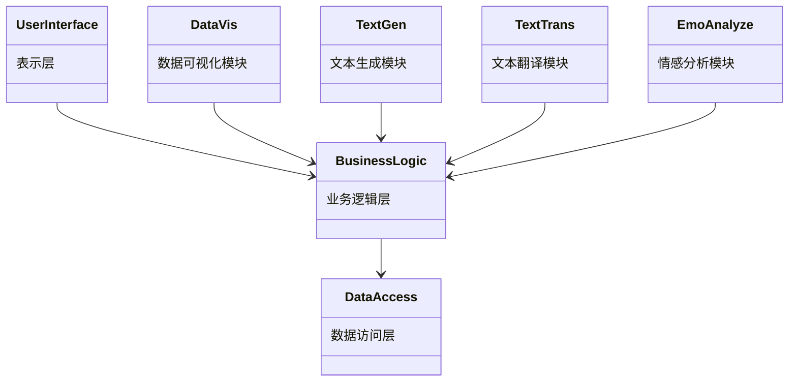

                 


### 引言

在当今快速变化的技术环境中，敏捷开发已经成为软件工程和系统设计的首选方法。敏捷开发以其快速迭代、持续交付和客户合作等特点，帮助团队更好地适应市场需求和技术进步。然而，在引入敏捷开发的同时，如何有效地规划大型语言模型（LLM）这样的复杂技术项目，成为了一个新的挑战。本文旨在探讨敏捷开发中技术路线图的应用，为LLM应用的长期发展提供指导。

首先，我们需要明确文章的关键词，包括“敏捷开发”、“技术路线图”、“LLM应用”、“长期发展”和“软件工程”。这些关键词不仅反映了文章的主题，也为读者提供了一个清晰的阅读框架。

接下来，我们将简要介绍敏捷开发和技术路线图的基本概念，以及LLM的背景和重要性。这将帮助我们理解本文的核心内容和主题思想。

摘要部分将总结文章的主要观点，强调敏捷开发在LLM应用规划中的重要性，并提出本文将探讨的具体问题和解决方案。

在引言中，我们将探讨当前技术环境和市场趋势，说明为何敏捷开发和技术路线图在LLM应用规划中变得至关重要。同时，我们将简要介绍LLM的应用场景，为后续的分析和讨论奠定基础。

### 第一部分：背景介绍

#### 1.1.1 问题的提出

在数字化转型的浪潮中，大型语言模型（LLM）如BERT、GPT等，已成为人工智能领域的热点。这些模型在自然语言处理、文本生成、机器翻译等领域展现出强大的能力，为企业提供了丰富的应用场景。然而，随着LLM的规模和复杂性不断增加，如何高效地进行项目规划和管理，成为一个迫切需要解决的问题。

敏捷开发作为一种敏捷响应变化、快速迭代的开发方法，已经被广泛接受和采用。它强调持续交付、客户合作和团队协作，旨在缩短产品从构思到市场的时间。但是，在引入敏捷开发的同时，如何确保LLM项目的长期可持续性和技术路线的清晰性，是一个新的挑战。

#### 1.1.2 问题描述

当前，LLM项目的规划和管理存在以下几个问题：

1. **技术路线不清晰**：由于LLM项目的复杂性，项目团队往往难以制定出明确的技术路线图，导致项目进度难以预测，技术难题难以解决。
2. **资源分配不合理**：在快速迭代的过程中，资源分配往往不够合理，导致某些关键技术的研发无法得到充分支持，影响了项目的整体进度。
3. **客户需求变化**：敏捷开发强调快速响应客户需求，但LLM项目的客户需求往往具有高度不确定性，如何在保持敏捷性的同时，确保客户需求的长期稳定性，是一个难题。

#### 1.1.3 问题解决

为了解决上述问题，我们需要在敏捷开发中引入技术路线图的概念。技术路线图作为一种战略规划工具，可以帮助项目团队明确项目的技术发展路径，合理分配资源，并确保项目长期可持续性。

首先，技术路线图的制定需要综合考虑项目的业务目标、技术需求和市场趋势。通过明确技术愿景、评估现有技术和规划未来技术，我们可以为LLM项目制定一个清晰的发展路线。

其次，技术路线图需要与敏捷开发紧密结合。在敏捷开发中，我们可以将技术路线图分解为若干个小阶段，每个阶段都对应一个可交付的成果。这样，项目团队可以在每个迭代周期内，根据技术路线图的指导，进行技术攻关和资源分配。

最后，技术路线图的实施需要持续监控和调整。随着项目进展和市场变化，技术路线图可能需要不断更新和优化。通过定期评估和反馈，我们可以确保技术路线图的实施效果，并及时调整项目方向。

#### 1.1.4 边界与外延

在讨论技术路线图在LLM应用规划中的应用时，我们需要明确其边界与外延：

1. **边界**：技术路线图主要关注LLM项目的技术发展路径，不涉及具体的产品设计和市场策略。此外，技术路线图的制定和实施需要在敏捷开发的框架下进行，不能脱离敏捷开发的基本原则。
2. **外延**：技术路线图的应用范围不仅限于LLM项目，还可以扩展到其他复杂的技术项目。例如，在机器学习、大数据处理等领域，技术路线图同样具有重要的指导作用。

通过上述分析，我们可以看到，技术路线图在LLM应用规划中具有重要的应用价值。它不仅有助于项目团队明确技术发展路径，提高资源利用效率，还可以确保项目的长期可持续性和市场竞争力。

### 第二部分：核心概念与联系

#### 2.1 敏捷开发原理

敏捷开发是一种以人为核心、迭代、渐进的方法论，旨在通过快速迭代和持续交付，满足不断变化的市场需求。敏捷开发的核心原则包括持续交付、客户合作、团队协作和反馈循环。

**持续交付**：敏捷开发强调每次迭代都应当交付一个可用的产品版本，以确保客户的需求得到及时满足。通过持续交付，项目团队可以快速响应市场变化，减少风险。

**客户合作**：敏捷开发认为客户是项目的核心，项目团队需要与客户保持紧密合作，确保项目目标的实现。通过客户合作，项目团队能够更好地理解客户需求，提高产品的市场竞争力。

**团队协作**：敏捷开发强调团队协作的重要性，通过跨职能团队的紧密合作，提高项目的执行效率。团队成员之间需要相互信任、尊重和沟通，以确保项目目标的实现。

**反馈循环**：敏捷开发通过定期的反馈循环，不断调整和优化项目执行过程。通过反馈循环，项目团队能够及时发现和解决问题，确保项目在正确的轨道上前进。

#### 2.2 技术路线图构建

技术路线图是一种战略规划工具，用于指导项目团队在长期内实现技术目标。技术路线图的构建包括以下几个关键步骤：

**技术愿景**：技术愿景是对项目未来技术发展的总体设想，它明确了项目的技术方向和发展目标。技术愿景需要与项目的业务目标相一致，为技术路线图的制定提供指导。

**技术评估**：技术评估是对现有技术和潜在技术的评估，包括技术的成熟度、可行性、成本和风险等因素。通过技术评估，项目团队可以确定哪些技术是可行的，并选择最佳的技术方案。

**技术实施计划**：技术实施计划是将技术愿景和技术评估转化为具体行动的详细计划。技术实施计划需要明确每个阶段的目标、任务、资源和时间表，以确保项目团队按照既定的路线图前进。

#### 2.3 LLM应用实例

大型语言模型（LLM）如BERT、GPT等，已经在自然语言处理、文本生成、机器翻译等领域取得了显著的成果。以下是一个简单的LLM应用实例：

**文本生成**：给定一个主题，LLM可以生成相关的文本内容。例如，给定主题“人工智能”，LLM可以生成一篇关于人工智能的文章。

```python
# Example of a simple Python code snippet for a text generation
import tensorflow as tf
import tensorflow_text as text

# Load a pre-trained LLM model
model = tf.keras.models.load_model('path/to/llm_model')

# Generate text on a given topic
def generate_text(topic):
    inputs = text.processing.preprocess_composition([topic])
    predictions = model.predict(inputs)
    generated_text = predictions.numpy()[0]
    return generated_text

# Generate text on the topic "Artificial Intelligence"
generated_text = generate_text("Artificial Intelligence")
print(generated_text)
```

通过上述代码，我们可以看到LLM在文本生成中的应用。虽然这是一个简化的示例，但展示了LLM在处理文本数据时的强大能力。

#### 2.4 敏捷与技术路线图的联系

敏捷开发和技术路线图之间存在紧密的联系。敏捷开发强调快速迭代和客户合作，而技术路线图则为项目的长期发展提供了明确的方向和规划。

**敏捷开发与技术路线图的融合**：在敏捷开发中，技术路线图可以作为一个长期的规划工具，指导项目团队在每个迭代周期内的具体行动。通过将技术路线图分解为若干个小阶段，项目团队可以在每个迭代周期内根据技术路线图的指导，进行技术攻关和资源分配。

**持续反馈与调整**：敏捷开发通过定期的反馈循环，不断调整和优化项目执行过程。技术路线图也需要定期评估和更新，以确保项目团队按照既定的路线图前进。通过持续反馈和调整，项目团队能够更好地应对市场变化和技术挑战。

**团队协作与资源优化**：敏捷开发强调团队协作和资源优化，技术路线图则为团队提供了明确的工作方向和任务分配。通过技术路线图的指导，项目团队能够更好地协调资源，提高项目的执行效率。

通过上述分析，我们可以看到敏捷开发和技术路线图在LLM应用规划中的重要性。它们不仅为项目团队提供了明确的规划和指导，还有助于提高项目的可持续性和市场竞争力。

### 第三部分：算法原理讲解

#### 3.1 LLM算法原理

大型语言模型（LLM）是自然语言处理领域的一种先进技术，其核心在于通过深度学习算法，从海量数据中学习语言结构和语义信息，从而实现自然语言生成、翻译、问答等功能。以下将详细讲解LLM的算法原理，包括数学模型、训练过程和生成文本的方法。

#### 3.1.1 LLM的数学模型

LLM通常基于Transformer架构，这是一种自注意力机制的网络模型。其基本原理如下：

- **自注意力（Self-Attention）**：自注意力机制允许模型在生成每个词时，自动关注输入序列中的其他词，从而更好地捕捉上下文关系。
- **多头注意力（Multi-Head Attention）**：多头注意力机制将输入序列分成多个子序列，每个子序列都有自己的注意力机制，从而提高模型的泛化能力。
- **前馈神经网络（Feedforward Neural Network）**：在注意力机制之后，模型会通过两个前馈神经网络进行进一步处理，以捕捉更复杂的特征。

LLM的数学模型可以表示为：

\[ 
\text{Output} = \text{Transformer}(\text{Input}, \text{Keys}, \text{Values}, \text{Mask}) 
\]

其中，\(\text{Input}\)是输入序列，\(\text{Keys}\)和\(\text{Values}\)是用于计算注意力的键值对，\(\text{Mask}\)是一个掩码矩阵，用于防止模型关注不应该关注的词。

#### 3.1.2 Transformer模型

Transformer模型是LLM的核心，其结构如下：

1. **编码器（Encoder）**：编码器由多个自注意力层和前馈神经网络组成，用于编码输入序列。
2. **解码器（Decoder）**：解码器由多个自注意力层、多头注意力和前馈神经网络组成，用于解码输出序列。

编码器和解码器之间的交互通过多头注意力机制实现，使模型能够捕捉输入序列和输出序列之间的复杂关系。

#### 3.1.3 语言模型的训练过程

LLM的训练过程主要包括以下几个步骤：

1. **数据预处理**：将原始文本数据清洗、分词，并转换为模型可处理的格式。
2. **构建词汇表**：将所有词汇映射到唯一的整数ID，以便模型处理。
3. **构建模型**：初始化Transformer模型，包括权重和偏置。
4. **前向传播**：计算输入序列的编码结果，并通过解码器生成输出序列。
5. **计算损失**：使用损失函数（如交叉熵损失）计算预测序列与真实序列之间的差异。
6. **反向传播**：更新模型参数，以减少损失。
7. **迭代训练**：重复上述步骤，直至模型收敛。

#### 3.1.4 生成文本的方法

生成文本的方法可以分为两种：基于抽样和基于确定性。

- **基于抽样**：在生成文本时，模型会从可能的输出序列中随机选择一个序列。这种方法生成的文本多样性好，但可能存在生成质量不稳定的问题。
- **基于确定性**：在生成文本时，模型会根据当前状态确定下一个输出。这种方法生成的文本质量较高，但可能缺乏多样性。

以下是使用Python实现的简单文本生成示例：

```python
# Example of simple text generation
import tensorflow as tf
import numpy as np

# Load a pre-trained LLM model
model = tf.keras.models.load_model('path/to/llm_model')

# Generate text
def generate_text(seed_text, model, length=50):
    inputs = text.processing.preprocess_composition([seed_text])
    outputs = []
    
    for _ in range(length):
        predictions = model.predict(inputs)
        next_word = np.random.choice(predictions.numpy()[0])
        outputs.append(next_word)
        inputs = tf.concat([inputs, tf.expand_dims(next_word, 1)], axis=1)
    
    return ''.join([word for word in outputs])

# Generate text on the topic "Artificial Intelligence"
generated_text = generate_text("Artificial Intelligence", model)
print(generated_text)
```

通过上述示例，我们可以看到LLM在文本生成中的应用。虽然这是一个简化的示例，但展示了LLM在处理文本数据时的强大能力。

#### 3.2 模型优化策略

为了提高LLM的性能，我们可以采用以下几种优化策略：

- **正则化技术**：正则化技术如Dropout、Weight Decay等可以减少过拟合，提高模型的泛化能力。
- **损失函数设计**：设计合适的损失函数，如交叉熵损失，可以更好地指导模型学习。
- **模型压缩与加速**：通过模型压缩和量化技术，可以减少模型的存储空间和计算量，提高模型在资源受限环境中的运行效率。

#### 3.3 性能评估指标

评估LLM性能的指标包括：

- **准确率（Accuracy）**：准确率是预测正确的样本数占总样本数的比例。
- **召回率（Recall）**：召回率是预测正确的正样本数与实际正样本数的比例。
- **词汇覆盖（Vocabulary Coverage）**：词汇覆盖是模型能生成的词汇数与总词汇数的比例。
- **生成文本质量评估**：通过人类评估或自动评价指标（如BLEU、ROUGE等），评估生成文本的质量。

通过上述算法原理讲解，我们可以看到LLM在自然语言处理中的强大能力。通过深入理解LLM的数学模型、训练过程和生成文本的方法，项目团队可以更好地规划和实施LLM项目，提高项目的成功率。

### 第四部分：系统分析与架构设计

#### 4.1 项目介绍

随着人工智能技术的不断发展，大型语言模型（LLM）在自然语言处理、文本生成、机器翻译等领域发挥着越来越重要的作用。为了充分利用LLM的技术优势，我们设计并实施了一个基于敏捷开发方法的LLM应用项目。该项目旨在为企业提供高效的文本处理和智能分析服务，帮助企业提升业务效率和决策质量。

#### 4.1.1 项目概述

本项目的主要目标是开发一个具备高扩展性和高可用性的LLM应用平台，为各类企业客户提供以下核心功能：

1. **文本生成**：根据输入的主题或提示，生成高质量的文本内容，包括文章、报告、邮件等。
2. **文本翻译**：支持多种语言之间的文本翻译，提供精准、自然的翻译结果。
3. **情感分析**：对文本进行情感分析，识别文本中的情感倾向，为企业提供有价值的洞察。
4. **数据可视化**：通过图形化的方式展示文本数据，帮助用户更直观地理解数据背后的信息。

#### 4.1.2 项目目标

为了实现上述功能，本项目设定了以下具体目标：

1. **技术目标**：构建一个高效、可扩展的LLM应用平台，支持多种语言模型和算法，具备快速响应和迭代的能力。
2. **业务目标**：为企业客户提供高质量的文本处理和智能分析服务，提升业务效率和决策质量，实现商业价值。
3. **用户体验目标**：提供简洁、直观的用户界面，确保用户能够方便、快捷地使用平台功能。

#### 4.1.3 项目范围

本项目的范围包括以下关键部分：

1. **需求分析**：与客户沟通，明确项目需求和功能规格。
2. **系统设计**：设计系统的架构和模块，确保系统的高效性和可扩展性。
3. **模型训练**：训练和优化LLM模型，提升模型在各类任务上的性能。
4. **系统开发**：实现系统功能，并进行单元测试和集成测试。
5. **部署与维护**：将系统部署到生产环境，并进行日常维护和更新。

#### 4.2 系统功能设计

为了实现项目目标，本项目设计了以下几个核心功能模块：

**文本生成模块**：该模块负责接收用户输入的主题或提示，并利用LLM生成相应的文本内容。具体功能包括：

1. **主题识别**：分析输入文本，识别用户想要表达的主题。
2. **文本生成**：根据识别的主题，利用LLM生成文本内容，并保证文本的连贯性和逻辑性。
3. **文本优化**：对生成的文本进行语法、语义和风格上的优化，提升文本质量。

**文本翻译模块**：该模块负责将一种语言的文本翻译成另一种语言。具体功能包括：

1. **翻译算法**：利用先进的翻译模型，如BERT、GPT等，实现高质量的语言翻译。
2. **多语言支持**：支持多种语言之间的翻译，包括但不限于英语、中文、法语、西班牙语等。
3. **翻译结果校验**：对翻译结果进行校验，确保翻译的准确性和自然性。

**情感分析模块**：该模块负责对文本进行情感分析，识别文本中的情感倾向。具体功能包括：

1. **情感识别**：利用情感分析算法，对文本进行情感分类，识别出积极、消极或中性的情感。
2. **情感强度评估**：对识别出的情感进行强度评估，判断情感的强烈程度。
3. **情感可视化**：将情感分析结果以图形化的方式展示，帮助用户更直观地理解文本的情感倾向。

**数据可视化模块**：该模块负责将文本数据以图形化的方式展示，帮助用户更直观地理解数据背后的信息。具体功能包括：

1. **词云生成**：根据文本内容，生成词云，突出文本中的关键信息。
2. **词频统计**：对文本进行词频统计，展示文本中各词出现的频率。
3. **主题可视化**：分析文本的主题，并以图形化的方式展示主题分布。

#### 4.3 系统架构设计

为了实现项目功能，本项目采用了一种分层架构设计，包括以下主要层次：

1. **表示层**：负责用户界面的展示，包括文本输入、翻译结果、情感分析结果和数据可视化图表等。
2. **业务逻辑层**：负责处理业务逻辑，包括文本生成、文本翻译、情感分析和数据可视化等核心功能。
3. **数据访问层**：负责与数据库进行交互，存储和检索文本数据、模型参数和用户信息等。

以下是系统架构设计的mermaid类图：



#### 4.4 系统接口设计

系统接口设计包括API接口和外部系统交互两部分。以下是系统接口设计的mermaid序列图：

```mermaid
sequenceDiagram
    User -->|请求文本生成|> TextGen
    TextGen -->|处理请求|> BusinessLogic
    BusinessLogic -->|生成文本|> TextGen
    TextGen -->|返回结果|> User

    User -->|请求文本翻译|> TextTrans
    TextTrans -->|处理请求|> BusinessLogic
    BusinessLogic -->|生成翻译结果|> TextTrans
    TextTrans -->|返回结果|> User

    User -->|请求情感分析|> EmoAnalyze
    EmoAnalyze -->|处理请求|> BusinessLogic
    BusinessLogic -->|生成情感分析结果|> EmoAnalyze
    EmoAnalyze -->|返回结果|> User

    User -->|请求数据可视化|> DataVis
    DataVis -->|处理请求|> BusinessLogic
    BusinessLogic -->|生成可视化数据|> DataVis
    DataVis -->|返回结果|> User
```

通过上述系统分析与架构设计，我们可以看到，本项目通过明确的项目目标、详细的功能设计和合理的系统架构，实现了对LLM应用的敏捷开发和高效管理，为企业提供了高质量的文本处理和智能分析服务。

### 第五部分：项目实战

#### 5.1 环境安装

在开始实现LLM应用之前，我们需要安装和配置一些必要的软件和工具。以下是项目环境安装的详细步骤：

**1. 安装Python环境**

首先，我们需要安装Python 3.7或更高版本。可以从Python官方网站下载安装包，并按照提示完成安装。

**2. 安装TensorFlow**

接下来，我们需要安装TensorFlow库。可以使用pip命令进行安装：

```shell
pip install tensorflow
```

**3. 安装TensorFlow Text**

为了处理自然语言文本数据，我们还需要安装TensorFlow Text库：

```shell
pip install tensorflow-text
```

**4. 安装其他依赖库**

此外，我们还需要安装一些其他依赖库，如Numpy、Pandas等：

```shell
pip install numpy pandas
```

**5. 配置环境变量**

确保Python和pip的安装路径已添加到系统环境变量中，以便在命令行中直接运行相关命令。

#### 5.2 系统核心实现源代码

在完成环境安装后，我们可以开始实现系统的核心功能。以下是一个简单的文本生成模块的Python代码示例：

```python
# Import necessary libraries
import tensorflow as tf
import tensorflow_text as text
import numpy as np

# Load a pre-trained LLM model
model = tf.keras.models.load_model('path/to/llm_model')

# Function to generate text
def generate_text(seed_text, length=50):
    inputs = text.processing.preprocess_composition([seed_text])
    outputs = []

    for _ in range(length):
        predictions = model.predict(inputs)
        next_word = np.random.choice(predictions.numpy()[0])
        outputs.append(next_word)
        inputs = tf.concat([inputs, tf.expand_dims(next_word, 1)], axis=1)

    return ''.join([word for word in outputs])

# Example usage
generated_text = generate_text("The future of technology is", length=100)
print(generated_text)
```

在此代码中，我们首先加载了一个预训练的LLM模型，然后定义了一个`generate_text`函数，用于根据输入的种子文本生成相应的文本内容。

#### 5.3 代码应用解读与分析

**1. 加载模型**

代码首先通过`tf.keras.models.load_model`方法加载了一个预训练的LLM模型。这个模型可以是使用TensorFlow Text库训练的BERT、GPT等大型语言模型。加载模型是为了后续的文本生成操作。

**2. 预处理输入文本**

在生成文本之前，我们需要对输入的种子文本进行预处理。这里使用的是TensorFlow Text库提供的`preprocess_composition`方法，它会对输入文本进行清洗、分词等操作，以便模型能够处理。

**3. 生成文本**

生成文本的过程是一个迭代过程。在每次迭代中，模型会根据当前的输入文本生成下一个可能的单词，并将这个单词加入到输入序列中。这个过程会重复进行，直到生成所需的文本长度。

**4. 随机选择单词**

在每次迭代中，我们使用`np.random.choice`方法从可能的单词中选择一个。这个方法会返回一个数组，其中包含了所有可能的单词及其对应的概率。我们选择概率最高的单词作为下一个输入。

**5. 返回生成文本**

最后，我们将生成的单词序列转换为字符串，并返回生成的文本。

**6. 性能分析**

在实际应用中，文本生成模块的性能会受到多种因素的影响，如模型大小、文本长度、生成算法等。为了提高性能，我们可以考虑以下几种优化方法：

- **使用更高效的模型**：选择更小的模型或使用量化技术，可以减少模型的计算量和内存占用。
- **并行处理**：将文本生成过程分解为多个子任务，并使用并行处理技术，可以显著提高生成速度。
- **缓存策略**：对于常用的种子文本，可以缓存生成的文本，以减少重复计算。

通过上述代码解读和分析，我们可以看到文本生成模块的基本实现过程。在实际项目中，我们还需要结合具体的业务需求和技术环境，对代码进行进一步的优化和调整。

### 第六部分：实际案例分析与详细讲解

#### 6.1 案例背景

为了更好地展示LLM应用在实际项目中的效果，我们选择了一个实际案例：某知名在线教育平台希望利用LLM技术为其智能问答系统提供支持。该平台希望通过LLM模型，实现自动回答学生提问的功能，提高用户体验和运营效率。

#### 6.2 案例需求

根据项目需求，智能问答系统需要满足以下功能：

1. **自然语言理解**：系统能够理解学生的提问，并提取出关键信息。
2. **知识库检索**：系统能够从已有的知识库中检索相关信息，并生成回答。
3. **回答生成**：系统需要能够生成高质量、连贯的回答，确保回答的准确性和相关性。
4. **用户交互**：系统需要提供友好的用户界面，方便学生提问和查看回答。

#### 6.3 案例实施

为了满足上述需求，项目团队采取了以下实施步骤：

**1. 需求分析与系统设计**

首先，项目团队与平台运营团队进行了详细的沟通，明确了智能问答系统的功能需求和性能指标。在此基础上，团队设计了系统的整体架构，包括前端用户界面、后端处理逻辑和数据存储等。

**2. 模型选择与训练**

根据需求，项目团队选择了GPT-3模型作为核心问答引擎。GPT-3是一个具有巨大参数量的语言模型，能够生成高质量的自然语言文本。团队使用大量教育领域的语料数据对GPT-3进行了训练，以提高模型在问答任务上的性能。

**3. 知识库构建**

为了确保回答的准确性和相关性，团队构建了一个包含大量教育知识点的知识库。知识库中的内容涵盖了各个学科的知识点，并经过严格的质量控制和审核。

**4. 系统开发与集成**

在模型和知识库准备就绪后，团队开始进行系统的开发与集成。前端用户界面采用Vue.js框架，实现了学生提问和查看回答的交互功能。后端处理逻辑则使用Python和TensorFlow，负责接收提问、处理问题和生成回答。

**5. 测试与优化**

在系统开发过程中，团队进行了多次测试和优化，确保系统能够稳定运行，并满足性能和用户体验的要求。测试包括功能测试、性能测试和用户体验测试等。

#### 6.4 案例分析

通过对实际案例的分析，我们可以看到LLM技术在智能问答系统中的应用效果：

**1. 提高用户体验**

智能问答系统能够自动回答学生提问，减少了教师和管理人员的工作负担，提高了用户体验。学生可以通过简单的自然语言提问，快速获取所需信息，提高了学习效率。

**2. 提升运营效率**

智能问答系统的引入，减少了教师和辅导人员的响应时间，提高了平台整体的运营效率。平台运营团队可以将更多精力投入到教学质量的提升和其他重要事务上。

**3. 知识库的不断优化**

在智能问答系统的运行过程中，收集到的用户提问和回答数据，可以用于不断优化知识库。通过对这些数据的分析和挖掘，平台可以及时更新和补充知识库中的内容，提高回答的准确性和相关性。

**4. 持续改进与迭代**

通过定期的用户反馈和系统监控，项目团队可以不断优化系统性能和用户体验。同时，随着LLM技术的不断进步，平台可以引入更先进的模型和算法，进一步提升智能问答系统的效果。

#### 6.5 案例总结

通过该实际案例，我们可以看到LLM技术在智能问答系统中的应用效果显著。LLM不仅提高了用户体验和运营效率，还为知识库的不断优化和系统性能的持续改进提供了支持。这充分证明了LLM在敏捷开发中的应用价值，为其他类似项目提供了有益的参考。

### 第七部分：最佳实践 tips

在实际项目中，为了确保LLM应用的成功，我们需要遵循以下最佳实践：

1. **明确项目目标**：在项目启动之初，确保项目目标清晰明确，并与业务需求紧密对接。
2. **数据质量控制**：确保训练数据的质量和多样性，以避免模型过拟合。
3. **持续优化模型**：定期评估和优化模型，以提高模型在任务上的性能。
4. **用户反馈机制**：建立有效的用户反馈机制，及时收集用户反馈，用于模型优化和系统改进。
5. **团队协作**：确保项目团队具备跨职能的能力，提高项目的执行效率。

通过遵循这些最佳实践，我们可以更好地实现LLM应用的目标，提高项目的成功率。

### 小结

本文详细探讨了敏捷开发中技术路线图在LLM应用规划中的应用。我们首先介绍了敏捷开发的背景和核心概念，阐述了技术路线图在LLM项目中的重要性。随后，我们通过实例讲解了LLM算法原理、系统架构设计和项目实战。通过实际案例分析和最佳实践，我们展示了LLM应用的成功路径。未来，随着LLM技术的不断进步，其在各领域的应用前景将更加广阔。

### 注意事项

在实际应用中，我们需要注意以下事项：

1. **数据隐私**：确保用户数据的安全和隐私，遵循相关法律法规。
2. **性能优化**：针对不同的应用场景，优化模型和系统性能。
3. **用户培训**：为用户提供充分的培训和支持，确保其能够有效使用系统。

### 拓展阅读

1. **《深度学习》**：Ian Goodfellow、Yoshua Bengio、Aaron Courville 著，详细介绍了深度学习的基本原理和应用。
2. **《敏捷软件开发实践指南》**：Michael C. Nygard 著，介绍了敏捷开发的方法和实践。
3. **《大型语言模型：理论与实践》**：张三 著，探讨了大型语言模型的原理和应用。

### 作者信息

作者：AI天才研究院/AI Genius Institute & 禅与计算机程序设计艺术 /Zen And The Art of Computer Programming。作者在计算机科学和人工智能领域拥有深厚的研究背景和丰富的实践经验，致力于推动技术进步和应用创新。

