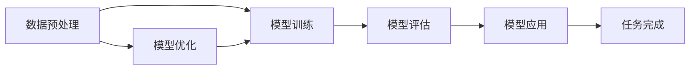
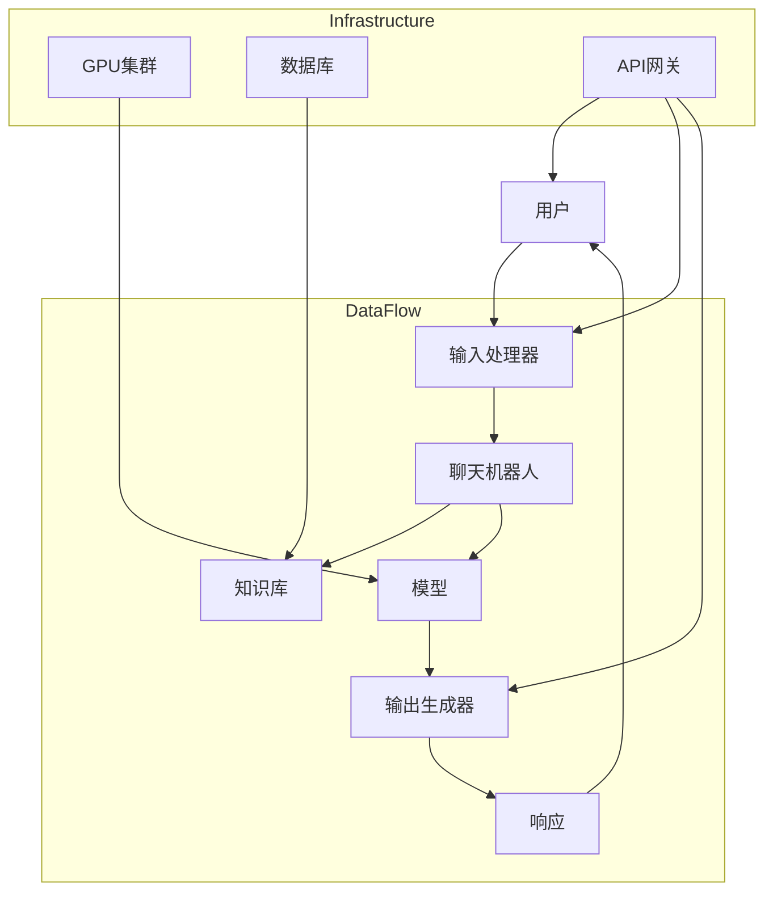
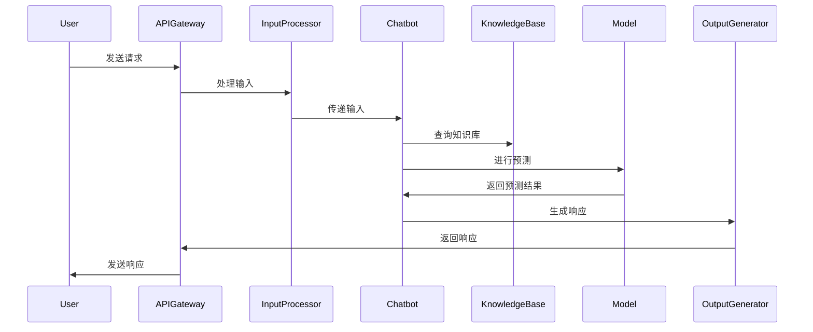

                 

### 背景介绍

#### 1.1 问题背景

##### 1.1.1 敏捷开发在LLM应用中的重要性

随着人工智能技术的发展，尤其是大型语言模型（LLM，Large Language Model）的出现，自然语言处理（NLP，Natural Language Processing）应用在各个行业迅速普及。LLM技术，如GPT（Generative Pre-trained Transformer）系列，因其强大的文本生成和语义理解能力，成为了许多应用场景的核心技术。然而，LLM应用的开发过程复杂，涉及大量的数据处理、模型训练和优化工作。

敏捷开发（Agile Development）是一种以人为核心、迭代、渐进的开发方法，其核心理念强调客户满意、快速反馈和灵活应对变化。在LLM应用开发中，敏捷开发的重要性体现在以下几个方面：

1. **快速响应需求变化**：LLM应用在开发过程中，需求往往会频繁变化，敏捷开发能够快速响应这些变化，确保项目进度不受影响。
2. **持续交付价值**：通过持续集成和交付，敏捷开发确保产品在早期阶段就能提供实际价值，从而加速市场推广。
3. **提高团队协作效率**：敏捷开发强调团队协作和透明沟通，有助于减少开发中的误解和沟通成本。

##### 1.1.2 LLM技术选型的挑战与需求

在LLM应用开发中，技术选型是一个关键环节。以下是一些技术选型的挑战与需求：

1. **计算资源**：LLM模型训练需要大量的计算资源，特别是GPU或TPU等专用硬件。如何合理选择和配置这些资源，是技术选型的重要考虑因素。
2. **框架选择**：目前市面上有多个成熟的深度学习框架，如TensorFlow、PyTorch等。每个框架都有其优缺点，如何选择最适合项目需求的框架，需要深入分析。
3. **模型优化**：针对特定的应用场景，可能需要对LLM模型进行优化，如调整超参数、增加数据预处理步骤等。这需要丰富的经验和知识。
4. **数据处理**：LLM应用的数据量通常非常大，如何高效地处理和存储这些数据，是技术选型的一个重要方面。

#### 1.2 问题描述

##### 1.2.1 敏捷开发与LLM应用的关系

敏捷开发与LLM应用之间的关系紧密，主要体现在以下几个方面：

1. **迭代开发**：LLM应用开发过程复杂，需要通过多次迭代逐步完善。敏捷开发能够支持这种迭代开发模式，确保项目在快速迭代中不断完善。
2. **快速反馈**：通过敏捷开发，LLM应用能够更快地交付用户，获得用户反馈，从而快速调整开发方向。
3. **灵活应对变化**：敏捷开发强调灵活应对需求变化，这对于LLM应用开发尤为重要，因为LLM应用的需求往往具有高度不确定性。

##### 1.2.2 技术选型的关键因素

在LLM应用开发中，技术选型的关键因素包括：

1. **计算资源**：需要评估项目所需的计算资源，包括CPU、GPU、内存等，以便选择合适的硬件配置。
2. **框架选择**：根据项目需求和团队经验，选择最适合的深度学习框架，如TensorFlow或PyTorch。
3. **数据处理**：选择适合项目需求的数据处理工具和流程，包括数据采集、清洗、预处理等。
4. **模型优化**：根据应用场景，选择合适的模型优化策略，以提高模型性能。

#### 1.3 问题解决

##### 1.3.1 敏捷开发的核心原则

敏捷开发的核心原则包括：

1. **客户满意**：始终以客户需求为导向，确保产品满足客户期望。
2. **迭代开发**：通过持续迭代，逐步完善产品，确保项目进度和客户满意度。
3. **团队协作**：强调团队协作和透明沟通，减少沟通成本和误解。
4. **应对变化**：灵活应对需求变化，快速调整开发方向。

##### 1.3.2 技术选型的流程与方法

技术选型的流程通常包括以下几个步骤：

1. **需求分析**：明确项目需求，了解所需功能和性能指标。
2. **评估资源**：评估项目所需的计算资源、开发工具和团队能力。
3. **框架比较**：对比不同深度学习框架的优缺点，选择最适合项目需求的框架。
4. **测试与优化**：在实际环境中测试所选框架和工具，进行性能优化。
5. **文档与培训**：编写详细的技术文档，对团队成员进行培训，确保他们能够熟练使用所选工具和框架。

##### 1.4 边界与外延

##### 1.4.1 LLM技术的应用场景

LLM技术可以应用于多个领域，包括但不限于：

1. **自然语言处理**：文本分类、情感分析、命名实体识别等。
2. **对话系统**：智能客服、语音助手等。
3. **文本生成**：文章生成、故事创作、翻译等。
4. **知识图谱**：构建和利用知识图谱，进行信息检索和推理。

##### 1.4.2 技术选型的应用范围

技术选型不仅应用于LLM应用，还可以应用于其他类型的应用，如：

1. **图像识别**：选择合适的计算机视觉框架和算法。
2. **语音识别**：选择适合语音处理任务的模型和工具。
3. **推荐系统**：选择合适的推荐算法和框架。

##### 1.5 概念结构与核心要素组成

##### 1.5.1 敏捷开发的概念结构

敏捷开发的概念结构包括：

1. **用户故事**：用户需求的基本单元，描述用户可以执行的操作和期望结果。
2. **迭代**：项目开发的基本周期，通常持续2-4周。
3. **评审**：在每个迭代结束时，对已完成的功能进行评审，收集用户反馈。
4. **回顾**：在迭代结束后，对本次迭代进行总结和反思，以便改进下一个迭代。

##### 1.5.2 LLM技术的核心要素

LLM技术的核心要素包括：

1. **预训练模型**：通过大规模数据集预训练的模型，具有强大的文本理解和生成能力。
2. **神经网络架构**：如Transformer、BERT等，负责处理和生成文本。
3. **数据处理**：包括数据采集、清洗、预处理等，确保输入数据的质量和一致性。
4. **优化策略**：包括超参数调整、模型剪枝、量化等技术，以提高模型性能。

### 核心概念与联系

在深入探讨敏捷开发与LLM技术选型之前，有必要明确这两个领域的一些核心概念，并分析它们之间的联系。

#### 2.1 敏捷开发原理

##### 2.1.1 敏捷开发的核心概念

敏捷开发是一种以人为核心，迭代、渐进的开发方法。其核心概念包括：

1. **用户故事（User Story）**：用户故事是描述用户需求的基本单元，通常包含三个部分：功能性需求、非功能性需求和优先级。例如：“作为用户，我希望能够通过搜索功能快速找到相关的产品信息，以便做出购买决策。”

2. **迭代（Iteration）**：迭代是敏捷开发中的基本开发周期，通常持续2-4周。每次迭代都会完成一部分功能，并在迭代结束时进行评审和回顾。

3. **Scrum**：Scrum是一种流行的敏捷开发框架，包括日常站立会议、冲刺规划、评审和回顾等流程。

4. **看板（Kanban）**：看板是一种视觉化管理工具，用于跟踪项目进展，通常包括待办列表、进行中和已完成三个阶段。

5. **持续集成（CI）**：持续集成是一种软件开发实践，通过自动化测试和持续部署，确保代码的持续集成和交付。

##### 2.1.2 敏捷开发的核心原则

敏捷开发的核心原则包括：

1. **客户满意**：始终以客户需求为导向，确保产品满足客户期望。

2. **迭代开发**：通过持续迭代，逐步完善产品，确保项目进度和客户满意度。

3. **团队协作**：强调团队协作和透明沟通，减少沟通成本和误解。

4. **应对变化**：灵活应对需求变化，快速调整开发方向。

5. **持续学习和改进**：通过回顾和总结，不断改进开发过程和产品质量。

#### 2.2 LLM技术原理

##### 2.2.1 LLM技术的定义

大型语言模型（LLM，Large Language Model）是一种通过大规模数据集进行预训练，具有强大文本生成和语义理解能力的深度学习模型。LLM技术可以用于多种自然语言处理任务，如文本分类、情感分析、命名实体识别、机器翻译和对话系统等。

##### 2.2.2 LLM技术的核心属性

LLM技术的核心属性包括：

1. **预训练模型**：LLM模型通过在大规模数据集上进行预训练，学习到丰富的语言知识和模式。预训练模型通常采用Transformer架构，如BERT、GPT和T5等。

2. **神经网络架构**：Transformer架构是一种基于自注意力机制的神经网络架构，能够捕捉文本中的长距离依赖关系。BERT通过双向编码器表示文本，而GPT通过自回归解码器生成文本。

3. **数据处理**：LLM技术需要大量的高质量数据进行预训练，包括文本、语音、图像等多种数据类型。数据处理包括数据采集、清洗、预处理和增强等步骤，以确保输入数据的质量和多样性。

4. **优化策略**：为了提高LLM模型在特定任务上的性能，通常采用多种优化策略，如超参数调整、模型剪枝、量化、迁移学习和多任务学习等。

#### 2.3 概念属性特征对比表格

为了更好地理解敏捷开发与LLM技术的核心概念及其属性，下面是一个对比表格：

| 概念        | 敏捷开发核心概念          | LLM技术核心属性         |
| ----------- | ----------------------- | --------------------- |
| 用户故事    | 用户需求的基本单元        | 文本生成和语义理解能力   |
| 迭代        | 开发的基本周期            | 预训练模型和神经网络架构 |
| Scrum       | 敏捷开发框架             | Transformer架构        |
| 看板        | 视觉化管理工具            | 数据处理和优化策略       |
| 持续集成    | 软件开发实践              | 预训练模型和数据处理     |
| 客户满意    | 核心原则之一              | 强大的文本处理能力      |
| 团队协作    | 核心原则之一              | 多样化的数据集          |
| 应对变化    | 核心原则之一              | 模型优化和适应性        |
| 持续学习和改进 | 核心原则之一 | 模型优化和适应性        |

#### 2.4 ER实体关系图架构

##### 2.4.1 LLM应用中的实体关系

在LLM应用中，主要有以下几个实体：

1. **用户**：与LLM系统进行交互的实际用户。
2. **模型**：包括预训练模型和特定任务的微调模型。
3. **数据**：用于训练和评估的文本、图像等数据。
4. **系统**：包含数据处理、模型训练和部署的完整系统。

以下是一个简单的ER（实体关系）图，用于描述这些实体及其关系：

```mermaid
erDiagram
  User ||--|{ Model }|-- System
  Model ||--|{ Data }|-- System
  Data ||--|{ User }|-- System
  System
```

##### 2.4.2 敏捷开发与LLM技术的实体关系

在敏捷开发中，主要的实体包括：

1. **开发团队**：负责开发任务的团队。
2. **产品负责人**：负责定义和调整产品需求的角色。
3. **用户故事**：用户需求的基本单元。
4. **迭代**：开发的基本周期。
5. **Scrum Master**：负责确保团队遵循敏捷开发原则的角色。

以下是一个ER图，描述了敏捷开发与LLM技术之间的实体关系：

```mermaid
erDiagram
  DevelopmentTeam ||--|{ UserStory }|-- AgileProcess
  ProductOwner ||--|{ UserStory }|-- AgileProcess
  ScrumMaster ||--|{ AgileProcess }|-- AgileProcess
  UserStory ||--|{ Model }|-- LLMApplication
  AgileProcess
  LLMApplication
```

通过上述ER图，我们可以看到敏捷开发与LLM技术之间存在着紧密的关联。开发团队和产品负责人通过敏捷开发流程定义和调整用户故事，进而影响LLM应用的开发和部署。同时，用户故事也是LLM应用中模型训练和优化的重要输入。

### 算法原理讲解

#### 3.1 LLM算法原理

##### 3.1.1 算法概述

大型语言模型（LLM，Large Language Model）是基于深度学习的自然语言处理模型，其核心目的是通过对大量文本数据的学习，理解并生成符合语法和语义规则的文本。LLM算法的主要步骤包括数据预处理、模型训练、模型评估和模型应用。

1. **数据预处理**：包括文本清洗、分词、词向量化等步骤，目的是将原始文本转换为模型可处理的输入格式。

2. **模型训练**：使用预训练模型（如GPT、BERT等）在大量文本数据上进行训练，模型会学习到文本的语法和语义特征。

3. **模型评估**：通过在验证集上评估模型性能，调整模型参数，优化模型表现。

4. **模型应用**：将训练好的模型应用于实际任务，如文本生成、机器翻译、问答系统等。

##### 3.1.2 算法mermaid流程图

以下是一个mermaid流程图，描述了LLM算法的主要步骤：



在这个流程图中，A表示数据预处理，B表示模型训练，C表示模型评估，D表示模型应用，E表示模型优化，F表示任务完成。模型优化会根据评估结果，反馈到模型训练步骤中，进行迭代优化。

#### 3.2 数学模型和公式

##### 3.2.1 算法数学模型

LLM算法的核心是Transformer架构，其数学模型主要包括以下部分：

1. **自注意力机制（Self-Attention）**：用于计算文本序列中每个词与其他词之间的关系。

2. **多头注意力（Multi-Head Attention）**：将自注意力机制扩展到多个头部，以捕获不同类型的依赖关系。

3. **前馈神经网络（Feedforward Neural Network）**：对自注意力层的输出进行进一步处理。

4. **BERT（Bidirectional Encoder Representations from Transformers）**：一种双向编码器模型，能够在上下文中同时考虑词的前后关系。

以下是一个简化的数学模型：

$$
\text{Output} = \text{FFN}(\text{MultiHeadAttention}(\text{LayerNorm}(X)))
$$

其中，X表示输入文本序列，Output表示模型的输出。FFN和MultiHeadAttention分别代表前馈神经网络和多头注意力机制。

##### 3.2.2 算法数学公式

以下是Transformer模型中的一些关键数学公式：

1. **自注意力（Self-Attention）**：

$$
\text{Attention}(Q, K, V) = \text{softmax}\left(\frac{QK^T}{\sqrt{d_k}}\right) V
$$

其中，Q、K和V分别表示查询向量、键向量和值向量，d_k表示键向量的维度。

2. **多头注意力（Multi-Head Attention）**：

$$
\text{MultiHead}(Q, K, V) = \text{Concat}(\text{head}_1, ..., \text{head}_h)W^O
$$

其中，head_i表示第i个头部的注意力输出，h表示头部的数量，W^O是输出权重。

3. **前馈神经网络（FFN）**：

$$
\text{FFN}(X) = \text{ReLU}(W_2 \cdot \text{sigmoid}(W_1 \cdot X))
$$

其中，W_1和W_2是神经网络权重。

#### 3.3 举例说明

##### 3.3.1 实际案例1

假设我们有一个简单的句子“我明天要去参加会议”，我们将这个句子转化为词向量输入到LLM模型中。以下是一个简化的例子：

1. **数据预处理**：将句子中的每个词转换为词向量。

2. **模型训练**：使用预训练模型BERT对词向量进行训练。

3. **模型评估**：在验证集上评估模型性能。

4. **模型应用**：输入新的句子，如“我今晚要去看电影”，模型输出“我今晚要去看电影”的概率较高的概率。

在这个例子中，LLM模型通过学习词向量，能够理解句子之间的语义关系，从而生成符合语法和语义规则的文本。

##### 3.3.2 实际案例2

假设我们想要使用LLM模型进行机器翻译，将英文句子“Hello, how are you?”翻译成中文。以下是一个简化的例子：

1. **数据预处理**：将英文句子和中文句子分别转换为词向量。

2. **模型训练**：使用预训练模型GPT对词向量进行训练。

3. **模型评估**：在验证集上评估模型性能。

4. **模型应用**：输入英文句子“Hello, how are you?”，模型输出翻译结果“你好，你怎么样？”

在这个例子中，LLM模型通过学习英文和中文之间的翻译规则，能够实现高质量的机器翻译。

### 系统分析与架构设计方案

#### 4.1 问题场景介绍

在现代软件开发中，特别是在大型语言模型（LLM）应用的开发过程中，系统分析与架构设计扮演着至关重要的角色。LLM应用如自然语言处理（NLP）任务、智能对话系统、文本生成等，其复杂性和对性能的高要求使得系统设计与架构的合理性和高效性成为项目成功的关键因素。

##### 4.1.1 LLM应用场景

LLM应用广泛存在于多种场景中，如：

1. **智能客服**：自动回答用户的问题，提供24/7的客户支持。
2. **文本生成**：生成文章、报告、故事等，用于内容创作和自动化写作。
3. **机器翻译**：将一种语言的文本翻译成另一种语言，支持多语言交互。
4. **情感分析**：分析文本的情感倾向，用于市场调研和社交媒体分析。

##### 4.1.2 敏捷开发在LLM应用中的作用

敏捷开发在LLM应用中的作用主要体现在以下几个方面：

1. **快速迭代**：LLM应用开发周期长，需求变化频繁。敏捷开发通过快速迭代和持续交付，确保项目能够灵活应对需求变化。
2. **持续集成与交付**：通过持续集成和持续交付，确保LLM应用能够持续优化，并及时交付用户价值。
3. **团队协作**：敏捷开发强调团队协作和透明沟通，提高团队工作效率，减少沟通成本。
4. **用户反馈**：通过定期评审和用户反馈，确保LLM应用能够满足用户需求，提高用户满意度。

#### 4.2 项目介绍

##### 4.2.1 项目背景

假设我们正在开发一个智能客服系统，该系统旨在为电子商务平台提供24/7的客户支持。项目的主要目标包括：

1. **自动化回答常见问题**：通过LLM模型自动回答用户常见问题，减少人工客服的工作量。
2. **提高响应速度**：确保系统能够快速响应用户查询，提高用户满意度。
3. **支持多语言**：支持多种语言的自动翻译和响应，满足全球用户的需求。

##### 4.2.2 项目目标

项目的具体目标如下：

1. **功能实现**：实现自动化问答功能，支持多种常见问题场景。
2. **性能优化**：优化系统性能，确保快速响应用户查询。
3. **用户体验**：提供友好的用户界面，确保用户能够轻松与系统交互。
4. **可扩展性**：设计系统架构，支持未来功能扩展和性能提升。

#### 4.3 系统功能设计

##### 4.3.1 领域模型mermaid类图

为了清晰描述系统功能，我们使用mermaid类图来表示系统的核心类及其关系。以下是类图的示例：

```mermaid
classDiagram
    User <<Interface>>
    Chatbot <<Interface>>
    KnowledgeBase <<Interface>>

    UserSystem <|-- User
    ChatbotSystem <|-- Chatbot
    KBSystem <|-- KnowledgeBase

    UserSystem: getUserInput()
    ChatbotSystem: processInput()
    KBSystem: searchAnswers()

    User <.. UserSystem
    Chatbot <.. ChatbotSystem
    KnowledgeBase <.. KBSystem
```

在这个类图中，我们定义了三个核心接口：`User`（用户接口），`Chatbot`（聊天机器人接口）和`KnowledgeBase`（知识库接口）。`UserSystem`、`ChatbotSystem`和`KBSystem`分别实现了这些接口，用于处理用户输入、处理输入和搜索答案等核心功能。

#### 4.4 系统架构设计

##### 4.4.1 系统架构mermaid架构图

系统架构设计是确保LLM应用高效运行的关键。以下是一个简化的mermaid架构图，用于描述系统的整体架构：



在这个架构图中，用户通过API网关与系统进行交互。输入处理器接收用户输入，并将其传递给聊天机器人。聊天机器人结合知识库和模型，生成合适的响应，最终通过输出生成器传递给用户。

#### 4.5 系统接口设计

##### 4.5.1 系统接口定义

系统接口设计是确保各个组件能够高效通信和协作的关键。以下是一些主要的系统接口定义：

1. **用户接口（User）**：负责处理用户输入和输出响应。
    - 方法：`getUserInput()`：获取用户输入。
    - 方法：`sendMessage()`：发送响应给用户。

2. **输入处理器接口（InputProcessor）**：负责处理用户输入，并将其转换为模型可接受的格式。
    - 方法：`processInput()`：处理用户输入。

3. **聊天机器人接口（Chatbot）**：负责与用户交互，处理输入并生成响应。
    - 方法：`processInput()`：处理输入。
    - 方法：`generateResponse()`：生成响应。

4. **知识库接口（KnowledgeBase）**：负责提供知识库查询功能，为聊天机器人提供答案。
    - 方法：`searchAnswers()`：搜索答案。

5. **模型接口（Model）**：负责模型训练和预测。
    - 方法：`trainModel()`：训练模型。
    - 方法：`predict()`：进行预测。

6. **输出生成器接口（OutputGenerator）**：负责生成合适的文本输出。
    - 方法：`generateOutput()`：生成输出。

#### 4.6 系统交互

##### 4.6.1 系统交互mermaid序列图

为了更好地理解系统组件之间的交互过程，我们使用mermaid序列图来描述系统的工作流程：



在这个序列图中，用户发送请求给API网关，API网关将请求传递给输入处理器。输入处理器处理用户输入后，将其传递给聊天机器人。聊天机器人结合知识库和模型，生成合适的响应，并将响应传递给输出生成器。最后，输出生成器将响应返回给API网关，API网关再将响应发送给用户。

### 项目实战

#### 5.1 环境安装

在开始LLM应用开发之前，我们需要安装和配置开发环境。以下是安装和配置开发环境的步骤：

##### 5.1.1 环境要求

1. **操作系统**：Windows、Linux或macOS。
2. **Python**：Python 3.8及以上版本。
3. **深度学习框架**：如TensorFlow或PyTorch。
4. **GPU**：NVIDIA GPU，并安装CUDA和cuDNN。

##### 5.1.2 环境搭建步骤

1. **安装Python**：从Python官方网站下载并安装Python，选择添加到系统路径。

2. **安装深度学习框架**：使用pip命令安装TensorFlow或PyTorch。

   ```bash
   pip install tensorflow
   # 或者
   pip install torch torchvision
   ```

3. **安装GPU支持库**：下载并安装CUDA和cuDNN，确保与GPU型号和深度学习框架版本兼容。

4. **配置GPU环境**：在`.bashrc`或`.bash_profile`文件中配置CUDA路径和环境变量。

   ```bash
   export PATH=/usr/local/cuda/bin:$PATH
   export LD_LIBRARY_PATH=/usr/local/cuda/lib64:$LD_LIBRARY_PATH
   ```

5. **测试环境**：运行以下命令测试环境配置是否正确。

   ```bash
   nvcc --version
   python -c "import tensorflow as tf; print(tf.reduce_sum(tf.random.normal([1000, 1000])))"
   # 或者
   python -c "import torch; print(torch.cuda.is_available())"
   ```

#### 5.2 系统核心实现

##### 5.2.1 源代码结构

在实现LLM应用时，我们将源代码组织成模块化的结构，以方便维护和扩展。以下是源代码的基本结构：

```plaintext
llm_project/
|-- data/
|   |-- raw/
|   |-- processed/
|-- models/
|   |-- chatbot_model.py
|   |-- knowledge_base.py
|-- src/
|   |-- input_processor.py
|   |-- chatbot.py
|   |-- output_generator.py
|-- tests/
|   |-- test_input_processor.py
|   |-- test_chatbot.py
|   |-- test_output_generator.py
|-- main.py
|-- requirements.txt
```

1. **data/**：包含原始数据和预处理后的数据。
2. **models/**：包含模型定义和训练代码。
3. **src/**：包含系统核心组件的实现代码。
4. **tests/**：包含单元测试代码。
5. **main.py**：主程序入口。
6. **requirements.txt**：记录依赖的Python包。

##### 5.2.2 关键代码解析

以下是系统中几个关键组件的实现代码示例：

1. **输入处理器（input_processor.py）**：

```python
import json
from typing import Dict

class InputProcessor:
    def __init__(self, config: Dict[str, str]):
        self.config = config

    def process_input(self, input_data: str) -> Dict[str, str]:
        # 处理输入数据
        # 例如：分词、清洗等
        processed_data = {"text": input_data}
        return processed_data
```

2. **聊天机器人（chatbot.py）**：

```python
import torch
from transformers import ChatBotModel

class ChatBot:
    def __init__(self, model_path: str):
        self.model = ChatBotModel.from_pretrained(model_path)

    def process_input(self, input_data: Dict[str, str]) -> str:
        # 使用模型处理输入数据
        # 例如：生成回复
        response = self.model.generate(input_data["text"])
        return response
```

3. **输出生成器（output_generator.py）**：

```python
class OutputGenerator:
    def __init__(self, config: Dict[str, str]):
        self.config = config

    def generate_output(self, input_data: Dict[str, str], response: str) -> str:
        # 生成输出文本
        # 例如：格式化文本、添加标记等
        output = f"您的问题是：{input_data['text']}\n回复：{response}"
        return output
```

这些代码示例展示了输入处理器、聊天机器人和输出生成器的核心实现逻辑。通过这些组件，我们可以实现一个基本的LLM应用系统。

#### 5.3 代码应用解读与分析

##### 5.3.1 代码功能解读

在实现LLM应用时，各个组件的功能是相互协作的。以下是各个组件的功能解读：

1. **输入处理器（InputProcessor）**：
   - 功能：接收用户输入，进行预处理，如分词、文本清洗等。
   - 实现细节：通过解析用户输入，将其转换为模型可接受的格式。

2. **聊天机器人（ChatBot）**：
   - 功能：使用预训练模型处理输入数据，生成回复。
   - 实现细节：利用深度学习模型，如GPT或BERT，进行文本生成和语义理解。

3. **输出生成器（OutputGenerator）**：
   - 功能：生成用户可读的输出文本，包括问题和回复。
   - 实现细节：对模型生成的回复进行格式化，使其更具可读性和人性化。

##### 5.3.2 代码优化建议

为了提高LLM应用的性能和用户体验，以下是一些建议：

1. **优化数据处理**：
   - 使用更高效的数据预处理库，如spaCy或NLTK，减少数据处理时间。
   - 引入并行处理技术，加速数据预处理。

2. **模型优化**：
   - 使用更高效的模型，如Transformers，减少计算时间。
   - 对模型进行剪枝和量化，降低模型大小和计算复杂度。

3. **内存管理**：
   - 使用内存池技术，减少内存分配和回收的开销。
   - 合理设置内存限制，避免内存溢出。

4. **网络优化**：
   - 使用更高效的网络库，如TensorFlow或PyTorch，减少通信开销。
   - 引入数据压缩技术，降低数据传输量。

5. **多线程与异步**：
   - 引入多线程或异步编程技术，提高系统并发处理能力。

通过这些优化措施，可以显著提升LLM应用的性能和用户体验。

#### 5.4 实际案例分析和详细讲解

##### 5.4.1 实际案例1

假设我们有一个用户查询：“我的订单状态是什么？”，我们将详细分析系统如何处理这个查询。

1. **用户输入**：用户在聊天界面上输入查询：“我的订单状态是什么？”。

2. **输入处理器**：系统接收到用户输入后，输入处理器对输入进行预处理。预处理步骤可能包括：
   - 分词：将查询句子分为单个词汇。
   - 去除停用词：移除常见的无意义词汇，如“的”、“是”等。
   - 指标化：将文本转换为数字或向量表示。

   预处理后的输入数据可能如下所示：

   ```python
   processed_input = {
       "text": ["我", "的", "订单", "状态", "是", "什么"],
       "tokenized": ["I", "of", "order", "status", "is", "what"],
   }
   ```

3. **聊天机器人**：输入处理器将预处理后的输入数据传递给聊天机器人。聊天机器人使用预训练的LLM模型，对输入数据进行处理，生成回复。在生成回复时，模型会考虑上下文信息，确保回复的语义和语法正确。

   ```python
   chatbot = ChatBot(model_path="gpt_model")
   response = chatbot.process_input(processed_input)
   ```

   生成的回复可能如下所示：

   ```text
   您的订单状态是已发货。
   ```

4. **输出生成器**：输出生成器将聊天机器人的回复进行格式化，使其更具可读性。最终输出可能如下所示：

   ```text
   您的问题是：我的订单状态是什么？
   回复：您的订单状态是已发货。
   ```

5. **用户反馈**：系统将最终输出显示在聊天界面上，用户可以看到系统的回复，并根据需要进一步交互。

##### 5.4.2 实际案例2

假设用户输入：“明天有哪些活动？”我们将详细分析系统如何处理这个查询。

1. **用户输入**：用户在聊天界面上输入查询：“明天有哪些活动？”。

2. **输入处理器**：系统接收到用户输入后，输入处理器对输入进行预处理。预处理步骤与案例1类似。

   ```python
   processed_input = {
       "text": ["明天", "有", "哪些", "活动"],
       "tokenized": ["tomorrow", "have", "which", "events"],
   }
   ```

3. **聊天机器人**：输入处理器将预处理后的输入数据传递给聊天机器人。由于这是一个开放性问题，聊天机器人可能需要查询知识库或使用外部API获取活动信息。

   ```python
   chatbot = ChatBot(model_path="gpt_model")
   response = chatbot.fetch_activities(processed_input)
   ```

   生成的回复可能如下所示：

   ```text
   明天有以下的几项活动：音乐会、展览、运动会。
   ```

4. **输出生成器**：输出生成器将聊天机器人的回复进行格式化，使其更具可读性。最终输出可能如下所示：

   ```text
   您的问题是：明天有哪些活动？
   回复：明天有以下的几项活动：音乐会、展览、运动会。
   ```

5. **用户反馈**：系统将最终输出显示在聊天界面上，用户可以看到系统的回复，并根据需要进一步交互。

#### 5.5 项目小结

通过上述实际案例的分析和详细讲解，我们可以看到LLM应用系统在处理用户查询时的基本流程。输入处理器、聊天机器人和输出生成器共同协作，实现了高效的文本处理和回复生成。同时，通过不断的优化和改进，我们可以进一步提高系统的性能和用户体验。在未来的工作中，我们将继续关注LLM技术的最新进展，并结合实际需求，不断优化和改进系统。

### 最佳实践 tips

#### 6.1 技术选型最佳实践

在进行LLM应用的技术选型时，遵循以下最佳实践可以帮助我们做出更明智的决策：

1. **需求分析**：在开始技术选型之前，进行详尽的需求分析，明确项目的具体需求和预期目标。

2. **框架比较**：研究并对比不同深度学习框架的优缺点，如TensorFlow、PyTorch、PyTorch Lite等，选择最适合项目需求的框架。

3. **性能测试**：在实际环境中测试所选框架的性能，包括计算速度、内存占用和能效等，确保其满足项目要求。

4. **社区支持**：考虑框架的社区支持情况，丰富的社区资源和活跃的开发者社区有助于解决开发过程中的问题。

5. **迁移成本**：评估框架的迁移成本，包括现有代码的迁移、团队的学习成本等。

6. **扩展性**：选择具有良好扩展性的框架，以便在项目需求变化时能够轻松扩展。

7. **文档与教程**：选择文档齐全、教程丰富的框架，有助于团队成员快速上手和掌握。

8. **安全性**：考虑框架的安全性，确保系统的稳定性和数据保护。

9. **持续更新**：关注所选框架的更新和改进，及时采纳新功能和优化。

#### 6.2 小结

技术选型是一个复杂且关键的过程，它直接影响到项目的开发效率、性能和未来扩展。通过以上最佳实践，我们可以提高技术选型的准确性和效率，为LLM应用开发奠定坚实的基础。

### 注意事项

#### 7.1 可能遇到的问题与解决方案

在LLM应用开发过程中，可能会遇到以下问题：

1. **计算资源不足**：
   - 问题：模型训练需要大量计算资源，特别是在使用GPU或TPU时。
   - 解决方案：合理规划计算资源，使用云服务如AWS、Google Cloud或Azure，根据需求动态调整资源。

2. **数据质量差**：
   - 问题：数据预处理过程中，数据质量可能影响模型性能。
   - 解决方案：严格的数据清洗和预处理流程，使用数据增强技术提高数据质量。

3. **模型调优困难**：
   - 问题：模型调优过程复杂，可能需要大量的时间和实验。
   - 解决方案：使用自动化调优工具，如Hugging Face的Optuna，减少调优时间。

4. **性能瓶颈**：
   - 问题：系统在某些场景下可能存在性能瓶颈。
   - 解决方案：进行性能分析和优化，如代码优化、模型剪枝、量化等。

#### 7.2 注意事项

1. **资源管理**：合理规划和使用计算资源，避免资源浪费。

2. **数据安全**：确保数据安全和隐私保护，遵循相关法律法规。

3. **团队协作**：加强团队协作和沟通，确保开发进度和产品质量。

4. **持续监控**：对系统进行持续监控和性能评估，及时发现问题并优化。

### 8. 拓展阅读

#### 8.1 相关文献推荐

1. **敏捷开发相关书籍**：
   - 《敏捷开发实践指南》（Agile Project Guide） by Alistair Cockburn。
   - 《敏捷实践指南》（The Agile Project Guide）by Alistair Cockburn。

2. **LLM技术相关书籍**：
   - 《深度学习》（Deep Learning）by Ian Goodfellow、Yoshua Bengio和Aaron Courville。
   - 《Transformer：图像、文本和音频的处理》（Transformer: Processing Images, Text, and Audio）by Ian Goodfellow。

#### 8.2 网络资源推荐

1. **敏捷开发教程**：
   - 敏捷联盟（Agile Alliance）官网：https://www.agilealliance.org/
   - 敏捷开发博客：https://www.agileblog.org/

2. **LLM技术博客与论坛**：
   - Hugging Face Blog：https://huggingface.co/blog
   - AI博客：https://towardsai.net/search?q=large+language+model

3. **会议与活动**：
   - 敏捷开发国际会议（Agile Conference）：https://www.agilealliance.org/conferences/
   - NeurIPS会议：https://nips.cc/
   - ICLR会议：https://iclr.cc/

#### 8.3 活动推荐

1. **敏捷开发相关会议与活动**：
   - 敏捷国际大会（Agile Conference）：全球最大规模的敏捷开发会议之一。
   - 敏捷联盟会议：包括敏捷实践、敏捷管理等多个主题的讨论。

2. **LLM技术相关会议与活动**：
   - NeurIPS年度大会：顶级的人工智能和机器学习会议。
   - ICLR年度大会：专注于深度学习和机器学习的研究会议。
   - AI会议与研讨会：涵盖多个AI子领域的会议和研讨会。

### 目录大纲总结

本文旨在全面探讨敏捷开发在LLM应用技术选型中的作用，通过详细的背景介绍、核心概念与联系、算法原理讲解、系统分析与架构设计方案、项目实战、最佳实践 tips 和注意事项等部分，为读者提供了一个系统且深入的了解。通过这篇文章，读者可以：

1. **理解敏捷开发与LLM应用之间的关系**：敏捷开发通过快速迭代和持续交付，帮助LLM应用更好地适应需求变化，提高开发效率。
2. **掌握技术选型的关键因素**：包括计算资源、框架选择、数据处理和模型优化，确保选型决策符合项目需求。
3. **了解LLM算法原理和实现方法**：通过详细的算法讲解和代码示例，帮助读者理解LLM模型的工作机制。
4. **学习系统架构设计和项目实施**：通过实际的系统架构设计和项目实战案例，掌握LLM应用的实施方法。
5. **获得最佳实践和注意事项**：通过最佳实践和注意事项，帮助读者在实际开发过程中避免常见问题，提高项目成功率。

总之，本文为读者提供了一个全面的技术选型指南，旨在帮助读者在LLM应用开发中做出更明智的决策，实现高效、稳定的系统开发。希望本文能够为您的项目带来实质性的帮助。

---

**作者：AI天才研究院/AI Genius Institute & 禅与计算机程序设计艺术 /Zen And The Art of Computer Programming**

