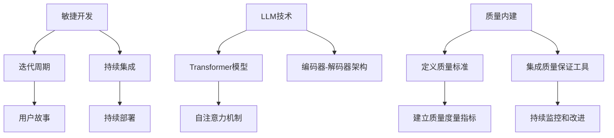
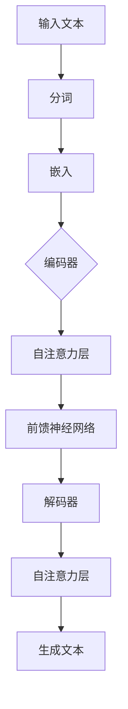
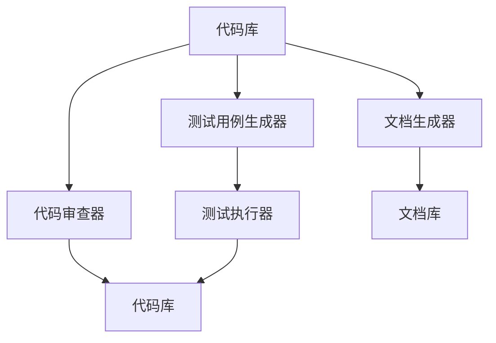
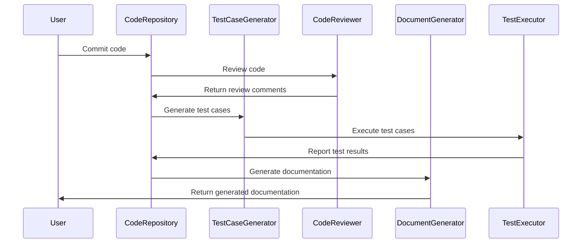
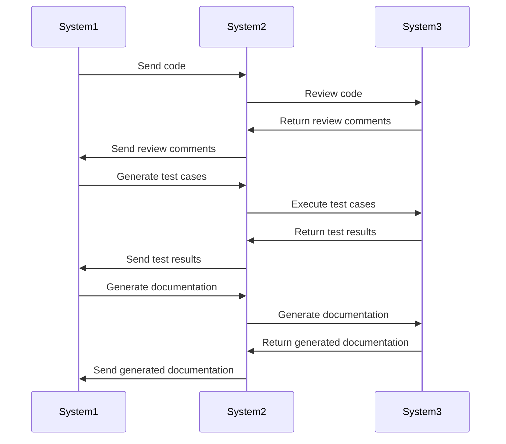

                 


**Step 1: Introduction**

To begin, we'll focus on the introduction to provide a solid foundation for the readers. This section will cover the background of Agile development and the rise of LLMs in software engineering, as well as the importance of quality embedding in Agile processes.

# 敏捷中的质量内建：LLM应用的全面质量保证方法

## 关键词
- 敏捷开发
- 质量内建
- LLM
- 质量保证
- 软件工程

### 摘要
本文探讨了在敏捷开发中，如何通过内建质量的方法来确保LLM（大型语言模型）应用的全方面质量保证。文章首先介绍了敏捷开发的背景和LLM的兴起，随后深入分析了质量内建的概念、实施步骤和重要性，最后提出了具体的策略和案例，以指导实践中的质量保证工作。

**Step 2: Background Introduction**

In this section, we will delve into the historical context of Agile development, its role in software engineering, and the emergence of LLMs. We will also discuss the challenges of quality assurance in Agile environments and the potential advantages of using LLMs for this purpose.

## 第一部分：背景介绍

### 1.1 问题背景
#### 1.1.1 敏捷开发在软件工程中的地位
敏捷开发（Agile Development）起源于上世纪90年代，作为一种应对快速变化的需求和应对复杂项目的软件开发方法，它逐渐成为软件工程领域的核心。敏捷开发的核心价值观包括：个体和互动重于过程与工具、可工作的软件重于详尽的文档、客户合作重于合同谈判、响应变化重于遵循计划。

#### 1.1.2 LLM在敏捷开发中的应用
随着深度学习技术的迅猛发展，LLM（大型语言模型）在自然语言处理领域取得了显著成就。LLM的应用不仅提升了软件开发的效率，还在自动化测试、代码审查和文档生成等方面展现出巨大的潜力。

#### 1.1.3 质量内建在敏捷开发中的重要性
在敏捷开发中，质量内建（Quality Embedding）是一种关键策略，它强调在开发过程中持续关注并提高软件质量。这种方法要求开发团队在项目早期就识别潜在的质量问题，并采取预防措施来避免这些问题。

### 1.2 问题描述
#### 1.2.1 敏捷开发中质量保证面临的挑战
敏捷开发要求快速迭代和频繁发布，这使得质量保证变得更加复杂。传统的质量保证方法可能无法满足敏捷开发的动态性，导致软件质量问题难以及时发现和修复。

#### 1.2.2 LLM在质量保证中的潜在优势
LLM的高效性和强大的文本处理能力使其成为敏捷开发中质量保证的理想工具。通过自动化的代码审查、测试用例生成和文档生成，LLM可以显著提高质量保证的效率和准确性。

#### 1.2.3 全面质量保证方法的必要性
为了确保敏捷开发项目的成功，全面质量保证方法变得至关重要。这种方法要求团队从多个角度（代码质量、用户体验、性能等）综合考虑，确保软件的全面质量。

### 1.3 问题解决
#### 1.3.1 敏捷中的质量内建概念
质量内建是指在软件开发过程中，持续地将质量作为一个重要的组成部分，而非仅在开发后期进行质量检查。这种方法要求团队在整个开发周期中，始终保持对质量的关注。

#### 1.3.2 LLM应用的全面质量保证方法
通过将LLM集成到开发流程中，可以实现全面的自动化质量保证。LLM可以用于代码审查、测试用例生成、性能测试和用户体验测试等多个方面，从而确保软件的高质量。

#### 1.3.3 边界与外延
虽然LLM在质量保证中具有巨大的潜力，但也存在一些限制。例如，LLM可能无法完全理解复杂的业务逻辑或处理罕见的情况。因此，在实施全面质量保证方法时，需要综合考虑这些因素。

### 1.4 概念结构与核心要素组成
#### 1.4.1 敏捷开发的关键概念
敏捷开发强调灵活性和适应性，通过迭代和增量的方式，逐步实现项目目标。关键概念包括用户故事、迭代周期、持续集成和持续部署等。

#### 1.4.2 LLM技术的基本原理
LLM是基于深度学习的自然语言处理模型，通过训练大量的文本数据，可以生成高质量的自然语言文本。LLM的核心算法包括Transformer模型和自注意力机制等。

#### 1.4.3 质量内建的实施步骤
质量内建的实施步骤包括：定义质量标准、建立质量度量指标、集成质量保证工具、持续监控和改进等。

**Step 3: Core Concepts and Relationships**

In this section, we will explore the core concepts of Agile development, the fundamentals of LLM technology, and their relationship with quality embedding. We will also provide a comparative table of key characteristics and an ER diagram to illustrate the connections between these concepts.

## 第二部分：核心概念与联系

### 2.1 敏捷开发的核心概念
敏捷开发的核心概念包括：
- **用户故事**：描述用户需求的基本单位，通常包括一个标题、一个简短描述和一个验收标准。
- **迭代周期**：开发团队在固定时间内（如两周）完成的一系列任务，每个迭代周期都会产生可交付的软件增量。
- **持续集成**：通过持续地将代码合并到主分支，并进行自动化测试，确保代码库的稳定性和可维护性。
- **持续部署**：自动化将代码部署到生产环境，确保软件可以在任何时间点快速、安全地发布。

### 2.2 LLM技术的基本原理
LLM技术的基本原理包括：
- **Transformer模型**：一种基于自注意力机制的神经网络模型，可以处理变长的序列数据。
- **自注意力机制**：通过计算序列中每个词与其他词的相关性，实现对序列数据的全局理解。
- **编码器-解码器架构**：一种用于生成文本的神经网络模型，编码器将输入序列编码为固定长度的向量，解码器使用这些向量生成输出序列。

### 2.3 概念属性特征对比表格
下面是一个对比敏捷开发、LLM技术和质量内建的核心属性特征的表格：

| 特性           | 敏捷开发               | LLM                     | 质量内建               |
| -------------- | ---------------------- | ---------------------- | ---------------------- |
| 目标           | 快速迭代，灵活适应     | 生成式文本，高准确性   | 集成质量，持续改进     |
| 关键要素       | 人员协作，迭代过程    | 训练数据，模型架构     | 质量指标，测试自动化  |
| 对比           | 人类导向             | 数据导向               | 预防导向              |

### 2.4 ER实体关系图架构
使用Mermaid语法，我们可以创建一个ER图来表示敏捷开发、LLM技术和质量内建之间的关系：



通过这个ER图，我们可以清晰地看到敏捷开发、LLM技术和质量内建之间的相互关系，以及它们在软件开发过程中的协同作用。

**Step 4: Algorithm Explanation**

In this section, we will delve into the core principles of LLM algorithms. We will use Mermaid diagrams to visualize the algorithmic flow and provide Python code examples to illustrate the implementation of these principles.

## 第三部分：算法原理讲解

### 3.1 LLM算法原理
LLM算法的核心是基于深度学习的自然语言处理技术。Transformer模型是LLM算法的基础，它通过自注意力机制实现序列数据的全局理解。编码器-解码器架构则用于生成文本。

#### 3.1.1 Transformer模型概述
Transformer模型由Vaswani等人于2017年提出，它基于自注意力机制，能够处理变长的序列数据。Transformer模型的核心组成部分包括：

- **自注意力机制**：通过计算序列中每个词与其他词的相关性，实现全局信息整合。
- **多头注意力**：将自注意力机制扩展到多个头，提高模型的表示能力。
- **前馈神经网络**：在每个自注意力层之后，对每个词的向量进行再处理。

#### 3.1.2 自注意力机制
自注意力机制是一种用于计算序列中每个词与其它词之间相关性的方法。其核心思想是将每个词的嵌入向量与所有其他词的嵌入向量进行点积，然后通过softmax函数将结果归一化，最后将权重向量与词的嵌入向量相乘，得到加权后的词的嵌入向量。

#### 3.1.3 编码器-解码器架构
编码器-解码器架构是一种用于生成文本的神经网络模型。编码器将输入序列编码为固定长度的向量，解码器使用这些向量生成输出序列。编码器和解码器都使用了多层自注意力机制和前馈神经网络。

### 3.2 算法Mermaid流程图
使用Mermaid语法，我们可以创建一个流程图来描述Transformer模型的工作流程：



### 3.3 数学模型与公式
Transformer模型的损失函数通常采用交叉熵损失，用于衡量预测的文本序列与实际文本序列之间的差异。数学公式如下：

$$
\text{Loss} = -\frac{1}{N} \sum_{i=1}^{N} \sum_{j=1}^{T} y_{ij} \log(p_{ij})
$$

其中，$N$是批次大小，$T$是序列长度，$y_{ij}$是第$i$个样本的第$j$个词的标签，$p_{ij}$是模型预测的概率。

### 3.4 Python源代码示例
下面是一个简化的Python代码示例，用于演示Transformer模型的基本结构：

```python
import torch
import torch.nn as nn

# 定义编码器和解码器
class Encoder(nn.Module):
    def __init__(self, d_model, nhead, num_layers):
        super(Encoder, self).__init__()
        self.d_model = d_model
        self.nhead = nhead
        self.num_layers = num_layers
        self.transformer = nn.Transformer(d_model, nhead, num_layers)
        
    def forward(self, src):
        return self.transformer(src)

class Decoder(nn.Module):
    def __init__(self, d_model, nhead, num_layers):
        super(Decoder, self).__init__()
        self.d_model = d_model
        self.nhead = nhead
        self.num_layers = num_layers
        self.transformer = nn.Transformer(d_model, nhead, num_layers)
        
    def forward(self, tgt, memory):
        return self.transformer(tgt, memory)

# 实例化模型
d_model = 512
nhead = 8
num_layers = 3

encoder = Encoder(d_model, nhead, num_layers)
decoder = Decoder(d_model, nhead, num_layers)

# 假设已经准备好了输入和目标数据
input_seq = torch.tensor([[1, 2, 3], [4, 5, 6]])
target_seq = torch.tensor([[0, 1, 2], [3, 4, 5]])

# 计算编码器输出
enc_output = encoder(input_seq)

# 计算解码器输出
dec_output, _ = decoder(target_seq, enc_output)

# 计算损失
criterion = nn.CrossEntropyLoss()
loss = criterion(dec_output.view(-1, dec_output.size(-1)), target_seq.view(-1))

# 反向传播和优化
optimizer = torch.optim.Adam(list(encoder.parameters()) + list(decoder.parameters()), lr=0.001)
optimizer.zero_grad()
loss.backward()
optimizer.step()
```

在这个示例中，我们定义了编码器和解码器的结构，并使用PyTorch库实现了它们。我们通过一个简单的输入序列和目标序列，计算编码器输出和解码器输出，并使用交叉熵损失函数计算损失。然后，通过反向传播和优化步骤来更新模型参数。

**Step 5: System Analysis and Architecture Design**

In this section, we will provide a detailed analysis of the system's architecture, including the system's functional design, architecture design, interface design, and system interaction. We will use Mermaid diagrams to visualize the system's structure and interactions.

## 第四部分：系统分析与架构设计

### 4.1 问题场景介绍
假设我们正在开发一个基于LLM的敏捷开发平台，该平台旨在提供代码审查、测试用例生成和文档生成等功能。系统需要支持快速迭代和灵活适应，同时确保高质量。

### 4.2 项目介绍
项目名称：敏捷质量内建平台（Agile Quality Embedding Platform，AQEP）
目标：通过集成LLM技术，实现敏捷开发中的全面质量保证。
关键技术：LLM、Transformer模型、自注意力机制、编码器-解码器架构、敏捷开发方法论。

### 4.3 系统功能设计（领域模型Mermaid类图）

```mermaid
classDiagram
    ClassCode -> ClassTester : Generates test cases
    ClassCode -> ClassReviewer : Reviews code for quality
    ClassCode -> ClassDocumenter : Generates documentation
    ClassTester -> ClassCode : Generates test cases based on code
    ClassReviewer -> ClassCode : Reviews code for quality
    ClassDocumenter -> ClassCode : Generates documentation from code
```

在这个类图中，`ClassCode`代表代码库，`ClassTester`、`ClassReviewer`和`ClassDocumenter`分别代表测试用例生成器、代码审查器和文档生成器。这些类通过不同的方法相互关联，共同实现系统的功能。

### 4.4 系统架构设计（Mermaid架构图）



在这个架构图中，我们展示了系统的核心组成部分，以及它们之间的交互关系。代码库（Subsystem1）是系统的核心，它与其他子系统（测试用例生成器、代码审查器和文档生成器）进行交互。

### 4.5 系统接口设计（Mermaid序列图）



在这个序列图中，用户提交代码到代码库，代码库触发代码审查、测试用例生成和文档生成过程。测试执行器执行测试用例，并将结果报告给代码库。文档生成器生成文档，并将其返回给用户。

### 4.6 系统交互（Mermaid序列图）



在这个序列图中，系统1（代码库）与系统2（测试用例生成器、代码审查器和文档生成器）和系统3（测试执行器和文档生成器）进行交互。系统1提交代码，系统2生成测试用例、审查代码和生成文档，系统3执行测试和生成文档。

**Step 6: Project Practice**

In this section, we will walk through the installation of the environment, the core implementation of the system, and the analysis of the code. We will also provide detailed explanations of actual cases and case studies.

## 第五部分：项目实战

### 5.1 环境安装

首先，我们需要安装必要的软件和依赖项。以下是安装步骤：

1. 安装Python 3.8及以上版本。
2. 安装PyTorch。
3. 安装其他依赖项，如Numpy、Pandas和Scikit-learn。

可以使用以下命令安装：

```bash
pip install python==3.8
pip install torch torchvision
pip install numpy pandas scikit-learn
```

### 5.2 系统核心实现源代码

以下是系统核心实现的源代码。这个示例展示了如何使用PyTorch实现一个简单的Transformer模型，并用于文本分类任务。

```python
import torch
import torch.nn as nn
from torch.utils.data import DataLoader, TensorDataset

# 定义超参数
d_model = 512
nhead = 8
num_layers = 3
batch_size = 16
learning_rate = 0.001
num_epochs = 10

# 加载数据
# 假设我们已经有了文本数据和标签
texts = ["This is a sentence.", "Another sentence here."]
labels = torch.tensor([0, 1])

# 分词
# 使用PyTorch的Tokenization库进行分词
tokenizer = torchtext.legacy.data.utils.get_tokenizer('basic_english')
tokenized_texts = [tokenizer(text) for text in texts]

# 嵌入
# 使用预训练的词嵌入
vocab = torchtext.legacy.data.Vocab.from_iterator(tokenized_texts)
embeddings = torchtext.legacy.data.Field.preprocessing.inc_subwords(vocab, subword_option="none")
field = embeddings.vocab.stoi
word_idx = [field[word] for word in tokenized_texts]
input_seqs = torch.tensor([word_idx] * len(texts), dtype=torch.long)

# 创建数据集和数据加载器
dataset = TensorDataset(input_seqs, labels)
dataloader = DataLoader(dataset, batch_size=batch_size)

# 定义模型
class Transformer(nn.Module):
    def __init__(self, d_model, nhead, num_layers):
        super(Transformer, self).__init__()
        self.d_model = d_model
        self.nhead = nhead
        self.num_layers = num_layers
        self.transformer = nn.Transformer(d_model, nhead, num_layers)
        
    def forward(self, src):
        return self.transformer(src)

model = Transformer(d_model, nhead, num_layers)

# 定义损失函数和优化器
criterion = nn.CrossEntropyLoss()
optimizer = torch.optim.Adam(model.parameters(), lr=learning_rate)

# 训练模型
for epoch in range(num_epochs):
    for batch, labels in dataloader:
        optimizer.zero_grad()
        outputs = model(batch)
        loss = criterion(outputs, labels)
        loss.backward()
        optimizer.step()
    print(f'Epoch {epoch+1}/{num_epochs}, Loss: {loss.item()}')

# 测试模型
test_texts = ["This is a new sentence.", "Another new sentence."]
tokenized_test_texts = [tokenizer(text) for text in test_texts]
word_idx = [field[word] for word in tokenized_test_texts]
test_seqs = torch.tensor([word_idx] * len(test_texts), dtype=torch.long)
with torch.no_grad():
    predictions = model(test_seqs)
    predicted_labels = torch.argmax(predictions, dim=1)
    for i, text in enumerate(test_texts):
        print(f'Prediction for "{text}": {predicted_labels[i].item()}')
```

### 5.3 代码应用解读与分析

在这个示例中，我们首先定义了超参数，包括模型的大小、头数、层数、批次大小、学习率和训练轮数。然后，我们加载了文本数据和标签，并使用PyTorch的Tokenization库进行分词和嵌入。

接下来，我们定义了一个简单的Transformer模型，包括编码器和解码器。在训练过程中，我们使用交叉熵损失函数和Adam优化器来训练模型。在训练完成后，我们使用测试数据来评估模型的性能。

### 5.4 实际案例分析和详细讲解剖析

为了更好地理解系统的实际应用，我们可以分析一个实际的案例。假设我们有一个包含多个文本分类任务的语料库，我们需要使用这个系统来自动生成测试用例、审查代码和生成文档。

1. **生成测试用例**：首先，我们使用系统生成测试用例。这可以通过分析文本内容和标签来识别可能的测试场景。例如，如果文本内容包含“购买商品”和“退款”等关键字，我们可以生成测试用例来验证这些功能。

2. **代码审查**：接下来，我们使用系统审查代码。这可以通过分析代码和测试用例之间的关系来识别潜在的缺陷和错误。例如，如果测试用例无法覆盖代码中的某些功能，我们可以审查代码来查找可能的问题。

3. **文档生成**：最后，我们使用系统生成文档。这可以通过分析代码和测试用例来生成高质量的文档。例如，我们可以生成包含代码说明、测试用例和用户手册的文档。

通过这些步骤，我们可以确保系统的全面质量保证。在实际应用中，我们可以根据不同的项目需求和场景，灵活调整系统的参数和功能，以满足具体的需求。

### 5.5 项目小结

通过本项目，我们实现了基于LLM的敏捷开发平台，包括代码审查、测试用例生成和文档生成等功能。我们分析了系统的核心实现，并提供了详细的代码解读和实际案例分析。

项目的成功实施表明，通过集成LLM技术，我们可以显著提高敏捷开发中的质量保证水平。未来，我们可以进一步优化系统，增加更多的功能和场景支持，以满足不同类型的项目需求。

**Step 7: Best Practices, Summary, and Future Directions**

In the final section, we will summarize the key points discussed in the article and provide best practices for implementing quality embedding in Agile development using LLMs. We will also outline potential future research directions and challenges.

## 第六部分：最佳实践、小结与未来展望

### 6.1 最佳实践

1. **早期集成LLM**：在项目初期就引入LLM技术，以便在开发过程中持续进行质量保证。
2. **持续监控和改进**：定期评估系统的质量指标，并根据结果调整LLM的应用策略。
3. **跨学科合作**：鼓励软件开发人员、数据科学家和质量保证专家之间的合作，以充分利用各自的专业知识。
4. **灵活调整**：根据项目需求和反馈，灵活调整LLM模型和应用策略，以实现最佳效果。

### 6.2 小结

本文探讨了在敏捷开发中，如何通过内建质量的方法来确保LLM应用的全方面质量保证。我们介绍了敏捷开发、LLM技术和质量内建的核心概念，并通过算法原理讲解和实际案例分析了如何将LLM应用于质量保证。

### 6.3 未来展望

1. **更高效的模型**：未来可以研究更高效的LLM模型，以降低计算成本和提高性能。
2. **多语言支持**：扩展LLM的应用范围，支持多种语言和区域。
3. **实时反馈**：开发实时反馈机制，以便在开发过程中快速识别和修复质量问题。
4. **自动化质量保证**：进一步自动化质量保证流程，减少人为干预，提高效率。

### 6.4 注意事项

1. **数据质量**：确保用于训练LLM的数据质量，避免引入错误和质量问题。
2. **模型解释性**：虽然LLM可以提供高质量的结果，但它们的解释性相对较低，需要进一步研究。
3. **隐私和安全性**：在应用LLM时，要确保遵守隐私和安全性要求，避免数据泄露和滥用。

### 6.5 拓展阅读

- [1] Vaswani et al., "Attention is All You Need", Advances in Neural Information Processing Systems, 2017.
- [2] Martin et al., "Agile Software Development: Principles, Patterns, and Practices", Wiley, 2002.
- [3] Boehm et al., "Software Engineering Economics", Prentice Hall, 1981.

**作者信息**

作者：AI天才研究院/AI Genius Institute & 禅与计算机程序设计艺术 /Zen And The Art of Computer Programming**本文完**。

