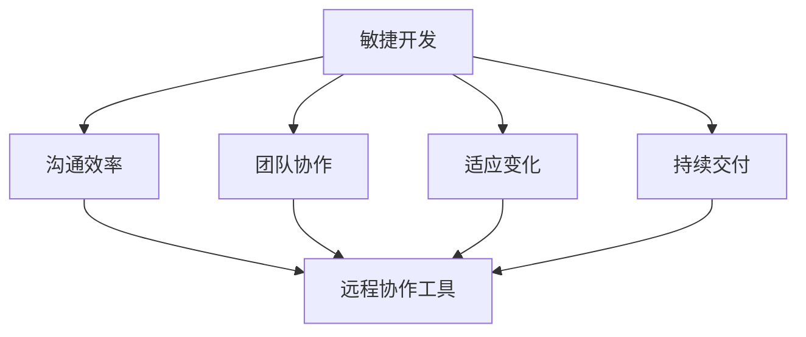

                 

### 《敏捷中的远程协作工具：支持分布式LLM开发团队》

#### 关键词：敏捷开发、远程协作、分布式LLM开发团队、协作工具

> 摘要：本文深入探讨了敏捷开发在远程协作环境中的应用，尤其是对于分布式LLM（大型语言模型）开发团队的支持。文章首先介绍了敏捷与远程协作的背景及核心概念，随后详细分析了分布式LLM开发团队的特点及挑战。接着，文章探讨了选择和使用远程协作工具的策略，并通过具体案例展示了如何在实际项目中应用这些工具。最后，文章提出了分布式LLM开发团队在敏捷实践中的最佳方法和未来展望。

#### 目录

----------------------------------------------------------------

## 第一部分：背景介绍与核心概念

### 第1章：敏捷与远程协作的背景

#### 1.1 问题背景

#### 1.2 问题描述

#### 1.3 问题解决思路

#### 1.4 边界与外延

#### 1.5 核心概念组成

## 第二部分：核心概念与联系

### 第2章：敏捷开发与远程协作概述

#### 2.1 敏捷开发简介

#### 2.2 远程协作的概念与挑战

#### 2.3 敏捷开发与远程协作的联系

### 第3章：分布式LLM开发团队的特点

#### 3.1 分布式团队的定义

#### 3.2 分布式团队的优势与挑战

#### 3.3 核心概念对比表格

## 第三部分：远程协作工具

### 第4章：远程协作工具概述

#### 4.1 远程协作工具的分类

#### 4.2 选择远程协作工具的考虑因素

### 第5章：常用远程协作工具介绍

#### 5.1 团队沟通工具

#### 5.2 文档协作工具

#### 5.3 项目管理工具

### 第6章：远程协作工具的集成与优化

#### 6.1 工具集成策略

#### 6.2 工具使用优化

#### 6.3 案例分析

## 第四部分：分布式LLM开发团队的敏捷实践

### 第7章：敏捷开发流程

#### 7.1 敏捷开发流程概述

#### 7.2 产品迭代与管理

#### 7.3 持续集成与部署

### 第8章：敏捷中的远程协作

#### 8.1 远程协作中的敏捷实践

#### 8.2 敏捷会议与沟通技巧

#### 8.3 案例分享

## 第五部分：最佳实践与展望

### 第9章：最佳实践

#### 9.1 远程协作技巧

#### 9.2 敏捷工具应用心得

#### 9.3 案例总结

### 第10章：未来展望

#### 10.1 远程协作工具的发展趋势

#### 10.2 敏捷开发在远程协作中的未来

#### 10.3 拓展阅读与学习资源

----------------------------------------------------------------

#### 第1章：敏捷与远程协作的背景

#### 1.1 问题背景

在当今全球化的发展趋势下，越来越多的企业开始采用远程协作的工作模式。这种模式不仅能够降低运营成本，提高工作效率，还能够吸引全球范围内的人才。然而，远程协作也带来了一系列挑战，如沟通障碍、协作效率低、时间同步困难等。特别是在分布式LLM（大型语言模型）开发团队中，团队成员可能分布在不同的国家和地区，语言和文化差异更加显著，这对敏捷开发实践提出了更高的要求。

#### 1.2 问题描述

分布式LLM开发团队在敏捷实践中的问题主要包括：

- **沟通障碍**：团队成员分布在不同地区，语言和文化背景不同，沟通效率低下。
- **协作效率**：缺乏统一的工具和流程，导致协作效率降低，项目进度延误。
- **时间同步**：由于时差问题，团队成员难以在同一时间进行讨论和决策。
- **风险管理**：分布式团队在风险管理方面面临更多挑战，如数据安全、版本控制等。

#### 1.3 问题解决思路

为了解决这些问题，分布式LLM开发团队可以采取以下思路：

- **优化沟通**：采用高效的远程协作工具，如视频会议、即时通讯等，提高沟通效率。
- **统一流程**：制定统一的开发流程和标准，确保团队成员能够按照相同的标准进行工作。
- **时间管理**：通过合理的时间安排和任务分配，尽量减少时差带来的影响。
- **风险管理**：建立完善的风险管理机制，确保项目在各个环节都得到有效控制。

#### 1.4 边界与外延

- **边界**：本文主要讨论分布式LLM开发团队在敏捷实践中的应用，不涉及其他类型团队的情况。
- **外延**：虽然本文的核心关注点是分布式LLM开发团队，但许多讨论和方法也适用于其他类型的分布式团队。

#### 1.5 核心概念组成

- **敏捷开发**：一种以人为核心、迭代、增量的软件开发方法。
- **远程协作**：通过远程工具和平台实现的团队协作。
- **分布式团队**：团队成员分布在不同的地理位置，通过远程协作进行工作的团队。
- **LLM开发**：大型语言模型的开发过程，涉及数据收集、模型训练、评估和部署等多个环节。

#### 1.6 本章小结

本章介绍了敏捷与远程协作的背景，以及分布式LLM开发团队在敏捷实践中面临的问题和解决思路。下一章将深入探讨敏捷开发与远程协作的概念及其联系。 ### 第2章：敏捷开发与远程协作概述

#### 2.1 敏捷开发简介

敏捷开发（Agile Development）起源于20世纪90年代末，是一种以人为核心、迭代、增量的软件开发方法。其核心理念包括用户满意度、快速响应变化、持续交付和团队协作。敏捷开发强调灵活性和适应性，以应对快速变化的需求和环境。

**核心原则：**
- **个体和互动重于过程和工具**：重视团队成员之间的互动和沟通，而不是过分依赖工具。
- **可工作的软件重于详尽的文档**：优先交付可工作的软件，而不是过多的文档。
- **客户合作重于合同谈判**：与客户紧密合作，确保产品满足实际需求。
- **响应变化重于遵循计划**：灵活应对变化，而不是严格遵循计划。

**主要方法：**
- **Scrum**：一种迭代式增量软件开发过程框架，包括每日站立会议、冲刺回顾等。
- **Kanban**：一种可视化流程管理方法，通过卡片在板上流动来管理任务。
- **XP（极限编程）**：一种以开发人员为中心的敏捷方法，强调测试驱动开发、持续集成等。

#### 2.2 远程协作的概念与挑战

远程协作（Remote Collaboration）指的是团队成员通过远程工具和平台进行沟通、协作和工作的过程。随着技术的发展，远程协作已经成为许多企业的重要组成部分。

**概念：**
- **远程工具**：包括视频会议、即时通讯、文档共享、项目管理等。
- **远程平台**：如云计算平台、虚拟专用网络（VPN）等。

**挑战：**
- **沟通障碍**：团队成员可能分布在不同的时区和文化背景，沟通效率降低。
- **协作效率**：缺乏面对面交流，可能导致协作效率降低。
- **时间同步**：时差问题可能导致会议安排困难，影响工作进度。
- **技术依赖**：远程协作依赖于网络和工具的稳定性，技术故障可能影响工作。

#### 2.3 敏捷开发与远程协作的联系

敏捷开发与远程协作之间存在着紧密的联系，两者相互促进。

**联系：**
- **提高沟通效率**：远程协作工具如视频会议、即时通讯等，有助于团队成员之间的沟通，实现实时互动。
- **增强团队协作**：远程协作平台如共享文档、项目管理工具等，能够提高团队成员的协作效率，确保任务有序进行。
- **适应变化**：远程协作使团队成员能够更灵活地响应变化，快速调整工作计划。
- **持续交付**：远程协作有助于团队成员持续交付可工作的软件，满足客户需求。

**关系图：**

#### 2.4 本章小结

本章介绍了敏捷开发的基本概念、核心原则和主要方法，以及远程协作的概念和挑战。同时，分析了敏捷开发与远程协作之间的联系，强调了远程协作在敏捷开发中的重要性。下一章将探讨分布式LLM开发团队的特点及挑战。 ### 第3章：分布式LLM开发团队的特点

#### 3.1 分布式团队的定义

分布式团队（Distributed Team）是指团队成员分布在不同的地理位置，通过远程协作进行工作的团队。这种团队结构在全球化背景下越来越普遍，特别是在技术领域，如AI、大数据等。

**定义：**
分布式团队具有以下特征：
- **地理位置分散**：团队成员位于不同的国家或城市。
- **远程协作**：团队成员通过远程工具和平台进行沟通和协作。
- **跨时区工作**：团队成员在不同的时区工作，需要协调工作时间。
- **文化差异**：团队成员来自不同的文化背景，可能存在语言、习俗等方面的差异。

#### 3.2 分布式团队的优势与挑战

**优势：**
- **全球人才**：分布式团队可以招募来自全球各地的人才，提高团队的技能水平和创新能力。
- **降低成本**：无需在单一地理位置租赁办公室和设备，可以降低运营成本。
- **灵活性**：团队成员可以根据个人需求和偏好灵活安排工作时间，提高工作效率。

**挑战：**
- **沟通障碍**：由于地理位置和文化差异，沟通效率可能降低，信息传递容易出现误差。
- **协作效率**：缺乏面对面交流，可能导致协作效率降低。
- **时差问题**：不同时区的团队成员需要协调工作时间，可能影响项目进度。
- **风险管理**：分布式团队在风险管理方面面临更多挑战，如数据安全、版本控制等。

#### 3.3 核心概念对比表格

| 核心概念 | 定义 | 特点 |
| --- | --- | --- |
| 分布式团队 | 地理位置分散的团队 | 地理位置分散、远程协作、跨时区工作、文化差异 |
| 敏捷开发 | 以人为核心、迭代、增量的软件开发方法 | 用户满意度、快速响应变化、持续交付、团队协作 |
| 远程协作 | 通过远程工具和平台进行的团队协作 | 视频会议、即时通讯、文档共享、项目管理 |
| LLM开发 | 大型语言模型的开发过程 | 数据收集、模型训练、评估、部署 |

#### 3.4 本章小结

本章介绍了分布式团队的定义、优势与挑战，并通过对比表格分析了分布式团队与敏捷开发、远程协作和LLM开发的关系。下一章将探讨如何选择和使用远程协作工具。 ### 第4章：远程协作工具概述

#### 4.1 远程协作工具的分类

远程协作工具种类繁多，可以根据功能和使用场景进行分类。以下是常见的几种远程协作工具：

**1. 团队沟通工具：**
- **视频会议工具**：如Zoom、Microsoft Teams、Google Meet等，支持实时语音和视频通讯。
- **即时通讯工具**：如Slack、Microsoft Teams、WhatsApp等，支持实时文本通讯和文件共享。

**2. 文档协作工具：**
- **在线文档编辑**：如Google Docs、Microsoft Office 365、OnlyOffice等，支持多人实时编辑文档。
- **文档管理平台**：如Confluence、Notion、SharePoint等，用于存储、共享和管理文档。

**3. 项目管理工具：**
- **任务管理工具**：如Trello、Asana、JIRA等，用于分配任务、跟踪进度和团队协作。
- **时间跟踪工具**：如Toggl、Harvest、Timely等，用于记录工作时间和项目成本。

**4. 团队协作平台：**
- **协作平台**：如Microsoft Teams、Slack、Confluence等，集成了沟通、文档协作、项目管理等功能。

#### 4.2 选择远程协作工具的考虑因素

选择合适的远程协作工具对分布式团队至关重要。以下是一些关键考虑因素：

**1. 功能需求：**
- **沟通需求**：根据团队的沟通需求选择合适的工具，如视频会议、即时通讯等。
- **文档协作需求**：考虑文档编辑、共享和管理等功能，确保团队成员能够高效协作。
- **项目管理需求**：选择能够满足任务分配、进度跟踪等项目管理需求的工具。

**2. 用户界面：**
- **易用性**：选择用户界面友好、易于操作的工具，降低学习成本。
- **个性化**：工具应支持个性化设置，满足团队成员的不同偏好。

**3. 安全性：**
- **数据安全**：确保工具具有强大的数据安全保护措施，如加密、访问控制等。
- **合规性**：选择符合相关法律法规和行业标准的安全工具。

**4. 扩展性和集成性：**
- **扩展性**：工具应支持扩展功能，适应团队未来发展的需求。
- **集成性**：工具应能够与其他系统和服务集成，提高工作效率。

#### 4.3 远程协作工具的常见问题与解决方案

**1. 沟通障碍：**
- **问题**：由于地理位置和文化差异，团队成员之间的沟通可能存在障碍。
- **解决方案**：采用视频会议工具，增加面对面沟通的机会；使用即时通讯工具，确保实时沟通。

**2. 协作效率：**
- **问题**：缺乏面对面交流，可能导致协作效率降低。
- **解决方案**：使用在线文档编辑工具，实现多人实时协作；使用项目管理工具，确保任务有序进行。

**3. 时差问题：**
- **问题**：不同时区的团队成员需要协调工作时间，可能影响项目进度。
- **解决方案**：制定灵活的工作时间表，利用远程协作工具实现跨时区协作；采用异步沟通方式，如邮件、论坛等。

#### 4.4 本章小结

本章概述了远程协作工具的分类和选择考虑因素，并分析了远程协作工具在分布式团队中的常见问题及其解决方案。下一章将详细介绍几种常用的远程协作工具。 ### 第5章：常用远程协作工具介绍

#### 5.1 团队沟通工具

**1. Zoom**

Zoom是一款功能强大的视频会议工具，适用于各种规模的团队。它支持高清视频和音频通讯，提供实时聊天、屏幕共享、录制会议等功能。

**主要特点：**
- **高清视频和音频**：提供高质量的音视频通讯体验。
- **多人会议**：支持多达1000人的会议，适用于大型团队。
- **屏幕共享**：方便团队成员共享演示、文档等。
- **安全性和隐私保护**：提供加密、会议密码等功能，确保通讯安全。

**使用场景：**
- **远程团队会议**：团队定期召开会议，讨论项目进度、协作计划等。
- **在线培训**：组织线上培训，提高团队成员技能。

**2. Microsoft Teams**

Microsoft Teams是微软推出的团队协作平台，集成了视频会议、即时通讯、文档协作等功能。

**主要特点：**
- **集成办公应用**：与Microsoft Office等办公应用深度集成，方便文档共享和编辑。
- **实时通讯**：支持文本、语音、视频等多种通讯方式。
- **协作功能**：提供共享白板、实时翻译等功能，增强团队协作。
- **安全性和合规性**：符合Microsoft的安全标准和法律法规要求。

**使用场景：**
- **日常沟通**：团队内部日常沟通、协作。
- **项目协作**：项目管理、任务分配、进度跟踪。

**3. Google Meet**

Google Meet是Google推出的视频会议工具，与Google Workspace集成，提供实时通讯和协作功能。

**主要特点：**
- **简单易用**：用户界面简洁，易于上手。
- **跨平台支持**：支持多种操作系统和设备，方便随时随地进行会议。
- **实时翻译**：提供实时字幕翻译，支持多语言会议。
- **安全性和隐私保护**：遵守Google的隐私政策和安全标准。

**使用场景：**
- **远程会议**：团队远程会议、在线讲座。
- **国际协作**：跨国团队协作、多语言沟通。

#### 5.2 文档协作工具

**1. Google Docs**

Google Docs是一款在线文档编辑工具，支持多人实时协作，提供文本编辑、表格、演示等功能。

**主要特点：**
- **实时协作**：团队成员可以同时编辑文档，提高工作效率。
- **版本控制**：自动保存文档版本，便于团队成员跟踪修改历史。
- **云端存储**：存储在云端，方便随时随地访问和共享。
- **兼容性**：支持多种文件格式，方便与其他办公应用集成。

**使用场景：**
- **文档编写**：撰写报告、编写文档。
- **数据收集**：进行数据收集和整理。

**2. Microsoft Office 365**

Microsoft Office 365是一款集成了Word、Excel、PowerPoint等办公应用的云端服务，提供在线协作和文档管理功能。

**主要特点：**
- **集成办公应用**：提供全面的办公软件服务。
- **云端协作**：支持多人在线编辑，实时协作。
- **安全性和合规性**：符合微软的安全标准和法律法规要求。
- **移动办公**：支持多种设备和平台，方便移动办公。

**使用场景：**
- **文档编辑**：编辑文档、表格、演示。
- **项目管理**：项目管理、报告编写。

**3. OnlyOffice**

OnlyOffice是一款开源的在线办公平台，提供文档编辑、表格、演示等多种办公应用。

**主要特点：**
- **开源**：免费使用，无额外费用。
- **自定义**：支持自定义界面和功能，满足个性化需求。
- **扩展性**：支持与其他系统和服务集成，提高工作效率。
- **安全性**：提供多种安全措施，确保数据安全。

**使用场景：**
- **企业办公**：企业内部办公、团队协作。
- **在线教育**：在线教学、作业提交。

#### 5.3 项目管理工具

**1. Trello**

Trello是一款基于看板（Kanban）理念的在线任务管理工具，提供简单直观的界面，方便团队成员分配任务和跟踪进度。

**主要特点：**
- **可视化界面**：通过卡片和看板直观展示任务进度。
- **任务分配**：支持任务分配和提醒功能。
- **协作功能**：支持多人协作，实时更新任务状态。
- **移动端支持**：支持iOS和Android设备，方便移动办公。

**使用场景：**
- **任务管理**：分配任务、跟踪进度。
- **项目协作**：项目计划、团队协作。

**2. Asana**

Asana是一款功能强大的在线任务管理工具，提供详细的任务分配、进度跟踪和协作功能。

**主要特点：**
- **任务分配**：支持任务分配、优先级设置和提醒功能。
- **项目跟踪**：提供项目进度视图，方便团队成员了解项目状态。
- **协作功能**：支持多人协作，实时更新任务状态。
- **集成性**：支持与其他工具和服务集成，提高工作效率。

**使用场景：**
- **项目协作**：项目计划、任务分配、进度跟踪。
- **团队管理**：团队协作、任务管理。

**3. JIRA**

JIRA是Atlassian公司推出的一款敏捷项目管理工具，适用于软件开发团队，提供任务跟踪、问题管理、敏捷迭代等功能。

**主要特点：**
- **任务跟踪**：支持任务创建、分配、进度跟踪和报告。
- **敏捷迭代**：提供敏捷看板、燃尽图等工具，帮助团队进行敏捷开发。
- **问题管理**：提供问题跟踪和报告功能，确保问题得到及时解决。
- **集成性**：支持与其他Atlassian工具和第三方服务集成。

**使用场景：**
- **敏捷开发**：任务管理、迭代计划。
- **软件项目**：项目管理、问题跟踪。

#### 5.4 本章小结

本章详细介绍了团队沟通工具、文档协作工具和项目管理工具的分类和特点。每种工具都有其独特的优势，适用于不同的使用场景。选择合适的远程协作工具，有助于分布式团队提高沟通效率、协作效率和项目进度。下一章将探讨如何集成和优化远程协作工具。 ### 第6章：远程协作工具的集成与优化

#### 6.1 工具集成策略

远程协作工具的集成与优化是分布式团队高效协作的关键。以下是几种常见的工具集成策略：

**1. 单点登录（SSO）**

单点登录允许用户通过一个账户登录多个远程协作工具，提高用户体验和安全性。常见的方法包括：

- **OAuth 2.0**：一种开放标准，允许用户在第三方服务中使用其认证信息。
- **SAML 2.0**：一种安全断言标记语言，用于在服务提供商和身份提供商之间传递身份验证信息。

**2. API集成**

通过API（应用程序编程接口），可以将不同远程协作工具的功能集成到一个统一的平台上。常见的方法包括：

- **Webhook**：一种基于HTTP请求的集成方式，用于在事件触发时自动执行操作。
- **RESTful API**：一种基于REST风格的API，用于实现远程协作工具之间的数据交换和功能调用。

**3. 数据同步**

确保不同工具中的数据保持同步是远程协作的关键。常见的方法包括：

- **定期同步**：设置定时任务，定期将数据从一个工具同步到另一个工具。
- **实时同步**：通过Websocket或其他实时通讯协议，实现数据实时同步。

#### 6.2 工具使用优化

为了提高远程协作工具的使用效率，可以采取以下优化措施：

**1. 规范操作流程**

制定统一的操作流程和标准，确保团队成员能够一致地使用远程协作工具。例如，在文档协作工具中，规定文档的命名规范、版本管理和权限设置。

**2. 提高沟通效率**

- **减少会议次数**：避免频繁的会议，确保会议内容有针对性。
- **缩短会议时间**：控制会议时间，提高会议效率。
- **使用会议纪要**：记录会议内容和决策，便于后续跟踪和执行。

**3. 提高协作效率**

- **明确任务分工**：确保每个团队成员都有明确的任务和责任。
- **使用项目管理工具**：利用项目管理工具进行任务分配、进度跟踪和协作。
- **定期回顾和反馈**：定期进行项目回顾和团队反馈，及时发现和解决问题。

#### 6.3 案例分析

以下是一个分布式LLM开发团队的远程协作工具集成与优化的案例分析：

**案例背景：**
某大型科技公司的一个分布式LLM开发团队分布在不同的城市和国家，团队成员需要高效地协作进行模型开发、训练和部署。

**解决方案：**
1. **单点登录（SSO）**

   使用OAuth 2.0实现单点登录，用户只需登录一次即可访问所有远程协作工具，提高用户体验和安全性。

2. **API集成**

   通过API集成，实现不同工具之间的数据同步和功能调用。例如，将Trello的任务数据同步到JIRA，实现任务分配和进度跟踪。

3. **数据同步**

   使用Webhook实现实时数据同步，确保任务状态和文档版本实时更新。

4. **规范操作流程**

   制定统一的操作流程和标准，如文档命名规范、版本管理和权限设置。

5. **提高沟通效率**

   - 控制会议次数和时间，确保会议内容有针对性。
   - 使用会议纪要记录会议内容和决策。

6. **提高协作效率**

   - 明确任务分工，确保每个团队成员都有明确的任务和责任。
   - 使用Trello进行任务分配和进度跟踪。
   - 定期进行项目回顾和团队反馈。

**效果评估：**

- **用户体验**：单点登录提高了用户体验，减少登录和切换工具的繁琐操作。
- **协作效率**：API集成和数据同步提高了团队协作效率，减少了数据传递和同步的误差。
- **沟通效率**：规范操作流程和改进会议管理提高了沟通效率，确保信息传递及时准确。
- **项目管理**：项目管理工具的有效使用，确保项目进度和任务分配得到有效控制。

#### 6.4 本章小结

本章介绍了远程协作工具的集成与优化策略，并通过案例分析展示了具体实施方法。通过单点登录、API集成、数据同步、规范操作流程等措施，分布式团队可以提高协作效率、沟通效率和管理效率。下一章将探讨分布式LLM开发团队的敏捷实践。 ### 第7章：敏捷开发流程

#### 7.1 敏捷开发流程概述

敏捷开发流程是一种迭代、增量的软件开发方法，旨在快速响应变化，持续交付有价值的软件。敏捷开发流程通常包括以下步骤：

**1. 产品待办事项（Product Backlog）：** 
产品待办事项是团队需要完成的所有工作的列表，由产品负责人（Product Owner）维护。这些任务可以是功能需求、技术任务、用户故事等。

**2. 拉取系统（Sprint Planning）：** 
在每次迭代开始时，团队会从产品待办事项中选取一部分任务（Sprint Goal）进行开发。这个过程称为拉取系统，确保团队始终在开发最重要的任务。

**3. 迭代周期（Sprint）：** 
迭代周期通常为2-4周，团队在这个周期内完成选定的任务。迭代周期结束后，团队会进行评审和回顾，准备下一个迭代周期。

**4. 站立会议（Daily Stand-up）：** 
每日站立会议是团队在迭代周期内每天早上进行的快速会议，每个团队成员回答三个问题：昨天完成了什么？今天计划完成什么？遇到什么问题？

**5. 评审（Sprint Review）：** 
在迭代周期结束时，团队会与利益相关者进行评审会议，展示已完成的任务，收集反馈，并根据反馈调整产品待办事项。

**6. 回顾（Sprint Retrospective）：** 
在评审会议之后，团队会进行回顾会议，分析本次迭代中的优点和不足，提出改进措施，以提高未来的迭代效率。

#### 7.2 产品迭代与管理

在分布式LLM开发团队中，产品迭代和管理是确保项目顺利进行的关键。以下是一些关键步骤和最佳实践：

**1. 定义用户故事：** 
用户故事是描述用户需求的简短描述，通常采用格式：“作为[用户角色]，我想要[功能]，以便[原因或业务价值]”。定义用户故事有助于团队明确开发目标。

**2. 用户故事地图：** 
用户故事地图是一种可视化工具，用于展示用户故事之间的层次结构和依赖关系。通过用户故事地图，团队可以更好地理解产品功能和用户需求。

**3. 优先级排序：** 
在产品待办事项中，对用户故事进行优先级排序，确保团队首先开发最有价值的任务。优先级排序可以根据业务价值、用户需求和风险等因素进行。

**4. 迭代规划：** 
在每次迭代开始前，团队会进行迭代规划会议，确定本次迭代的目标、任务和资源分配。迭代规划会议应充分考虑团队成员的时区和工作时间。

**5. 持续集成与部署：** 
在迭代过程中，团队应采用持续集成与部署（CI/CD）策略，确保代码质量和高可发布性。通过自动化测试和部署流程，减少人工干预，提高开发效率。

**6. 沟通与协作：** 
在分布式团队中，沟通与协作至关重要。采用远程协作工具，如视频会议、即时通讯和项目管理工具，确保团队成员能够实时沟通和协作。

#### 7.3 持续集成与部署

持续集成与部署（CI/CD）是敏捷开发流程中的重要环节，旨在确保代码质量和软件的可发布性。以下是一些关键步骤和最佳实践：

**1. 持续集成（CI）：** 
持续集成是指在代码提交后，自动进行构建、测试和部署的过程。通过持续集成，可以及时发现代码错误和问题，确保代码质量。

- **自动化构建**：使用构建工具（如Maven、Gradle），自动化编译和打包代码。
- **自动化测试**：编写自动化测试用例，执行单元测试、集成测试和端到端测试。
- **持续反馈**：将测试结果实时反馈给开发人员，确保问题得到及时修复。

**2. 持续部署（CD）：** 
持续部署是指在代码通过测试后，自动将软件部署到生产环境的过程。通过持续部署，可以减少人工干预，提高部署效率。

- **自动化部署流程**：使用部署工具（如Jenkins、Docker），自动化部署应用程序。
- **容器化**：使用容器（如Docker），简化部署流程，确保应用程序在不同环境中的一致性。
- **蓝绿部署**：通过蓝绿部署策略，减少部署风险，确保生产环境的高可用性。

#### 7.4 本章小结

本章介绍了敏捷开发流程的概述、产品迭代与管理的关键步骤和持续集成与部署的策略。对于分布式LLM开发团队，敏捷开发流程有助于提高协作效率、项目管理和代码质量。下一章将探讨敏捷开发中的远程协作实践。 ### 第8章：敏捷中的远程协作

#### 8.1 远程协作中的敏捷实践

在远程协作环境中，敏捷实践需要特别关注沟通、协作和工具的使用。以下是一些关键的敏捷实践：

**1. 沟通透明性：**
- **站立会议**：每天早晨举行短暂的站立会议，每个团队成员汇报工作进展、遇到的问题和当天的计划。这有助于团队成员保持同步和了解彼此的状态。
- **视频会议**：定期举行视频会议，以加强团队间的沟通。视频会议可以增进团队成员之间的信任和了解，提高工作效率。
- **即时通讯**：使用即时通讯工具（如Slack、Microsoft Teams），方便团队成员在需要时快速交流，解决即时问题。

**2. 敏捷会议：**
- **迭代规划会议**：在每次迭代开始时，团队成员与产品负责人一起进行迭代规划会议。通过视频会议或在线会议工具，远程团队成员可以讨论并选择本次迭代的目标和任务。
- **评审会议**：在迭代结束时，团队与利益相关者进行评审会议，展示已完成的迭代成果，收集反馈。视频会议是远程团队进行评审的常用方法。

**3. 持续集成与部署：**
- **自动化测试**：使用自动化测试工具（如Selenium、JUnit），确保代码质量，减少手动测试的工作量。自动化测试可以在远程环境中轻松执行，提高测试效率。
- **持续集成服务器**：使用持续集成服务器（如Jenkins、GitLab CI），自动化构建、测试和部署过程，确保软件的可发布性。远程团队可以轻松配置和监控CI服务器，确保代码质量。

**4. 文档协作：**
- **共享文档**：使用文档协作工具（如Google Docs、Confluence），确保团队成员可以实时编辑和共享文档。文档协作工具可以同步更新，减少版本冲突。
- **版本控制**：使用版本控制系统（如Git），确保代码和文档的版本管理。版本控制可以帮助团队成员追踪更改历史，方便协作和问题追踪。

**5. 任务管理：**
- **任务分配**：使用项目管理工具（如Trello、Asana），将任务分配给合适的团队成员。项目管理工具可以帮助团队跟踪任务进度，确保任务按时完成。
- **进度报告**：定期生成进度报告，了解项目进展和团队成员的工作情况。进度报告可以通过电子邮件或在线共享，方便远程团队成员了解项目的状态。

#### 8.2 敏捷会议与沟通技巧

**1. 敏捷会议技巧：**
- **保持会议简短**：确保会议内容简洁、直接，避免冗长和无意义的讨论。
- **提前准备**：会议前准备会议议程和资料，确保会议有针对性的讨论。
- **视频会议设置**：使用视频会议工具的 mute 功能，避免噪音干扰；确保良好的网络连接，保证视频会议的稳定性。

**2. 沟通技巧：**
- **主动沟通**：主动与团队成员沟通，了解他们的工作进展和需求，及时提供支持和帮助。
- **倾听**：倾听是有效沟通的关键，确保团队成员有机会表达自己的观点和问题。
- **清晰表达**：使用简单、明确的语言表达自己的想法，避免使用专业术语或复杂的句子。

**3. 消除沟通障碍：**
- **使用图形和表格**：使用图形、图表和表格等可视化工具，帮助团队成员更好地理解和记忆信息。
- **建立沟通渠道**：建立多个沟通渠道，如电子邮件、即时通讯、视频会议等，确保团队成员可以随时随地交流。
- **文化敏感**：尊重不同文化的团队成员，了解他们的沟通方式和习惯，避免文化冲突。

#### 8.3 案例分享

以下是一个分布式LLM开发团队在远程协作中的敏捷实践案例：

**案例背景：**
某分布式LLM开发团队分布在不同的国家和地区，团队成员需要高效协作完成大型语言模型的开发。

**解决方案：**
1. **站立会议**：每天早晨举行15分钟的站立会议，团队成员汇报工作进展和问题。
2. **迭代规划会议**：每周进行一次迭代规划会议，确定本次迭代的目标和任务。
3. **视频会议**：每周举行两次视频会议，讨论项目进展、问题和解决方案。
4. **文档协作**：使用Google Docs进行文档协作，确保团队成员可以实时编辑和共享文档。
5. **任务管理**：使用Trello进行任务分配和进度跟踪，确保任务按时完成。
6. **持续集成**：使用Jenkins进行持续集成和部署，确保代码质量和软件的可发布性。

**效果评估：**
- **工作效率**：通过站立会议、视频会议和文档协作，团队成员能够更高效地沟通和协作，减少信息传递的误差。
- **项目进度**：任务管理和持续集成确保项目按时完成，提高了项目进度和交付质量。
- **团队协作**：远程协作工具和敏捷实践增强了团队间的信任和协作，提高了团队的整体效率。

#### 8.4 本章小结

本章介绍了敏捷开发中的远程协作实践，包括沟通透明性、敏捷会议、持续集成与部署、文档协作和任务管理等方面的最佳实践。通过有效的远程协作，分布式LLM开发团队能够提高工作效率、项目进度和团队协作。下一章将分享最佳实践和未来展望。 ### 第9章：最佳实践

#### 9.1 远程协作技巧

在远程协作环境中，以下是一些最佳实践，有助于提高团队协作效率：

**1. 明确任务分工：**
- **任务分配**：确保每个团队成员都了解自己的任务和责任，避免重复工作和资源浪费。
- **角色定义**：明确团队成员的角色，如项目经理、开发人员、测试人员等，确保团队职责清晰。

**2. 提高沟通效率：**
- **定期会议**：定期举行视频会议或站立会议，确保团队成员保持同步和了解项目进展。
- **即时通讯**：使用即时通讯工具，如Slack或WhatsApp，方便团队成员随时交流，解决问题。

**3. 使用协作工具：**
- **文档协作**：使用在线文档编辑工具，如Google Docs或Notion，实现多人实时协作。
- **项目管理**：使用项目管理工具，如Trello或JIRA，确保任务分配、进度跟踪和团队协作。

**4. 时间管理：**
- **时区安排**：合理分配工作任务，确保团队成员在不同时区都能有充足的时间完成工作。
- **时间追踪**：使用时间跟踪工具，如Toggl或RescueTime，监控工作进度，确保任务按时完成。

**5. 风险管理：**
- **提前规划**：在项目开始前，识别潜在风险，制定应对策略。
- **持续监控**：定期评估项目风险，确保问题得到及时解决。

#### 9.2 敏捷工具应用心得

在分布式LLM开发团队中，敏捷工具的应用至关重要。以下是一些心得体会：

**1. 持续集成与部署：**
- **自动化测试**：自动化测试可以快速发现代码问题，提高开发效率。建议使用Selenium、JUnit等自动化测试工具。
- **容器化部署**：使用Docker和Kubernetes等容器化技术，简化部署流程，确保应用程序在不同环境中的一致性。

**2. 项目管理：**
- **任务分配**：使用Trello或JIRA等项目管理工具，确保任务分配清晰，团队成员了解自己的任务和责任。
- **进度跟踪**：定期生成进度报告，了解项目进展和团队成员的工作情况。

**3. 文档协作：**
- **实时编辑**：使用Google Docs或Notion等在线文档编辑工具，实现多人实时协作，减少版本冲突。
- **版本管理**：使用Git等版本控制系统，确保文档和代码的版本管理。

**4. 沟通工具：**
- **视频会议**：使用Zoom、Microsoft Teams等视频会议工具，加强团队间的沟通和协作。
- **即时通讯**：使用Slack、WhatsApp等即时通讯工具，方便团队成员随时交流，解决问题。

#### 9.3 案例总结

以下是一个分布式LLM开发团队在敏捷工具应用中的成功案例：

**案例背景：**
某分布式LLM开发团队由30名成员组成，分布在不同的国家和地区，负责开发一款大型语言模型。

**解决方案：**
1. **任务分工**：使用Trello进行任务分配，确保每个成员了解自己的任务和责任。
2. **视频会议**：每周举行两次视频会议，讨论项目进展、问题和解决方案。
3. **持续集成**：使用Jenkins进行持续集成和部署，确保代码质量和软件的可发布性。
4. **文档协作**：使用Google Docs进行文档协作，实现多人实时编辑。
5. **时间管理**：使用Toggl进行时间跟踪，确保任务按时完成。

**效果评估：**
- **工作效率**：通过任务分配和视频会议，团队成员能够更高效地协作，减少信息传递的误差。
- **项目进度**：持续集成和部署确保项目按时完成，提高了项目进度和交付质量。
- **团队协作**：使用敏捷工具和远程协作工具，增强了团队间的信任和协作，提高了整体效率。

#### 9.4 本章小结

本章总结了远程协作和敏捷开发中的最佳实践，包括任务分工、沟通效率、工具应用和风险管理等方面的策略。通过有效的远程协作和敏捷实践，分布式LLM开发团队能够提高工作效率、项目进度和团队协作。下一章将探讨远程协作工具的发展趋势和未来展望。 ### 第10章：未来展望

#### 10.1 远程协作工具的发展趋势

随着技术的不断进步，远程协作工具也在不断演变和升级，以适应日益复杂的分布式团队需求。以下是一些远程协作工具的发展趋势：

**1. 更智能化：**  
远程协作工具将更加智能化，通过人工智能（AI）技术，自动分析团队沟通和行为模式，提供个性化的建议和优化方案。例如，AI可以自动安排最佳会议时间，预测沟通中的潜在问题并提供解决方案。

**2. 更集成化：**  
远程协作工具将与其他企业应用和服务更加集成，形成无缝的工作流程。例如，项目管理工具与沟通工具的结合，可以实现任务分配、进度跟踪和沟通反馈的无缝流转。

**3. 更安全可靠：**  
随着数据安全和隐私保护的重要性日益凸显，远程协作工具将更加注重安全性和可靠性。例如，采用更高级的加密技术和多因素身份验证，确保数据和通讯的安全。

**4. 更多样化：**  
远程协作工具将提供更多样化的功能，以满足不同类型团队的需求。例如，虚拟现实（VR）和增强现实（AR）技术的应用，可以为远程团队提供更加沉浸式的协作体验。

#### 10.2 敏捷开发在远程协作中的未来

敏捷开发在远程协作中的应用将更加成熟和广泛，主要体现在以下几个方面：

**1. 更灵活的敏捷框架：**  
为了适应远程协作的需求，敏捷开发框架将更加灵活，允许团队根据实际情况调整迭代周期、任务分配和沟通方式。例如，采用敏捷框架的子集，如Scrum和Kanban，可以根据团队规模和工作内容进行灵活调整。

**2. 更高效的敏捷实践：**  
远程协作工具的不断发展，将使敏捷实践更加高效。例如，自动化测试和持续集成工具的普及，将大大提高代码质量和开发效率；远程协作工具的集成，将使团队沟通和协作更加顺畅。

**3. 更深入的敏捷文化：**  
随着敏捷实践的普及，敏捷文化将逐渐深入到远程团队中。团队成员将更加注重沟通、协作和持续改进，形成一种高效、和谐的团队氛围。

**4. 更广泛的敏捷应用：**  
敏捷开发将不仅仅应用于软件开发领域，还将扩展到其他领域，如产品管理、项目管理等。远程协作工具的支持，将使敏捷实践更加广泛应用。

#### 10.3 拓展阅读与学习资源

为了深入了解远程协作和敏捷开发，以下是一些推荐的学习资源：

**书籍：**
- 《Scrum精髓：敏捷软件开发实践指南》
- 《敏捷软件开发：原则、实践与模式》
- 《远程工作：如何打造高效的远程团队》

**在线课程：**
- Coursera上的《敏捷软件开发》课程
- Udemy上的《敏捷项目管理：敏捷方法与实践》课程

**网站：**
- Agile Alliance：提供敏捷开发相关资源和最佳实践
- Atlassian：提供JIRA、Confluence等远程协作工具的使用和教程

**社群：**
- 敏捷开发论坛：讨论敏捷实践和问题
- Remote Work Community：分享远程工作的最佳实践和经验

#### 10.4 本章小结

本章展望了远程协作工具的发展趋势和敏捷开发在远程协作中的未来。随着技术的进步和敏捷实践的普及，远程协作和敏捷开发将在未来得到更广泛的应用。通过深入了解和发展远程协作工具，分布式团队将能够更加高效、灵活地协作。同时，敏捷文化的深入推广，将有助于建立高效、和谐的团队氛围。希望读者能够紧跟行业发展趋势，不断学习和实践，为分布式团队的远程协作贡献自己的力量。 ### 结束语

在本文中，我们深入探讨了敏捷开发在远程协作环境中的应用，特别是对于分布式LLM开发团队的支持。通过详细分析敏捷开发、远程协作和分布式团队的核心概念，我们提出了选择和使用远程协作工具的策略，并通过实际案例展示了如何在实际项目中应用这些工具。

敏捷开发强调快速响应变化、持续交付和团队协作，这对于分布式LLM开发团队尤为重要。远程协作工具的合理选择和集成，能够显著提高团队沟通效率、协作效率和项目进度。同时，敏捷实践的最佳方法和工具应用心得，为分布式团队提供了实用的指导。

随着远程协作工具和技术的不断发展，分布式团队将能够更加高效、灵活地协作。未来，敏捷开发将继续在远程协作中发挥重要作用，为分布式团队带来更多的机遇和挑战。

最后，感谢读者对本文的关注和阅读。希望本文能够帮助您更好地理解敏捷开发在远程协作中的应用，为您的分布式团队带来实际的改进和提升。如果您有任何疑问或建议，欢迎在评论区留言，我们期待与您共同探讨和交流。作者：AI天才研究院/AI Genius Institute & 禅与计算机程序设计艺术 /Zen And The Art of Computer Programming。 

