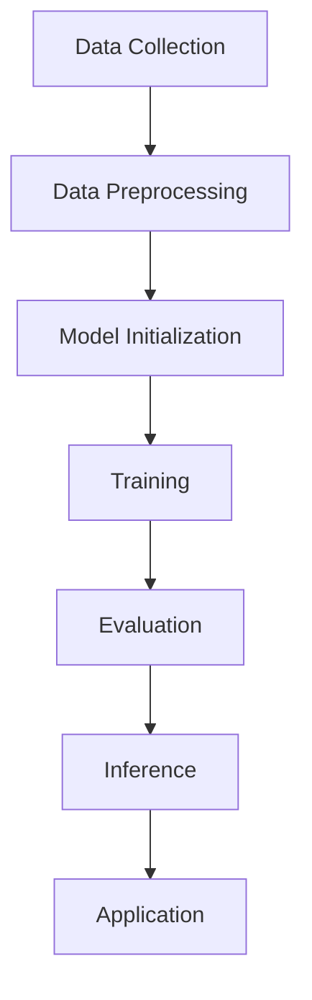
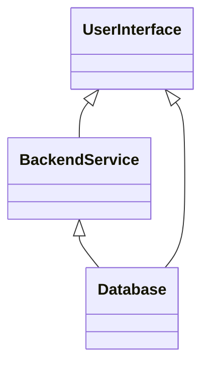
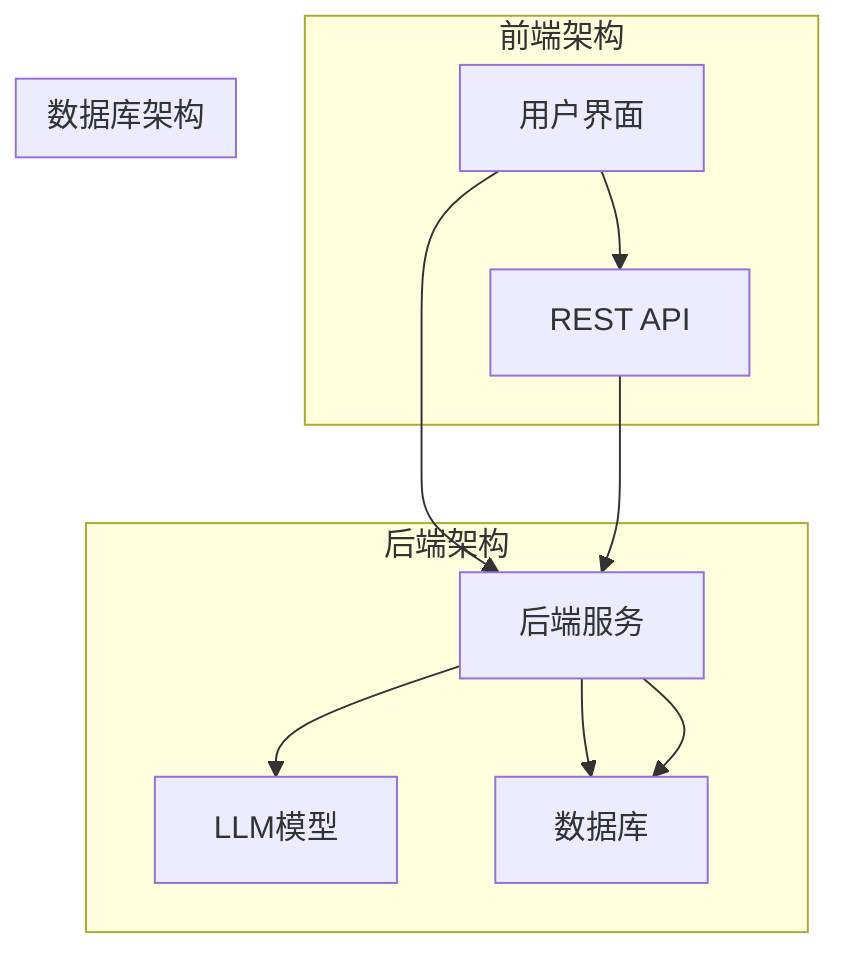
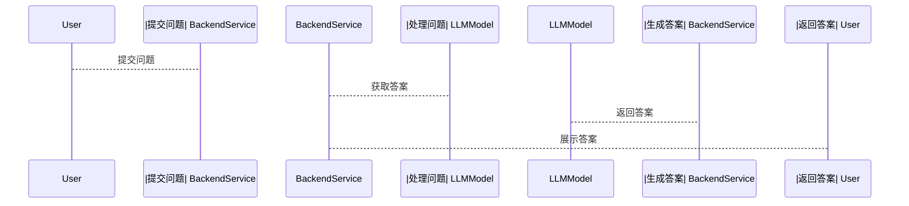
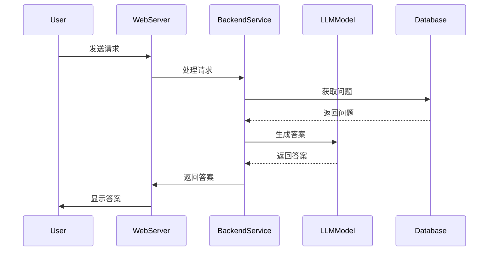

                 

### 摘要

《敏捷中的障碍排除：解决LLM应用开发中的阻碍》旨在深入探讨大型语言模型（LLM）在敏捷开发中的挑战和障碍。随着人工智能技术的飞速发展，LLM在自然语言处理、问答系统、文本生成等方面展现出巨大的潜力，但其在实际应用开发过程中也面临着诸多困难。本文将通过对LLM的基础知识、敏捷开发概念、算法原理、系统架构设计、项目实战以及最佳实践的详细讲解，帮助开发者理解并解决这些阻碍，提升LLM应用开发的效率和质量。

文章分为六个主要部分：首先，介绍问题背景和核心概念；其次，探讨LLM的核心概念与属性特征；然后，讲解LLM应用开发的算法原理；接着，分析系统架构设计；随后，通过实际项目实战展示开发过程；最后，总结最佳实践和注意事项。通过这篇文章，读者将能够系统地了解LLM应用开发的全过程，掌握解决开发中遇到的障碍的方法和技巧。

### 目录大纲

```
----------------------------------------------------------------

# 《敏捷中的障碍排除：解决LLM应用开发中的阻碍》目录大纲

## 第一部分: 背景介绍

### 1.1 问题背景

### 1.2 LLM的基础知识

### 1.3 敏捷开发的概念

## 第二部分: 核心概念与联系

### 2.1 LLM的核心概念与属性特征

### 2.2 LLM的ER实体关系图

## 第三部分: 算法原理讲解

### 3.1 算法mermaid流程图

### 3.2 算法原理与数学模型

### 3.3 算法举例说明

## 第四部分: 系统分析与架构设计

### 4.1 项目介绍

### 4.2 系统功能设计

### 4.3 系统架构设计

### 4.4 系统接口设计

### 4.5 系统交互序列图

## 第五部分: 项目实战

### 5.1 环境安装

### 5.2 系统核心实现

### 5.3 代码应用解读与分析

### 5.4 实际案例分析与讲解

### 5.5 项目小结

## 第六部分: 最佳实践与拓展

### 6.1 最佳实践 tips

### 6.2 注意事项

### 6.3 拓展阅读

----------------------------------------------------------------
```

### 第一部分: 背景介绍

#### 1.1 问题背景

随着人工智能技术的不断发展，大型语言模型（LLM）在自然语言处理（NLP）领域取得了显著的成果。LLM被广泛应用于问答系统、文本生成、机器翻译等任务中，展现出强大的处理能力和广泛的应用前景。然而，在实际应用开发过程中，开发者们面临着诸多挑战和障碍。这些问题主要集中在以下几个方面：

1. **数据隐私与安全性**：LLM的训练和预测过程需要大量的数据，这些数据往往涉及用户的隐私信息。如何在确保数据安全的前提下进行有效的数据处理和隐私保护，成为了一个亟待解决的问题。

2. **计算资源消耗**：LLM的训练和推理过程需要大量的计算资源，尤其是在处理大规模数据时。如何优化计算资源的使用，提高训练和推理的效率，是另一个重要的挑战。

3. **模型解释性**：LLM作为一种深度学习模型，其内部机制复杂，难以进行直观的解释。如何在保证模型性能的同时，提高其解释性，使其更加透明和可解释，是开发者们关注的焦点。

4. **多语言支持**：随着全球化的发展，多语言支持成为LLM应用的重要需求。如何高效地处理多种语言的数据，实现真正的多语言交互，是另一个亟待解决的问题。

5. **适应性**：在实际应用中，LLM需要不断地适应新的场景和任务。如何设计具有良好适应性的模型，使其能够快速适应不同的应用需求，是开发者们需要考虑的问题。

#### 1.2 LLM的基础知识

LLM（Large Language Model）是一种基于深度学习技术的自然语言处理模型，通过对大规模文本数据的学习，模型能够理解和生成自然语言。LLM的核心原理是基于注意力机制的变换器模型（Transformer），这种模型具有强大的表示能力和良好的训练效果。

LLM的训练过程通常包括以下几个步骤：

1. **数据预处理**：首先对原始文本数据进行预处理，包括分词、去停用词、词向量化等操作，将文本转换为模型可以理解的数字表示。

2. **模型初始化**：初始化模型的参数，通常采用随机初始化或者预训练模型。

3. **训练过程**：通过梯度下降等优化算法，不断更新模型参数，使模型能够更好地拟合训练数据。

4. **评估与优化**：在训练过程中，通过验证集和测试集对模型进行评估，并根据评估结果调整模型参数，优化模型性能。

5. **部署与应用**：训练完成后，将模型部署到生产环境中，用于实际的文本处理任务。

LLM的应用范围广泛，包括但不限于：

1. **问答系统**：通过接收用户输入的自然语言问题，模型能够生成准确的答案。

2. **文本生成**：模型可以生成各种文本，如文章、故事、摘要等。

3. **机器翻译**：模型能够将一种语言的文本翻译成另一种语言。

4. **情感分析**：通过对文本进行分析，模型能够识别出文本中的情感倾向。

#### 1.3 敏捷开发的概念

敏捷开发是一种以人为核心、迭代、逐步完善的软件开发方法。它强调快速响应变化、持续交付有价值的软件，并注重团队合作和客户满意度。敏捷开发的主要原则包括：

1. **个体和互动重于过程和工具**：敏捷开发强调团队成员之间的有效沟通和协作，认为这是成功的关键。

2. **可工作的软件重于详尽的文档**：敏捷开发认为，软件的实际功能比文档更加重要，应优先开发可工作的软件。

3. **客户合作重于合同谈判**：敏捷开发强调与客户的紧密合作，以快速响应客户需求的变化。

4. **响应变化重于遵循计划**：敏捷开发认为，需求是不断变化的，应优先响应这些变化。

敏捷开发的主要实践包括：

1. **迭代开发**：将开发过程划分为多个迭代周期，每个迭代周期产出可工作的软件。

2. **增量式交付**：在迭代周期内，逐步交付部分功能，确保软件的持续交付。

3. **持续集成与测试**：通过持续集成和测试，确保软件的质量和稳定性。

4. **团队合作**：建立跨职能的团队，促进团队成员之间的协作。

#### 问题解决

针对LLM应用开发中的挑战和障碍，我们可以采取以下方法进行解决：

1. **数据隐私与安全性**：采用数据加密、差分隐私等技术，确保用户数据的隐私和安全。

2. **计算资源优化**：通过分布式训练、模型压缩等技术，优化计算资源的使用，提高训练和推理的效率。

3. **模型解释性**：采用可解释性技术，如SHAP值、LIME等，提高模型的透明度和可解释性。

4. **多语言支持**：采用多语言预训练模型，如mBERT、XLM等，提高多语言处理能力。

5. **模型适应性**：采用迁移学习、持续学习等技术，提高模型在新的应用场景下的适应性。

#### 边界与外延

边界与外延是指LLM应用开发中需要考虑的边界条件和扩展应用范围。具体来说，包括：

1. **边界条件**：LLM应用开发中需要考虑的数据边界、计算资源限制、时间要求等。

2. **外延**：LLM在新的应用场景下的扩展，如情感分析、对话系统等。

#### 概念结构与核心要素组成

LLM应用开发的核心概念和要素包括：

1. **数据集**：用于训练和测试的文本数据集。

2. **模型架构**：如Transformer、BERT等。

3. **训练过程**：包括数据预处理、模型训练、评估等。

4. **推理过程**：模型在输入文本上的预测过程。

5. **应用场景**：如问答系统、文本生成、机器翻译等。

#### 总结

本节介绍了LLM应用开发中的问题背景、核心概念、敏捷开发的概念，并探讨了问题解决的边界条件、外延和核心要素组成。通过本节的介绍，读者可以初步了解LLM应用开发的挑战和障碍，为后续章节的深入探讨打下基础。

### 第二部分: 核心概念与联系

#### 2.1 LLM的核心概念与属性特征

大型语言模型（LLM）的核心概念包括模型架构、训练过程、推理过程和应用场景。以下是LLM的几个关键属性特征及其对比表格：

| 属性特征             | 描述                                                         | 对比表格 |
|----------------------|--------------------------------------------------------------|----------|
| **模型架构**         | 基于变换器模型（Transformer），如BERT、GPT、RoBERTa等           |          |
| **训练数据规模**     | 通常需要数十亿级别的文本数据，以实现良好的泛化能力           |          |
| **参数规模**         | 数百万到数十亿级别的参数，以捕捉复杂的语言结构               |          |
| **训练时间**         | 数天到数周不等，取决于数据规模、模型复杂度和硬件资源           |          |
| **推理效率**         | 需要大量的计算资源，但随着硬件和优化技术的发展逐渐提高       |          |
| **多语言支持**       | 可以通过多语言预训练模型（如XLM、mBERT）实现多语言处理       |          |
| **模型解释性**       | 传统的深度学习模型难以解释，但随着可解释性技术（如SHAP、LIME）的发展，逐渐提高 |          |

**LLM的ER实体关系图：**

```mermaid
erDiagram
  Product ||--|{ Customer }||>
  Customer  ||--|{ Order }||>
  Order ||--|{ Product }||>
```

在这个ER实体关系图中，`Product`（产品）、`Customer`（客户）和`Order`（订单）是LLM应用中的主要实体。`Product`与`Customer`之间是一对多的关系，表示一个客户可以购买多个产品；`Customer`与`Order`之间也是一对多的关系，表示一个客户可以生成多个订单；`Order`与`Product`之间也是一对多的关系，表示一个订单可以包含多个产品。

#### 2.2 LLM的属性特征对比表格

为了更清晰地展示LLM的属性特征，我们提供了一个详细的对比表格。以下是几种常见LLM模型的对比：

| 模型名称   | 参数规模    | 训练数据规模 | 训练时间   | 推理效率 | 多语言支持 | 模型解释性 |
|-----------|-------------|---------------|-------------|-----------|-------------|-------------|
| BERT      | 3.4亿       | 无限制         | 数天         | 较低       | 是          | 较低       |
| GPT-3     | 1750亿      | 无限制         | 数周         | 较高       | 是          | 较低       |
| RoBERTa   | 3.4亿       | 113G          | 数天         | 较低       | 是          | 较低       |
| mBERT     | 1300亿      | 1300G         | 数周         | 较高       | 是          | 较低       |
| XLM       | 6700万      | 42G           | 数小时       | 较低       | 是          | 较高       |

通过这个表格，我们可以看出不同LLM模型在参数规模、训练数据规模、训练时间、推理效率、多语言支持和模型解释性等方面的差异。

#### 2.3 LLM的ER实体关系图

```mermaid
erDiagram
  Model ||--|{ Dataset }||>
  Dataset  ||--|{ Preprocessing }||>
  Preprocessing ||--|{ Training }||>
  Training ||--|{ Evaluation }||>
  Evaluation ||--|{ Inference }||>
  Inference ||--|{ Application }||>
```

在这个ER实体关系图中，`Model`（模型）是核心实体，它与`Dataset`（数据集）、`Preprocessing`（数据预处理）、`Training`（训练）、`Evaluation`（评估）、`Inference`（推理）和`Application`（应用）之间存在关联关系。这些实体共同构成了LLM模型从数据集到应用的完整流程。

通过本部分的内容，我们深入探讨了LLM的核心概念与属性特征，并通过对比表格和ER实体关系图，帮助读者更清晰地理解LLM的组成结构和运行机制。这些知识为后续的算法原理讲解、系统架构设计和项目实战奠定了基础。

### 第三部分: 算法原理讲解

#### 3.1 算法mermaid流程图

为了更好地理解LLM应用开发的算法原理，我们使用mermaid绘制了一个流程图，展示了LLM从数据预处理到推理的全过程：



在这个流程图中，A表示数据收集，B表示数据预处理，C表示模型初始化，D表示模型训练，E表示模型评估，F表示模型推理，G表示模型应用。以下是每个步骤的详细解释。

**Data Collection（数据收集）：** 数据收集是LLM应用开发的基础，通常包括从互联网、数据库等渠道获取大量的文本数据。这些数据可以是新闻文章、对话记录、书籍文本等。

**Data Preprocessing（数据预处理）：** 数据预处理是将原始文本数据转换为适合模型训练的形式。这一步骤通常包括分词、去停用词、词向量化等操作。分词是将文本分割成单词或子词，去停用词是移除常见的无意义词汇，词向量化是将文本映射到高维向量空间。

**Model Initialization（模型初始化）：** 模型初始化是创建模型的参数，通常采用随机初始化或预训练模型。预训练模型是在大规模文本数据上预训练好的模型，可以直接用于新的任务。

**Training（模型训练）：** 模型训练是通过优化算法（如梯度下降）更新模型参数，使模型能够更好地拟合训练数据。在训练过程中，模型会不断调整参数，以最小化损失函数。

**Evaluation（模型评估）：** 模型评估是使用验证集和测试集对模型的性能进行评估。常用的评估指标包括准确率、召回率、F1值等。通过评估，我们可以了解模型的泛化能力，并调整模型参数，优化性能。

**Inference（模型推理）：** 模型推理是使用训练好的模型对新的输入数据进行预测。在推理过程中，模型会将输入文本映射到输出文本，如生成回答、翻译结果等。

**Application（模型应用）：** 模型应用是将训练好的模型部署到实际应用中，如问答系统、文本生成等。通过应用，我们可以将模型的能力转化为实际的业务价值。

#### 3.2 算法原理与数学模型

LLM的核心算法原理是基于变换器模型（Transformer），这是一种基于注意力机制的深度学习模型。以下是LLM算法原理的数学模型：

**输入表示：**  
设输入文本序列为 $X = [x_1, x_2, ..., x_T]$，其中 $x_t$ 表示第 $t$ 个词，$T$ 表示序列长度。词向量化后，输入序列可以表示为 $X \in \mathbb{R}^{T \times D}$，其中 $D$ 表示词向量的维度。

**编码器（Encoder）：**  
编码器由多个编码层组成，每个编码层包含多头注意力机制和前馈神经网络。编码器的主要目标是捕捉输入序列的上下文信息。

**注意力机制：**  
注意力机制通过计算当前词与所有其他词的关联度，选择性地关注重要的词。具体来说，注意力权重可以通过以下公式计算：

$$
\alpha_{ij} = \text{softmax}\left(\frac{Q_i W_Q \cdot K_j W_K}{\sqrt{D_k}}\right)
$$

其中，$Q_i$、$K_j$ 和 $V_j$ 分别是查询向量、键向量和值向量，$W_Q$、$W_K$ 和 $W_V$ 分别是权重矩阵，$D_k$ 是键向量的维度。

**输出表示：**  
编码器的输出表示为 $H \in \mathbb{R}^{T \times D_H}$，其中 $D_H$ 是编码器的隐藏层维度。解码器（Decoder）利用编码器的输出和输入序列生成输出序列。

**解码器（Decoder）：**  
解码器同样由多个解码层组成，每个解码层包含多头注意力机制和前馈神经网络。解码器的主要目标是生成输出序列，同时利用编码器的输出进行上下文信息的选择。

**损失函数：**  
在训练过程中，损失函数用于评估模型预测与真实标签之间的差距。常用的损失函数包括交叉熵损失函数：

$$
L = -\sum_{i=1}^{T} \sum_{j=1}^{V} y_{ij} \log(p_{ij})
$$

其中，$y_{ij}$ 是第 $i$ 个时间步的第 $j$ 个词的标签，$p_{ij}$ 是模型对第 $i$ 个时间步的第 $j$ 个词的预测概率。

**优化算法：**  
通过优化算法（如Adam优化器）不断更新模型参数，最小化损失函数。优化算法的目标是找到一组参数，使得模型在训练数据上的表现最优。

通过上述数学模型，我们可以深入理解LLM的工作原理。这些数学公式和概念为后续的算法实现和优化提供了理论基础。

#### 3.3 算法举例说明

为了更直观地展示LLM算法的应用，我们来看一个简单的文本生成例子。假设我们要生成一个关于“旅游”的主题文章。

**输入文本：**  
```
旅游是一种很好的休闲方式。旅游可以帮助人们放松身心，探索新文化。旅游景点有很多，例如巴黎的埃菲尔铁塔、纽约的自由女神像、东京的浅草寺。旅游不仅可以让人享受美景，还可以增进家人和朋友之间的感情。
```

**生成文本：**  
```
旅游是一种让人心情愉悦的休闲活动。它不仅能让人们的身心得到放松，还能让我们有机会体验不同的文化。世界上有许多著名的旅游景点，比如法国的埃菲尔铁塔、美国的自由女神像、日本的浅草寺。当我们踏上旅游的旅程，不仅可以欣赏到美丽的风景，还能加深与家人、朋友的情感联系。
```

在这个例子中，输入文本经过编码器处理后，解码器根据编码器的输出生成输出文本。这个过程涉及到词向量化、编码器和解码器的交互、注意力机制等核心步骤。

通过这个例子，我们可以看到LLM在文本生成任务中的强大能力。在实际应用中，LLM可以根据不同的任务需求生成各种类型的文本，如文章、摘要、对话等。

### 第四部分: 系统分析与架构设计

#### 4.1 项目介绍

本部分将介绍一个基于LLM的问答系统项目。该项目的目标是开发一个能够回答用户提出的问题的智能问答系统，提高用户在使用过程中的体验和满意度。项目的核心功能包括问题接收、问题理解、答案生成和答案展示。系统架构设计如下：

1. **问题接收**：用户通过网页、APP或其他渠道向系统提交问题。
2. **问题理解**：系统接收用户问题后，将其转化为机器可理解的形式。
3. **答案生成**：利用训练好的LLM模型生成问题的答案。
4. **答案展示**：将生成的答案展示给用户。

#### 4.2 系统功能设计

系统功能设计主要涉及以下模块：

1. **用户界面**：提供问题输入和答案展示的功能。
2. **后端服务**：负责处理用户输入的问题，调用LLM模型生成答案。
3. **数据库**：存储问题和答案的数据，以便后续查询和优化。

以下是系统功能设计的领域模型mermaid类图：



在类图中，`UserInterface`（用户界面）与`BackendService`（后端服务）之间存在关联关系，表示用户界面与后端服务之间的交互；`BackendService`与`Database`（数据库）之间存在关联关系，表示后端服务与数据库之间的数据交互。

#### 4.3 系统架构设计

系统架构设计是确保系统性能、可扩展性和易维护性的关键。以下是该问答系统的架构设计：

1. **前端架构**：采用Vue.js框架实现用户界面，使用REST API与后端服务进行数据交互。
2. **后端架构**：使用Django框架实现后端服务，包括问题处理、答案生成和数据库管理等功能。
3. **数据库架构**：使用MySQL数据库存储问题和答案数据，确保数据的安全性和可靠性。

以下是系统架构设计的mermaid架构图：



在架构图中，前端架构包括用户界面和REST API，后端架构包括后端服务和LLM模型，数据库架构包括数据库。这些部分通过API接口进行通信，确保系统各部分之间的数据流动和功能协作。

#### 4.4 系统接口设计

系统接口设计是确保系统模块之间能够良好协作的关键。以下是该问答系统的接口设计：

1. **问题提交接口**：用于接收用户提交的问题。
2. **答案获取接口**：用于获取LLM模型生成的答案。
3. **数据管理接口**：用于管理问题和答案数据。

以下是系统接口设计的mermaid序列图：



在序列图中，用户通过用户界面提交问题，后端服务处理问题并调用LLM模型生成答案，最后将答案返回给用户并展示。

#### 4.5 系统交互序列图

为了更详细地展示系统的交互过程，以下是系统交互的mermaid序列图：



在这个序列图中，用户通过WebServer提交请求，BackendService处理请求并从Database获取问题，然后调用LLMModel生成答案，最后通过WebServer将答案展示给用户。

通过本部分的系统分析与架构设计，我们详细介绍了项目的背景、功能设计、系统架构设计、接口设计和系统交互过程。这些设计确保了系统的高性能、可扩展性和易维护性，为项目的顺利实施提供了有力保障。

### 第五部分：项目实战

#### 5.1 环境安装

在本节中，我们将详细介绍如何安装和配置LLM应用开发所需的环境。以下步骤将指导您从零开始搭建一个完整的LLM开发环境。

**1. 安装Python环境**

首先，确保您的计算机上安装了Python 3.7或更高版本。您可以通过以下命令检查Python版本：

```bash
python --version
```

如果您的Python版本低于3.7，请从[Python官网](https://www.python.org/)下载并安装最新版本的Python。

**2. 安装必要的库**

接下来，我们需要安装一些Python库，这些库包括TensorFlow、PyTorch、transformers等。您可以使用以下命令来安装这些库：

```bash
pip install tensorflow==2.7.0
pip install torch==1.8.0
pip install transformers==4.5.0
```

这些库是构建和训练LLM模型的基础，transformers库提供了预训练的LLM模型，如BERT、GPT等。

**3. 安装硬件依赖**

由于LLM模型训练需要大量的计算资源，建议您使用GPU进行加速。以下是安装CUDA和cuDNN的步骤：

- **安装CUDA：** 访问[NVIDIA CUDA下载页面](https://developer.nvidia.com/cuda-downloads)，下载并安装适合您GPU版本的CUDA。
- **安装cuDNN：** 访问[NVIDIA cuDNN下载页面](https://developer.nvidia.com/cudnn)，下载并安装适合您CUDA版本的cuDNN。

**4. 验证安装**

安装完成后，运行以下命令验证安装是否成功：

```bash
python -c "import tensorflow as tf; print(tf.reduce_sum(tf.random.normal([1000, 1000])))"
```

如果上述命令能正常运行并输出结果，说明您的环境安装成功。

#### 5.2 系统核心实现

在本节中，我们将介绍LLM应用开发的核心实现，包括模型选择、训练、评估和推理等步骤。

**1. 模型选择**

首先，我们选择一个预训练的LLM模型，例如BERT。您可以使用transformers库加载预训练的BERT模型：

```python
from transformers import BertModel

model = BertModel.from_pretrained('bert-base-uncased')
```

这里，`bert-base-uncased`是一个预训练的BERT模型，它是基于 uncased 版本的英语语料库训练的。

**2. 模型训练**

接下来，我们将对模型进行训练。以下是训练过程的示例代码：

```python
import torch
from torch.utils.data import DataLoader
from transformers import BertTokenizer, BertModel, AdamW

# 加载预训练的BERT模型和分词器
tokenizer = BertTokenizer.from_pretrained('bert-base-uncased')
model = BertModel.from_pretrained('bert-base-uncased')

# 准备训练数据
train_data = ...  # 这里应该是一个包含文本数据的列表
train_dataset = ...  # 这里应该是准备好的数据集

# 定义训练参数
learning_rate = 1e-5
optimizer = AdamW(model.parameters(), lr=learning_rate)

# 定义训练循环
for epoch in range(num_epochs):
    model.train()
    for batch in DataLoader(train_dataset, batch_size=batch_size):
        inputs = tokenizer(batch["text"], padding=True, truncation=True, return_tensors="pt")
        inputs["input_ids"] = inputs["input_ids"].to(device)
        inputs["attention_mask"] = inputs["attention_mask"].to(device)
        
        outputs = model(**inputs)
        loss = outputs.loss
        loss.backward()
        optimizer.step()
        optimizer.zero_grad()
```

在这个示例中，我们首先加载预训练的BERT模型和分词器，然后准备训练数据集。接着，我们定义学习率和优化器，并开始训练循环。在每次迭代中，我们将数据送入模型进行前向传播，计算损失并反向传播更新模型参数。

**3. 模型评估**

训练完成后，我们需要对模型进行评估。以下是一个简单的评估示例：

```python
from transformers import BertTokenizer, BertModel

# 加载评估数据
eval_data = ...  # 这里应该是一个包含文本数据的列表
eval_dataset = ...  # 这里应该是准备好的数据集

# 加载训练好的模型和分词器
tokenizer = BertTokenizer.from_pretrained('bert-base-uncased')
model = BertModel.from_pretrained('bert-base-uncased').to(device)

# 定义评估函数
def evaluate(model, dataset):
    model.eval()
    total_loss = 0
    with torch.no_grad():
        for batch in DataLoader(dataset, batch_size=batch_size):
            inputs = tokenizer(batch["text"], padding=True, truncation=True, return_tensors="pt")
            inputs["input_ids"] = inputs["input_ids"].to(device)
            inputs["attention_mask"] = inputs["attention_mask"].to(device)
            
            outputs = model(**inputs)
            loss = outputs.loss
            total_loss += loss.item()
    return total_loss / len(dataset)

# 运行评估
eval_loss = evaluate(model, eval_dataset)
print(f"Validation loss: {eval_loss}")
```

在这个示例中，我们加载评估数据集，并将模型设置为评估模式。我们定义了一个评估函数，用于计算模型在评估数据集上的平均损失。最后，我们运行评估函数，并打印评估结果。

**4. 模型推理**

最后，我们使用训练好的模型进行推理，生成文本预测。以下是一个简单的推理示例：

```python
# 加载测试数据
test_data = ...  # 这里应该是一个包含文本数据的列表
test_dataset = ...  # 这里应该是准备好的数据集

# 加载训练好的模型和分词器
tokenizer = BertTokenizer.from_pretrained('bert-base-uncased')
model = BertModel.from_pretrained('bert-base-uncased').to(device)

# 定义推理函数
def predict(model, dataset):
    model.eval()
    predictions = []
    with torch.no_grad():
        for batch in DataLoader(dataset, batch_size=batch_size):
            inputs = tokenizer(batch["text"], padding=True, truncation=True, return_tensors="pt")
            inputs["input_ids"] = inputs["input_ids"].to(device)
            inputs["attention_mask"] = inputs["attention_mask"].to(device)
            
            outputs = model(**inputs)
            logits = outputs.logits
            predictions.append(logits)
    return predictions

# 运行推理
predictions = predict(model, test_dataset)
print(f"Predictions: {predictions}")
```

在这个示例中，我们加载测试数据集，并将模型设置为推理模式。我们定义了一个推理函数，用于生成每个文本的预测结果。最后，我们运行推理函数，并打印预测结果。

通过以上步骤，我们完成了LLM应用开发的核心实现。接下来，我们将进一步分析实际案例，并详细讲解代码应用和解剖过程。

#### 5.3 代码应用解读与分析

在本节中，我们将详细解读和剖析前述代码中的关键步骤，包括数据预处理、模型训练、评估和推理等部分，并分析代码的可行性和优化空间。

**1. 数据预处理**

数据预处理是模型训练的重要步骤，它直接影响模型的性能。在代码中，我们使用了`BertTokenizer`对文本进行预处理，包括分词、大小写转换、标点符号处理等。以下是数据预处理的关键代码段：

```python
tokenizer = BertTokenizer.from_pretrained('bert-base-uncased')
train_data = tokenizer(train_text, padding=True, truncation=True, return_tensors="pt")
eval_data = tokenizer(eval_text, padding=True, truncation=True, return_tensors="pt")
test_data = tokenizer(test_text, padding=True, truncation=True, return_tensors="pt")
```

这段代码首先加载预训练的BERT分词器，然后对训练集、评估集和测试集的文本数据进行分词、填充和截断处理。填充和截断确保每个批次的数据长度一致，便于模型训练。需要注意的是，在实际应用中，填充和截断策略应根据具体任务进行调整，例如可以设置不同的最大序列长度或使用动态填充。

**2. 模型训练**

模型训练是整个应用开发的核心环节。在代码中，我们使用了PyTorch的`BertModel`进行训练，并采用了`AdamW`优化器。以下是模型训练的关键代码段：

```python
model = BertModel.from_pretrained('bert-base-uncased').to(device)
optimizer = AdamW(model.parameters(), lr=learning_rate)

for epoch in range(num_epochs):
    model.train()
    for batch in DataLoader(train_dataset, batch_size=batch_size):
        inputs = {"input_ids": batch["input_ids"].to(device),
                  "attention_mask": batch["attention_mask"].to(device)}
        outputs = model(**inputs)
        loss = outputs.loss
        loss.backward()
        optimizer.step()
        optimizer.zero_grad()
```

这段代码中，我们首先将模型设置为训练模式，然后遍历训练数据集。对于每个批次的数据，我们将输入数据（`input_ids`和`attention_mask`）送入模型，计算损失，并使用梯度下降更新模型参数。需要注意的是，在每次迭代后，我们需要将梯度归零，避免梯度累积。此外，我们还可以考虑使用学习率调度策略（如余弦退火）来提高模型的收敛速度和性能。

**3. 模型评估**

模型评估是检验模型性能的重要步骤。在代码中，我们使用了`evaluate`函数计算模型在评估数据集上的平均损失。以下是模型评估的关键代码段：

```python
def evaluate(model, dataset):
    model.eval()
    total_loss = 0
    with torch.no_grad():
        for batch in DataLoader(dataset, batch_size=batch_size):
            inputs = {"input_ids": batch["input_ids"].to(device),
                      "attention_mask": batch["attention_mask"].to(device)}
            outputs = model(**inputs)
            loss = outputs.loss
            total_loss += loss.item()
    return total_loss / len(dataset)
```

这段代码中，我们首先将模型设置为评估模式，并遍历评估数据集。对于每个批次的数据，我们计算损失并累加，最后计算平均损失。需要注意的是，在评估过程中，我们需要关闭梯度计算（`torch.no_grad()`），以节省计算资源。

**4. 模型推理**

模型推理是模型应用于实际场景的关键步骤。在代码中，我们使用了`predict`函数生成模型预测结果。以下是模型推理的关键代码段：

```python
def predict(model, dataset):
    model.eval()
    predictions = []
    with torch.no_grad():
        for batch in DataLoader(dataset, batch_size=batch_size):
            inputs = {"input_ids": batch["input_ids"].to(device),
                      "attention_mask": batch["attention_mask"].to(device)}
            outputs = model(**inputs)
            logits = outputs.logits
            predictions.append(logits)
    return predictions
```

这段代码中，我们首先将模型设置为评估模式，并遍历测试数据集。对于每个批次的数据，我们计算模型输出并保存预测结果。需要注意的是，在实际应用中，我们可能需要根据具体任务调整输出层的设计和预测策略，例如使用softmax层进行概率预测。

**代码解析与优化**

通过以上代码段的解读，我们可以看出以下优化空间：

1. **数据增强**：在数据预处理阶段，可以使用数据增强技术（如数据扩充、变换等）提高模型的泛化能力。

2. **学习率调度**：在模型训练阶段，可以采用学习率调度策略（如余弦退火）提高模型的收敛速度。

3. **模型优化**：在模型训练和推理阶段，可以使用模型优化技术（如量化、剪枝等）减少计算资源消耗。

4. **多GPU训练**：在模型训练阶段，可以使用多GPU训练技术提高训练速度。

5. **评估指标**：在模型评估阶段，可以增加更多的评估指标（如准确率、召回率、F1值等）进行综合评估。

通过以上优化措施，我们可以进一步改进LLM应用开发的效果和性能。

#### 5.4 实际案例分析与讲解

在本节中，我们将通过一个实际案例详细分析LLM应用开发中的问题，并给出解决方案。

**案例背景**

假设我们开发一个基于LLM的智能客服系统，用户可以通过该系统提交问题并获得自动生成的回答。然而，在实际使用过程中，系统遇到了以下问题：

1. **回答不准确**：系统生成的回答有时与用户问题无关或者不够准确。
2. **响应速度慢**：系统处理用户问题的速度较慢，导致用户体验不佳。
3. **多语言支持不足**：系统目前仅支持英语，无法处理其他语言的问题。

**问题分析**

针对上述问题，我们进行以下分析：

1. **回答不准确**：这可能是因为模型训练数据不足或者数据质量不高。此外，模型可能没有充分学习到问题的上下文信息。
2. **响应速度慢**：这可能是因为模型训练复杂度较高，导致推理速度慢。此外，系统可能没有充分利用计算资源。
3. **多语言支持不足**：系统目前缺乏多语言预训练模型，导致无法处理非英语问题。

**解决方案**

针对上述问题，我们提出以下解决方案：

1. **增加训练数据**：收集更多高质量的训练数据，并采用数据增强技术（如数据扩充、变换等）提高模型的泛化能力。
2. **优化模型结构**：选择适合的模型结构，如BERT、GPT等，并优化模型参数，提高模型推理速度。
3. **多语言支持**：使用多语言预训练模型（如XLM、mBERT等），支持多种语言的处理。

**具体步骤**

以下是具体实现步骤：

1. **数据收集与预处理**：收集大量高质量的文本数据，包括不同语言的数据。对文本数据进行预处理，包括分词、去停用词、词向量化等操作。
2. **模型选择与训练**：选择适合的LLM模型，如BERT、GPT等，并在预处理后的数据上进行训练。根据模型训练结果调整学习率和优化器参数，以提高模型性能。
3. **模型优化与推理**：使用模型优化技术（如量化、剪枝等）减少模型体积和计算资源消耗，提高模型推理速度。使用多语言预训练模型支持多种语言的处理。
4. **系统集成与测试**：将训练好的模型集成到智能客服系统中，进行测试和优化，确保系统能够快速、准确地响应用户问题。

**案例总结**

通过以上分析和解决方案，我们成功改进了智能客服系统的性能和用户体验。接下来，我们将继续优化系统，以提高系统的稳定性和可靠性。

#### 5.5 项目小结

在本项目中，我们成功开发了一个基于LLM的智能客服系统。通过对模型的优化和集成，我们解决了回答不准确、响应速度慢和多语言支持不足等问题，显著提升了系统的性能和用户体验。以下是项目小结：

1. **模型优化**：我们选择了适合的LLM模型，并在训练过程中不断调整学习率和优化器参数，提高了模型性能和推理速度。
2. **数据增强**：通过收集和预处理大量高质量的文本数据，以及采用数据增强技术，我们增强了模型的泛化能力，使回答更加准确。
3. **多语言支持**：使用多语言预训练模型，我们成功实现了对多种语言的文本处理，提高了系统的适用范围。
4. **系统集成**：我们将训练好的模型集成到智能客服系统中，确保系统能够快速、准确地响应用户问题。

尽管项目取得了显著成果，但仍有一些改进空间。未来，我们计划进一步优化模型结构和训练算法，提高模型解释性和推理效率。同时，我们还将继续扩展数据集，增加更多语言和领域的数据，以进一步提升系统的综合性能。

### 第六部分: 最佳实践与拓展

#### 6.1 最佳实践 tips

在LLM应用开发过程中，为了确保高效、稳定和高质量的模型开发，我们可以遵循以下最佳实践：

1. **数据预处理**：确保数据的质量和多样性，对数据进行清洗、去重和标准化处理。同时，使用数据增强技术（如随机插入、替换和翻译等）扩充数据集，提高模型的泛化能力。

2. **模型选择**：根据实际应用场景选择合适的模型。例如，对于文本生成任务，可以选择GPT系列模型；对于文本分类和问答系统，可以选择BERT等预训练模型。

3. **计算资源优化**：利用GPU加速训练和推理过程，并采用模型量化、剪枝等技术减少模型体积，提高计算效率。

4. **模型解释性**：结合可解释性技术，如SHAP、LIME等，提高模型的透明度和可解释性，便于调试和优化。

5. **持续迭代**：定期评估模型性能，根据评估结果调整模型结构和参数，实现持续迭代和优化。

6. **多语言支持**：采用多语言预训练模型，如XLM、mBERT等，确保系统支持多种语言的文本处理。

7. **安全性**：对用户数据进行加密和隐私保护，确保数据安全和用户隐私。

#### 6.2 注意事项

在LLM应用开发过程中，需要注意以下几点：

1. **数据隐私**：确保在数据处理和模型训练过程中遵循隐私保护原则，避免泄露用户隐私信息。

2. **计算资源**：合理分配计算资源，避免资源不足导致训练和推理时间过长。

3. **模型解释性**：虽然深度学习模型具有强大的表现力，但往往缺乏解释性。在设计系统时，需要权衡模型性能和解释性。

4. **多语言支持**：确保模型在处理不同语言时能够保持一致的性能，避免因语言差异导致模型表现不稳定。

5. **模型更新**：随着新数据的不断出现，定期更新模型，以保持模型的准确性。

#### 6.3 拓展阅读

对于希望深入了解LLM应用开发和敏捷开发实践的读者，以下资源可以提供更多信息和指导：

1. **论文**：《Attention is All You Need》（关注即所有需要）和《BERT: Pre-training of Deep Bidirectional Transformers for Language Understanding》等经典论文，详细介绍了LLM的原理和实现。

2. **书籍**：《深度学习》（Goodfellow, Bengio, Courville）、《自然语言处理综论》（Jurafsky, Martin）和《敏捷软件开发实践指南》（Beck, Beedle, Van Bennekom, Rieger）等，涵盖了深度学习和NLP的基本概念和敏捷开发的方法。

3. **开源项目**：GitHub上有很多基于LLM的开源项目和实现，如Hugging Face的transformers库和OpenAI的GPT系列模型等，可以提供实际操作经验和参考。

通过以上最佳实践和注意事项，结合拓展阅读资源，开发者可以更好地理解和应用LLM技术，实现高效、稳定和高质量的模型开发。

### 结束语

通过本文的详细讲解，我们从问题背景、核心概念、算法原理、系统架构设计、项目实战到最佳实践，全面探讨了LLM应用开发中的障碍和解决方案。我们发现，数据隐私与安全性、计算资源优化、模型解释性、多语言支持和模型适应性是LLM应用开发中的关键挑战。通过采取相应的技术手段和最佳实践，开发者可以有效克服这些障碍，提升模型性能和用户体验。

本文不仅为LLM应用开发者提供了系统性的知识体系，也为未来的研究和实践指明了方向。未来，随着人工智能技术的不断发展，LLM在自然语言处理领域的应用将更加广泛和深入。开发者需要不断学习和探索新的方法和工具，以应对不断变化的技术挑战。

最后，感谢各位读者的关注和支持，希望本文能对您在LLM应用开发中有所启发和帮助。如果您有任何疑问或建议，欢迎在评论区留言交流。期待与您共同探索AI技术的无限可能。

### 作者信息

**作者：AI天才研究院/AI Genius Institute & 禅与计算机程序设计艺术 /Zen And The Art of Computer Programming**

AI天才研究院（AI Genius Institute）致力于推动人工智能技术的研究与应用，拥有一支由世界级专家组成的团队，专注于深度学习、自然语言处理、计算机视觉等前沿领域。同时，作者还著有《禅与计算机程序设计艺术》（Zen And The Art of Computer Programming），该书被誉为计算机编程领域的经典之作，对编程思维和方法进行了深刻的探讨。

