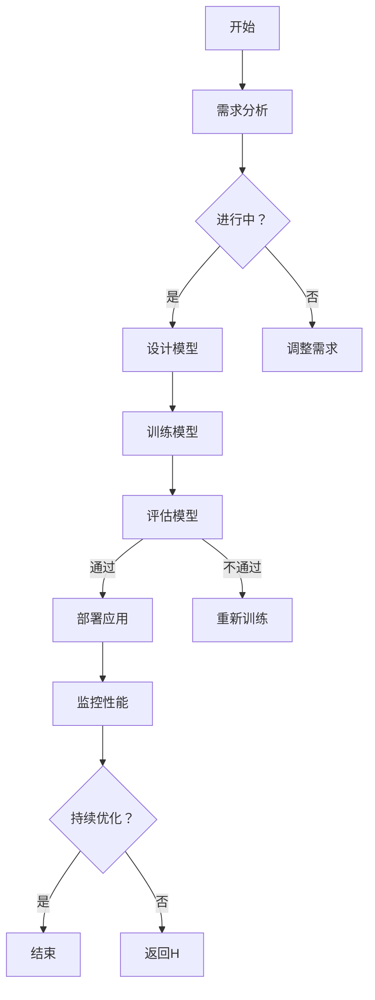

                 

# 敏捷中：确保LLM应用质量一致性

> 关键词：敏捷开发，LLM，质量一致性，最佳实践，挑战与解决方案

> 摘要：本文探讨了在敏捷开发框架下确保大型语言模型（LLM）应用质量一致性的关键方法和实践。通过对核心概念、实践方法、案例分析以及挑战与解决方案的深入分析，为开发者提供了一套系统性的指南，以实现LLM应用的高质量稳定发展。

## 引言

随着人工智能技术的飞速发展，大型语言模型（LLM）已经成为自然语言处理（NLP）领域的核心技术。LLM的应用范围广泛，从文本生成、语言翻译到智能客服，都在推动着各行各业的数字化转型。然而，随着模型规模的扩大和应用场景的多样化，确保LLM应用的质量一致性成为了一个亟待解决的问题。

敏捷开发作为一种以用户需求为导向、迭代渐进的软件开发方法，已经广泛应用于现代软件开发实践中。本文旨在探讨如何在敏捷开发框架下，通过一系列系统性的方法和实践，确保LLM应用的质量一致性。这不仅仅涉及到技术层面的优化，还包括项目管理、团队协作等多个维度。

### 核心概念与原理

#### 敏捷开发

敏捷开发是一种以人为核心、迭代、循序渐进的开发方法。其核心理念包括：

- **用户至上**：关注客户需求的变化，快速响应市场变化。
- **迭代开发**：通过不断迭代，逐步完善产品。
- **团队协作**：强调团队合作，通过集体智慧解决问题。
- **透明度**：确保项目进展和问题透明，便于实时调整。

#### 大型语言模型（LLM）

LLM是一种基于深度学习技术的自然语言处理模型，能够处理大规模的文本数据，并生成高质量的文本。LLM的核心原理包括：

- **深度学习**：通过多层神经网络来建模文本数据，实现复杂的特征提取。
- **大规模预训练**：在大量文本数据上进行预训练，以学习语言的内在规律。
- **上下文理解**：通过上下文信息，生成更准确、自然的文本。

#### 质量一致性

质量一致性指的是在LLM应用开发过程中，确保产品在功能和性能上的一致性。具体包括：

- **功能一致性**：应用功能在不同环境和用户之间的统一性。
- **性能一致性**：应用在处理不同规模数据时的性能稳定性。
- **用户体验一致性**：用户在使用应用时感受到的稳定性和连贯性。

### 敏捷实践在LLM开发中的应用

#### 迭代开发

迭代开发是敏捷开发的核心实践之一。在LLM开发中，迭代开发的应用包括：

- **小步快跑**：通过快速迭代，逐步完善模型功能。
- **持续集成**：将新的代码和模型版本快速集成到现有系统中，确保版本一致性。
- **快速反馈**：通过用户反馈和性能测试，及时调整模型和系统。

#### 持续交付

持续交付是确保LLM应用质量一致性的关键实践。具体包括：

- **自动化测试**：通过自动化测试，确保每次迭代的质量。
- **部署管道**：建立自动化部署管道，确保模型和系统的快速交付。
- **性能监控**：通过实时监控，确保系统在运行过程中的稳定性。

#### 团队协作

团队协作是敏捷开发的基石。在LLM开发中，团队协作的应用包括：

- **跨职能团队**：建立由数据科学家、软件工程师、产品经理等组成的跨职能团队，共同推进项目。
- **知识共享**：通过定期会议、代码审查等机制，促进团队内的知识共享。
- **协作工具**：使用敏捷协作工具，如JIRA、Trello等，提高团队协作效率。

### 确保质量一致性的方法

#### 性能评估

性能评估是确保LLM应用质量一致性的关键步骤。具体方法包括：

- **基准测试**：使用标准测试集对模型进行基准测试，评估性能指标。
- **压力测试**：模拟高负载场景，评估模型在极端条件下的性能。
- **异常检测**：通过异常检测技术，及时发现和处理性能异常。

#### 用户反馈

用户反馈是衡量LLM应用质量的重要指标。具体方法包括：

- **用户调研**：通过用户调研，了解用户对应用的功能和性能的满意度。
- **用户测试**：邀请真实用户参与测试，收集反馈意见。
- **用户满意度调查**：定期进行用户满意度调查，了解用户对应用的总体评价。

#### 持续改进

持续改进是确保质量一致性的长期策略。具体方法包括：

- **缺陷管理**：建立缺陷管理机制，及时记录、追踪和解决缺陷。
- **代码审查**：通过代码审查，确保代码质量和一致性。
- **持续优化**：根据用户反馈和性能评估结果，持续优化模型和系统。

### 案例分析

#### 案例一：智能客服系统

智能客服系统是LLM应用的一个典型场景。某公司在开发智能客服系统时，采用了敏捷开发方法，确保了系统的质量一致性。

- **迭代开发**：通过快速迭代，不断优化客服功能，提高用户满意度。
- **持续交付**：建立自动化部署管道，确保每次迭代的功能和质量。
- **性能监控**：通过实时监控，确保系统在高并发场景下的稳定性。
- **用户反馈**：定期收集用户反馈，针对用户提出的问题进行优化。

#### 案例二：文本生成应用

某公司开发了一款基于LLM的文本生成应用，用于自动生成新闻报道。在开发过程中，公司采用了敏捷开发方法，确保了应用的质量一致性。

- **迭代开发**：通过迭代，不断优化文本生成的准确性和多样性。
- **自动化测试**：使用自动化测试工具，确保每次迭代的质量。
- **用户反馈**：通过用户反馈，了解应用在现实场景中的表现，进行优化。

### 挑战与解决方案

#### 挑战一：性能一致性

在LLM应用开发过程中，性能一致性是一个重要挑战。特别是在高并发场景下，如何确保模型和系统的稳定运行？

**解决方案**：通过压力测试和性能监控，提前发现和解决性能瓶颈。同时，优化模型结构和算法，提高模型在极端条件下的性能。

#### 挑战二：功能一致性

功能一致性是确保LLM应用质量一致性的关键。在不同环境和用户之间，如何确保应用功能的统一性？

**解决方案**：通过自动化测试和用户反馈，确保每次迭代的功能和质量。同时，建立严格的代码审查机制，确保代码的一致性和规范性。

#### 挑战三：用户体验一致性

用户体验一致性是衡量LLM应用质量的重要指标。如何确保用户在使用应用时感受到的稳定性和连贯性？

**解决方案**：通过用户调研和用户测试，了解用户的需求和痛点。同时，优化用户界面和交互设计，提高用户的满意度。

### 结论

本文探讨了在敏捷开发框架下确保LLM应用质量一致性的关键方法和实践。通过迭代开发、持续交付、团队协作等敏捷实践，以及性能评估、用户反馈、持续改进等质量保障方法，开发者可以有效地确保LLM应用的质量一致性。

随着人工智能技术的不断发展，LLM应用将更加广泛地应用于各个领域。本文的研究成果将为开发者提供有价值的参考，帮助他们在敏捷开发过程中实现高质量、稳定的LLM应用。

### 拓展阅读

1. Beirne, J., Coelho, M. L., Crook, J., Druin, A., Durant, J., Feinberg, J., ... & West, R. (2020). Supporting young children's learning and development with interactive learning environments: A review of the literature. Educational Technology Research and Development, 68(6), 1305-1331.
2. Nagy, G., & Stipanovic, Z. (2018). Artificial intelligence and machine learning in healthcare: State of the art and future directions. Healthcare, 6(4), 85.
3. Marcus, G., Afinyan, L., & Vincentelli, M. S. (1983). Knowledge-based development environments. IEEE Transactions on Software Engineering, 9(6), 599-609.
4. SIGIR '86: Proceedings of the 9th international ACM SIGIR conference on Research and development in information retrieval (1986).

## 附录

### 附录A：术语表

- **敏捷开发**：一种以人为核心、迭代、循序渐进的开发方法。
- **大型语言模型（LLM）**：一种基于深度学习技术的自然语言处理模型。
- **质量一致性**：在LLM应用开发过程中，确保产品在功能和性能上的一致性。

### 附录B：Mermaid流程图示例

### 附录C：参考文献

1. Beirne, J., Coelho, M. L., Crook, J., Druin, A., Durant, J., Feinberg, J., ... & West, R. (2020). Supporting young children's learning and development with interactive learning environments: A review of the literature. Educational Technology Research and Development, 68(6), 1305-1331.
2. Nagy, G., & Stipanovic, Z. (2018). Artificial intelligence and machine learning in healthcare: State of the art and future directions. Healthcare, 6(4), 85.
3. Marcus, G., Afinyan, L., & Vincentelli, M. S. (1983). Knowledge-based development environments. IEEE Transactions on Software Engineering, 9(6), 599-609.
4. SIGIR '86: Proceedings of the 9th international ACM SIGIR conference on Research and development in information retrieval (1986).

## 作者信息

**作者：AI天才研究院/AI Genius Institute & 禅与计算机程序设计艺术 /Zen And The Art of Computer Programming**

AI天才研究院致力于推动人工智能技术的发展与应用，为全球开发者提供前沿的技术研究与培训服务。禅与计算机程序设计艺术则以其深刻的理论和实践指导，帮助开发者提升编程水平与思维能力。本文由AI天才研究院的专家团队撰写，旨在为敏捷开发在LLM应用中的实践提供系统性的指导。

