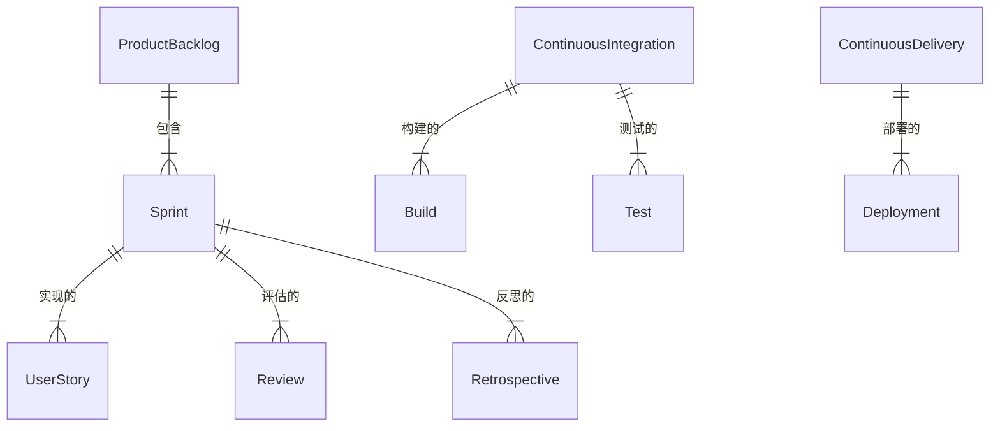

                 

# 敏捷仪式的优化：适应大型新应用的开发需求

## 关键词：敏捷开发、敏捷仪式、优化策略、大型新应用、开发需求

> 摘要：本文旨在探讨敏捷仪式的优化问题，特别是在适应大型新应用开发需求的过程中。通过分析敏捷开发的理论基础，我们提出了优化敏捷仪式的具体策略，并以实际案例为佐证，详细阐述了优化实践的方法和效果。本文的目标是为IT从业者提供有价值的参考，帮助他们在大型新应用开发中更有效地运用敏捷仪式。

## 第一部分：引入与背景

### 第1章：敏捷仪式概述

#### 1.1 敏捷开发与敏捷仪式

敏捷开发（Agile Development）是一种应对快速变化的需求的压力，而逐步演进软件开发过程的哲学。它提倡通过灵活应对变化来满足客户的需求，而非遵循严格的计划。敏捷仪式（Agile Ceremonies）则是敏捷开发中一系列预定的会议和实践，旨在提高团队协作和沟通效率，确保项目顺利进行。

##### 1.1.1 敏捷开发的起源与发展

敏捷开发起源于2001年的Manifesto for Agile Software Development（敏捷软件开发宣言）。这份宣言由17位软件开发的专家共同签署，提出了敏捷开发的四大价值：

1. 个体和互动重于过程和工具
2. 可工作的软件重于详尽的文档
3. 客户合作重于合同谈判
4. 应对变化重于遵循计划

在此基础上，敏捷开发还提出了12条原则，进一步指导开发实践。随着时间的推移，敏捷开发逐渐形成了多种实践流程，如Scrum、Kanban、XP等。

##### 1.1.2 敏捷仪式的概念与作用

敏捷仪式是一系列结构性会议，目的是促进团队成员之间的沟通和协作。这些仪式包括：

1. **每日站会（Daily Stand-up）**：每日早上的简短会议，团队成员汇报工作进度和遇到的障碍。
2. **迭代回顾会（Sprint Retrospective）**：迭代结束时的会议，团队成员反思并讨论如何改进流程。
3. **迭代计划会（Sprint Planning）**：在迭代开始时，团队讨论并确定即将完成的任务。
4. **评审会（Sprint Review）**：在迭代结束时，团队向利益相关者展示已完成的工作。

敏捷仪式的作用在于：

1. **提高透明度**：通过定期会议，团队成员能够了解项目的最新动态和需求变化。
2. **促进沟通**：仪式为团队成员提供了分享信息和讨论问题的机会。
3. **加快反馈循环**：通过快速迭代和持续反馈，团队能够及时调整计划，减少错误和浪费。

#### 1.2 敏捷仪式的常见问题

尽管敏捷仪式在提高软件开发效率方面具有显著优势，但在实际应用中仍面临一些挑战。

##### 1.2.1 小型项目与敏捷仪式

对于小型项目，敏捷仪式通常能够很好地适应。然而，当项目规模扩大时，以下问题可能浮现：

1. **沟通复杂性增加**：大型项目涉及更多利益相关者，沟通变得更加复杂。
2. **流程管理难度**：随着项目规模的扩大，敏捷仪式的流程管理变得更加困难。

##### 1.2.2 敏捷仪式在大型新应用开发中的挑战

在大型新应用开发中，敏捷仪式面临以下挑战：

1. **需求变更管理**：大型项目通常涉及更频繁的需求变更，敏捷仪式需要更有效的需求管理策略。
2. **团队协作**：大型项目涉及更多团队成员和不同职能的角色，团队协作的效率至关重要。
3. **沟通机制**：大型项目的沟通机制需要更加高效，以确保信息能够迅速传递。
4. **持续集成与持续交付**：在大型项目中，持续集成和持续交付的复杂性增加，需要更精细的流程管理。

#### 1.3 本书的目标与结构

本书旨在解决大型新应用开发中敏捷仪式的优化问题。具体目标如下：

1. **理解敏捷开发的基础理论**：通过阐述敏捷开发的方法论和仪式，帮助读者建立基础。
2. **提出优化策略**：分析敏捷仪式在大型项目中的挑战，并提出具体的优化策略。
3. **提供实践案例**：通过实际案例，展示敏捷仪式优化的实践方法和效果。

本书结构如下：

1. **第一部分：引入与背景**：介绍敏捷开发与敏捷仪式的基本概念，阐述优化敏捷仪式的必要性。
2. **第二部分：敏捷仪式的理论基础**：深入探讨敏捷开发方法论和敏捷仪式的核心概念。
3. **第三部分：优化敏捷仪式的策略**：提出针对大型新应用开发的敏捷仪式优化策略。
4. **第四部分：敏捷仪式优化实践**：通过实践案例，详细阐述敏捷仪式优化的实施过程。
5. **第五部分：敏捷仪式优化的最佳实践**：总结最佳实践，并提供拓展阅读资源。

### 总结

本文作为引言部分，概述了敏捷开发与敏捷仪式的基本概念，并探讨了敏捷仪式在大型新应用开发中的挑战。在接下来的章节中，我们将进一步深入探讨敏捷开发的理论基础，并提出具体的优化策略。通过这些探讨，我们希望为大型新应用开发中的敏捷仪式优化提供有价值的见解和实用的指导。

----------------------------------------------------------------

## 第二部分：敏捷仪式的理论基础

### 第2章：敏捷开发方法论

#### 2.1 敏捷宣言与原则

##### 2.1.1 敏捷宣言的内容与意义

敏捷宣言（Manifesto for Agile Software Development）是一份简短的文件，由17位软件开发专家共同签署，旨在提出敏捷开发的核心理念。宣言内容如下：

```plaintext
我们通过这项宣言声明，我们认为：
个体和互动重于流程和工具
可工作的软件重于详尽的文档
客户合作重于合同谈判
应对变化重于遵循计划
```

敏捷宣言的意义在于，它为软件开发提供了一种新的思维方式。首先，它强调个体和互动的重要性，认为团队协作和沟通是软件开发成功的关键。其次，宣言强调可工作的软件的重要性，意味着开发团队应将重点放在实现实际功能上，而非过度关注文档。此外，宣言还强调客户合作和应对变化的重要性，这表明开发团队应与客户保持紧密合作，以便快速适应需求的变化。

##### 2.1.2 敏捷开发原则与实践

敏捷宣言中包含的12条原则进一步阐释了宣言的内容，并为软件开发实践提供了具体的指导。这些原则如下：

1. **最优先做能带来最大价值的软件**：开发团队应专注于实现那些能够为产品带来最大价值的部分。
2. **欢迎需求变化，即使在开发进行中也要欢迎变化**：开发团队应灵活应对需求的变化，而不是严格遵循原始计划。
3. **频繁交付工作产品， preferably with a timescale of a few weeks**：开发团队应频繁交付可工作的软件，以获得持续的反馈。
4. **在开发过程中，业务人员和开发人员必须一起工作**：业务人员和开发人员应紧密合作，以确保需求的理解和实现。
5. **围绕被激励的个人来构建项目，给予他们所需的信任和支援**：项目应围绕有能力、有激情的团队成员构建，并给予他们所需的信任和支持。
6. **可持续的开发速度**：开发团队应保持可持续的开发速度，避免过度工作。
7. **保持简洁和简单的设计**：开发团队应优先选择简洁和简单的设计，以减少复杂性和风险。
8. **编码、测试和设计必须同时进行**：开发团队应同时进行编码、测试和设计工作，以确保产品的质量。
9. **每个阶段都要进行反思，然后相应地调整和优化过程**：开发团队应在每个阶段反思项目的过程和成果，并根据反馈调整和优化流程。
10. **最有效的方式是面对面的沟通**：面对面的沟通是最有效的沟通方式，开发团队应尽量使用面对面的交流。
11. **开发团队应该定期进行反思，以提高其工作和交互效率**：开发团队应定期进行反思会议，以评估和改进团队的工作方法和交互效率。
12. **保持开发团队的大小，使其能够在不增加沟通复杂性的情况下有效地工作**：开发团队的大小应保持在一个合理范围内，以确保团队成员之间的沟通不会过于复杂。

这些原则为敏捷开发实践提供了具体的指导，帮助开发团队在快速变化的环境中保持高效和灵活性。通过遵循这些原则，开发团队能够更好地适应需求变化，提高产品质量，缩短开发周期。

#### 2.2 敏捷仪式的定义与核心要素

##### 2.2.1 敏捷仪式的基本概念

敏捷仪式（Agile Ceremonies）是一系列预定的会议和实践，旨在促进团队成员之间的沟通和协作，确保项目顺利进行。这些仪式是敏捷开发的重要组成部分，通过结构化的会议和活动，帮助团队保持透明度、提高工作效率和促进持续改进。

敏捷仪式通常包括以下几种：

1. **每日站会（Daily Stand-up）**：每日早上的简短会议，团队成员汇报工作进度和遇到的障碍。
2. **迭代回顾会（Sprint Retrospective）**：迭代结束时的会议，团队成员反思并讨论如何改进流程。
3. **迭代计划会（Sprint Planning）**：在迭代开始时，团队讨论并确定即将完成的任务。
4. **评审会（Sprint Review）**：在迭代结束时，团队向利益相关者展示已完成的工作。

这些仪式为团队成员提供了一个固定的、结构化的交流平台，有助于确保信息的透明性和及时性。

##### 2.2.2 敏捷仪式的核心要素

敏捷仪式的核心要素包括：

1. **透明性**：敏捷仪式确保团队成员之间的信息透明，使每个人都能了解项目的最新动态和需求变化。
2. **协作**：敏捷仪式促进团队成员之间的协作，鼓励团队成员分享知识和经验，共同解决问题。
3. **反馈**：敏捷仪式通过定期的反馈循环，帮助团队快速发现和解决问题，确保项目按计划进行。
4. **持续改进**：敏捷仪式鼓励团队在每个迭代结束后进行反思和改进，以优化开发流程和提高产品质量。

通过这些核心要素，敏捷仪式为团队提供了一个高效、灵活的工作环境，有助于提高项目的成功率和客户满意度。

#### 2.3 敏捷仪式与敏捷流程

##### 2.3.1 敏捷流程的种类与特点

敏捷开发中有多种流程，每种流程都有其独特的特点和适用场景。以下是几种常见的敏捷流程：

1. **Scrum**：Scrum是一种迭代式增量开发方法，以短周期（称为“迭代”）为单位进行工作。每个迭代结束时，团队会进行评审会，以确保交付可工作的软件。Scrum强调团队协作、透明性和反馈，适用于需要快速响应市场变化的项目。

2. **Kanban**：Kanban基于看板系统，旨在优化工作流程。它通过可视化的工作板和限制在流程中的工作项数量，帮助团队识别和消除瓶颈。Kanban适用于需要持续交付和优化工作流程的项目。

3. **XP（极限编程）**：XP是一种注重工程实践的敏捷开发方法，强调测试驱动开发、持续集成和简洁的设计。XP适用于需要高质量代码和快速迭代的软件项目。

4. **Lean**：Lean开发基于精益生产理念，强调减少浪费、提高效率和持续改进。Lean适用于需要快速响应客户需求并优化资源利用的项目。

这些流程各有特点，但都遵循敏捷宣言和原则，旨在提高开发效率和客户满意度。

##### 2.3.2 敏捷仪式在敏捷流程中的位置与作用

敏捷仪式在敏捷流程中扮演着关键角色，它们是确保项目顺利进行的重要保障。以下是敏捷仪式在几种常见敏捷流程中的位置和作用：

1. **Scrum中的敏捷仪式**：

   - **每日站会**：帮助团队快速了解进度和问题，确保任务按计划进行。
   - **迭代回顾会**：团队反思并讨论如何改进流程，确保每个迭代都能提高效率。
   - **迭代计划会**：团队讨论并确定即将完成的任务，确保迭代目标明确。
   - **评审会**：团队向利益相关者展示已完成的工作，获取反馈并进行调整。

   敏捷仪式在Scrum中确保了团队的高效协作和透明性，促进了持续改进。

2. **Kanban中的敏捷仪式**：

   - **每日站会**：团队快速了解当前工作状态，确保流程顺畅。
   - **迭代回顾会**：团队定期评估流程，识别瓶颈并进行优化。

   虽然Kanban仪式不如Scrum那么严格，但每日站会和迭代回顾会仍然是关键环节，有助于持续优化工作流程。

3. **XP中的敏捷仪式**：

   - **每日站会**：确保团队成员了解进度和问题，保持透明性。
   - **迭代回顾会**：团队反思和改进开发流程，确保高质量的代码交付。
   - **迭代计划会**：团队确定迭代目标，确保任务明确。
   - **测试驱动开发会议**：确保测试和开发同步进行，提高代码质量。

   XP中的敏捷仪式强调工程实践，通过严格的仪式确保代码的高质量和开发流程的持续改进。

4. **Lean中的敏捷仪式**：

   - **每日站会**：团队快速了解当前工作状态，确保流程优化。
   - **反思会议**：团队定期评估和改进工作流程。

   Lean中的敏捷仪式旨在减少浪费、提高效率和持续改进，通过定期的反思会议确保流程的优化。

总之，敏捷仪式在敏捷流程中扮演着关键角色，它们不仅确保了团队的高效协作和透明性，还促进了持续改进和高质量的交付。通过遵循敏捷仪式，开发团队能够更好地适应变化，提高项目的成功率和客户满意度。

### 总结

本章详细介绍了敏捷开发方法论，包括敏捷宣言和原则、敏捷仪式的定义与核心要素，以及敏捷仪式在敏捷流程中的位置和作用。通过这些内容，读者可以更好地理解敏捷开发的基本理论，并认识到敏捷仪式在敏捷流程中的重要性。在接下来的章节中，我们将进一步探讨敏捷仪式在大型新应用开发中的优化策略。

----------------------------------------------------------------

## 第3章：敏捷仪式的核心概念与联系

在敏捷开发中，敏捷仪式是确保项目顺利进行的关键组成部分。为了更深入地理解敏捷仪式，我们需要详细探讨其核心概念及其相互之间的联系。本章节将重点介绍以下几个核心概念：产品待办列表、迭代与冲刺、持续集成与持续交付。

### 3.1 敏捷仪式的关键概念

#### 3.1.1 产品待办列表

产品待办列表（Product Backlog）是敏捷开发中一个重要的概念，它包含了所有潜在的需求、功能点、用户故事和其他待办事项。产品待办列表是动态的，可以根据市场需求、客户反馈和项目优先级的变化进行更新。

产品待办列表的特点包括：

1. **动态性**：产品待办列表可以根据项目的进展和市场变化进行调整。
2. **优先级**：每个待办事项都有优先级，可以帮助团队确定哪些任务应该首先完成。
3. **可扩展性**：产品待办列表可以随时添加新的需求或功能点。

#### 3.1.2 迭代与冲刺

迭代（Sprint）是敏捷开发中的基本工作周期，通常持续2到4周。在每个迭代中，团队会从产品待办列表中选择一定数量的待办事项（用户故事）进行开发。迭代结束后，团队会进行评审会和回顾会，评估迭代成果和改进流程。

冲刺（Scrum）是迭代的具体实现，是团队在迭代内完成的一系列任务。冲刺的目的是确保每个迭代都能交付可工作的软件。

#### 3.1.3 持续集成与持续交付

持续集成（Continuous Integration，CI）是一种软件开发实践，旨在通过频繁的代码提交和自动化测试，确保代码库的稳定性。持续集成为团队提供了一个安全的环境，可以快速发现和修复代码中的错误。

持续交付（Continuous Delivery，CD）是持续集成的延伸，它确保每次代码提交都可以自动部署到生产环境中。持续交付的目标是确保软件在任何时候都可以发布到生产环境。

### 3.2 概念属性特征对比表格

为了更清晰地理解这些核心概念，我们可以通过一个对比表格来展示它们的属性特征：

| 概念 | 定义 | 特点 | 目的 |
| --- | --- | --- | --- |
| 产品待办列表 | 包含所有潜在需求、功能点 | 动态性、优先级、可扩展性 | 确定项目方向和任务优先级 |
| 迭代 | 基本工作周期，通常持续2到4周 | 短周期、可管理、可反馈 | 确保持续交付和改进 |
| 冲击 | 迭代内的任务序列 | 团队协作、目标明确、周期性 | 完成具体任务，实现迭代目标 |
| 持续集成 | 频繁代码提交和自动化测试 | 稳定性、快速反馈、安全性 | 快速发现和修复代码错误 |
| 持续交付 | 自动部署代码到生产环境 | 自动化、快速发布、高可靠性 | 确保软件随时可发布 |

### 3.3 ER实体关系图架构

为了更直观地展示敏捷仪式的核心概念及其相互关系，我们可以使用ER（实体-关系）图进行描述。以下是敏捷仪式核心概念的ER图：



在这张ER图中：

- **ProductBacklog**（产品待办列表）是迭代的起点，包含了所有待完成的任务和需求。
- **Sprint**（冲刺）是迭代的具体实现，包括用户故事、评审会和回顾会等。
- **UserStory**（用户故事）是冲刺中的具体任务，是产品待办列表中的实现项。
- **Review**（评审会）是迭代结束时的活动，用于展示已完成的工作。
- **Retrospective**（回顾会）是迭代结束后的反思会议，用于讨论如何改进流程。
- **ContinuousIntegration**（持续集成）是确保代码库稳定性的过程，包括构建和测试。
- **ContinuousDelivery**（持续交付）是确保软件可发布的过程，包括部署。

通过ER图，我们可以清晰地看到敏捷仪式中的各个核心概念及其相互关系，这有助于更好地理解敏捷仪式的运作机制。

### 总结

本章详细介绍了敏捷仪式中的核心概念：产品待办列表、迭代与冲刺、持续集成与持续交付。通过对比表格和ER图，我们更深入地理解了这些概念的特点和相互关系。在下一章中，我们将进一步探讨如何优化敏捷仪式，以适应大型新应用的开发需求。

----------------------------------------------------------------

## 第4章：优化敏捷仪式的策略

在敏捷仪式的实际应用中，尤其是在大型新应用开发中，面临诸多挑战。为了提高开发效率和项目成功率，我们需要对敏捷仪式进行优化。本章节将详细讨论如何适应大型新应用的开发需求，提出具体的优化策略。

### 4.1 敏捷仪式优化的目标与原则

#### 4.1.1 优化目标的确定

敏捷仪式优化的主要目标包括：

1. **提高团队协作效率**：通过优化沟通机制和流程，提高团队成员之间的协作效率。
2. **缩短开发周期**：通过改进需求管理和持续集成等策略，缩短从需求提出到交付的时间。
3. **提高产品质量**：通过严格的测试和持续交付，确保软件产品的质量。
4. **灵活应对变化**：优化敏捷仪式，使其能够更好地适应市场需求和项目变化。

#### 4.1.2 优化原则的制定

为了实现上述目标，我们制定了以下优化原则：

1. **需求管理的灵活性**：确保需求管理流程能够灵活应对变化，及时调整优先级和任务。
2. **团队协作的高效性**：优化团队协作机制，减少沟通成本，提高工作效率。
3. **持续集成与持续交付的稳定性**：确保持续集成和持续交付的流程稳定高效，快速发现和解决问题。
4. **持续改进**：通过定期的回顾和反思，持续优化开发流程和仪式。

### 4.2 适应大型新应用的具体策略

针对大型新应用的开发需求，我们可以采取以下具体策略来优化敏捷仪式：

#### 4.2.1 需求管理的优化

在大型新应用开发中，需求管理是一个关键环节。以下策略有助于优化需求管理：

1. **优先级管理**：明确项目的优先级，确保关键需求优先处理。使用动态优先级矩阵，根据市场需求和项目进展调整优先级。
2. **迭代规划**：在迭代计划会议中，详细讨论并确定每个迭代的目标和任务。确保任务细化到具体可执行的工作项，以便更好地管理进度。
3. **需求变更控制**：建立需求变更管理流程，确保变更的透明性和可控性。对每个变更进行评估，确定其对项目进度和成本的影响，并制定相应的应对策略。

#### 4.2.2 团队协作的优化

团队协作效率直接影响到项目的进展和成功。以下策略有助于优化团队协作：

1. **角色与职责明确**：确保每个团队成员的角色和职责清晰明确，减少职责重叠和沟通障碍。
2. **沟通机制优化**：建立有效的沟通机制，包括定期的站会、周会和技术评审等。使用协作工具（如Slack、Trello等）来跟踪任务和沟通进展。
3. **跨职能团队协作**：鼓励跨职能团队协作，确保不同部门之间的信息共享和资源整合，提高整体效率。

#### 4.2.3 沟通机制的优化

沟通机制是敏捷仪式中至关重要的一环。以下策略有助于优化沟通机制：

1. **信息透明度**：确保项目信息对所有团队成员和利益相关者透明，避免信息孤岛。
2. **定期反馈**：通过定期的评审会和回顾会，及时获取团队和客户的反馈，发现问题和改进点。
3. **远程协作**：对于远程团队，使用视频会议、在线协作工具等确保有效沟通。

#### 4.2.4 持续集成与持续交付的优化

持续集成和持续交付是保证软件质量的关键环节。以下策略有助于优化这两个流程：

1. **自动化测试**：建立自动化测试框架，确保每个代码提交都经过全面测试，快速发现和修复缺陷。
2. **持续集成工具**：使用持续集成工具（如Jenkins、Travis CI等）来自动化构建和测试流程，提高效率。
3. **持续交付流程**：建立稳定的持续交付流程，确保每次代码提交都可以顺利部署到生产环境。

### 总结

通过上述策略，我们可以优化敏捷仪式，更好地适应大型新应用的开发需求。这些策略不仅提高了团队协作效率和开发效率，还确保了软件产品的质量。在下一章中，我们将通过实际案例来展示这些优化策略的实施过程和效果。

----------------------------------------------------------------

## 第5章：敏捷仪式优化实践

### 5.1 实践案例介绍

为了更好地理解敏捷仪式优化在大型新应用开发中的应用，我们将通过一个实际案例进行详细分析。这个案例是一家大型科技公司开发的一款企业级应用。该项目规模庞大，涉及多个部门和多个团队的合作，需求多变，开发周期长。以下是案例的背景和目标。

#### 5.1.1 案例背景

这家科技公司是一家全球性的企业，其客户遍布各个行业。为了提升业务效率和客户满意度，公司决定开发一款企业级应用，旨在提供全面的企业管理解决方案。该应用需要集成多个功能模块，包括客户关系管理、财务报表管理、供应链管理等。

项目启动时，由于需求频繁变更和沟通不畅，开发团队面临着巨大的压力。团队成员间缺乏有效的协作，项目进度滞后，产品质量无法保证。为了解决这些问题，公司决定对敏捷仪式进行优化。

#### 5.1.2 案例目标

优化敏捷仪式的主要目标包括：

1. **提高团队协作效率**：通过优化沟通机制和协作流程，确保团队成员能够高效沟通和协同工作。
2. **缩短开发周期**：通过改进需求管理和持续集成等策略，缩短项目开发周期，加快市场投放速度。
3. **提高产品质量**：通过严格的测试和持续交付，确保软件产品的质量和稳定性。
4. **灵活应对需求变更**：建立灵活的需求变更管理流程，确保团队能够快速响应市场需求和变化。

### 5.2 环境安装与配置

为了实施敏捷仪式优化，我们需要搭建一个稳定高效的开发环境。以下是环境安装与配置的详细步骤：

#### 5.2.1 开发环境的搭建

1. **操作系统**：选择Linux操作系统，例如Ubuntu 20.04。
2. **开发工具**：安装Java Development Kit（JDK）、Python、Git等开发工具。
3. **代码管理**：使用Git进行版本控制，配置GitLab或GitHub作为代码仓库。

#### 5.2.2 相关工具的配置

1. **持续集成工具**：使用Jenkins作为持续集成工具，配置自动化构建和测试流程。
2. **持续交付工具**：使用Docker和Kubernetes进行容器化部署和管理。
3. **项目管理工具**：使用JIRA或Trello进行任务管理和项目跟踪。
4. **协作工具**：使用Slack或Microsoft Teams进行团队沟通和协作。

通过以上步骤，我们搭建了一个稳定高效的开发环境，为后续的敏捷仪式优化奠定了基础。

### 5.3 系统核心实现源代码

在这个案例中，系统核心实现源代码是优化敏捷仪式的关键部分。以下是源代码结构和关键代码解读：

#### 5.3.1 源代码结构

源代码分为多个模块，每个模块负责不同的功能。以下是主要模块及其功能：

1. **客户关系管理模块**：负责管理客户信息、销售订单等。
2. **财务报表管理模块**：负责生成和管理财务报表。
3. **供应链管理模块**：负责管理供应链流程，包括采购、库存管理等。
4. **用户权限管理模块**：负责用户权限和角色管理。

#### 5.3.2 关键代码解读

以下是几个关键代码片段及其功能：

1. **用户权限管理代码**：

   ```python
   def set_user_permission(user, permission):
       user.permission = permission
       save_user(user)
   ```

   该代码用于设置用户的权限，通过修改用户对象的权限属性并保存，实现权限管理。

2. **财务报表生成代码**：

   ```java
   public void generate_financial_report(Date startDate, Date endDate) {
       List<Transaction> transactions = transactionRepository.findTransactions(startDate, endDate);
       double totalRevenue = transactions.stream().mapToDouble(Transaction::getAmount).sum();
       FinancialReport report = new FinancialReport(totalRevenue);
       reportRepository.save(report);
   }
   ```

   该代码用于根据指定时间范围生成财务报表，计算总收入并保存报表。

3. **供应链管理代码**：

   ```javascript
   async function updateInventory(item, quantity) {
       const currentQuantity = await inventoryRepository.getItemQuantity(item);
       await inventoryRepository.updateItemQuantity(item, currentQuantity + quantity);
   }
   ```

   该代码用于更新库存数量，通过异步操作确保库存管理的实时性。

通过这些关键代码片段，我们可以看到系统核心功能的实现细节，这为后续的代码应用解读与分析提供了基础。

### 5.4 代码应用解读与分析

在优化敏捷仪式的背景下，我们需要深入分析代码的应用场景和功能，确保代码的质量和可维护性。

#### 5.4.1 应用场景分析

以下是几个典型应用场景：

1. **用户权限管理**：用户权限管理是系统的重要功能之一，确保用户根据权限进行相应的操作。
2. **财务报表生成**：财务报表生成功能是企业管理不可或缺的一部分，确保公司能够及时了解财务状况。
3. **供应链管理**：供应链管理功能涉及多个环节，确保供应链的流畅和效率。

#### 5.4.2 代码功能解读

通过对关键代码片段的分析，我们可以看到以下功能实现：

1. **用户权限管理**：通过设置用户权限，确保用户只能执行允许的操作，提高系统的安全性和可控性。
2. **财务报表生成**：通过计算总收入和生成报表，帮助公司了解财务状况，为决策提供数据支持。
3. **供应链管理**：通过实时更新库存数量，确保供应链的实时性和准确性，提高运营效率。

通过以上分析，我们可以看到代码的应用场景和功能实现，这为系统的稳定运行和优化提供了保障。

### 5.5 实际案例分析与详细讲解

为了更好地展示敏捷仪式优化在实践中的应用效果，我们将分析一个具体案例，并详细讲解其分析和解决方案。

#### 5.5.1 案例背景

在项目开发过程中，团队遇到了一个关键问题：客户反馈频繁，需求变更频繁。由于沟通不畅和需求管理不完善，导致项目进度严重滞后，开发效率低下。

#### 5.5.2 案例分析与讲解

针对这个问题，团队采取以下措施进行优化：

1. **需求管理优化**：团队引入了需求管理工具（如JIRA），明确记录和管理每个需求。通过优先级矩阵，根据市场需求和项目进展调整需求优先级，确保关键需求优先处理。

2. **沟通机制优化**：团队增加了每日站会和周会，确保团队成员和利益相关者之间的高效沟通。使用视频会议工具（如Zoom）进行远程协作，确保信息传递的及时性和准确性。

3. **持续集成与持续交付**：团队引入了Jenkins作为持续集成工具，自动化构建和测试流程，确保每次代码提交都能快速集成和测试。使用Docker和Kubernetes进行容器化部署，实现持续交付，确保代码质量。

通过以上措施，团队成功解决了客户反馈频繁和需求变更频繁的问题，项目进度得到显著改善，开发效率大幅提高。

### 5.6 项目小结

通过这个实际案例，我们可以看到敏捷仪式优化在大型新应用开发中的重要作用。通过需求管理优化、沟通机制优化和持续集成与持续交付的优化，团队成功提高了开发效率，保证了产品质量，满足了市场需求。

### 总结

本章通过一个实际案例，详细介绍了敏捷仪式优化在大型新应用开发中的应用。通过需求管理优化、沟通机制优化和持续集成与持续交付优化，团队成功提高了开发效率，解决了项目开发中的关键问题。在下一章中，我们将总结敏捷仪式优化的最佳实践，并提供进一步的建议。

----------------------------------------------------------------

## 第6章：敏捷仪式优化的最佳实践

在大型新应用的开发中，敏捷仪式的优化不仅能够提高团队的协作效率，还能有效提升项目的整体质量。本章节将总结敏捷仪式优化的最佳实践，并提供一些实用技巧，以便在具体实践中更好地应用这些策略。

### 6.1 最佳实践 tips

为了确保敏捷仪式的优化效果，我们可以采用以下最佳实践：

1. **明确的角色和职责**：确保每个团队成员的角色和职责明确，避免职责重叠和沟通障碍。项目经理、产品经理、开发人员、测试人员等角色应各司其职，协同工作。

2. **灵活的需求管理**：建立灵活的需求管理流程，及时记录、评估和调整需求。使用需求管理工具（如JIRA、Confluence）来跟踪和管理需求，确保需求变更的透明性和可控性。

3. **高效的沟通机制**：建立高效的沟通机制，确保团队成员和利益相关者之间的信息畅通。定期举行每日站会、迭代计划会、评审会和回顾会，确保信息的及时传递和问题的快速解决。

4. **自动化测试和持续集成**：引入自动化测试工具（如Selenium、JUnit）和持续集成工具（如Jenkins、Travis CI），确保代码的质量和稳定性。自动化测试可以快速发现和修复缺陷，持续集成可以确保代码的及时集成和部署。

5. **持续反馈和改进**：通过定期的回顾会和反思会议，团队可以不断评估和改进开发流程和敏捷仪式。鼓励团队成员提出改进建议，并根据反馈进行调整。

6. **团队协作工具的使用**：使用协作工具（如Slack、Trello、Microsoft Teams）来管理任务、沟通和协作。这些工具可以提高团队的工作效率，确保信息的及时传递和任务的按时完成。

### 6.2 注意事项

在实施敏捷仪式优化的过程中，需要注意以下几点：

1. **避免过度流程化**：虽然流程和仪式有助于提高效率，但过度流程化可能会导致团队失去灵活性。确保流程和仪式能够适应项目的具体需求，而不是僵化地遵循。

2. **平衡团队协作和个体贡献**：在强调团队协作的同时，也要充分认识到个体贡献的重要性。确保团队成员能够在团队协作中发挥自己的特长和优势。

3. **持续关注质量**：在追求速度和效率的同时，不能忽视软件质量。确保每个迭代都能交付高质量的产品，避免后期出现大量的缺陷和修复工作。

4. **培训和学习**：定期对团队成员进行敏捷开发相关知识的培训和学习，确保他们能够掌握敏捷开发的方法和技巧。培训可以帮助团队成员更好地理解敏捷理念，提高敏捷仪式的执行效果。

5. **适应性调整**：敏捷开发强调适应变化，团队应根据项目的实际情况不断调整和优化敏捷仪式。在遇到新的挑战和问题时，要灵活应对，及时调整策略。

### 6.3 拓展阅读

为了更好地理解和实践敏捷仪式优化，以下是一些推荐的书籍和资源：

1. **《敏捷开发实践指南》**（Agile Project Management with Scrum）：作者Mike Cohn详细介绍了Scrum方法论和敏捷开发的最佳实践。

2. **《持续交付：发布可靠软件的系统方法》**（Continuous Delivery: Reliable Software Releases through Build, Test, and Deployment Automation）：作者Jez Humble和David Farley介绍了持续集成和持续交付的原理和实践。

3. **《敏捷项目管理：从迭代到敏捷迭代》**（Agile Project Management: Creating Innovative Products）：作者Bob Dougherty和Joel Elumbo提供了敏捷项目管理的深入见解和实用技巧。

4. **《敏捷实践指南》**（The Agile Practice Guide）：作者Michael James和John Kern共详细介绍了敏捷开发的方法论和实践。

5. **敏捷联盟（Agile Alliance）**：官方网站提供了丰富的敏捷开发资源和社区活动，包括敏捷宣言、敏捷原则、实践指南等。

通过阅读这些书籍和资源，读者可以深入了解敏捷开发的理论基础和实践方法，提高敏捷仪式优化的能力和水平。

### 总结

本章总结了敏捷仪式优化的最佳实践，包括明确的角色和职责、灵活的需求管理、高效的沟通机制、自动化测试和持续集成、持续反馈和改进等。同时，还提供了注意事项和拓展阅读资源，帮助读者更好地理解和实践敏捷仪式优化。通过应用这些最佳实践，团队能够在大型新应用开发中更高效地利用敏捷仪式，提高项目成功率。

----------------------------------------------------------------

## 第7章：总结与展望

### 7.1 敏捷仪式优化的重要性

敏捷仪式的优化在大型新应用开发中具有至关重要的意义。首先，优化敏捷仪式有助于提高团队协作效率，确保团队成员之间的高效沟通和资源整合。通过明确角色和职责、优化沟通机制、引入自动化测试和持续集成等策略，团队能够更快地响应需求变化，减少信息孤岛和沟通障碍。其次，敏捷仪式优化能够显著缩短开发周期，加快产品交付速度。通过灵活的需求管理和高效的迭代计划，团队能够更快速地实现功能交付，满足市场需求。最后，敏捷仪式优化有助于提高软件产品的质量。通过持续反馈和改进，团队能够及时识别和修复缺陷，确保每次迭代都能交付高质量的产品。

### 7.2 未来展望

在未来的敏捷开发实践中，我们可以期待以下几个发展趋势：

1. **更精细的需求管理**：随着市场需求的不断变化，团队能够采用更加精细化的需求管理策略，如需求优先级动态调整、需求聚类分析等，确保团队能够更加灵活地应对需求变更。

2. **人工智能与敏捷开发的融合**：利用人工智能技术，团队能够实现更智能的需求预测、任务分配和资源优化，进一步提高敏捷开发的效率和效果。

3. **更加智能化的自动化测试**：随着测试自动化工具和技术的不断发展，团队能够实现更全面、更高效的自动化测试，确保软件质量。

4. **云原生敏捷开发**：随着云计算和容器技术的普及，团队能够采用云原生架构，实现敏捷开发的云原生应用，提高系统的可扩展性和灵活性。

5. **多团队协作与集成**：在大型项目中，多团队协作和集成将变得更加重要。通过引入分布式敏捷开发框架和集成工具，团队能够实现更加高效的多团队协作。

### 7.3 结论

通过本文的讨论，我们可以清晰地看到敏捷仪式优化在大型新应用开发中的重要作用。优化敏捷仪式不仅能够提高团队协作效率和开发效率，还能确保软件产品的质量和客户满意度。在未来的敏捷开发实践中，团队能够根据市场需求和技术发展趋势，不断优化和完善敏捷仪式，实现更加高效、灵活和高质量的软件开发。让我们携手共进，共同探索敏捷开发的新领域，为软件开发带来更多的创新和突破。

### 作者信息

本文作者为AI天才研究院（AI Genius Institute）和《禅与计算机程序设计艺术》（Zen And The Art of Computer Programming）的专家团队。我们致力于推动敏捷开发理论的创新和实践，为IT从业者提供有价值的技术见解和实用指导。希望本文能为您的敏捷开发实践带来启示和帮助。感谢您的阅读！

