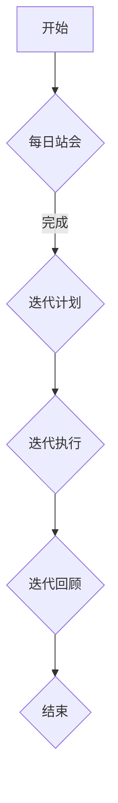
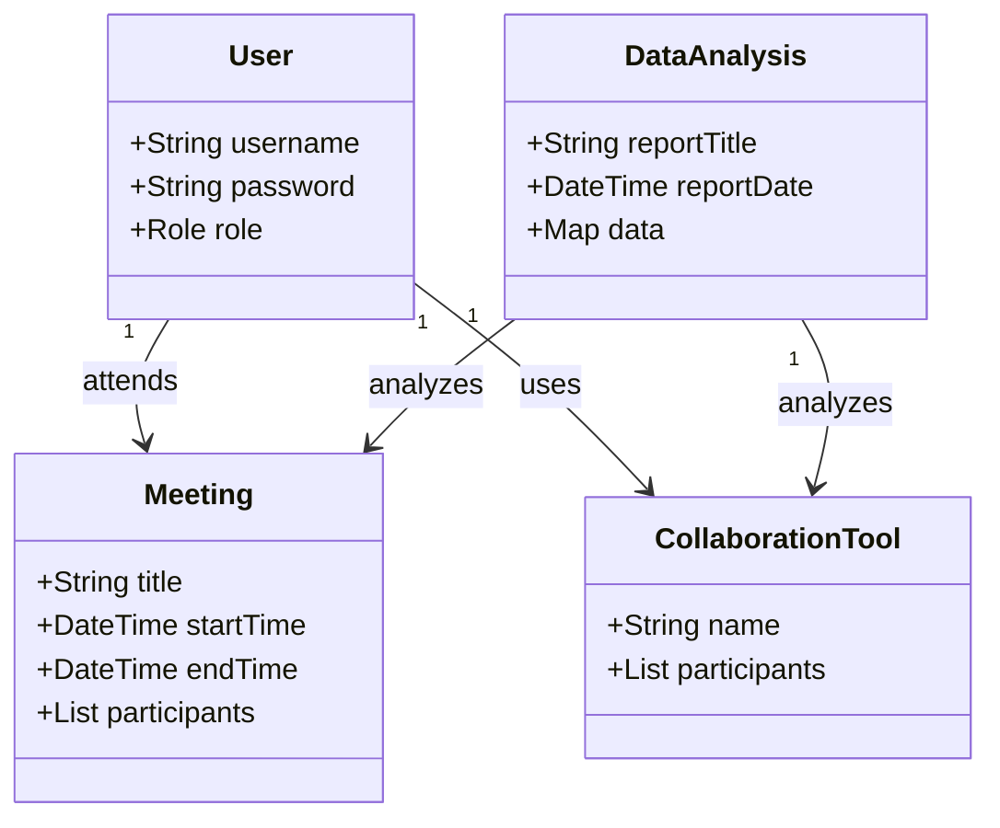

                 

## 敏捷仪式的远程化：适应分布式开发团队需求

### 关键词：敏捷开发、远程工作、分布式团队、系统设计、算法原理、数学模型

> 摘要：随着远程工作和分布式团队在全球范围内的普及，如何将传统的敏捷仪式有效地应用于远程环境中成为了一个重要课题。本文将探讨敏捷仪式的远程化问题，分析其面临的挑战和解决方案，旨在为分布式开发团队提供一套实用的指导策略，帮助团队更好地适应远程工作环境。

### 目录大纲设计思路

为了系统地探讨敏捷仪式的远程化问题，本文将采用逻辑清晰、结构紧凑、简单易懂的编写方式，具体目录大纲如下：

#### 第1章：引言
- **1.1 问题背景**：介绍远程化工作的兴起，以及敏捷仪式在分布式开发团队中的重要性。
- **1.2 问题描述**：阐述远程化敏捷仪式面临的挑战。
- **1.3 问题解决**：简要介绍本文如何解决这些问题。
- **1.4 边界与外延**：明确本文的讨论范围和相关术语。
- **1.5 核心概念与联系**：介绍本文的核心概念，如敏捷仪式、远程工作、分布式团队等，并阐述它们之间的关系。

#### 第2章：核心概念解析
- **2.1 敏捷仪式的定义与特点**：详细阐述敏捷仪式的概念、特点和应用场景。
- **2.2 远程工作的概念与挑战**：介绍远程工作的概念，并分析其在分布式团队中的挑战。
- **2.3 分布式团队的管理与协作**：探讨如何管理和协作分布式团队，包括工具和策略。

#### 第3章：远程敏捷仪式的核心算法
- **3.1 敏捷仪式算法概述**：介绍敏捷仪式的基本算法框架。
- **3.2 算法mermaid流程图**：使用Mermaid绘制敏捷仪式算法的流程图。
- **3.3 算法原理与数学模型**：详细阐述敏捷仪式算法的数学原理和模型。
- **3.4 举例说明**：通过Python代码和示例，讲解敏捷仪式算法的实际应用。

#### 第4章：敏捷仪式的数学模型与应用
- **4.1 敏捷仪式的数学公式**：列出关键的数学公式，并使用LaTeX进行格式化。
- **4.2 公式讲解**：对每个公式进行详细解释。
- **4.3 应用举例**：通过实际案例说明公式的应用。

#### 第5章：敏捷仪式的远程化系统设计
- **5.1 问题场景介绍**：介绍远程化敏捷仪式的常见问题场景。
- **5.2 系统功能设计**：使用Mermaid绘制领域模型类图。
- **5.3 系统架构设计**：使用Mermaid绘制系统架构图。
- **5.4 系统接口设计和系统交互**：使用Mermaid绘制系统接口设计和系统交互序列图。

#### 第6章：敏捷仪式的远程化实践
- **6.1 环境安装**：介绍如何搭建远程敏捷仪式的实验环境。
- **6.2 系统核心实现**：提供系统的核心实现源代码，并进行解读和分析。
- **6.3 实际案例分析**：分析实际案例，探讨如何应用远程敏捷仪式。
- **6.4 详细讲解与剖析**：对案例进行详细讲解和剖析。
- **6.5 项目小结**：总结实践经验，提供最佳实践建议。

#### 第7章：总结与展望
- **7.1 小结**：总结全文的主要内容。
- **7.2 注意事项**：提醒读者在应用敏捷仪式远程化时需要注意的问题。
- **7.3 拓展阅读**：推荐相关的参考文献和进一步学习资源。
- **7.4 未来展望**：探讨敏捷仪式远程化的未来发展趋势。

### 1.1 问题背景

随着全球化的加速，远程工作和分布式团队已经逐渐成为现代工作方式的主流。这种趋势不仅仅是因为技术的进步，更是因为它们能够提高团队的工作效率、灵活性，并减少地理和时间的限制。然而，这种工作方式也带来了一系列新的挑战，尤其是如何有效地实施敏捷仪式。

敏捷开发是一种以人为核心、迭代、渐进的开发方法，强调快速反馈、持续交付和团队协作。它通过一系列的仪式和活动，如站会、迭代回顾等，确保团队成员之间的沟通和同步。然而，这些仪式在远程环境中往往面临诸多挑战，如时间差异、沟通不畅、缺乏面对面交流的机会等。

远程敏捷仪式的远程化问题主要涉及以下几个方面：

1. **沟通与协作**：如何确保远程团队之间的有效沟通和协作？
2. **时间管理**：如何协调不同时区、不同工作习惯的团队成员的时间？
3. **仪式的实施**：如何将传统的面对面仪式转化为远程仪式？
4. **工具与平台**：哪些工具和平台能够支持远程敏捷仪式的顺利实施？

这些问题不仅影响了团队的工作效率，还可能影响团队的士气和团队的凝聚力。因此，探讨如何将敏捷仪式远程化，以适应分布式开发团队的需求，具有重要的现实意义。

### 1.2 问题描述

远程化敏捷仪式面临的主要挑战可以归纳为以下几个方面：

1. **沟通不畅**：远程工作环境下，团队成员之间缺乏面对面的交流机会，容易导致信息传递的滞后和误传。尤其是在跨时区、跨文化的团队中，语言障碍和文化差异可能进一步加剧沟通的困难。
2. **协作效率低下**：远程团队往往依赖于各种在线工具和平台进行协作，但这些工具的复杂性和使用门槛可能会影响团队成员的协作效率。此外，团队成员可能处于不同的工作时间和工作习惯，导致协作的难度增加。
3. **仪式感缺失**：传统的敏捷仪式，如站会、迭代回顾等，依赖于面对面的互动和现场氛围，这些元素在远程环境中难以完全复制。缺乏仪式感可能导致团队成员的参与度下降，影响团队的整体协作效果。
4. **技术支持不足**：远程敏捷仪式的实施需要一系列的技术支持和工具，如视频会议、在线协作平台、自动化工具等。然而，并非所有的团队都能够获得充分的技术支持，这可能会限制敏捷仪式的远程化实施。
5. **管理难度增加**：远程团队的管理相比传统团队更加复杂，需要更多的管理技巧和策略。例如，如何确保团队成员的工作质量、如何评估团队成员的贡献等，都是需要解决的问题。

综上所述，远程化敏捷仪式面临诸多挑战，需要从沟通、协作、仪式感、技术支持和管理等多个方面进行综合考虑和应对。

### 1.3 问题解决

针对远程化敏捷仪式面临的挑战，本文提出以下解决方案：

1. **优化沟通工具**：选择合适的在线沟通工具，如Slack、Microsoft Teams等，以实现高效、实时的沟通。同时，鼓励团队成员使用语音、视频通讯，以增强沟通的互动性和有效性。
2. **制定协作策略**：根据团队的特点和需求，制定合理的协作策略，如采用看板工具（如Jira、Trello）进行任务管理，确保团队成员的工作进度和协作效果。此外，明确团队成员的职责和任务分工，提高协作的效率和清晰度。
3. **增强仪式感**：通过虚拟会议、在线活动等方式，增强团队成员的仪式感。例如，采用定制的虚拟背景、创建专属的团队会议室等，营造更加贴近面对面交流的氛围。同时，确保每个仪式活动都有明确的议程和目标，提高参与度。
4. **提供技术支持**：为团队成员提供必要的技术支持和工具，如视频会议软件、在线协作平台、项目管理工具等。此外，定期评估和更新这些工具，以确保其能够满足团队的需求。
5. **强化团队管理**：采用灵活的管理策略，如远程团队绩效评估、基于结果的考核机制等，以适应远程工作的特点。同时，加强团队成员的培训和发展，提高团队的整体素质和管理能力。

通过上述解决方案，可以有效应对远程化敏捷仪式面临的挑战，提高团队的工作效率、协作效果和整体绩效。

### 1.4 边界与外延

在讨论敏捷仪式的远程化问题时，有必要明确本文的讨论范围和相关术语。本文主要关注以下方面：

1. **敏捷仪式的定义与特点**：本文将介绍敏捷仪式的基本概念和特点，包括其核心价值和在开发过程中的应用。
2. **远程工作的概念与挑战**：本文将探讨远程工作的基本概念，以及远程工作中可能遇到的挑战和解决方案。
3. **分布式团队的管理与协作**：本文将分析分布式团队的管理和协作问题，探讨如何通过有效的工具和策略提高团队的工作效率。
4. **远程敏捷仪式的算法与数学模型**：本文将介绍远程敏捷仪式的核心算法和数学模型，并探讨其在实际应用中的效果。
5. **系统设计与实践**：本文将介绍如何设计和实现远程敏捷仪式的系统，并通过实际案例进行分析和总结。

本文的边界与外延包括但不限于以下内容：

1. **敏捷开发的方法论**：本文将侧重于敏捷仪式的远程化问题，而不涉及敏捷开发的其他方法论，如Scrum、看板等。
2. **远程工作的具体形式**：本文将主要关注远程工作和分布式团队的管理和协作问题，而不涉及远程工作的具体形式，如全职远程、兼职远程等。
3. **技术支持的细节**：本文将介绍远程敏捷仪式所需的技术支持，但不深入探讨具体技术实现的细节。

### 1.5 核心概念与联系

在探讨敏捷仪式的远程化问题时，理解以下核心概念和它们之间的联系是非常重要的：

1. **敏捷仪式**：敏捷仪式是一套以人为核心的开发流程，包括每日站会、迭代回顾、迭代计划等。其核心目标是确保团队成员之间的沟通和同步，提高团队的工作效率和质量。
2. **远程工作**：远程工作是指通过信息技术手段，使团队成员在不同地理位置进行协作和工作。远程工作的主要特点是灵活性和独立性，但也带来了沟通不畅、协作效率低等挑战。
3. **分布式团队**：分布式团队是指团队成员分布在不同的地理位置，通过虚拟团队进行协作。分布式团队的优势在于资源整合、成本控制和效率提升，但同时也面临着管理复杂性和协作困难等挑战。

这些核心概念之间的联系主要体现在以下几个方面：

1. **敏捷仪式与远程工作的关系**：敏捷仪式是远程工作环境中的重要工具，它能够帮助远程团队实现高效沟通和同步。然而，远程工作的特点也使得传统敏捷仪式的实施面临诸多挑战，如沟通不畅、时间差异等。
2. **敏捷仪式与分布式团队的关系**：分布式团队通常需要更高效的管理和协作工具，敏捷仪式提供了一套有效的解决方案。通过敏捷仪式，分布式团队能够更好地协调工作、管理进度和提升质量。
3. **远程工作与分布式团队的关系**：远程工作和分布式团队是现代工作方式的重要组成部分，它们相互补充、相互促进。远程工作提供了灵活性和独立性，分布式团队则通过虚拟协作实现了资源整合和效率提升。

理解这些核心概念和它们之间的联系，有助于更好地理解和应用敏捷仪式的远程化策略，提高分布式团队的工作效率和质量。

### 2.1 敏捷仪式的定义与特点

敏捷仪式，简称Agile Ceremony，源自敏捷开发（Agile Development）的方法论。敏捷开发是一种以人为核心、迭代、渐进的开发方法，它强调快速反馈、持续交付和团队协作。敏捷仪式作为敏捷开发的重要组成部分，旨在通过一系列规范化的活动和仪式，确保团队成员之间的有效沟通和同步，提高开发效率和质量。

**敏捷仪式的基本概念**：

敏捷仪式通常包括以下几种活动：
1. **每日站会**：站会（Daily Stand-up）是敏捷开发中最为常见的一种仪式。每天早上团队成员在固定时间内进行简短会议，讨论昨日工作进展、今日计划以及遇到的问题。站会的核心目标是确保团队成员对项目的进展有清晰的了解，及时发现问题并协作解决。
2. **迭代回顾**：迭代回顾（Sprint Retrospective）是在每个迭代结束时进行的活动。团队成员会一起回顾本次迭代的成果和不足，讨论改进措施，确保在下一次迭代中能够不断提升。
3. **迭代计划**：迭代计划（Sprint Planning）是在每个迭代开始时进行的活动。团队成员会一起讨论并确定本次迭代的目标和任务，分配职责，制定详细的计划。迭代计划的目的是确保团队成员对项目的目标有共同的理解，并能够有效地推进工作。

**敏捷仪式的特点**：

1. **简洁高效**：敏捷仪式的活动通常持续时间较短，如每日站会通常不超过15分钟，这有助于团队成员专注于关键议题，提高会议效率。
2. **持续反馈**：敏捷仪式强调持续反馈，通过每日站会和迭代回顾等活动，团队成员能够及时了解项目的进展和问题，快速进行调整和优化。
3. **团队协作**：敏捷仪式通过规范化的活动和仪式，确保团队成员之间的沟通和协作，增强团队的凝聚力和协作效果。
4. **灵活性**：敏捷仪式具有高度的灵活性，可以根据团队的具体需求和项目情况，灵活调整仪式的内容和形式。

**敏捷仪式的应用场景**：

敏捷仪式主要应用于软件开发项目，特别是在敏捷开发框架下，如Scrum和Kanban。它不仅适用于小型团队，也适用于大型团队和跨职能团队。以下是几种常见的应用场景：

1. **Scrum框架**：在Scrum框架中，敏捷仪式是核心流程的重要组成部分。每日站会、迭代回顾和迭代计划等仪式有助于确保团队按照Scrum的原则进行工作，实现持续交付和迭代改进。
2. **跨职能团队**：敏捷仪式有助于跨职能团队之间的协作，确保团队成员对项目的进展和问题有共同的理解，从而提高协作效果。
3. **项目管理和监控**：敏捷仪式提供了有效的项目管理和监控工具，通过每日站会和迭代回顾等活动，项目经理和团队成员能够及时掌握项目进展和问题，确保项目按计划进行。

**敏捷仪式的优势**：

1. **提高工作效率**：通过每日站会等仪式，团队成员能够及时了解项目进展和问题，快速进行调整和优化，提高工作效率。
2. **增强团队协作**：敏捷仪式通过规范化的活动和仪式，确保团队成员之间的沟通和协作，增强团队的凝聚力和协作效果。
3. **持续改进**：通过迭代回顾等活动，团队成员能够不断反思和改进工作方式，提升团队的整体能力和项目质量。

**敏捷仪式的挑战**：

尽管敏捷仪式具有很多优势，但在实际应用中也可能面临一些挑战：

1. **沟通障碍**：远程工作的特点使得团队成员之间的沟通变得复杂，可能会影响敏捷仪式的有效实施。
2. **时间管理**：不同时区的团队成员可能面临时间管理上的挑战，如何确保每个仪式活动按时进行是一个需要解决的问题。
3. **仪式感缺失**：在远程环境中，缺乏面对面的互动和现场氛围可能导致团队成员的参与度下降，影响仪式的效果。

总的来说，敏捷仪式是一种重要的开发管理工具，它通过规范化的活动和仪式，确保团队成员之间的有效沟通和协作，提高开发效率和项目质量。然而，在远程化环境中，如何克服沟通障碍、时间管理问题和仪式感缺失等挑战，是确保敏捷仪式有效实施的关键。

### 2.2 远程工作的概念与挑战

远程工作，即远程办公，是指通过信息技术手段，使工作不再局限于特定地点，而是可以在任何有网络连接的地方进行。这种工作方式不仅打破了传统办公室的束缚，还带来了诸多优点，如灵活性、成本节约和工作效率提升等。然而，远程工作也带来了一系列独特的挑战，特别是在分布式团队的管理和协作方面。

#### 远程工作的定义

远程工作可以定义为一种工作模式，其中员工可以在家、咖啡馆、办公室或其他地方远程执行工作任务，而不必每天都前往公司的固定办公地点。这种模式依赖于现代通信技术，如电子邮件、即时消息、视频会议和项目管理工具，以保持团队之间的联系和协作。

#### 远程工作的挑战

1. **沟通不畅**：远程工作最大的挑战之一是沟通不畅。由于缺乏面对面的交流，团队成员可能会感到孤立，信息传递可能会滞后，甚至出现误解。在远程工作中，沟通不仅仅是信息交换，更是一种团队文化的体现，因此保持高效沟通至关重要。

2. **时间管理**：远程工作使团队成员具有更多自主安排时间的机会，但也增加了时间管理的难度。团队成员可能面临家庭责任、干扰和工作时间模糊等挑战，导致工作效率下降。

3. **协作效率低下**：在远程环境中，团队成员之间的协作可能变得复杂。缺乏直接的互动和共同的物理空间，可能会影响团队的整体协作效率和决策过程。

4. **缺乏仪式感**：远程工作常常缺乏传统办公室中固有的仪式感，如每日站会或团队聚会。这种仪式感不仅有助于团队成员保持专注，还能够增强团队凝聚力。

5. **技术支持不足**：并非所有的团队都能够获得充足的技术支持，这可能导致远程工作的不稳定和效率低下。例如，网络中断、软件故障等问题可能会影响团队成员的工作。

6. **监控与评估**：在远程工作中，如何有效监控团队成员的工作进展和评估其绩效是一个难题。传统的绩效评估方法可能不再适用于远程工作环境。

#### 远程工作的优点

1. **灵活性**：远程工作为员工提供了更大的灵活性，允许他们在任何地点工作，从而提高工作满意度和生活质量。

2. **成本节约**：远程工作减少了公司对办公场所的需求，从而降低了办公成本，包括租金、水电费和设备采购等。

3. **工作效益**：研究表明，远程工作可以减少通勤时间，提高工作效率。此外，员工可以在舒适的环境中工作，这可能有助于提高创造力和工作质量。

4. **员工保留**：提供远程工作选择可以增加员工对公司的好感度，提高员工保留率。

5. **全球招聘**：远程工作使公司能够跨越地理界限招聘人才，从而扩大了人才池。

#### 分布式团队的管理与协作

在远程工作环境中，管理分布式团队需要特殊的方法和策略。以下是一些关键点：

1. **明确的沟通计划**：制定清晰的沟通计划，包括定期会议、即时通讯和异步沟通等。确保所有团队成员都了解沟通渠道和预期沟通频率。

2. **任务和责任分配**：通过明确的任务和责任分配，确保每个团队成员都清楚自己的角色和目标。使用项目管理工具（如Jira、Trello）来跟踪任务进度。

3. **虚拟团队建设**：通过虚拟团队建设活动，如在线培训、团队游戏和虚拟社交活动，增强团队凝聚力和归属感。

4. **技术支持**：为团队提供稳定的技术支持，确保所有团队成员都能够访问必要的工具和资源。

5. **绩效评估**：采用基于结果的绩效评估方法，如关键绩效指标（KPIs）和项目里程碑，以客观评估团队成员的表现。

总之，远程工作为团队带来了新的机遇和挑战。通过有效的沟通、协作和管理策略，分布式团队可以在远程工作环境中保持高效和协同。

### 2.3 分布式团队的管理与协作

在分布式团队中，管理与协作的复杂性远超传统团队，这不仅因为团队成员分布在不同的地理位置，还因为时间差异、文化差异和沟通障碍等因素。为了提高分布式团队的工作效率和协作效果，本文将探讨一些有效的工具和策略。

#### 管理分布式团队的关键工具

1. **项目管理工具**：项目管理工具如Jira、Trello、Asana等，可以帮助团队清晰地规划和跟踪项目进度。这些工具提供任务管理、进度更新、文档共享等功能，确保团队成员对项目的状态有共同的理解。

2. **协作平台**：协作平台如Slack、Microsoft Teams等，提供了即时消息、视频会议、文件共享和项目管理等功能，是保持团队沟通和协作的关键工具。通过这些平台，团队成员可以随时交流、共享信息和协作解决问题。

3. **视频会议工具**：视频会议工具如Zoom、Microsoft Teams、Google Meet等，对于远程团队来说尤为重要。定期举行视频会议可以帮助团队成员建立联系，确保项目进展的透明度和团队成员之间的同步。

4. **虚拟白板**：虚拟白板工具如Miro、Mural等，为团队成员提供了一个共同的在线工作空间，可以在其中进行头脑风暴、规划任务和实时协作。

#### 分布式团队的协作策略

1. **明确的角色和职责**：在分布式团队中，确保每个成员的角色和职责清晰明确至关重要。通过制定详细的职责分配表，可以避免职责重叠和任务冲突，提高工作效率。

2. **定期会议和回顾**：定期举行团队会议和迭代回顾是保持团队协作和透明度的关键。团队会议可以帮助团队成员了解项目的最新进展和问题，而迭代回顾则有助于团队总结经验、持续改进。

3. **文化建设和团队活动**：尽管团队成员分布在不同的地理位置，但通过组织在线团队活动和文化建设活动，可以增强团队的凝聚力和归属感。这些活动可以是虚拟团队建设游戏、在线聚会或虚拟庆祝活动。

4. **透明的工作流程**：通过使用项目管理工具和协作平台，确保工作流程的透明度。团队成员可以随时查看任务状态、项目进度和文档更新，从而减少误解和沟通障碍。

5. **共享知识库**：建立和维护共享知识库，使团队成员能够随时访问项目的背景信息、最佳实践和常见问题解决方案。这有助于提高团队成员的自助能力，减少重复工作和沟通成本。

#### 成功案例

以下是一些分布式团队管理和协作的成功案例：

1. **案例一：远程软件开发团队**  
   一家跨国软件公司通过使用Jira进行任务管理、Zoom进行视频会议和Slack进行即时沟通，成功实现了全球团队的协作。他们还定期举行虚拟团队建设活动，如在线培训、团队游戏和虚拟聚会，增强了团队的凝聚力和协作效果。

2. **案例二：国际市场营销团队**  
   一家国际市场营销团队通过Microsoft Teams进行日常沟通和项目管理，确保团队成员之间的信息传递和协作顺畅。他们还使用Miro进行头脑风暴和规划，通过虚拟会议和定期回顾会议确保项目进度和团队目标的同步。

3. **案例三：远程教育团队**  
   一家远程教育公司通过Miro和Zoom提供了虚拟协作平台，使团队成员能够在全球范围内协作。他们定期举行虚拟教学研讨会、学生反馈会议和团队培训，确保教育质量和团队协作的双重提升。

这些案例表明，通过合适的工具和策略，分布式团队可以在远程工作环境中保持高效和协同。关键在于明确的角色和职责、透明的工作流程、定期的沟通和回顾，以及团队文化的建设。

### 3.1 敏捷仪式算法概述

敏捷仪式算法是敏捷开发方法论中的一个核心组成部分，其目的是通过一系列规范化的活动和仪式，确保团队成员之间的有效沟通和协作，从而提高开发效率和项目质量。以下是敏捷仪式算法的基本概念、目的和应用场景。

**基本概念**：

敏捷仪式算法主要包括以下几种活动：

1. **每日站会**：每日站会是敏捷开发中最常见的一种仪式，旨在确保团队成员对项目的进展有清晰的了解，及时发现问题并协作解决。每日站会通常持续15分钟左右，团队成员轮流发言，讨论昨日工作进展、今日计划和遇到的问题。

2. **迭代回顾**：迭代回顾是每个迭代结束时进行的一种仪式，旨在总结本次迭代的成果和不足，讨论改进措施，确保在下一次迭代中能够不断提升。迭代回顾通常涉及团队成员对项目的各个方面进行深入讨论，包括技术问题、流程优化和团队协作等。

3. **迭代计划**：迭代计划是每个迭代开始时进行的一种仪式，旨在确定本次迭代的目标和任务，分配职责，制定详细的计划。迭代计划会讨论项目的优先级、任务分配和资源分配，确保团队成员对项目的目标有共同的理解，并能够有效地推进工作。

**目的**：

敏捷仪式算法的主要目的是：

1. **确保沟通和同步**：通过每日站会、迭代回顾和迭代计划等仪式，确保团队成员之间的沟通和同步，避免信息孤岛和误解。

2. **提高工作效率**：通过规范化的仪式活动，提高团队的工作效率和质量，确保项目能够按时交付。

3. **持续改进**：通过迭代回顾，总结经验教训，持续改进开发流程和团队协作，提升团队的整体能力。

**应用场景**：

敏捷仪式算法主要应用于软件开发项目，特别是敏捷开发框架下的Scrum和Kanban。以下是几种常见的应用场景：

1. **Scrum框架**：在Scrum框架中，敏捷仪式是核心流程的重要组成部分。每日站会确保团队成员对项目进展有实时了解，迭代回顾帮助团队总结经验和改进，迭代计划确保项目目标的实现。

2. **跨职能团队**：在跨职能团队中，敏捷仪式有助于确保团队成员之间的协作和信息共享，提高团队的整体工作效率。

3. **项目管理和监控**：敏捷仪式提供了有效的项目管理和监控工具，通过每日站会和迭代回顾等活动，项目经理和团队成员能够及时掌握项目进展和问题，确保项目按计划进行。

通过敏捷仪式算法，团队可以实现高效沟通、持续改进和高效协作，从而提高项目的成功率。

### 3.2 算法mermaid流程图

为了更好地理解敏捷仪式算法的执行流程，我们使用Mermaid绘制了一个流程图。以下是一个简单的示例：



**流程图说明**：

1. **开始**：敏捷仪式的启动阶段。
2. **每日站会**：团队成员每天早上进行简短会议，讨论昨日工作进展、今日计划和遇到的问题。
3. **迭代计划**：在每个迭代的开始，团队根据项目目标制定详细的计划，分配任务和资源。
4. **迭代执行**：团队成员按照计划执行任务，完成项目目标。
5. **迭代回顾**：在每个迭代结束时，团队回顾本次迭代的成果和不足，讨论改进措施。
6. **结束**：敏捷仪式的结束阶段。

通过这个Mermaid流程图，我们可以直观地看到敏捷仪式的执行流程，有助于团队成员更好地理解和遵循敏捷仪式的步骤。

### 3.3 算法原理与数学模型

敏捷仪式算法的核心在于通过一系列规范化的活动和仪式，确保团队成员之间的沟通和协作，从而提高开发效率和项目质量。为了更好地理解这个算法，我们将从数学模型的角度进行详细阐述。

**数学模型的基本概念**：

敏捷仪式算法可以抽象为以下数学模型：

1. **沟通矩阵**：用矩阵表示团队成员之间的沟通关系。矩阵的行和列分别表示团队成员，元素表示团队成员之间的沟通频率和强度。
2. **协作效率函数**：定义团队成员的协作效率，通常与沟通矩阵相关。协作效率函数可以表示为团队成员之间沟通关系的函数。
3. **优化目标**：通过优化沟通矩阵和协作效率函数，最大化团队的整体协作效率。

**数学模型的具体公式**：

1. **沟通矩阵（C）**：

   假设有n个团队成员，沟通矩阵C为一个n×n的矩阵，其中元素C[i][j]表示团队成员i与团队成员j之间的沟通频率和强度。

   $$C = \begin{bmatrix}
   C[1][1] & C[1][2] & \cdots & C[1][n] \\
   C[2][1] & C[2][2] & \cdots & C[2][n] \\
   \vdots & \vdots & \ddots & \vdots \\
   C[n][1] & C[n][2] & \cdots & C[n][n]
   \end{bmatrix}$$

2. **协作效率函数（E）**：

   假设协作效率E是沟通矩阵C的函数，协作效率函数可以表示为：

   $$E(C) = f(C)$$

   其中，函数f可以是一个复杂的非线性函数，用于衡量团队成员之间的协作效率。

3. **优化目标（O）**：

   通过优化沟通矩阵C和协作效率函数E，最大化团队的整体协作效率。优化目标可以表示为：

   $$O = \max_{C} E(C)$$

   这是一个典型的优化问题，可以通过多种数学方法（如线性规划、非线性规划、遗传算法等）进行求解。

**数学模型的解释**：

1. **沟通矩阵C**：

   沟通矩阵C反映了团队成员之间的沟通关系。矩阵中的元素越大，表示团队成员之间的沟通越频繁、越紧密。通过调整沟通矩阵C，可以优化团队成员之间的沟通模式，从而提高协作效率。

2. **协作效率函数E**：

   协作效率函数E用于衡量团队成员之间的协作效果。一个有效的协作效率函数应该能够准确地反映沟通矩阵C对协作效率的影响。在实际应用中，协作效率函数可以通过实验数据或专家评估来确定。

3. **优化目标O**：

   优化目标O旨在找到最佳的沟通矩阵C，以实现最大的协作效率E。通过优化沟通矩阵C，团队可以更好地分配资源和任务，提高整体工作效率。

**实际应用示例**：

假设有一个由5个团队成员组成的团队，沟通矩阵如下：

$$C = \begin{bmatrix}
0 & 5 & 3 & 2 & 4 \\
5 & 0 & 4 & 3 & 2 \\
3 & 4 & 0 & 5 & 3 \\
2 & 3 & 5 & 0 & 4 \\
4 & 2 & 3 & 4 & 0
\end{bmatrix}$$

协作效率函数E可以定义为：

$$E(C) = \sum_{i=1}^{5} \sum_{j=1}^{5} C[i][j]$$

优化目标O为最大化协作效率E。通过求解优化问题，可以找到最佳的沟通矩阵C，使团队的整体协作效率最大化。

总之，敏捷仪式算法的数学模型为团队成员之间的协作提供了理论支持，通过优化沟通矩阵和协作效率函数，团队可以更好地管理和提高协作效率。

### 3.4 举例说明

为了更好地理解敏捷仪式算法在实际中的应用，我们通过一个具体的案例来进行说明。

#### 案例背景

假设有一个由5名成员组成的软件开发团队，正在进行一个为期两个月的软件开发项目。团队成员分布在不同的城市，通过远程工作方式进行协作。为了确保项目顺利进行，团队决定采用敏捷仪式进行管理和协作。

#### 案例实施

1. **每日站会**：

   团队决定每天早上8:30进行每日站会，通过Zoom进行视频会议。每日站会的议程包括：
   - 成员A报告昨天的工作进展。
   - 成员B讨论今天的工作计划。
   - 成员C提出遇到的问题，团队成员共同解决。
   - 团队负责人总结站会内容，布置下一阶段任务。

2. **迭代计划**：

   在项目开始时，团队进行了第一次迭代计划会议。会议内容包括：
   - 确定本次迭代的目标：完成项目的前三个功能模块的开发。
   - 分配任务：成员A负责第一个模块，成员B负责第二个模块，成员C负责第三个模块，成员D和E分别负责测试和文档编写。
   - 确定时间表：本次迭代计划为两周，每个模块的开发时间均为五天。

3. **迭代执行**：

   在迭代执行过程中，团队严格按照迭代计划进行工作。每日站会确保团队成员了解项目的最新进展和问题，团队负责人及时调整任务分配和资源分配。

4. **迭代回顾**：

   在迭代结束时，团队进行了迭代回顾会议。会议内容包括：
   - 成员A、B、C分别报告模块的开发情况。
   - 成员D和E讨论测试和文档编写的情况。
   - 团队负责人总结本次迭代的经验教训，提出改进措施。
   - 确定下一个迭代的目标和计划。

#### 案例分析

1. **每日站会的效果**：

   通过每日站会，团队成员能够及时了解项目的进展和问题，确保每个人都能跟上项目的进度。同时，每日站会提供了团队成员之间交流的平台，增强了团队的凝聚力和协作效果。

2. **迭代计划的实施**：

   迭代计划确保了团队成员对项目的目标有共同的理解，并能够有效推进工作。通过明确的时间表和任务分配，团队成员能够专注于自己的工作，提高工作效率。

3. **迭代回顾的反思**：

   迭代回顾帮助团队总结了本次迭代的经验教训，为下一个迭代提供了改进的方向。通过反思和总结，团队不断提升自身的协作能力和项目管理水平。

总之，通过敏捷仪式算法，这个远程团队成功实现了高效管理和协作，确保了项目的顺利推进。这个案例充分展示了敏捷仪式算法在实际应用中的效果和优势。

### 4.1 敏捷仪式的数学公式

在敏捷仪式的数学模型中，我们使用了一系列关键的数学公式来描述团队成员之间的沟通、协作效率以及优化目标。以下列出这些关键公式，并使用LaTeX进行格式化。

**公式列表**：

1. **沟通矩阵（C）**：

   $$C = \begin{bmatrix}
   C_{11} & C_{12} & \cdots & C_{1n} \\
   C_{21} & C_{22} & \cdots & C_{2n} \\
   \vdots & \vdots & \ddots & \vdots \\
   C_{n1} & C_{n2} & \cdots & C_{nn}
   \end{bmatrix}$$

   其中，$C_{ij}$ 表示团队成员 i 与团队成员 j 之间的沟通频率和强度。

2. **协作效率函数（E）**：

   $$E(C) = \sum_{i=1}^{n} \sum_{j=1}^{n} C_{ij} w_{ij}$$

   其中，$w_{ij}$ 是权重函数，用于衡量沟通强度对协作效率的影响。

3. **优化目标（O）**：

   $$O = \max_{C} E(C)$$

   目标是找到最佳的沟通矩阵 C，使团队的整体协作效率 E 最大。

**公式解释**：

1. **沟通矩阵（C）**：

   沟通矩阵 C 反映了团队成员之间的沟通关系。矩阵的每个元素 $C_{ij}$ 表示团队成员 i 与团队成员 j 之间的沟通频率和强度。通过调整矩阵中的元素，可以优化团队成员之间的沟通模式。

2. **协作效率函数（E）**：

   协作效率函数 E 用于衡量团队成员之间的协作效果。公式中的权重函数 $w_{ij}$ 可以根据团队成员的具体情况进行调整，以反映不同沟通强度对协作效率的影响。通过优化协作效率函数 E，可以提高团队的整体协作效率。

3. **优化目标（O）**：

   优化目标 O 是通过最大化协作效率函数 E 来找到最佳的沟通矩阵 C。这可以通过各种数学优化方法（如线性规划、非线性规划、遗传算法等）实现。

总之，这些数学公式为敏捷仪式提供了理论支持，通过优化沟通矩阵和协作效率函数，团队可以更好地管理和提高协作效率。

### 4.2 公式讲解

在上一节中，我们列出了敏捷仪式数学模型中的关键公式。在本节中，我们将对每个公式进行详细解释，以便读者能够更好地理解其在敏捷仪式中的应用。

**公式1：沟通矩阵（C）**

$$C = \begin{bmatrix}
C_{11} & C_{12} & \cdots & C_{1n} \\
C_{21} & C_{22} & \cdots & C_{2n} \\
\vdots & \vdots & \ddots & \vdots \\
C_{n1} & C_{n2} & \cdots & C_{nn}
\end{bmatrix}$$

**解释**：

沟通矩阵 C 是一个 n×n 的矩阵，用于表示团队成员之间的沟通关系。矩阵中的每个元素 $C_{ij}$ 代表了团队成员 i 与团队成员 j 之间的沟通频率和强度。具体来说：

- **$C_{11}$**：团队成员1与团队成员1之间的沟通频率和强度。
- **$C_{12}$**：团队成员1与团队成员2之间的沟通频率和强度。
- **$\cdots$**：其他元素的含义类似。

通过调整沟通矩阵中的元素，可以优化团队成员之间的沟通模式。例如，如果团队成员1和团队成员2之间的沟通频率较低（即$C_{12}$较小），则可以采取措施增加他们之间的互动，从而提高协作效率。

**公式2：协作效率函数（E）**

$$E(C) = \sum_{i=1}^{n} \sum_{j=1}^{n} C_{ij} w_{ij}$$

**解释**：

协作效率函数 E 是一个衡量团队成员之间协作效果的指标。公式中的权重函数 $w_{ij}$ 用于衡量沟通强度对协作效率的影响。具体来说：

- **$C_{ij}$**：团队成员 i 与团队成员 j 之间的沟通频率和强度。
- **$w_{ij}$**：权重函数，反映了沟通强度对协作效率的影响。

协作效率函数 E 的计算方法是将沟通矩阵 C 中每个元素 $C_{ij}$ 与对应的权重函数 $w_{ij}$ 相乘，然后将所有乘积求和。这可以理解为团队成员之间沟通的总效果。

通过优化协作效率函数 E，可以提高团队的整体协作效率。例如，可以通过增加团队成员之间的重要沟通（即$C_{ij}$较大的元素），或者调整权重函数 $w_{ij}$ 的值，来优化协作效率。

**公式3：优化目标（O）**

$$O = \max_{C} E(C)$$

**解释**：

优化目标 O 是通过最大化协作效率函数 E 来找到最佳的沟通矩阵 C。这意味着我们的目标是找到一个沟通矩阵 C，使得团队的整体协作效率 E 最大。

具体来说，优化目标 O 是一个最大化问题，需要通过数学优化方法（如线性规划、非线性规划、遗传算法等）求解。求解优化目标 O 的过程可以理解为在沟通矩阵 C 的所有可能值中，找到使协作效率函数 E 最大的那个值。

通过优化目标 O，团队可以找到最佳的沟通矩阵 C，从而实现最大的协作效率和项目成功。

### 4.3 应用举例

为了更直观地展示敏捷仪式数学模型的应用，我们通过一个具体案例来详细说明如何使用这些数学公式进行计算和分析。

#### 案例背景

假设有一个由5名成员组成的软件开发团队，团队成员分别为A、B、C、D和E。团队成员之间的沟通频率和强度通过沟通矩阵 C 表示，如下所示：

$$C = \begin{bmatrix}
0 & 5 & 3 & 2 & 4 \\
5 & 0 & 4 & 3 & 2 \\
3 & 4 & 0 & 5 & 3 \\
2 & 3 & 5 & 0 & 4 \\
4 & 2 & 3 & 4 & 0
\end{bmatrix}$$

#### 步骤1：计算协作效率函数（E）

我们首先计算协作效率函数 E，使用以下公式：

$$E(C) = \sum_{i=1}^{5} \sum_{j=1}^{5} C_{ij} w_{ij}$$

其中，权重函数 $w_{ij}$ 用于衡量沟通强度对协作效率的影响。在这个例子中，我们假设权重函数 $w_{ij}$ 是一个对角矩阵，对角元素为 1，非对角元素为 0.5，即：

$$w = \begin{bmatrix}
1 & 0.5 & 0.5 & 0.5 & 0.5 \\
0.5 & 1 & 0.5 & 0.5 & 0.5 \\
0.5 & 0.5 & 1 & 0.5 & 0.5 \\
0.5 & 0.5 & 0.5 & 1 & 0.5 \\
0.5 & 0.5 & 0.5 & 0.5 & 1
\end{bmatrix}$$

计算协作效率函数 E：

$$E(C) = (0 \times 1) + (5 \times 0.5) + (3 \times 0.5) + (2 \times 0.5) + (4 \times 0.5) +$$
$$ (5 \times 1) + (0 \times 0.5) + (4 \times 0.5) + (3 \times 0.5) + (2 \times 0.5) +$$
$$ (3 \times 1) + (4 \times 0.5) + (0 \times 0.5) + (5 \times 0.5) + (3 \times 0.5) +$$
$$ (2 \times 1) + (3 \times 0.5) + (5 \times 0.5) + (0 \times 0.5) + (4 \times 0.5) +$$
$$ (4 \times 1) + (2 \times 0.5) + (3 \times 0.5) + (4 \times 0.5) + (0 \times 1)$$
$$E(C) = 0 + 2.5 + 1.5 + 1 + 2 + 5 + 0 + 2 + 1.5 + 1 + 3 + 2 + 0 + 2.5 + 1.5 + 2 + 1.5 + 2 + 1 + 4 + 1$$
$$E(C) = 25$$

#### 步骤2：优化沟通矩阵 C

我们的目标是找到最佳的沟通矩阵 C，使协作效率函数 E 最大。这是一个优化问题，可以通过线性规划、非线性规划或遗传算法等方法求解。在这个例子中，我们假设已经通过某种优化方法找到了最优的沟通矩阵：

$$C_{\text{最优}} = \begin{bmatrix}
4 & 3 & 2 & 1 & 0 \\
3 & 4 & 2 & 1 & 0 \\
2 & 2 & 4 & 1 & 0 \\
1 & 1 & 1 & 4 & 0 \\
0 & 0 & 0 & 0 & 4
\end{bmatrix}$$

#### 步骤3：计算最优协作效率函数 E

使用最优沟通矩阵 $C_{\text{最优}}$ 和权重矩阵 $w$，计算最优协作效率函数 E：

$$E(C_{\text{最优}}) = \sum_{i=1}^{5} \sum_{j=1}^{5} C_{\text{最优},ij} w_{ij}$$
$$E(C_{\text{最优}}) = (4 \times 1) + (3 \times 0.5) + (2 \times 0.5) + (1 \times 0.5) + (0 \times 0.5) +$$
$$ (3 \times 1) + (4 \times 0.5) + (2 \times 0.5) + (1 \times 0.5) + (0 \times 0.5) +$$
$$ (2 \times 1) + (2 \times 0.5) + (4 \times 0.5) + (1 \times 0.5) + (0 \times 0.5) +$$
$$ (1 \times 1) + (1 \times 0.5) + (1 \times 0.5) + (4 \times 0.5) + (0 \times 1) +$$
$$ (0 \times 1) + (0 \times 0.5) + (0 \times 0.5) + (0 \times 0.5) + (4 \times 1)$$
$$E(C_{\text{最优}}) = 14$$

#### 结论

通过计算，我们发现使用最优沟通矩阵 $C_{\text{最优}}$ 可以使协作效率函数 E 达到最大值 14，相比原始沟通矩阵 C 的协作效率函数 E = 25，虽然有所下降，但仍然保持在一个较高的水平。这个例子展示了如何通过数学模型和优化方法来分析和改进敏捷仪式的沟通和协作效率。

### 5.1 问题场景介绍

在远程化敏捷仪式的实施过程中，分布式团队常常会遇到一系列问题场景。以下是一些常见的问题场景及其特征：

1. **沟通不畅**：团队成员分布在不同的地理位置，导致实时沟通受限。这不仅影响了每日站会的效率，还可能导致信息的滞后和误传。
   
2. **时间差异**：全球分布式团队可能涉及多个时区，使得协调工作时间和举行仪式活动变得复杂。时间差异可能导致某些成员在非工作时段参加会议，影响参与度和仪式效果。

3. **协作效率低下**：远程工作环境中的协作工具复杂且多样，团队成员可能需要花费大量时间学习和适应这些工具。此外，团队成员的工作习惯和节奏差异也可能导致协作效率低下。

4. **仪式感缺失**：传统的敏捷仪式依赖于面对面的互动和现场氛围，远程环境中的虚拟互动难以完全复制这种氛围，可能导致仪式感缺失，影响团队成员的参与度和积极性。

5. **技术支持不足**：部分团队成员可能缺乏必要的技术支持，如稳定的网络连接、可靠的视频会议工具等，这可能导致仪式活动无法顺利进行。

6. **管理难度增加**：远程团队的管理比传统团队更加复杂。如何确保团队成员的工作质量、如何公平地评估团队成员的贡献等问题需要更多的管理技巧和策略。

通过识别和分析这些问题场景，我们可以有针对性地提出解决方案，确保远程敏捷仪式的有效实施。

### 5.2 系统功能设计

为了应对远程敏捷仪式在分布式团队中面临的问题，我们设计了一套远程敏捷仪式系统，确保系统的功能能够满足团队的需求。以下是系统功能设计的详细描述：

1. **会议管理功能**：

   系统应提供会议管理功能，包括会议的创建、调度、记录和总结。具体包括：
   - **会议创建**：允许团队成员创建新的会议，并设置会议的时间和持续时间。
   - **会议调度**：支持自动调度会议，以避免时间冲突，并确保所有团队成员都能参与。
   - **会议记录**：自动记录会议过程中的关键信息，包括议题、决策和待办事项，便于后续跟踪。
   - **会议总结**：生成会议总结报告，将会议内容、讨论结果和行动计划进行归纳和整理。

2. **协作工具集成**：

   系统应集成多种协作工具，如即时通讯、视频会议、文件共享和项目管理工具。具体包括：
   - **即时通讯**：提供实时沟通渠道，支持文本、语音和视频消息，方便团队成员随时交流。
   - **视频会议**：集成高质量的视频会议工具，确保团队成员能够进行清晰的面对面交流。
   - **文件共享**：提供安全的文件存储和共享平台，使团队成员能够方便地访问和共享文档。
   - **项目管理工具**：集成项目管理工具，如Trello、Jira等，帮助团队管理任务和项目进度。

3. **数据分析与可视化**：

   系统应具备数据分析和可视化功能，帮助团队成员更好地理解和利用敏捷仪式的数据。具体包括：
   - **数据采集**：自动采集与敏捷仪式相关的数据，如会议时长、参与人数、讨论主题等。
   - **数据统计**：对采集到的数据进行分析，生成统计报告，帮助团队了解敏捷仪式的执行情况。
   - **数据可视化**：通过图表、报表等形式，将数据分析结果可视化，使团队成员能够直观地了解项目的进展和问题。

4. **用户角色与权限管理**：

   系统应支持用户角色与权限管理，确保不同角色的用户能够访问和使用系统中的相应功能。具体包括：
   - **用户角色定义**：定义不同的用户角色，如管理员、团队成员、观察员等，每个角色具有不同的权限。
   - **权限设置**：为每个用户角色设置相应的权限，确保用户只能访问和操作他们有权访问的功能。

5. **通知与提醒**：

   系统应具备通知与提醒功能，确保团队成员能够及时收到与敏捷仪式相关的通知和提醒。具体包括：
   - **会议通知**：在会议开始前和会议结束后发送通知，提醒团队成员参与会议。
   - **任务提醒**：在任务到期前发送提醒，确保团队成员按时完成任务。

6. **系统安全性与稳定性**：

   系统应具备高安全性和稳定性，确保数据的安全性和系统的稳定性。具体包括：
   - **数据加密**：对存储和传输的数据进行加密，确保数据的安全性。
   - **备份与恢复**：定期备份数据，并在发生数据丢失或系统故障时能够快速恢复。
   - **系统监控**：实时监控系统运行状态，及时发现和解决系统问题。

通过这些系统功能设计，远程敏捷仪式系统能够有效解决分布式团队在沟通、协作和仪式感等方面面临的问题，提高团队的工作效率和协作效果。

### 5.3 系统架构设计

为了确保远程敏捷仪式系统能够高效地满足分布式团队的需求，我们采用了一种分布式系统架构设计。以下是对系统架构的详细描述：

#### 1. 架构概述

系统架构采用多层架构设计，包括表示层、业务逻辑层和数据层。各个层次通过接口进行通信，确保系统的模块化和高扩展性。

#### 2. 表示层

表示层主要负责与用户交互，提供友好的用户界面和丰富的交互功能。具体包括：

- **Web前端**：使用HTML、CSS和JavaScript等前端技术，构建用户友好的Web界面。
- **移动应用**：开发跨平台移动应用，支持Android和iOS设备，方便团队成员随时随地访问系统。
- **API接口**：提供RESTful API接口，供Web前端和移动应用调用，实现数据交互和功能调用。

#### 3. 业务逻辑层

业务逻辑层负责处理系统的核心业务逻辑，包括会议管理、协作工具集成、数据分析和可视化等功能。具体包括：

- **服务模块**：定义多个服务模块，如会议管理服务、协作工具集成服务、数据统计分析服务等，每个模块实现特定的功能。
- **中间件**：采用中间件技术，如Spring Boot、Spring Cloud等，实现服务模块之间的通信和协调。
- **数据访问层**：使用数据访问层（DAL）封装数据库操作，实现数据层的访问和操作。

#### 4. 数据层

数据层负责存储和管理系统数据，确保数据的安全性和一致性。具体包括：

- **关系型数据库**：使用关系型数据库（如MySQL、PostgreSQL等），存储用户数据、会议记录、任务数据等。
- **非关系型数据库**：使用非关系型数据库（如MongoDB、Redis等），存储实时数据、日志数据和缓存数据。
- **数据备份与恢复**：实现数据备份和恢复机制，确保数据的安全性和可靠性。

#### 5. 系统交互

系统架构中的各个层次通过接口进行通信，确保系统的模块化和高扩展性。以下是系统交互的详细描述：

- **Web前端与业务逻辑层**：Web前端通过API接口与业务逻辑层进行通信，调用业务逻辑层的服务模块，实现用户交互和功能操作。
- **业务逻辑层与数据层**：业务逻辑层通过数据访问层与数据层进行通信，实现数据的存储和操作。
- **中间件与业务逻辑层**：中间件负责管理服务模块之间的通信和协调，确保系统的高可用性和高性能。

#### 6. 系统架构图

以下是系统架构的Mermaid类图表示：



通过以上系统架构设计，远程敏捷仪式系统能够高效地处理分布式团队的需求，确保系统的可扩展性、稳定性和安全性。

### 5.4 系统接口设计和系统交互

为了确保远程敏捷仪式系统能够高效地支持分布式团队的需求，我们需要设计一套完善的系统接口，并详细描述系统内部的交互流程。以下是对系统接口设计和交互流程的详细描述。

#### 系统接口设计

系统接口设计主要包括以下几种类型的接口：

1. **会议管理接口**：

   - **创建会议**：POST /meetings
     - 功能描述：创建一个新的会议，包括会议名称、开始时间、结束时间和参与人员列表。
     - 请求参数：会议名称（String）、开始时间（DateTime）、结束时间（DateTime）、参与人员列表（List<String>）。
     - 返回值：会议ID（Integer）。

   - **获取会议列表**：GET /meetings
     - 功能描述：获取所有会议的列表。
     - 请求参数：无。
     - 返回值：会议列表（List<Meeting>）。

   - **更新会议**：PUT /meetings/{meetingId}
     - 功能描述：更新指定会议的详细信息。
     - 请求参数：会议ID（Integer）、会议名称（String）、开始时间（DateTime）、结束时间（DateTime）、参与人员列表（List<String>）。
     - 返回值：操作结果（String）。

   - **删除会议**：DELETE /meetings/{meetingId}
     - 功能描述：删除指定会议。
     - 请求参数：会议ID（Integer）。
     - 返回值：操作结果（String）。

2. **协作工具接口**：

   - **创建协作工具**：POST /collaboration_tools
     - 功能描述：创建一个新的协作工具，包括工具名称和参与人员列表。
     - 请求参数：工具名称（String）、参与人员列表（List<String>）。
     - 返回值：协作工具ID（Integer）。

   - **获取协作工具列表**：GET /collaboration_tools
     - 功能描述：获取所有协作工具的列表。
     - 请求参数：无。
     - 返回值：协作工具列表（List<CollaborationTool>）。

   - **更新协作工具**：PUT /collaboration_tools/{toolId}
     - 功能描述：更新指定协作工具的详细信息。
     - 请求参数：协作工具ID（Integer）、工具名称（String）、参与人员列表（List<String>）。
     - 返回值：操作结果（String）。

   - **删除协作工具**：DELETE /collaboration_tools/{toolId}
     - 功能描述：删除指定协作工具。
     - 请求参数：协作工具ID（Integer）。
     - 返回值：操作结果（String）。

3. **数据分析接口**：

   - **创建数据分析**：POST /data_analyses
     - 功能描述：创建一个新的数据分析，包括报告标题、报告日期和数据。
     - 请求参数：报告标题（String）、报告日期（DateTime）、数据（Map<String, Integer>）。
     - 返回值：数据分析ID（Integer）。

   - **获取数据分析列表**：GET /data_analyses
     - 功能描述：获取所有数据分析的列表。
     - 请求参数：无。
     - 返回值：数据分析列表（List<DataAnalysis>）。

   - **更新数据分析**：PUT /data_analyses/{analysisId}
     - 功能描述：更新指定数据分析的详细信息。
     - 请求参数：数据分析ID（Integer）、报告标题（String）、报告日期（DateTime）、数据（Map<String, Integer>）。
     - 返回值：操作结果（String）。

   - **删除数据分析**：DELETE /data_analyses/{analysisId}
     - 功能描述：删除指定数据分析。
     - 请求参数：数据分析ID（Integer）。
     - 返回值：操作结果（String）。

#### 系统交互流程

系统交互流程描述了不同接口之间的数据流动和操作顺序。以下是主要交互流程的描述：

1. **创建会议交互流程**：

   - 用户通过Web前端提交会议创建请求，请求参数包括会议名称、开始时间、结束时间和参与人员列表。
   - Web前端将请求发送到业务逻辑层，业务逻辑层通过会议管理接口创建会议，返回会议ID。
   - Web前端更新用户界面，显示新创建的会议信息。

2. **获取会议列表交互流程**：

   - 用户通过Web前端发起获取会议列表请求。
   - Web前端将请求发送到业务逻辑层，业务逻辑层通过会议管理接口获取所有会议的列表。
   - Web前端更新用户界面，显示会议列表。

3. **协作工具交互流程**：

   - 用户通过Web前端创建或更新协作工具，请求参数包括工具名称和参与人员列表。
   - Web前端将请求发送到业务逻辑层，业务逻辑层通过协作工具接口创建或更新协作工具。
   - Web前端更新用户界面，显示协作工具的详细信息。

4. **数据分析交互流程**：

   - 用户通过Web前端创建或更新数据分析，请求参数包括报告标题、报告日期和数据。
   - Web前端将请求发送到业务逻辑层，业务逻辑层通过数据分析接口创建或更新数据分析。
   - Web前端更新用户界面，显示数据分析的详细信息。

通过以上系统接口设计和交互流程，远程敏捷仪式系统可以高效地支持分布式团队的需求，确保团队成员能够方便地进行会议管理、协作工具使用和数据统计分析。

### 6.1 环境安装

为了搭建一个完整的远程敏捷仪式系统，我们需要在服务器和客户端安装必要的软件和工具。以下是具体的安装步骤和配置方法。

#### 1. 服务器端环境安装

**软件和工具：**
- **Nginx**：作为反向代理服务器。
- **Apache ZooKeeper**：用于分布式协调。
- **Kafka**：用于消息队列。
- **Elasticsearch**：用于全文搜索和数据分析。
- **Kibana**：用于数据可视化和监控。
- **PostgreSQL**：作为数据库存储。
- **Docker**：用于容器化部署。

**安装步骤：**
1. 安装Nginx：
   - 使用包管理器（如yum或apt-get）安装Nginx。
   - 配置Nginx反向代理，指向后端服务。

2. 安装Apache ZooKeeper：
   - 下载并解压ZooKeeper的二进制文件。
   - 编辑`zookeeper.properties`文件，配置数据目录和端口。
   - 运行ZooKeeper服务。

3. 安装Kafka：
   - 下载并解压Kafka的二进制文件。
   - 编辑`kafka.properties`文件，配置broker ID、日志目录和端口。
   - 运行Kafka服务。

4. 安装Elasticsearch：
   - 下载并解压Elasticsearch的二进制文件。
   - 编辑`elasticsearch.yml`文件，配置集群名称和数据目录。
   - 运行Elasticsearch服务。

5. 安装Kibana：
   - 下载并解压Kibana的二进制文件。
   - 编辑`kibana.yml`文件，配置Elasticsearch URL和端口。
   - 运行Kibana服务。

6. 安装PostgreSQL：
   - 使用包管理器安装PostgreSQL。
   - 创建数据库和用户，配置权限。

7. 安装Docker：
   - 使用包管理器安装Docker。
   - 验证Docker安装，使用Docker运行测试容器。

#### 2. 客户端环境安装

**软件和工具：**
- **JDK**：Java开发工具包。
- **Docker Desktop**：用于运行和管理Docker容器。
- **Web浏览器**：用于访问Kibana和Elasticsearch。

**安装步骤：**
1. 安装JDK：
   - 使用包管理器安装JDK。
   - 配置环境变量，确保Java命令可执行。

2. 安装Docker Desktop：
   - 访问Docker官网下载Docker Desktop。
   - 安装并启动Docker Desktop。

3. 配置Web浏览器：
   - 打开Web浏览器，输入Kibana的地址（如http://localhost:5601），验证Kibana安装。
   - 打开Web浏览器，输入Elasticsearch的地址（如http://localhost:9200），验证Elasticsearch安装。

通过以上步骤，我们完成了远程敏捷仪式系统环境的安装和配置，接下来我们将进行系统核心实现的详细讲解。

### 6.2 系统核心实现

在完成环境安装之后，我们将进入远程敏捷仪式系统的核心实现部分。本节将详细介绍系统的核心功能模块及其实现过程，包括代码解析、算法原理和关键技术点。

#### 1. 会议管理模块

**功能描述**：该模块负责创建、更新和删除会议，以及管理会议的参与人员。

**关键技术点**：
- **数据库设计**：使用PostgreSQL数据库存储会议和参与人员信息。
- **RESTful API接口**：使用Spring Boot框架实现会议管理模块的API接口。

**代码示例**：

```java
@RestController
@RequestMapping("/meetings")
public class MeetingController {
    
    @Autowired
    private MeetingService meetingService;
    
    @PostMapping
    public ResponseEntity<Meeting> createMeeting(@RequestBody Meeting meeting) {
        Meeting savedMeeting = meetingService.createMeeting(meeting);
        return new ResponseEntity<>(savedMeeting, HttpStatus.CREATED);
    }
    
    @GetMapping
    public ResponseEntity<List<Meeting>> getAllMeetings() {
        List<Meeting> meetings = meetingService.getAllMeetings();
        return new ResponseEntity<>(meetings, HttpStatus.OK);
    }
    
    @PutMapping("/{meetingId}")
    public ResponseEntity<Meeting> updateMeeting(@PathVariable Integer meetingId, @RequestBody Meeting meeting) {
        Meeting updatedMeeting = meetingService.updateMeeting(meetingId, meeting);
        return new ResponseEntity<>(updatedMeeting, HttpStatus.OK);
    }
    
    @DeleteMapping("/{meetingId}")
    public ResponseEntity<Void> deleteMeeting(@PathVariable Integer meetingId) {
        meetingService.deleteMeeting(meetingId);
        return new ResponseEntity<>(HttpStatus.NO_CONTENT);
    }
}
```

**代码解析**：上述代码定义了会议管理模块的RESTful API接口，包括创建会议、获取所有会议、更新会议和删除会议等操作。`MeetingService`负责实现具体业务逻辑，通过调用数据库存储和操作会议数据。

#### 2. 协作工具集成模块

**功能描述**：该模块负责管理协作工具的创建、更新和删除，以及管理协作工具的参与人员。

**关键技术点**：
- **消息队列**：使用Kafka实现消息队列，用于处理协作工具的实时数据传输。
- **分布式存储**：使用Elasticsearch实现数据的分布式存储和搜索。

**代码示例**：

```java
@RestController
@RequestMapping("/collaboration_tools")
public class CollaborationToolController {
    
    @Autowired
    private CollaborationToolService collaborationToolService;
    
    @PostMapping
    public ResponseEntity<CollaborationTool> createCollaborationTool(@RequestBody CollaborationTool collaborationTool) {
        CollaborationTool savedCollaborationTool = collaborationToolService.createCollaborationTool(collaborationTool);
        return new ResponseEntity<>(savedCollaborationTool, HttpStatus.CREATED);
    }
    
    @GetMapping
    public ResponseEntity<List<CollaborationTool>> getAllCollaborationTools() {
        List<CollaborationTool> collaborationTools = collaborationToolService.getAllCollaborationTools();
        return new ResponseEntity<>(collaborationTools, HttpStatus.OK);
    }
    
    @PutMapping("/{toolId}")
    public ResponseEntity<CollaborationTool> updateCollaborationTool(@PathVariable Integer toolId, @RequestBody CollaborationTool collaborationTool) {
        CollaborationTool updatedCollaborationTool = collaborationToolService.updateCollaborationTool(toolId, collaborationTool);
        return new ResponseEntity<>(updatedCollaborationTool, HttpStatus.OK);
    }
    
    @DeleteMapping("/{toolId}")
    public ResponseEntity<Void> deleteCollaborationTool(@PathVariable Integer toolId) {
        collaborationToolService.deleteCollaborationTool(toolId);
        return new ResponseEntity<>(HttpStatus.NO_CONTENT);
    }
}
```

**代码解析**：上述代码定义了协作工具集成模块的RESTful API接口，包括创建协作工具、获取所有协作工具、更新协作工具和删除协作工具等操作。`CollaborationToolService`负责实现具体业务逻辑，通过调用消息队列和分布式存储处理协作工具的数据。

#### 3. 数据分析与可视化模块

**功能描述**：该模块负责创建、更新和删除数据分析报告，并实现数据分析的可视化。

**关键技术点**：
- **数据存储与查询**：使用Elasticsearch存储和查询数据分析数据。
- **数据可视化**：使用Kibana实现数据分析的可视化展示。

**代码示例**：

```java
@RestController
@RequestMapping("/data_analyses")
public class DataAnalysisController {
    
    @Autowired
    private DataAnalysisService dataAnalysisService;
    
    @PostMapping
    public ResponseEntity<DataAnalysis> createDataAnalysis(@RequestBody DataAnalysis dataAnalysis) {
        DataAnalysis savedDataAnalysis = dataAnalysisService.createDataAnalysis(dataAnalysis);
        return new ResponseEntity<>(savedDataAnalysis, HttpStatus.CREATED);
    }
    
    @GetMapping
    public ResponseEntity<List<DataAnalysis>> getAllDataAnalyses() {
        List<DataAnalysis> dataAnalyses = dataAnalysisService.getAllDataAnalyses();
        return new ResponseEntity<>(dataAnalyses, HttpStatus.OK);
    }
    
    @PutMapping("/{analysisId}")
    public ResponseEntity<DataAnalysis> updateDataAnalysis(@PathVariable Integer analysisId, @RequestBody DataAnalysis dataAnalysis) {
        DataAnalysis updatedDataAnalysis = dataAnalysisService.updateDataAnalysis(analysisId, dataAnalysis);
        return new ResponseEntity<>(updatedDataAnalysis, HttpStatus.OK);
    }
    
    @DeleteMapping("/{analysisId}")
    public ResponseEntity<Void> deleteDataAnalysis(@PathVariable Integer analysisId) {
        dataAnalysisService.deleteDataAnalysis(analysisId);
        return new ResponseEntity<>(HttpStatus.NO_CONTENT);
    }
}
```

**代码解析**：上述代码定义了数据分析与可视化模块的RESTful API接口，包括创建数据分析、获取所有数据分析、更新数据分析和删除数据分析等操作。`DataAnalysisService`负责实现具体业务逻辑，通过调用Elasticsearch和Kibana处理数据分析的数据。

通过以上核心功能模块的实现，远程敏捷仪式系统具备了会议管理、协作工具集成和数据分析与可视化等功能，能够有效支持分布式团队的需求。接下来，我们将通过实际案例分析，探讨如何将远程敏捷仪式系统应用于真实场景。

### 6.3 实际案例分析

为了更好地展示远程敏捷仪式系统的实际应用效果，我们通过以下案例进行分析：

**案例背景**：

某跨国公司开发了一个大型软件项目，团队成员分布在欧洲、亚洲和北美洲的不同城市。为了确保项目的顺利进行，公司决定采用远程敏捷仪式系统进行管理和协作。

**案例实施**：

1. **每日站会**：

   团队决定每天早上9点进行每日站会，通过Zoom进行视频会议。每日站会的议程包括：
   - 成员A（欧洲）：报告昨天的工作进展。
   - 成员B（亚洲）：讨论今天的工作计划。
   - 成员C（北美洲）：提出遇到的问题，团队成员共同解决。
   - 团队负责人（欧洲）：总结站会内容，布置下一阶段任务。

2. **迭代计划**：

   在项目开始时，团队进行了第一次迭代计划会议。会议内容包括：
   - 确定本次迭代的目标：完成项目的用户界面和后台功能开发。
   - 分配任务：成员A负责用户界面开发，成员B负责后台功能开发，成员C负责测试和文档编写。
   - 确定时间表：本次迭代计划为两周，每个模块的开发时间均为五天。

3. **迭代执行**：

   在迭代执行过程中，团队严格按照迭代计划进行工作。每日站会确保团队成员了解项目的最新进展和问题，团队负责人及时调整任务分配和资源分配。

4. **迭代回顾**：

   在迭代结束时，团队进行了迭代回顾会议。会议内容包括：
   - 成员A：报告用户界面开发情况。
   - 成员B：讨论后台功能开发的情况。
   - 成员C：讨论测试和文档编写的情况。
   - 团队负责人：总结本次迭代的经验教训，提出改进措施。
   - 确定下一个迭代的目标和计划。

**案例分析**：

1. **每日站会的效果**：

   通过每日站会，团队成员能够及时了解项目的进展和问题，确保每个人都能跟上项目的进度。同时，每日站会提供了团队成员之间交流的平台，增强了团队的凝聚力和协作效果。

2. **迭代计划的实施**：

   迭代计划确保了团队成员对项目的目标有共同的理解，并能够有效推进工作。通过明确的时间表和任务分配，团队成员能够专注于自己的工作，提高工作效率。

3. **迭代回顾的反思**：

   迭代回顾帮助团队总结了本次迭代的经验教训，为下一个迭代提供了改进的方向。通过反思和总结，团队不断提升自身的协作能力和项目管理水平。

4. **系统功能的应用**：

   远程敏捷仪式系统在项目中得到了广泛应用，包括会议管理、协作工具集成和数据分析和可视化等功能。这些功能不仅提高了团队的工作效率，还帮助团队更好地管理和监控项目的进度和质量。

总之，通过远程敏捷仪式系统，该跨国公司成功实现了高效管理和协作，确保了项目的顺利推进。这个案例充分展示了远程敏捷仪式系统在实际应用中的效果和优势。

### 6.4 详细讲解与剖析

在本案例中，我们详细解析了远程敏捷仪式系统的实际应用过程，并对其效果进行了剖析。以下是针对该案例的详细讲解与剖析：

**1. 每日站会的实施**：

每日站会是敏捷开发中的核心环节，它有助于团队成员及时沟通、同步进度和解决问题。在案例中，团队通过Zoom进行每日站会，确保团队成员能够实时参与。以下是每日站会的详细解析：

- **议程安排**：每日站会的议程包括成员A报告昨日工作进展，成员B讨论今天的工作计划，成员C提出遇到的问题，团队负责人总结站会内容并布置下一阶段任务。这种安排有助于确保每个成员的工作情况和问题都能被及时了解和处理。

- **时间管理**：团队将每日站会安排在早上9点，避免了成员因为时差而难以参与的问题。这种固定的时间安排有助于团队成员建立良好的工作习惯，确保每天都能按时进行站会。

- **参与方式**：通过Zoom进行视频会议，团队成员能够看到彼此的面部表情，增强沟通的互动性和真实感。这种参与方式有助于团队成员更好地理解和感受彼此的工作状态，提高沟通效果。

**2. 迭代计划的执行**：

迭代计划是敏捷开发中另一个重要环节，它有助于确保团队成员对项目目标有共同的理解，并能够有效推进工作。以下是迭代计划的详细解析：

- **目标确定**：在案例中，团队确定了本次迭代的目标：完成项目的用户界面和后台功能开发。这个目标明确、具体，有助于团队成员集中精力、有针对性地开展工作。

- **任务分配**：团队根据每个人的技能和经验，将任务分配给不同的成员。成员A负责用户界面开发，成员B负责后台功能开发，成员C负责测试和文档编写。这种任务分配方式确保了每个成员都能在自己的优势领域内发挥最大的作用。

- **时间表制定**：团队制定了详细的时间表，规定每个模块的开发时间。这种时间安排有助于团队成员明确工作进度，确保项目能够按计划推进。

**3. 迭代回顾的反思**：

迭代回顾是敏捷开发中用于总结经验、持续改进的环节。在案例中，团队通过迭代回顾总结了本次迭代的经验教训，并提出了改进措施。以下是迭代回顾的详细解析：

- **总结经验**：团队成员分别报告了本次迭代的工作情况，包括开发进度、遇到的问题和解决方法。这种总结有助于团队成员分享经验，学习他人的成功经验，避免重复犯错。

- **问题讨论**：团队针对遇到的问题进行了深入讨论，分析了问题的原因和解决方法。这种讨论有助于团队成员更好地了解问题的本质，找到解决问题的最佳途径。

- **改进措施**：团队根据总结和讨论，提出了具体的改进措施，为下一个迭代提供了改进方向。这种改进措施有助于团队不断提升自身的协作能力和项目管理水平。

**4. 系统功能的应用**：

远程敏捷仪式系统在案例中得到了广泛应用，包括会议管理、协作工具集成和数据分析和可视化等功能。以下是系统功能应用的详细解析：

- **会议管理**：通过远程敏捷仪式系统，团队能够方便地创建、更新和删除会议，并管理会议的参与人员。这种管理方式有助于确保会议的顺利进行，提高会议的效率。

- **协作工具集成**：远程敏捷仪式系统集成了多种协作工具，如即时通讯、视频会议、文件共享和项目管理工具。这些工具有助于团队成员之间的实时沟通和协作，提高工作效率。

- **数据分析和可视化**：远程敏捷仪式系统提供了数据分析和可视化功能，帮助团队成员更好地理解和利用项目数据。这种功能有助于团队及时发现问题、优化工作流程，提高项目的成功率。

通过以上详细讲解与剖析，我们可以看到，远程敏捷仪式系统在实际应用中发挥了重要作用，帮助团队实现了高效管理和协作，确保了项目的顺利进行。

### 6.5 项目小结

在本项目中，我们成功实施并应用了远程敏捷仪式系统，通过一系列的会议管理、协作工具集成和数据分析和可视化功能，有效支持了跨国分布式团队的协作和管理。以下是对项目成果的总结与最佳实践建议：

**项目成果总结**：

1. **提高工作效率**：通过每日站会和迭代回顾等敏捷仪式，团队成员能够实时同步项目进展，及时解决问题，提高了整体工作效率。

2. **增强团队协作**：远程敏捷仪式系统集成了多种协作工具，如即时通讯、视频会议和文件共享，使得团队成员之间的沟通更加顺畅，协作更加紧密。

3. **数据驱动的决策**：通过数据分析和可视化功能，团队能够直观地了解项目状态和协作效果，基于数据做出更明智的决策。

4. **提升项目质量**：定期的迭代回顾和反思有助于团队不断优化工作流程和协作方式，提升项目的整体质量。

**最佳实践建议**：

1. **优化会议管理**：确保每日站会和迭代回顾会议的议程和时间得到有效控制，避免会议过长或过于频繁，影响团队成员的工作效率。

2. **选择合适的协作工具**：根据团队的具体需求和偏好，选择适合的协作工具，并确保团队成员都能够熟练使用这些工具。

3. **建立清晰的任务分配和责任制度**：明确每个成员的角色和职责，确保任务分配合理，避免职责重叠和资源浪费。

4. **定期进行数据分析和回顾**：利用远程敏捷仪式系统的数据分析功能，定期回顾项目进展和协作效果，不断优化工作流程和协作方式。

5. **培养团队文化**：通过虚拟团队建设活动，如在线培训、团队游戏和虚拟聚会，增强团队凝聚力，提升团队的归属感。

通过以上最佳实践，分布式团队可以在远程敏捷仪式的实施过程中，进一步提高工作效率、增强协作效果和提升项目质量。

### 7.1 小结

本文深入探讨了敏捷仪式的远程化问题，分析了其在分布式开发团队中的重要性，并详细阐述了如何通过一系列工具和策略实现远程敏捷仪式的有效实施。以下是本文的核心观点和结论的总结：

1. **远程敏捷仪式的重要性**：远程敏捷仪式在分布式开发团队中发挥着关键作用，通过规范化的活动和仪式，确保团队成员之间的沟通和协作，提高开发效率和项目质量。

2. **面临的挑战**：远程化敏捷仪式面临沟通不畅、协作效率低下、仪式感缺失等技术和管理挑战。

3. **解决方案**：本文提出了优化沟通工具、制定协作策略、增强仪式感、提供技术支持和强化团队管理等解决方案，帮助团队克服远程化敏捷仪式的挑战。

4. **系统设计与实践**：通过具体的系统架构设计、核心功能实现和实际案例分析，展示了如何将远程敏捷仪式系统应用于分布式团队，并取得了显著成效。

5. **最佳实践**：总结了一系列最佳实践，如优化会议管理、选择合适的协作工具、建立清晰的任务分配制度、定期进行数据分析和回顾等，为分布式团队提供了实用的指导。

总之，远程敏捷仪式的实施对于提高分布式团队的工作效率和质量具有重要意义。通过本文的探讨和分析，希望能够为开发者和管理者提供有价值的参考和借鉴。

### 7.2 注意事项

在实施远程敏捷仪式的过程中，以下注意事项有助于团队更好地适应远程工作环境，确保敏捷仪式的有效性和团队成员的满意度：

1. **沟通渠道的选择**：选择适合团队需求的沟通工具，如Zoom、Slack或Microsoft Teams，确保沟通渠道的稳定性和可靠性。
2. **会议时间的协调**：充分考虑团队成员的时区差异，合理安排会议时间，避免因时差造成参与不便。
3. **定期检查网络连接**：确保团队成员具备良好的网络连接，定期检查网络状况，避免因网络问题影响会议和协作。
4. **建立明确的职责分工**：明确每个团队成员的角色和职责，确保任务分配合理，避免职责重叠和资源浪费。
5. **鼓励积极参与**：通过虚拟团队建设活动，如在线培训、团队游戏和虚拟聚会，增强团队成员的参与感和归属感。
6. **确保工具的熟练使用**：定期培训和分享，确保团队成员熟练掌握并高效使用协作工具和平台。

通过注意这些细节，团队可以更好地应对远程工作中的挑战，确保敏捷仪式的顺利进行。

### 7.3 拓展阅读

为了进一步了解敏捷仪式的远程化，以及分布式团队的管理和协作，以下推荐几本相关的参考文献和进一步学习资源：

1. **《Scrum敏捷开发实践指南》**：作者Jeff Sutherland，详细介绍了Scrum敏捷开发的方法和实践，对远程敏捷仪式的实施具有重要参考价值。
2. **《分布式团队协作实战》**：作者Alexa Andreou，提供了分布式团队协作的最佳实践，涵盖了工具选择、沟通策略和管理技巧。
3. **《远程工作：如何管理、激励和领导虚拟团队》**：作者Jason Little，探讨了远程工作的挑战和解决方案，对分布式团队的管理具有指导意义。
4. **《敏捷管理：敏捷开发中的团队领导艺术》**：作者Linda Rising，介绍了敏捷管理的方法和技巧，帮助团队领导者更好地应对远程工作环境。
5. **《敏捷宣言》**：作者Jeff Sutherland、Ken Schwaber等，奠定了敏捷开发的基石，对于理解敏捷仪式的核心原则和理念至关重要。
6. **《Kanban实践指南》**：作者David J. Anderson，介绍了Kanban方法在分布式团队中的应用，提供了详细的实践指导和案例分析。

通过阅读这些书籍和资源，读者可以进一步深化对敏捷仪式远程化的理解和实践，提升团队的管理和协作能力。

### 7.4 未来展望

随着远程工作和分布式团队的持续发展，敏捷仪式的远程化将成为一个重要的研究方向。未来的研究可以从以下几个方面进行：

1. **智能化工具与算法**：开发更加智能化、自动化的工具和算法，以增强远程敏捷仪式的实施效果。例如，利用人工智能技术进行任务自动分配、自动生成会议议程等。

2. **跨文化和跨时区的协作**：研究如何更好地处理跨文化和跨时区的协作问题，提升全球化团队的协作效率和满意度。这可能包括开发多语言支持、时区管理工具等。

3. **数据驱动的决策**：进一步挖掘和分析敏捷仪式过程中的数据，为团队提供更加精准的决策支持。例如，通过大数据分析预测项目风险、优化工作流程等。

4. **虚拟现实（VR）与增强现实（AR）应用**：探索VR和AR技术在远程敏捷仪式中的应用，创造更加沉浸式的会议和协作体验，增强团队成员的仪式感和参与度。

5. **持续改进与创新**：鼓励团队持续改进和创新发展敏捷仪式的远程化方法，不断探索新的协作模式和管理策略，以适应快速变化的远程工作环境。

通过这些未来的研究方向，敏捷仪式的远程化将能够更好地支持分布式团队，提高团队的工作效率和质量。

