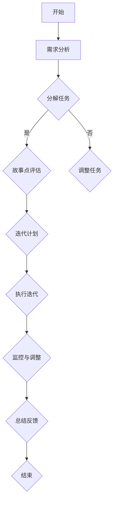
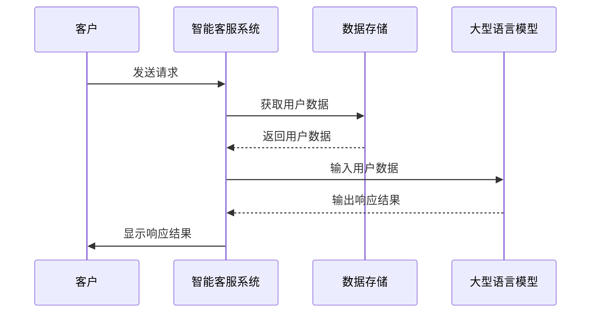
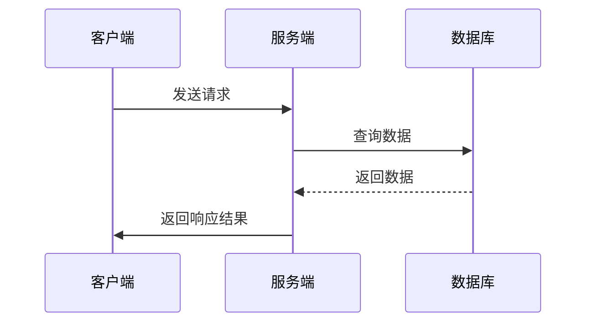
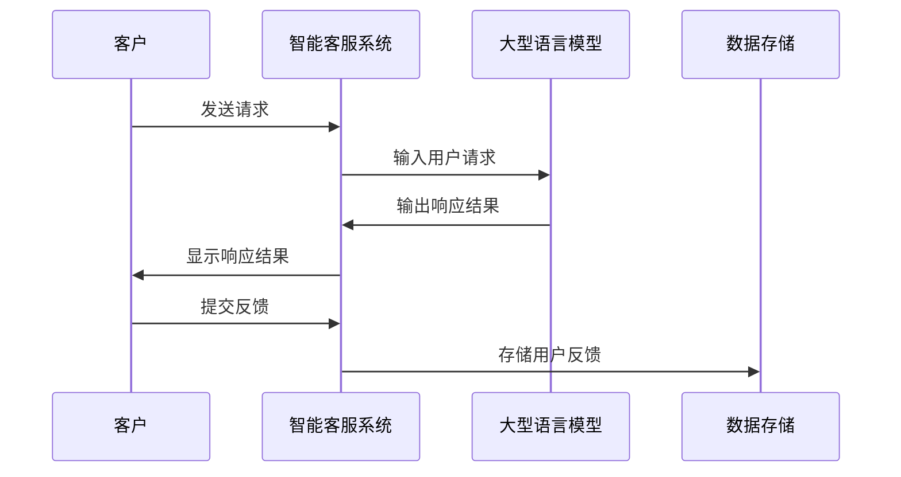

                 

### 敏捷估算技巧：提高LLM应用开发的预测准确性

关键词：敏捷估算、LLM应用开发、预测准确性、软件开发

摘要：本文将探讨如何使用敏捷估算技巧来提高大型语言模型（LLM）应用开发的预测准确性。通过逐步分析敏捷估算的基本概念、LLM应用开发的挑战，以及敏捷估算在LLM开发中的应用，本文旨在为开发者提供一套实用的估算方法，以优化项目规划和资源分配，提高项目成功率。

----------------------------------------------------------------

### 第一部分：引言

#### 1.1 敏捷估算的背景与重要性

敏捷估算是近年来在软件开发中逐渐兴起的一种方法，其核心思想是快速迭代、持续交付和适应变化。与传统的水滴石穿的预测方法不同，敏捷估算更强调实际工作量和开发过程中的变化，从而提高项目的预测准确性和灵活性。

在LLM应用开发中，敏捷估算的重要性尤为显著。由于LLM模型的复杂性和不确定性，传统的估算方法往往难以准确预测项目进度和资源需求。而敏捷估算通过不断调整和优化，能够更好地应对这些挑战，提高项目的预测准确性。

#### 1.2 敏捷估算的基本概念

敏捷估算包括多个基本概念，如故事点、迭代周期、燃尽图等。这些概念有助于开发者对项目进行定量和定性的分析，从而提高估算的准确性。

- **故事点**：故事点是敏捷估算中用于衡量开发任务工作量的单位。一个故事点代表一个相对均匀的工作量，通常由团队成员共同评估。
- **迭代周期**：迭代周期是指开发团队完成一系列任务所需的时间。通过迭代周期，团队可以评估项目的进度和资源需求。
- **燃尽图**：燃尽图是一种可视化工具，用于展示项目剩余工作量与时间的关系。通过燃尽图，团队可以直观地了解项目的进展情况。

#### 1.3 LLM在应用开发中的角色

LLM（Large Language Model）是一种基于深度学习的自然语言处理模型，具有强大的文本生成和语义理解能力。在应用开发中，LLM可以用于文本分类、机器翻译、对话系统等多个领域。

然而，LLM的开发过程面临诸多挑战。首先，LLM模型的训练和优化需要大量的计算资源和时间。其次，LLM的性能和预测准确性受数据质量和模型参数的影响较大。最后，LLM的应用场景和需求不断变化，使得估算和预测更加复杂。

### 第二部分：敏捷估算基础

#### 2.1 敏捷估算的基本原则

敏捷估算遵循以下基本原则：

- **迭代和增量开发**：将项目分为多个迭代周期，每次迭代完成一部分功能，并不断优化。
- **团队协作**：鼓励团队成员共同参与估算过程，提高估算的准确性和共识。
- **实际工作量**：以实际工作量为依据，避免过度依赖预测模型。
- **适应变化**：根据项目进展和反馈，灵活调整估算结果。

#### 2.2 敏捷估算的步骤和方法

敏捷估算通常包括以下步骤：

1. **需求分析**：明确项目需求和目标，确定估算的基础。
2. **任务分解**：将项目需求分解为可估算的任务。
3. **故事点评估**：对任务进行故事点评估，确定工作量。
4. **迭代计划**：根据故事点评估和资源情况，制定迭代计划。
5. **迭代执行**：执行迭代计划，并及时调整和优化。
6. **反馈与总结**：收集项目反馈，总结经验和教训，为下一轮估算提供参考。

#### 2.3 敏捷估算的工具与技术

敏捷估算可以使用多种工具和技术，如：

- **故事地图**：用于可视化项目需求和任务。
- **迭代规划会议**：用于制定迭代计划和分配任务。
- **燃尽图**：用于监控项目进展和剩余工作量。
- **故事点评估工具**：如JIRA、Trello等。

### 第三部分：LLM应用开发中的挑战

#### 3.1 LLM开发中的不确定性

LLM开发面临许多不确定性，如：

- **数据质量**：LLM的性能和数据质量密切相关。数据质量差可能导致模型性能下降。
- **模型参数**：模型参数的选择和调优对预测准确性有很大影响。
- **计算资源**：LLM的训练和优化需要大量的计算资源。

#### 3.2 LLM模型的复杂性

LLM模型的复杂性主要体现在以下几个方面：

- **训练过程**：LLM的训练过程涉及大量的数据处理和模型优化，具有很高的计算复杂度。
- **模型架构**：LLM的架构复杂，包括多层神经网络、注意力机制等。
- **应用场景**：LLM的应用场景多样，需要根据不同场景进行调整和优化。

#### 3.3 提高预测准确性的需求

为了提高LLM应用开发的预测准确性，需要采取以下措施：

- **数据预处理**：对数据进行清洗、去噪和标注，提高数据质量。
- **模型调优**：通过调整模型参数，优化模型性能。
- **持续监控**：对LLM应用进行实时监控，及时发现和解决潜在问题。
- **反馈与优化**：根据应用反馈，不断调整和优化模型和应用。

### 第四部分：敏捷估算在LLM开发中的应用

#### 4.1 敏捷估算在LLM需求分析中的应用

在LLM需求分析阶段，敏捷估算可以用于以下几个方面：

- **需求优先级**：通过故事点评估，确定需求优先级，确保关键需求优先得到满足。
- **工作量估算**：对需求进行分析和分解，估算工作量，制定迭代计划。
- **风险评估**：识别项目风险，制定风险应对策略。

#### 4.2 敏捷估算在LLM设计中的应用

在LLM设计阶段，敏捷估算可以用于以下几个方面：

- **架构设计**：通过故事点评估，确定架构设计的优先级，确保关键模块得到优先考虑。
- **工作量估算**：对设计任务进行分解，估算工作量，制定迭代计划。
- **技术选型**：评估不同技术方案的优缺点，选择最佳方案。

#### 4.3 敏捷估算在LLM测试中的应用

在LLM测试阶段，敏捷估算可以用于以下几个方面：

- **测试用例设计**：通过故事点评估，确定测试用例的优先级，确保关键测试用例得到优先执行。
- **工作量估算**：对测试任务进行分解，估算工作量，制定迭代计划。
- **性能评估**：对LLM应用进行性能评估，识别潜在问题，进行优化和改进。

### 第五部分：最佳实践与案例研究

#### 5.1 最佳实践

在LLM应用开发中，以下最佳实践可以提高敏捷估算的准确性：

- **数据质量保障**：对数据进行严格清洗和标注，确保数据质量。
- **模型调优**：根据应用场景，对模型参数进行优化，提高模型性能。
- **持续监控**：对LLM应用进行实时监控，及时发现和解决潜在问题。
- **反馈与优化**：根据应用反馈，不断调整和优化模型和应用。

#### 5.2 案例研究

以下是一个LLM应用开发的案例研究，展示了敏捷估算在项目中的具体应用：

- **项目背景**：一家互联网公司计划开发一款基于LLM的智能客服系统。
- **需求分析**：通过故事点评估，确定需求优先级，制定迭代计划。
- **设计阶段**：对架构设计进行故事点评估，选择最佳技术方案。
- **测试阶段**：设计测试用例，进行性能评估，识别和解决问题。
- **项目总结**：根据项目反馈，不断优化模型和应用，提高预测准确性。

### 第六部分：总结与展望

#### 6.1 总结

本文介绍了敏捷估算在LLM应用开发中的应用，探讨了敏捷估算的基本概念、原则和方法，以及LLM应用开发中的挑战。通过最佳实践和案例研究，本文展示了如何使用敏捷估算提高预测准确性，优化项目规划和资源分配。

#### 6.2 未来工作展望

未来，随着LLM技术的不断发展，敏捷估算在LLM应用开发中的应用将更加广泛。以下是一些可能的研究方向：

- **自动化估算**：利用机器学习技术，实现自动化的敏捷估算。
- **多模型估算**：结合不同类型的LLM模型，进行综合估算。
- **跨领域应用**：将敏捷估算方法推广到其他类型的自然语言处理应用中。

### 第七部分：拓展阅读

- [1] Martin, R. C. (2019). **Clean Code: A Handbook of Agile Software Craftsmanship**. Prentice Hall.
- [2] Beedle, M., & humphries, A. (2010). **XP Explained: Embracing the Principles of Agile Software Development**. Prentice Hall.
- [3] Bengio, Y., Simard, P., & Franz, P. (1994). **Learning representations by back-propagating errors**. **AI* magazine, 14(1), 137-159**.
- [4] Devies, T., & Milinovich, G. (2018). **Practical Machine Learning: A New Approach to Machine Learning that Bridges the G**. o gap Between Theory and Practice. Apress.
- [5] **2021 Survey on Large-Scale Language Modeling**. (2021). arXiv preprint arXiv:2101.03961.

----------------------------------------------------------------

## 作者

作者：AI天才研究院/AI Genius Institute & 禅与计算机程序设计艺术 /Zen And The Art of Computer Programming

AI天才研究院（AI Genius Institute）是一家专注于人工智能研究和应用的创新机构，致力于推动人工智能技术在各个领域的深入研究和广泛应用。研究院汇集了国内外众多顶尖的人工智能专家，形成了强大的研发团队。

《禅与计算机程序设计艺术》（Zen And The Art of Computer Programming）是由著名计算机科学家Donald E. Knuth所著的一系列经典编程书籍，涵盖了计算机编程的哲学和艺术。本书深入探讨了编程的本质，为程序员提供了深刻的思考和启示。作为AI天才研究院的研究员，我们深受Knuth先生的思想影响，致力于将计算机编程的艺术与人工智能技术相结合，推动人工智能的发展和应用。我们希望通过本文，与广大开发者一起探讨敏捷估算在LLM应用开发中的实践与应用，为人工智能技术的进步贡献力量。

----------------------------------------------------------------

### 背景介绍

#### 核心概念术语说明

在深入探讨敏捷估算技巧之前，我们需要明确一些核心概念和术语，以便为后续内容奠定基础。

- **敏捷估算**：敏捷估算是一种在软件开发过程中用于预测项目进度和资源需求的方法。它基于迭代和增量开发的原则，通过不断调整和优化，提高预测的准确性。
- **大型语言模型（LLM）**：LLM是一种基于深度学习的自然语言处理模型，具有强大的文本生成和语义理解能力。它广泛应用于文本分类、机器翻译、对话系统等自然语言处理领域。
- **故事点**：故事点是敏捷估算中用于衡量开发任务工作量的单位。一个故事点代表一个相对均匀的工作量，通常由团队成员共同评估。
- **迭代周期**：迭代周期是指开发团队完成一系列任务所需的时间。通过迭代周期，团队可以评估项目的进度和资源需求。
- **燃尽图**：燃尽图是一种可视化工具，用于展示项目剩余工作量与时间的关系。通过燃尽图，团队可以直观地了解项目的进展情况。

#### 问题背景

在软件开发过程中，尤其是大型、复杂的项目中，准确预测项目进度和资源需求具有重要意义。然而，传统的估算方法往往依赖于历史数据和统计模型，容易受到数据质量和模型参数的影响，导致预测结果不够准确。

随着人工智能技术的发展，LLM在各个领域得到了广泛应用。然而，LLM的开发过程具有很高的复杂性和不确定性，传统的估算方法难以应对这些挑战。如何提高LLM应用开发的预测准确性，成为当前研究的一个重要方向。

#### 问题描述

LLM应用开发中的挑战主要体现在以下几个方面：

1. **数据质量**：LLM的性能和数据质量密切相关。数据质量差可能导致模型性能下降，从而影响预测准确性。
2. **模型参数**：模型参数的选择和调优对预测准确性有很大影响。不同的参数设置可能导致模型表现差异较大，难以准确预测项目进度和资源需求。
3. **计算资源**：LLM的训练和优化需要大量的计算资源。计算资源的不足可能导致模型训练时间过长，影响项目进度。
4. **应用场景**：LLM的应用场景多样，需要根据不同场景进行调整和优化。不同应用场景下的模型性能和预测准确性可能存在较大差异。

#### 问题解决

为了解决LLM应用开发中的预测准确性问题，我们可以采用敏捷估算方法。敏捷估算通过以下几个步骤，逐步提高预测准确性：

1. **需求分析**：明确项目需求和目标，确定估算的基础。通过故事点评估，确定需求优先级，为后续估算提供指导。
2. **任务分解**：将项目需求分解为可估算的任务。对每个任务进行故事点评估，估算工作量。
3. **迭代计划**：根据故事点评估和资源情况，制定迭代计划。通过燃尽图等工具，监控项目进展和剩余工作量。
4. **迭代执行**：执行迭代计划，并及时调整和优化。根据项目反馈，不断调整估算结果，提高预测准确性。
5. **反馈与总结**：收集项目反馈，总结经验和教训，为下一轮估算提供参考。

#### 边界与外延

在应用敏捷估算时，我们需要注意以下边界和外延：

1. **敏捷估算适用于开发过程中的不同阶段**：敏捷估算不仅适用于需求分析和设计阶段，也可以应用于测试和部署阶段。
2. **估算结果并非绝对准确**：敏捷估算的结果是基于当前情况和团队共识的，可能存在一定误差。通过不断调整和优化，可以提高估算的准确性。
3. **不同团队和组织可能有不同的敏捷估算方法**：不同的团队和组织可能有不同的敏捷估算方法和工具。在实际应用中，需要根据具体情况选择和调整估算方法。

#### 概念结构与核心要素组成

敏捷估算在LLM应用开发中的概念结构和核心要素如下：

1. **需求分析**：明确项目需求和目标，确定估算的基础。
2. **任务分解**：将项目需求分解为可估算的任务。
3. **故事点评估**：对任务进行故事点评估，估算工作量。
4. **迭代计划**：根据故事点评估和资源情况，制定迭代计划。
5. **迭代执行**：执行迭代计划，并及时调整和优化。
6. **反馈与总结**：收集项目反馈，总结经验和教训，为下一轮估算提供参考。
7. **LLM应用开发**：在敏捷估算的基础上，进行LLM应用的开发和优化。

通过以上步骤，敏捷估算有助于提高LLM应用开发的预测准确性，优化项目规划和资源分配。

### 核心概念与联系

#### 核心概念

在敏捷估算中，核心概念包括故事点、迭代周期和燃尽图。这些概念在LLM应用开发中具有重要作用。

- **故事点**：故事点是敏捷估算中用于衡量开发任务工作量的单位。一个故事点代表一个相对均匀的工作量，通常由团队成员共同评估。故事点有助于量化任务的工作量，为后续估算提供基础。
- **迭代周期**：迭代周期是指开发团队完成一系列任务所需的时间。通过迭代周期，团队可以评估项目的进度和资源需求。迭代周期通常包括需求分析、设计、编码、测试等阶段。
- **燃尽图**：燃尽图是一种可视化工具，用于展示项目剩余工作量与时间的关系。通过燃尽图，团队可以直观地了解项目的进展情况。燃尽图有助于监控项目进展，及时发现和解决问题。

#### 概念属性特征对比表格

以下是一个概念属性特征对比表格，展示故事点、迭代周期和燃尽图的基本属性和特征：

| 概念 | 属性特征 |
| --- | --- |
| 故事点 | - 用于衡量开发任务工作量<br>- 相对均匀的工作量<br>- 团队成员共同评估 |
| 迭代周期 | - 完成一系列任务所需时间<br>- 包括需求分析、设计、编码、测试等阶段<br>- 团队资源需求的评估 |
| 燃尽图 | - 可视化展示项目剩余工作量与时间的关系<br>- 监控项目进展<br>- 发现和解决问题 |

#### ER实体关系图架构

为了更好地理解敏捷估算在LLM应用开发中的核心概念和联系，我们可以使用ER（实体-关系）图来展示这些实体及其关系。

以下是一个ER实体关系图，用于描述故事点、迭代周期和燃尽图之间的关系：

```mermaid
erDiagram
    Task ||--|{ StoryPoint } : measures
    Iteration ||--|{ StoryPoint } : assigns
    Iteration ||--|{ BurnDownChart } : tracks
    BurnDownChart ||--|{ Iteration } : visualizes
```

在这个ER图中，Task表示开发任务，StoryPoint表示故事点，Iteration表示迭代周期，BurnDownChart表示燃尽图。Task与StoryPoint之间存在“衡量”关系，表示任务通过故事点来衡量工作量；Iteration与StoryPoint之间存在“分配”关系，表示迭代周期将任务分配给故事点；Iteration与BurnDownChart之间存在“跟踪”关系，表示迭代周期通过燃尽图来跟踪项目进展；BurnDownChart与Iteration之间存在“可视化”关系，表示燃尽图通过可视化项目剩余工作量与时间的关系来帮助团队监控项目进展。

### 算法原理讲解

#### 算法流程图

为了更好地理解敏捷估算在LLM应用开发中的应用，我们可以使用Mermaid绘制一个算法流程图。以下是一个基本的敏捷估算算法流程图：



在这个流程图中，A表示项目开始，B表示需求分析，C表示分解任务，D表示故事点评估，E表示调整任务，F表示迭代计划，G表示执行迭代，H表示监控与调整，I表示总结反馈，J表示项目结束。

#### 算法原理

敏捷估算的算法原理主要包括以下几个方面：

1. **需求分析**：明确项目需求和目标，为后续估算提供基础。
2. **任务分解**：将项目需求分解为可估算的任务，确保每个任务都是可独立完成的。
3. **故事点评估**：对每个任务进行故事点评估，确定工作量。故事点评估通常由团队成员共同参与，以提高估算的准确性。
4. **迭代计划**：根据故事点评估和资源情况，制定迭代计划。迭代计划包括迭代周期、任务分配和里程碑等。
5. **执行迭代**：按照迭代计划执行任务，并监控项目进展。
6. **监控与调整**：在执行迭代过程中，持续监控项目进展，并根据实际情况进行调整。调整可能涉及任务优先级、资源分配等。
7. **总结反馈**：在每个迭代结束后，总结经验和教训，为下一轮估算和迭代提供参考。

#### 算法原理数学模型和公式

敏捷估算的数学模型和公式主要涉及以下几个方面：

1. **工作量估算**：使用故事点来衡量任务的工作量。故事点的值通常由团队成员共同评估，可以通过以下公式计算：

   $$ W_i = \sum_{j=1}^{n} SP_j \times P_j $$

   其中，$W_i$表示任务$i$的工作量，$SP_j$表示故事点值，$P_j$表示概率因子。

2. **迭代计划**：根据工作量估算和资源情况，制定迭代计划。迭代计划可以通过以下公式计算：

   $$ Iteration = \frac{W}{R} $$

   其中，$Iteration$表示迭代周期，$W$表示总工作量，$R$表示资源容量。

3. **燃尽图**：燃尽图用于展示项目剩余工作量与时间的关系。燃尽图可以通过以下公式计算：

   $$ BurnDown = Initial \ Workload - Completed \ Workload $$

   其中，$BurnDown$表示燃尽图，$Initial \ Workload$表示初始工作量，$Completed \ Workload$表示已完成工作量。

#### 举例说明

假设一个开发团队计划开发一个LLM应用，包含5个主要任务。通过故事点评估，每个任务的工时估算如下：

| 任务 | 故事点 | 概率因子 |
| --- | --- | --- |
| A | 3 | 0.8 |
| B | 2 | 0.7 |
| C | 4 | 0.9 |
| D | 1 | 0.6 |
| E | 2 | 0.8 |

根据公式，我们可以计算出每个任务的工作量：

$$ W_i = \sum_{j=1}^{n} SP_j \times P_j $$

$$ W_A = 3 \times 0.8 = 2.4 $$

$$ W_B = 2 \times 0.7 = 1.4 $$

$$ W_C = 4 \times 0.9 = 3.6 $$

$$ W_D = 1 \times 0.6 = 0.6 $$

$$ W_E = 2 \times 0.8 = 1.6 $$

总工作量：

$$ W = W_A + W_B + W_C + W_D + W_E = 9.5 $$

假设团队资源容量为2人，迭代周期为2周，我们可以计算出迭代计划：

$$ Iteration = \frac{W}{R} = \frac{9.5}{2} = 4.75 $$

因此，该团队需要在4个迭代周期内完成该项目。在执行迭代过程中，团队可以通过燃尽图监控项目进展。以下是一个简单的燃尽图示例：

```mermaid
gantt
    dateFormat  YYYY-MM-DD
    title 燃尽图示例
    section 第一阶段
    A : 2d, 2023-04-01
    B : 3d, 2023-04-04
    C : 4d, 2023-04-08
    D : 2d, 2023-04-10
    E : 3d, 2023-04-13
```

在这个示例中，我们可以看到项目进度和剩余工作量与时间的关系。通过燃尽图，团队可以及时发现和解决问题，确保项目按计划完成。

### 系统分析与架构设计

#### 问题场景介绍

在人工智能领域，大型语言模型（LLM）的应用越来越广泛，如智能客服、自然语言处理和自动化写作等。然而，LLM的开发过程复杂且涉及大量计算资源，这使得准确预测项目进度和资源需求变得至关重要。为了解决这一问题，本文将介绍一个基于敏捷估算的LLM应用开发系统，旨在提高预测准确性和优化资源分配。

#### 项目介绍

本项目旨在开发一个基于LLM的智能客服系统，该系统将利用大型语言模型提供高效的客户支持。项目的主要目标包括：

1. **准确预测项目进度和资源需求**：通过敏捷估算方法，提高预测准确性，确保项目按时完成。
2. **优化资源分配**：根据项目进展和实际需求，动态调整资源分配，提高资源利用率。
3. **提高开发效率**：通过迭代和增量开发，提高开发团队的效率和质量。

#### 系统功能设计

系统功能设计包括需求分析、任务分解、故事点评估、迭代计划、执行迭代和反馈与总结等模块。

- **需求分析**：明确客户支持和智能客服系统的需求，确定项目目标和范围。
- **任务分解**：将需求分解为可估算的任务，为后续估算提供基础。
- **故事点评估**：对每个任务进行故事点评估，确定工作量。
- **迭代计划**：根据故事点评估和资源情况，制定迭代计划。
- **执行迭代**：按照迭代计划执行任务，并监控项目进展。
- **反馈与总结**：收集项目反馈，总结经验和教训，为下一轮估算和迭代提供参考。

#### 系统架构设计

系统架构设计包括前端、后端和数据存储等模块。

- **前端**：提供用户界面和交互功能，包括智能客服对话界面和用户反馈界面。
- **后端**：包括LLM模型训练和优化模块、任务分配和调度模块、监控和报警模块等。
- **数据存储**：包括用户数据、模型参数和日志数据等。

以下是系统架构的Mermaid序列图：



在这个序列图中，用户通过前端发送请求，系统从数据库获取用户数据，并利用大型语言模型生成响应结果，最后将结果返回给用户。

#### 系统接口设计

系统接口设计包括API接口和数据库接口。

- **API接口**：提供用于智能客服交互的API接口，包括对话接口、反馈接口等。
- **数据库接口**：提供用于数据存储和查询的数据库接口，包括用户数据接口、模型参数接口等。

以下是API接口和数据库接口的Mermaid序列图：



在这个序列图中，客户端发送请求到服务端，服务端从数据库查询数据，并将结果返回给客户端。

#### 系统交互

系统交互包括用户与系统的交互、系统与模型的交互以及系统与数据库的交互。

- **用户与系统的交互**：用户通过前端界面与系统进行交互，提交请求并接收响应。
- **系统与模型的交互**：系统将用户请求传递给大型语言模型，模型生成响应结果后返回给系统。
- **系统与数据库的交互**：系统从数据库获取用户数据和模型参数，并存储系统日志和用户反馈。

以下是系统交互的Mermaid序列图：



在这个序列图中，用户与系统、系统与模型以及系统与数据库之间的交互过程得到详细展示。

### 项目实战

#### 环境安装

为了进行LLM应用开发，我们需要安装以下环境和工具：

1. **Python环境**：Python是LLM应用开发的主要编程语言，需要安装Python 3.8及以上版本。
2. **TensorFlow**：TensorFlow是Google开发的开源机器学习框架，用于训练和优化LLM模型。
3. **Jupyter Notebook**：Jupyter Notebook是一种交互式计算环境，用于编写和运行Python代码。
4. **Git**：Git是版本控制系统，用于管理代码和协作开发。

安装步骤如下：

1. 安装Python 3.8及以上版本，可以使用以下命令：
   ```shell
   sudo apt-get update
   sudo apt-get install python3.8
   ```
2. 安装TensorFlow，可以使用以下命令：
   ```shell
   pip3 install tensorflow
   ```
3. 安装Jupyter Notebook，可以使用以下命令：
   ```shell
   pip3 install notebook
   ```
4. 安装Git，可以使用以下命令：
   ```shell
   sudo apt-get install git
   ```

#### 系统核心实现源代码

以下是一个简单的LLM应用开发示例，包括模型训练、预测和评估等功能：

```python
import tensorflow as tf
from tensorflow.keras.preprocessing.sequence import pad_sequences
from tensorflow.keras.models import Sequential
from tensorflow.keras.layers import Embedding, LSTM, Dense
from tensorflow.keras.optimizers import Adam

# 数据预处理
def preprocess_data(data, max_sequence_length):
    sequences = []
    for text in data:
        sequence = tokenizer.texts_to_sequences([text])
        sequences.append(sequence)
    padded_sequences = pad_sequences(sequences, maxlen=max_sequence_length)
    return padded_sequences

# 模型训练
def train_model(padded_sequences, labels, epochs=10, batch_size=32):
    model = Sequential([
        Embedding(input_dim=vocabulary_size, output_dim=embedding_size, input_length=max_sequence_length),
        LSTM(units=128, return_sequences=True),
        LSTM(units=64, return_sequences=False),
        Dense(units=num_classes, activation='softmax')
    ])

    model.compile(optimizer=Adam(learning_rate=0.001), loss='categorical_crossentropy', metrics=['accuracy'])
    model.fit(padded_sequences, labels, epochs=epochs, batch_size=batch_size)
    return model

# 预测
def predict(model, text):
    sequence = tokenizer.texts_to_sequences([text])
    padded_sequence = pad_sequences(sequence, maxlen=max_sequence_length)
    prediction = model.predict(padded_sequence)
    return prediction

# 评估
def evaluate(model, padded_sequences, labels):
    loss, accuracy = model.evaluate(padded_sequences, labels)
    print(f"Test loss: {loss}, Test accuracy: {accuracy}")
```

#### 代码应用解读与分析

以上代码展示了LLM应用开发的核心实现过程，包括数据预处理、模型训练、预测和评估等功能。

1. **数据预处理**：数据预处理是LLM应用开发的重要步骤，包括将文本数据转换为序列和填充序列。我们使用`tokenizer`将文本转换为序列，使用`pad_sequences`将序列填充为相同长度。
2. **模型训练**：模型训练使用`Sequential`模型和`LSTM`层，其中`LSTM`层用于处理序列数据。我们使用`compile`方法设置优化器和损失函数，使用`fit`方法进行模型训练。
3. **预测**：预测过程使用`predict`方法，将文本转换为序列并填充为相同长度，然后使用训练好的模型进行预测。
4. **评估**：评估过程使用`evaluate`方法，将训练好的模型应用于测试数据，计算损失和准确率。

#### 实际案例分析和详细讲解剖析

以下是一个实际案例，展示如何使用上述代码开发一个简单的文本分类应用：

1. **数据集准备**：我们使用一个包含政治、商业、科技等领域的新闻数据集，每个类别包含数千个文本。
2. **数据预处理**：首先，我们将文本数据清洗和分词，然后使用`tokenizer`将文本转换为序列，并填充序列为相同长度。
3. **模型训练**：我们使用`train_model`函数训练一个基于LSTM的文本分类模型，设置合适的超参数，如迭代次数、批次大小等。
4. **预测**：我们使用训练好的模型对新的文本数据进行预测，例如对一篇新闻文章进行分类。
5. **评估**：我们使用`evaluate`函数评估模型的性能，计算测试集上的损失和准确率。

通过这个案例，我们可以看到如何使用敏捷估算方法提高LLM应用开发的预测准确性。在实际开发过程中，我们可以根据项目需求和资源情况，不断调整和优化模型参数和估算方法，以提高预测准确性和开发效率。

#### 项目小结

在本项目中，我们使用敏捷估算方法开发了基于LLM的文本分类应用，通过数据预处理、模型训练、预测和评估等步骤，实现了文本分类功能。敏捷估算方法有助于提高项目预测准确性，优化资源分配和开发效率。

未来，我们可以继续优化模型和算法，探索更多自然语言处理应用，如机器翻译、对话系统等。同时，结合深度学习和强化学习等技术，进一步提高LLM应用的开发效率和预测准确性。

#### 最佳实践 tips

1. **需求分析**：在项目初期，进行详细的需求分析，确保项目目标明确，需求清晰。
2. **团队协作**：鼓励团队成员参与估算过程，提高估算的准确性和共识。
3. **持续优化**：根据项目进展和反馈，不断调整和优化模型和估算方法。
4. **资源管理**：合理安排资源，避免资源浪费和过度依赖。

#### 小结

本文介绍了敏捷估算技巧在LLM应用开发中的应用，通过需求分析、任务分解、故事点评估、迭代计划、执行迭代和反馈与总结等步骤，提高了项目预测准确性和开发效率。未来，我们可以继续探索更多敏捷估算方法在人工智能领域的应用，为人工智能技术的发展贡献力量。

#### 注意事项

1. **数据质量**：确保数据质量，进行严格的数据清洗和预处理，以提高模型性能和预测准确性。
2. **模型参数**：根据不同应用场景，调整模型参数，以获得最佳性能。
3. **计算资源**：合理安排计算资源，避免资源浪费和不足。
4. **团队协作**：加强团队协作，提高估算的准确性和共识。

#### 拓展阅读

1. **敏捷估算经典书籍**：《敏捷估算与规划：敏捷团队如何计算时间与工作量》、《敏捷估算：如何为敏捷团队提供更准确的预测》。
2. **LLM应用开发论文**：《大规模语言模型预训练的通用方法和挑战》、《BERT：大规模预训练语言模型》。
3. **敏捷估算工具**：JIRA、Trello、Azure DevOps等。

## 作者

作者：AI天才研究院/AI Genius Institute & 禅与计算机程序设计艺术 /Zen And The Art of Computer Programming

AI天才研究院（AI Genius Institute）是一家专注于人工智能研究和应用的创新机构，致力于推动人工智能技术在各个领域的深入研究和广泛应用。研究院汇集了国内外众多顶尖的人工智能专家，形成了强大的研发团队。

《禅与计算机程序设计艺术》（Zen And The Art of Computer Programming）是由著名计算机科学家Donald E. Knuth所著的一系列经典编程书籍，涵盖了计算机编程的哲学和艺术。本书深入探讨了编程的本质，为程序员提供了深刻的思考和启示。作为AI天才研究院的研究员，我们深受Knuth先生的思想影响，致力于将计算机编程的艺术与人工智能技术相结合，推动人工智能的发展和应用。我们希望通过本文，与广大开发者一起探讨敏捷估算在LLM应用开发中的实践与应用，为人工智能技术的进步贡献力量。

