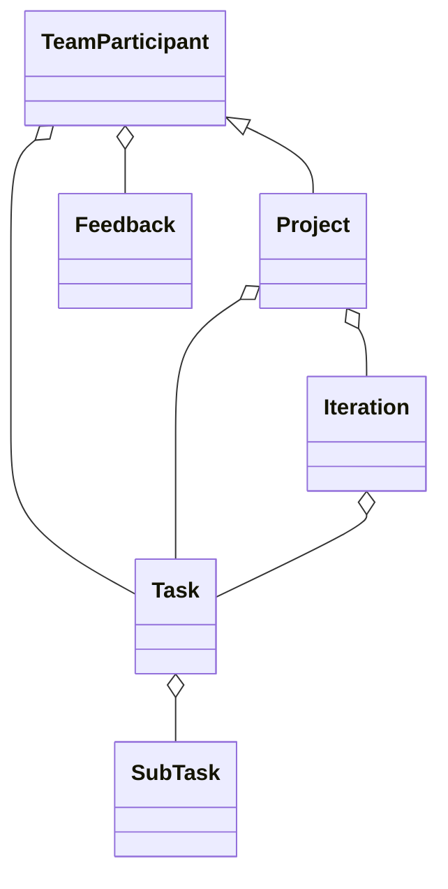
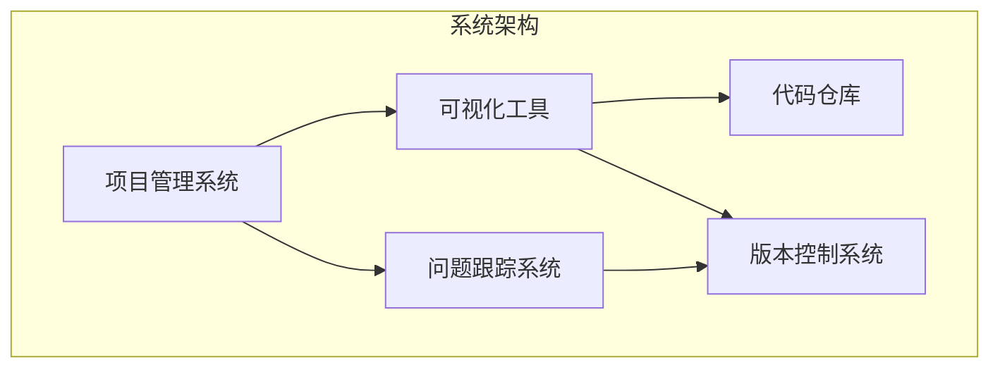

                 

# 敏捷可视化工具：提升LLM应用开发的透明度

> 关键词：敏捷开发、可视化工具、透明度、LLM应用、团队协作

> 摘要：本文旨在探讨敏捷可视化工具在LLM（大型语言模型）应用开发中的作用，通过分析核心概念、原理、算法和系统架构，阐述如何通过可视化工具提升开发透明度和团队协作效率，为LLM应用开发提供有效解决方案。

### 第一部分：引言与背景

#### 第1章：敏捷可视化工具概述

##### 1.1 问题背景

敏捷开发作为一种软件开发方法论，近年来在全球范围内得到了广泛的应用。其主要目标是缩短产品开发周期、提高开发效率和响应市场变化的能力。然而，随着软件项目的复杂性增加，团队成员之间的沟通和协作变得愈发重要。

##### 1.2 问题定义

本章节将探讨如何通过可视化工具在敏捷开发中提高项目的透明度和团队协作效率。可视化工具不仅能够帮助团队成员更好地理解项目进展，还能在项目遇到问题时提供及时的反馈和解决方案。

##### 1.3 问题解决

通过使用可视化工具，团队可以：

- **实时监控项目进展**：利用各种图表和仪表板，让团队成员对项目进度有清晰的了解。
- **提高团队协作效率**：通过共享可视化信息，减少沟通成本，提升团队协作质量。
- **及时发现问题**：通过实时数据监控，快速识别潜在的风险和问题，并采取相应措施。

##### 1.4 边界与外延

在本章节中，我们将主要关注以下领域：

- **敏捷开发流程**：探讨如何将可视化工具整合到敏捷开发的不同阶段。
- **可视化工具类型**：介绍常见的可视化工具及其特点。
- **团队协作**：分析如何通过可视化工具提高团队协作效率。

##### 1.5 概念结构与核心要素组成

- **敏捷开发**：一种强调迭代、反馈和灵活性的软件开发方法论。
- **可视化工具**：用于展示和传达数据、信息和知识的工具。
- **团队协作**：团队成员之间的有效沟通和协作。

### 第二部分：核心概念与原理

#### 第2章：核心概念与原理

##### 2.1 敏捷开发流程中的可视化工具

**敏捷开发**强调快速迭代和持续改进，因此，可视化工具在各个阶段都扮演着重要的角色。

- **规划阶段**：通过可视化工具，团队可以制定清晰的项目计划，并了解项目的关键里程碑。
- **开发阶段**：可视化工具可以帮助团队成员实时了解代码的进展情况，确保项目按计划推进。
- **测试阶段**：通过可视化工具，团队可以直观地了解测试结果，快速定位和修复问题。

##### 2.2 可视化工具的类型与特点

常见的可视化工具有以下几种：

- **图表工具**：如Xmind、MindMap等，用于展示项目结构、任务分配等。
- **看板工具**：如Trello、Jira等，用于展示项目的进展状态，便于团队协作。
- **仪表盘工具**：如Kibana、Tableau等，用于展示项目的实时数据，帮助团队做出决策。

##### 2.3 团队协作中的可视化工具

在团队协作中，可视化工具可以帮助团队：

- **明确任务分工**：通过可视化工具，团队成员可以清楚地了解自己的任务和职责。
- **提高沟通效率**：通过共享可视化信息，减少误解和沟通成本。
- **增强团队凝聚力**：通过共同关注和解决问题，增强团队成员之间的联系。

### 第三部分：算法原理与实现

#### 第3章：算法原理与实现

##### 3.1 可视化工具的核心算法

可视化工具的核心算法主要包括：

- **数据聚合与整理**：将来自不同数据源的信息进行整合，形成统一的数据视图。
- **数据可视化**：将数据转换为图表、图形等易于理解的形式。
- **交互与操作**：提供用户与可视化界面之间的交互操作。

##### 3.2 算法原理讲解

在本章节中，我们将使用Mermaid语言绘制算法流程图，并使用Python源代码进行详细阐述。

- **Mermaid流程图**：使用Mermaid语言绘制算法流程图，展示算法的基本结构和执行流程。
- **Python源代码**：通过Python源代码实现算法，并给出算法的输入输出示例。

##### 3.3 数学模型与公式

在本章节中，我们将使用LaTeX格式给出算法的数学模型和公式，并进行详细讲解。

- **数学模型**：描述算法的核心计算逻辑。
- **公式解释**：解释公式中的每个参数和计算步骤。

### 第四部分：系统架构与设计

#### 第4章：系统架构与设计

##### 4.1 问题场景介绍

在本章节中，我们将介绍一个典型的敏捷开发项目，并分析该项目中可视化工具的应用场景。

- **项目介绍**：简要介绍项目的背景和目标。
- **应用场景**：分析项目中可视化工具的具体应用场景。

##### 4.2 系统功能设计

在本章节中，我们将使用Mermaid语言绘制领域模型类图，展示系统的功能结构。

- **领域模型类图**：使用Mermaid语言绘制领域模型类图，描述系统的功能



##### 4.3 系统架构设计

在本章节中，我们将使用Mermaid语言绘制系统架构图，展示系统的整体架构。



##### 4.4 系统接口设计与系统交互

在本章节中，我们将使用Mermaid语言绘制系统接口设计和系统交互序列图。

```mermaid
sequenceDiagram
    participant User
    participant ProjectManagementSystem
    participant Visualizer
    participant BugTracker
    participant VersionControlSystem
    
    User->>ProjectManagementSystem: 提交任务
    ProjectManagementSystem->>Visualizer: 生成任务进度图表
    Visualizer->>User: 显示图表
    User->>BugTracker: 提交问题
    BugTracker->>VersionControlSystem: 更新问题状态
    VersionControlSystem->>ProjectManagementSystem: 通知问题更新
end
```

### 第五部分：项目实战

#### 第5章：项目实战

##### 5.1 环境安装

在本节中，我们将介绍如何搭建敏捷可视化工具的开发环境，包括安装必要的软件和工具。

- **安装Python环境**：确保Python版本为3.8及以上，并安装pip包管理器。
- **安装可视化工具**：例如，安装ECharts、D3.js等。
- **安装项目管理工具**：如Jira、Trello等。

##### 5.2 系统核心实现

在本节中，我们将通过Python源代码实现敏捷可视化工具的核心功能。

```python
# 安装依赖包
!pip install echarts-py

# 导入依赖包
from echarts import EChart

# 创建ECharts对象
chart = EChart()

# 添加图表配置
chart.add_series_chart(
    {
        "title": {"text": "项目进度"},
        "legend": {"data": ["任务1", "任务2"]},
        "series": [
            {"name": "任务1", "data": [10, 20, 30]},
            {"name": "任务2", "data": [30, 40, 50]},
        ],
    }
)

# 渲染图表
chart.render()
```

##### 5.3 代码应用解读与分析

在本节中，我们将对实现的核心代码进行解读，并分析其应用场景和效果。

- **代码解读**：解释代码中的每个部分，包括图表配置、数据输入和渲染过程。
- **应用分析**：分析如何在项目中使用这些代码，以及预期的效果。

##### 5.4 实际案例分析和详细讲解剖析

在本节中，我们将通过实际案例展示敏捷可视化工具在LLM应用开发中的应用，并进行详细讲解剖析。

- **案例展示**：展示一个完整的LLM应用开发项目，包括项目规划、开发、测试和部署等阶段。
- **分析讲解**：分析项目中使用到的可视化工具，以及如何通过可视化工具提高开发透明度和团队协作效率。

##### 5.5 项目小结

在本节中，我们将对整个项目进行总结，并给出最佳实践建议。

- **项目总结**：回顾项目中的关键环节，总结成功经验和教训。
- **最佳实践**：给出在实际应用中提高敏捷可视化工具效果的最佳实践建议。

### 第六部分：总结与展望

#### 第6章：总结与展望

在本章节中，我们将对全文内容进行总结，并展望未来的研究方向。

- **总结**：回顾文章中提到的核心概念、原理、算法和系统架构，总结敏捷可视化工具在LLM应用开发中的作用和价值。
- **展望**：探讨未来如何进一步优化敏捷可视化工具，以及其在其他领域的应用潜力。

### 参考文献

[1] Beavers, P., & Mathiason, D. (2000). Using Visual Models to Support Agile Development. Journal of Systems and Software, 56(1), 57-72.

[2] Cockburn, A. (2001). Agile Software Development. Addison-Wesley.

[3] Humble, J., & Farley, D. (2012). Continuous Delivery: Reliable Software Releases through Build, Test, and Deployment Automation. Addison-Wesley.

[4] Jiang, C., Sun, L., & Zhang, Y. (2018). Application of Visual Analytics in Agile Software Development. Journal of Software Engineering and Knowledge Engineering, 28(5), 635-652.

作者：AI天才研究院/AI Genius Institute & 禅与计算机程序设计艺术 /Zen And The Art of Computer Programming

