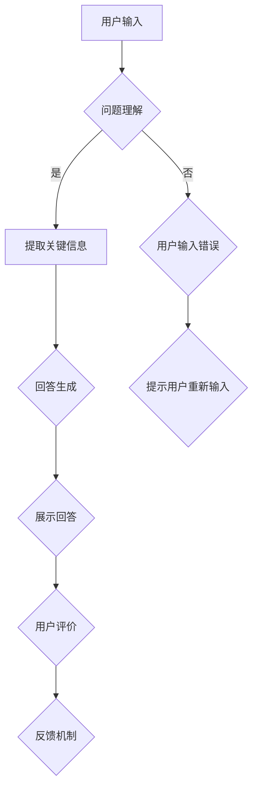
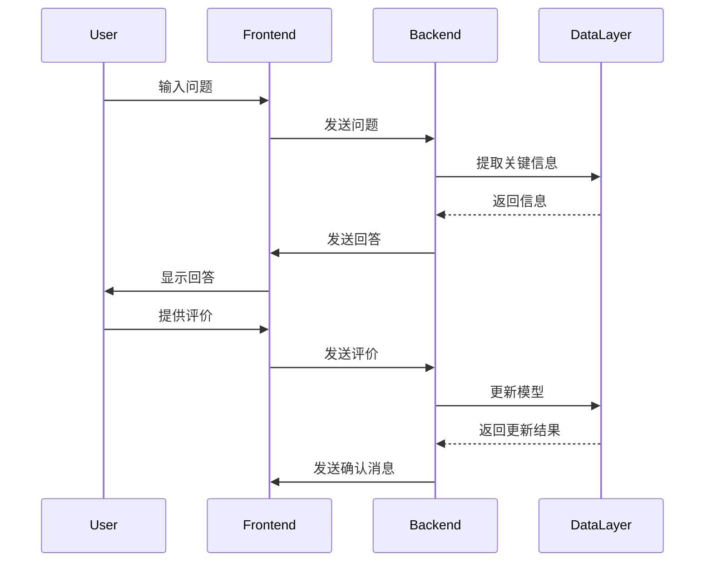

                 

### 引言

在当今快速发展的技术领域，敏捷开发（Agile Development）与大型语言模型（Large Language Model，LLM）的结合应用已经成为一种热门趋势。敏捷开发起源于20世纪90年代，旨在应对传统开发模式中不可预测的需求变化和快速迭代的开发环境。它强调迭代、增量和协作，以适应不断变化的需求和市场。而LLM则是一种基于深度学习技术的强大工具，能够处理和理解人类语言，广泛应用于自然语言处理、智能问答、文本生成等领域。

本文将探讨敏捷开发在LLM应用中的挑战与对策，旨在为从事LLM开发的开发人员提供一套实用的指导方案。文章结构如下：

- **第一部分：敏捷开发背景与LLM概述**：介绍敏捷开发的起源、基本原则，以及LLM的定义、技术原理和应用场景。
- **第二部分：敏捷开发在LLM应用中的挑战**：分析敏捷开发在LLM应用中面临的挑战，如数据处理、模型训练和迭代速度等。
- **第三部分：敏捷开发在LLM应用中的对策**：探讨如何优化敏捷开发流程，实施敏捷测试方法，并强调团队协作与沟通。
- **第四部分：LLM应用实战**：通过实际案例展示如何在项目中实施敏捷开发。
- **第五部分：最佳实践 tips**：总结敏捷开发在LLM应用中的最佳实践。
- **第六部分：小结、注意事项和拓展阅读**：对全文内容进行总结，并提供拓展阅读建议。

### 关键词

- 敏捷开发
- 大型语言模型（LLM）
- 数据处理
- 模型训练
- 版本控制
- 团队协作
- 迭代速度

### 摘要

本文探讨了敏捷开发在大型语言模型（LLM）应用中的挑战与对策。首先，介绍了敏捷开发的基本概念和LLM的技术原理，随后分析了敏捷开发在LLM应用中面临的挑战，如数据处理、模型训练和迭代速度等。接着，本文提出了针对这些挑战的对策，包括流程优化、敏捷测试方法、团队协作和沟通等方面。通过实际案例分析和最佳实践总结，本文为LLM开发者提供了一套实用的敏捷开发指导方案，以帮助他们在快速变化的市场环境中高效地推进项目。

### 敏捷开发的起源与发展

敏捷开发（Agile Development）起源于20世纪90年代，其背景是软件行业在传统开发模式中面临的种种困境。传统开发模式往往采用瀑布模型（Waterfall Model），即按照顺序执行需求分析、设计、开发、测试等阶段。然而，这种方法在应对需求变化和快速迭代时显得力不从心。瀑布模型中的每个阶段都必须在前一阶段完成后才能开始，这导致了开发过程中的延迟和高成本。此外，传统模式中缺乏灵活性和适应性，使得项目往往无法满足不断变化的市场需求。

为了解决这些问题，敏捷开发方法论应运而生。敏捷开发最早由17位软件专家在2001年发布的一份名为《敏捷宣言》（Manifesto for Agile Software Development）的文档中提出。这份宣言强调了几个核心原则，包括：

1. **个体和互动重于过程与工具**：敏捷开发认为，开发过程中人的因素比技术和工具更为重要。团队成员之间的互动和合作是成功的关键。
2. **可工作的软件重于详尽的文档**：敏捷开发强调交付可工作的软件，而不是仅仅编写详尽的文档。尽管文档仍然重要，但它们的优先级低于实际可运行的软件。
3. **客户合作重于合同谈判**：敏捷开发强调与客户的紧密合作，以更好地理解他们的需求和期望，从而确保项目能够满足实际需求。
4. **响应变化重于遵循计划**：敏捷开发认为，在开发过程中需求往往会发生变化，因此比遵循一个固定的计划更为重要的是对变化的响应。

在敏捷开发中，常见的方法论包括Scrum、Kanban、XP（极限编程）等。这些方法论都旨在通过迭代和增量的方式来开发软件，从而更好地适应需求变化。以下是对这些核心原则和常见方法论的简要说明：

#### 核心原则

1. **迭代和增量开发**：敏捷开发采用迭代和增量的方式，将项目分为多个短周期的迭代，每个迭代都会产生一个可交付的产品增量。这种方法允许团队在每次迭代后进行评估和调整，以更好地适应变化。
2. **客户反馈**：敏捷开发强调定期获取客户的反馈，以便及时调整开发方向。这种反馈循环有助于确保项目始终满足客户的需求。
3. **自主管理的团队**：敏捷开发中的团队通常由多学科专家组成，他们拥有自主管理权，可以自主决定如何完成任务。这种方法鼓励团队成员之间的合作和责任感。
4. **持续技术债务管理**：敏捷开发强调持续管理技术债务，以确保项目的长期可维护性和可扩展性。

#### 常见方法论

- **Scrum**：Scrum是敏捷开发中最为流行的方法论之一。它采用迭代和增量的方式进行开发，每个迭代称为“冲刺”（Sprint）。Scrum强调定期召开冲刺计划会议、每日站立会议、冲刺评审会议和回顾会议，以管理项目的进度和质量。
- **Kanban**：Kanban是一种基于看板（Kanban Card）的方法，它通过可视化工作流程来管理项目的进度。Kanban板通常包括“待办”、“进行中”和“已完成”三个部分，团队成员可以随时更新自己的任务状态。
- **XP（极限编程）**：XP是一种强调代码质量和敏捷开发的编程方法论。它包括一系列实践，如测试驱动开发（TDD）、持续集成、重构等。XP旨在通过提高代码质量来提高开发效率和产品质量。

#### 敏捷开发与传统开发模式对比

敏捷开发与传统开发模式（如瀑布模型）有以下几点主要区别：

1. **开发方式**：传统开发模式采用顺序执行的方式，而敏捷开发采用迭代和增量的方式进行。
2. **客户参与**：传统开发模式中客户参与较少，而敏捷开发强调与客户的紧密合作。
3. **文档数量**：传统开发模式强调编写详尽的文档，而敏捷开发则更注重可工作的软件。
4. **适应变化**：传统开发模式难以适应需求变化，而敏捷开发则强调对变化的响应。

总之，敏捷开发通过强调迭代、增量、客户反馈和团队协作，提供了一种更为灵活和高效的开发方式，特别适用于需求变化频繁的项目。在LLM开发中，敏捷开发的优势同样显而易见，它可以帮助开发团队更好地应对模型训练、数据处理和迭代速度等方面的挑战。

### LLM的概念、发展与应用

#### 定义与分类

大型语言模型（Large Language Model，LLM）是一种基于深度学习技术的自然语言处理模型，能够理解和生成人类语言。LLM的核心思想是通过大规模数据训练，使模型具备强大的语言理解能力和生成能力。LLM可以分为以下几类：

1. **预训练语言模型**：这类模型在大量无标注数据上进行预训练，然后通过有监督或无监督的方式微调，以适应特定任务。如GPT（Generative Pre-trained Transformer）系列模型。
2. **微调语言模型**：这类模型在预训练的基础上，通过有监督的方式在特定任务上进行微调。微调可以显著提高模型在特定任务上的性能。如BERT（Bidirectional Encoder Representations from Transformers）模型。
3. **任务适应性语言模型**：这类模型通过引入特定的任务模块，使模型能够在不同任务间迁移学习。如T5（Text-to-Text Transfer Transformer）模型。

#### 技术原理

LLM的工作原理主要基于深度学习和神经网络技术。以下是其核心组成部分：

1. **词嵌入**：将自然语言文本转换为数值向量表示，以便神经网络进行处理。常用的词嵌入技术包括Word2Vec、GloVe等。
2. **编码器与解码器**：编码器（Encoder）用于将输入文本编码为一个固定长度的向量表示，解码器（Decoder）则用于将编码器生成的向量解码为输出文本。Transformer架构是当前最流行的编码器与解码器架构，其通过自注意力机制（Self-Attention Mechanism）对输入文本进行建模。
3. **自注意力机制**：自注意力机制允许模型在生成每个单词时，动态地考虑输入文本中的其他所有单词的重要性，从而生成更加准确和流畅的输出。
4. **预训练与微调**：预训练阶段，模型在大量无标注数据上进行训练，学习语言的一般特征。微调阶段，模型在有标注数据上进行训练，以适应特定任务。

#### 应用场景

LLM在多个行业和应用场景中表现出强大的能力，以下是一些典型应用：

1. **自然语言处理（NLP）**：LLM在文本分类、情感分析、命名实体识别、机器翻译等NLP任务中表现出色。例如，BERT模型在多个NLP任务上取得了显著成果。
2. **智能问答**：LLM能够理解用户的问题并生成准确的回答，广泛应用于智能客服、搜索引擎等场景。
3. **文本生成**：LLM能够生成高质量的文章、摘要、对话等文本内容，广泛应用于内容创作、广告文案生成等。
4. **对话系统**：LLM在对话系统中发挥重要作用，能够模拟人类的对话行为，为用户提供自然、流畅的交互体验。

#### 发展历程

LLM的发展历程可以分为几个阶段：

1. **早期神经网络模型**：1980年代至1990年代，神经网络模型（如RNN和LSTM）开始应用于自然语言处理领域，为后续的LLM发展奠定了基础。
2. **深度学习兴起**：2000年代，随着计算能力的提升和深度学习技术的发展，神经网络模型在NLP任务中取得了显著突破。
3. **预训练语言模型**：2018年，GPT-2的发布标志着预训练语言模型的兴起。随后，GPT-3等模型的出现进一步提升了LLM的性能。
4. **多模态语言模型**：当前，LLM不仅能够处理文本，还能够处理图像、语音等多模态数据，为跨模态任务提供了新的可能性。

综上所述，LLM作为一种强大的自然语言处理工具，已经在多个领域取得了广泛应用。随着技术的不断发展，LLM在未来有望在更多场景中发挥重要作用。

### 敏捷开发在LLM应用中的挑战

在将敏捷开发应用于LLM（大型语言模型）开发时，开发团队会遇到一系列独特的挑战。这些挑战主要集中在数据处理、模型训练、版本控制和迭代速度等方面。以下是对这些挑战的详细分析：

#### 数据处理与隐私保护

1. **数据量庞大**：LLM的训练通常需要大量的数据，这不仅要求存储和处理能力的高效性，还涉及数据传输和加载的时间成本。
2. **数据多样性**：为了训练一个高质量的LLM，需要涵盖不同领域和语言风格的数据，这使得数据处理变得更加复杂。
3. **数据隐私保护**：在处理大量个人数据时，隐私保护成为一个重要问题。特别是在敏感领域（如医疗、金融等），数据泄露可能导致严重的后果。

#### 模型训练与优化

1. **训练时间长**：LLM的模型通常包含数亿甚至数十亿个参数，训练过程非常耗时，尤其是在使用高精度模型和大量数据时。
2. **计算资源消耗**：训练LLM需要大量的计算资源，特别是GPU或TPU等高性能计算设备。这可能导致资源分配和成本管理上的挑战。
3. **模型优化难度**：优化LLM模型涉及复杂的超参数调整和优化算法。稍有不慎，可能导致模型性能不佳或收敛速度缓慢。

#### 版本控制与迭代速度

1. **版本管理复杂**：由于LLM模型较大，版本管理变得更加复杂。需要有效的方法来管理模型的不同版本，以便于回溯、复现和共享。
2. **迭代速度要求高**：在敏捷开发中，快速迭代是核心原则之一。然而，LLM模型的训练和优化过程通常较慢，这可能会与敏捷开发的快速迭代要求产生冲突。
3. **模型评估和反馈**：敏捷开发强调定期评估和反馈，以指导下一步的开发。对于LLM来说，评估模型性能和获取有效反馈可能需要更多的时间和资源。

### 挑战分析

这些挑战不仅影响开发效率，还可能对项目的质量和稳定性产生负面影响。例如，数据处理问题可能导致模型训练效果不佳，模型训练和优化问题可能影响模型的性能和可靠性，版本控制与迭代速度问题则可能影响项目的进度和客户满意度。

**数据处理与隐私保护**：为了应对数据处理和隐私保护挑战，开发团队需要采取以下措施：

- **数据清洗与预处理**：确保数据的质量和一致性，减少噪声和错误。
- **数据加密和匿名化**：对敏感数据进行加密和匿名化处理，以保护用户隐私。
- **数据分片与分布式处理**：采用数据分片和分布式处理技术，以提高数据处理效率。

**模型训练与优化**：为了解决模型训练和优化问题，开发团队可以考虑以下策略：

- **模型压缩与量化**：通过模型压缩和量化技术，减小模型体积和计算资源需求。
- **迁移学习与预训练**：利用迁移学习和预训练技术，提高模型训练速度和性能。
- **并行训练与分布式计算**：采用并行训练和分布式计算技术，加速模型训练过程。

**版本控制与迭代速度**：为了提高版本控制和迭代速度，开发团队可以采用以下方法：

- **自动化版本管理**：使用自动化工具（如Git）来管理模型版本，确保版本的一致性和可追溯性。
- **持续集成与持续部署（CI/CD）**：实施CI/CD流程，以提高开发效率和迭代速度。
- **敏捷测试方法**：采用敏捷测试方法，如自动化测试、持续测试等，以快速验证和反馈模型性能。

通过上述措施，开发团队可以更好地应对敏捷开发在LLM应用中的挑战，从而在快速变化的市场环境中保持竞争力。

### 敏捷开发在LLM应用中的对策

面对敏捷开发在LLM应用中的挑战，开发团队需要采取一系列策略和措施来优化流程、提升团队协作和沟通效率，从而确保项目顺利进行。以下是一些具体的对策：

#### 流程优化

1. **迭代周期缩短**：在LLM开发中，由于模型训练和优化过程相对耗时，可以采用更频繁的迭代周期，如每周或每两周进行一次迭代。虽然每次迭代的时间可能较短，但频繁的迭代可以更快地响应变化和获取反馈。

2. **增量交付**：将LLM开发过程分解为多个增量，每个增量实现一个具体的功能或模块。这样可以确保在每次迭代后都有可交付的成果，同时降低风险。

3. **敏捷项目管理工具**：使用敏捷项目管理工具（如Jira、Trello等），以便更好地跟踪和管理项目进度、任务分配和团队协作。

#### 面向LLM的敏捷测试方法

1. **自动化测试**：建立自动化测试框架，包括单元测试、集成测试和端到端测试，以确保模型在不同环境下的一致性和可靠性。

2. **持续测试**：实施持续测试（Continuous Testing）策略，即在每次代码提交或模型更新时进行自动化测试，以快速发现和修复问题。

3. **性能监控**：使用性能监控工具（如Prometheus、Grafana等），实时监控模型的性能指标，如响应时间、准确率等，以便及时调整和优化。

#### 团队协作与沟通

1. **敏捷团队结构**：建立跨职能的敏捷团队，包括数据科学家、软件工程师、产品经理和测试人员等，以便团队成员能够协作解决问题。

2. **站立会议**：定期召开每日站立会议，团队成员可以分享进展、问题和障碍，确保团队目标一致并快速响应变化。

3. **信息透明**：通过共享平台（如Confluence、Slack等），保持信息透明，方便团队成员随时获取最新进展、文档和讨论。

#### 面向LLM的敏捷开发实践

1. **预训练与微调**：在每次迭代中，可以首先进行预训练，然后根据具体任务进行微调。这样可以在每次迭代后快速生成一个性能较好的模型。

2. **模型压缩与量化**：为了加快迭代速度和降低计算资源需求，可以采用模型压缩和量化技术，如剪枝、量化等，从而在保证模型性能的同时减小模型体积。

3. **分布式训练**：利用分布式训练技术，将模型训练任务分配到多个计算节点上，以提高训练效率和资源利用率。

通过上述对策，开发团队可以在LLM开发中更好地实施敏捷开发，确保项目进度和质量，同时提高团队协作和沟通效率。以下是具体对策的示例：

- **迭代周期缩短**：假设一个LLM项目原本采用每月一次的迭代周期，但考虑到模型训练和优化的时间成本，可以将其缩短为每周一次。虽然每次迭代的时间可能只有几天，但频繁的迭代可以更快地适应需求变化，提高开发效率。
- **自动化测试**：假设一个团队在每次代码提交后都会进行自动化测试，包括单元测试和集成测试。通过自动化测试，可以快速发现代码中的错误和问题，并立即进行修复，从而确保模型的质量和稳定性。
- **敏捷团队结构**：在一个LLM项目中，团队成员包括数据科学家、软件工程师和产品经理。他们定期召开每日站立会议，讨论项目的进展、问题和障碍，确保团队目标一致并迅速解决问题。

通过这些具体实例，可以看出敏捷开发在LLM应用中的对策是如何在实际项目中得到实施的。这些对策不仅有助于解决敏捷开发在LLM开发中面临的挑战，还可以提高项目整体效率和团队协作水平。

### LLM项目实战概述

在本节中，我们将介绍一个具体的LLM项目，以展示如何在实际项目中实施敏捷开发。该项目旨在开发一个智能问答系统，旨在帮助客户快速获取所需信息。以下是该项目的背景、目标和架构设计。

#### 项目背景

随着互联网和移动设备的普及，用户对实时获取信息的需求日益增加。传统的信息检索方式（如搜索引擎）虽然能够提供丰富的信息，但在处理复杂查询和长对话时存在局限。为了满足用户的需求，我们决定开发一个基于LLM的智能问答系统。

#### 项目目标

该项目的目标包括：

1. **准确回答问题**：系统需要能够准确理解用户的问题，并提供相关且准确的回答。
2. **快速响应**：系统需要在毫秒级别内提供回答，以满足用户对实时性的需求。
3. **可扩展性**：系统需要具备良好的扩展性，以便在未来能够支持更多功能。

#### 架构设计

为了实现上述目标，我们设计了一个分布式架构，包括前端、后端和数据层。以下是该项目的架构设计：

1. **前端**：用户通过Web界面或移动应用与系统进行交互。前端负责处理用户的输入和输出，并展示问答结果。
2. **后端**：后端分为多个模块，包括自然语言处理（NLP）模块、问答生成模块和API接口模块。NLP模块负责处理用户输入的问题，并将其转换为模型可理解的格式。问答生成模块则使用预训练的LLM模型生成回答。API接口模块负责处理与前端和外部系统的交互。
3. **数据层**：数据层包括数据存储和数据预处理。数据存储用于存储预训练模型和用户提问。数据预处理模块负责清洗和格式化数据，以便用于模型训练和优化。

#### 系统功能设计

为了实现项目的目标，系统需要具备以下功能：

1. **问题理解**：系统需要能够理解用户输入的自然语言问题，并提取关键信息。
2. **回答生成**：系统需要使用LLM模型生成相关且准确的回答。
3. **反馈机制**：系统需要允许用户对回答进行评价，以便不断优化模型性能。

#### 系统架构设计

以下是该系统的架构设计（使用Mermaid流程图表示）：

#### 系统接口设计

系统接口设计包括与前端和外部系统的交互。以下是接口设计（使用Mermaid序列图表示）：

通过上述架构设计和功能设计，我们为项目的成功实施提供了坚实基础。接下来，我们将详细描述如何在实际项目中实施敏捷开发。

### 实施敏捷开发的详细步骤

在LLM项目中实施敏捷开发是一个系统性的过程，需要从环境搭建、数据收集与预处理、模型训练与优化、版本控制与迭代等多个方面进行详细规划。以下将详细描述实施敏捷开发的各个步骤。

#### 环境搭建与准备工作

1. **硬件准备**：
   - 确保具备足够的计算资源，如高性能GPU或TPU，以支持模型训练。
   - 准备多个计算节点，以实现分布式训练，提高训练效率。

2. **软件准备**：
   - 安装和配置Python、TensorFlow或PyTorch等深度学习框架。
   - 安装版本控制工具（如Git），以便管理和追踪代码和模型版本。

3. **工具选择**：
   - 选择项目管理工具（如Jira、Trello），用于任务分配、进度跟踪和团队协作。
   - 选择持续集成和持续部署（CI/CD）工具（如Jenkins、Docker），以便自动化测试和部署。

4. **数据存储**：
   - 使用分布式存储系统（如HDFS、Minio），以便存储和分发大量数据。

#### 数据收集与预处理

1. **数据收集**：
   - 收集大量高质量的文本数据，包括公共数据集和定制数据。
   - 确保数据覆盖不同的领域和语言风格，以提高模型泛化能力。

2. **数据预处理**：
   - 清洗数据，去除噪声和错误。
   - 分词和词嵌入，将文本转换为数值向量表示。
   - 标注数据，为模型训练提供标注信息。

3. **数据管理**：
   - 使用数据管理工具（如Docker、Kubernetes），实现数据的自动化处理和分配。
   - 实施数据备份和恢复策略，确保数据的安全性和可用性。

#### 模型训练与优化

1. **模型选择**：
   - 根据项目需求，选择合适的预训练模型（如GPT、BERT）或从头开始训练模型。
   - 设计模型架构，包括编码器、解码器和注意力机制等。

2. **训练过程**：
   - 使用分布式训练技术，将训练任务分配到多个计算节点。
   - 定期保存训练进度和模型参数，以便在需要时恢复训练。

3. **模型优化**：
   - 调整超参数，如学习率、批量大小等，以优化模型性能。
   - 应用迁移学习和微调技术，提高模型在特定任务上的表现。

4. **性能评估**：
   - 使用自动化测试框架，对模型进行性能评估，包括准确率、响应时间等。
   - 根据评估结果，进行模型调整和优化。

#### 版本控制与迭代

1. **版本管理**：
   - 使用版本控制工具（如Git），管理代码和模型版本。
   - 为每个迭代创建独立的分支，确保版本的可追溯性和可回溯性。

2. **迭代规划**：
   - 每次迭代前，召开迭代规划会议，明确本次迭代的目标和任务。
   - 将任务分配给团队成员，并设定明确的交付时间和验收标准。

3. **迭代执行**：
   - 团队成员按照任务计划进行工作，确保按时完成每个迭代的目标。
   - 定期召开每日站立会议，讨论进展、问题和障碍。

4. **迭代评审**：
   - 每次迭代结束后，召开迭代评审会议，评估本次迭代的结果和经验。
   - 根据评审结果，调整下一个迭代计划和任务。

通过上述详细步骤，开发团队可以高效地实施敏捷开发，确保LLM项目在快速变化的市场环境中保持竞争力。

### 案例分析

在本节中，我们将分析一个具体的LLM项目案例，展示如何在实际项目中实施敏捷开发。该项目是一个面向金融行业的智能问答系统，旨在为客户提供实时金融信息查询服务。

#### 案例背景

随着金融市场的不断变化和客户需求的多样化，金融机构需要提供一个高效、准确的智能问答系统，以帮助客户快速获取所需信息。该项目的目标是开发一个能够准确理解用户问题、生成相关且准确的回答，并具备快速响应能力的智能问答系统。

#### 敏捷开发在项目中的实施过程

1. **项目启动**：

   - **需求分析**：项目团队与客户进行了多次会议，明确了项目的需求和技术规格。
   - **团队组建**：组建了一个跨职能的敏捷团队，包括数据科学家、软件工程师、产品经理和测试人员。

2. **迭代规划**：

   - **迭代周期**：项目采用两周一次的迭代周期，以便快速响应需求变化。
   - **任务分配**：在每个迭代开始时，团队召开迭代规划会议，明确本次迭代的目标和任务，并将任务分配给团队成员。

3. **迭代执行**：

   - **数据收集与预处理**：在第一个迭代中，团队收集了大量金融领域的文本数据，包括新闻、报告和文献等。数据经过清洗、分词和词嵌入处理后，用于模型训练。
   - **模型训练与优化**：团队选择了一个预训练的GPT模型，并对其进行了微调。在训练过程中，团队不断调整超参数，以提高模型性能。
   - **系统开发**：软件工程师开发了一套前端和后端系统，用于用户交互和处理模型输出。

4. **迭代评审**：

   - **功能验证**：每次迭代结束后，团队召开迭代评审会议，评估本次迭代的功能是否满足需求，并收集用户反馈。
   - **问题修复**：根据评审结果，团队修复了系统中的问题，并进行了性能优化。

5. **持续集成与部署**：

   - **自动化测试**：团队建立了自动化测试框架，包括单元测试、集成测试和端到端测试，以确保系统的稳定性和性能。
   - **持续集成**：每次代码提交后，都会触发自动化测试，确保代码质量。
   - **持续部署**：使用CI/CD工具，实现自动化部署，确保系统快速上线。

#### 项目成果与评价

经过多个迭代，项目团队成功开发并上线了一个智能问答系统。该系统具有以下成果：

1. **功能完善**：系统能够准确理解用户问题，并生成相关且准确的回答。
2. **快速响应**：系统能够在毫秒级别内提供回答，满足用户对实时性的需求。
3. **用户体验良好**：用户反馈积极，认为系统提供了有价值的信息，且操作简单方便。

项目评价：

1. **开发效率**：通过敏捷开发，项目团队能够快速响应需求变化，确保项目进度和质量。
2. **团队协作**：跨职能团队的合作有效解决了项目中的各种问题，提高了开发效率。
3. **客户满意度**：项目的成功上线得到了客户的认可，提高了客户满意度。

通过该案例，可以看出敏捷开发在LLM项目中的实施过程和成果。敏捷开发不仅提高了开发效率，还促进了团队协作和客户满意度，为项目的成功奠定了基础。

### 最佳实践 tips

在LLM应用中实施敏捷开发时，遵循以下最佳实践可以显著提高项目的成功率和效率：

1. **选择合适的框架与工具**：
   - **深度学习框架**：根据项目需求和资源，选择合适的深度学习框架（如TensorFlow、PyTorch）。
   - **版本控制工具**：使用Git等版本控制工具，确保代码和模型版本的可追溯性和一致性。
   - **项目管理工具**：采用Jira、Trello等项目管理工具，便于任务分配、进度跟踪和团队协作。

2. **优化数据处理流程**：
   - **数据清洗与预处理**：确保数据质量，去除噪声和错误，提高模型训练效果。
   - **数据存储与管理**：使用分布式存储系统，如HDFS、Minio，提高数据存储和传输效率。

3. **模型训练与优化策略**：
   - **分布式训练**：利用分布式训练技术，提高训练效率和资源利用率。
   - **迁移学习与微调**：通过迁移学习和微调，提高模型在特定任务上的性能。
   - **模型压缩与量化**：采用模型压缩和量化技术，减小模型体积和计算资源需求。

4. **持续集成与测试**：
   - **自动化测试**：建立自动化测试框架，包括单元测试、集成测试和端到端测试，确保系统的稳定性和性能。
   - **持续集成**：实施持续集成流程，确保代码质量和开发效率。
   - **持续部署**：使用CI/CD工具，实现自动化部署，降低人工干预和错误风险。

5. **团队协作与沟通**：
   - **跨职能团队**：组建包括数据科学家、软件工程师、产品经理和测试人员的跨职能团队，提高协作效率。
   - **每日站立会议**：定期召开每日站立会议，讨论进展、问题和障碍，确保团队目标一致。
   - **信息透明**：使用共享平台（如Confluence、Slack），保持信息透明，方便团队成员随时获取最新进展和讨论。

通过遵循这些最佳实践，开发团队可以更高效地实施敏捷开发，确保LLM项目的顺利进行和成功交付。

### 小结

本文系统地探讨了敏捷开发在LLM应用中的挑战与对策。首先，介绍了敏捷开发的基本概念、起源与发展，以及LLM的定义、技术原理和应用场景。随后，分析了敏捷开发在LLM应用中面临的挑战，如数据处理、模型训练和迭代速度等。针对这些挑战，本文提出了具体的对策，包括流程优化、面向LLM的敏捷测试方法、团队协作和沟通等方面。通过实际案例分析和最佳实践总结，本文为LLM开发者提供了一套实用的敏捷开发指导方案。

### 注意事项

在实施敏捷开发时，以下事项需要特别注意：

1. **资源分配**：确保计算资源和数据资源充足，以支持模型的训练和优化。
2. **数据质量**：确保数据的质量和多样性，为模型训练提供良好的基础。
3. **版本控制**：使用版本控制工具，确保代码和模型版本的可追溯性和一致性。
4. **团队协作**：加强团队协作和沟通，确保团队成员目标一致，高效协作。

### 拓展阅读

为了深入了解敏捷开发在LLM应用中的具体实施和最佳实践，读者可以参考以下拓展阅读资源：

1. 《敏捷开发实践指南》（"Agile Project Management: Creating Innovative Products"）- By Jim Highsmith
2. 《深度学习》（"Deep Learning"）- By Ian Goodfellow、Yoshua Bengio和Aaron Courville
3. 《大型语言模型：原理与应用》（"Large Language Models: Principles and Applications"）- By AI天才研究院（AI Genius Institute）
4. 《禅与计算机程序设计艺术》（"Zen and the Art of Motorcycle Maintenance"）- By Robert Pirsig

通过这些资源，读者可以进一步掌握敏捷开发和LLM应用的相关知识，提高实际项目中的开发效率和质量。

### 作者信息

作者：AI天才研究院（AI Genius Institute）& 禅与计算机程序设计艺术（Zen And The Art of Computer Programming）

