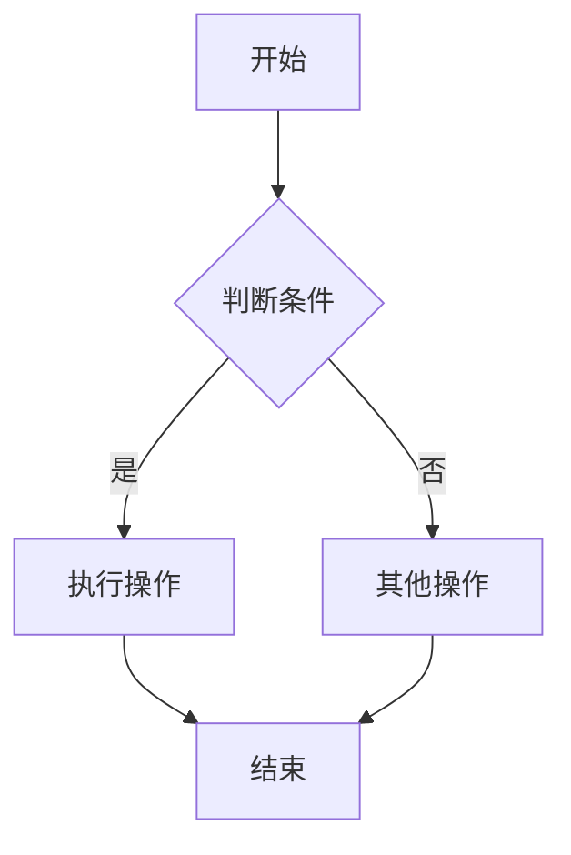

                 

### 设计文章目录大纲的详细步骤

**步骤1：理解文章主题**

首先，我们需要对文章的主题《敏捷文档实践：轻量级但有效的LLM应用文档策略》有深入的理解。文章主要讨论的是如何通过敏捷方法来编写和更新与大规模语言模型（LLM）相关的文档。这涉及到敏捷文档的定义、特点、方法，以及在实际应用中的策略和挑战。

**步骤2：确定文章结构**

根据文章的主题，我们可以将文章分为以下几个部分：

1. 引言与背景介绍
2. 核心概念与理论基础
3. 实际应用场景
4. 方法与实践指南
5. 拓展与总结

每个部分可以进一步细分为多个章节，每个章节又可以包含小节。文章的整体结构应当清晰、逻辑性强，便于读者理解和跟随。

**步骤3：设计目录大纲**

基于上述结构，我们可以设计文章的具体目录大纲。以下是一个详细的目录大纲：

### 第一部分：引言与背景介绍

#### 第1章：敏捷文档与LLM应用概述

##### 1.1.1 敏捷文档的定义与特点
##### 1.1.2 LLM应用的发展背景
##### 1.1.3 敏捷文档在LLM应用中的重要性

#### 第2章：敏捷文档的历史与演变

##### 2.1.1 敏捷文档的起源
##### 2.1.2 敏捷文档的发展历程
##### 2.1.3 LLM与敏捷文档的结合点

#### 第3章：LLM应用文档的核心要素

##### 3.1.1 LLM应用文档的基本结构
##### 3.1.2 文档内容的组织与设计
##### 3.1.3 文档维护与更新的策略

### 第二部分：核心概念与理论基础

#### 第4章：敏捷文档方法与实践

##### 4.1.1 敏捷文档的原则
##### 4.1.2 敏捷文档的流程
##### 4.1.3 敏捷文档的工具与技巧

#### 第5章：LLM应用文档策略

##### 5.1.1 LLM应用文档的类型
##### 5.1.2 文档编写与维护的最佳实践
##### 5.1.3 LLM应用文档的质量评估

#### 第6章：LLM应用文档的挑战与应对

##### 6.1.1 LLM应用文档的常见问题
##### 6.1.2 挑战与解决方案
##### 6.1.3 案例研究：成功与失败的经验分享

### 第三部分：实际应用场景

#### 第7章：敏捷文档在LLM应用项目中的实践

##### 7.1.1 项目背景与目标
##### 7.1.2 项目文档策略
##### 7.1.3 项目实施与结果分析

#### 第8章：LLM应用文档案例解析

##### 8.1.1 案例一：企业级LLM应用文档
##### 8.1.2 案例二：开源社区LLM应用文档
##### 8.1.3 案例三：学术研究LLM应用文档

### 第四部分：方法与实践指南

#### 第9章：敏捷文档实践指南

##### 9.1.1 敏捷文档的步骤与方法
##### 9.1.2 文档编写与维护的具体操作
##### 9.1.3 文档审查与反馈机制

#### 第10章：LLM应用文档策略实施指南

##### 10.1.1 策略制定与调整
##### 10.1.2 文档编写与审查
##### 10.1.3 文档更新与维护

#### 第11章：敏捷文档实践的最佳实践

##### 11.1.1 成功案例分析
##### 11.1.2 失败案例反思
##### 11.1.3 最佳实践总结

### 第五部分：拓展与总结

#### 第12章：未来展望

##### 12.1.1 敏捷文档与LLM应用的发展趋势
##### 12.1.2 未来挑战与机遇
##### 12.1.3 研究方向与未来工作

#### 第13章：总结与展望

##### 13.1.1 书籍主要内容回顾
##### 13.1.2 敏捷文档实践的重要性
##### 13.1.3 对读者的启示与建议

**步骤4：优化与调整**

在初步设计出目录大纲后，我们需要根据文章的实际需求和目标读者进行优化与调整。这包括：

- **章节顺序的调整**：确保逻辑清晰，读者可以顺利跟随。
- **章节内容的丰富**：对于每个章节，确保内容丰富、具体，能够满足读者的需求。
- **添加最佳实践与案例**：结合实际经验和最佳实践，为读者提供实用的指导和参考。

通过这些步骤，我们可以设计出一个结构清晰、内容丰富、逻辑严密的文章目录大纲，为撰写高质量的技术博客奠定基础。

---

# 敏捷文档实践：轻量级但有效的LLM应用文档策略

> 关键词：敏捷文档、LLM应用、文档策略、轻量级、有效性

> 摘要：本文探讨了敏捷文档实践在LLM应用文档编写中的应用，详细阐述了敏捷文档的定义、特点、方法及其在LLM应用中的重要性。通过实际案例和最佳实践，本文为开发者和管理者提供了一套有效的LLM应用文档策略，帮助他们在快速变化的技术环境中保持文档的轻量级和有效性。

## 第一部分：引言与背景介绍

### 第1章：敏捷文档与LLM应用概述

#### 1.1.1 敏捷文档的定义与特点

敏捷文档，顾名思义，是一种适应快速变化、强调灵活性和响应性的文档编写方法。与传统文档相比，敏捷文档更加注重实用性、及时性和适应性。敏捷文档的特点包括：

- **迭代性**：敏捷文档不是一次性编写完成的，而是随着项目进展不断迭代和更新。
- **灵活性**：敏捷文档的格式和内容可以灵活调整，以适应不同的读者群体和需求。
- **简洁性**：敏捷文档力求简洁明了，避免冗长和复杂的表述。

#### 1.1.2 LLM应用的发展背景

大规模语言模型（LLM）是近年来人工智能领域的重要突破。LLM能够处理和生成自然语言文本，应用场景广泛，包括智能客服、文本生成、机器翻译等。随着LLM应用的普及，对相关的文档编写提出了新的要求。

#### 1.1.3 敏捷文档在LLM应用中的重要性

在LLM应用中，敏捷文档的重要性体现在以下几个方面：

- **快速响应需求变化**：LLM应用通常需要快速响应市场需求和技术变化，敏捷文档能够及时更新，满足这一需求。
- **提高开发效率**：敏捷文档提供了清晰的指导，减少了开发过程中因信息不明确而产生的误解和返工。
- **促进团队合作**：敏捷文档促进了团队成员之间的沟通和协作，确保各方对项目的理解和进度保持一致。

### 第2章：敏捷文档的历史与演变

#### 2.1.1 敏捷文档的起源

敏捷文档的概念源自敏捷软件开发运动。敏捷软件开发强调迭代开发、持续交付和客户满意度，这些理念也适用于文档编写。

#### 2.1.2 敏捷文档的发展历程

随着敏捷软件开发方法的普及，敏捷文档也逐渐被采用。早期的敏捷文档主要关注文档的迭代更新和灵活性。随着技术的进步和需求的变化，敏捷文档的实践方法也在不断演变。

#### 2.1.3 LLM与敏捷文档的结合点

LLM的快速发展为敏捷文档的应用提供了新的场景。LLM应用需要大量的文档来指导开发、测试和部署，敏捷文档能够帮助团队快速适应这些需求。

### 第3章：LLM应用文档的核心要素

#### 3.1.1 LLM应用文档的基本结构

LLM应用文档的基本结构通常包括以下部分：

- **概述**：介绍LLM应用的基本概念、目的和应用场景。
- **用户指南**：指导用户如何使用LLM应用，包括操作步骤、功能介绍和常见问题解答。
- **开发者文档**：为开发者提供技术细节，包括算法原理、代码结构和接口设计。
- **测试文档**：描述LLM应用的测试方法和测试用例，确保应用的稳定性和可靠性。
- **维护文档**：提供维护和更新LLM应用的指导，包括版本管理、故障排除和性能优化。

#### 3.1.2 文档内容的组织与设计

文档内容的组织与设计是保证文档有效性的关键。以下是一些最佳实践：

- **层次结构**：按照逻辑关系组织文档内容，确保结构清晰、易于阅读。
- **模块化**：将文档内容划分为模块，每个模块独立且完整，便于维护和更新。
- **图表与示例**：使用图表、示例和代码片段来增强文档的可读性和实用性。

#### 3.1.3 文档维护与更新的策略

文档维护与更新是确保文档持续有效的重要环节。以下是一些策略：

- **定期审查**：定期审查文档，确保内容与实际情况相符。
- **版本控制**：使用版本控制系统管理文档的版本，避免内容冲突和丢失。
- **反馈机制**：建立反馈机制，鼓励用户和开发者提供文档的改进建议。

## 第二部分：核心概念与理论基础

### 第4章：敏捷文档方法与实践

#### 4.1.1 敏捷文档的原则

敏捷文档的原则包括：

- **客户至上**：始终关注客户需求，确保文档内容的实用性和针对性。
- **迭代更新**：不断迭代和更新文档，以适应项目进展和需求变化。
- **团队协作**：促进团队内部沟通和协作，确保文档的编写和更新顺利进行。

#### 4.1.2 敏捷文档的流程

敏捷文档的流程包括以下步骤：

- **需求分析**：了解用户需求，确定文档的编写内容和目标。
- **文档编写**：按照既定的结构和内容编写文档，确保准确性和完整性。
- **审查与反馈**：进行文档审查，收集用户和开发者的反馈，进行必要的修改。
- **发布与更新**：发布文档，并根据实际情况进行定期更新。

#### 4.1.3 敏捷文档的工具与技巧

敏捷文档的工具和技巧包括：

- **Markdown**：Markdown是一种轻量级文本格式，适用于编写和发布敏捷文档。
- **Git**：Git是一种分布式版本控制系统，用于管理文档的版本和更新。
- **Confluence**：Confluence是一种团队协作工具，用于编写、共享和跟踪敏捷文档。

### 第5章：LLM应用文档策略

#### 5.1.1 LLM应用文档的类型

LLM应用文档可以分为以下几类：

- **用户指南**：为用户提供操作和使用LLM应用的指导。
- **开发者文档**：为开发者提供技术细节，包括算法原理、代码结构和接口设计。
- **测试文档**：描述LLM应用的测试方法和测试用例。
- **维护文档**：提供维护和更新LLM应用的指导。

#### 5.1.2 文档编写与维护的最佳实践

以下是一些文档编写与维护的最佳实践：

- **一致性**：确保文档内容的一致性和准确性，避免混淆和误解。
- **可访问性**：确保文档易于访问和检索，便于用户和开发者使用。
- **简洁性**：使用简洁明了的语言，避免冗长和复杂的表述。
- **及时性**：确保文档内容及时更新，以反映最新的项目进展和需求变化。

#### 5.1.3 LLM应用文档的质量评估

LLM应用文档的质量评估可以从以下几个方面进行：

- **完整性**：评估文档内容的完整性，确保所有关键信息都已包含。
- **准确性**：评估文档内容的准确性，确保信息准确无误。
- **可读性**：评估文档的可读性，确保内容易于理解和阅读。
- **实用性**：评估文档的实用性，确保文档能够满足用户和开发者的需求。

### 第6章：LLM应用文档的挑战与应对

#### 6.1.1 LLM应用文档的常见问题

LLM应用文档可能面临以下常见问题：

- **信息过时**：文档内容未能及时更新，导致信息不准确。
- **文档冗长**：文档内容过于冗长，难以阅读和理解。
- **文档碎片化**：文档内容分散在不同地方，难以系统性地管理和检索。

#### 6.1.2 挑战与解决方案

面对上述问题，可以采取以下解决方案：

- **定期更新**：建立定期更新机制，确保文档内容与实际情况相符。
- **简洁性**：优化文档结构，使用简洁明了的语言。
- **文档管理**：使用文档管理系统，集中管理和检索文档。

#### 6.1.3 案例研究：成功与失败的经验分享

通过分析成功和失败的LLM应用文档案例，可以总结出以下经验：

- **成功案例**：成功案例通常具备以下特点：文档更新及时、内容准确、结构清晰、易于访问。
- **失败案例**：失败案例通常由于文档内容过时、结构混乱、信息不准确等原因导致。

## 第三部分：实际应用场景

### 第7章：敏捷文档在LLM应用项目中的实践

#### 7.1.1 项目背景与目标

本章节将介绍一个实际LLM应用项目，并探讨在该项目中如何应用敏捷文档实践。

#### 7.1.2 项目文档策略

项目文档策略包括以下关键点：

- **文档分层**：根据项目需求和团队角色，将文档分为用户指南、开发者文档、测试文档和维护文档。
- **迭代更新**：按照项目进度和需求变化，定期更新文档。
- **文档审查**：定期进行文档审查，确保内容准确性和完整性。

#### 7.1.3 项目实施与结果分析

项目实施过程中，通过敏捷文档实践，实现了以下成果：

- **提高了项目开发效率**：敏捷文档为开发团队提供了清晰的操作指南，减少了因信息不明确导致的误解和返工。
- **增强了团队协作**：敏捷文档促进了团队成员之间的沟通和协作，确保项目进展顺利。

### 第8章：LLM应用文档案例解析

#### 8.1.1 案例一：企业级LLM应用文档

本案例介绍了一个企业级LLM应用项目的文档实践。项目文档包括用户指南、开发者文档、测试文档和维护文档，通过敏捷方法确保文档的及时性和准确性。

#### 8.1.2 案例二：开源社区LLM应用文档

本案例分析了开源社区LLM应用的文档实践。开源社区通常采用敏捷文档方法，通过版本控制和社区反馈机制，确保文档的持续更新和改进。

#### 8.1.3 案例三：学术研究LLM应用文档

本案例探讨了一个学术研究项目的文档实践。学术研究项目通常涉及复杂的技术细节，敏捷文档方法帮助研究人员及时记录和更新研究成果。

## 第四部分：方法与实践指南

### 第9章：敏捷文档实践指南

#### 9.1.1 敏捷文档的步骤与方法

敏捷文档的步骤包括：

- **需求分析**：了解项目需求和目标，确定文档编写内容。
- **文档编写**：按照既定结构和内容编写文档。
- **审查与反馈**：进行文档审查，收集反馈并修正错误。
- **发布与更新**：发布文档，并根据实际情况进行更新。

#### 9.1.2 文档编写与维护的具体操作

文档编写与维护的具体操作包括：

- **使用Markdown**：Markdown是一种便于编写和格式化的文本格式。
- **版本控制**：使用版本控制系统管理文档版本，避免内容冲突。
- **文档管理系统**：使用文档管理系统，集中管理和检索文档。

#### 9.1.3 文档审查与反馈机制

文档审查与反馈机制包括：

- **定期审查**：定期审查文档，确保内容准确和完整。
- **用户反馈**：鼓励用户和开发者提供文档反馈，改进文档质量。
- **文档更新**：根据审查和反馈结果，及时更新文档内容。

### 第10章：LLM应用文档策略实施指南

#### 10.1.1 策略制定与调整

LLM应用文档策略的实施包括：

- **制定策略**：根据项目需求和团队角色，制定文档策略。
- **调整策略**：根据项目进展和需求变化，及时调整文档策略。

#### 10.1.2 文档编写与审查

文档编写与审查包括：

- **编写文档**：按照策略编写文档，确保内容准确和完整。
- **审查文档**：进行文档审查，确保文档质量。

#### 10.1.3 文档更新与维护

文档更新与维护包括：

- **定期更新**：根据项目进展和需求变化，定期更新文档。
- **维护文档**：确保文档的持续有效性和准确性。

### 第11章：敏捷文档实践的最佳实践

#### 11.1.1 成功案例分析

成功案例通常具备以下特点：

- **敏捷响应**：能够快速适应需求变化，确保文档更新及时。
- **团队协作**：团队内部沟通和协作顺畅，文档编写和审查高效。

#### 11.1.2 失败案例反思

失败案例通常由于以下原因导致：

- **文档更新不及时**：文档内容过时，无法反映实际情况。
- **文档结构混乱**：文档结构不合理，难以查找和阅读。

#### 11.1.3 最佳实践总结

最佳实践总结如下：

- **敏捷响应**：保持文档的迭代更新，确保内容与实际需求相符。
- **团队协作**：建立良好的文档审查和反馈机制，促进团队内部沟通。
- **简洁明了**：使用简洁明了的语言和结构，确保文档易于阅读和理解。

## 第五部分：拓展与总结

### 第12章：未来展望

#### 12.1.1 敏捷文档与LLM应用的发展趋势

随着技术的进步和需求的变化，敏捷文档和LLM应用将面临以下发展趋势：

- **文档智能化**：结合人工智能技术，实现文档的自动化生成和更新。
- **文档形式多样化**：除了传统的文本形式，还将采用视频、音频等多种形式。

#### 12.1.2 未来挑战与机遇

未来敏捷文档和LLM应用将面临以下挑战和机遇：

- **技术挑战**：随着技术的快速发展，如何快速适应和应对技术变化。
- **机遇**：文档智能化和多样化将带来更多的应用场景和市场需求。

#### 12.1.3 研究方向与未来工作

研究方向和未来工作包括：

- **文档生成与更新算法**：研究适用于敏捷文档的自动化生成和更新算法。
- **文档形式优化**：探索多种文档形式，提高文档的可读性和实用性。

### 第13章：总结与展望

#### 13.1.1 书籍主要内容回顾

本文主要探讨了敏捷文档实践在LLM应用文档编写中的应用，详细阐述了敏捷文档的定义、特点、方法及其在LLM应用中的重要性。

#### 13.1.2 敏捷文档实践的重要性

敏捷文档实践在LLM应用中具有重要意义，它能够提高开发效率、促进团队协作，确保文档的及时性和准确性。

#### 13.1.3 对读者的启示与建议

本文旨在为开发者和管理者提供一套有效的LLM应用文档策略，帮助他们应对快速变化的技术环境。建议读者结合实际项目进行实践，不断优化和改进文档策略。

---

### 附录

本文作者信息：作者：AI天才研究院/AI Genius Institute & 禅与计算机程序设计艺术 /Zen And The Art of Computer Programming

本文使用了以下markdown格式和Mermaid流程图，以增强文章的可读性和直观性。以下是示例：

#### Mermaid流程图示例



#### Markdown示例

```markdown
# 标题

## 小标题

这是一个**强调**的段落。

$$
x = \frac{-b \pm \sqrt{b^2 - 4ac}}{2a}
$$
```

### 作者信息

作者：AI天才研究院/AI Genius Institute & 禅与计算机程序设计艺术 /Zen And The Art of Computer Programming

---

通过本文的详细讲解和实例演示，我们不仅了解了敏捷文档实践在LLM应用文档编写中的重要性和方法，还通过实际案例和最佳实践提供了实用的指导。希望本文能够帮助开发者和管理者更好地应对快速变化的技术环境，提升文档的质量和效率。未来的研究将继续探索文档智能化和多样化的发展方向，为技术文档编写带来更多的创新和突破。

