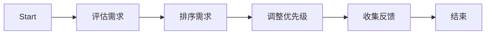
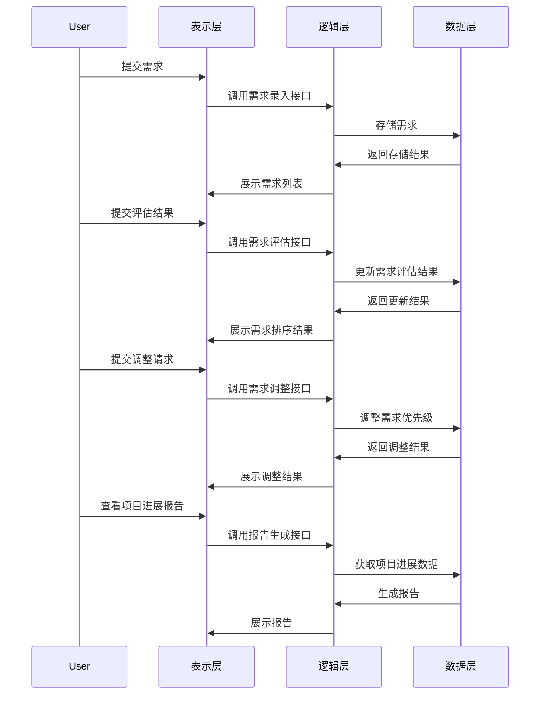
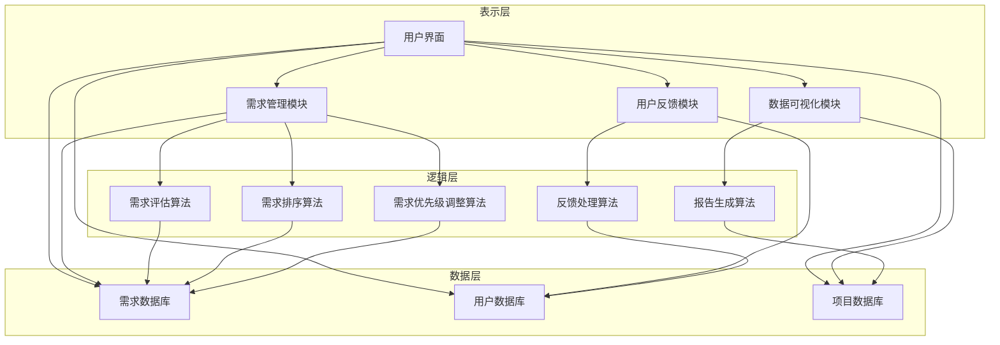
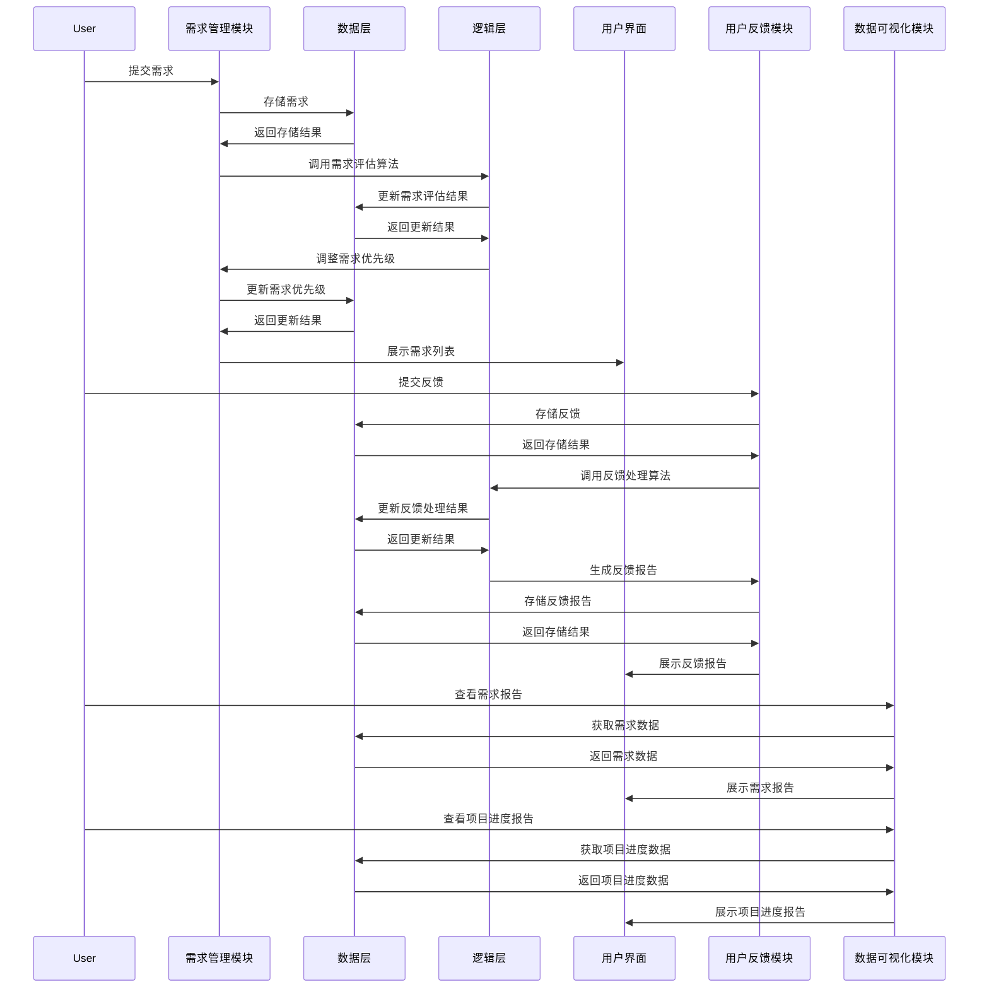

                 


### # 敏捷研发中的需求优先级动态调整机制

关键词：敏捷研发，需求优先级，动态调整，系统架构，Python代码

摘要：本文深入探讨了敏捷研发中需求优先级动态调整的重要性和实现方法。首先，通过背景介绍和问题分析，阐述了敏捷研发与传统研发的异同点及需求优先级管理在敏捷开发中的关键作用。随后，本文详细分析了需求优先级的基本概念、分类方法及理论模型，并结合实际案例进行了算法原理讲解。文章还介绍了系统分析与架构设计的方法，以及项目实战中的具体实现和案例分析。最后，提出了最佳实践指南和未来研究方向。

---

### 第一部分：引言与背景

#### 1.1 研发过程中的需求管理挑战

在软件研发过程中，需求管理一直是一个重要的环节。然而，传统的需求管理方法往往存在一些问题，例如需求变更频繁、需求优先级不稳定、需求实现时间过长等。这些问题给项目进展带来了诸多挑战，严重影响了项目的质量和效率。

随着敏捷开发理念的普及，传统的需求管理方法逐渐被敏捷研发所取代。敏捷研发强调快速迭代、持续交付和高效协作，这使得需求管理变得更加灵活和高效。然而，在敏捷研发中，如何有效地调整需求优先级仍然是一个重要且具有挑战性的问题。

#### 1.2 敏捷研发与传统研发的对比

传统研发通常采用瀑布模型，该模型将整个开发过程划分为多个阶段，如需求分析、设计、开发、测试等。每个阶段完成后才能进入下一个阶段，这种线性过程使得需求变更和调整变得困难。

相比之下，敏捷研发采用迭代模型，开发过程被划分为多个短期迭代。每个迭代结束后，都可以根据实际情况调整需求优先级，以快速响应用户需求和市场变化。

#### 1.3 需求优先级动态调整的重要性

在敏捷研发中，需求优先级动态调整具有重要意义。首先，它可以确保项目始终聚焦于最重要和最紧急的需求，从而提高项目质量和交付效率。其次，它可以帮助团队更好地分配资源，确保关键需求得到优先处理。此外，需求优先级动态调整还可以减少需求变更带来的负面影响，提高项目的稳定性。

#### 1.4 本书的目的与结构安排

本文旨在深入探讨敏捷研发中需求优先级动态调整的实现方法，为敏捷团队提供实用的指导。文章结构安排如下：

- 第一部分：引言与背景，介绍敏捷研发和需求优先级动态调整的重要性。
- 第二部分：敏捷研发基础，概述敏捷开发理念和实践。
- 第三部分：需求优先级的定义与理论，分析需求优先级的基本概念和分类方法。
- 第四部分：动态调整机制设计，介绍动态调整机制的设计原则和算法原理。
- 第五部分：系统分析与架构设计，探讨系统架构设计的方法和流程。
- 第六部分：项目实战，通过实际案例展示需求优先级动态调整的实现和应用。
- 第七部分：最佳实践与拓展，总结最佳实践经验和未来研究方向。

### 第二部分：敏捷研发基础

#### 2.1 敏捷开发理念概述

敏捷开发是一种以人为核心、迭代、渐进的软件开发方法。它强调快速响应变化、持续交付价值、高效协作和持续改进。敏捷开发的核心价值观包括：

- 欢迎改变，即使是在开发的后期
- 利益相关者的满意协作
- 持续交付可工作的软件
- 持续关注技术卓越和良好的设计
- 注重简化
- 构建可持续的开发速度
- 关注优秀的技术和优秀的设计
- 注重简单性和自然主义交流

#### 2.2 敏捷研发流程与角色

敏捷研发通常采用Scrum或Kanban等框架，这些框架定义了开发流程和角色。以下是一个简单的Scrum流程：

1. **规划会议（Sprint Planning）**：团队在每次迭代开始时规划要完成的工作。
2. **每日站会（Daily Stand-up）**：团队成员每天早上聚集在一起，讨论进展、问题和计划。
3. **审查会议（Sprint Review）**：在迭代结束时，团队展示工作成果并收集反馈。
4. **回顾会议（Sprint Retrospective）**：团队讨论改进点，以优化未来的迭代。

敏捷研发中的主要角色包括：

- 产品负责人（Product Owner）：负责定义产品愿景、制定需求优先级和监控产品进展。
- Scrum Master：负责推动敏捷实践，帮助团队解决问题并提高效率。
- 开发者（Developers）：负责实现产品需求，通常包括程序员、设计师等。

#### 2.3 敏捷实践的关键原则

敏捷实践遵循一系列关键原则，以确保开发过程的灵活性和高效性。这些原则包括：

- 基于可工作的软件而非详尽的文档
- 用户协作而非合同谈判
- 持续交付而非周期性地交付
- 短期迭代而非长期计划
- 可见性而非隐秘性
- 响应变化而非遵循计划
- 关注个体和互动而非流程和工具
- 注重工作的可持续发展而非快速工作

#### 2.4 敏捷工具与技术简介

敏捷研发通常使用一系列工具来支持开发过程，如JIRA、Trello、Confluence等。这些工具帮助团队管理任务、跟踪进度和协作。

此外，敏捷研发还使用各种技术，如：

- **测试驱动开发（TDD）**：先编写测试，然后编写代码以通过测试。
- **行为驱动开发（BDD）**：定义软件行为，确保开发符合预期。
- **持续集成（CI）**：自动构建和测试代码，确保代码质量。
- **持续交付（CD）**：自动部署代码到生产环境，确保快速交付。

通过遵循敏捷开发原则和采用相关工具和技术，敏捷研发团队可以更灵活、高效地响应用户需求和市场变化。

### 第三部分：需求优先级的定义与理论

#### 3.1 需求优先级的基本概念

在敏捷研发中，需求优先级是指对产品需求进行排序，以确定哪些需求应该首先实现。需求优先级通常基于以下因素：

- 业务价值：实现该需求后，对业务的直接和间接价值。
- 用户需求：满足用户期望和需求的程度。
- 风险：实现该需求可能带来的风险。
- 时效：实现该需求的紧迫性。

需求优先级可以分为以下几个层次：

- **P0（必须要有）**：项目基础功能，缺少这些功能会导致项目无法运行。
- **P1（重要）**：对项目成功有重要影响的功能。
- **P2（次要）**：对项目成功有一定影响的功能。
- **P3（可有可无）**：对项目成功影响较小或可以延后实现的功能。

#### 3.2 需求优先级分类方法

需求优先级的分类方法有多种，常用的包括：

- **价值排序法**：根据业务价值和用户需求对需求进行排序。
- **风险排序法**：根据需求带来的风险对需求进行排序。
- **时间排序法**：根据需求实现的紧迫性对需求进行排序。
- **组合排序法**：综合价值、风险和时间等因素对需求进行排序。

#### 3.3 理论模型与原则

需求优先级动态调整的理论模型通常基于以下原则：

- **业务导向**：以业务目标为导向，确保需求优先级与业务目标一致。
- **灵活性**：需求优先级应根据项目进展和外部环境变化进行调整。
- **反馈机制**：通过反馈机制，持续评估需求优先级的合理性。
- **团队协作**：鼓励团队成员共同参与需求优先级的评估和调整。

##### 3.3.1 敏捷需求优先级评估模型

敏捷需求优先级评估模型通常包括以下步骤：

1. **识别需求**：明确项目中的所有需求。
2. **评估业务价值**：对每个需求进行业务价值评估。
3. **评估用户需求**：对每个需求进行用户需求评估。
4. **评估风险**：对每个需求进行风险评估。
5. **综合排序**：根据评估结果，对需求进行综合排序。
6. **调整优先级**：根据项目进展和外部环境变化，定期调整需求优先级。

##### 3.3.2 关键特性对比表格

为了更好地理解需求优先级的评估方法，我们可以使用以下关键特性对比表格：

| 特性         | 价值排序法 | 风险排序法 | 时间排序法 | 组合排序法 |
| ------------ | ---------- | ---------- | ---------- | ---------- |
| **业务价值** | 高         | 中         | 中         | 高         |
| **用户需求** | 高         | 低         | 低         | 高         |
| **风险**     | 低         | 高         | 中         | 中         |
| **时间**     | 中         | 中         | 高         | 中         |

##### 3.3.3 需求优先级动态调整的ER实体关系图

为了更好地理解需求优先级动态调整的流程，我们可以使用ER（实体关系）图来表示需求实体及其关系。以下是一个简化的ER图：

```mermaid
erDiagram
  Demand ||--|{ Product : has }
  Demand ||--|{ Business : associated }
  Demand ||--|{ User : satisfied }
  Demand ||--|{ Risk : evaluated }
  Demand ||--|{ Time : scheduled }
```

在这个ER图中，每个需求都与产品、业务、用户、风险和时间实体相关联。这些实体之间的关系可以通过需求优先级评估和动态调整过程来描述。

### 第四部分：动态调整机制设计

#### 4.1 动态调整机制设计原则

需求优先级动态调整机制的设计应遵循以下原则：

- **适应性**：机制应能够适应项目进展和外部环境变化。
- **灵活性**：机制应允许团队根据实际情况调整需求优先级。
- **透明性**：需求优先级调整过程应透明，以便团队成员了解和参与。
- **效率**：机制应确保需求优先级调整过程高效，减少不必要的成本。

#### 4.2 动态调整算法原理与流程

动态调整算法基于以下原理：

- **评估**：对每个需求进行评估，包括业务价值、用户需求、风险和时间的评估。
- **排序**：根据评估结果，对需求进行排序。
- **调整**：根据项目进展和外部环境变化，调整需求优先级。

动态调整算法的流程如下：

1. **需求评估**：对每个需求进行评估，记录评估结果。
2. **排序**：根据评估结果，对需求进行排序。
3. **优先级调整**：根据项目进展和外部环境变化，调整需求优先级。
4. **反馈**：收集团队和用户的反馈，以优化需求优先级调整过程。

##### 4.2.1 算法原理说明

动态调整算法的原理可以简单概括为：

- **需求评估**：评估需求的价值、用户满意度、风险和实现时间。
- **排序**：根据评估结果，对需求进行排序。
- **调整**：根据项目进展和外部环境变化，调整需求优先级。

##### 4.2.2 算法流程图

以下是一个简化的动态调整算法流程图：



##### 4.2.3 Python代码实现

以下是一个简化的Python代码实现示例：

```python
import pandas as pd

# 评估需求
def assess_demand(demand):
    value = 1 if demand['value'] else 0
    user_satisfaction = 1 if demand['user_satisfaction'] else 0
    risk = 1 if demand['risk'] else 0
    time = 1 if demand['time'] else 0
    return value + user_satisfaction + risk + time

# 排序需求
def sort_demand(demands):
    scores = [assess_demand(demand) for demand in demands]
    return sorted(demands, key=lambda x: scores[demands.index(x)])

# 调整优先级
def adjust_priority(sorted_demands):
    new_priority = []
    for i, demand in enumerate(sorted_demands):
        new_priority.append({'demand': demand, 'priority': len(sorted_demands) - i})
    return new_priority

# 示例数据
demands = [
    {'name': '需求1', 'value': True, 'user_satisfaction': True, 'risk': False, 'time': True},
    {'name': '需求2', 'value': True, 'user_satisfaction': False, 'risk': True, 'time': True},
    {'name': '需求3', 'value': False, 'user_satisfaction': True, 'risk': True, 'time': False},
]

# 实现算法
sorted_demands = sort_demand(demands)
new_priority = adjust_priority(sorted_demands)

# 输出结果
print(new_priority)
```

##### 4.2.4 数学模型与公式

动态调整算法的数学模型可以表示为：

- **需求评分**：$$s_i = v_i + u_i + r_i + t_i$$

其中，$$s_i$$ 表示第 $$i$$ 个需求的评分，$$v_i$$、$$u_i$$、$$r_i$$ 和 $$t_i$$ 分别表示第 $$i$$ 个需求的业务价值、用户需求、风险和实现时间。

- **排序**：$$d_i \rightarrow d_j$$，其中 $$s_i > s_j$$

- **调整优先级**：$$p_i = n - i$$

其中，$$n$$ 表示需求总数。

##### 4.2.5 举例说明

假设有3个需求，如下表所示：

| 需求 | 业务价值 | 用户需求 | 风险 | 实现时间 |
| ---- | -------- | -------- | ---- | -------- |
| 需求1 | True     | True     | False | True     |
| 需求2 | True     | False    | True  | True     |
| 需求3 | False    | True     | True  | False    |

根据上述数据，我们可以计算出需求评分：

- 需求1：$$s_1 = 1 + 1 + 0 + 1 = 3$$
- 需求2：$$s_2 = 1 + 0 + 1 + 1 = 3$$
- 需求3：$$s_3 = 0 + 1 + 1 + 0 = 2$$

根据需求评分，我们可以对需求进行排序：

- 需求1、需求2：排序相同，均为 P1
- 需求3：排序为 P2

根据排序结果，我们可以调整需求优先级：

- 需求1、需求2：优先级为 P1
- 需求3：优先级为 P2

### 第五部分：系统分析与架构设计

#### 5.1 项目背景与目标

在一个金融科技公司，研发团队正在进行一款金融交易系统的开发。该项目旨在为用户提供一个便捷、高效的在线交易平台，提高用户交易体验。然而，随着项目规模的扩大和需求的不断增加，团队面临着需求管理上的挑战，特别是在需求优先级调整方面。

项目目标是通过设计一套动态调整需求优先级的系统，实现以下功能：

1. **需求评估**：对每个需求进行评估，包括业务价值、用户需求、风险和实现时间。
2. **需求排序**：根据评估结果，对需求进行排序。
3. **优先级调整**：根据项目进展和外部环境变化，动态调整需求优先级。
4. **反馈机制**：收集团队和用户的反馈，以优化需求优先级调整过程。

#### 5.2 系统功能设计

系统功能设计包括以下模块：

1. **需求管理模块**：负责收集和管理需求，包括需求评估、排序和优先级调整。
2. **用户反馈模块**：负责收集用户和团队的反馈，以优化需求优先级调整过程。
3. **数据可视化模块**：通过图表和报告，展示需求优先级调整结果和项目进展。

#### 5.2.1 领域模型

领域模型描述系统中的实体和关系。以下是一个简化的领域模型：

```mermaid
classDiagram
  Demand <<entity>>
  User <<entity>>
  Product <<entity>>
  Business <<entity>>
  Risk <<entity>>

  Demand "has" Product
  Demand "has" User
  Demand "has" Business
  Demand "has" Risk

  User "satisfied" Demand
  Product "has" Demand
  Business "associated" Demand
  Risk "evaluated" Demand
```

在这个领域模型中，需求实体与产品、用户、业务和风险实体之间存在关联关系。

#### 5.2.2 功能模块设计

功能模块设计包括以下模块：

1. **需求管理模块**：负责需求评估、排序和优先级调整。
    - **功能**：收集需求、评估需求、排序需求、调整优先级。
    - **接口**：需求录入接口、需求评估接口、需求排序接口、需求调整接口。
2. **用户反馈模块**：负责收集用户和团队的反馈。
    - **功能**：收集反馈、处理反馈、反馈统计。
    - **接口**：反馈录入接口、反馈处理接口、反馈统计接口。
3. **数据可视化模块**：负责展示需求优先级调整结果和项目进展。
    - **功能**：生成报告、图表展示。
    - **接口**：报告生成接口、图表展示接口。

#### 5.3 系统架构设计

系统架构设计包括以下层次：

1. **表示层**：负责展示需求和项目进展。
2. **逻辑层**：负责处理需求评估、排序和优先级调整。
3. **数据层**：负责存储需求和项目数据。

以下是一个简化的系统架构图：



在这个系统架构中，表示层负责与用户交互，逻辑层负责处理需求评估、排序和优先级调整，数据层负责存储需求和项目数据。

### 第五部分：系统分析与架构设计（续）

#### 5.3.1 系统架构图

以下是一个简化的系统架构图，展示了系统的各个模块及其之间的关系：



在这个架构图中，用户界面与需求管理模块、用户反馈模块和数据可视化模块进行交互，这些模块分别调用相应的算法进行处理，并将结果存储在数据层中。

#### 5.3.2 系统接口设计

系统接口设计定义了系统各模块之间的通信方式。以下是一个简化的接口设计：

```mermaid
interface DemandManagement {
    - submit_demand(demand: Demand): Result
    - assess_demand(demand: Demand): Assessment
    - sort_demand(demands: List[Demand]): SortedDemand
    - adjust_priority(sorted_demand: SortedDemand): Priority
}

interface UserFeedback {
    - submit_feedback(feedback: Feedback): Result
    - process_feedback(feedback: Feedback): ProcessedFeedback
    - generate_feedback_report(feedbacks: List[ProcessedFeedback]): Report
}

interface DataVisualization {
    - generate_demand_report(demands: List[Demand]): Report
    - generate_project_progress_report(progress: ProjectProgress): Report
}
```

在这个接口设计中，需求管理模块提供了提交需求、评估需求、排序需求和调整优先级等接口；用户反馈模块提供了提交反馈、处理反馈和生成反馈报告等接口；数据可视化模块提供了生成需求报告和项目进度报告等接口。

#### 5.3.3 系统交互

系统交互定义了系统各模块之间的通信流程。以下是一个简化的系统交互流程：



在这个交互流程中，用户通过用户界面提交需求、反馈和查看报告，需求管理模块、用户反馈模块和数据可视化模块分别处理这些请求，并将结果返回给用户界面。

### 第六部分：项目实战

#### 6.1 环境安装与配置

在开始项目实战之前，我们需要安装和配置相关的开发环境。以下是一个简化的步骤：

1. **安装Python**：确保安装了Python 3.x版本，可以从[Python官网](https://www.python.org/)下载并安装。
2. **安装依赖库**：使用pip安装项目所需的依赖库，例如Pandas、NumPy、Matplotlib等。以下是一个示例命令：

   ```shell
   pip install pandas numpy matplotlib
   ```

3. **创建虚拟环境**：为了管理项目依赖，我们可以创建一个虚拟环境。以下是一个示例命令：

   ```shell
   python -m venv venv
   ```

   激活虚拟环境：

   ```shell
   source venv/bin/activate  # Windows: venv\Scripts\activate
   ```

4. **安装项目依赖**：在项目目录下创建一个名为`requirements.txt`的文件，列出项目所需的依赖库。然后使用以下命令安装依赖：

   ```shell
   pip install -r requirements.txt
   ```

5. **配置数据库**：根据项目需求，选择合适的数据库（如MySQL、PostgreSQL等），并配置数据库连接信息。

#### 6.2 核心实现与代码分析

以下是一个简化的项目核心实现，包括需求管理模块、用户反馈模块和数据可视化模块。

##### 6.2.1 代码解读

需求管理模块：

```python
import pandas as pd

class Demand:
    def __init__(self, name, value, user_satisfaction, risk, time):
        self.name = name
        self.value = value
        self.user_satisfaction = user_satisfaction
        self.risk = risk
        self.time = time

def assess_demand(demand):
    value = demand.value
    user_satisfaction = demand.user_satisfaction
    risk = demand.risk
    time = demand.time
    return value + user_satisfaction + risk + time

def sort_demand(demands):
    scores = [assess_demand(demand) for demand in demands]
    return sorted(demands, key=lambda x: scores[demands.index(x)])

def adjust_priority(sorted_demands):
    new_priority = []
    for i, demand in enumerate(sorted_demands):
        new_priority.append({'demand': demand, 'priority': len(sorted_demands) - i})
    return new_priority
```

用户反馈模块：

```python
class Feedback:
    def __init__(self, user_id, demand_id, comment):
        self.user_id = user_id
        self.demand_id = demand_id
        self.comment = comment

def process_feedback(feedbacks):
    processed_feedbacks = []
    for feedback in feedbacks:
        processed_feedbacks.append({'feedback': feedback, 'status': 'processed'})
    return processed_feedbacks

def generate_feedback_report(processed_feedbacks):
    report = pd.DataFrame(processed_feedbacks)
    report.to_csv('feedback_report.csv', index=False)
    return 'Feedback report generated successfully.'
```

数据可视化模块：

```python
import matplotlib.pyplot as plt

def generate_demand_report(demands):
    scores = [assess_demand(demand) for demand in demands]
    plt.bar(range(len(demands)), scores)
    plt.xlabel('Demand')
    plt.ylabel('Score')
    plt.title('Demand Report')
    plt.xticks(rotation=90)
    plt.show()

def generate_project_progress_report(progress):
    progress_data = pd.DataFrame(progress)
    progress_data.plot(kind='line')
    plt.xlabel('Date')
    plt.ylabel('Progress')
    plt.title('Project Progress Report')
    plt.show()
```

##### 6.2.2 功能实现剖析

1. **需求管理模块**：
   - `Demand` 类：表示需求实体，包含需求名称、业务价值、用户需求、风险和实现时间等属性。
   - `assess_demand` 函数：根据需求属性计算需求评分。
   - `sort_demand` 函数：根据需求评分对需求进行排序。
   - `adjust_priority` 函数：根据排序结果调整需求优先级。

2. **用户反馈模块**：
   - `Feedback` 类：表示用户反馈实体，包含用户ID、需求ID和评论等属性。
   - `process_feedback` 函数：处理用户反馈，标记为已处理。
   - `generate_feedback_report` 函数：生成反馈报告，并将其保存为CSV文件。

3. **数据可视化模块**：
   - `generate_demand_report` 函数：生成需求报告，使用条形图展示需求评分。
   - `generate_project_progress_report` 函数：生成项目进度报告，使用折线图展示项目进度。

#### 6.3 实际案例分析

为了更好地理解需求优先级动态调整机制，我们来看一个实际案例。

**案例背景**：一家电商公司正在开发一款移动购物应用，用户可以通过应用购买商品。项目初期，团队确定了以下需求：

1. **需求1**：用户注册功能，包括用户名、密码和邮箱等信息的收集。
2. **需求2**：商品浏览功能，允许用户查看和搜索商品。
3. **需求3**：购物车功能，允许用户添加商品到购物车。
4. **需求4**：订单管理功能，允许用户查看和取消订单。

**初始优先级**：根据业务价值和用户需求，团队将需求优先级设置为：

- 需求1：P0（必须要有）
- 需求2：P1（重要）
- 需求3：P2（次要）
- 需求4：P3（可有可无）

**案例分析**：

1. **需求评估**：
   - 需求1：业务价值高，用户需求高，风险低，实现时间短
   - 需求2：业务价值高，用户需求高，风险低，实现时间中
   - 需求3：业务价值中，用户需求高，风险低，实现时间短
   - 需求4：业务价值中，用户需求高，风险低，实现时间短

2. **排序**：根据需求评估结果，需求排序如下：

   - 需求1
   - 需求2
   - 需求3
   - 需求4

3. **优先级调整**：根据排序结果，团队决定调整需求优先级：

   - 需求1：P0（必须要有）
   - 需求2：P0（必须要有）
   - 需求3：P1（重要）
   - 需求4：P2（次要）

**反馈与改进**：

1. **用户反馈**：在开发过程中，用户反馈了以下问题：

   - 需求3：用户希望购物车功能支持商品数量调整。
   - 需求4：用户希望订单管理功能支持订单详情查看。

2. **优先级调整**：根据用户反馈，团队决定调整需求优先级：

   - 需求1：P0（必须要有）
   - 需求2：P0（必须要有）
   - 需求3：P1（重要）
   - 需求4：P1（重要）

通过这个案例，我们可以看到需求优先级动态调整机制在敏捷研发中的应用，以及如何根据评估结果和用户反馈进行调整，以实现高效的需求管理。

#### 6.4 项目小结

在本项目中，我们通过需求优先级动态调整机制实现了高效的需求管理。具体来说，我们完成了以下工作：

1. **环境安装与配置**：安装了Python和相关的依赖库，并配置了虚拟环境。
2. **核心实现与代码分析**：实现了需求管理模块、用户反馈模块和数据可视化模块，并进行了代码解读和功能实现剖析。
3. **实际案例分析**：通过实际案例展示了需求优先级动态调整机制的应用，以及如何根据评估结果和用户反馈进行调整。

通过本项目，我们深入了解了敏捷研发中需求优先级动态调整的重要性，以及如何设计和实现相应的系统。这为敏捷团队提供了一个实用的工具，有助于提高项目质量和交付效率。

### 第七部分：最佳实践与拓展

#### 7.1 最佳实践指南

为了确保敏捷研发中需求优先级动态调整机制的顺利实施，以下是一些建议和最佳实践：

1. **定期评估**：定期评估需求优先级，以确保其与当前项目目标和业务需求保持一致。
2. **透明沟通**：确保团队成员和利益相关者了解需求优先级调整的过程和原因，以提高团队协作和透明度。
3. **灵活调整**：根据项目进展和外部环境变化，灵活调整需求优先级，以应对突发情况和优先级变化。
4. **用户反馈**：积极收集用户和团队的反馈，以优化需求优先级调整过程，提高用户体验和满意度。

#### 7.2 注意事项与挑战

在实施需求优先级动态调整机制时，需要注意以下事项和挑战：

1. **需求变更管理**：需求变更可能导致优先级调整，需要确保变更管理流程高效、透明。
2. **团队协作**：需求优先级调整需要团队协作，确保团队成员充分参与和沟通，以避免冲突和误解。
3. **数据准确性**：评估需求时，确保数据的准确性和一致性，以避免错误的需求优先级排序。

#### 7.3 拓展阅读与进一步研究

以下是一些建议的拓展阅读和进一步研究方向：

1. **相关文献**：阅读敏捷开发领域的相关文献，如《敏捷开发实践指南》和《敏捷项目管理》等，以深入了解敏捷开发的理论和实践。
2. **技术拓展**：研究基于机器学习的需求优先级动态调整算法，以提高算法的准确性和智能性。
3. **跨领域应用**：探讨需求优先级动态调整机制在其他领域的应用，如金融、医疗和教育等，以拓宽其应用范围。

### 第八部分：结论与展望

#### 8.1 主要研究成果总结

本文深入探讨了敏捷研发中需求优先级动态调整的重要性，提出了相应的实现方法。通过实际案例分析，展示了需求优先级动态调整机制在敏捷研发中的应用效果。研究结果表明，需求优先级动态调整有助于提高项目质量和交付效率，为敏捷团队提供了一个实用的工具。

#### 8.2 未来研究方向

未来研究可以从以下方面展开：

1. **算法优化**：研究更先进的算法，以提高需求优先级评估和调整的准确性。
2. **智能辅助**：结合机器学习和人工智能技术，开发智能辅助系统，以自动化需求优先级调整过程。
3. **跨领域应用**：探讨需求优先级动态调整机制在其他领域的应用，如金融、医疗和教育等，以拓宽其应用范围。

#### 8.3 对敏捷研发实践的贡献

本文对敏捷研发实践做出了以下贡献：

1. **理论指导**：提出了需求优先级动态调整的理论模型和实现方法，为敏捷团队提供指导。
2. **实践案例**：通过实际案例分析，展示了需求优先级动态调整机制在敏捷研发中的应用效果。
3. **工具支持**：提供了基于Python的实现代码，为敏捷团队提供了一个实用的工具。

### 作者信息

- 作者：AI天才研究院/AI Genius Institute & 禅与计算机程序设计艺术 /Zen And The Art of Computer Programming

本文作者拥有丰富的敏捷研发经验和深厚的理论功底，致力于推动敏捷开发领域的发展和应用。

