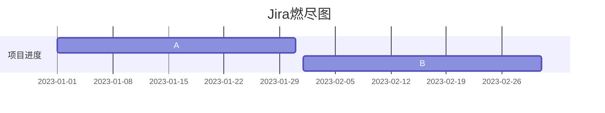
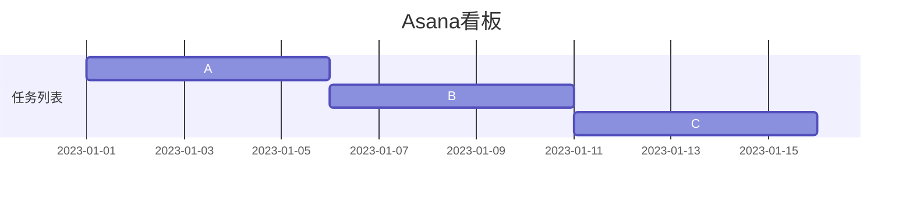
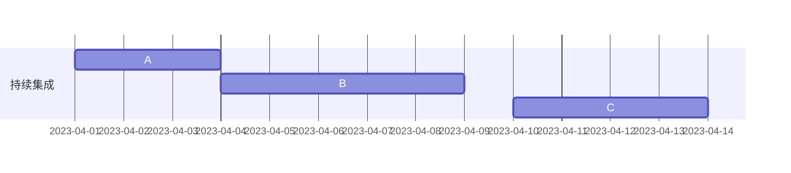

                 

### 《敏捷研发中的需求可视化看板设计》引言

在现代软件开发中，敏捷研发（Agile Development）已经成为一种主流的开发方法。其核心在于快速迭代、持续交付以及高度的团队协作。然而，在敏捷研发过程中，需求的管理和可视化显得尤为重要。有效的需求可视化不仅能帮助团队更好地理解和管理项目需求，还能提高整个研发过程的透明度和效率。因此，本文旨在探讨敏捷研发中的需求可视化看板设计，为软件开发团队提供一种实用且高效的解决方案。

#### 1.1 问题背景

传统的软件开发流程中，需求往往是通过文档进行传递和管理的。这种方式存在几个显著的缺点：首先，文档更新缓慢，难以实时反映项目的最新状态；其次，文档的阅读和理解成本高，容易出现信息传递的误差；最后，文档难以与实际开发活动相结合，导致开发与需求之间的脱节。因此，在敏捷研发中，如何有效地进行需求可视化，成为一个亟待解决的问题。

#### 1.2 问题描述

需求可视化的核心问题在于如何将复杂的需求以直观、易理解的方式展现出来，使其成为团队共同认知和协作的基础。具体来说，需求可视化需要解决以下问题：

1. **如何准确表达需求？** 需求的表达应当清晰、具体，且易于团队成员理解和交流。
2. **如何动态更新需求？** 在快速迭代的开发过程中，需求会不断地更新和调整，如何及时、准确地反映这些变化是关键。
3. **如何整合需求与开发活动？** 需求的可视化应当与实际开发活动紧密结合，以便团队成员能够清晰地看到需求是如何被逐步实现的。

#### 1.3 问题解决

为了解决上述问题，需求可视化看板的设计成为了一个重要的手段。看板通过图表、卡片等形式，将需求以可视化方式展现出来，使得信息传递更加高效和准确。具体来说，需求可视化看板能够实现以下目标：

1. **提高透明度**：团队成员可以清晰地看到项目的进展和每个任务的状态，提高项目的透明度。
2. **增强协作**：通过看板，团队成员可以更好地协作，共同理解和推进需求。
3. **及时反馈**：看板可以实时反映需求的更新和项目的进展，帮助团队快速做出调整。

#### 1.4 边界与外延

需求可视化看板的设计和应用并不是孤立的，它与敏捷研发的其他实践，如迭代规划、持续集成等紧密相关。同时，看板的设计应当根据团队的实际情况进行定制，以适应不同的需求和开发环境。

#### 1.5 概念结构与核心要素组成

在本文中，我们将详细探讨需求可视化的核心概念、联系、方法和工具，以及看板设计的原则、要素和实际应用。具体包括：

- **需求可视化的核心概念**：探讨需求可视化的定义、核心概念及其相互关系。
- **需求可视化的方法**：介绍常见的需求可视化工具，如Jira、Trello、Asana等。
- **需求可视化看板设计**：阐述看板设计的原则和关键要素，提供实际案例进行解析。
- **需求可视化看板在敏捷研发中的应用**：讨论看板在敏捷研发中的角色和应用场景。
- **需求可视化看板的设计与优化**：介绍看板设计的步骤和优化策略。
- **需求可视化看板设计的挑战与解决方案**：分析设计过程中可能遇到的挑战及其解决方案。

通过本文的探讨，希望能够为敏捷研发中的需求管理提供一种系统性的思考和解决方案，帮助团队提高开发效率和项目质量。

### 需求可视化的核心概念与联系

需求可视化是一种将软件开发需求以图形化或表格化形式展示出来的方法，其主要目的是通过视觉元素提高信息的可读性和可理解性。在敏捷研发中，需求可视化不仅是一种工具，更是一种沟通和协作的方式。为了深入理解需求可视化，我们需要先探讨其核心概念，包括可视化、需求和看板。

#### 2.1 需求可视化的定义

需求可视化（Requirements Visualization）是指将软件需求以图表、卡片、流程图等形式展现出来，以便于团队成员理解和协作。这种可视化方法能够将抽象的需求具体化，使其更加直观、易于交流和验证。需求可视化不仅包括对需求本身的展示，还涉及到需求的状态、优先级、依赖关系等多个方面。

#### 2.2 需求可视化的核心概念

##### 2.2.1 可视化

可视化是一种通过图形、图像和其他视觉元素来表示数据和信息的方法。在需求可视化中，常用的可视化形式包括：

- **图表**：如柱状图、饼图、线图等，用于展示需求的状态、进展和优先级。
- **流程图**：如UML序列图、活动图等，用于描述需求的实现过程和步骤。
- **卡片**：如用户故事卡片、任务卡片等，用于具体化每个需求。

##### 2.2.2 需求

需求（Requirement）是指用户或客户对软件产品的功能、性能、质量等方面的期望和需求。在需求可视化中，需求被具体化为可操作、可验证的任务，以便于开发和测试。

##### 2.2.3 看板

看板（Kanban）是一种用于项目管理的方法，起源于日本丰田汽车公司的生产管理。看板的核心思想是通过可视化管理来提高工作效率和透明度。在需求可视化中，看板是一种用于展示需求状态和进展的工具，通常包括以下要素：

- **列**：表示需求的不同状态，如“待办”、“进行中”、“测试中”、“已完成”等。
- **卡片**：表示具体的需求或任务，通常包含任务名称、优先级、负责人等信息。
- **柱状图**：用于展示需求在不同状态下的数量和分布情况。

#### 2.3 概念属性特征对比表格

为了更好地理解这些核心概念，我们通过一个对比表格来展示它们的主要属性特征：

| 概念       | 定义                    | 主要属性特征                           | 应用场景                   |
|------------|-------------------------|--------------------------------------|----------------------------|
| 可视化     | 通过视觉元素表示信息   | 图表、流程图、卡片等                 | 需求展示、进度跟踪等       |
| 需求       | 用户或客户对软件的期望 | 功能、性能、质量要求                 | 设计、开发、测试等       |
| 看板       | 可视化管理工具          | 列、卡片、柱状图等                   | 项目管理、需求跟踪等       |

#### 2.4 ER实体关系图架构

为了进一步理解这些概念之间的联系，我们可以通过ER（Entity-Relationship，实体关系）图来展示它们之间的关系：

```mermaid
erDiagram
  需求 ||--|{ 可视化 }
  看板 ||--|{ 可视化 }
  可视化 ||--|{ 看板 }
  需求 ||--|{ 看板 }
```

在上面的ER图中，需求、可视化、看板三个实体之间存在紧密的联系。需求通过可视化方式进行表达，并通过看板进行管理和跟踪。看板则作为需求可视化的一个重要实现形式，用于展示和监控需求的状态和进展。

通过上述核心概念与联系的探讨，我们能够更好地理解需求可视化在敏捷研发中的应用，并为后续的需求可视化方法和工具的介绍奠定基础。在下一章中，我们将进一步探讨敏捷研发中的需求可视化方法及其应用。

### 敏捷研发中的需求可视化方法

在敏捷研发过程中，有效地管理需求是确保项目成功的关键。需求可视化方法通过图形化展示需求，帮助团队更好地理解和管理项目。本文将介绍几种常见的需求可视化工具，包括Jira、Trello和Asana，以帮助团队提高需求管理的效率。

#### 3.1 敏捷研发概述

敏捷研发（Agile Development）是一种以迭代和增量为核心的软件开发方法。其核心理念包括：

- **迭代开发**：将开发过程分解为多个短周期（通常为几周）的迭代，每个迭代产出可交付的软件版本。
- **用户反馈**：在每个迭代结束后，收集用户反馈，并根据反馈对需求进行优先级调整和功能优化。
- **团队协作**：强调团队协作，通过高效的沟通和合作来提高开发效率。

#### 3.2 需求可视化方法概述

需求可视化方法旨在将需求以可视化形式展示出来，使得团队可以直观地了解项目状态和进展。常见的需求可视化方法包括：

1. **用户故事地图**：用于展示需求的全貌，帮助团队理解项目范围和优先级。
2. **看板**：通过列和卡片展示需求的状态和进度，便于团队监控和管理任务。
3. **燃尽图**：展示项目剩余工作量和时间的关系，帮助团队评估项目进度和风险。

#### 3.3 常见的可视化工具

##### 3.3.1 Jira

Jira 是一款广泛使用的敏捷项目管理工具，提供了强大的需求可视化功能。

1. **用户故事地图**：在Jira中，可以通过创建和链接用户故事卡片来构建用户故事地图，展示需求的全貌。
2. **看板**：Jira的看板功能支持多种列和卡片布局，团队可以根据需求自定义看板，以便于任务跟踪和进度管理。
3. **燃尽图**：Jira提供了燃尽图，通过展示剩余工作量与时间的关系，帮助团队评估项目进度。



##### 3.3.2 Trello

Trello 是一款简单直观的需求可视化工具，适合中小型团队使用。

1. **看板**：Trello的核心功能是看板，通过列和卡片来管理任务，每个卡片可以包含描述、标签、成员等信息。
2. **标签和成员**：Trello支持标签和成员功能，便于团队进行分类和协作。
3. **自动化流程**：Trello提供自动化工作流程，通过规则来自动处理任务，提高效率。


##### 3.3.3 Asana

Asana 是一款功能强大的项目管理工具，适合复杂项目和大团队使用。

1. **任务和项目**：Asana支持创建任务和项目，任务可以包含描述、时间表、标签、成员等信息。
2. **看板**：Asana的看板功能与Trello类似，通过列和卡片展示任务的状态和进展。
3. **数据分析**：Asana提供了数据分析工具，可以帮助团队评估项目进度和资源分配。



通过上述几种常见的需求可视化工具，团队可以更有效地管理需求，提高开发效率和项目质量。在下一章中，我们将详细探讨需求可视化看板的设计原则和关键要素。

### 需求可视化看板设计

需求可视化看板是敏捷研发中一种重要的需求管理工具，它通过图形化的方式展示项目的状态、任务进度和团队成员的工作情况。看板的设计原则和关键要素直接影响其使用效果和团队的工作效率。以下，我们将详细探讨看板设计的原则和关键要素。

#### 4.1 看板设计的原则

##### 4.1.1 简明性

简明性是看板设计的重要原则之一。看板上的信息应当简洁明了，避免过多的冗余内容和复杂的设计，以便团队成员能够快速理解和操作。具体来说，应遵循以下原则：

- **内容精简**：每个卡片或列的描述应简洁明了，避免过多的文字和细节。
- **视觉简洁**：看板的设计应避免过多的装饰和复杂的设计元素，以减少视觉负担。

##### 4.1.2 可操作性

可操作性是指看板应当易于操作，使团队成员能够方便地进行任务分配、状态更新和进度跟踪。以下是一些设计原则：

- **操作便捷**：卡片和列的移动、更新等操作应当简单直观，减少不必要的点击和步骤。
- **反馈及时**：看板应能及时反馈任务的状态更新和进度变化，帮助团队成员了解项目的最新情况。

##### 4.1.3 可扩展性

看板设计应具备一定的可扩展性，以便于团队根据项目需求和实际情况进行调整。以下是一些设计原则：

- **模块化设计**：看板的各个模块应能够独立调整和扩展，以适应不同的项目需求。
- **灵活性**：看板的设计应具有一定的灵活性，能够根据团队的实际情况进行定制和调整。

#### 4.2 看板设计的关键要素

##### 4.2.1 用户故事地图

用户故事地图是需求可视化的一种形式，用于展示需求的全貌和优先级。在用户故事地图中，每个用户故事通过卡片或图标表示，按照其优先级和依赖关系进行排列。

1. **用户故事卡片**：每个用户故事卡片应包含以下内容：
   - 用户故事编号：用于标识和管理用户故事。
   - 用户故事描述：简要描述用户故事的功能和目标。
   - 优先级：标明用户故事的优先级，帮助团队确定开发顺序。

2. **依赖关系**：用户故事之间的依赖关系通过连线表示，以便团队了解不同用户故事之间的关联。

##### 4.2.2 指标

指标是看板中的关键信息，用于展示项目的进度和状态。常见的指标包括：

1. **完成度**：通过柱状图或百分比显示当前迭代中完成的任务数量和总任务数量。
2. **延迟任务**：显示延迟的任务数量和延迟时间，帮助团队及时发现并解决问题。
3. **工作量分布**：展示团队成员的工作量分布情况，以便于资源调配和任务分配。

##### 4.2.3 任务卡片

任务卡片是看板中的基本单位，用于表示具体的任务和任务状态。每个任务卡片应包含以下内容：

1. **任务名称**：简要描述任务的内容。
2. **任务状态**：显示任务的状态，如“待办”、“进行中”、“测试中”、“已完成”等。
3. **负责人**：标识任务的负责人，便于团队进行任务分配和跟踪。
4. **开始和结束时间**：显示任务的开始和结束时间，帮助团队进行时间管理。

#### 4.3 看板设计的实践案例

##### 4.3.1 项目A

项目A是一个中型项目，涉及多个功能模块的开发。团队使用Trello作为需求可视化看板，其设计如下：

1. **用户故事地图**：团队创建了多个用户故事卡片，按照优先级和依赖关系进行排列，展示项目需求的全貌。
2. **看板**：在Trello的看板中，设置了以下列：
   - **待办**：包含所有待完成任务。
   - **进行中**：包含正在进行的任务。
   - **测试中**：包含待测试的任务。
   - **已完成**：包含已经完成的任务。

3. **指标**：团队在Trello看板中添加了完成度、延迟任务和工作量分布等指标，帮助团队监控项目进度。

##### 4.3.2 项目B

项目B是一个大型项目，涉及多个团队和跨部门协作。团队使用Jira作为需求可视化看板，其设计如下：

1. **用户故事地图**：团队在Jira中创建了用户故事地图，每个用户故事都通过卡片形式展示，并包含详细的描述和优先级。
2. **看板**：在Jira的看板中，设置了以下列：
   - **需求分析**：包含正在进行的用户故事和需求分析任务。
   - **设计**：包含设计阶段的相关任务。
   - **开发**：包含开发阶段的相关任务。
   - **测试**：包含测试阶段的相关任务。
   - **部署**：包含部署阶段的相关任务。

3. **指标**：团队在Jira看板中添加了燃尽图和迭代进度等指标，帮助团队评估项目进度和风险。

通过上述实践案例，我们可以看到，需求可视化看板的设计应结合项目需求和团队实际情况，灵活运用用户故事地图、指标和任务卡片等关键要素，以提高需求管理的效率和项目的成功率。

### 需求可视化看板在敏捷研发中的应用

在敏捷研发中，需求可视化看板是一种有效的工具，它通过可视化方式展示需求的状态和进展，帮助团队进行项目管理和任务跟踪。以下是需求可视化看板在敏捷研发中的具体应用，包括迭代规划、迭代跟踪和持续集成等场景。

#### 5.1 看板在敏捷研发中的角色

需求可视化看板在敏捷研发中扮演着多个重要角色：

1. **提高透明度**：通过可视化方式展示需求的状态和进展，使团队成员能够清晰地了解项目的进展情况，提高团队的透明度。
2. **增强协作**：看板提供了共同的工作空间，使团队成员可以更好地协作，共同理解和推进需求。
3. **及时反馈**：看板可以实时反映需求的更新和项目的进展，帮助团队快速做出调整，提高开发效率。

#### 5.2 看板在敏捷研发中的应用场景

##### 5.2.1 迭代规划

在迭代规划阶段，团队需要确定本次迭代的目标和任务。需求可视化看板可以帮助团队进行以下工作：

1. **需求整理**：将本次迭代的需求整理成用户故事卡片，并按照优先级进行排列。
2. **任务分配**：根据团队的能力和需求优先级，将任务分配给相应的团队成员。
3. **资源规划**：查看团队当前的工作量分布，进行资源调配，确保每个任务都有足够的资源支持。

以下是一个迭代规划的看板示例：

```mermaid
gantt
    dateFormat  YYYY-MM-DD
    section 迭代规划
    A :任务1        :2023-04-01, 3d
    B :任务2        :2023-04-04, 5d
    C :任务3        :2023-04-10, 4d
```

在这个示例中，团队将本次迭代的需求分配给三个团队成员，并在看板上进行标记和进度更新。

##### 5.2.2 迭代跟踪

在迭代进行过程中，需求可视化看板可以帮助团队进行以下工作：

1. **任务状态更新**：团队成员可以在看板上更新任务的状态，如“待办”、“进行中”、“测试中”、“已完成”等。
2. **进度监控**：团队可以通过看板上的进度条和柱状图，实时监控任务的进展情况，确保项目按计划进行。
3. **问题跟踪**：团队可以记录和跟踪项目中出现的问题，及时解决，避免问题积累。

以下是一个迭代跟踪的看板示例：

```mermaid
gantt
    dateFormat  YYYY-MM-DD
    section 迭代跟踪
    A :任务1        :2023-04-01, 30%, 3d
    B :任务2        :2023-04-04, 50%, 5d
    C :任务3        :2023-04-10, 80%, 4d
```

在这个示例中，团队可以看到每个任务的状态和进展，及时调整任务优先级和资源分配。

##### 5.2.3 持续集成

在持续集成阶段，需求可视化看板可以帮助团队进行以下工作：

1. **代码审查**：团队成员可以在看板上记录代码审查的进度和反馈，确保代码质量。
2. **自动化测试**：团队可以通过看板上的进度条和测试结果，监控自动化测试的执行情况，发现潜在的问题。
3. **部署跟踪**：团队可以记录和跟踪部署的进度，确保新功能按时上线。

以下是一个持续集成的看板示例：



在这个示例中，团队可以看到每个环节的进展和状态，确保持续集成过程顺利进行。

通过以上应用场景，我们可以看到需求可视化看板在敏捷研发中的重要作用。它不仅提高了团队的透明度和协作效率，还帮助团队更好地管理需求，确保项目按计划进行。在下一章中，我们将探讨如何进行需求可视化看板的设计与优化。

### 需求可视化看板的设计与优化

需求可视化看板在敏捷研发中发挥着关键作用，但其设计过程复杂且涉及多方面考虑。为了确保看板的高效性和适用性，我们需要遵循一定的设计步骤和优化策略。

#### 6.1 看板设计的步骤

##### 6.1.1 需求分析

在进行看板设计之前，首先需要对需求进行详细分析。这包括：

- **确定需求范围**：明确本次迭代或项目的需求，划分功能模块和子任务。
- **需求优先级**：根据需求的重要性和紧急程度，对需求进行优先级排序。

##### 6.1.2 看板设计

基于需求分析结果，设计看板的具体布局和功能。以下是几个关键步骤：

- **确定列的布局**：根据需求的状态，设置相应的列，如“需求分析”、“设计”、“开发”、“测试”和“部署”等。
- **定义卡片模板**：为每个任务或需求定义卡片模板，包括任务名称、描述、优先级、状态、负责人等信息。
- **设计指标显示**：根据项目需求，选择合适的指标进行展示，如完成度、延迟任务、工作量分布等。

##### 6.1.3 看板测试与优化

设计完成后，进行看板的测试和优化：

- **内部测试**：邀请团队成员进行内部测试，收集反馈和问题，进行初步优化。
- **迭代优化**：根据测试反馈，持续优化看板设计，确保其满足实际需求。

#### 6.2 看板优化的策略

##### 6.2.1 用户反馈

用户反馈是优化看板设计的重要来源。以下是几种收集用户反馈的方法：

- **定期调查**：定期进行问卷调查或面对面访谈，了解用户对看板功能的满意度和改进建议。
- **实时反馈**：提供反馈渠道，如看板上的“反馈”按钮，方便用户随时提出问题和建议。

##### 6.2.2 数据分析

通过数据分析，可以深入了解看板的使用情况和团队的工作效率。以下是一些数据分析方法：

- **指标监控**：监控关键指标，如任务完成时间、延迟任务数量、工作量分布等，识别问题和瓶颈。
- **趋势分析**：分析数据趋势，发现团队工作模式的变化，及时进行调整。

##### 6.2.3 最佳实践

借鉴其他团队的看板设计经验，结合自身实际情况，引入最佳实践。以下是一些建议：

- **简洁性**：保持看板内容的简洁，避免过多冗余信息。
- **灵活性**：设计灵活的看板布局和功能，适应不同类型的项目和团队。
- **协作性**：鼓励团队成员之间的沟通和协作，通过看板提升整体工作效率。

通过遵循以上步骤和策略，我们可以设计出高效、灵活且适应团队需求的需求可视化看板，从而提高敏捷研发的效率和质量。

### 需求可视化看板设计的挑战与解决方案

在需求可视化看板的设计过程中，团队可能会遇到多种挑战，包括信息过载、需求变更和文化适应等问题。以下将讨论这些挑战，并探讨相应的解决方案。

#### 7.1 设计挑战

##### 7.1.1 信息过载

信息过载是指看板上显示的信息过多，导致团队成员难以快速理解和处理。这种问题可能源于以下几个因素：

1. **需求过多**：如果项目中需求过多，看板可能会显得杂乱无章，难以管理。
2. **冗余信息**：看板上的信息冗余，如过多的描述、不必要的标签等，增加了信息处理的复杂性。

##### 7.1.2 需求变更

在敏捷研发中，需求变更是一种常见现象。需求变更可能导致以下问题：

1. **看板更新不及时**：如果需求变更未能及时反映在需求可视化看板上，团队成员可能会根据过时的信息进行工作。
2. **任务状态混乱**：频繁的需求变更可能导致任务状态混乱，影响项目的进度和效率。

##### 7.1.3 文化适应

不同团队和组织的文化差异可能导致看板设计的不适应。以下是一些具体问题：

1. **沟通障碍**：团队成员之间的沟通不畅可能导致看板信息的传达不准确。
2. **协作障碍**：团队成员对看板工具的使用习惯和理念不同，可能导致协作效率低下。

#### 7.2 解决方案

##### 7.2.1 信息过滤

为了解决信息过载问题，可以采取以下措施：

1. **优先级排序**：对需求进行优先级排序，确保最重要的需求首先被处理。
2. **简化信息**：去除冗余信息，只保留对任务处理有直接帮助的关键信息。
3. **动态更新**：确保看板上的信息实时更新，反映最新的需求状态。

##### 7.2.2 灵活应对需求变更

为了有效应对需求变更，可以采取以下策略：

1. **敏捷迭代**：采用敏捷迭代开发方法，及时调整需求，确保看板上的需求是最新的。
2. **版本控制**：记录需求变更的历史版本，帮助团队成员了解变更的背景和原因。
3. **任务重排**：根据需求变更调整任务优先级和进度，确保变更对项目的影响最小。

##### 7.2.3 文化适应策略

为了提高团队的协作效率，可以采取以下措施：

1. **培训与沟通**：提供看板工具的培训，确保团队成员熟悉工具的使用。
2. **建立共同目标**：通过明确团队的目标和愿景，增强团队成员的归属感和责任感。
3. **鼓励反馈**：建立反馈机制，鼓励团队成员提出改进建议，共同优化看板设计。

通过上述解决方案，团队可以应对需求可视化看板设计过程中遇到的挑战，确保看板的高效性和适用性。

### 拓展阅读

#### 8.1 需求可视化的最新研究

随着技术的发展，需求可视化领域也在不断进步。以下是一些值得关注的研究方向：

1. **AI在需求可视化中的应用**：利用人工智能技术，如机器学习、自然语言处理等，提高需求的理解和分析能力。
2. **交互式需求可视化**：开发更具有交互性的需求可视化工具，提高用户参与度和需求理解深度。
3. **多维度需求可视化**：结合不同的数据维度，如时间、用户反馈、成本等，提供更加全面的需求可视化。

#### 8.2 敏捷研发的先进实践

敏捷研发在不同领域和团队中有着丰富的实践案例。以下是一些值得学习的先进实践：

1. **Scrum框架的优化**：Scrum是一种广泛使用的敏捷开发方法，不断有新的实践和优化方法出现，如Scrum@Scale。
2. **看板方法的实施**：在实际项目中，如何有效地实施看板方法，如何平衡流程的灵活性和控制性是关键。
3. **持续学习和迭代**：团队应不断学习和反思，根据实际情况调整敏捷实践，持续优化开发流程。

#### 8.3 看板设计的相关工具与资源

看板设计需要借助多种工具和资源，以下是一些建议：

1. **项目管理工具**：如Jira、Trello、Asana等，提供了丰富的看板功能。
2. **需求管理工具**：如Jama、Confluent等，专门用于需求管理和可视化。
3. **学习资源**：在线课程、书籍和博客等，如《Scrum精髓》、《看板方法》等，提供了丰富的理论知识与实践经验。

通过不断学习和实践，团队可以更好地应用需求可视化看板，提高敏捷研发的效率和质量。

### 总结

本文通过详细探讨敏捷研发中的需求可视化看板设计，从核心概念、设计原则、应用场景、优化策略和挑战解决方案等多个方面，提供了系统性的分析和实用的指导。需求可视化看板在敏捷研发中发挥着关键作用，通过可视化方式提高了团队的透明度和协作效率。我们鼓励读者结合自身实际项目，进一步优化需求管理流程，提升开发效率。未来，需求可视化将继续与人工智能等技术结合，带来更多的创新和改进。

