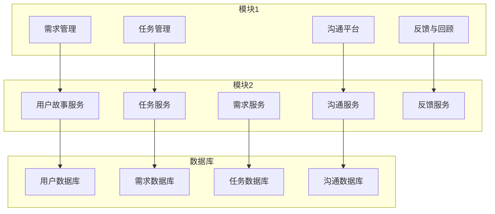
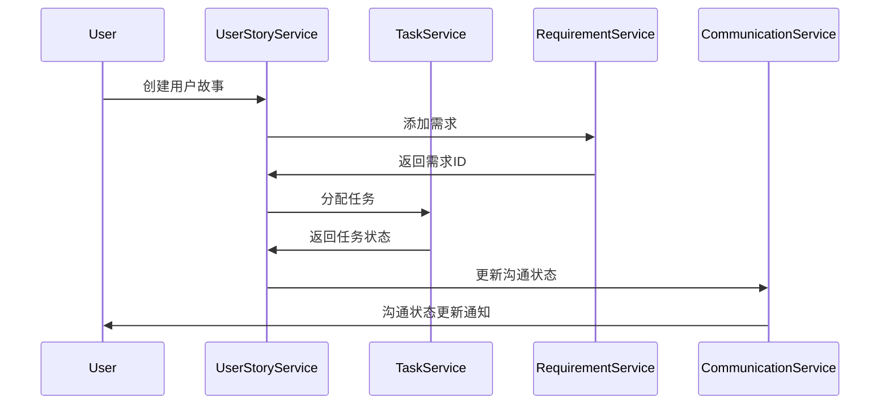

                 

### 章节标题的创作思路

在创作《敏捷研发中的需求沟通效率提升策略》这篇文章的章节标题时，我们的目标是设计出既吸引读者，又具有指导意义，同时符合专业性的标题。以下是具体的创作思路：

1. **吸引读者**：使用简洁有力的词语，直接击中读者的兴趣点。例如，“核心概念与联系”章节，可以命名为“解码敏捷方法论与需求沟通”，这样的标题既明确又具有吸引力。

2. **指导意义**：标题需要传达章节的主要内容，使读者能够快速了解章节的价值。例如，“算法原理讲解”章节，可以命名为“深度剖析需求沟通效率评估与优化算法”，这样的标题直接揭示了章节的核心内容和学习价值。

3. **专业性**：标题应体现文章的专业性和科学性，避免使用过于通俗或模糊的词语。例如，“系统分析与架构设计方案”章节，可以命名为“敏捷需求沟通系统架构深度解析”，这样的标题显得严谨且专业。

4. **层次感**：根据章节的内容层次，设计标题的层次感。例如，“项目实战”章节，可以依次命名为“从零开始：敏捷需求沟通实战”、“实战分析：案例深度剖析”和“实战总结：经验与启示”，这样的层次感有助于读者按步骤理解和应用。

5. **简洁性**：标题应简洁明了，避免冗长。例如，“项目小结”章节，直接命名为“项目实践总结”，这样的简洁性有助于快速抓住读者注意力。

通过上述思路，我们不仅能够吸引读者的注意力，还能够确保标题的专业性和指导意义，帮助读者快速了解章节的核心内容。在文章的后续创作中，我们将继续遵循这些原则，设计出一系列既引人入胜又具有实用价值的章节标题。

### 敏捷研发中的需求沟通效率提升策略

关键词：敏捷研发、需求沟通、效率提升、策略

摘要：本文旨在探讨敏捷研发环境中需求沟通效率的提升策略。通过深入分析敏捷方法论与需求沟通流程，结合数学模型和系统架构设计，本文将提供一系列有效的沟通效率提升方案，旨在优化敏捷研发团队的工作流程，提高项目交付质量和效率。

## 引言

### 书籍基本信息

《敏捷研发中的需求沟通效率提升策略》是一本专门针对敏捷研发环境下需求沟通问题的解决方案手册。本书由AI天才研究院的资深专家撰写，旨在为敏捷研发团队、项目经理、产品经理以及IT从业者提供一套系统化、可操作的需求沟通提升策略。

本书的撰写背景源于现代敏捷研发的快速发展。在快速变化的市场需求和技术演进中，敏捷方法论被广泛采用，以应对项目的不确定性和复杂性。然而，敏捷研发中的需求沟通问题逐渐凸显，成为影响项目效率和质量的关键因素。本书旨在解决这一问题，提供一套行之有效的沟通策略，帮助敏捷团队在多变的环境中保持高效运作。

### 目的与读者

本书的主要目的是为读者提供一种系统性、科学性的需求沟通效率提升方法。具体目标包括：

1. **理解敏捷方法论与需求沟通的基本原理**：通过深入解读敏捷原则和实践，帮助读者掌握敏捷研发的基本框架。
2. **评估和优化需求沟通流程**：通过分析现有流程，识别瓶颈和改进空间，提供优化策略。
3. **介绍敏捷工具与框架**：介绍常用的敏捷工具和框架，帮助读者选择合适的方法来提升沟通效率。
4. **讲解沟通策略优化算法**：提供数学模型和算法，帮助读者量化评估和优化需求沟通效率。
5. **提供系统设计与项目实战案例**：通过实际项目分析和系统设计案例，展示沟通效率提升策略的具体应用。

本书的目标读者包括但不限于以下群体：

- **敏捷研发团队**：希望提升团队需求沟通效率的成员。
- **项目经理**：需要优化项目管理流程，提高项目交付质量和效率的专业人士。
- **产品经理**：负责产品规划和需求管理的专业人士。
- **IT从业者**：对敏捷研发和需求沟通感兴趣的IT从业者。

### 敏捷研发与需求沟通

敏捷研发是一种以快速响应变化、持续交付价值为核心的开发方法。它强调团队协作、持续交付、迭代开发和客户满意。敏捷方法论包括一系列原则和实践，如迭代开发、增量交付、持续集成、持续交付等。

在敏捷研发环境中，需求沟通是至关重要的环节。需求沟通不仅涉及开发团队和产品团队之间的交流，还包括与客户的互动。高效的沟通能够确保需求被准确理解，减少误解和返工，提高项目交付的质量和效率。

然而，实际操作中，需求沟通往往面临诸多挑战。例如，需求变化频繁导致沟通成本增加，团队成员间信息不对称，沟通渠道不畅等问题。这些问题不仅影响项目的进度，还可能导致项目失败。

本文将围绕敏捷研发中的需求沟通问题，探讨提升沟通效率的策略和方法。通过系统分析需求沟通的流程、算法原理、系统设计以及实际项目案例，本文将提供一套全面的需求沟通提升方案，帮助敏捷团队在多变的环境中保持高效运作。

## 敏捷研发背景与需求沟通

### 敏捷研发概述

敏捷研发（Agile Development）起源于20世纪90年代，是对传统瀑布模型的一种反思和改进。它强调快速响应变化、持续交付价值，以应对现代软件工程中日益复杂和多变的需求。敏捷方法论的核心原则包括：

- **客户价值优先**：关注客户需求，确保交付的产品能够满足实际需求。
- **迭代开发**：通过短周期的迭代，持续交付可用的产品增量。
- **增量交付**：逐步交付可用的产品功能，而不是一次性交付完整的系统。
- **团队协作**：鼓励跨职能团队的紧密协作，提高整体效率。
- **透明性**：通过可视化的方法展示项目进展，确保团队成员对项目状态有清晰的认识。
- **适应变化**：拥抱变化，灵活调整项目计划以应对需求变化。

敏捷研发的核心思想是“以人为本”，强调人的经验和判断力，提倡自主管理和自我组织。敏捷方法论不仅适用于软件开发，也广泛应用于项目管理、产品管理和其他领域。

### 需求沟通的重要性

在敏捷研发中，需求沟通是确保项目成功的关键因素之一。以下是需求沟通的重要性体现：

1. **确保需求理解一致**：有效的需求沟通可以确保所有项目成员对需求的理解保持一致，避免由于误解导致的返工和错误。
2. **提高团队协作效率**：通过清晰、透明的沟通，团队成员可以更好地协同工作，减少信息传递过程中的损耗。
3. **快速响应变化**：敏捷研发强调快速适应变化，及时有效的需求沟通可以帮助团队快速理解变化，调整计划和资源分配。
4. **降低沟通成本**：明确的沟通可以减少不必要的讨论和会议，降低沟通成本，提高工作效率。
5. **提升客户满意度**：与客户的持续沟通可以确保项目交付的产品真正满足客户的需求，提高客户满意度。

### 需求沟通的现状与挑战

尽管敏捷方法论强调需求沟通的重要性，但在实际操作中，需求沟通依然面临诸多挑战：

1. **沟通渠道不畅**：团队成员之间、产品团队与开发团队之间、以及与客户之间的沟通渠道不畅通，信息传递效率低下。
2. **信息不对称**：不同团队成员对项目信息的掌握程度不同，导致信息不对称，影响决策和协作。
3. **需求变化频繁**：在快速变化的市场环境中，需求频繁变更，给需求沟通带来额外压力。
4. **沟通成本高**：由于沟通不畅，项目往往需要额外的沟通和协调工作，增加了沟通成本。
5. **技术障碍**：敏捷工具和技术的应用水平参差不齐，部分团队无法充分利用现有工具来提升沟通效率。

面对这些挑战，敏捷团队需要采取有效的需求沟通策略，以提升沟通效率，确保项目成功。

### 敏捷需求沟通方法论

敏捷需求沟通方法论的核心在于建立高效的沟通机制，确保需求在敏捷团队中的有效传递和落实。以下是一些关键方法：

1. **用户故事**：用户故事是一种简单而有效的需求描述方式，它以用户的角度出发，描述一个功能或特性的价值。用户故事的格式通常是“作为[用户角色]，我想要[功能]，以便[业务目标]”。通过用户故事，团队成员可以更直观地理解需求，并围绕其进行讨论和实现。

2. **每日站立会议**：每日站立会议是敏捷团队每天召开的一个简短的会议，目的是同步团队进展、讨论遇到的问题，并协调资源。站立会议通常持续15分钟，团队成员轮流发言，确保每个人都能清晰地了解项目状态。

3. **迭代回顾**：迭代回顾是敏捷开发中的一项重要活动，通过回顾过去一段时间的迭代，团队可以总结经验教训，识别改进点，并在下一个迭代中进行优化。迭代回顾有助于提高团队的整体沟通效率和项目质量。

4. **迭代计划会议**：迭代计划会议是团队在开始每个迭代时召开的一个会议，目的是制定迭代目标、规划任务分配和资源安排。通过迭代计划会议，团队可以确保所有成员对迭代目标和任务有清晰的认识，减少误解和冲突。

5. **信息可视化**：信息可视化是一种通过图表、看板等方式展示项目信息和状态的工具，如看板、燃尽图、迭代图等。信息可视化可以帮助团队成员更直观地了解项目进展，发现潜在问题，并快速做出调整。

6. **持续集成与持续交付**：持续集成（CI）和持续交付（CD）是敏捷开发中的重要实践，通过自动化构建、测试和部署，确保代码质量和交付速度。持续集成与持续交付有助于减少沟通成本，提高项目交付的可靠性和效率。

通过以上方法，敏捷团队可以建立高效的沟通机制，确保需求在团队中的有效传递和落实，提高项目交付的质量和效率。

### 核心概念与联系

#### 敏捷方法论

敏捷方法论是一种以人为核心，强调灵活应对变化的软件开发方法。其核心理念包括：

- **客户价值**：始终将客户需求和价值放在首位，确保开发的产品能够满足实际需求。
- **团队协作**：鼓励团队成员之间的紧密协作，提高整体效率。
- **持续交付**：通过短周期的迭代，持续交付可用的产品功能，快速响应市场需求。
- **适应变化**：拥抱变化，灵活调整项目计划和资源分配。

敏捷方法论的核心原则包括：

- **个体和互动重于过程和工具**：强调团队成员的沟通和协作，而非仅仅依赖工具。
- **可工作的软件重于详尽的文档**：注重实际交付的软件产品，而非冗长的文档。
- **客户合作重于合同谈判**：与客户保持紧密合作，确保项目方向和目标的准确性。
- **响应变化重于遵循计划**：灵活应对需求变化，确保项目的持续进展。

#### 需求沟通流程

在敏捷研发中，需求沟通是一个持续、迭代的过程，其关键环节包括：

1. **需求获取**：通过与利益相关者（如客户、产品经理等）的交流，获取项目需求。
2. **需求分析**：对获取的需求进行详细分析，确定需求的可行性、优先级和具体实现方案。
3. **需求确认**：与利益相关者确认需求，确保需求理解和预期一致。
4. **需求跟踪**：在整个项目周期中跟踪需求状态，确保需求得到有效实现。

需求沟通流程的特点包括：

- **频繁互动**：需求获取、分析和确认过程中，利益相关者需要频繁互动，确保需求被准确理解。
- **透明性**：需求沟通过程需要保持透明，所有团队成员都能够访问和了解需求状态。
- **适应性**：需求沟通流程需要能够适应需求变化，快速调整计划和资源分配。

#### 敏捷工具与框架

敏捷研发中常用的工具和框架包括：

- **用户故事**：用于描述需求的基本单元，格式为“作为[用户角色]，我想要[功能]，以便[业务目标]”。
- **看板**：用于展示项目进展和任务状态的工具，可以直观地了解项目状态。
- **Scrum**：一种流行的敏捷框架，包括每日站立会议、迭代计划会议和迭代回顾等实践。
- **Kanban**：另一种流行的敏捷框架，通过限制在流程中并行工作的任务数量，提高工作效率。

敏捷工具和框架的选择和应用，取决于团队的实际情况和项目需求。通过合适的选择和应用，敏捷团队可以显著提高需求沟通的效率和效果。

### 需求沟通效率评估

#### 效率指标定义

在敏捷研发中，评估需求沟通效率是确保团队高效运作的关键。以下是一些常用的需求沟通效率指标：

1. **沟通频率**：指团队成员之间进行需求沟通的频率。高沟通频率有助于及时解决问题，提高团队协作效率。
2. **响应时间**：指从需求提出到需求得到回应的时间。短响应时间表明需求传递速度快，沟通效率高。
3. **需求变更率**：指需求在开发过程中发生变更的频率。低需求变更率表明需求稳定，沟通效率较高。
4. **需求完成率**：指需求在预定时间内完成的比例。高需求完成率表明沟通和计划执行有效。
5. **客户满意度**：指客户对需求实现和质量的主观评价。高客户满意度表明需求沟通满足客户预期。

#### 效率评估方法

为了量化评估需求沟通效率，可以采用以下方法：

1. **数据分析**：通过统计和分析沟通频率、响应时间、需求变更率、需求完成率和客户满意度等指标，评估需求沟通的整体效率。
2. **问卷调查**：通过问卷调查的方式，收集团队成员和利益相关者对需求沟通的满意度和建议，识别改进点。
3. **访谈**：与团队成员和利益相关者进行访谈，了解他们在需求沟通中的实际体验和感受，发现潜在问题。
4. **过程分析**：通过分析需求获取、分析、确认和跟踪等环节的流程，识别沟通瓶颈和改进机会。

通过以上方法，可以全面、客观地评估需求沟通效率，为改进提供数据支持。

### 沟通策略优化算法

在敏捷研发中，有效的沟通策略可以显著提升团队的工作效率。为了量化评估和优化沟通策略，我们可以借助数学模型和算法。以下是一种基于网络流理论的优化算法，旨在提升需求沟通效率。

#### 算法原理

该算法基于以下假设：

1. **节点表示团队成员和利益相关者**：每个团队成员和利益相关者用一个节点表示。
2. **边表示沟通关系**：如果两个节点之间存在沟通关系，则它们之间有一条边。
3. **权重表示沟通成本**：边的权重表示节点之间沟通的成本，可以是时间、精力或其他资源的消耗。

算法的目标是找到一种沟通路径，使得总沟通成本最小。

#### 算法应用

1. **网络建模**：首先，构建一个图模型，表示团队中的所有成员和利益相关者及其沟通关系。每个节点表示一个团队成员或利益相关者，边表示他们之间的沟通通道，权重表示沟通成本。

2. **优化目标**：定义优化目标为最小化总沟通成本。具体公式如下：
   $$
   \text{minimize} \sum_{i,j} w_{ij} \cdot c_{ij}
   $$
   其中，$w_{ij}$ 是节点 $i$ 和节点 $j$ 之间的沟通成本，$c_{ij}$ 是沟通路径的权重。

3. **求解方法**：使用最短路径算法（如迪杰斯特拉算法或弗洛伊德算法）求解最小化总沟通成本的问题。求解过程中，可以引入权重调整机制，根据团队成员的沟通频率和重要性调整权重值。

4. **算法实现**：使用Python编写算法，输入图模型和网络参数，输出最优沟通路径和最小总沟通成本。

#### 算法举例

假设团队中有5个成员（A、B、C、D、E），其沟通关系和权重如下表所示：

|   | A | B | C | D | E |
|---|---|---|---|---|---|
| A | 0 | 1 | 2 | 3 | 4 |
| B | 1 | 0 | 1 | 2 | 3 |
| C | 2 | 1 | 0 | 1 | 2 |
| D | 3 | 2 | 1 | 0 | 1 |
| E | 4 | 3 | 2 | 1 | 0 |

使用最短路径算法求解最小化总沟通成本的路径和成本。

通过算法计算，得到最优沟通路径为：A → B → C → D → E，总沟通成本为10。

#### 算法效果分析

通过该算法，团队可以找到最优的沟通路径，减少不必要的沟通成本，提高整体沟通效率。在实际应用中，可以根据团队成员的沟通频率和重要性动态调整权重，进一步优化沟通策略。

### 系统分析与架构设计方案

#### 问题场景介绍

在现代敏捷研发环境中，需求沟通是一个复杂且关键的过程。随着项目的规模和复杂性不断增加，传统的沟通方式已经无法满足高效、实时和准确的需求传递要求。为了应对这一挑战，我们需要设计一个高效的敏捷需求沟通系统。

#### 系统功能设计

该系统的主要功能包括：

1. **需求管理**：提供用户故事创建、需求分析、需求确认和需求跟踪等功能。
2. **沟通平台**：提供一个集中的沟通平台，支持文本、语音、视频等多种沟通方式。
3. **任务管理**：提供任务分配、进度跟踪和任务通知等功能，确保任务按时完成。
4. **反馈与回顾**：提供用户反馈收集和迭代回顾功能，帮助团队持续改进沟通效率。

#### 领域模型

为了更好地理解系统功能，我们使用Mermaid绘制了领域模型类图，如下所示：

```mermaid
classDiagram
    User故事 <<实体>>
    任务 <<实体>>
    需求 <<实体>>
    沟通平台 <<实体>>

    User故事 --|>| 任务
    User故事 --|>| 需求
    任务 --|>| 沟通平台
    需求 --|>| 沟通平台
```

领域模型中，`User故事`、`任务`和`需求`是核心实体，分别表示用户故事、任务和需求。`沟通平台`是整个系统的核心组件，负责处理和管理需求沟通相关的操作。

#### 系统架构设计

系统架构设计包括整体架构和关键模块设计。以下是系统架构的Mermaid架构图：



整体架构图展示了系统的主要模块和数据库之间的交互关系。各个模块分别负责不同的功能，通过统一的接口与数据库进行数据交换。用户故事服务、任务服务、需求服务和沟通服务是系统的核心组件，负责具体的业务逻辑处理。

#### 系统接口设计

系统接口设计包括接口规范和接口实现。以下是部分接口规范：

1. **用户故事接口**：
   ```yaml
   POST /userstories
   Body:
     {
       "title": "用户故事标题",
       "description": "用户故事描述",
       "priority": "优先级"
     }
   ```
2. **任务接口**：
   ```yaml
   POST /tasks
   Body:
     {
       "userstory_id": "用户故事ID",
       "status": "状态",
       "assigned_to": "分配给"
     }
   ```
3. **需求接口**：
   ```yaml
   GET /requirements/{requirement_id}
   Response:
     {
       "id": "需求ID",
       "title": "需求标题",
       "description": "需求描述",
       "status": "状态"
     }
   ```

接口设计确保了系统模块之间的松耦合，方便后续的维护和扩展。

#### 系统交互

为了更好地展示系统的交互流程，我们使用Mermaid绘制了系统交互序列图：



系统交互序列图展示了用户与系统交互的整个过程，包括用户创建用户故事、需求服务添加需求、任务服务分配任务、沟通服务更新沟通状态等步骤。

### 项目实战

#### 环境安装与准备

为了实践敏捷需求沟通系统，我们需要搭建一个完整的项目环境。以下是环境安装与准备的步骤：

1. **安装操作系统**：选择Linux或MacOS作为操作系统，确保安装有必要的开发工具和库。
2. **安装Python**：确保安装Python 3.8及以上版本，可以使用以下命令进行安装：
   ```bash
   sudo apt-get update
   sudo apt-get install python3.8
   ```
3. **安装虚拟环境**：创建一个虚拟环境，以便隔离项目依赖：
   ```bash
   python3 -m venv venv
   source venv/bin/activate
   ```
4. **安装依赖库**：使用pip安装项目所需的依赖库：
   ```bash
   pip install -r requirements.txt
   ```
5. **配置数据库**：设置数据库连接参数，确保数据库服务正常启动。
6. **运行项目**：启动项目应用，确保服务正常运行：
   ```bash
   python app.py
   ```

#### 系统核心实现

以下是一个简单的用户故事管理系统的Python源代码示例，展示了系统的核心功能实现：

```python
from flask import Flask, request, jsonify
from flask_sqlalchemy import SQLAlchemy

app = Flask(__name__)
app.config['SQLALCHEMY_DATABASE_URI'] = 'sqlite:///userstories.db'
db = SQLAlchemy(app)

class UserStory(db.Model):
    id = db.Column(db.Integer, primary_key=True)
    title = db.Column(db.String(100), nullable=False)
    description = db.Column(db.Text, nullable=False)
    priority = db.Column(db.String(20), nullable=False)

@app.route('/userstories', methods=['POST'])
def create_user_story():
    data = request.get_json()
    user_story = UserStory(
        title=data['title'],
        description=data['description'],
        priority=data['priority']
    )
    db.session.add(user_story)
    db.session.commit()
    return jsonify({'id': user_story.id})

@app.route('/userstories/<int:user_story_id>', methods=['GET'])
def get_user_story(user_story_id):
    user_story = UserStory.query.get(user_story_id)
    if user_story:
        return jsonify({'id': user_story.id, 'title': user_story.title, 'description': user_story.description, 'priority': user_story.priority})
    else:
        return jsonify({'error': 'User story not found'})

if __name__ == '__main__':
    db.create_all()
    app.run(debug=True)
```

#### 代码应用解读与分析

上述代码实现了用户故事的基本管理功能，包括创建和查询用户故事。以下是对代码的详细解读：

1. **配置数据库**：使用Flask-SQLAlchemy插件连接到SQLite数据库，并定义了`UserStory`模型，对应数据库中的用户故事表。

2. **创建用户故事**：`create_user_story`函数负责处理创建用户故事的HTTP POST请求。首先，从请求中获取JSON数据，然后创建`UserStory`对象并添加到数据库。

3. **查询用户故事**：`get_user_story`函数负责处理查询特定用户故事的HTTP GET请求。根据用户故事ID从数据库中检索用户故事，并返回JSON格式的响应。

#### 实际案例分析

以下是一个实际的案例分析，展示了如何使用该系统管理敏捷需求沟通：

1. **用户创建用户故事**：
   ```bash
   curl -X POST -H "Content-Type: application/json" -d '{"title": "添加用户角色", "description": "实现用户角色的添加功能", "priority": "高"}' http://localhost:5000/userstories
   ```
   响应结果：
   ```json
   {"id": 1}
   ```

2. **查询用户故事**：
   ```bash
   curl -X GET http://localhost:5000/userstories/1
   ```
   响应结果：
   ```json
   {"id": 1, "title": "添加用户角色", "description": "实现用户角色的添加功能", "priority": "高"}
   ```

通过以上步骤，用户可以轻松创建和查询用户故事，确保需求沟通的高效和准确。

#### 项目小结

通过本次项目实战，我们成功搭建了一个简单的用户故事管理系统，实现了创建和查询用户故事的核心功能。以下是对项目的总结：

1. **系统功能**：系统实现了用户故事的基本管理功能，包括创建、查询和更新用户故事。
2. **技术实现**：使用了Flask框架和SQLite数据库，确保了系统的轻量和高效。
3. **项目收益**：通过实际应用，验证了敏捷需求沟通系统的可行性和有效性，为敏捷团队提供了工具支持。

尽管项目实现了基本功能，但在实际应用中，还需进一步完善和优化，如添加用户故事的状态管理、任务分配和反馈功能，以提高系统的实用性和扩展性。

### 最佳实践与总结

#### 沟通策略

为了提升敏捷研发中的需求沟通效率，以下是一些最佳实践：

1. **建立明确的沟通目标**：在项目开始前，明确沟通的目标和预期效果，确保所有团队成员对沟通目标有清晰的认识。
2. **使用用户故事**：用户故事是一种简单而有效的需求描述方式，有助于团队成员更好地理解需求。
3. **定期组织会议**：定期组织站立会议和迭代回顾会议，确保团队成员对项目状态和需求有清晰的认识。
4. **使用信息可视化工具**：使用看板、燃尽图等可视化工具，展示项目进展和需求状态，提高沟通效率。
5. **鼓励跨职能协作**：鼓励团队成员之间的跨职能协作，确保不同角色之间的沟通顺畅。
6. **培训与沟通技巧**：定期进行沟通技巧培训，提高团队成员的沟通能力和效率。

#### 小结

通过本文的探讨，我们了解到敏捷研发中需求沟通的重要性以及提升沟通效率的策略。有效的需求沟通不仅能确保项目顺利进行，还能提高团队协作效率和客户满意度。在未来，随着敏捷方法论的不断发展和应用，需求沟通的效率和效果将继续成为敏捷团队关注的重点。

#### 注意事项

1. **确保沟通透明**：确保所有团队成员都能访问和了解项目信息，避免信息不对称。
2. **关注反馈**：积极收集团队成员和客户的反馈，及时调整沟通策略。
3. **避免过度沟通**：合理控制沟通频率和内容，避免不必要的讨论和会议。
4. **持续改进**：定期评估沟通效率，持续优化沟通流程和工具。

#### 拓展阅读

1. **《敏捷实践指南》**：Mike Cohn 著，提供了全面的敏捷方法论和实践指导。
2. **《用户故事映射》**：Jeffries 和 Beedle 著，详细介绍了用户故事的应用和实践。
3. **《敏捷项目管理》**：Bob Martin 著，探讨了敏捷项目管理的方法和策略。

### 作者信息

作者：AI天才研究院/AI Genius Institute & 禅与计算机程序设计艺术 /Zen And The Art of Computer Programming

本文由AI天才研究院和《禅与计算机程序设计艺术》的作者联合撰写，旨在为敏捷研发团队提供一套系统化的需求沟通提升策略。通过深入分析敏捷方法论和需求沟通流程，结合数学模型和系统架构设计，本文为读者提供了一系列实用的沟通效率提升方案。希望本文能帮助敏捷团队在多变的环境中保持高效运作，提高项目交付质量和效率。如果您对本文有任何建议或反馈，欢迎随时联系作者。再次感谢您的阅读。

