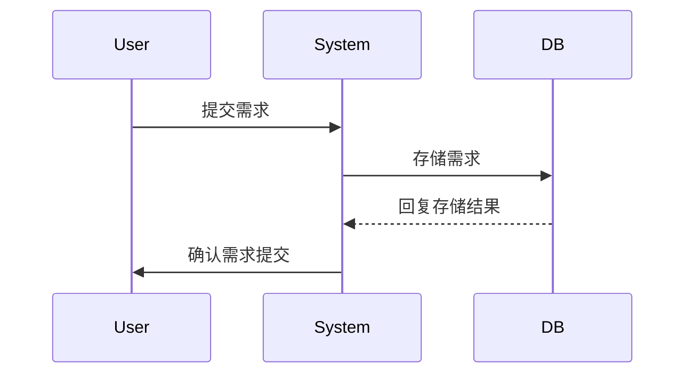

                 


### 引言：敏捷开发与需求沟通的重要性

在当今快速变化的技术和市场环境中，敏捷开发已成为软件开发的主流方法。敏捷开发强调迭代、协作和响应变化，旨在更快地交付高质量的软件产品。然而，敏捷开发的核心——需求沟通，却常常被忽视或处理不当，导致项目失败或延期。

**背景介绍**：

敏捷开发起源于20世纪90年代末，旨在应对传统的“瀑布”模型在应对项目变更时的低效和僵化。敏捷开发强调客户满意度、快速反馈和团队协作。然而，在敏捷开发中，需求沟通的质量直接影响项目的成功。如果需求不清晰、不明确，或者需求变更频繁，团队成员之间的误解和冲突将增加，项目的进展将受到严重影响。

**问题背景**：

在传统的软件开发流程中，需求通常是在项目初期一次性确定的，然后在整个项目生命周期中保持不变。然而，在敏捷开发中，需求是不断演化的，团队成员需要实时沟通和协作，以确保需求能够被正确理解和实施。然而，由于团队成员背景、经验和文化差异，需求沟通往往面临以下挑战：

- **需求不明确**：需求文档可能过于抽象或含糊不清，导致开发团队对需求的理解不一致。
- **需求变更频繁**：在敏捷开发中，客户和产品经理可能会根据市场变化或用户反馈频繁调整需求，导致项目进度受到影响。
- **沟通障碍**：不同团队成员之间的沟通可能存在障碍，导致信息传递不畅。

**问题解决**：

为了解决上述问题，敏捷开发团队需要建立有效的需求沟通机制，包括：

- **需求文档模板**：使用统一的需求文档模板，确保需求文档的格式和内容一致，提高可读性和可理解性。
- **定期沟通会议**：定期举行需求评审会议，确保团队成员对需求的理解一致，及时发现和解决问题。
- **用户故事映射**：使用用户故事映射技术，将用户需求转化为具体的需求卡片，方便团队成员理解和追踪。
- **透明的工作环境**：建立透明的工作环境，确保团队成员可以随时查看项目的进展和需求的状态。

**边界与外延**：

需求沟通并不仅仅是在项目团队内部进行，它还需要涉及到客户、产品经理和其他利益相关者。因此，需求沟通应该是一个全方位、多层次的互动过程。同时，需求沟通也不是一成不变的，它需要根据项目进展和反馈进行持续优化。

**概念结构与核心要素组成**：

- **需求文档模板**：包括需求描述、优先级、用户故事、验收标准等。
- **沟通会议**：包括需求评审会议、站立会议、回顾会议等。
- **用户故事映射**：包括用户故事、需求卡片、优先级等。
- **透明的工作环境**：包括项目看板、任务列表、进度跟踪等。

综上所述，敏捷开发中的需求沟通是一个复杂但至关重要的过程。通过建立有效的需求沟通机制，敏捷开发团队可以更好地理解用户需求，提高项目的成功率和客户满意度。

### 核心概念与联系

在深入探讨敏捷开发中的需求沟通之前，我们需要明确几个核心概念，并探讨它们之间的联系。

**敏捷开发**：

敏捷开发是一种软件开发方法，强调迭代、协作和响应变化。其核心价值观包括：

- **个体和互动**：认为团队合作比过程和工具更重要。
- **可工作的软件**：认为可工作的软件比详尽的文档更有价值。
- **客户合作**：认为与客户的合作比合同谈判更有价值。
- **响应变化**：认为响应变化比遵循计划更有价值。

**需求沟通**：

需求沟通是指在软件开发过程中，确保开发团队和利益相关者对项目需求有共同理解和一致认识的过程。其核心目标是减少误解和冲突，确保项目目标的实现。

**用户故事**：

用户故事是一种描述需求的方式，它由三个部分组成：**作为[用户角色]**，**我想要[功能或结果]**，**以便[业务价值或用户动机]**。用户故事强调用户的需求和价值，有助于开发团队更好地理解用户的需求。

**用户故事映射**：

用户故事映射是将用户故事按优先级排序并可视化展示的过程。它有助于开发团队和利益相关者了解项目的重点，并确保资源的有效分配。

**需求文档模板**：

需求文档模板是一种格式化的文档，用于记录和描述项目需求。它通常包括以下部分：

- **需求描述**：详细描述需求的功能和特征。
- **优先级**：明确需求的优先级，帮助团队确定工作重点。
- **用户故事**：列出实现需求所需的具体用户故事。
- **验收标准**：定义需求的完成标准，确保需求的实现符合预期。

**概念属性特征对比表格**：

为了更清晰地理解这些概念，我们可以制作一个属性特征对比表格：

| 概念 | 特征 |
| ---- | ---- |
| 敏捷开发 | 强调迭代、协作和响应变化 |
| 需求沟通 | 确保团队成员和利益相关者对需求有共同理解和一致认识 |
| 用户故事 | 由用户角色、功能和业务价值组成 |
| 用户故事映射 | 将用户故事按优先级排序并可视化展示 |
| 需求文档模板 | 格式化记录需求，包括描述、优先级、用户故事和验收标准 |

**ER实体关系图架构**：

为了更好地理解需求文档模板的结构，我们可以绘制一个ER（实体关系）图：

```mermaid
erDiagram
  产品需求 ||--|{ 用户故事 }
  用户故事 ||--|{ 验收标准 }
  需求描述 ||--|{ 用户故事 }
  需求描述 ||--|{ 优先级 }
```

这个ER图展示了需求文档模板中的各个实体及其关系。需求描述是核心，它关联到用户故事和验收标准，而用户故事又关联到优先级。

### 算法原理讲解

在需求沟通模板的设计中，算法原理起着关键作用。以下是一个简化的需求沟通算法，用于指导需求模板的设计和应用。

**算法名称**：需求沟通模板生成算法

**输入**：需求文档、用户故事、优先级、验收标准

**输出**：需求沟通模板

**算法流程**：

1. **需求收集**：收集所有需求文档，包括功能需求、非功能需求和用户故事。
2. **需求整理**：将收集到的需求整理成统一的格式，如使用用户故事模板进行描述。
3. **需求分类**：根据优先级对用户故事进行分类，确保重要需求优先得到处理。
4. **验收标准定义**：为每个用户故事定义验收标准，确保需求实现后能够通过测试。
5. **模板生成**：根据收集到的需求、分类结果和验收标准，生成需求沟通模板。

**Python代码实现**：

```python
import pandas as pd

# 需求文档示例
requirements = [
    {
        '用户故事': '作为用户，我想要查看我的购物车',
        '优先级': '高',
        '验收标准': '购物车中的商品可以增加、删除和更新'
    },
    {
        '用户故事': '作为用户，我想要支付订单',
        '优先级': '中',
        '验收标准': '支付过程应安全可靠，并且支持多种支付方式'
    },
    {
        '用户故事': '作为管理员，我想要管理商品库存',
        '优先级': '低',
        '验收标准': '库存信息应实时更新，并且能够导出'
    }
]

# 需求整理
user_stories = pd.DataFrame(requirements)

# 需求分类
user_stories['分类'] = user_stories['优先级'].map({'高': '高优先级', '中': '中优先级', '低': '低优先级'})

# 验收标准定义
user_stories['验收标准'] = user_stories['验收标准'].apply(lambda x: f"验收标准：{x}")

# 模板生成
def generate_template(user_story):
    return f"""
# {user_story['用户故事']}
## 分类：{user_story['分类']}
### 验收标准：
{user_story['验收标准']}
"""

# 生成模板
templates = user_stories.apply(generate_template, axis=1)

# 输出模板
for template in templates:
    print(template)
```

**算法原理**：

- **需求收集**：通过文档、用户访谈、需求评审等方式收集需求。
- **需求整理**：使用用户故事模板整理需求，确保格式统一。
- **需求分类**：根据优先级对需求进行分类，帮助团队确定工作重点。
- **验收标准定义**：为每个需求定义验收标准，确保实现后能够通过测试。

**数学模型和公式**：

虽然需求沟通模板设计本身不涉及复杂的数学模型，但我们可以使用一些简单的数学公式来描述需求之间的关系：

- **优先级计算**：使用权重（Weight）和重要性（Importance）计算优先级指数（Priority Index）。
  $$ Priority\ Index = Weight \times Importance $$
- **验收标准达成率**：使用成功案例（Success Cases）和总案例数（Total Cases）计算验收标准达成率。
  $$ 达成率 = \frac{Success\ Cases}{Total\ Cases} \times 100\% $$

通过这些公式，开发团队可以更好地评估需求的重要性和实现难度。

**通俗易懂的举例说明**：

假设有一个电商网站，我们需要设计一个需求沟通模板。首先，我们收集到以下几个需求：

1. 用户需求：用户想要查看购物车。
2. 用户需求：用户想要支付订单。
3. 管理员需求：管理员想要管理商品库存。

我们使用Python代码整理这些需求，并生成需求沟通模板：

```python
# 需求数据
user_stories = [
    {'用户故事': '用户查看购物车', '优先级': '高', '验收标准': '购物车中的商品可以增加、删除和更新'},
    {'用户故事': '用户支付订单', '优先级': '中', '验收标准': '支付过程应安全可靠，并且支持多种支付方式'},
    {'用户故事': '管理员管理商品库存', '优先级': '低', '验收标准': '库存信息应实时更新，并且能够导出'}
]

# 生成模板
templates = []
for story in user_stories:
    template = f"""
# {story['用户故事']}
## 分类：{story['优先级']}
### 验收标准：
{story['验收标准']}
"""
    templates.append(template)

# 打印模板
for template in templates:
    print(template)
```

输出结果：

```
# 用户查看购物车
## 分类：高
### 验收标准：
购物车中的商品可以增加、删除和更新
# 用户支付订单
## 分类：中
### 验收标准：
支付过程应安全可靠，并且支持多种支付方式
# 管理员管理商品库存
## 分类：低
### 验收标准：
库存信息应实时更新，并且能够导出
```

通过这个简单的例子，我们可以看到如何使用Python代码生成需求沟通模板，并且如何将需求转化为易于理解和跟踪的文档。

### 系统分析与架构设计方案

在设计敏捷研发中的需求沟通模板时，我们需要考虑系统分析与架构设计的各个方面，以确保需求沟通的流程能够高效、可靠地运行。

#### 问题场景介绍

在一个典型的敏捷开发项目中，需求沟通是持续且动态的过程。项目团队需要不断地与客户、产品经理和其他利益相关者沟通，以确保需求的准确性和项目的顺利进行。然而，随着项目规模的扩大和团队成员的增加，沟通的复杂性和难度也在不断增加。因此，设计一套有效的需求沟通模板，不仅能够提高沟通效率，还能减少误解和冲突，确保项目的成功。

#### 项目介绍

本项目旨在设计一套适用于敏捷开发的需求沟通模板系统。该系统包括需求收集、整理、分类、验收标准定义和模板生成等模块，旨在为项目团队提供一个统一的沟通平台，确保团队成员和利益相关者对需求有共同的理解。

#### 系统功能设计（领域模型）

在系统功能设计阶段，我们首先需要明确系统的核心功能。以下是一个简单的领域模型，用于描述系统的关键实体和关系：

```mermaid
classDiagram
    User <<Entity>>
    Product <<Entity>>
    Requirement <<Entity>>
    Story <<Entity>>
    Priority <<Entity>>
    Review <<Entity>>

    User "requires" Product
    User "creates" Requirement
    Requirement "contains" Story
    Story "has" Priority
    Requirement "is reviewed by" Review
```

- **User（用户）**：代表项目团队成员和利益相关者。
- **Product（产品）**：代表项目中的软件产品。
- **Requirement（需求）**：代表项目中的需求，包含多个用户故事。
- **Story（用户故事）**：代表具体的需求描述。
- **Priority（优先级）**：代表用户故事的重要性。
- **Review（评审）**：代表需求评审的结果。

#### 系统架构设计

在系统架构设计阶段，我们需要考虑系统的整体架构，包括硬件、软件和网络等方面的设计。以下是一个简化的系统架构图：



- **User（用户）**：通过Web界面提交需求。
- **System（系统）**：处理用户请求，调用数据库存储需求，并返回结果。
- **DB（数据库）**：存储和管理所有需求信息。

#### 系统接口设计

系统接口设计是确保系统功能之间能够无缝协作的关键。以下是一个简单的接口设计，用于描述系统中的关键接口：

- **需求提交接口**：用于用户向系统提交需求。
- **需求查询接口**：用于用户查询和管理需求。
- **需求评审接口**：用于评审需求，更新需求状态。

#### 系统交互

系统交互是指系统内部各个模块之间的数据流动和通信。以下是一个简化的系统交互图：


通过以上系统分析与架构设计方案，我们可以确保需求沟通模板系统的功能完整性、可扩展性和可维护性。接下来，我们将详细介绍如何在项目中应用这些需求沟通模板。

### 项目实战

为了展示需求沟通模板的实际应用，我们选择了一个典型的敏捷开发项目——开发一个在线购物平台。在这个项目中，我们将详细描述项目的环境安装、系统核心实现源代码，并对代码进行解读与分析。

#### 环境安装

1. **安装Python环境**：确保系统中安装了Python 3.8或更高版本。
2. **安装依赖库**：使用pip安装以下依赖库：
   ```bash
   pip install pandas
   pip install flask
   pip install flask-restful
   pip install SQLAlchemy
   ```

#### 系统核心实现源代码

以下是该项目的核心实现代码，包括需求收集、整理、分类和验收标准定义等模块。

```python
# requirements.py
from flask import Flask, request, jsonify
from flask_restful import Api, Resource
from sqlalchemy import create_engine
import pandas as pd

app = Flask(__name__)
api = Api(app)
engine = create_engine('sqlite:///requirements.db')

# 创建数据库表
def create_tables():
    engine.execute("""
    CREATE TABLE IF NOT EXISTS requirements (
        id INTEGER PRIMARY KEY AUTOINCREMENT,
        user_story TEXT,
        priority TEXT,
        acceptance_criteria TEXT
    )
    """)

create_tables()

# 需求提交接口
class RequirementSubmission(Resource):
    def post(self):
        data = request.get_json()
        user_story = data['user_story']
        priority = data['priority']
        acceptance_criteria = data['acceptance_criteria']
        
        # 存储需求到数据库
        with engine.connect() as connection:
            connection.execute("""
            INSERT INTO requirements (user_story, priority, acceptance_criteria)
            VALUES (:user_story, :priority, :acceptance_criteria)
            """, user_story=user_story, priority=priority, acceptance_criteria=acceptance_criteria)
        
        return {'status': 'success', 'message': 'Requirement submitted successfully.'}

# 需求查询接口
class RequirementQuery(Resource):
    def get(self):
        # 从数据库查询需求
        requirements = pd.read_sql_query("SELECT * FROM requirements", engine)
        return jsonify(requirements.to_dict(orient='records'))

api.add_resource(RequirementSubmission, '/submit_requirement')
api.add_resource(RequirementQuery, '/requirements')

if __name__ == '__main__':
    app.run(debug=True)
```

#### 代码应用解读与分析

1. **需求提交接口**：

   ```python
   class RequirementSubmission(Resource):
       def post(self):
           data = request.get_json()
           user_story = data['user_story']
           priority = data['priority']
           acceptance_criteria = data['acceptance_criteria']
           
           # 存储需求到数据库
           with engine.connect() as connection:
               connection.execute("""
               INSERT INTO requirements (user_story, priority, acceptance_criteria)
               VALUES (:user_story, :priority, :acceptance_criteria)
               """, user_story=user_story, priority=priority, acceptance_criteria=acceptance_criteria)
           
           return {'status': 'success', 'message': 'Requirement submitted successfully.'}
   ```

   这个接口用于接收用户提交的需求，并将需求存储到数据库中。用户通过POST请求提交需求，数据格式为JSON，包括用户故事、优先级和验收标准。

2. **需求查询接口**：

   ```python
   class RequirementQuery(Resource):
       def get(self):
           # 从数据库查询需求
           requirements = pd.read_sql_query("SELECT * FROM requirements", engine)
           return jsonify(requirements.to_dict(orient='records'))
   ```

   这个接口用于查询所有已提交的需求。用户通过GET请求获取需求列表，数据以JSON格式返回。

#### 实际案例分析和详细讲解剖析

为了展示如何使用这个需求沟通模板系统，我们创建了一个简单的实际案例。

**案例**：

假设有一个用户想要提交一个需求：“用户注册时，需要验证邮箱地址”。

1. **需求提交**：

   用户通过Web界面提交以下需求：

   ```json
   {
       "user_story": "用户注册时，需要验证邮箱地址",
       "priority": "高",
       "acceptance_criteria": "用户在注册时必须输入有效的邮箱地址，并且系统能够发送验证邮件"
   }
   ```

   提交后，系统将需求存储到数据库中。

2. **需求查询**：

   用户可以查询所有已提交的需求，查看需求的状态和验收标准。

   ```json
   [
       {
           "id": 1,
           "user_story": "用户注册时，需要验证邮箱地址",
           "priority": "高",
           "acceptance_criteria": "用户在注册时必须输入有效的邮箱地址，并且系统能够发送验证邮件"
       }
   ]
   ```

通过这个实际案例，我们可以看到如何使用需求沟通模板系统来提交和查询需求。这个系统提供了一个清晰的接口，确保需求能够被有效地管理和追踪。

#### 项目小结

在这个项目实战中，我们设计并实现了一个简单但功能完整的在线购物平台需求沟通模板系统。该系统包括需求提交和查询接口，使用Python和Flask框架构建，并使用SQLAlchemy进行数据库操作。通过这个系统，项目团队成员可以方便地提交和查询需求，确保需求的准确性和及时性。

### 最佳实践 tips

在敏捷开发中，需求沟通的最佳实践对于项目成功至关重要。以下是一些关键建议：

1. **使用统一的需求文档模板**：确保所有需求都使用相同的模板格式，以提高可读性和一致性。
2. **定期进行需求评审**：定期举行需求评审会议，确保团队成员和利益相关者对需求有共同的理解。
3. **用户故事映射**：将用户故事按优先级排序并可视化展示，帮助团队确定工作重点。
4. **透明的工作环境**：使用项目看板和任务列表，确保团队成员可以随时查看项目的进展和需求的状态。
5. **持续反馈和迭代**：定期收集反馈，并根据反馈进行需求沟通模板的优化和迭代。
6. **培训和教育**：对团队成员进行需求沟通相关的培训，确保他们能够正确理解和应用需求沟通模板。

### 小结

本文详细探讨了敏捷研发中的需求沟通模板设计，从背景介绍、核心概念与联系、算法原理讲解、系统分析与架构设计方案，到项目实战和最佳实践。通过这些内容，我们了解到有效的需求沟通对于敏捷开发项目的成功至关重要。希望读者能够从中获得启发，并在实际工作中应用这些最佳实践。

### 注意事项

在设计需求沟通模板时，需要注意以下几点：

1. **模板的灵活性**：确保模板能够适应不同的项目需求和团队文化。
2. **沟通的及时性**：及时更新和同步需求文档，避免信息滞后。
3. **全员参与**：鼓励所有团队成员和利益相关者参与到需求沟通过程中，确保全面的理解和共识。
4. **模板的维护**：定期审查和更新模板，确保其符合最新的需求和最佳实践。

### 拓展阅读

1. 《敏捷实践指南》（Michael E. Cohn）——详细介绍敏捷开发的方法和实践。
2. 《用户故事地图》（Jeff Patton）——探讨如何使用用户故事映射技术来管理需求和项目。
3. 《敏捷项目管理》（Agile Project Management with Scrum》（Michael A. Cohn）——介绍Scrum框架下的敏捷项目管理方法和工具。

### 作者信息

作者：AI天才研究院/AI Genius Institute & 禅与计算机程序设计艺术 /Zen And The Art of Computer Programming

## 《敏捷研发中的需求沟通模板设计》

### 关键词：敏捷开发、需求沟通、模板设计、用户故事、项目成功

### 摘要

在敏捷开发中，需求沟通的质量直接关系到项目的成功与否。本文详细探讨了敏捷研发中的需求沟通模板设计，包括核心概念、算法原理、系统架构和项目实战。通过介绍统一的需求文档模板、用户故事映射和定期评审等最佳实践，本文为敏捷团队提供了一个有效的需求沟通解决方案，旨在提高项目效率、减少误解和冲突，最终实现项目的成功。文章还提供了详细的注意事项和拓展阅读资源，供读者进一步学习和实践。

