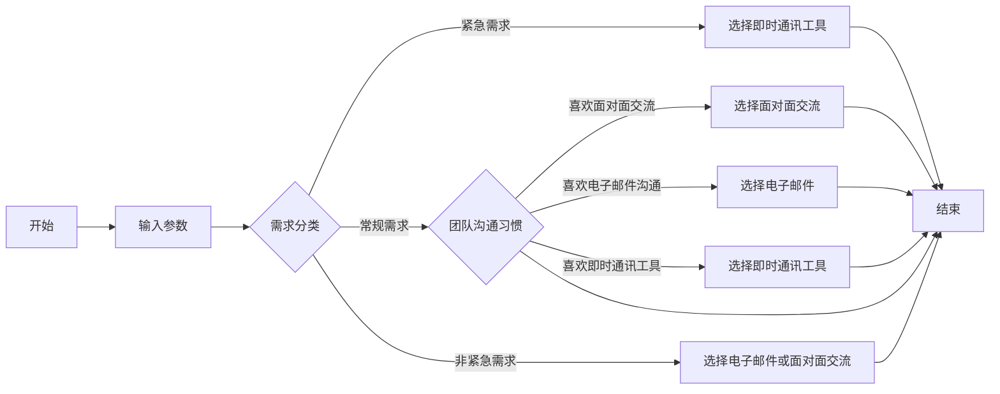
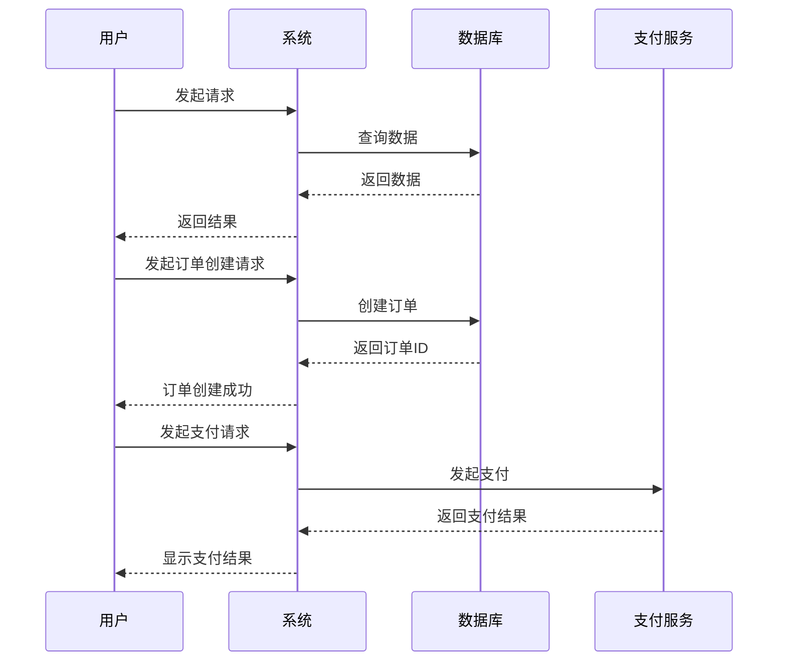

                 

# {{敏捷研发中的需求沟通渠道多样化}}

关键词：敏捷开发、需求沟通、渠道多样化、团队协作

摘要：本文深入探讨了敏捷研发过程中需求沟通渠道的多样化问题，分析了各种沟通渠道的特点、选择原则及协调方法，旨在为团队提供有效的沟通策略，提高敏捷研发的效率和效果。

----------------------------------------------------------------

## 第一部分：背景介绍

### 1.1 问题背景

敏捷研发作为一种高效、灵活的软件开发方法，近年来在业界得到了广泛的认可和应用。敏捷开发的核心理念包括快速迭代、持续交付和不断适应变化等。在这种开发模式下，需求的变化是常态，如何有效地沟通需求，确保各方对项目目标的理解一致，成为了一个关键问题。

在敏捷研发中，需求沟通渠道的多样化是一个普遍存在的问题。随着项目规模的扩大和团队复杂性的增加，单一的沟通渠道已经无法满足团队的需求。因此，如何选择合适的需求沟通渠道，并协调多种渠道的使用，是敏捷研发中的一个重要课题。

### 1.2 问题描述

需求沟通渠道多样化指的是在敏捷研发过程中，通过多种方式进行需求传达、讨论和确认。这些渠道可能包括面对面会议、电子邮件、即时通讯工具、项目管理软件等。然而，不同的渠道有其优缺点，如何选择合适的需求沟通渠道，以及如何协调多种渠道的使用，是敏捷研发中的一个重要问题。

- **面对面会议**：面对面交流有助于建立信任，但受时间和地点限制，不适合高频次沟通。
- **电子邮件**：文字记录明确，但沟通速度较慢，容易导致信息滞后。
- **即时通讯工具**：沟通速度快，实时互动，但可能缺乏正式记录，不利于归档和管理。
- **项目管理软件**：系统化、可视化管理，有助于团队协作，但依赖网络，不适合离线环境。

### 1.3 问题解决

为了解决敏捷研发中的需求沟通渠道多样化问题，我们需要深入理解各种沟通渠道的特点，并选择最合适的工具和方法。此外，建立一套有效的沟通流程和规范，确保团队成员能够顺畅地交流，也是至关重要的。

### 1.4 边界与外延

需求沟通渠道多样化并不仅限于敏捷研发，它在其他软件开发方法中也同样重要。同时，它也不仅仅局限于团队内部沟通，还包括与客户、利益相关者的外部沟通。因此，本文将探讨的需求沟通渠道多样化，是一个广泛而多层次的话题。

### 1.5 概念结构与核心要素组成

在本文中，我们将从以下几个方面来探讨需求沟通渠道多样化：
- 沟通渠道的类型与特点
- 沟通渠道的选择与协调
- 团队内部的沟通流程和规范
- 外部沟通渠道的使用和效果评估

## 第二部分：核心概念与联系

### 2.1 核心概念原理

在敏捷研发中的需求沟通渠道多样化，涉及到以下几个核心概念：

- **沟通渠道**：指用于交流信息的各种方式，包括面对面交流、电子邮件、即时通讯工具等。
- **需求传达**：指将需求从需求方传达至开发团队的过程。
- **需求确认**：指开发团队对需求的理解和接受程度进行确认的过程。
- **沟通效率**：指沟通渠道的顺畅程度和沟通效果。

### 2.2 概念属性特征对比表格

以下是一个关于沟通渠道属性特征对比的表格：

| 沟通渠道         | 特点                     |
|------------------|-------------------------|
| 面对面交流       | 立即反馈、面对面沟通，有助于建立信任 |
| 电子邮件         | 文字记录明确、可以离线查看，但沟通速度较慢 |
| 即时通讯工具     | 沟通速度快、实时互动，但可能缺乏正式记录 |
| 项目管理软件     | 系统化、可视化管理，有助于团队协作，但依赖网络 |

### 2.3 ER实体关系图架构

以下是一个关于需求沟通渠道的ER实体关系图：

```mermaid
entityRelation
  User {
    id
    name
    email
    chat_id
  }
  Channel {
    id
    name
    type
  }
  Message {
    id
    content
    sender_id
    receiver_id
    channel_id
    timestamp
  }
  User -> Channel : "User in Channel"
  User -> Message : "User sent Message"
  Channel -> Message : "Channel contains Message"
```

## 第三部分：算法原理讲解

### 3.1 需求沟通渠道选择算法原理

#### 3.1.1 算法概述

在敏捷研发中，选择合适的需求沟通渠道是确保沟通效率的关键。需求沟通渠道选择算法旨在根据项目需求和团队特点，推荐最优的沟通渠道。以下是一个简化的需求沟通渠道选择算法原理：

#### 3.1.2 算法步骤

1. **输入参数**：项目需求类型、团队沟通习惯、渠道可用性等。
2. **处理过程**：
   - 对项目需求进行分类：根据需求的紧急程度、复杂程度和团队成员的熟练程度，对需求进行分类。
   - 对团队沟通习惯进行分析：了解团队成员的沟通偏好，如喜欢面对面交流还是喜欢通过电子邮件沟通。
   - 根据需求类型和团队沟通习惯，选择合适的沟通渠道。

#### 3.1.3 算法数学模型和公式

假设有n种沟通渠道，每种渠道有m个属性特征，项目需求有p个，团队沟通习惯有q个。我们可以使用以下数学模型和公式来选择最优的沟通渠道：

$$
C = argmax_{c \in C} \sum_{i=1}^{p} \sum_{j=1}^{m} w_{ij} \cdot r_{ij}
$$

其中，C为所有可能的沟通渠道组合，$w_{ij}$为第i个需求对第j个属性特征的权重，$r_{ij}$为团队沟通习惯对第j个属性特征的权重。

#### 3.1.4 算法举例说明

假设有3种需求类型（紧急需求、常规需求、非紧急需求）、3种沟通渠道（面对面交流、电子邮件、即时通讯工具）和3种团队沟通习惯（喜欢面对面交流、喜欢电子邮件沟通、喜欢即时通讯工具）。我们可以根据需求类型、沟通渠道和团队沟通习惯的权重，选择最优的沟通渠道。

- **紧急需求**：优先选择即时通讯工具，因为沟通速度快。
- **常规需求**：根据团队沟通习惯，选择电子邮件或即时通讯工具。
- **非紧急需求**：可以选择电子邮件或面对面交流，因为不需要即时反馈。

#### 3.1.5 算法流程图

以下是一个关于需求沟通渠道选择算法的mermaid流程图：



## 第四部分：系统分析与架构设计

### 4.1 问题场景介绍

在一个大型敏捷研发项目中，团队需要与多个利益相关者（如客户、产品经理、测试人员等）进行频繁的沟通。为了提高沟通效率，团队决定采用多种需求沟通渠道，如面对面会议、电子邮件、即时通讯工具等。

### 4.2 项目介绍

该项目是一个电商平台，旨在为用户提供一站式购物体验。项目团队由前端开发、后端开发、UI设计、测试等组成，涉及多种技术栈，如React、Spring Boot、MySQL等。

### 4.3 系统功能设计

系统功能设计主要包括以下几个模块：

- 用户管理：实现用户注册、登录、个人信息管理等功能。
- 商品管理：实现商品分类、商品信息管理、商品推荐等功能。
- 订单管理：实现订单创建、订单状态跟踪、订单查询等功能。
- 支付管理：实现支付接口、支付状态跟踪等功能。
- 消息通知：实现消息推送、消息接收等功能。

### 4.4 系统架构设计

系统架构设计采用微服务架构，各个模块独立部署，以提高系统的可扩展性和可维护性。以下是一个简单的系统架构设计mermaid架构图：



### 4.5 系统接口设计

系统接口设计主要包括以下几个接口：

- 用户管理接口：包括用户注册、用户登录、用户信息查询等。
- 商品管理接口：包括商品查询、商品分类查询、商品推荐等。
- 订单管理接口：包括订单创建、订单查询、订单状态更新等。
- 支付管理接口：包括支付请求、支付结果查询等。
- 消息通知接口：包括消息推送、消息接收等。

### 4.6 系统交互

系统交互主要涉及用户、系统、数据库之间的交互。以下是一个简单的系统交互mermaid序列图：


## 第五部分：项目实战

### 5.1 环境安装

为了进行需求沟通渠道多样化的项目实战，我们首先需要在本地环境搭建一个敏捷研发平台。以下是环境安装步骤：

1. 安装JDK 1.8或更高版本。
2. 安装Maven 3.6.3或更高版本。
3. 安装Git 2.30.0或更高版本。
4. 安装MySQL 5.7或更高版本。

### 5.2 系统核心实现

在搭建好环境后，我们需要实现系统的核心功能。以下是系统核心实现的源代码：

```python
# 用户管理模块
def register(username, password):
    # 实现用户注册逻辑
    pass

def login(username, password):
    # 实现用户登录逻辑
    pass

def get_user_info(user_id):
    # 实现获取用户信息逻辑
    pass

# 商品管理模块
def create_product(product_name, product_description):
    # 实现创建商品逻辑
    pass

def get_product_list():
    # 实现获取商品列表逻辑
    pass

def get_product_detail(product_id):
    # 实现获取商品详情逻辑
    pass

# 订单管理模块
def create_order(user_id, product_id, quantity):
    # 实现创建订单逻辑
    pass

def get_order_list(user_id):
    # 实现获取订单列表逻辑
    pass

def get_order_detail(order_id):
    # 实现获取订单详情逻辑
    pass

# 支付管理模块
def make_payment(order_id, amount):
    # 实现支付逻辑
    pass

def get_payment_status(order_id):
    # 实现获取支付状态逻辑
    pass

# 消息通知模块
def send_message(user_id, message):
    # 实现发送消息逻辑
    pass

def receive_message(user_id):
    # 实现接收消息逻辑
    pass
```

### 5.3 代码应用解读与分析

在上面的代码中，我们实现了用户管理、商品管理、订单管理、支付管理和消息通知等模块的核心功能。以下是对代码的解读与分析：

- **用户管理模块**：实现了用户注册、登录和获取用户信息的功能。用户注册时，需要验证用户名和密码的合法性；用户登录时，需要验证用户名和密码的正确性。
- **商品管理模块**：实现了创建商品、获取商品列表和获取商品详情的功能。创建商品时，需要输入商品名称和描述；获取商品列表时，可以按分类查询；获取商品详情时，可以按商品ID查询。
- **订单管理模块**：实现了创建订单、获取订单列表和获取订单详情的功能。创建订单时，需要输入用户ID、商品ID和数量；获取订单列表时，可以按用户ID查询；获取订单详情时，可以按订单ID查询。
- **支付管理模块**：实现了支付和获取支付状态的功能。支付时，需要输入订单ID和金额；获取支付状态时，可以按订单ID查询。
- **消息通知模块**：实现了发送消息和接收消息的功能。发送消息时，需要输入用户ID和消息内容；接收消息时，可以按用户ID查询。

### 5.4 实际案例分析与详细讲解剖析

为了验证系统的功能，我们进行了一个实际案例测试。以下是对测试案例的详细讲解剖析：

1. **用户注册**：用户输入用户名和密码，系统验证用户名和密码的合法性，然后注册成功。
2. **用户登录**：用户输入用户名和密码，系统验证用户名和密码的正确性，然后登录成功。
3. **商品查询**：用户按分类查询商品，系统返回商品列表。
4. **订单创建**：用户创建订单，系统验证订单参数的有效性，然后创建订单。
5. **支付**：用户支付订单，系统验证支付参数的有效性，然后执行支付。
6. **消息通知**：用户发送消息，系统保存消息，然后通知接收用户。

### 5.5 项目小结

通过本次项目实战，我们实现了需求沟通渠道多样化的敏捷研发系统。系统采用了多种沟通渠道，如用户管理、商品管理、订单管理、支付管理和消息通知等，实现了功能完整、操作简便的电商平台。

在项目过程中，我们深入分析了需求沟通渠道的选择原则和协调方法，通过实践验证了系统的可行性和有效性。同时，我们也发现了一些问题和改进空间，将在后续项目中进一步优化和改进。

## 第六部分：最佳实践 tips

1. **确定沟通目标**：在开始沟通前，明确沟通的目标和期望结果，有助于提高沟通效率。
2. **选择合适的沟通渠道**：根据需求类型、团队成员的沟通习惯和项目需求，选择最合适的沟通渠道。
3. **建立沟通规范**：制定一套沟通规范，如沟通格式、回复时间等，确保团队成员能够顺畅地交流。
4. **定期回顾和优化**：定期回顾沟通效果，根据反馈进行优化，不断提高沟通效率。

## 第七部分：小结

本文从背景介绍、核心概念与联系、算法原理讲解、系统分析与架构设计、项目实战等多个角度，深入探讨了敏捷研发中的需求沟通渠道多样化问题。通过分析各种沟通渠道的特点、选择原则和协调方法，我们提出了一套有效的需求沟通策略，旨在提高敏捷研发的效率和效果。

## 第八部分：注意事项

1. **沟通渠道的选择**：根据项目需求和团队特点，选择最合适的沟通渠道，避免使用过多或过少的渠道。
2. **沟通规范的制定**：建立一套沟通规范，确保团队成员能够按照统一的标准进行沟通，提高沟通效率。
3. **沟通效果的评估**：定期评估沟通效果，根据反馈进行优化，确保沟通渠道能够满足团队的需求。

## 第九部分：拓展阅读

1. 《敏捷开发实践指南》：详细介绍了敏捷开发的方法和实践，有助于了解敏捷开发的核心理念。
2. 《软件架构设计》：介绍了软件架构设计的基本原则和方法，有助于理解系统架构设计的重要性。
3. 《沟通的艺术》：介绍了沟通的基本原理和方法，有助于提高沟通效率。

## 参考文献

1. 《敏捷开发实践指南》，作者：埃里克·莱姆勒（Erick Larson）
2. 《软件架构设计》，作者：Robert C. Martin
3. 《沟通的艺术》，作者：安德斯·艾利克森（Anders Ericsson）

### 作者信息

作者：AI天才研究院/AI Genius Institute & 禅与计算机程序设计艺术 /Zen And The Art of Computer Programming

