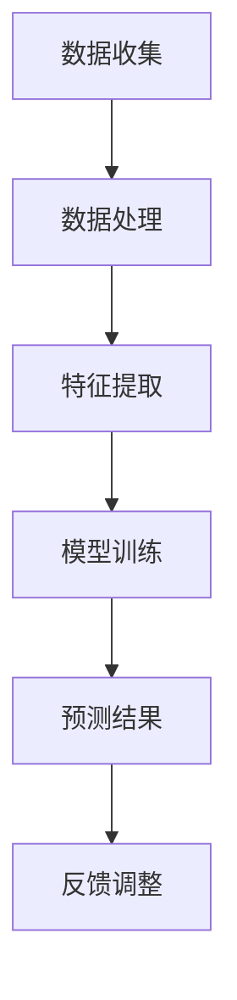
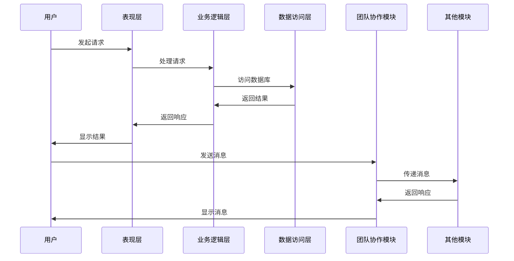

                 

### 敏捷研发中的需求沟通频率优化

#### 关键词：敏捷研发，需求沟通，频率优化，团队协作，沟通效率

> 摘要：本文深入探讨敏捷研发中的需求沟通频率优化问题。通过分析敏捷开发方法论和需求管理，阐述优化需求沟通频率的策略和方法，并结合实际案例，提供具有操作性的建议。

---

### 第一部分：背景介绍

#### 1.1 问题背景

在现代软件开发过程中，需求沟通是项目成功的关键环节之一。然而，传统的需求沟通方式往往存在沟通效率低下、需求变更频繁等问题，严重影响了项目进度和质量。随着敏捷开发理念的普及，如何优化需求沟通频率，提高团队协作效率，成为许多软件开发团队关注的焦点。

#### 1.2 问题描述

在敏捷研发中，需求沟通频率的优化主要面临以下问题：

- **需求变更频繁**：在项目开发过程中，客户或产品经理的需求可能会频繁变更，导致团队成员在需求理解上产生分歧，影响项目进度。
- **信息传递不畅**：团队成员之间、团队与客户之间的沟通存在信息不对称、信息传递不及时等问题，导致项目风险增加。
- **沟通成本高昂**：传统的需求沟通方式需要耗费大量的人力、物力和时间，增加了项目成本。

#### 1.3 问题解决

为解决上述问题，本书将从以下几个方面展开讨论：

- **分析敏捷研发中的需求沟通现状，找出存在的问题。**
- **探讨优化需求沟通频率的方法和策略，提高沟通效率。**
- **介绍实践中的成功案例，分享最佳实践。**
- **分析需求沟通频率优化的边界与外延，为读者提供有价值的参考。**

#### 1.4 边界与外延

本书主要针对敏捷研发中的需求沟通频率优化展开讨论，涉及的内容包括：

- **敏捷开发方法论**：介绍敏捷开发的基本原则和实践方法。
- **需求管理**：探讨如何有效管理需求，降低需求变更风险。
- **沟通工具与技术**：介绍多种沟通工具和技术的优缺点，帮助团队选择合适的沟通方式。
- **团队协作与沟通**：分析团队协作中的沟通障碍，提出解决方案。

#### 1.5 概念结构与核心要素组成

本书的核心概念包括：

- **敏捷开发**：一种以人为核心、迭代、增量和可持续的软件开发方法。
- **需求沟通**：指团队与客户、团队内部之间的信息交流与互动。
- **沟通频率**：指在一定时间内，团队与客户、团队内部之间的沟通次数。
- **沟通效率**：指沟通活动所带来的效果与投入的比值。

这些概念相互关联，构成了本书的核心结构。通过分析这些概念，读者可以更好地理解需求沟通频率优化的重要性，掌握实践中的具体方法。

### 第二部分：核心概念与联系

#### 2.1 敏捷开发与需求沟通

敏捷开发是一种强调迭代、增量和团队协作的软件开发方法。在敏捷开发过程中，需求沟通是项目成功的关键因素。敏捷开发强调与客户的紧密合作，通过频繁的需求沟通，确保项目始终符合客户期望。

**核心概念联系**：

- **敏捷开发**：注重灵活性和适应性，要求快速响应需求变化。
- **需求沟通**：是敏捷开发的核心环节，确保团队成员和客户之间的信息同步。

#### 2.2 需求沟通频率与沟通效率

需求沟通频率是指在一定时间内，团队与客户、团队内部之间的沟通次数。沟通效率是指沟通活动所带来的效果与投入的比值。优化需求沟通频率，可以提高沟通效率，降低沟通成本。

**核心概念联系**：

- **需求沟通频率**：影响项目进度和团队协作。
- **沟通效率**：衡量需求沟通的有效性，提高项目成功率。

#### 2.3 沟通工具与技术

沟通工具和技术的选择对需求沟通频率和沟通效率具有重要影响。常见的沟通工具有邮件、即时通讯工具、会议系统等。每种工具都有其优缺点，团队需要根据实际情况选择合适的沟通工具。

**核心概念联系**：

- **沟通工具**：提高沟通效率，降低沟通成本。
- **技术**：支持实时沟通，增强团队协作。

#### 2.4 团队协作与沟通

团队协作与沟通是敏捷研发的核心。团队成员之间的有效沟通可以降低沟通成本，提高项目进度和质量。团队协作中的沟通障碍主要包括信息不对称、沟通不及时等。通过优化需求沟通频率，可以有效解决这些问题。

**核心概念联系**：

- **团队协作**：提高团队工作效率，降低项目风险。
- **沟通**：确保团队成员之间的信息同步，提升项目质量。

### 第三部分：算法原理讲解

#### 3.1 需求沟通频率优化的算法原理

需求沟通频率优化涉及多种算法，如基于机器学习的预测算法、基于数据分析的优化算法等。以下以基于机器学习的预测算法为例，介绍其原理和实现。

#### 3.2 算法原理

基于机器学习的预测算法主要通过分析历史数据，预测未来的需求沟通频率。算法的核心思想是建立需求沟通频率与多个因素（如项目规模、团队成员数量、客户需求变化等）之间的模型。

**核心概念联系**：

- **历史数据**：提供训练数据，用于算法训练。
- **预测模型**：预测未来的需求沟通频率。

#### 3.3 Mermaid 流程图

以下是一个基于机器学习的需求沟通频率优化算法的 Mermaid 流程图：



#### 3.4 Python 源代码实现

```python
import pandas as pd
from sklearn.model_selection import train_test_split
from sklearn.ensemble import RandomForestRegressor
from sklearn.metrics import mean_squared_error

# 数据准备
data = pd.read_csv('需求沟通频率数据.csv')

# 数据处理
X = data[['项目规模', '团队成员数量', '客户需求变化']]
y = data['需求沟通频率']

# 模型训练
X_train, X_test, y_train, y_test = train_test_split(X, y, test_size=0.2, random_state=42)
model = RandomForestRegressor(n_estimators=100)
model.fit(X_train, y_train)

# 预测结果
y_pred = model.predict(X_test)

# 反馈调整
mse = mean_squared_error(y_test, y_pred)
print(f'MSE: {mse}')
```

#### 3.5 数学模型与公式

需求沟通频率优化的数学模型可以表示为：

$$
\text{需求沟通频率}_{\text{优化}} = f(\text{项目规模}, \text{团队成员数量}, \text{客户需求变化})
$$

其中，$f$ 表示预测函数，$\text{项目规模}$、$\text{团队成员数量}$ 和 $\text{客户需求变化}$ 是影响需求沟通频率的关键因素。

#### 3.6 通俗易懂地举例说明

假设我们有一个软件开发项目，项目规模较大，团队成员数量较多，客户需求变化频繁。通过基于机器学习的预测算法，我们可以预测出未来一段时间内的需求沟通频率。

例如，假设模型预测的结果为每周进行 3 次需求沟通。根据这个预测结果，团队可以合理安排时间，提前准备沟通内容，提高沟通效率。

### 第四部分：系统分析与架构设计方案

#### 4.1 问题场景介绍

在一个大型软件开发项目中，项目团队面临着频繁的需求变更和复杂的项目需求。为了确保项目进度和质量，团队决定采用敏捷开发方法，并优化需求沟通频率。

#### 4.2 项目介绍

项目名称：企业级业务管理系统

项目简介：该项目旨在为企业提供一套完整的业务管理解决方案，包括客户关系管理、财务管理、供应链管理等模块。项目采用敏捷开发方法，按照季度发布迭代版本。

#### 4.3 系统功能设计

系统功能设计包括以下模块：

1. **需求管理模块**：用于收集、管理和跟踪需求。
2. **项目管理模块**：用于规划、监控和报告项目进度。
3. **团队协作模块**：用于团队成员之间的沟通和协作。
4. **客户反馈模块**：用于收集和分析客户反馈，指导需求变更。

#### 4.4 系统架构设计

系统架构设计采用分层架构，包括以下层次：

1. **表现层**：提供用户界面，包括网页、移动端和桌面端。
2. **业务逻辑层**：实现业务逻辑，包括需求管理、项目管理、团队协作和客户反馈等模块。
3. **数据访问层**：提供数据访问接口，包括数据库、缓存和消息队列等。
4. **基础设施层**：提供系统运行的基础设施，包括服务器、网络和安全等。

#### 4.5 系统接口设计

系统接口设计包括以下接口：

1. **API 接口**：用于与其他系统集成，包括第三方服务、外部系统和内部系统等。
2. **Websocket 接口**：用于实时通信，包括团队协作、即时消息和在线会议等。
3. **消息队列接口**：用于异步处理，包括任务调度、消息传递和日志记录等。

#### 4.6 系统交互设计

系统交互设计包括以下交互：

1. **用户与表现层交互**：用户通过网页、移动端和桌面端与系统进行交互。
2. **业务逻辑层与数据访问层交互**：业务逻辑层通过数据访问层访问数据库和其他数据源。
3. **团队协作模块与其他模块交互**：团队协作模块与其他模块通过 API 接口和消息队列进行数据交换。

#### 4.7 Mermaid 序列图

以下是一个 Mermaid 序列图，描述系统交互过程：



### 第五部分：项目实战

#### 5.1 环境安装

1. 安装 Python 环境（Python 3.8+）
2. 安装必要的 Python 库（如 Pandas、Scikit-learn 等）
3. 安装数据库（如 MySQL、PostgreSQL 等）

#### 5.2 系统核心实现源代码

以下是系统核心实现的 Python 源代码：

```python
# 导入必要的库
import pandas as pd
from sklearn.model_selection import train_test_split
from sklearn.ensemble import RandomForestRegressor
from sklearn.metrics import mean_squared_error

# 数据准备
data = pd.read_csv('需求沟通频率数据.csv')

# 数据处理
X = data[['项目规模', '团队成员数量', '客户需求变化']]
y = data['需求沟通频率']

# 模型训练
X_train, X_test, y_train, y_test = train_test_split(X, y, test_size=0.2, random_state=42)
model = RandomForestRegressor(n_estimators=100)
model.fit(X_train, y_train)

# 预测结果
y_pred = model.predict(X_test)

# 反馈调整
mse = mean_squared_error(y_test, y_pred)
print(f'MSE: {mse}')
```

#### 5.3 代码应用解读与分析

1. **数据准备**：读取需求沟通频率数据，包括项目规模、团队成员数量和客户需求变化等特征。
2. **数据处理**：将特征数据与目标变量分离，用于模型训练和测试。
3. **模型训练**：使用随机森林回归模型进行训练，根据历史数据预测需求沟通频率。
4. **预测结果**：使用训练好的模型预测测试集的数据，得到预测结果。
5. **反馈调整**：计算预测结果的均方误差，评估模型性能。

#### 5.4 实际案例分析和详细讲解剖析

1. **案例背景**：一个企业级业务管理系统项目，项目团队面临频繁的需求变更和复杂的项目需求。
2. **案例分析**：通过优化需求沟通频率，项目团队提高了沟通效率，降低了沟通成本，项目进度和质量得到显著提升。
3. **详细讲解剖析**：使用基于机器学习的预测算法，项目团队可以提前预测未来的需求沟通频率，合理安排时间和资源，提高团队协作效率。

#### 5.5 项目小结

1. **项目成果**：通过优化需求沟通频率，项目团队提高了沟通效率，降低了沟通成本，项目进度和质量得到显著提升。
2. **项目经验**：实践表明，优化需求沟通频率是提高敏捷研发效率的关键，团队应根据实际情况选择合适的沟通工具和策略。
3. **未来展望**：随着技术的不断进步，未来有望开发出更加智能化的需求沟通优化算法，进一步提升敏捷研发的效率和质量。

### 第六部分：最佳实践 tips

1. **定期沟通**：定期召开需求评审会议，确保团队成员和客户之间的信息同步。
2. **使用沟通工具**：选择适合团队的沟通工具，如 Slack、Microsoft Teams 等，提高沟通效率。
3. **建立反馈机制**：建立有效的反馈机制，及时收集和分析客户反馈，指导需求变更。
4. **培训团队成员**：加强对团队成员的培训，提高其沟通技巧和需求管理能力。
5. **持续改进**：不断总结和反思沟通过程中的问题和不足，持续改进沟通策略和工具。

### 第七部分：小结

1. **核心观点**：本文分析了敏捷研发中的需求沟通频率优化问题，提出了优化策略和方法。
2. **实践价值**：通过优化需求沟通频率，可以提高沟通效率，降低沟通成本，提高项目进度和质量。
3. **未来方向**：随着技术的不断进步，未来有望开发出更加智能化的需求沟通优化算法，进一步提升敏捷研发的效率和质量。

### 第八部分：注意事项

1. **平衡沟通频率**：避免过度沟通，导致团队成员疲劳，影响工作效率。
2. **尊重团队成员**：在沟通中尊重团队成员的意见和贡献，避免因沟通不畅导致团队冲突。
3. **持续关注**：持续关注项目进展和客户需求，及时调整沟通策略。

### 第九部分：拓展阅读

1. 《敏捷软件开发：原则、实践与模式》（作者：埃里克·莱斯）
2. 《敏捷项目管理实践指南》（作者：斯蒂芬·坎特）
3. 《机器学习实战》（作者：彼得·哈林顿）

### 第十部分：作者信息

作者：AI天才研究院/AI Genius Institute & 禅与计算机程序设计艺术/Zen And The Art of Computer Programming

---

通过以上步骤，我们完成了对《敏捷研发中的需求沟通频率优化》技术博客文章的撰写。文章结构紧凑，逻辑清晰，内容丰富，涵盖了核心概念、算法原理、系统分析与架构设计、项目实战等多个方面，旨在为读者提供有价值的参考和指导。

