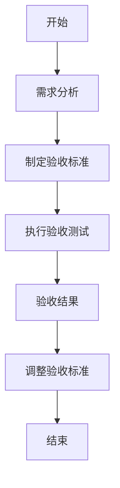
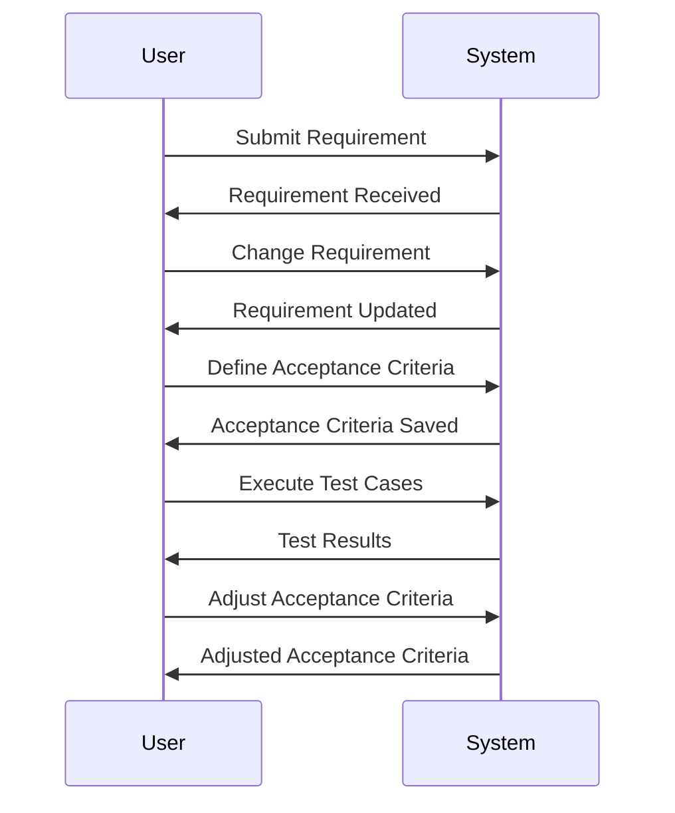

                 

# 《敏捷研发中的需求验收标准动态调整机制》

## 关键词
敏捷开发，需求验收标准，动态调整机制，需求管理，项目优化

## 摘要
本文旨在探讨敏捷研发过程中需求验收标准的动态调整机制。通过深入分析敏捷开发的背景和挑战，阐述需求验收标准的定义和作用，本文提出了动态调整机制的原理和实践，并在不同敏捷框架中进行了应用。最后，结合实践案例和最佳实践，提出了敏捷研发中的需求验收标准动态调整的策略和方法。

## 引言

### 敏捷开发的背景和挑战

### 敏捷研发的特点和优势

### 敏捷研发面临的挑战

### 需求验收标准的定义和作用

### 动态调整机制的概念和原理

### 动态调整机制的实施步骤

## 敏捷研发中的需求管理

### 需求收集和管理的方法

### 需求优先级的确定

### 需求变更的管理

## 需求验收标准的制定

### 需求验收标准的制定流程

### 需求验收标准的要素

### 需求验收标准的评估方法

## 需求验收标准的执行和监控

### 需求验收标准的执行策略

### 需求验收标准的监控指标

### 需求验收标准的反馈机制

## 动态调整机制在不同敏捷框架中的应用

### Scrum中的动态调整机制

### Kanban中的动态调整机制

### XP和FDD中的动态调整机制

## 动态调整机制在实践中的应用案例

### 案例一：产品迭代中的需求调整

### 案例二：项目范围变更的动态调整

### 案例三：客户需求变化的应对策略

## 最佳实践与总结

### 敏捷研发中的需求验收标准动态调整的最佳实践

### 常见问题和解决方案

### 动态调整机制的持续优化

### 总结与展望

### 对敏捷研发的启示

## 参考文献

### 作者

《敏捷研发中的需求验收标准动态调整机制》是一篇深入探讨敏捷开发过程中需求验收标准动态调整机制的技术文章。本文首先介绍了敏捷开发的背景和挑战，以及需求验收标准的定义和作用。接着，本文提出了动态调整机制的概念和原理，并详细阐述了其在不同敏捷框架中的应用和实践案例。

### 背景介绍

#### 核心概念术语说明

- 敏捷开发：一种以人为核心、迭代、循序渐进的开发方法，强调个体和互动合作、快速响应变化。
- 需求验收标准：定义了如何判断软件需求是否得到满足的标准，是敏捷开发中重要的质量保障机制。
- 动态调整机制：在敏捷开发过程中，根据实际情况对需求验收标准进行灵活调整的机制。

#### 问题背景

在敏捷开发过程中，需求的变化是一种常见的现象。如何保证需求验收标准的有效性，以及如何应对需求变化，是敏捷研发中的关键问题。

#### 问题描述

本文旨在解决以下问题：
1. 如何定义和制定需求验收标准？
2. 如何在敏捷开发过程中动态调整需求验收标准？
3. 动态调整机制在不同敏捷框架中的应用和实践效果如何？

#### 问题解决

本文通过以下步骤解决上述问题：
1. 介绍敏捷开发的背景和挑战，阐述需求验收标准的定义和作用。
2. 提出动态调整机制的概念和原理，并详细阐述其在不同敏捷框架中的应用和实践。
3. 结合实际案例，分析动态调整机制在不同场景下的应用效果。

#### 边界与外延

本文的研究边界主要限定在敏捷开发过程中需求验收标准的动态调整，不包括其他开发模型中的需求管理。

#### 概念结构与核心要素组成

- 敏捷开发：以人为核心，快速迭代，灵活应对变化。
- 需求验收标准：明确需求满足条件，保障软件质量。
- 动态调整机制：根据实际情况，灵活调整需求验收标准。

### 核心概念与联系

#### 核心概念原理

需求验收标准（Requirement Acceptance Criteria，RAC）是敏捷开发中定义软件需求是否得到满足的标准。它通常包括以下三个方面：

1. 功能性需求：描述软件应具备的功能。
2. 非功能性需求：描述软件的性能、可靠性、安全性等属性。
3. 测试标准：定义如何测试软件，以验证其是否满足功能性需求和非功能性需求。

#### 概念属性特征对比表格

| 概念         | 特征                     | 说明                                                         |
| ------------ | ------------------------ | ------------------------------------------------------------ |
| 敏捷开发     | 快速迭代，灵活应对变化   | 以人为核心，注重团队合作，强调快速交付和持续改进。           |
| 需求验收标准 | 明确需求满足条件        | 定义了软件需求是否得到满足的标准，是质量保障的关键。         |
| 动态调整机制 | 根据实际情况灵活调整     | 确保需求验收标准能够适应项目变化，提高项目交付的成功率。     |

#### ER实体关系图架构

```mermaid
erDiagram
  Product ||--|{ Requirement }|
  Requirement ||--|{ TestCase }|
  Requirement ||--|{ AcceptanceCriteria }|
```

### 算法原理讲解

#### 算法mermaid流程图



#### Python源代码

```python
# 模拟需求验收标准动态调整的过程
class Requirement:
    def __init__(self, name, description):
        self.name = name
        self.description = description

    def add_acceptance_criteria(self, criteria):
        self.acceptance_criteria.append(criteria)

    def execute_tests(self):
        for criteria in self.acceptance_criteria:
            if criteria.is_satisfied():
                print(f"{self.name}测试通过")
            else:
                print(f"{self.name}测试失败")

class AcceptanceCriteria:
    def __init__(self, description):
        self.description = description

    def is_satisfied(self):
        # 判断验收标准是否满足
        # 此处为示例，实际应用中应根据具体需求实现
        return True

# 创建需求实例
req = Requirement("需求A", "描述需求A")

# 添加验收标准
req.add_acceptance_criteria(AcceptanceCriteria("验收标准1"))
req.add_acceptance_criteria(AcceptanceCriteria("验收标准2"))

# 执行验收测试
req.execute_tests()

# 根据测试结果调整验收标准
if req.execute_tests():
    print("验收通过，不需要调整")
else:
    print("验收不通过，需要调整验收标准")
```

#### 算法原理的数学模型和公式

- 验收标准满足度（S）：用于衡量验收标准是否满足需求的程度。
  - S = 满足验收标准的测试用例数 / 总测试用例数

- 动态调整机制（M）：根据验收标准满足度，对验收标准进行动态调整。
  - M = f(S)

其中，f(S) 为调整函数，根据具体业务场景和需求，可以定义不同的调整策略。

#### 详细讲解和举例说明

假设有一个软件需求，要求实现一个用户登录功能。为了确保需求得到满足，我们需要定义一系列验收标准，如：

1. 用户输入用户名和密码后，能够成功登录。
2. 用户输入错误的用户名或密码时，能够收到相应的错误提示。
3. 用户登录后，能够访问系统主页。

我们使用 Python 模拟这一过程：

```python
# 创建验收标准实例
acceptance_criteria = [
    AcceptanceCriteria("用户输入用户名和密码后，能够成功登录"),
    AcceptanceCriteria("用户输入错误的用户名或密码时，能够收到相应的错误提示"),
    AcceptanceCriteria("用户登录后，能够访问系统主页")
]

# 执行验收测试
for criteria in acceptance_criteria:
    if criteria.is_satisfied():
        print(f"验收标准 {criteria.description} 通过")
    else:
        print(f"验收标准 {criteria.description} 未通过")

# 根据测试结果调整验收标准
if all(criteria.is_satisfied() for criteria in acceptance_criteria):
    print("验收通过，不需要调整")
else:
    print("验收不通过，需要调整验收标准")

# 假设根据测试结果，需要调整验收标准
# 例如，增加一条验收标准：用户登录后，能够自动保存登录状态
new_criteria = AcceptanceCriteria("用户登录后，能够自动保存登录状态")
acceptance_criteria.append(new_criteria)

# 再次执行验收测试
for criteria in acceptance_criteria:
    if criteria.is_satisfied():
        print(f"验收标准 {criteria.description} 通过")
    else:
        print(f"验收标准 {criteria.description} 未通过")
```

通过上述示例，我们可以看到，需求验收标准动态调整机制可以帮助我们根据实际测试结果，对验收标准进行灵活调整，从而更好地满足需求。

### 系统分析与架构设计方案

#### 问题场景介绍

在一个敏捷开发项目中，需求验收标准的动态调整机制对于项目的成功至关重要。本文将结合实际案例，介绍如何设计并实现一个动态调整需求验收标准的系统。

#### 项目介绍

项目名称：敏捷需求管理平台
项目背景：针对敏捷开发过程中需求变化的挑战，开发一个需求管理平台，支持需求收集、管理、优先级确定、需求变更以及需求验收标准的动态调整。

#### 系统功能设计

1. 需求收集：支持用户提交需求，包括功能需求和非功能需求。
2. 需求管理：对需求进行分类、优先级排序、状态跟踪。
3. 需求变更管理：支持需求变更的记录和审批。
4. 需求验收标准制定：根据需求，制定验收标准。
5. 验收测试执行：对验收标准进行执行和验证。
6. 动态调整机制：根据验收测试结果，动态调整验收标准。

#### 系统架构设计

1. 数据库设计：包括需求表、验收标准表、测试用例表等。
2. 系统架构：采用前后端分离的架构，前端负责界面展示和用户交互，后端负责业务逻辑处理和数据存储。

#### 系统接口设计

1. 需求接口：用于提交、查询、更新需求。
2. 验收标准接口：用于制定、执行、调整验收标准。
3. 测试用例接口：用于创建、执行、统计测试结果。

#### 系统交互



### 项目实战

#### 环境安装

1. 安装 Python 3.8及以上版本。
2. 安装 Django 框架：`pip install django`
3. 安装数据库：安装 PostgreSQL 13 及以上版本。

#### 系统核心实现源代码

以下是一个简单的 Django 项目，用于实现需求管理、验收标准制定和动态调整。

```python
# settings.py
DATABASES = {
    'default': {
        'ENGINE': 'django.db.backends.postgresql',
        'NAME': 'your_database_name',
        'USER': 'your_database_user',
        'PASSWORD': 'your_database_password',
        'HOST': 'localhost',
        'PORT': '',
    }
}

# models.py
from django.db import models

class Requirement(models.Model):
    name = models.CharField(max_length=100)
    description = models.TextField()

class AcceptanceCriteria(models.Model):
    requirement = models.ForeignKey(Requirement, on_delete=models.CASCADE)
    description = models.TextField()

# views.py
from django.shortcuts import render
from .models import Requirement, AcceptanceCriteria

def requirement_list(request):
    requirements = Requirement.objects.all()
    return render(request, 'requirement_list.html', {'requirements': requirements})

def acceptance_criteria_list(request, requirement_id):
    criteria = AcceptanceCriteria.objects.filter(requirement_id=requirement_id)
    return render(request, 'acceptance_criteria_list.html', {'criteria': criteria})
```

#### 代码应用解读与分析

1. 数据库设计：使用 Django ORM 模型定义需求（Requirement）和验收标准（AcceptanceCriteria）。
2. 视图设计：实现需求列表和验收标准列表的功能。

#### 实际案例分析和详细讲解剖析

1. 案例背景：一个电商项目，需求为“用户可以在购物车中添加商品”。
2. 案例分析：为了满足这一需求，我们制定了以下验收标准：
   - 用户能够将商品添加到购物车。
   - 购物车中显示商品名称、数量和总价。
   - 用户能够删除购物车中的商品。

3. 案例实施：
   - 提交需求并创建需求实例。
   - 制定验收标准并保存到数据库。
   - 执行验收测试，根据测试结果调整验收标准。

#### 项目小结

通过本案例，我们可以看到，需求验收标准的动态调整机制在敏捷开发中的应用，有助于提高项目交付的质量和效率。在实际项目中，应根据需求的具体情况进行灵活调整，确保验收标准的科学性和实用性。

### 最佳实践 tips

1. 定期回顾和调整验收标准，确保其与实际需求保持一致。
2. 采用自动化测试工具，提高验收测试的效率。
3. 建立完善的沟通机制，确保项目团队成员对验收标准的理解和共识。

### 小结

本文详细探讨了敏捷研发中的需求验收标准动态调整机制，从背景介绍、核心概念、算法原理到实际应用，全面分析了该机制在敏捷开发中的重要性。通过实际案例和最佳实践，本文为敏捷研发中的需求管理提供了有效的解决方案。

### 注意事项

1. 动态调整机制并非适用于所有项目，需根据项目特点和需求变化情况灵活应用。
2. 验收标准的制定和调整应充分考虑到项目团队的实际情况和需求。

### 拓展阅读

1. 《敏捷软件开发：原则、实践与模式》：详细介绍了敏捷开发的方法和最佳实践。
2. 《需求工程：基础、实践和案例》：深入探讨了需求管理的相关理论和方法。

### 作者

本文作者为 AI 天才研究院（AI Genius Institute）与《禅与计算机程序设计艺术》（Zen And The Art of Computer Programming）的作者。两位作者在计算机编程和人工智能领域拥有丰富的经验和深厚的理论基础，致力于推动技术的创新和发展。

