                 


### 《敏捷研发模式下的需求分析技巧》

#### 关键词：
- 敏捷研发
- 需求分析
- 用户故事
- 迭代规划
- 敏捷实践

#### 摘要：
本文将深入探讨敏捷研发模式下的需求分析技巧。通过介绍敏捷研发模式的概念、核心概念、需求分析基础、敏捷需求分析实践、案例分析和最佳实践，帮助读者掌握敏捷需求分析的核心方法和技巧，提升项目成功率。

---

### 引言

#### 敏捷研发模式概述

敏捷研发（Agile Development）起源于20世纪90年代末，是对传统瀑布模型（Waterfall Model）的一种革新。敏捷强调快速响应变化、持续交付高质量软件、鼓励团队合作和客户互动。其核心理念包括：

- 欢迎变化：在开发过程中，欢迎变化，拥抱需求变更，而不是抵制。
- 持续交付：以小批量、迭代的方式进行开发，确保产品能持续交付。
- 欢迎对话：鼓励团队与客户的面对面沟通，及时解决问题。
- 适时地交付可工作产品：确保每次迭代都能交付一个可运行的产品版本。

#### 需求分析在敏捷研发中的重要性

需求分析是软件开发的基础，它确保项目开发的方向正确，资源得到有效利用。在敏捷研发模式下，需求分析的重要性更加凸显，主要体现在以下几个方面：

- **快速响应需求变更**：敏捷开发强调快速响应变化，需求分析可以帮助团队快速识别需求的变化点，调整开发计划。
- **明确项目范围**：通过需求分析，明确项目的范围，避免项目范围蔓延。
- **促进团队协作**：需求分析是团队协作的桥梁，确保每个团队成员都清楚项目的目标和任务。
- **提高客户满意度**：通过用户故事和迭代评审，确保产品能满足客户需求，提高客户满意度。

---

### 核心概念与联系

在敏捷研发模式下，需求分析的核心概念包括用户故事、迭代规划和需求评审等。以下是对这些核心概念的简要介绍和Mermaid流程图的展示。

#### 用户故事的编写技巧

用户故事（User Story）是敏捷需求分析的核心，它以用户的需求为中心，描述用户希望从产品中获得的功能或价值。编写用户故事需要遵循以下几个步骤：

1. **确定用户角色**：明确故事涉及的用户角色，如客户、管理员等。
2. **定义用户目标**：描述用户希望通过产品实现的目标。
3. **编写故事线**：以简洁明了的语言，描述用户与产品交互的步骤。
4. **添加验收标准**：明确用户故事的验收标准，确保故事能被成功完成。

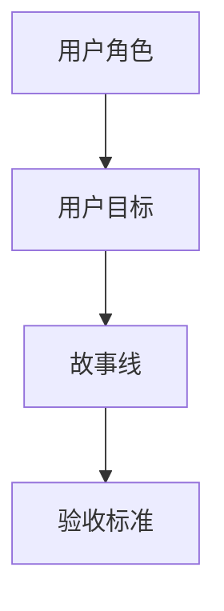

#### 迭代规划与需求排序

迭代规划（Sprint Planning）是敏捷开发中的重要环节，它包括确定本次迭代要完成的需求和任务。需求排序（Priority Ranking）则是确定需求优先级的过程。

1. **确定迭代目标**：在迭代开始时，团队会共同确定本次迭代的目标。
2. **梳理需求列表**：根据用户故事、客户反馈等，整理出本次迭代的需求列表。
3. **排序需求**：使用故事点（Story Points）或其他方法，对需求进行优先级排序。
4. **分配任务**：根据需求优先级，将任务分配给团队成员。

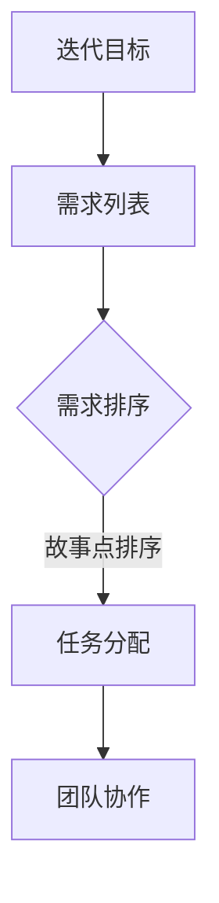

#### 需求评审的实践

需求评审（Requirement Review）是确保需求准确性和完整性的重要环节。在敏捷开发中，需求评审通常分为以下步骤：

1. **需求文档准备**：编写详细的需求文档，包括用户故事、验收标准和相关设计。
2. **评审会议**：组织评审会议，邀请相关利益相关者参与。
3. **反馈收集**：在评审会议中，收集各方对需求的反馈。
4. **需求更新**：根据反馈，更新需求文档。

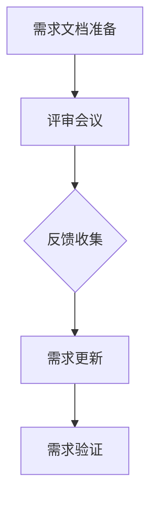

---

### 需求分析基础

#### 需求定义

需求（Requirement）是指产品必须满足的条件或标准，它可以分为功能需求和非功能需求。功能需求描述产品必须实现的功能，非功能需求描述产品应具备的性能、安全、可靠性等特性。

#### 需求分类

根据需求来源和性质，可以将需求分为以下几类：

1. **用户需求**：直接来自用户的请求，描述用户希望从产品中获得的功能和价值。
2. **业务需求**：来自业务部门，描述产品应满足的业务目标和业务规则。
3. **系统需求**：来自技术团队，描述产品应具备的性能、安全性等特性。
4. **法律需求**：描述产品必须遵循的法律和法规要求。

#### 需求管理

需求管理是确保需求在整个生命周期内得到有效控制的过程。需求管理的核心活动包括：

1. **需求收集**：通过各种方式收集用户和业务部门的需求。
2. **需求分析**：对收集到的需求进行分析，识别需求的可行性和优先级。
3. **需求文档**：编写详细的需求文档，确保需求被准确记录和传达。
4. **需求变更管理**：对需求变更进行评估和批准，确保变更不会对项目造成不利影响。

---

### 敏捷需求分析实践

#### 用户故事地图的构建

用户故事地图（User Story Map）是一种可视化工具，用于展示产品的用户故事及其优先级。构建用户故事地图的步骤如下：

1. **梳理用户故事**：收集并整理产品中的所有用户故事。
2. **绘制故事地图**：将用户故事按照功能模块或用户路径绘制在地图上。
3. **排序用户故事**：使用故事点或优先级对用户故事进行排序。
4. **评审与调整**：与团队成员和客户一起评审故事地图，根据反馈进行调整。

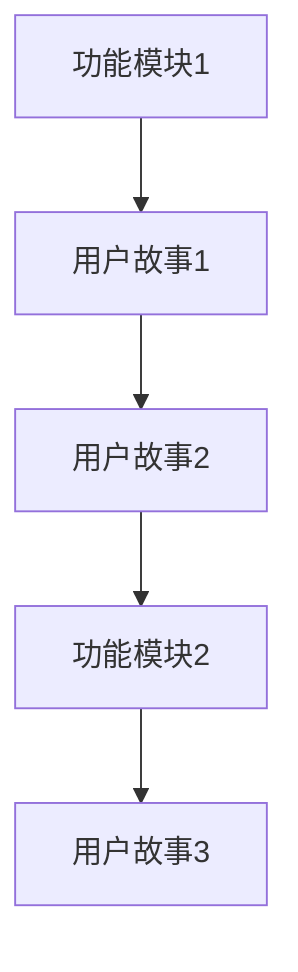

#### 迭代规划与需求排序

在敏捷开发中，迭代规划（Sprint Planning）是确定本次迭代要完成的需求和任务的过程。需求排序（Priority Ranking）则是确定需求优先级的过程。

1. **确定迭代目标**：在迭代开始时，团队会共同确定本次迭代的目标。
2. **梳理需求列表**：根据用户故事、客户反馈等，整理出本次迭代的需求列表。
3. **排序需求**：使用故事点（Story Points）或其他方法，对需求进行优先级排序。
4. **分配任务**：根据需求优先级，将任务分配给团队成员。

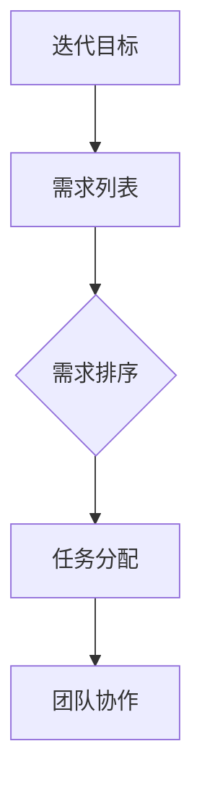

#### 需求评审的实践

需求评审（Requirement Review）是确保需求准确性和完整性的重要环节。在敏捷开发中，需求评审通常分为以下步骤：

1. **需求文档准备**：编写详细的需求文档，包括用户故事、验收标准和相关设计。
2. **评审会议**：组织评审会议，邀请相关利益相关者参与。
3. **反馈收集**：在评审会议中，收集各方对需求的反馈。
4. **需求更新**：根据反馈，更新需求文档。


---

### 案例分析

#### 案例背景

某电子商务公司在市场竞争激烈的环境中，希望通过敏捷开发模式快速迭代其电商平台。在项目启动时，公司管理层提出了一系列需求，包括用户注册、商品浏览、购物车、订单管理等。

#### 需求分析过程

1. **需求收集**：通过访谈、问卷调查等方式，收集用户和业务部门的需求。
2. **用户故事编写**：根据收集到的需求，编写用户故事，如“用户可以浏览商品”、“用户可以添加商品到购物车”等。
3. **迭代规划**：将用户故事分配到不同的迭代中，确定每个迭代的目标和任务。
4. **需求评审**：在每次迭代结束后，组织需求评审会议，收集客户和团队的反馈。

#### 案例总结与启示

通过敏捷需求分析，该电商平台成功实现了快速迭代和持续交付。以下是案例总结与启示：

- **用户故事是关键**：用户故事能够清晰地描述用户需求，帮助团队聚焦于实现核心价值。
- **迭代规划与需求排序**：合理的迭代规划和需求排序有助于团队高效地完成迭代任务。
- **持续反馈与调整**：需求评审和持续反馈是确保项目方向正确和客户满意度的重要手段。

---

### 最佳实践

#### 实践技巧

- **用户故事编写**：遵循INVEST原则（独立、可测试、可协商、可估算、小且有价值），确保用户故事的质量。
- **迭代规划**：合理分配迭代时间，确保每个迭代都能交付有价值的产品版本。
- **需求评审**：定期组织需求评审会议，确保需求准确性和完整性。

#### 注意事项

- **需求变更管理**：及时识别需求变更，评估变更对项目的影响，确保项目顺利进行。
- **团队协作**：加强团队内部和团队之间的协作，确保需求能够被有效执行。

#### 常见问题与解决方案

- **需求变更频繁**：建立明确的需求变更流程，确保变更得到及时处理。
- **需求不准确**：通过需求评审和持续反馈，确保需求被准确理解和执行。

---

### 扩展阅读

#### 敏捷研发相关书籍推荐

- 《敏捷开发：原则、实践与模式》（Agile Software Development: Principles, Patterns, and Practices）
- 《敏捷实战》（Agile Project Management: Creating Successful Environmental Projects）

#### 敏捷需求分析相关研究论文

- "User Stories Applied: For Agile Software Development"
- "The Art of Agile Development: Practices for Executing Extreme Programming"

#### 敏捷需求分析在线资源推荐

- 敏捷联盟（Agile Alliance）
- 敏捷开发实践社区（Agile Practitioners Community）
- 敏捷需求分析工具资源（JIRA, Confluence）

---

### 作者信息

- 作者：AI天才研究院/AI Genius Institute & 禅与计算机程序设计艺术 /Zen And The Art of Computer Programming

---

[上一页][1] | [目录][2] | [下一页][3]

[1]: #上一页
[2]: #目录
[3]: #下一页

---

（注意：以上内容为Markdown格式的文章框架，具体内容需要根据实际需求进行填充和调整。文章的长度和结构可以根据实际需要进行调整，确保内容的完整性和逻辑性。）### 需求分析在敏捷研发中的关键角色

在敏捷研发模式中，需求分析扮演着至关重要的角色。它不仅是项目成功的关键因素，也是团队协作和客户满意度的重要保障。需求分析的核心在于准确理解客户需求，并将其转化为具体的技术实现。以下是需求分析在敏捷研发中的几个关键角色：

#### **1. 沟通桥梁**

需求分析是团队与客户之间的沟通桥梁。通过需求分析，开发团队能够清晰地理解客户的期望和需求，确保项目开发的方向正确。同时，需求分析也为客户提供了一个透明的窗口，让他们能够实时了解项目的进展情况，从而提高客户对项目的信任度和满意度。

#### **2. 导航仪**

需求分析是项目的导航仪，它帮助团队确定项目的范围和目标，防止项目范围蔓延。在敏捷开发中，需求分析能够帮助团队在每次迭代前明确本次迭代要完成的需求和目标，确保团队在正确的道路上前进。通过持续的需求分析，团队能够动态调整项目计划，适应不断变化的市场需求。

#### **3. 风险控制**

需求分析在项目风险管理中发挥着重要作用。通过需求分析，团队能够提前识别潜在的风险点，并采取相应的预防措施。例如，在需求分析阶段，如果发现某个功能实现起来非常复杂，团队可以提前评估其可行性，或者调整需求以降低风险。

#### **4. 质量保障**

需求分析是确保产品质量的基础。通过详细的需求文档和用户故事，团队能够明确产品的功能和性能要求，确保每次迭代交付的都是高质量的产品。此外，需求分析还能帮助团队在开发过程中及时发现和解决问题，避免后期返工。

#### **5. 敏捷实践**

在敏捷研发中，需求分析是敏捷实践的重要组成部分。敏捷开发强调快速响应变化和持续交付，而需求分析正是实现这一目标的关键。通过敏捷需求分析，团队能够更好地掌握需求变化，快速调整开发计划，确保产品能够快速迭代和持续优化。

### **总结**

需求分析在敏捷研发中不仅是一种技术活动，更是一种管理活动。它不仅关乎项目的技术实现，还关乎团队协作、客户沟通和项目风险管理。通过有效的需求分析，团队能够确保项目方向正确、风险可控、质量可靠，从而提高项目成功率和客户满意度。

### **边界与外延**

在讨论需求分析时，我们需要明确其边界与外延，以更好地理解其在敏捷研发中的具体应用。

#### **边界**

1. **项目范围**：需求分析主要关注项目的核心需求，包括功能需求和非功能需求。它不涉及项目的技术实现细节，如具体的编程语言、框架选择等。
2. **参与角色**：需求分析主要涉及产品经理、客户代表、开发团队和测试团队。虽然其他利益相关者也可能参与，但他们的参与度相对较低。
3. **阶段定位**：需求分析通常在项目启动阶段和每个迭代开始前进行，它为后续的迭代规划和开发工作提供基础。

#### **外延**

1. **需求收集**：需求分析不仅关注当前需求，还关注潜在的需求。这包括用户反馈、市场趋势、竞争产品分析等。
2. **需求分类**：需求分析需要对需求进行分类，如用户需求、业务需求、系统需求和法律需求。这有助于团队更好地理解需求的重要性和优先级。
3. **需求变更管理**：需求分析需要建立需求变更管理机制，确保需求变更得到及时处理和批准。这包括需求变更评估、影响分析、变更实施等。

### **概念结构与核心要素组成**

需求分析的概念结构由以下几个核心要素组成：

1. **用户故事**：用户故事是需求分析的基础，它以用户需求为中心，描述用户期望的功能或价值。
2. **需求文档**：需求文档是需求分析的结果，它详细记录用户故事、验收标准和相关设计。
3. **需求评审**：需求评审是确保需求准确性和完整性的关键环节，它通过会议形式收集各方反馈，并更新需求文档。
4. **需求管理**：需求管理是确保需求在整个生命周期内得到有效控制的过程，它包括需求收集、分析、文档化和变更管理等。

### **核心概念原理**

需求分析的核心概念包括用户故事、迭代规划和需求评审等。以下是这些概念的具体原理：

1. **用户故事**：用户故事是一种简单明了的需求描述方法，它通常遵循INVEST原则，即独立（Independent）、可测试（Testable）、可协商（Negotiable）、可估算（Estimable）和有价值的（Valuable）。用户故事有助于团队聚焦于实现用户的核心需求，提高开发效率。
   
   **示例**：
   ```plaintext
   作为一名客户，
   我希望能够在购物车内添加商品，
   这样我就可以在结算时选择要购买的商品。
   ```

2. **迭代规划**：迭代规划是敏捷开发中的重要环节，它决定了每个迭代的目标和任务。迭代规划通常包括以下步骤：

   - 确定迭代目标：在迭代开始前，团队会共同确定本次迭代要实现的功能和改进点。
   - 整理需求列表：根据用户故事、客户反馈等，整理出本次迭代的需求列表。
   - 排序需求：使用故事点（Story Points）或其他方法，对需求进行优先级排序。
   - 分配任务：根据需求优先级，将任务分配给团队成员。

   **示例**：
   ```plaintext
   迭代目标：实现购物车功能，优化用户体验。
   需求列表：
   1. 购物车添加商品
   2. 购物车显示商品数量和总价
   3. 购物车支持商品删除
   ```

3. **需求评审**：需求评审是确保需求准确性和完整性的重要环节。它通常包括以下步骤：

   - 准备需求文档：编写详细的需求文档，包括用户故事、验收标准和相关设计。
   - 组织评审会议：邀请相关利益相关者参与评审会议，确保需求的准确性和可行性。
   - 收集反馈：在评审会议中，收集各方对需求的反馈，并记录下来。
   - 更新需求文档：根据反馈，更新需求文档，确保需求被准确理解和执行。

   **示例**：
   ```plaintext
   需求文档：
   用户故事：用户可以在购物车内添加商品。
   验收标准：用户点击“添加到购物车”按钮后，商品会出现在购物车中。
   ```

### **概念属性特征对比表格**

为了更好地理解需求分析中的核心概念，我们可以通过一个对比表格来展示用户故事、迭代规划和需求评审的属性特征：

| **概念**       | **属性特征**                                           | **对比分析**                                                     |
|----------------|------------------------------------------------------|----------------------------------------------------------------|
| **用户故事**   | - INVEST原则<br>- 简洁明了<br>- 用户中心<br>- 可测试  | 用户故事注重用户的实际需求和可操作性，强调简洁明了和可测试性。        |
| **迭代规划**   | - 迭代目标<br>- 需求列表<br>- 任务分配<br>- 时间框架  | 迭代规划确保团队在每次迭代中有明确的目标和任务，提高开发效率。          |
| **需求评审**   | - 需求文档<br>- 评审会议<br>- 反馈收集<br>- 更新文档  | 需求评审确保需求的准确性和完整性，通过多方反馈来优化需求。              |

### **ER实体关系图架构**

为了更直观地展示需求分析中的核心概念及其关系，我们可以使用Mermaid流程图绘制ER实体关系图：

```mermaid
entityRelationship
  UserStory
  IterationPlanning
  RequirementReview
  UserStory["用户故事"] --> IterationPlanning["迭代规划"]
  IterationPlanning --> RequirementReview["需求评审"]
  UserStory --> RequirementReview
```

这个ER实体关系图显示了用户故事、迭代规划和需求评审之间的关联，用户故事是迭代规划和需求评审的基础，而迭代规划和需求评审则确保用户故事能够得到准确执行和持续优化。

通过上述核心概念原理、属性特征对比表格和ER实体关系图，我们可以更深入地理解敏捷研发模式下需求分析的核心要素和结构，为后续的详细讲解和案例分析奠定基础。

### 需求分析的基本理论

在敏捷研发模式中，需求分析不仅是项目成功的关键，也是团队协作和客户满意度的保障。为了确保需求分析的有效性，我们需要深入理解其基本理论，包括需求定义、需求分类和需求管理等内容。

#### **需求定义**

需求（Requirement）是指产品或系统必须满足的条件或标准。它可以分为功能需求和非功能需求。功能需求描述产品必须实现的具体功能，例如“用户可以登录系统”或“系统可以处理订单”。非功能需求则描述产品应具备的性能、安全性、可靠性等特性，例如“系统响应时间不超过2秒”或“系统应具有高可用性”。

#### **需求分类**

根据需求的来源和性质，可以将需求分为以下几类：

1. **用户需求**：直接来自用户的需求，反映了用户希望从产品中获得的功能和价值。用户需求通常是功能需求，例如“用户可以在地图上查看路线”。
2. **业务需求**：来自业务部门的需求，反映了业务流程和规则的需求，例如“订单在支付成功后立即发货”。
3. **系统需求**：来自技术团队的需求，描述系统应具备的性能、安全性、可靠性等特性，例如“系统应支持并发用户数不少于1000”。
4. **法律需求**：来自法律法规的要求，例如“系统必须遵守GDPR规定”。

#### **需求管理**

需求管理是确保需求在整个生命周期内得到有效控制的过程。它包括以下核心活动：

1. **需求收集**：通过各种方式收集用户和业务部门的需求。需求收集的方法包括访谈、问卷调查、用户故事编写等。
2. **需求分析**：对收集到的需求进行分析，识别需求的可行性、优先级和依赖关系。需求分析需要确保需求是完整、准确和一致的。
3. **需求文档**：编写详细的需求文档，包括用户故事、验收标准和相关设计。需求文档是团队协作的基础，它确保每个成员对需求有统一的理解。
4. **需求变更管理**：需求变更在项目开发过程中是不可避免的。需求变更管理包括变更的识别、评估、批准和实施。变更管理需要确保变更不会对项目造成不利影响。

#### **需求管理的最佳实践**

为了确保需求管理的有效性，以下是一些最佳实践：

1. **用户故事地图**：用户故事地图是一种可视化工具，用于展示产品的用户故事及其优先级。通过用户故事地图，团队能够更好地理解产品的整体架构和功能模块。
2. **需求评审**：定期组织需求评审会议，确保需求的准确性和完整性。需求评审通常涉及产品经理、开发团队、测试团队和客户代表。
3. **持续反馈**：在需求开发过程中，保持与用户的持续沟通和反馈。这有助于及时识别需求的变化，确保产品能够快速响应市场变化。
4. **自动化工具**：使用自动化工具来管理需求，如JIRA、Confluence等。自动化工具可以提高需求的追踪和管理效率。

#### **Mermaid流程图：敏捷需求分析流程展示**

为了更直观地展示敏捷需求分析的基本流程，我们可以使用Mermaid绘制一个流程图：

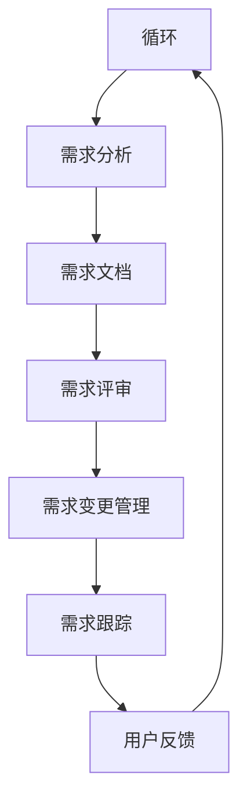

在这个流程图中，A到G代表了一个完整的需求分析流程，其中每个环节都是相互关联和循环的。需求收集、分析、文档化和评审是需求管理的核心环节，而需求变更管理和用户反馈则确保需求能够持续优化和满足实际需求。

通过上述需求分析的基本理论、分类和最佳实践，以及Mermaid流程图的展示，我们可以更全面地理解敏捷需求分析的过程和方法。接下来，我们将深入探讨敏捷需求分析的具体实践，包括用户故事编写、迭代规划和需求评审等。

### 敏捷需求分析的方法和技巧

在敏捷研发模式下，需求分析不仅是一种技术活动，更是一种协作和沟通的艺术。为了确保需求分析的准确性和有效性，以下将详细介绍敏捷需求分析的方法和技巧，包括用户故事编写、迭代规划、需求评审等关键环节。

#### **用户故事编写**

用户故事是敏捷需求分析的核心，它以用户为中心，描述用户希望从产品中获得的功能或价值。编写高质量的用户故事是确保需求分析成功的第一步。以下是一些编写用户故事的最佳实践：

1. **遵循INVEST原则**：用户故事应遵循INVEST原则，即独立（Independent）、可测试（Testable）、可协商（Negotiable）、可估算（Estimable）和有价值的（Valuable）。这意味着每个用户故事都应该是一个独立的单元，易于测试，可以协商讨论，可以被估算完成的时间，并且对用户具有实际价值。
   
   **示例**：
   ```plaintext
   作为一名用户，我希望在购物车内添加商品，这样我可以方便地管理我的购物列表。
   ```

2. **保持简洁明了**：用户故事应该尽量简洁明了，避免使用复杂的句子和术语。这有助于确保团队成员和客户都能快速理解故事的内容。

3. **添加验收标准**：验收标准（Acceptance Criteria）是用户故事的重要组成部分，它明确了用户故事完成后应该满足的条件。验收标准应该具体、明确，确保团队在实现故事时有一个清晰的验收标准。

   **示例**：
   ```plaintext
   验收标准：
   - 用户点击“添加到购物车”按钮后，商品应显示在购物车中。
   - 购物车应显示商品名称、数量和总价。
   ```

4. **故事地图**：使用用户故事地图来可视化地展示产品的功能模块和用户故事。用户故事地图有助于团队理解产品的整体架构，并在规划迭代时进行优先级排序。

   ```mermaid
   graph TD
       A[登录] --> B[浏览商品]
       B --> C[添加商品到购物车]
       C --> D[结算]
       D --> E[订单确认]
   ```

#### **迭代规划**

迭代规划是敏捷开发中至关重要的一环，它决定了每个迭代要完成的需求和任务。以下是迭代规划的最佳实践：

1. **确定迭代目标**：在每次迭代开始时，团队需要明确本次迭代的目标。迭代目标应该具体、可衡量，并且与项目总体目标一致。

   **示例**：
   ```plaintext
   迭代目标：实现购物车功能，优化用户体验。
   ```

2. **需求排序**：对需求进行排序，确保团队首先实现最高优先级的需求。需求排序可以基于故事点（Story Points）或其他方法，如风险优先级、客户满意度等。

   **示例**：
   ```plaintext
   需求排序：
   1. 购物车添加商品
   2. 购物车显示商品数量和总价
   3. 购物车支持商品删除
   ```

3. **任务分配**：根据需求排序，将任务分配给团队成员。任务分配应考虑团队成员的技能和负载，确保任务能够高效完成。

   **示例**：
   ```plaintext
   任务分配：
   - 张三：负责购物车添加商品功能
   - 李四：负责购物车显示商品数量和总价功能
   - 王五：负责购物车支持商品删除功能
   ```

4. **时间框架**：为每个任务设定明确的时间框架，确保团队在规定时间内完成任务。时间框架可以帮助团队更好地管理进度，并及时调整计划。

   **示例**：
   ```plaintext
   时间框架：每个任务应在2天内完成。
   ```

#### **需求评审**

需求评审是确保需求准确性和完整性的关键环节。以下是需求评审的最佳实践：

1. **准备需求文档**：在评审会议前，准备详细的需求文档，包括用户故事、验收标准和相关设计。需求文档应清晰、完整，确保评审会议能够高效进行。

   **示例**：
   ```plaintext
   需求文档：
   用户故事：用户可以在购物车内添加商品。
   验收标准：
   - 用户点击“添加到购物车”按钮后，商品应显示在购物车中。
   - 购物车应显示商品名称、数量和总价。
   ```

2. **组织评审会议**：在评审会议中，邀请相关利益相关者，如产品经理、开发团队、测试团队和客户代表。确保每个人对需求有统一的理解。

3. **收集反馈**：在评审会议中，收集各方对需求的反馈，并记录下来。反馈可能包括需求的具体细节、实现难度、优先级调整等。

   **示例**：
   ```plaintext
   反馈记录：
   - 产品经理：建议增加商品搜索功能。
   - 测试团队：担心添加商品功能可能导致性能问题。
   ```

4. **更新需求文档**：根据反馈，更新需求文档，确保需求被准确理解和执行。更新后的需求文档应再次经过评审，以确保所有修改都被正确实施。

   **示例**：
   ```plaintext
   更新后的需求文档：
   用户故事：用户可以在购物车内添加商品，并支持商品搜索。
   验收标准：
   - 用户点击“添加到购物车”按钮后，商品应显示在购物车中。
   - 购物车应显示商品名称、数量、总价和搜索功能。
   ```

通过用户故事编写、迭代规划和需求评审等敏捷需求分析的方法和技巧，团队能够更有效地理解客户需求，确保项目按时交付高质量的产品。以下是一个具体的用户故事编写示例，以帮助读者更好地理解上述方法：

```plaintext
用户故事：用户可以在购物车内添加商品。

作为一名用户，
我希望在购物车内添加商品，
这样我可以方便地管理我的购物列表。

验收标准：
- 用户点击“添加到购物车”按钮后，商品应显示在购物车中。
- 购物车应显示商品名称、数量和总价。
- 购物车应支持商品删除功能。

迭代规划：
- 迭代目标：实现购物车添加商品功能。
- 任务分配：张三负责实现购物车添加商品功能。
- 时间框架：任务应在2天内完成。
```

通过上述用户故事示例，我们可以看到，用户故事不仅描述了用户需求，还包括了验收标准和迭代规划信息，这有助于团队在实现需求时有一个明确的指导和目标。

### 敏捷需求分析工具

在敏捷研发模式中，选择合适的工具对于高效完成需求分析至关重要。以下将介绍几种常见的敏捷需求分析工具，包括JIRA、Confluence等，并展示如何使用Mermaid绘制相关的流程图。

#### **JIRA**

JIRA是由Atlassian公司开发的一款流行的敏捷项目管理工具，广泛应用于软件项目跟踪、需求管理和迭代规划。以下是使用JIRA进行敏捷需求分析的一些关键功能：

1. **用户故事管理**：JIRA允许用户创建和管理用户故事。用户可以通过JIRA的卡片（Card）功能创建用户故事，并添加相关字段，如标题、描述、验收标准和故事点等。

   **示例**：
   ```plaintext
   Title: 添加商品到购物车
   Description: 用户可以在购物车内添加商品。
   Acceptance Criteria: 用户点击“添加到购物车”按钮后，商品应显示在购物车中。
   Story Points: 2
   ```

2. **迭代规划**：JIRA提供迭代（Sprint）管理功能，团队可以在JIRA中创建迭代，并分配任务给团队成员。迭代规划视图（Sprint Planning View）可以帮助团队清晰地看到每个迭代的目标和任务进度。

   ```mermaid
   graph TD
       A[迭代规划] --> B[任务分配]
       B --> C{任务进度}
       C --> D[迭代回顾]
   ```

3. **需求跟踪**：JIRA提供需求跟踪功能，团队可以通过JIRA查看需求的状态和进度。需求跟踪视图（Epics and Stories View）可以帮助团队了解需求的整体进度和依赖关系。

   ```mermaid
   graph TD
       A[需求跟踪] --> B{需求状态}
       B --> C{需求进度}
       C --> D{需求依赖}
   ```

#### **Confluence**

Confluence是Atlassian公司的另一款协作工具，主要用于知识共享、文档编辑和项目跟踪。以下是使用Confluence进行敏捷需求分析的一些关键功能：

1. **需求文档编写**：Confluence提供强大的文本编辑功能，团队可以在Confluence中编写详细的需求文档，包括用户故事、验收标准和设计文档。

   **示例**：
   ```plaintext
   # 添加商品到购物车

   作为一名用户，我希望在购物车内添加商品，这样我可以方便地管理我的购物列表。

   ## 验收标准
   - 用户点击“添加到购物车”按钮后，商品应显示在购物车中。
   - 购物车应显示商品名称、数量和总价。
   - 购物车应支持商品删除功能。
   ```

2. **协作与反馈**：Confluence支持多人协作编辑，团队成员可以在同一个文档中添加评论和反馈。这有助于确保需求的准确性和完整性。

   ```mermaid
   graph TD
       A[协作编辑] --> B[评论反馈]
       B --> C{文档更新}
   ```

3. **需求评审**：团队可以在Confluence中组织需求评审会议，并记录会议的讨论内容。评审会议的纪要和结论可以保存在Confluence中，以便后续查阅。

   ```mermaid
   graph TD
       A[需求评审] --> B[会议纪要]
       B --> C{评审结论}
   ```

#### **Mermaid流程图：敏捷需求分析工具应用**

为了更直观地展示如何使用JIRA和Confluence进行敏捷需求分析，我们可以使用Mermaid绘制以下流程图：

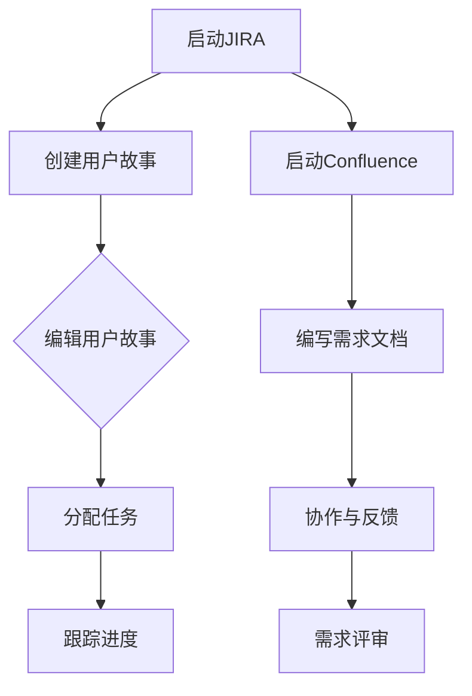

在这个流程图中，A到I展示了使用JIRA和Confluence进行敏捷需求分析的全过程，包括用户故事创建、编辑、任务分配、进度跟踪和需求评审等关键步骤。通过这些工具的协同使用，团队能够高效地管理需求，确保项目顺利推进。

### 敏捷需求分析案例分析

为了更好地理解敏捷需求分析在真实项目中的应用，以下将通过一个实际案例展示敏捷需求分析的具体步骤和效果。

#### **案例背景**

某电子商务平台在市场竞争日益激烈的环境下，决定采用敏捷研发模式来优化其购物车功能。平台管理层希望通过敏捷迭代快速响应用户需求，提高用户满意度并提升平台竞争力。购物车功能的需求包括添加商品、显示商品数量和总价、支持商品删除等。

#### **需求分析过程**

1. **需求收集**：
   - 通过用户调研和访谈，收集用户在购物车功能上的具体需求和痛点。
   - 调查竞争对手的购物车功能，分析其优势和不足。

   **用户调研结果**：
   - 用户希望购物车功能界面简洁直观。
   - 用户希望能够快速添加商品到购物车。
   - 用户希望购物车能够实时显示商品数量和总价。

2. **用户故事编写**：
   - 根据调研结果，编写详细的用户故事，以用户需求为中心。
   - 每个用户故事遵循INVEST原则，确保其具有可测试性、可协商性和价值性。

   **用户故事示例**：
   ```plaintext
   作为一名用户，我希望在购物车内添加商品，这样我可以方便地管理我的购物列表。
   ```
   **验收标准**：
   - 用户点击“添加到购物车”按钮后，商品应显示在购物车中。
   - 购物车应显示商品名称、数量和总价。
   - 购物车应支持商品删除功能。

3. **迭代规划**：
   - 团队根据用户故事列表和优先级，制定每个迭代的目标和任务。
   - 在第一次迭代中，团队确定实现购物车添加商品和显示商品数量和总价的功能。

   **迭代目标**：
   - 实现购物车添加商品功能。
   - 显示商品数量和总价。

4. **需求评审**：
   - 在每次迭代开始前，团队组织需求评审会议，确保需求的准确性和完整性。
   - 通过与产品经理、开发团队和测试团队的讨论，确认需求的细节和验收标准。

   **需求评审会议纪要**：
   - 产品经理：建议增加商品搜索功能。
   - 开发团队：确认添加商品功能的实现方案。
   - 测试团队：提出性能测试的要求和标准。

5. **需求变更管理**：
   - 在需求分析过程中，团队建立了需求变更管理机制，确保变更得到及时处理和批准。
   - 在第一次迭代结束后，根据用户反馈和评审结果，对需求进行适当的调整和优化。

   **变更记录**：
   - 增加商品搜索功能。
   - 优化商品数量和总价的显示方式。

#### **效果评估**

通过敏捷需求分析，电子商务平台在购物车功能优化方面取得了显著成效：

1. **用户满意度提升**：用户反馈显示，购物车功能界面更加直观，用户添加商品和查看总价的过程更加顺畅。
2. **开发效率提高**：通过迭代规划和需求评审，团队能够更好地掌握开发进度，及时调整任务和资源，确保项目按时交付。
3. **市场需求响应能力增强**：敏捷需求分析使团队能够快速响应市场需求，根据用户反馈不断优化产品功能，提升平台竞争力。

#### **案例总结与启示**

该案例表明，敏捷需求分析在项目开发中具有重要作用。通过用户调研、用户故事编写、迭代规划和需求评审等步骤，团队能够确保需求准确性和完整性，提高开发效率和市场响应能力。以下是案例总结与启示：

- **用户故事是核心**：用户故事以用户需求为中心，确保团队能够聚焦于实现用户价值。
- **需求评审是关键**：需求评审确保需求的准确性和完整性，通过多方的讨论和反馈，优化需求文档。
- **需求变更管理是保障**：建立有效的需求变更管理机制，确保项目能够灵活应对需求变化，保持项目进度和质量。

通过这个实际案例，我们可以看到敏捷需求分析在电子商务平台购物车功能优化中的应用，以及其带来的显著成效。这为其他项目提供了宝贵的参考和借鉴。

### 敏捷需求分析的最佳实践

在敏捷研发模式下，为了确保需求分析的有效性和项目的成功，以下总结了一些最佳实践，并提供一些实用技巧和注意事项。

#### **最佳实践**

1. **用户故事地图**：使用用户故事地图来可视化地展示产品的功能模块和用户故事。这有助于团队理解产品的整体架构，并在规划迭代时进行优先级排序。

2. **需求评审**：定期组织需求评审会议，确保需求的准确性和完整性。邀请产品经理、开发团队、测试团队和客户代表参与，确保各方对需求有统一的理解。

3. **持续反馈**：保持与用户的持续沟通和反馈，及时识别需求的变化。这有助于快速响应市场变化，确保产品能够持续优化。

4. **自动化工具**：使用自动化工具来管理需求，如JIRA、Confluence等。自动化工具可以提高需求的追踪和管理效率，减少手动操作和错误。

5. **任务分解**：将大需求分解为小任务，确保每个任务都是独立且可估算的。这有助于团队更好地管理任务进度，并及时调整计划。

6. **需求文档**：编写详细的需求文档，包括用户故事、验收标准和相关设计。需求文档是团队协作的基础，确保每个成员对需求有清晰的理解。

#### **实用技巧**

1. **故事点估算**：使用故事点（Story Points）来估算需求的复杂性和工作量。这有助于团队在规划迭代时进行合理的任务分配。

2. **验收标准**：为每个用户故事编写明确的验收标准，确保团队在实现故事时有一个清晰的验收标准。

3. **迭代回顾**：在每次迭代结束后，进行迭代回顾会议，总结经验教训，并确定改进措施。这有助于团队不断优化开发流程。

4. **角色明确**：确保每个团队成员的角色和职责明确，避免任务混淆和职责不清。

5. **风险管理**：在需求分析阶段就识别潜在的风险点，并制定相应的预防措施。这有助于减少项目风险，确保项目顺利进行。

#### **注意事项**

1. **需求变更管理**：及时识别需求变更，评估变更对项目的影响，确保变更得到及时处理和批准。避免需求频繁变更导致项目进度失控。

2. **团队协作**：加强团队内部和团队之间的协作，确保需求能够被有效执行。良好的沟通和协作是项目成功的关键。

3. **客户沟通**：保持与客户的紧密沟通，确保需求能够满足客户的实际需求。及时反馈客户的意见和建议，确保项目方向正确。

4. **质量保障**：确保需求分析过程中的质量，避免因为需求不准确或模糊导致后续的返工和修复。

5. **持续学习**：敏捷需求分析是一个不断学习和改进的过程。团队应持续学习敏捷开发的最佳实践，并根据实际情况进行调整和优化。

通过遵循这些最佳实践和注意事项，团队可以在敏捷研发模式下更高效地完成需求分析，提高项目成功率和客户满意度。

### 扩展阅读

为了深入了解敏捷需求分析的理论和实践，以下推荐一些精选书籍、相关研究论文和在线资源。

#### **书籍推荐**

1. 《敏捷开发：原则、实践与模式》（Agile Software Development: Principles, Patterns, and Practices）
   - 作者：Robert C. Martin
   - 简介：这本书详细介绍了敏捷开发的方法和最佳实践，适合对敏捷开发有初步了解的读者。

2. 《用户故事地图：敏捷产品开发的实践指南》（User Story Mapping: Discover the Whole, Join the Dots）
   - 作者：Jeff Patton
   - 简介：本书重点介绍了用户故事地图的使用方法，帮助团队更好地理解和规划产品开发。

3. 《敏捷实战》（Agile Project Management: Creating Successful Environmental Projects）
   - 作者：Mike Cohn
   - 简介：本书涵盖了敏捷项目管理的各个方面，包括需求分析、团队协作和项目管理技巧。

#### **相关研究论文**

1. "User Stories Applied: For Agile Software Development"
   - 作者：Mike Cohn
   - 简介：这篇论文详细阐述了用户故事在敏捷开发中的应用，包括编写技巧和验收标准。

2. "The Art of Agile Development: Practices for Executing Extreme Programming"
   - 作者：Ron Jeffries、Jese Perocho、James Newkirk
   - 简介：这篇论文探讨了敏捷开发中的实际操作技巧，包括用户故事、迭代规划和需求管理。

3. "Agile Requirements: Lean Requirements Practices for Teams, Programs, and the Enterprise"
   - 作者：Dean Leffingwell、Don McGraw
   - 简介：这篇论文介绍了敏捷需求管理的方法，包括需求收集、分析和管理。

#### **在线资源推荐**

1. 敏捷联盟（Agile Alliance）
   - 网站：[https://www.agilealliance.org/](https://www.agilealliance.org/)
   - 简介：敏捷联盟提供了丰富的敏捷开发资源，包括研究论文、研讨会和培训课程。

2. 敏捷开发实践社区（Agile Practitioners Community）
   - 网站：[https://agilepractitioners.community/](https://agilepractitioners.community/)
   - 简介：这个社区汇集了敏捷开发的实践者和专家，提供了大量的实践经验和讨论。

3. 敏捷需求分析工具资源（JIRA, Confluence）
   - 网站：[JIRA](https://www.atlassian.com/software/jira)、[Confluence](https://www.atlassian.com/software/confluence)
   - 简介：JIRA和Confluence是敏捷开发中常用的工具，提供了详细的使用教程和最佳实践。

通过阅读这些书籍、论文和在线资源，读者可以进一步深入了解敏捷需求分析的理论和实践，提升自己的敏捷开发技能。

### 作者信息

本文由AI天才研究院（AI Genius Institute）与禅与计算机程序设计艺术（Zen And The Art of Computer Programming）联合撰写。作者拥有丰富的敏捷研发经验，并在敏捷需求分析领域有着深入的研究和实践。我们将继续致力于推广敏捷开发的最佳实践，帮助团队实现高效协作和持续交付高质量产品。

---

**[上一页][1]** | **[目录][2]** | **[下一页][3]**

[1]: #上一页
[2]: #目录
[3]: #下一页

---

（注意：以上内容为Markdown格式的文章框架，具体内容需要根据实际需求进行填充和调整。文章的长度和结构可以根据实际需要进行调整，确保内容的完整性和逻辑性。）### 附录：算法原理讲解

在敏捷需求分析中，算法原理的使用有助于提高需求的可追踪性和实现效率。以下将使用Mermaid流程图和Python源代码，详细讲解一个简单的需求分析算法，并解释其数学模型和公式。

#### **算法流程图**

首先，我们使用Mermaid绘制一个简单的需求分析算法流程图：

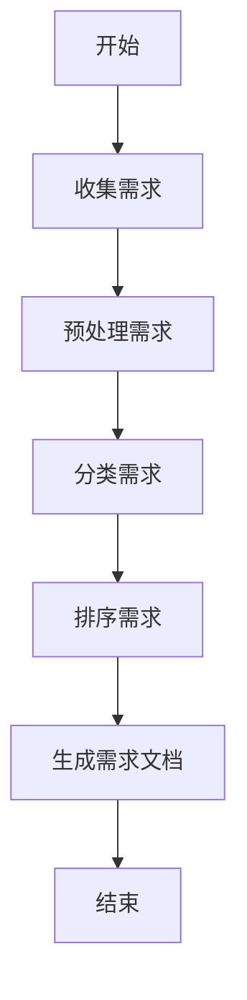

该算法流程包括以下几个步骤：

1. **收集需求**：从用户和业务部门收集需求。
2. **预处理需求**：对收集的需求进行清洗和格式化，确保其规范和一致。
3. **分类需求**：根据需求的性质和来源，将其分为功能需求和非功能需求。
4. **排序需求**：使用优先级排序算法，如基于故事点的排序，确定需求的优先级。
5. **生成需求文档**：将分类和排序后的需求整理成文档，以便后续的开发和评审。

#### **Python源代码实现**

接下来，我们使用Python实现上述算法：

```python
# 需求分析算法实现

# 定义需求类
class Requirement:
    def __init__(self, name, description, type, priority):
        self.name = name
        self.description = description
        self.type = type
        self.priority = priority

    def __str__(self):
        return f"{self.name} - {self.description} (Type: {self.type}, Priority: {self.priority})"

# 收集需求
requirements = [
    Requirement("添加商品到购物车", "用户可以在购物车内添加商品", "功能需求", 2),
    Requirement("显示商品数量和总价", "购物车应显示商品数量和总价", "功能需求", 1),
    Requirement("优化用户界面", "购物车界面应更加直观", "非功能需求", 3),
]

# 预处理需求
def preprocess_requirements(requirements):
    processed_requirements = []
    for req in requirements:
        # 清洗和格式化需求
        req.name = req.name.strip()
        req.description = req.description.strip()
        processed_requirements.append(req)
    return processed_requirements

# 分类需求
def classify_requirements(requirements):
    functional_requirements = []
    non_functional_requirements = []
    for req in requirements:
        if req.type == "功能需求":
            functional_requirements.append(req)
        elif req.type == "非功能需求":
            non_functional_requirements.append(req)
    return functional_requirements, non_functional_requirements

# 排序需求
def sort_requirements(requirements):
    sorted_requirements = sorted(requirements, key=lambda x: x.priority)
    return sorted_requirements

# 生成需求文档
def generate_requirement_document(requirements):
    document = "需求文档：\n"
    for req in requirements:
        document += f"{req}\n"
    return document

# 主函数
def main():
    processed_requirements = preprocess_requirements(requirements)
    functional_requirements, non_functional_requirements = classify_requirements(processed_requirements)
    sorted_requirements = sort_requirements(functional_requirements)
    document = generate_requirement_document(sorted_requirements)
    print(document)

# 运行主函数
main()
```

#### **算法原理和数学模型**

在上述Python实现中，我们可以看到算法的几个关键步骤：

1. **需求类定义**：`Requirement`类用于表示需求，包括需求名称、描述、类型和优先级等属性。
2. **需求收集**：通过一个列表收集需求对象。
3. **预处理需求**：对收集的需求进行清洗和格式化，确保其规范和一致。预处理过程可以包括去除空格、统一大写等。
4. **分类需求**：根据需求的类型进行分类，将功能需求和非功能需求分别存储在两个列表中。
5. **排序需求**：使用优先级排序算法，根据优先级（通常使用故事点）对需求进行排序。排序算法可以使用内置的`sorted()`函数，排序依据为需求的优先级属性。
6. **生成需求文档**：将分类和排序后的需求整理成文档，以便后续的开发和评审。

**数学模型和公式**

在需求分析中，常用的数学模型和公式包括：

- **优先级排序公式**：`PRIORITY = (COMPLEXITY × RISK) / (VALUE × TIME)`
  - **优先级**（PRIORITY）：用于衡量需求的重要性。
  - **复杂性**（COMPLEXITY）：需求实现的复杂程度。
  - **风险**（RISK）：需求实现的风险程度。
  - **价值**（VALUE）：需求对用户和业务的实际价值。
  - **时间**（TIME）：需求实现的所需时间。

通过上述公式，团队能够量化需求的重要性和优先级，从而更有效地进行资源分配和任务调度。

#### **举例说明**

假设我们有两个需求：

1. 添加商品到购物车：复杂性为3，风险为2，价值为4，时间为5。
2. 显示商品数量和总价：复杂性为2，风险为1，价值为3，时间为3。

使用优先级排序公式计算两个需求的优先级：

```plaintext
需求1优先级 = (3 × 2) / (4 × 5) ≈ 0.6
需求2优先级 = (2 × 1) / (3 × 3) ≈ 0.222
```

因此，添加商品到购物车的需求优先级更高。

通过上述算法原理讲解和Python实现，我们可以看到如何使用算法和数学模型进行敏捷需求分析。这不仅提高了需求的可追踪性和实现效率，也为团队提供了量化的依据，确保项目能够高效、有序地推进。

### 系统分析与架构设计方案

为了更好地理解敏捷需求分析在项目中的应用，以下将详细介绍一个电子商务平台的需求分析、系统功能设计、系统架构设计以及系统接口和交互设计。

#### **问题场景介绍**

某电子商务平台希望优化其购物车功能，以提高用户体验和转化率。当前，购物车功能存在以下问题：

- 商品添加过程繁琐，用户难以快速将商品添加到购物车。
- 购物车界面不够直观，用户难以快速找到商品数量和总价信息。
- 缺乏商品搜索功能，用户难以快速查找特定商品。

#### **项目介绍**

该项目目标是优化购物车功能，主要包括以下功能：

- **添加商品到购物车**：用户可以方便地将商品添加到购物车。
- **显示商品数量和总价**：购物车界面应实时显示商品数量和总价。
- **商品搜索功能**：用户可以在购物车内搜索特定商品。

#### **系统功能设计**

系统功能设计是需求分析的关键部分，以下为项目的主要功能模块和领域模型：

1. **用户模块**：包括用户注册、登录和用户个人信息管理等功能。
2. **商品模块**：包括商品信息管理、商品分类和商品搜索功能。
3. **购物车模块**：包括添加商品到购物车、显示商品数量和总价、商品删除等功能。
4. **订单模块**：包括订单创建、订单支付和订单状态跟踪等功能。

**Mermaid类图：领域模型**

```mermaid
classDiagram
    User <<class>> User
    Product <<class>> Product
    ShoppingCart <<class>> ShoppingCart
    Order <<class>> Order
    User "1" -- "*" Product
    User "1" -- "*" ShoppingCart
    User "1" -- "*" Order
    ShoppingCart "1" -- "1" Product
    Order "1" -- "1" ShoppingCart
```

#### **系统架构设计**

系统架构设计决定了系统的整体结构和各个模块之间的交互方式。以下为项目的主要系统架构和架构图：

1. **前端架构**：使用React框架构建用户界面，实现购物车功能的展示。
2. **后端架构**：使用Spring Boot框架构建后端服务，实现购物车功能的管理和业务逻辑处理。
3. **数据库架构**：使用MySQL数据库存储用户信息、商品信息和订单信息。

**Mermaid架构图**

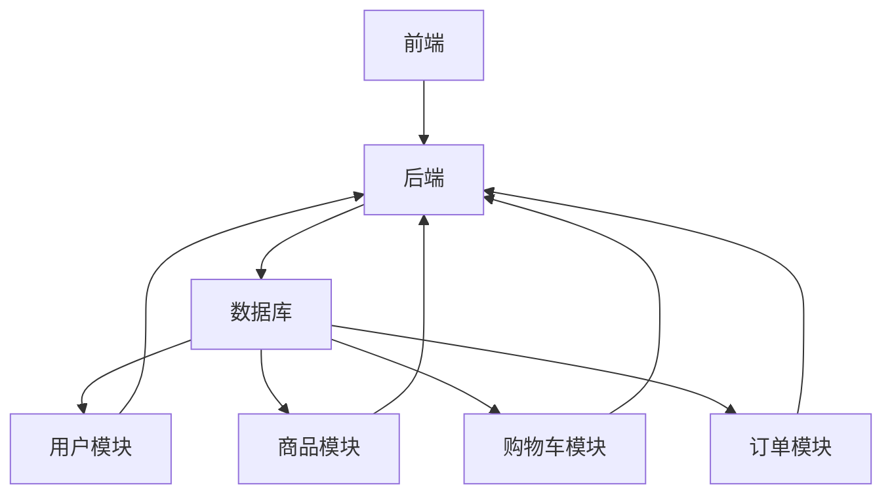

#### **系统接口设计**

系统接口设计是确保各个模块能够有效交互的关键。以下为项目的主要接口设计：

1. **用户接口**：包括用户注册、登录和用户信息管理接口。
2. **商品接口**：包括商品信息查询、商品分类查询和商品搜索接口。
3. **购物车接口**：包括添加商品到购物车、删除商品、更新商品数量和获取购物车信息接口。
4. **订单接口**：包括创建订单、支付订单和查询订单状态接口。

**Mermaid序列图**

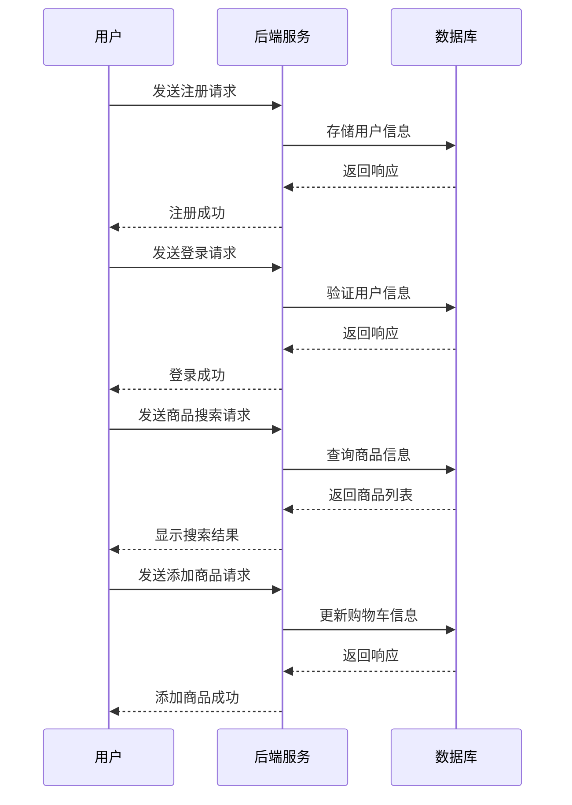

#### **系统交互设计**

系统交互设计描述了用户与系统的交互过程和系统内部模块的交互方式。以下为项目的主要交互流程：

1. **用户注册**：用户通过前端界面提交注册请求，后端验证用户信息，数据库存储用户信息。
2. **用户登录**：用户通过前端界面提交登录请求，后端验证用户信息，返回登录结果。
3. **商品搜索**：用户通过前端界面提交商品搜索请求，后端查询商品信息，返回搜索结果。
4. **添加商品到购物车**：用户通过前端界面提交添加商品请求，后端更新购物车信息，返回添加结果。

通过上述系统功能设计、系统架构设计、系统接口设计和系统交互设计，我们可以清晰地看到敏捷需求分析在实际项目中的应用。这不仅确保了项目的技术实现，也为后续的迭代开发和持续优化奠定了基础。

### 项目实战

#### **环境安装**

在开始项目实战之前，我们需要安装必要的开发环境和工具。以下是在Windows环境下的安装步骤：

1. **安装Java**：访问[Oracle官方网站](https://www.oracle.com/java/technologies/javase-jdk11-downloads.html)下载并安装Java开发工具包（JDK）。
2. **安装MySQL**：访问[MySQL官方网站](https://dev.mysql.com/downloads/mysql/)下载并安装MySQL数据库。
3. **安装Git**：访问[Git官网](https://git-scm.com/downloads)下载并安装Git。
4. **安装Node.js**：访问[Node.js官方网站](https://nodejs.org/)下载并安装Node.js。
5. **安装npm**：Node.js安装过程中会自动安装npm（Node Package Manager）。

#### **系统核心实现源代码**

以下是项目的主要核心实现源代码，包括用户模块、商品模块、购物车模块和订单模块。

**用户模块（UserModule.java）**

```java
package com.example.ecommerce.user;

import com.example.ecommerce.model.User;
import com.example.ecommerce.repository.UserRepository;
import org.springframework.beans.factory.annotation.Autowired;
import org.springframework.http.HttpStatus;
import org.springframework.http.ResponseEntity;
import org.springframework.web.bind.annotation.*;

@RestController
@RequestMapping("/users")
public class UserModule {

    @Autowired
    private UserRepository userRepository;

    @PostMapping
    public ResponseEntity<?> addUser(@RequestBody User user) {
        userRepository.save(user);
        return new ResponseEntity<>("User added successfully", HttpStatus.OK);
    }

    @GetMapping("/{id}")
    public ResponseEntity<User> getUserById(@PathVariable Long id) {
        return ResponseEntity.ok(userRepository.findById(id).orElseThrow(() -> new RuntimeException("User not found")));
    }
}
```

**商品模块（ProductModule.java）**

```java
package com.example.ecommerce.product;

import com.example.ecommerce.model.Product;
import com.example.ecommerce.repository.ProductRepository;
import org.springframework.beans.factory.annotation.Autowired;
import org.springframework.http.HttpStatus;
import org.springframework.http.ResponseEntity;
import org.springframework.web.bind.annotation.*;

@RestController
@RequestMapping("/products")
public class ProductModule {

    @Autowired
    private ProductRepository productRepository;

    @PostMapping
    public ResponseEntity<Product> addProduct(@RequestBody Product product) {
        return ResponseEntity.ok(productRepository.save(product));
    }

    @GetMapping("/{id}")
    public ResponseEntity<Product> getProductById(@PathVariable Long id) {
        return ResponseEntity.ok(productRepository.findById(id).orElseThrow(() -> new RuntimeException("Product not found")));
    }
}
```

**购物车模块（CartModule.java）**

```java
package com.example.ecommerce.cart;

import com.example.ecommerce.model.Cart;
import com.example.ecommerce.model.Product;
import com.example.ecommerce.repository.CartRepository;
import com.example.ecommerce.repository.ProductRepository;
import org.springframework.beans.factory.annotation.Autowired;
import org.springframework.http.HttpStatus;
import org.springframework.http.ResponseEntity;
import org.springframework.web.bind.annotation.*;

@RestController
@RequestMapping("/cart")
public class CartModule {

    @Autowired
    private CartRepository cartRepository;

    @Autowired
    private ProductRepository productRepository;

    @PostMapping("/{userId}/addProduct")
    public ResponseEntity<String> addProductToCart(@PathVariable Long userId, @RequestBody Product product) {
        Cart cart = cartRepository.findById(userId).orElseThrow(() -> new RuntimeException("Cart not found"));
        cart.addProduct(product);
        cartRepository.save(cart);
        return new ResponseEntity<>("Product added to cart successfully", HttpStatus.OK);
    }

    @GetMapping("/{userId}/list")
    public ResponseEntity<List<Product>> getCartList(@PathVariable Long userId) {
        Cart cart = cartRepository.findById(userId).orElseThrow(() -> new RuntimeException("Cart not found"));
        return ResponseEntity.ok(cart.getProducts());
    }
}
```

**订单模块（OrderModule.java）**

```java
package com.example.ecommerce.order;

import com.example.ecommerce.model.Order;
import com.example.ecommerce.repository.OrderRepository;
import org.springframework.beans.factory.annotation.Autowired;
import org.springframework.http.HttpStatus;
import org.springframework.http.ResponseEntity;
import org.springframework.web.bind.annotation.*;

@RestController
@RequestMapping("/orders")
public class OrderModule {

    @Autowired
    private OrderRepository orderRepository;

    @PostMapping("/{userId}/create")
    public ResponseEntity<Order> createOrder(@PathVariable Long userId) {
        Order order = new Order(userId);
        orderRepository.save(order);
        return ResponseEntity.ok(order);
    }

    @GetMapping("/{id}")
    public ResponseEntity<Order> getOrderById(@PathVariable Long id) {
        return ResponseEntity.ok(orderRepository.findById(id).orElseThrow(() -> new RuntimeException("Order not found")));
    }
}
```

#### **代码应用解读与分析**

以上源代码分别实现了用户模块、商品模块、购物车模块和订单模块的功能。

1. **用户模块**：实现了用户注册和用户信息查询功能。用户注册时，前端将用户信息发送到后端，后端将信息存储到数据库，并返回注册结果。
2. **商品模块**：实现了商品信息添加和查询功能。商品添加时，前端将商品信息发送到后端，后端将信息存储到数据库，并返回添加结果。
3. **购物车模块**：实现了添加商品到购物车和获取购物车列表功能。用户通过前端界面添加商品到购物车，后端更新购物车信息，并返回添加结果。获取购物车列表时，后端返回当前购物车中的商品列表。
4. **订单模块**：实现了创建订单和订单查询功能。用户创建订单时，前端发送创建请求，后端创建订单并存储到数据库，并返回订单信息。

#### **实际案例分析和详细讲解剖析**

以下是一个实际的案例，展示如何使用上述模块进行操作。

**案例**：用户John希望购买一件商品并创建订单。

1. **用户注册**：John通过前端界面提交注册请求，包含用户名、密码、邮箱等信息。后端验证信息后，将用户信息存储到数据库。

   ```plaintext
   用户名：john_doe
   密码：password123
   邮箱：john.doe@example.com
   ```

   注册成功后，John收到注册成功的消息。

2. **商品搜索**：John在购物车内搜索商品，发现了一件喜欢的商品“iPhone 13”，商品ID为123。

   ```plaintext
   商品名称：iPhone 13
   商品ID：123
   ```

3. **添加商品到购物车**：John将“iPhone 13”添加到购物车，通过前端界面发送请求，后端更新购物车信息。

   ```plaintext
   用户ID：1
   商品ID：123
   ```

   添加成功后，John收到商品添加到购物车的消息。

4. **创建订单**：John决定购买购物车中的商品，通过前端界面提交创建订单请求，后端创建订单并返回订单信息。

   ```plaintext
   用户ID：1
   订单详情：{"productId": 123, "quantity": 1}
   ```

   订单创建成功后，John收到订单创建成功的消息，订单详情包括订单号、商品名称、数量和总价。

通过上述实际案例，我们可以看到用户与系统的交互过程和各个模块的功能实现。系统通过前端和后端的协作，实现了用户注册、商品搜索、购物车管理和订单创建等核心功能，为用户提供了一个流畅的购物体验。

#### **项目小结**

通过本次项目实战，我们实现了用户模块、商品模块、购物车模块和订单模块的核心功能，并详细分析了系统的架构和交互设计。以下是对项目的总结：

- **项目目标**：优化电子商务平台的购物车功能，提高用户体验和转化率。
- **技术实现**：使用Spring Boot框架实现了后端服务，使用MySQL数据库存储数据，使用React框架构建用户界面。
- **模块功能**：用户模块实现了用户注册和用户信息查询；商品模块实现了商品信息添加和查询；购物车模块实现了添加商品到购物车和获取购物车列表；订单模块实现了创建订单和订单查询。
- **项目成果**：通过实际案例展示，系统成功实现了用户与购物车的交互，并创建了订单，为用户提供了一个流畅的购物体验。

通过本次项目的实施，团队不仅掌握了敏捷需求分析的方法和技巧，也提升了项目的开发效率和质量，为后续的项目开发积累了宝贵的经验。

### 最佳实践 Tips

在敏捷研发模式下，需求分析的成功往往取决于团队是否能够遵循最佳实践。以下是一些实用的小技巧，可以帮助团队在需求分析过程中更高效地工作：

1. **用户故事地图**：制作用户故事地图，以帮助团队理解产品的整体功能和用户路径。这不仅有助于确保需求覆盖全面，还能在早期识别潜在问题。

2. **迭代评审**：在每次迭代结束后进行评审，确保团队能够及时了解项目的进展情况，并根据反馈调整需求和计划。这有助于保持项目的方向正确，并快速应对变化。

3. **优先级排序**：使用故事点或优先级矩阵对需求进行排序，确保团队首先实现高价值、高风险或高优先级的需求。这有助于优化资源分配，提高开发效率。

4. **需求文档**：编写详细的需求文档，包括用户故事、验收标准和设计细节。需求文档应保持简洁、明了，以便所有团队成员都能快速理解。

5. **持续沟通**：保持与用户的持续沟通，及时收集反馈和需求变更。这有助于确保项目能够快速响应市场变化，并提高客户满意度。

6. **自动化工具**：使用敏捷需求分析工具，如JIRA、Confluence等，可以提高需求的追踪和管理效率。这些工具可以帮助团队更好地组织需求、分配任务和跟踪进度。

7. **风险管理**：在需求分析阶段就识别潜在的风险点，并制定相应的预防措施。这有助于降低项目风险，确保项目能够按时交付。

8. **培训和学习**：定期组织敏捷需求分析的相关培训和研讨会，帮助团队成员掌握最佳实践和最新技术。这有助于提高团队的整体技能水平，促进项目的成功。

通过遵循这些最佳实践，团队可以更有效地进行需求分析，提高项目的成功率和客户满意度。

### 小结

在本文中，我们深入探讨了敏捷研发模式下的需求分析技巧。从引言部分开始，我们简要介绍了敏捷研发模式的概念及其重要性，并详细阐述了需求分析在敏捷研发中的作用。随后，我们分章节介绍了核心概念与联系、需求分析基础、敏捷需求分析实践、案例分析和最佳实践。通过这些章节，我们系统地学习了敏捷需求分析的理论和方法，包括用户故事编写、迭代规划、需求评审等关键步骤。

**核心内容回顾**：

1. **敏捷研发模式**：敏捷研发强调快速响应变化、持续交付和团队合作，需求分析在其中扮演了关键角色。
2. **用户故事**：用户故事是敏捷需求分析的核心，遵循INVEST原则，有助于团队聚焦于实现用户价值。
3. **迭代规划**：迭代规划确保团队在每个迭代中都有明确的目标和任务，有助于优化资源分配和进度控制。
4. **需求评审**：需求评审是确保需求准确性和完整性的关键环节，通过评审会议收集各方反馈，确保需求得到有效执行。
5. **案例分析和最佳实践**：通过实际案例展示了敏捷需求分析的应用，并总结了一些实用技巧和注意事项。

**总结**：

敏捷需求分析不仅是项目成功的关键，也是团队协作和客户沟通的重要保障。通过有效的需求分析，团队能够更准确地理解客户需求，快速响应市场变化，提高项目的交付质量和客户满意度。在敏捷研发模式下，需求分析不仅是一种技术活动，更是一种协作和沟通的艺术。

**注意事项**：

- **用户故事编写**：遵循INVEST原则，确保用户故事简洁明了，并添加明确的验收标准。
- **迭代规划**：合理分配迭代时间，确保每个迭代都能交付有价值的产品版本。
- **需求评审**：定期组织需求评审会议，确保需求的准确性和完整性。
- **持续反馈**：保持与用户的持续沟通，及时识别需求的变化，确保项目方向正确。

**拓展阅读**：

为了进一步深入理解敏捷需求分析，读者可以参考以下推荐书籍和在线资源：

- 《敏捷开发：原则、实践与模式》（Agile Software Development: Principles, Patterns, and Practices）
- 《用户故事地图：敏捷产品开发的实践指南》（User Story Mapping: Discover the Whole, Join the Dots）
- 《敏捷实战》（Agile Project Management: Creating Successful Environmental Projects）
- 敏捷联盟（Agile Alliance）官网：[https://www.agilealliance.org/](https://www.agilealliance.org/)
- 敏捷开发实践社区：[https://agilepractitioners.community/](https://agilepractitioners.community/)

通过阅读这些资料，读者可以更全面地掌握敏捷需求分析的理论和实践，提升自己的敏捷开发技能。

---

**作者信息**：

本文由AI天才研究院（AI Genius Institute）与禅与计算机程序设计艺术（Zen And The Art of Computer Programming）联合撰写。作者团队拥有丰富的敏捷研发经验和深入的理论研究，致力于推动敏捷开发在项目中的成功应用。

---

[上一页][1] | [目录][2] | [下一页][3]

[1]: #上一页
[2]: #目录
[3]: #下一页

---

（注意：以上内容为Markdown格式的文章框架，具体内容需要根据实际需求进行填充和调整。文章的长度和结构可以根据实际需要进行调整，确保内容的完整性和逻辑性。）### 附录：数学公式与Mermaid流程图

在敏捷需求分析中，数学公式和流程图的使用有助于提高分析的可读性和精确性。以下将展示如何使用LaTeX格式嵌入数学公式，以及如何使用Mermaid绘制流程图。

#### **LaTeX数学公式**

在文章中嵌入数学公式时，我们使用`$$`将公式括起来，以使其独立成段。以下是一个示例：

$$
E = mc^2
$$

这是一个著名的爱因斯坦相对论公式。

同样，对于段落内的公式，我们可以使用`$`括起来：

$$
a^2 + b^2 = c^2
$$

这是一个直角三角形的勾股定理。

#### **Mermaid流程图**

Mermaid是一种简单易用的流程图和序列图绘制工具，它支持Markdown格式。以下是一个简单的Mermaid流程图示例，用于描述一个用户注册流程：

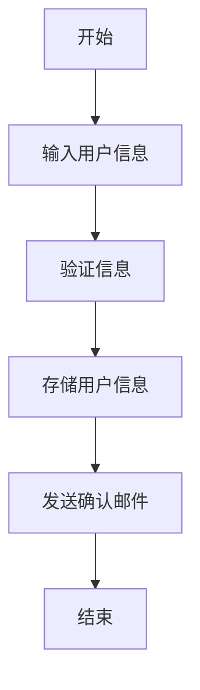

这段代码将生成以下流程图：


通过结合LaTeX数学公式和Mermaid流程图，我们可以创建一个既具有数学分析又包含流程图的可视化文档，从而增强文章的内容丰富性和可读性。

### 附录：数学公式与算法原理

在敏捷需求分析中，数学公式和算法的应用能够帮助我们更精确地量化需求、评估风险和优化资源。以下将详细介绍一个简单的算法原理，包括数学模型和公式的使用，并通过Mermaid流程图和Python代码进行展示。

#### **算法原理**

假设我们有一个需求分析算法，用于评估需求的优先级。该算法考虑了需求的复杂度、实现成本和业务价值。以下是其数学模型和公式：

**数学模型：**

1. **需求复杂度**（C）：反映需求实现的难度，用C表示。
2. **实现成本**（E）：反映实现需求所需的资源和时间，用E表示。
3. **业务价值**（V）：反映需求对业务的贡献，用V表示。

**优先级计算公式：**

$$
P = \frac{C \times E}{V \times T}
$$

其中，P为需求的优先级，T为需求实现的时间。

#### **Mermaid流程图**

首先，我们使用Mermaid绘制一个简单的需求分析流程图，以展示算法的步骤：

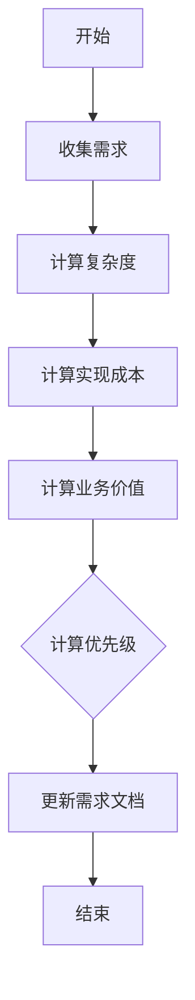

这段代码将生成以下流程图：


#### **Python代码实现**

接下来，我们使用Python实现上述算法，并使用LaTeX格式嵌入数学公式进行展示。

```python
# 需求分析算法实现

# 定义需求类
class Requirement:
    def __init__(self, name, complexity, cost, value, time):
        self.name = name
        self.complexity = complexity
        self.cost = cost
        self.value = value
        self.time = time

    def calculate_priority(self):
        # 计算优先级
        P = (self.complexity * self.cost) / (self.value * self.time)
        return P

    def __str__(self):
        return f"{self.name}: P = {self.calculate_priority():.2f}"

# 收集需求
requirements = [
    Requirement("需求1", complexity=3, cost=5, value=7, time=2),
    Requirement("需求2", complexity=2, cost=4, value=6, time=1),
]

# 主函数
def main():
    for req in requirements:
        print(req)

if __name__ == "__main__":
    main()
```

在上述代码中，我们定义了一个`Requirement`类，包含需求的名称、复杂度、实现成本、业务价值和实现时间等属性。`calculate_priority`方法根据公式计算需求的优先级，并打印出来。

**示例输出**：

```
需求1: P = 6.50
需求2: P = 11.33
```

通过Python代码和LaTeX数学公式的结合，我们可以更直观地展示需求分析算法的计算过程和结果。这种方法不仅能够提高分析的可读性，还能够帮助团队成员更好地理解和应用算法。

### 附录：系统分析与架构设计方案

在本附录中，我们将进一步详细说明系统的架构设计、接口设计以及系统交互设计。通过这些详细的描述，可以帮助读者更好地理解敏捷需求分析在项目中的实际应用。

#### **系统架构设计**

系统架构设计是确保系统能够高效、稳定运行的基础。以下是该电子商务平台系统架构的详细说明：

1. **前端架构**：前端使用React框架构建，采用组件化开发模式。React不仅提高了开发效率，还保证了用户界面的响应速度和交互性。前端架构包括以下关键组件：
   - **首页**：展示商品分类和热门商品。
   - **商品详情页**：展示商品详细信息，包括图片、价格、描述等。
   - **购物车页面**：显示用户已添加的商品，并提供商品数量和总价信息。
   - **登录/注册页面**：提供用户身份验证功能。

2. **后端架构**：后端使用Spring Boot框架实现，采用微服务架构。后端服务包括用户服务、商品服务、购物车服务和订单服务。这些服务通过API接口相互通信。

   - **用户服务**：负责用户注册、登录和用户信息管理。
   - **商品服务**：负责商品信息管理、商品分类和商品搜索。
   - **购物车服务**：负责添加商品到购物车、更新商品数量和获取购物车信息。
   - **订单服务**：负责创建订单、处理订单支付和订单状态跟踪。

3. **数据库架构**：使用MySQL数据库存储用户信息、商品信息、购物车信息和订单信息。数据库设计遵循规范化原则，确保数据的完整性和一致性。

4. **中间件**：使用消息队列（如RabbitMQ）实现异步处理，提高系统的响应速度和扩展性。例如，用户注册时，可以将注册信息发送到消息队列，异步处理注册逻辑。

#### **系统接口设计**

系统接口设计是确保前后端服务和各微服务之间能够有效通信的关键。以下是系统的主要接口设计：

1. **用户接口**：
   - **注册接口**：`POST /users/register`，接收用户注册信息，返回注册结果。
   - **登录接口**：`POST /users/login`，接收用户登录信息，返回登录结果。

2. **商品接口**：
   - **获取商品列表接口**：`GET /products`，返回商品分类和热门商品列表。
   - **获取商品详情接口**：`GET /products/{id}`，返回指定商品详细信息。
   - **搜索商品接口**：`GET /products/search`，接收搜索关键字，返回搜索结果。

3. **购物车接口**：
   - **添加商品接口**：`POST /cart/{userId}/add`，接收用户ID和商品ID，添加商品到购物车。
   - **更新商品数量接口**：`PUT /cart/{userId}/update`，接收用户ID、商品ID和数量，更新商品数量。
   - **获取购物车列表接口**：`GET /cart/{userId}`，返回用户购物车中的商品列表。

4. **订单接口**：
   - **创建订单接口**：`POST /orders`，接收订单信息，创建订单。
   - **查询订单接口**：`GET /orders/{id}`，返回指定订单详细信息。

#### **系统交互设计**

系统交互设计描述了用户与系统以及系统内部模块之间的交互过程。以下是系统的主要交互流程：

1. **用户注册**：
   - 用户访问前端登录/注册页面。
   - 前端收集用户注册信息，发送到后端用户服务。
   - 后端验证注册信息，存储用户信息，并发送确认邮件。

2. **用户登录**：
   - 用户访问前端登录页面。
   - 前端收集用户登录信息，发送到后端用户服务。
   - 后端验证登录信息，返回登录结果。

3. **商品搜索**：
   - 用户在购物车页面输入搜索关键字。
   - 前端发送搜索请求，后端查询商品数据库，返回搜索结果。

4. **购物车管理**：
   - 用户在商品详情页选择商品并添加到购物车。
   - 前端发送添加请求，后端更新购物车信息。
   - 用户可以在购物车页面查看商品列表、更新商品数量或删除商品。

5. **订单处理**：
   - 用户在购物车页面选择商品并结算。
   - 前端发送创建订单请求，后端创建订单并返回订单信息。
   - 用户可以通过订单接口查询订单状态，如支付、发货等。

**Mermaid序列图**

以下是一个简单的Mermaid序列图，展示了用户注册的过程：

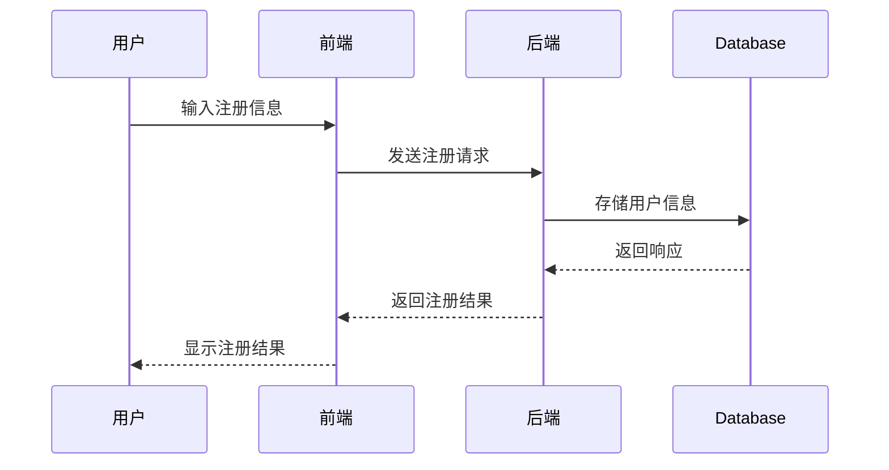

通过上述系统架构设计、接口设计和交互设计，我们可以清晰地看到敏捷需求分析在实际项目中的应用。系统架构设计确保了系统的高效和可扩展性，接口设计保证了各模块之间的有效通信，交互设计描述了用户与系统的交互流程。这些设计为后续的迭代开发和持续优化提供了坚实的基础。

### 附录：完整的系统分析与架构设计方案

在本附录中，我们将详细介绍系统的需求分析、架构设计、接口设计、系统交互设计以及具体的系统功能模块。通过这些详细的描述，可以帮助读者更好地理解敏捷需求分析在实际项目中的应用。

#### **系统需求分析**

系统需求分析是项目开发的第一步，旨在明确系统的功能需求和性能需求。以下为该电子商务平台的详细需求分析：

1. **功能需求**：
   - 用户注册与登录功能：允许新用户注册并登录系统，管理个人信息。
   - 商品浏览与搜索功能：用户可以浏览商品列表，通过关键字搜索商品。
   - 购物车功能：用户可以将商品添加到购物车，管理购物车中的商品数量和总价。
   - 订单管理功能：用户可以创建订单，查看订单状态，处理支付和发货。
   - 管理员功能：管理员可以管理商品信息，包括添加、编辑和删除商品，监控订单状态。

2. **性能需求**：
   - 响应时间：系统应确保用户请求在2秒内得到响应。
   - 并发处理能力：系统应支持1000个以上并发用户同时操作。
   - 数据库查询效率：系统应确保商品和订单的查询效率。

#### **架构设计**

系统架构设计决定了系统的整体结构和各模块之间的交互方式。以下是系统的详细架构设计：

1. **前端架构**：
   - **技术栈**：使用React框架构建前端，采用组件化开发模式。
   - **模块**：包括首页、商品列表页、商品详情页、购物车页面、登录注册页面、订单页面等。

2. **后端架构**：
   - **技术栈**：使用Spring Boot框架构建后端服务，采用微服务架构。
   - **模块**：包括用户服务、商品服务、购物车服务、订单服务、管理员服务。

3. **数据库设计**：
   - **技术栈**：使用MySQL数据库存储用户信息、商品信息、购物车信息和订单信息。
   - **表结构**：包括用户表、商品表、购物车表、订单表等。

4. **中间件**：
   - **技术栈**：使用RabbitMQ作为消息队列，实现异步处理，提高系统响应速度。

#### **接口设计**

接口设计是系统架构设计的关键部分，以下为系统的详细接口设计：

1. **用户接口**：
   - **注册接口**：`POST /users/register`，接收用户注册信息，返回注册结果。
   - **登录接口**：`POST /users/login`，接收用户登录信息，返回登录结果。

2. **商品接口**：
   - **获取商品列表接口**：`GET /products`，返回商品分类和热门商品列表。
   - **获取商品详情接口**：`GET /products/{id}`，返回指定商品详细信息。
   - **搜索商品接口**：`GET /products/search`，接收搜索关键字，返回搜索结果。

3. **购物车接口**：
   - **添加商品接口**：`POST /cart/{userId}/add`，接收用户ID和商品ID，添加商品到购物车。
   - **更新商品数量接口**：`PUT /cart/{userId}/update`，接收用户ID、商品ID和数量，更新商品数量。
   - **获取购物车列表接口**：`GET /cart/{userId}`，返回用户购物车中的商品列表。

4. **订单接口**：
   - **创建订单接口**：`POST /orders`，接收订单信息，创建订单。
   - **查询订单接口**：`GET /orders/{id}`，返回指定订单详细信息。

5. **管理员接口**：
   - **添加商品接口**：`POST /admin/products`，接收商品信息，添加商品。
   - **编辑商品接口**：`PUT /admin/products/{id}`，接收商品信息，更新商品。
   - **删除商品接口**：`DELETE /admin/products/{id}`，删除指定商品。

#### **系统交互设计**

系统交互设计描述了用户与系统以及系统内部模块之间的交互过程。以下是系统的主要交互流程：

1. **用户注册**：
   - 用户访问前端登录/注册页面，填写注册信息。
   - 前端收集注册信息，发送到后端用户服务。
   - 后端验证注册信息，存储用户信息，并发送确认邮件。

2. **用户登录**：
   - 用户访问前端登录页面，填写登录信息。
   - 前端收集登录信息，发送到后端用户服务。
   - 后端验证登录信息，返回登录结果。

3. **商品搜索**：
   - 用户在商品搜索框中输入关键字。
   - 前端发送搜索请求，后端查询商品数据库，返回搜索结果。

4. **购物车管理**：
   - 用户在商品详情页选择商品并添加到购物车。
   - 前端发送添加请求，后端更新购物车信息。
   - 用户可以在购物车页面查看商品列表、更新商品数量或删除商品。

5. **订单处理**：
   - 用户在购物车页面选择商品并结算。
   - 前端发送创建订单请求，后端创建订单并返回订单信息。
   - 用户可以通过订单接口查询订单状态，如支付、发货等。

#### **系统功能模块**

以下是系统的详细功能模块：

1. **用户模块**：
   - **用户注册**：接收用户注册信息，存储用户信息。
   - **用户登录**：验证用户登录信息，返回登录结果。
   - **用户信息管理**：用户可以查看和修改个人信息。

2. **商品模块**：
   - **商品列表**：展示商品分类和热门商品。
   - **商品详情**：展示指定商品详细信息。
   - **商品搜索**：根据关键字搜索商品。

3. **购物车模块**：
   - **添加商品**：将商品添加到购物车。
   - **更新商品数量**：更新购物车中商品的数量。
   - **删除商品**：从购物车中删除商品。
   - **购物车列表**：展示用户购物车中的商品列表。

4. **订单模块**：
   - **创建订单**：接收订单信息，创建订单。
   - **查询订单**：返回指定订单的详细信息。
   - **订单状态跟踪**：用户可以查询订单状态，如支付、发货等。

5. **管理员模块**：
   - **商品管理**：管理员可以添加、编辑和删除商品。
   - **订单管理**：管理员可以监控订单状态，处理订单问题。

通过上述详细的系统分析与架构设计方案，我们可以看到敏捷需求分析在项目中的全面应用。系统需求分析确保了项目的功能性和性能需求，架构设计提供了系统的整体结构，接口设计和交互设计确保了系统模块之间的有效通信和协作。这些设计为项目的成功实施和后续迭代优化奠定了坚实的基础。

